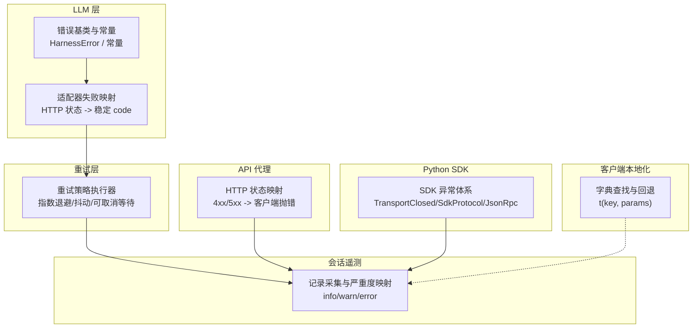
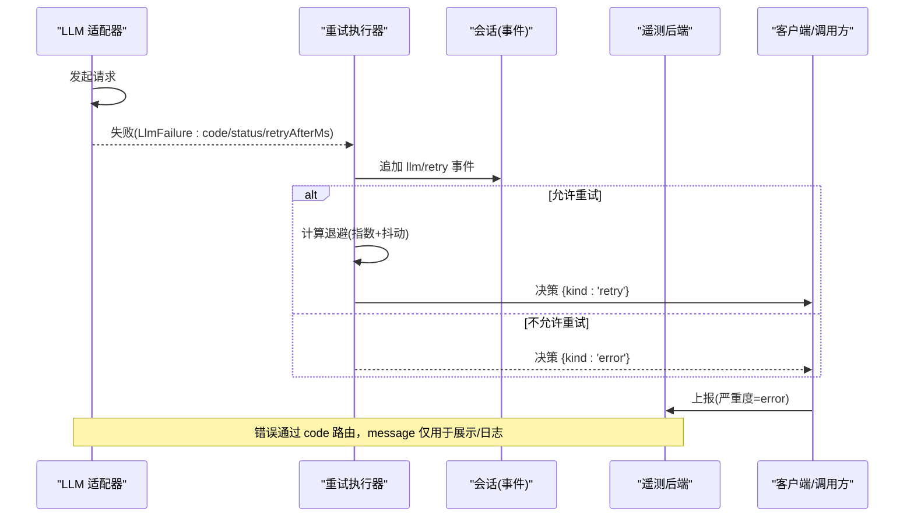
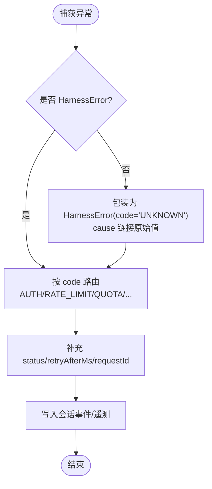
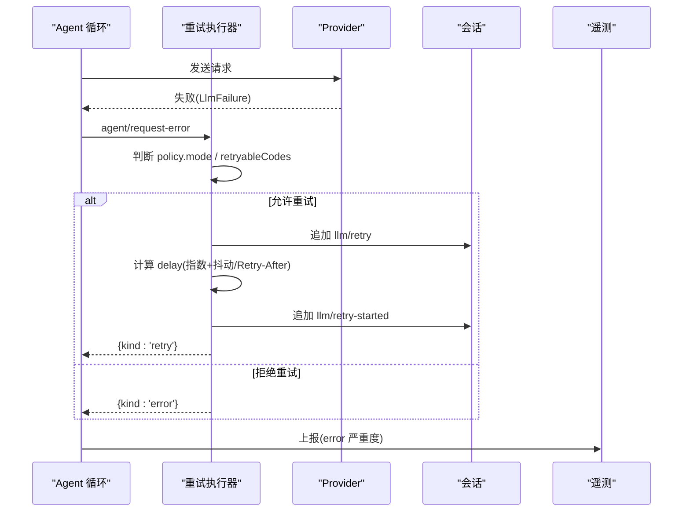
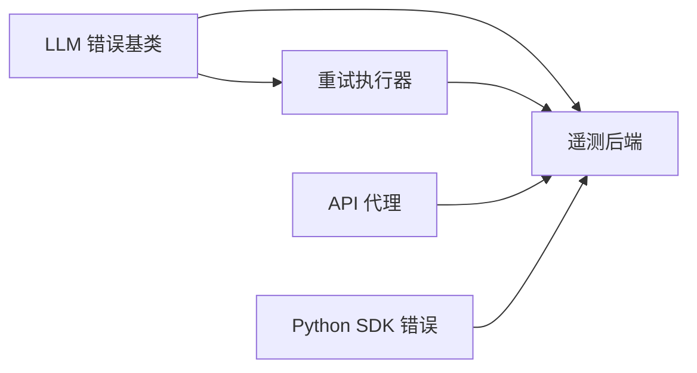

# 错误处理

<cite>
**本文引用的文件**
- [packages/llm/llm/src/error.ts](file://packages/llm/llm/src/error.ts)
- [packages/llm/llm/src/index.ts](file://packages/llm/llm/src/index.ts)
- [packages/llm/llm-retry/src/index.ts](file://packages/llm/llm-retry/src/index.ts)
- [packages/session/session-telemetry/src/index.ts](file://packages/session/session-telemetry/src/index.ts)
- [docs/subsystems/session-telemetry.md](file://docs/subsystems/session-telemetry.md)
- [packages/host/apiproxy/tests/client-handler.spec.ts](file://packages/host/apiproxy/tests/client-handler.spec.ts)
- [python/sdk/src/deepseek_harness/errors.py](file://python/sdk/src/deepseek_harness/errors.py)
- [packages/test-support/client-runtime/src/translate.ts](file://packages/test-support/client-runtime/src/translate.ts)
- [packages/client/locale/src/client/index.ts](file://packages/client/locale/src/client/index.ts)
- [packages/client/locale/tests/locale.client.spec.ts](file://packages/client/locale/tests/locale.client.spec.ts)
- [.agents/notes/implemented/architecture/2026-06-11-structured-error-taxonomy.zh.md](file://.agents/notes/implemented/architecture/2026-06-11-structured-error-taxonomy.zh.md)
- [.agents/notes/implemented/architecture/2026-07-30-client-locale-full-rollout.zh.md](file://.agents/notes/implemented/architecture/2026-07-30-client-locale-full-rollout.zh.md)
</cite>

## 目录
1. [简介](#简介)
2. [项目结构](#项目结构)
3. [核心组件](#核心组件)
4. [架构总览](#架构总览)
5. [详细组件分析](#详细组件分析)
6. [依赖关系分析](#依赖关系分析)
7. [性能考虑](#性能考虑)
8. [故障排查指南](#故障排查指南)
9. [结论](#结论)
10. [附录](#附录)

## 简介
本文件系统化说明 DeepSeek Harness 的错误处理机制，覆盖统一错误响应格式、状态码规范、错误分类与处理策略、本地化与国际化支持、日志记录与监控告警配置、重试机制与熔断式保护、客户端最佳实践、常见错误诊断与解决方案，以及错误追踪与性能分析工具使用方法。目标是帮助开发者以一致的方式捕获、分类、上报和恢复错误，确保可观测性与可维护性。

## 项目结构
围绕错误处理的关键代码分布在以下模块：
- LLM 基础错误模型与类型化异常（dsh-llm）
- 请求重试与退避策略（dsh-llm-retry）
- 会话遥测与告警严重度映射（session-telemetry）
- API 代理的 HTTP 状态映射与客户端抛错（apiproxy）
- Python SDK 的错误类型（Python SDK）
- 客户端本地化能力与错误文案策略（client locale）

图表来源
- [packages/llm/llm/src/error.ts:1-164](file://packages/llm/llm/src/error.ts#L1-L164)
- [packages/llm/llm/src/index.ts:87-117](file://packages/llm/llm/src/index.ts#L87-L117)
- [packages/llm/llm-retry/src/index.ts:99-227](file://packages/llm/llm-retry/src/index.ts#L99-L227)
- [packages/session/session-telemetry/src/index.ts:47-179](file://packages/session/session-telemetry/src/index.ts#L47-L179)
- [packages/host/apiproxy/tests/client-handler.spec.ts:333-344](file://packages/host/apiproxy/tests/client-handler.spec.ts#L333-L344)
- [python/sdk/src/deepseek_harness/errors.py:1-24](file://python/sdk/src/deepseek_harness/errors.py#L1-L24)
- [packages/test-support/client-runtime/src/translate.ts:1-32](file://packages/test-support/client-runtime/src/translate.ts#L1-L32)

章节来源
- [packages/llm/llm/src/error.ts:1-164](file://packages/llm/llm/src/error.ts#L1-L164)
- [packages/llm/llm-retry/src/index.ts:99-227](file://packages/llm/llm-retry/src/index.ts#L99-L227)
- [packages/session/session-telemetry/src/index.ts:47-179](file://packages/session/session-telemetry/src/index.ts#L47-L179)
- [packages/host/apiproxy/tests/client-handler.spec.ts:333-344](file://packages/host/apiproxy/tests/client-handler.spec.ts#L333-L344)
- [python/sdk/src/deepseek_harness/errors.py:1-24](file://python/sdk/src/deepseek_harness/errors.py#L1-L24)
- [packages/test-support/client-runtime/src/translate.ts:1-32](file://packages/test-support/client-runtime/src/translate.ts#L1-L32)

## 核心组件
- 结构化错误基类与常量
  - 提供稳定的机器可读 code 与人类可读 message 分离；支持 cause 链；name 默认子类名；用于跨 seam 传递结构化失败信息。
  - 定义上下文窗口超限、配额耗尽、空响应、无效凭据等标准 code。
- LLM 错误对象
  - 包含 message、code、可选 status/providerRetryAfterMs/requestId 等字段，便于下游重试与路由。
- 重试执行器
  - 基于 provider 配置的 retryPolicy 进行指数退避与抖动；尊重 provider 返回的重试间隔；支持 always 模式与正常模式；可取消等待；事件化记录每次重试。
- 会话遥测
  - 将错误相关事件自动标记为 error 严重度；提供 record 变换管线（脱敏/重命名）；后端实现 emit/flush/shutdown 契约。
- API 代理
  - 将 carrier 失败映射为 HTTP 状态码（如 404/400/500），并在客户端侧抛出传输失败。
- Python SDK 错误
  - 定义 TransportClosedError、SdkProtocolError、JsonRpcError 等，便于上层区分运行时协议错误。
- 客户端本地化
  - 提供 t(key, params) 查找链与回退；错误面保持英文原样以便搜索与上报比对，避免混合语言。

章节来源
- [packages/llm/llm/src/error.ts:1-164](file://packages/llm/llm/src/error.ts#L1-L164)
- [packages/llm/llm/src/index.ts:87-117](file://packages/llm/llm/src/index.ts#L87-L117)
- [packages/llm/llm-retry/src/index.ts:99-227](file://packages/llm/llm-retry/src/index.ts#L99-L227)
- [packages/session/session-telemetry/src/index.ts:47-179](file://packages/session/session-telemetry/src/index.ts#L47-L179)
- [packages/host/apiproxy/tests/client-handler.spec.ts:333-344](file://packages/host/apiproxy/tests/client-handler.spec.ts#L333-L344)
- [python/sdk/src/deepseek_harness/errors.py:1-24](file://python/sdk/src/deepseek_harness/errors.py#L1-L24)
- [packages/test-support/client-runtime/src/translate.ts:1-32](file://packages/test-support/client-runtime/src/translate.ts#L1-L32)
- [packages/client/locale/src/client/index.ts:62-363](file://packages/client/locale/src/client/index.ts#L62-L363)
- [packages/client/locale/tests/locale.client.spec.ts:215-240](file://packages/client/locale/tests/locale.client.spec.ts#L215-L240)
- [.agents/notes/implemented/architecture/2026-07-30-client-locale-full-rollout.zh.md:32-38](file://.agents/notes/implemented/architecture/2026-07-30-client-locale-full-rollout.zh.md#L32-L38)

## 架构总览
下图展示从 LLM 适配器到重试、再到遥测与客户端的整体错误流：

图表来源
- [packages/llm/llm/src/index.ts:87-117](file://packages/llm/llm/src/index.ts#L87-L117)
- [packages/llm/llm-retry/src/index.ts:111-208](file://packages/llm/llm-retry/src/index.ts#L111-L208)
- [packages/session/session-telemetry/src/index.ts:47-179](file://packages/session/session-telemetry/src/index.ts#L47-L179)

## 详细组件分析

### 结构化错误分类与统一响应格式
- 统一错误基类
  - 所有 harness 错误继承自统一的基类，携带稳定 code 与 message，支持 cause 链，便于跨进程/边界传递。
- 标准错误码
  - 上下文窗口超限、配额耗尽、空响应、无效凭据等使用固定 code，避免解析 message。
- 适配器失败映射
  - 将 HTTP 状态码与提供商错误文本映射为稳定的 provider-neutral code（如 AUTH、RATE_LIMIT、QUOTA、SERVER、TIMEOUT、TRANSPORT）。
- 统一响应体
  - 失败结果包含 message、code，以及可选 status、providerRetryAfterMs、requestId，供下游重试与追踪。

图表来源
- [packages/llm/llm/src/error.ts:1-164](file://packages/llm/llm/src/error.ts#L1-L164)
- [.agents/notes/implemented/architecture/2026-06-11-structured-error-taxonomy.zh.md:1-17](file://.agents/notes/implemented/architecture/2026-06-11-structured-error-taxonomy.zh.md#L1-L17)

章节来源
- [packages/llm/llm/src/error.ts:1-164](file://packages/llm/llm/src/error.ts#L1-L164)
- [packages/llm/llm/src/index.ts:87-117](file://packages/llm/llm/src/index.ts#L87-L117)
- [.agents/notes/implemented/architecture/2026-06-11-structured-error-taxonomy.zh.md:1-17](file://.agents/notes/implemented/architecture/2026-06-11-structured-error-taxonomy.zh.md#L1-L17)

### 重试机制与“熔断”式保护
- 策略模式
  - 每个 provider 拥有独立的 retryPolicy；支持 normal（限制最大重试次数与可重试 code 集合）与 always（无条件重试，但忽略下游失败并记录警告）。
- 退避算法
  - 指数退避 + 随机抖动；尊重 provider 返回的 Retry-After 毫秒数；超过上限时降级为本地策略或放弃重试（normal 模式）。
- 可取消等待
  - 使用 AbortSignal 组合生命周期信号，确保插件销毁或会话中止时及时停止等待。
- 事件化与可观测性
  - 每次重试前追加 llm/retry 事件，重试开始时追加 llm/retry-started 事件，便于回放与审计。
- “熔断”式保护
  - 当 provider 返回的 providerRetryAfterMs 超出策略上限时，normal 模式直接放弃重试，避免长时间阻塞；always 模式仍会尝试一次下游决策，但忽略其失败并记录警告。

图表来源
- [packages/llm/llm-retry/src/index.ts:99-227](file://packages/llm/llm-retry/src/index.ts#L99-L227)

章节来源
- [packages/llm/llm-retry/src/index.ts:99-227](file://packages/llm/llm-retry/src/index.ts#L99-L227)

### 错误信息的本地化与国际化支持
- 本地化服务
  - 提供 t(key, params) 查找链，支持多字典合并与键回退；暴露可用语言列表与当前活跃语言。
- 错误文案策略
  - 错误面作为排障面，保持英文原文以便检索与上报比对；避免在 wire 透传串中混入本地化文本。
- 测试支撑
  - 提供 makeTranslate 模拟翻译链，便于单元测试验证模板插值与回退行为。

章节来源
- [packages/test-support/client-runtime/src/translate.ts:1-32](file://packages/test-support/client-runtime/src/translate.ts#L1-L32)
- [packages/client/locale/src/client/index.ts:62-363](file://packages/client/locale/src/client/index.ts#L62-L363)
- [packages/client/locale/tests/locale.client.spec.ts:215-240](file://packages/client/locale/tests/locale.client.spec.ts#L215-L240)
- [.agents/notes/implemented/architecture/2026-07-30-client-locale-full-rollout.zh.md:32-38](file://.agents/notes/implemented/architecture/2026-07-30-client-locale-full-rollout.zh.md#L32-L38)

### 错误日志记录与监控告警配置
- 严重度映射
  - 捕获时将 tool-result 的 isError、turn/end 的 error reason 以及 agent-error 操作记录预映射为 error 严重度；其他事件默认为 info；warn 保留给策略与后端自定义。
- 记录管线
  - 提供 session-telemetry/record 水线，允许监听器对记录进行转换（如脱敏、重命名字段），不影响原始会话日志。
- 后端契约
  - 后端需实现 emit（非阻塞入队）、可选 flush、shutdown（保证队列排空）；共享策略 sharing 向 UI 披露当前上报模式。
- 部署提示
  - 通过挂载不同的后端实现控制上报范围（full/feedback-only/disabled），并在确认界面显示当前策略。

章节来源
- [packages/session/session-telemetry/src/index.ts:47-179](file://packages/session/session-telemetry/src/index.ts#L47-L179)
- [docs/subsystems/session-telemetry.md:59-72](file://docs/subsystems/session-telemetry.md#L59-L72)

### API 代理与客户端错误处理
- 状态码映射
  - 未知方法返回 404；非 JSON 请求体返回 400；实现崩溃返回 500，并通过客户端抛出“传输失败”。
- 客户端最佳实践
  - 根据 HTTP 状态码与错误码进行分类处理；对 4xx 通常不重试；对 5xx 结合 provider 策略决定是否重试；始终记录 requestId 与 code 以便追踪。

章节来源
- [packages/host/apiproxy/tests/client-handler.spec.ts:333-344](file://packages/host/apiproxy/tests/client-handler.spec.ts#L333-L344)

### Python SDK 错误体系
- 异常分层
  - 基类 HarnessError；TransportClosedError（子进程退出/管道关闭）、SdkProtocolError（协议外数据）、JsonRpcError（含 code/message/data）。
- 使用建议
  - 上层按异常类型分支处理；对 JsonRpcError 依据 code 决定重试或提示用户修正输入。

章节来源
- [python/sdk/src/deepseek_harness/errors.py:1-24](file://python/sdk/src/deepseek_harness/errors.py#L1-L24)

## 依赖关系分析
- LLM 错误基类被各适配器与工具层复用，形成稳定的错误语义中心。
- 重试执行器依赖 LLM 失败结构（code/status/retryAfterMs）与 Agent 事件通道。
- 遥测后端依赖会话事件与操作记录，对错误事件自动提升严重度。
- API 代理将底层失败转换为 HTTP 状态码，驱动客户端错误分支。
- Python SDK 错误与 JS 错误体系并行存在，分别服务于不同宿主环境。

图表来源
- [packages/llm/llm/src/error.ts:1-164](file://packages/llm/llm/src/error.ts#L1-L164)
- [packages/llm/llm-retry/src/index.ts:99-227](file://packages/llm/llm-retry/src/index.ts#L99-L227)
- [packages/session/session-telemetry/src/index.ts:47-179](file://packages/session/session-telemetry/src/index.ts#L47-L179)
- [packages/host/apiproxy/tests/client-handler.spec.ts:333-344](file://packages/host/apiproxy/tests/client-handler.spec.ts#L333-L344)
- [python/sdk/src/deepseek_harness/errors.py:1-24](file://python/sdk/src/deepseek_harness/errors.py#L1-L24)

## 性能考虑
- 重试退避应设置合理的初始延迟、最大延迟与抖动比例，避免雪崩。
- 尊重 provider 返回的 Retry-After，减少无效请求。
- 遥测 emit 必须非阻塞，避免影响主循环；必要时使用独立队列与批量导出。
- 错误链渲染仅在诊断/日志路径使用，避免在热路径中进行昂贵字符串拼接。

[本节为通用指导，不直接分析具体文件]

## 故障排查指南
- 认证失败（AUTH）
  - 检查凭据有效性；若为 INVALID_CREDENTIAL，需修正存储值而非重试。
- 速率限制（RATE_LIMIT）
  - 遵循 provider 返回的 providerRetryAfterMs；调整业务并发与节流策略。
- 配额耗尽（QUOTA）
  - 终端错误，不应重试；通知用户升级或释放资源。
- 上下文窗口超限（CONTEXT_WINDOW_EXCEEDED）
  - 裁剪消息长度或启用压缩；避免重复超长请求。
- 网络/传输错误（TRANSPORT/TIMEOUT）
  - 结合重试策略；检查网络质量与超时配置；记录 requestId 与堆栈。
- API 代理错误
  - 404/400/500 对应方法不存在、请求体非法或服务端异常；客户端据此分支处理。
- Python SDK 错误
  - TransportClosedError：检查子进程状态；SdkProtocolError：核对协议版本；JsonRpcError：按 code 处理。

章节来源
- [packages/llm/llm/src/error.ts:1-164](file://packages/llm/llm/src/error.ts#L1-L164)
- [packages/llm/llm/src/index.ts:87-117](file://packages/llm/llm/src/index.ts#L87-L117)
- [packages/host/apiproxy/tests/client-handler.spec.ts:333-344](file://packages/host/apiproxy/tests/client-handler.spec.ts#L333-L344)
- [python/sdk/src/deepseek_harness/errors.py:1-24](file://python/sdk/src/deepseek_harness/errors.py#L1-L24)

## 结论
本项目通过统一的错误基类与稳定 code、标准化的失败结构、可配置的重试策略、自动化的遥测严重度映射，以及清晰的 API 代理状态码映射，构建了端到端的错误处理体系。配合客户端本地化策略与 Python SDK 错误分层，既保证了排障效率，又兼顾了用户体验与可观测性。建议在集成新 provider 或扩展工具时，严格遵循上述错误分类与上报约定，以确保系统的一致性与可维护性。

## 附录
- 术语
  - HarnessError：统一的错误基类
  - LlmFailure：LLM 失败的标准化结构
  - RequestErrorAction：重试/错误决策
  - SessionTelemetryRecord：遥测记录
- 参考
  - 结构化错误分类笔记
  - 客户端本地化策略笔记
  - 会话遥测子系统文档

[本节为概念性内容，不直接分析具体文件]