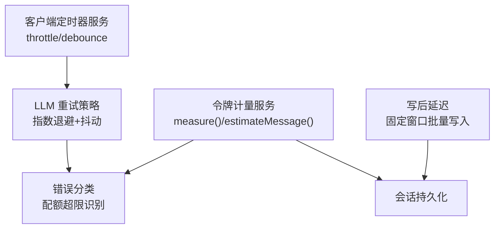
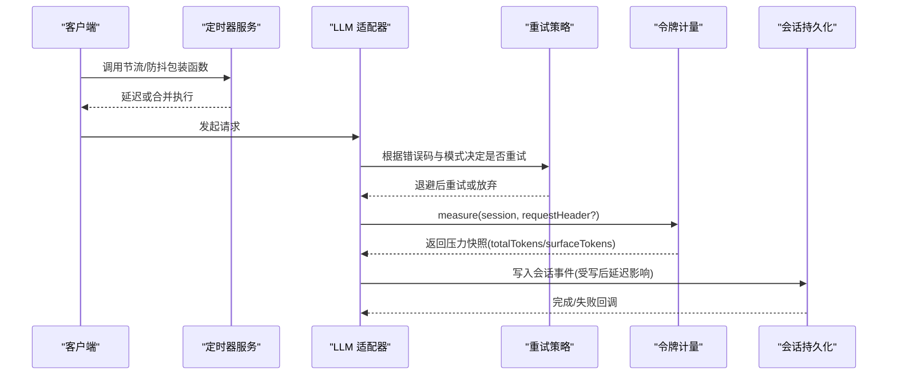
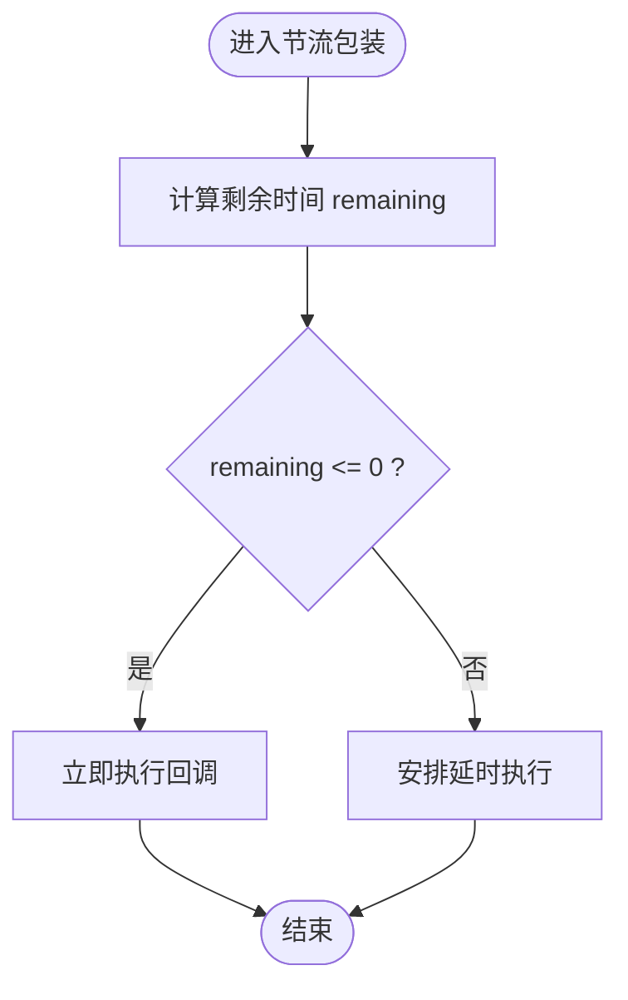
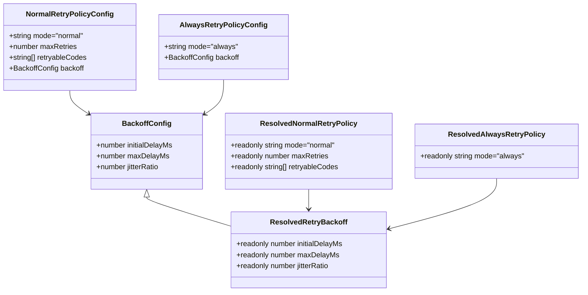
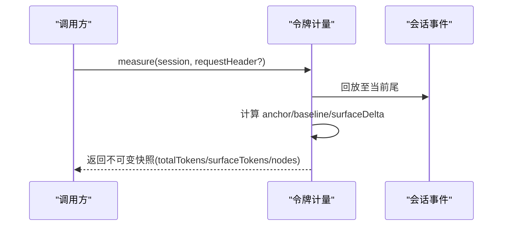
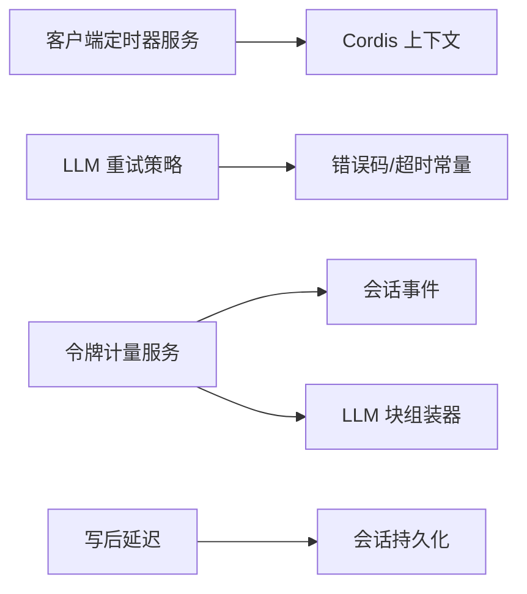

# 限流与防抖

<cite>
**本文引用的文件**
- [packages/extensions/cordis-client-runner/src/client/timer.ts](file://packages/extensions/cordis-client-runner/src/client/timer.ts)
- [packages/llm/llm/src/retry-policy.ts](file://packages/llm/llm/src/retry-policy.ts)
- [packages/llm/token-meter/src/index.ts](file://packages/llm/token-meter/src/index.ts)
- [packages/llm/token-meter/src/types.ts](file://packages/llm/token-meter/src/types.ts)
- [packages/llm/llm/src/error.ts](file://packages/llm/llm/src/error.ts)
- [packages/session/session-persistence/src/write-behind.ts](file://packages/session/session-persistence/src/write-behind.ts)
</cite>

## 目录
1. [简介](#简介)
2. [项目结构](#项目结构)
3. [核心组件](#核心组件)
4. [架构总览](#架构总览)
5. [详细组件分析](#详细组件分析)
6. [依赖关系分析](#依赖关系分析)
7. [性能考量](#性能考量)
8. [故障排查指南](#故障排查指南)
9. [结论](#结论)
10. [附录](#附录)

## 简介
本文件围绕“请求频率限制（限流）”和“调用防抖/节流（防抖）”两大主题，结合仓库中的实际实现，系统说明：
- 请求频率限制的策略与算法：重试退避、配额超限识别、会话级压力计量。
- 不同用户级别的限流配置与配额管理：通过可配置的退避策略与错误分类进行差异化控制。
- 滑动窗口与令牌桶的应用场景：在本地客户端侧的节流/防抖中体现时间窗思想；在分布式场景中建议采用令牌桶或滑动窗口进行全局速率控制。
- 限流规则的配置方法与动态调整机制：基于配置解析与不可变策略对象，支持运行时按路由/提供者维度切换。
- 分布式环境下的限流同步策略：以会话持久化与回放感知计量为基础，提供可扩展的共享状态设计思路。
- 防抖机制的实现与性能优化：浏览器端定时器服务提供的节流与防抖封装，具备生命周期安全与早停能力。
- 限流监控与告警：通过令牌计量投影与压力快照，配合外部监控系统实现阈值告警。
- 最佳实践与调优指南：从参数选择、错误分类、资源占用到回压与降级策略。

## 项目结构
与限流与防抖相关的代码主要分布在以下模块：
- 客户端定时器服务：提供节流与防抖能力，绑定到上下文并随 Fiber 生命周期自动释放。
- LLM 重试策略：定义可配置的指数退避与抖动，支持“正常模式”与“始终重试模式”。
- 令牌计量服务：对会话事件进行回放式折叠，计算当前请求与表层的 token 压力，用于压缩与容量决策。
- 错误分类：识别配额耗尽类错误，区分瞬时速率限制与账户配额限制。
- 写后延迟：固定时间窗口的批量写入，避免频繁 I/O 造成拥塞。

**图表来源**
- [packages/extensions/cordis-client-runner/src/client/timer.ts:172-206](file://packages/extensions/cordis-client-runner/src/client/timer.ts#L172-L206)
- [packages/llm/llm/src/retry-policy.ts:117-191](file://packages/llm/llm/src/retry-policy.ts#L117-L191)
- [packages/llm/token-meter/src/index.ts:100-147](file://packages/llm/token-meter/src/index.ts#L100-L147)
- [packages/llm/llm/src/error.ts:88-100](file://packages/llm/llm/src/error.ts#L88-L100)
- [packages/session/session-persistence/src/write-behind.ts:80-115](file://packages/session/session-persistence/src/write-behind.ts#L80-L115)

**章节来源**
- [packages/extensions/cordis-client-runner/src/client/timer.ts:1-217](file://packages/extensions/cordis-client-runner/src/client/timer.ts#L1-L217)
- [packages/llm/llm/src/retry-policy.ts:1-192](file://packages/llm/llm/src/retry-policy.ts#L1-L192)
- [packages/llm/token-meter/src/index.ts:1-314](file://packages/llm/token-meter/src/index.ts#L1-L314)
- [packages/llm/token-meter/src/types.ts:1-42](file://packages/llm/token-meter/src/types.ts#L1-L42)
- [packages/llm/llm/src/error.ts:88-100](file://packages/llm/llm/src/error.ts#L88-L100)
- [packages/session/session-persistence/src/write-behind.ts:80-115](file://packages/session/session-persistence/src/write-behind.ts#L80-L115)

## 核心组件
- 客户端定时器服务（节流/防抖）
  - 提供 ctx.throttle 与 ctx.debounce，封装为带 dispose 能力的包装函数，随调用 Fiber 生命周期自动清理定时器，避免内存泄漏。
  - 节流使用最近一次执行时间计算剩余等待，支持可选的尾部执行；防抖在静默期结束后执行最后一次调用。
- LLM 重试策略（指数退避+抖动）
  - 支持两种模式：normal（仅对可重试错误码重试，默认包含 RATE_LIMIT、SERVER、TIMEOUT、TRANSPORT 等）与 always（对所有失败重试）。
  - 退避参数包括 initialDelayMs、maxDelayMs、jitterRatio，并进行严格校验与冻结，保证策略不可变且安全。
- 令牌计量服务（会话回放感知）
  - 通过 replay 方式消费会话事件，维护 header、surfaceTokens、anchor 等状态，提供 measure 返回不可变快照。
  - estimateMessage 使用固定启发式估算消息 token，用于 UI 展示与近似容量评估。
- 错误分类（配额超限识别）
  - 通过正则匹配 provider 错误文本，识别“配额/余额/额度/预算耗尽”等终态错误，区别于瞬时速率限制。
- 写后延迟（固定窗口批量写入）
  - 使用固定最大延迟窗口触发后台写入，若已有活跃写入则标记过期并在完成后继续批处理，降低 I/O 压力。

**章节来源**
- [packages/extensions/cordis-client-runner/src/client/timer.ts:172-206](file://packages/extensions/cordis-client-runner/src/client/timer.ts#L172-L206)
- [packages/llm/llm/src/retry-policy.ts:14-24](file://packages/llm/llm/src/retry-policy.ts#L14-L24)
- [packages/llm/llm/src/retry-policy.ts:117-191](file://packages/llm/llm/src/retry-policy.ts#L117-L191)
- [packages/llm/token-meter/src/index.ts:100-147](file://packages/llm/token-meter/src/index.ts#L100-L147)
- [packages/llm/token-meter/src/index.ts:159-181](file://packages/llm/token-meter/src/index.ts#L159-L181)
- [packages/llm/token-meter/src/index.ts:277-310](file://packages/llm/token-meter/src/index.ts#L277-L310)
- [packages/llm/llm/src/error.ts:88-100](file://packages/llm/llm/src/error.ts#L88-L100)
- [packages/session/session-persistence/src/write-behind.ts:80-115](file://packages/session/session-persistence/src/write-behind.ts#L80-L115)

## 架构总览
下图展示了限流与防抖在系统中的协作关系：客户端侧通过节流/防抖控制高频调用；LLM 层通过重试策略与错误分类进行速率与配额保护；令牌计量服务提供会话级压力视图，辅助压缩与容量决策；写后延迟降低持久化压力。

**图表来源**
- [packages/extensions/cordis-client-runner/src/client/timer.ts:172-206](file://packages/extensions/cordis-client-runner/src/client/timer.ts#L172-L206)
- [packages/llm/llm/src/retry-policy.ts:145-191](file://packages/llm/llm/src/retry-policy.ts#L145-L191)
- [packages/llm/token-meter/src/index.ts:100-147](file://packages/llm/token-meter/src/index.ts#L100-L147)
- [packages/session/session-persistence/src/write-behind.ts:80-115](file://packages/session/session-persistence/src/write-behind.ts#L80-L115)

## 详细组件分析

### 客户端定时器服务（节流与防抖）
- 节流（throttle）
  - 记录 lastCall 时间戳，每次调用计算 remaining = delay - (now - lastCall)，若 remaining <= 0 立即执行；否则安排延时执行，支持 noTrailing 抑制尾部执行。
  - 通过 schedule 封装，确保定时器随 Fiber 销毁而清理，避免悬挂任务。
- 防抖（debounce）
  - 在 delay 内多次调用会取消上一次定时器，仅在静默期结束后执行最后一次调用。
  - 同样具备 dispose 能力，便于在组件卸载时提前终止。

**图表来源**
- [packages/extensions/cordis-client-runner/src/client/timer.ts:172-193](file://packages/extensions/cordis-client-runner/src/client/timer.ts#L172-L193)

**章节来源**
- [packages/extensions/cordis-client-runner/src/client/timer.ts:172-206](file://packages/extensions/cordis-client-runner/src/client/timer.ts#L172-L206)

### LLM 重试策略（指数退避与抖动）
- 配置解析与校验
  - 支持 normal 与 always 两种模式；normal 模式需指定 maxRetries 与 retryableCodes，always 模式无上限重试。
  - 退避参数 initialDelayMs、maxDelayMs、jitterRatio 均有限制范围与类型校验，最终冻结为不可变对象。
- 应用场景
  - 针对 RATE_LIMIT、SERVER、TIMEOUT、TRANSPORT 等瞬时错误进行退避重试，避免雪崩。
  - 对于配额耗尽类错误，应通过错误分类识别并停止重试，转为降级或提示。

**图表来源**
- [packages/llm/llm/src/retry-policy.ts:26-79](file://packages/llm/llm/src/retry-policy.ts#L26-L79)
- [packages/llm/llm/src/retry-policy.ts:117-191](file://packages/llm/llm/src/retry-policy.ts#L117-L191)

**章节来源**
- [packages/llm/llm/src/retry-policy.ts:14-24](file://packages/llm/llm/src/retry-policy.ts#L14-L24)
- [packages/llm/llm/src/retry-policy.ts:117-191](file://packages/llm/llm/src/retry-policy.ts#L117-L191)

### 令牌计量服务（会话回放感知）
- 测量流程
  - measure(session, requestHeader?) 同步回放至当前事件尾，维护 anchor（header、surfaceTokens、baseline），返回不可变快照。
  - 若最新成功请求的 canonical header 与传入一致且 provider usage 不低于锚点，则复用 baseline；否则重新估算。
- 表面节点与 token 估算
  - 通过 foldSurfaceTokens 维护 surface 与 surfaceTokens；assistant/message 事件更新 anchor，优先使用 provider usage，否则回退到估计值。
- 复杂度
  - 每次测量克隆带位置信息的节点，时间复杂度 O(surface)；适合在关键路径外或缓存结果使用。

**图表来源**
- [packages/llm/token-meter/src/index.ts:100-147](file://packages/llm/token-meter/src/index.ts#L100-L147)
- [packages/llm/token-meter/src/index.ts:159-181](file://packages/llm/token-meter/src/index.ts#L159-L181)
- [packages/llm/token-meter/src/index.ts:277-310](file://packages/llm/token-meter/src/index.ts#L277-L310)

**章节来源**
- [packages/llm/token-meter/src/index.ts:1-314](file://packages/llm/token-meter/src/index.ts#L1-L314)
- [packages/llm/token-meter/src/types.ts:20-42](file://packages/llm/token-meter/src/types.ts#L20-L42)

### 错误分类（配额超限识别）
- 通过正则匹配 provider 错误文本，识别“配额/余额/额度/预算耗尽”等终态错误，避免对这些错误进行重试。
- 与瞬时速率限制（如 RATE_LIMIT）区分，后者可通过重试策略进行退避处理。

**章节来源**
- [packages/llm/llm/src/error.ts:88-100](file://packages/llm/llm/src/error.ts#L88-L100)

### 写后延迟（固定窗口批量写入）
- 使用固定最大延迟窗口触发后台写入，若已有活跃写入则标记 deadlineExpired，完成后继续批处理。
- 有助于降低频繁 I/O 造成的拥塞，提升整体吞吐。

**章节来源**
- [packages/session/session-persistence/src/write-behind.ts:80-115](file://packages/session/session-persistence/src/write-behind.ts#L80-L115)

## 依赖关系分析
- 客户端定时器服务依赖 Cordis 上下文与服务机制，提供生命周期安全的定时器封装。
- LLM 重试策略依赖超时上限常量与错误码定义，确保退避与重试行为可控。
- 令牌计量服务依赖会话事件模型与 LLM 块组装器，实现回放式折叠与精确估算。
- 错误分类独立于具体适配器，通过文本模式识别配额耗尽错误。
- 写后延迟依赖会话持久化接口，提供固定窗口批处理。

**图表来源**
- [packages/extensions/cordis-client-runner/src/client/timer.ts:1-35](file://packages/extensions/cordis-client-runner/src/client/timer.ts#L1-L35)
- [packages/llm/llm/src/retry-policy.ts:10-24](file://packages/llm/llm/src/retry-policy.ts#L10-L24)
- [packages/llm/token-meter/src/index.ts:7-24](file://packages/llm/token-meter/src/index.ts#L7-L24)
- [packages/session/session-persistence/src/write-behind.ts:80-115](file://packages/session/session-persistence/src/write-behind.ts#L80-L115)

**章节来源**
- [packages/extensions/cordis-client-runner/src/client/timer.ts:1-35](file://packages/extensions/cordis-client-runner/src/client/timer.ts#L1-L35)
- [packages/llm/llm/src/retry-policy.ts:10-24](file://packages/llm/llm/src/retry-policy.ts#L10-L24)
- [packages/llm/token-meter/src/index.ts:7-24](file://packages/llm/token-meter/src/index.ts#L7-L24)
- [packages/session/session-persistence/src/write-behind.ts:80-115](file://packages/session/session-persistence/src/write-behind.ts#L80-L115)

## 性能考量
- 节流/防抖
  - 节流避免高频重复执行，防抖减少无效中间调用；两者均具备 dispose 能力，防止内存泄漏。
  - 建议在 UI 交互、搜索输入、滚动监听等高频场景使用。
- 重试退避
  - 指数退避+抖动可有效缓解瞬时拥塞；合理设置 initialDelayMs、maxDelayMs、jitterRatio 以平衡响应与稳定性。
  - 对配额耗尽错误应立即停止重试，避免浪费资源。
- 令牌计量
  - 测量复杂度 O(surface)，建议在非关键路径或缓存结果；UI 展示可使用 estimateMessage 进行近似估算。
  - 通过 anchor 复用 provider usage，减少重算成本。
- 写后延迟
  - 固定窗口批处理降低 I/O 压力；注意 deadlineExpired 标志与屏障，避免堆积过多待写数据。

[本节为通用性能讨论，不直接分析具体文件]

## 故障排查指南
- 重试策略配置错误
  - 检查 mode、maxRetries、retryableCodes、backoff 字段是否合法；未知键会被拒绝。
  - 确认 initialDelayMs <= maxDelayMs，jitterRatio 在 [0,1] 范围内。
- 配额耗尽错误
  - 通过 isQuotaExceededError 识别终态错误，避免重试；提示用户升级套餐或等待重置。
- 令牌计量异常
  - 若 assistant/message 缺少匹配的 step/start，或 source seq 不合法，将抛出明确错误；检查会话事件完整性。
- 写后延迟堆积
  - 观察 deadlineExpired 与 active 写入状态；若持续过期，检查后端存储性能与并发写入量。

**章节来源**
- [packages/llm/llm/src/retry-policy.ts:111-137](file://packages/llm/llm/src/retry-policy.ts#L111-L137)
- [packages/llm/llm/src/retry-policy.ts:158-191](file://packages/llm/llm/src/retry-policy.ts#L158-L191)
- [packages/llm/llm/src/error.ts:88-100](file://packages/llm/llm/src/error.ts#L88-L100)
- [packages/llm/token-meter/src/index.ts:188-270](file://packages/llm/token-meter/src/index.ts#L188-L270)
- [packages/session/session-persistence/src/write-behind.ts:92-115](file://packages/session/session-persistence/src/write-behind.ts#L92-L115)

## 结论
本仓库在限流与防抖方面提供了多层次保障：
- 客户端侧通过节流/防抖控制高频调用，提升用户体验与资源利用率。
- LLM 层通过重试策略与错误分类，实现速率限制与配额保护的协同。
- 令牌计量服务提供会话级压力视图，支撑压缩与容量决策。
- 写后延迟降低持久化压力，提升整体吞吐。
在实际部署中，建议结合外部监控系统（如 Prometheus/Grafana）采集压力指标，设置阈值告警；并根据业务特性动态调整重试与节流参数，实现弹性限流。

[本节为总结性内容，不直接分析具体文件]

## 附录
- 滑动窗口与令牌桶的应用场景
  - 滑动窗口：适用于需要精确统计单位时间内请求数的场景，如 API 网关层的全局限流。
  - 令牌桶：适用于允许突发流量的场景，如客户端侧的节流与缓冲；本仓库的节流/防抖可视为局部时间窗思想的体现。
- 分布式限流同步策略
  - 建议采用集中式令牌桶（如 Redis + Lua）或滑动窗口计数器，结合会话 ID 或用户 ID 作为分片键，实现跨实例同步。
  - 利用会话持久化与回放感知计量，可在多实例间共享压力状态，避免重复计数。
- 监控与告警配置方法
  - 通过令牌计量服务的投影（tokenUsageProjection、contextPressureProjection）暴露压力指标。
  - 结合外部监控系统采集 totalTokens、surfaceTokens、retry counts、quota exceeded 次数等，设置阈值告警。
- 最佳实践与调优指南
  - 合理设置重试退避参数，避免过度重试导致雪崩。
  - 对配额耗尽错误立即停止重试，转为降级或提示。
  - 在高负载场景下，优先使用节流而非防抖，保证一定吞吐。
  - 定期评估令牌计量结果，调整压缩阈值与保留策略，平衡存储与性能。

[本节为概念性内容，不直接分析具体文件]