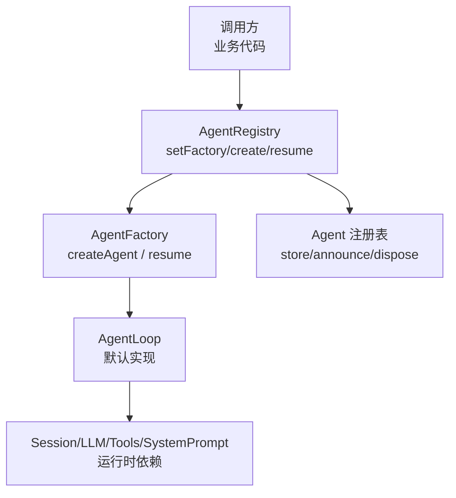
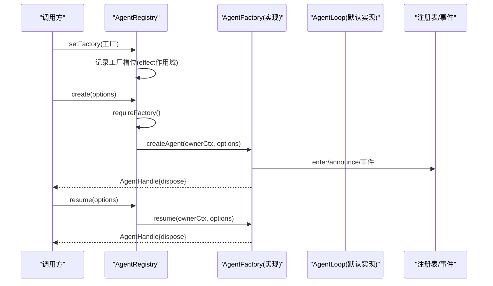
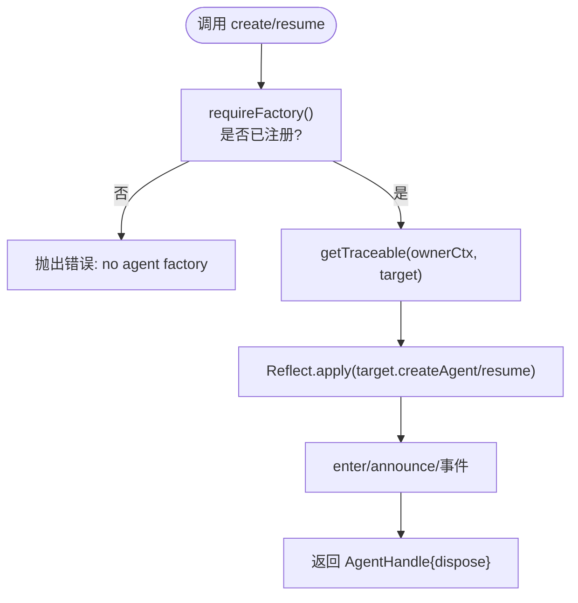
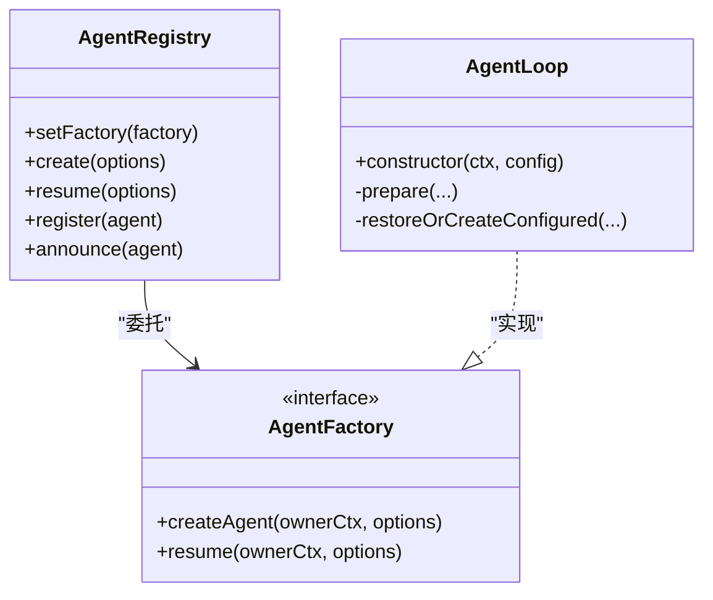
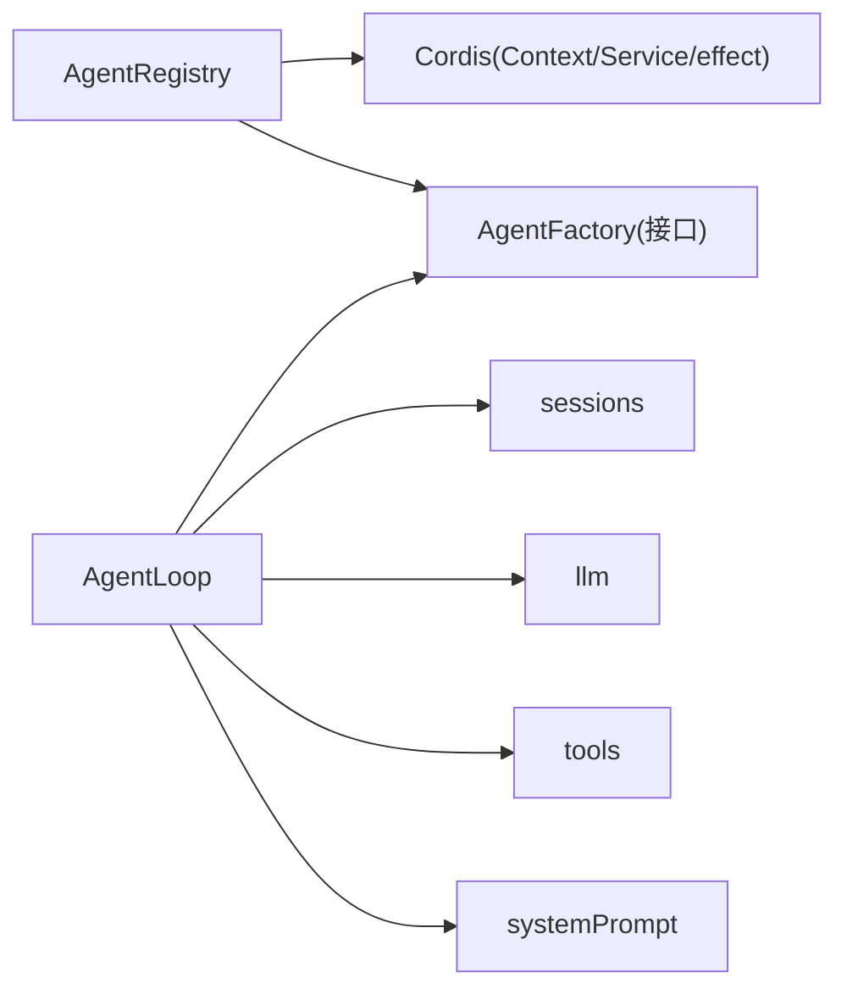

# Agent 工厂模式

<cite>
**本文引用的文件**
- [packages/core/agent/src/index.ts](file://packages/core/agent/src/index.ts)
- [packages/core/agent-loop/src/index.ts](file://packages/core/agent-loop/src/index.ts)
- [packages/core/agent/tests/agent.spec.ts](file://packages/core/agent/tests/agent.spec.ts)
- [packages/host/apiproxy/tests/api-proxy-agent-preset.spec.ts](file://packages/host/apiproxy/tests/api-proxy-agent-preset.spec.ts)
- [packages/host/apiproxy/tests/api-proxy-workspace.spec.ts](file://packages/host/apiproxy/tests/api-proxy-workspace.spec.ts)
</cite>

## 目录
1. [简介](#简介)
2. [项目结构](#项目结构)
3. [核心组件](#核心组件)
4. [架构总览](#架构总览)
5. [详细组件分析](#详细组件分析)
6. [依赖关系分析](#依赖关系分析)
7. [性能考量](#性能考量)
8. [故障排查指南](#故障排查指南)
9. [结论](#结论)
10. [附录：自定义工厂实现与最佳实践](#附录自定义工厂实现与最佳实践)

## 简介
本文件系统性说明 Agent 工厂模式在 deepseek-harness 中的设计与实现，重点围绕 AgentFactory 接口、AgentRegistry 的工厂注册与委托机制、工厂生命周期管理，以及测试与模拟中的应用。文档还包含自定义工厂的实现指南、依赖注入与配置管理的最佳实践，并通过图示展示关键流程。

## 项目结构
- 工厂接口定义位于 agent 核心包，提供 createAgent 与 resume 两个方法，用于创建新 Agent 或从持久化会话恢复 Agent。
- AgentRegistry 作为“服务门面”，负责注册工厂、转发 create/resume 调用、维护 Agent 注册表与事件发布。
- AgentLoop 是默认工厂实现，通过 Cordis 插件机制在构造时自动将自身注册为 AgentFactory，并处理声明式配置的启动与恢复。
- 测试用例展示了如何以简单对象或 Service 形式实现工厂，并通过 setFactory 进行替换，验证上下文追踪与生命周期清理。

图表来源
- [packages/core/agent/src/index.ts:360-430](file://packages/core/agent/src/index.ts#L360-L430)
- [packages/core/agent-loop/src/index.ts:296-381](file://packages/core/agent-loop/src/index.ts#L296-L381)

章节来源
- [packages/core/agent/src/index.ts:177-214](file://packages/core/agent/src/index.ts#L177-L214)
- [packages/core/agent/src/index.ts:256-430](file://packages/core/agent/src/index.ts#L256-L430)
- [packages/core/agent-loop/src/index.ts:296-381](file://packages/core/agent-loop/src/index.ts#L296-L381)

## 核心组件
- AgentFactory 接口
  - createAgent(ownerCtx, options): 基于传入的 sessionId 与可选 setup/meta/agentOptions 创建新 Agent，返回带 dispose 能力的 AgentHandle。
  - resume(ownerCtx, options): 加载持久化会话并恢复 Agent，同样返回可处置的 AgentHandle。
- AgentRegistry
  - setFactory(factory): 注册唯一工厂，使用 effect 作用域管理生命周期；重复注册会抛错；卸载时清空槽位。
  - create(options)/resume(options): 获取已注册工厂并通过 ownerCtx 追踪调用者上下文后，委托给工厂实现。
  - register/enter/announce/list/roots/get/isOwnedBy: 管理 Agent 实例的生命周期与可见性。
- AgentLoop（默认工厂）
  - 在构造中通过 ctx.effect(() => ctx.agents.setFactory(this)) 完成自注册。
  - 支持声明式 agents 配置：按配置项决定直接创建或从 sessionPersistence 恢复。
  - 内部维护 FactoryOwnership，统一处理取消信号、卸载回滚与并发安全。

章节来源
- [packages/core/agent/src/index.ts:177-214](file://packages/core/agent/src/index.ts#L177-L214)
- [packages/core/agent/src/index.ts:360-430](file://packages/core/agent/src/index.ts#L360-L430)
- [packages/core/agent-loop/src/index.ts:296-381](file://packages/core/agent-loop/src/index.ts#L296-L381)

## 架构总览
工厂模式在此处的职责分离如下：
- AgentRegistry 仅暴露 create/resume 与 setFactory 等稳定 API，不关心具体创建细节。
- AgentFactory 抽象了“如何创建/恢复 Agent”的具体策略，允许在不同环境（生产、测试、HMR）替换实现。
- AgentLoop 作为默认实现，封装了与 Session、LLM、Tools、SystemPrompt 等运行时的协作，同时承担声明式配置的启动与恢复。

图表来源
- [packages/core/agent/src/index.ts:360-430](file://packages/core/agent/src/index.ts#L360-L430)
- [packages/core/agent-loop/src/index.ts:296-381](file://packages/core/agent-loop/src/index.ts#L296-L381)

## 详细组件分析

### AgentFactory 接口设计
- 目标：将“创建/恢复 Agent”的策略与“管理/发现 Agent”的职责解耦。
- createAgent(ownerCtx, options)
  - ownerCtx 携带调用方的 fiber 与 scope，确保所有权归属正确。
  - options 包含 sessionId、meta、seed、agentOptions、setup、signal 等，覆盖新建场景所需的全部元数据与副作用边界。
  - 返回 AgentHandle，持有 agent 与 dispose，由所有者负责停止/注销/释放。
- resume(ownerCtx, options)
  - 先加载持久化会话，再执行 setup，最后发布与启动循环。
  - 与 createAgent 保持一致的事务边界与回滚语义。

章节来源
- [packages/core/agent/src/index.ts:177-214](file://packages/core/agent/src/index.ts#L177-L214)

### AgentRegistry：工厂注册与委托
- setFactory(factory)
  - 使用 effect 作用域注册工厂，保证 HMR/卸载时自动清理。
  - 若已有工厂则抛错，避免重复注册。
  - 对 Service 形式的工厂进行“去代理”规范化，避免多层追踪叠加。
- create(options)/resume(options)
  - 通过 requireFactory() 获取工厂，并使用 getTraceable 绑定 ownerCtx，使工厂方法内的上下文追踪指向调用方 fiber。
  - 通过 Reflect.apply 调用工厂方法，保持 this 绑定与追踪链。
- 注册表与事件
  - register/enter/announce 控制 Agent 的进入、公告与销毁，确保事件成对出现（created/disposed）。
  - list/roots/get/isOwnedBy 提供查询能力，区分运行时拥有者与持久化血缘。

图表来源
- [packages/core/agent/src/index.ts:390-430](file://packages/core/agent/src/index.ts#L390-L430)

章节来源
- [packages/core/agent/src/index.ts:360-430](file://packages/core/agent/src/index.ts#L360-L430)

### AgentLoop：默认工厂实现与生命周期
- 自注册
  - 构造中通过 ctx.effect(() => ctx.agents.setFactory(this)) 完成工厂注册，随 fiber 卸载而清理。
- 声明式配置启动
  - 读取 agents 配置，若无 resumeSessionId 则直接创建；否则尝试从 sessionPersistence 恢复，失败则降级为创建。
  - 启动失败通过事件上报，便于上层监控。
- 事务与回滚
  - prepare 阶段建立 AbortController，融合 caller signal 与工厂卸载信号，确保任何中途卸载都能回滚未发布的 Agent。
  - ownership.trackStartup/waitWhileActive 协调并发与生命周期。

图表来源
- [packages/core/agent/src/index.ts:256-430](file://packages/core/agent/src/index.ts#L256-L430)
- [packages/core/agent-loop/src/index.ts:296-489](file://packages/core/agent-loop/src/index.ts#L296-L489)

章节来源
- [packages/core/agent-loop/src/index.ts:296-489](file://packages/core/agent-loop/src/index.ts#L296-L489)

### 测试与模拟中的应用
- 简单工厂桩
  - 测试中通过 stubFactory 构造最小 AgentFactory，仅记录调用参数并返回可处置的 AgentHandle，用于断言行为。
- 上下文追踪验证
  - 验证 setFactory 后 create/resume 的 ownerCtx.fiber 与调用方 fiber 一致，确保所有权归属正确。
- 重复注册与清理
  - 验证第二次 setFactory 抛错；owner 卸载后工厂槽位被清空，后续 create 再次报错。
- Service 形式工厂
  - 验证 Service 形式的工厂会被“去代理”规范化，实际调用落在原始实例上。

章节来源
- [packages/core/agent/tests/agent.spec.ts:358-439](file://packages/core/agent/tests/agent.spec.ts#L358-L439)

## 依赖关系分析
- AgentRegistry 依赖 Cordis 的 Context、Service、effect、symbols 等能力，用于作用域、追踪与生命周期管理。
- AgentLoop 依赖 sessions、llm、tools、systemPrompt 等运行时服务，并在构造时安装系统提示变量与设置项。
- 测试中通过 ctx.plugin(AgentRegistry) 挂载服务，再以 setFactory 注入自定义工厂，形成松耦合的装配方式。

图表来源
- [packages/core/agent/src/index.ts:8-24](file://packages/core/agent/src/index.ts#L8-L24)
- [packages/core/agent-loop/src/index.ts:296-354](file://packages/core/agent-loop/src/index.ts#L296-L354)

章节来源
- [packages/core/agent/src/index.ts:8-24](file://packages/core/agent/src/index.ts#L8-L24)
- [packages/core/agent-loop/src/index.ts:296-354](file://packages/core/agent-loop/src/index.ts#L296-L354)

## 性能考量
- 工厂委托路径短且无额外拷贝：通过 getTraceable 与 Reflect.apply 直接调用，避免深层包装带来的开销。
- 作用域与追踪：仅在必要时进行追踪绑定，减少不必要的代理层。
- 并发与回滚：prepare 阶段提前注册取消与卸载监听，避免资源泄漏与竞态。
- 声明式启动：对配置驱动的 Agent 采用恢复优先策略，减少冷启动成本。

[本节为通用指导，不直接分析具体文件]

## 故障排查指南
- 常见错误
  - “no agent factory registered”：未在上下文中注册工厂，或未加载 agent-loop 插件。
  - “an agent factory is already registered”：重复注册工厂，需确保每个作用域只注册一次。
  - “agent loop is not active”：工厂卸载或 fiber 卸载导致无法创建/恢复。
- 定位建议
  - 检查 setFactory 是否在正确的 effect 作用域内调用。
  - 确认 create/resume 调用发生在工厂槽位有效期间。
  - 查看事件上报（如 agent-loop/config-start-failed）以定位配置驱动启动失败原因。

章节来源
- [packages/core/agent/src/index.ts:216-219](file://packages/core/agent/src/index.ts#L216-L219)
- [packages/core/agent/src/index.ts:372-393](file://packages/core/agent/src/index.ts#L372-L393)
- [packages/core/agent-loop/src/index.ts:384-404](file://packages/core/agent-loop/src/index.ts#L384-L404)

## 结论
Agent 工厂模式在本项目中实现了清晰的职责分离：AgentRegistry 负责稳定的创建/恢复入口与注册表管理，AgentFactory 抽象具体创建策略，AgentLoop 提供默认实现并处理运行时依赖与声明式配置。通过 setFactory 的注册机制，可以在不同环境灵活替换工厂，配合 effect 作用域确保生命周期安全。测试中通过简单工厂桩与服务形式工厂，验证了上下文追踪、重复注册保护与清理行为。该模式也为扩展与集成提供了良好的扩展点。

[本节为总结，不直接分析具体文件]

## 附录：自定义工厂实现与最佳实践

### 如何实现自定义工厂
- 基本步骤
  - 实现 AgentFactory 接口的 createAgent 与 resume 方法。
  - 在合适的 effect 作用域内调用 ctx.agents.setFactory(yourFactory)。
  - 在 createAgent/resume 中完成会话准备、Agent 构建、setup 执行、注册与发布。
- 示例参考
  - 测试中的 stubFactory 展示了最小实现：记录调用参数并返回可处置的 AgentHandle。
  - Service 形式的工厂：继承 Service 并实现 AgentFactory，框架会自动规范化追踪。

章节来源
- [packages/core/agent/tests/agent.spec.ts:358-439](file://packages/core/agent/tests/agent.spec.ts#L358-L439)

### 依赖注入与配置管理
- 依赖注入
  - 工厂可通过 Cordis 的 inject 机制获取 services（如 sessions、llm、tools），在 AgentLoop 中可见其用法。
  - 对于普通对象工厂，ownerCtx 作为显式能力传递，无需依赖注入。
- 配置管理
  - 使用 AgentRegistry.create 的 options.meta 传递 cwd、parentSession、seedLength、origin、delegationDepth、agentPreset 等元数据。
  - 使用 AgentRegistry.resume 的 options.agentOptions 指定模型等 per-agent 选项。
  - 声明式配置：在 AgentLoop 中通过 agents 数组配置 id、sessionId、provider、model、maxTokens、cwd、resumeSessionId 等。

章节来源
- [packages/core/agent/src/index.ts:73-156](file://packages/core/agent/src/index.ts#L73-L156)
- [packages/core/agent-loop/src/index.ts:296-381](file://packages/core/agent-loop/src/index.ts#L296-L381)

### 生命周期管理与清理
- 工厂注册生命周期
  - setFactory 返回 effect disposer，可在复合 effect 中 yield，确保有序清理。
  - 卸载时工厂槽位被清空，后续 create/resume 将报错，防止悬挂引用。
- Agent 生命周期
  - 工厂返回的 AgentHandle.dispose 负责停止循环、注销 Agent、移除会话、回收作用域。
  - 注册表确保 created/disposed 事件成对出现，即使 listener 抛错也能安全回滚。

章节来源
- [packages/core/agent/src/index.ts:360-430](file://packages/core/agent/src/index.ts#L360-L430)
- [packages/core/agent/src/index.ts:432-576](file://packages/core/agent/src/index.ts#L432-L576)

### 测试与模拟最佳实践
- 使用简单工厂桩快速验证行为，避免引入真实运行时依赖。
- 验证 ownerCtx.fiber 与调用方 fiber 一致，确保所有权正确。
- 验证重复注册保护与卸载清理，确保 HMR 与多插件场景下的稳定性。
- 在服务化工厂中，利用 symbols.original 进行“去代理”校验，确保追踪链正确。

章节来源
- [packages/core/agent/tests/agent.spec.ts:358-439](file://packages/core/agent/tests/agent.spec.ts#L358-L439)

### 实际代码示例（路径指引）
- 自定义工厂桩与上下文追踪验证
  - [packages/core/agent/tests/agent.spec.ts:358-439](file://packages/core/agent/tests/agent.spec.ts#L358-L439)
- 在测试中通过 setFactory 注入工厂
  - [packages/host/apiproxy/tests/api-proxy-agent-preset.spec.ts:137](file://packages/host/apiproxy/tests/api-proxy-agent-preset.spec.ts#L137)
  - [packages/host/apiproxy/tests/api-proxy-workspace.spec.ts:101](file://packages/host/apiproxy/tests/api-proxy-workspace.spec.ts#L101)