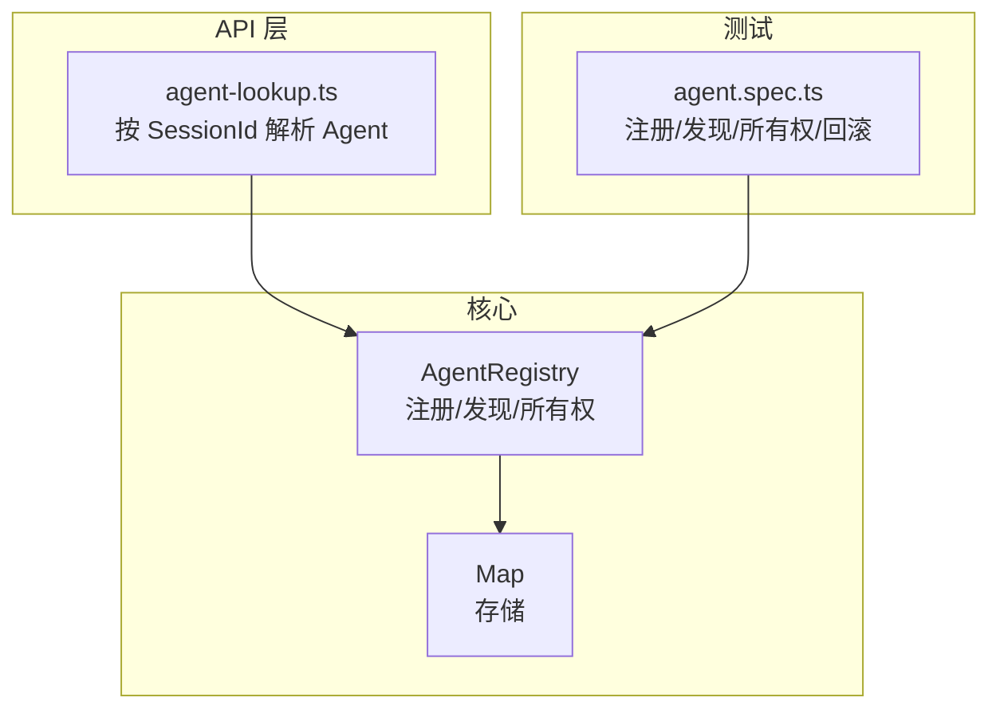
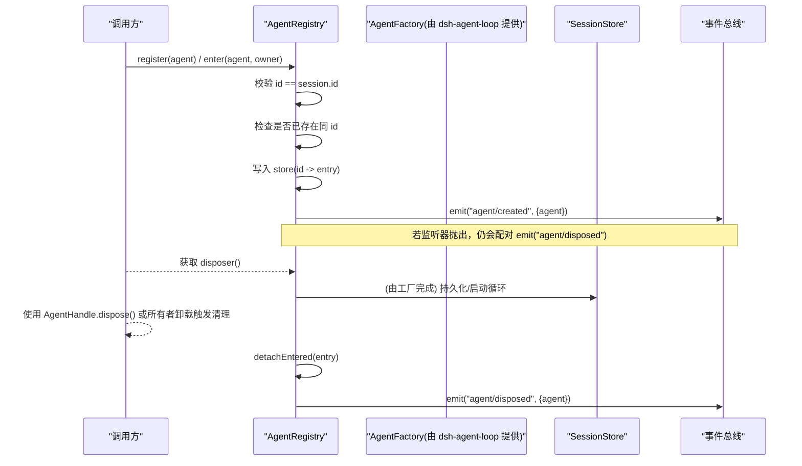
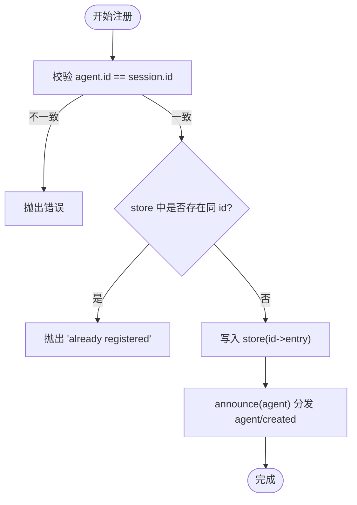
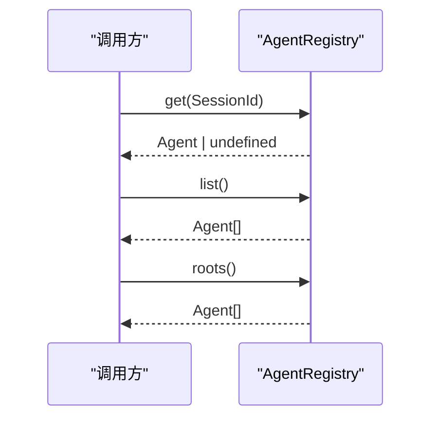
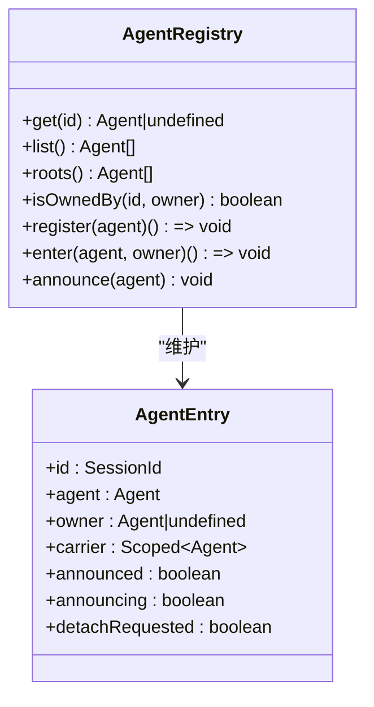
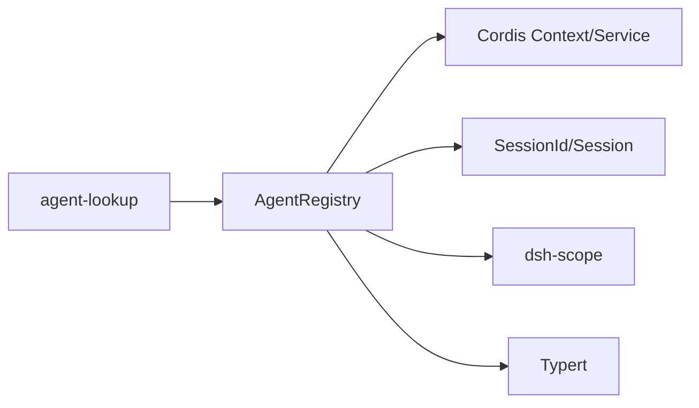

# Agent 注册与发现

<cite>
**本文引用的文件**
- [packages/core/agent/src/index.ts](file://packages/core/agent/src/index.ts)
- [packages/core/agent/tests/agent.spec.ts](file://packages/core/agent/tests/agent.spec.ts)
- [packages/api/remotes/src/agent-lookup.ts](file://packages/api/remotes/src/agent-lookup.ts)
- [docs/subsystems/core.md](file://docs/subsystems/core.md)
- [.agents/notes/implemented/architecture/2026-07-08-agent-scope-contexts.md](file://.agents/notes/implemented/architecture/2026-07-08-agent-scope-contexts.md)
</cite>

## 目录
1. [简介](#简介)
2. [项目结构](#项目结构)
3. [核心组件](#核心组件)
4. [架构总览](#架构总览)
5. [详细组件分析](#详细组件分析)
6. [依赖关系分析](#依赖关系分析)
7. [性能考虑](#性能考虑)
8. [故障排查指南](#故障排查指南)
9. [结论](#结论)
10. [附录：使用示例与最佳实践](#附录使用示例与最佳实践)

## 简介
本文档聚焦于 Agent 的注册与发现机制，围绕 AgentRegistry 类展开，系统说明以下主题：
- Agent 的注册流程、存储管理与生命周期跟踪
- 基于 SessionId 的发现机制（get、roots、list）
- Agent 所有权管理（owner 概念与 isOwnedBy）
- 注册冲突检测与错误处理
- 并发注册场景下的行为与回滚策略
- 实际使用方式与最佳实践

## 项目结构
Agent 注册与发现的核心实现位于 agent 包中，测试用例覆盖关键路径；API 层提供按 SessionId 查找活跃 Agent 的能力；文档与笔记补充了上下文与作用域设计。

图表来源
- [packages/core/agent/src/index.ts:256-704](file://packages/core/agent/src/index.ts#L256-L704)
- [packages/api/remotes/src/agent-lookup.ts:113-134](file://packages/api/remotes/src/agent-lookup.ts#L113-L134)
- [packages/core/agent/tests/agent.spec.ts:171-280](file://packages/core/agent/tests/agent.spec.ts#L171-L280)

章节来源
- [packages/core/agent/src/index.ts:256-704](file://packages/core/agent/src/index.ts#L256-L704)
- [packages/api/remotes/src/agent-lookup.ts:113-134](file://packages/api/remotes/src/agent-lookup.ts#L113-L134)
- [packages/core/agent/tests/agent.spec.ts:171-280](file://packages/core/agent/tests/agent.spec.ts#L171-L280)

## 核心组件
- AgentRegistry：进程内 Agent 的注册中心，负责：
  - 注册与发布（register/enter/announce）
  - 查询与发现（get/list/roots）
  - 所有权判定（isOwnedBy）
  - 生命周期事件（agent/created、agent/disposed）
  - 创建工厂委托（create/resume/setFactory）
  - 发起者作用域（withInitiator/withoutInitiator/currentInitiator/requireInitiator）
- AgentEntry：单条 Agent 的生命周期状态载体（id、agent、owner、carrier、announced/announcing/detachRequested）
- AgentHandle：由 create/resume 返回的“可释放”句柄，持有 agent 并拥有 dispose 能力
- Typert 集成：将 SessionId 映射为 Agent 或 Agent.ctx，便于跨边界查找

章节来源
- [packages/core/agent/src/index.ts:221-242](file://packages/core/agent/src/index.ts#L221-L242)
- [packages/core/agent/src/index.ts:256-704](file://packages/core/agent/src/index.ts#L256-L704)
- [docs/subsystems/core.md:26-47](file://docs/subsystems/core.md#L26-L47)

## 架构总览
AgentRegistry 通过 Map 维护所有活跃 Agent，并以 enter/announce 两阶段保证“先准备后发布”，在 announce 时发出 agent/created；当所有者卸载或显式调用 detach 时，移除条目并配对发出 agent/disposed。对外暴露 get/list/roots/isOwnedBy 等发现接口，并通过 setFactory 委托实际的创建/恢复逻辑给 AgentLoop 插件。

图表来源
- [packages/core/agent/src/index.ts:450-576](file://packages/core/agent/src/index.ts#L450-L576)
- [packages/core/agent/src/index.ts:474-525](file://packages/core/agent/src/index.ts#L474-L525)

章节来源
- [packages/core/agent/src/index.ts:450-576](file://packages/core/agent/src/index.ts#L450-L576)

## 详细组件分析

### AgentRegistry 工作原理
- 存储模型
  - 使用 Map<SessionId, AgentEntry> 保存活跃 Agent
  - AgentEntry 包含运行时 owner、scope carrier 以及 announced/announcing/detachRequested 标志位
- 注册流程
  - register(agent)：包装 effect，内部调用 enter(agent, ctx.agent) 再 announce(agent)
  - enter(agent, owner)：校验 id 与 session.id 一致；若已存在同 id 则抛错；写入 store；返回幂等的 detach 闭包
  - announce(agent)：校验 entry 存在且未宣布；标记 announcing/announced；分发 agent/created；finally 中若 detachRequested 则执行 detach
- 生命周期与回滚
  - 若 created 监听器抛出，detach 会在同步派发结束后触发，确保已观察到的 created 都能配对 disposed
  - 异步创建的失败同样会被捕获并记录警告，不会泄露未处理拒绝
- 发现接口
  - get(id)：按 SessionId 查活体 Agent
  - list()：返回所有活体 Agent（注册顺序）
  - roots()：返回无 owner 的顶层 Agent（注册顺序）
- 所有权
  - isOwnedBy(id, owner)：判断某 Agent 是否在运行时由指定 owner 创建
  - owner 是“运行时创建者”，与持久化的会话血缘无关

章节来源
- [packages/core/agent/src/index.ts:221-242](file://packages/core/agent/src/index.ts#L221-L242)
- [packages/core/agent/src/index.ts:450-576](file://packages/core/agent/src/index.ts#L450-L576)
- [packages/core/agent/src/index.ts:578-617](file://packages/core/agent/src/index.ts#L578-L617)

### 注册流程与冲突检测
- 冲突检测
  - 同一 SessionId 重复注册会立即抛错，避免覆盖
  - 进入前严格校验 agent.id 必须等于 agent.session.id
- 错误处理
  - created 监听器同步抛出：登记后立即回滚，并配对 disposed
  - created/disposed 监听器异步拒绝或同步抛出：统一以 warn 日志记录，不中断主流程
- 并发安全
  - 并发 create/resume 可能同时准备，但只有唯一 entry 能成功 publish；其余失败回滚
  - 分离“进入”和“宣布”两个阶段，保证有序性与一致性

图表来源
- [packages/core/agent/src/index.ts:474-576](file://packages/core/agent/src/index.ts#L474-L576)

章节来源
- [packages/core/agent/src/index.ts:474-576](file://packages/core/agent/src/index.ts#L474-L576)
- [packages/core/agent/tests/agent.spec.ts:171-232](file://packages/core/agent/tests/agent.spec.ts#L171-L232)

### 发现机制（SessionId 查找、roots、list）
- get(sessionId)：直接查 Map，返回活体 Agent 或 undefined
- list()：遍历 store 值，提取 agent 列表（注册顺序）
- roots()：过滤 owner 为 undefined 的条目，得到顶层 Agent（注册顺序）
- API 层复用：remotes 层通过 ctx.agents.get(sessionId) 快速定位活跃 Agent，并对子代理所有权做额外限制

图表来源
- [packages/core/agent/src/index.ts:578-617](file://packages/core/agent/src/index.ts#L578-L617)
- [packages/api/remotes/src/agent-lookup.ts:113-134](file://packages/api/remotes/src/agent-lookup.ts#L113-L134)

章节来源
- [packages/core/agent/src/index.ts:578-617](file://packages/core/agent/src/index.ts#L578-L617)
- [packages/api/remotes/src/agent-lookup.ts:113-134](file://packages/api/remotes/src/agent-lookup.ts#L113-L134)

### 所有权管理（owner 与 isOwnedBy）
- owner 表示“运行时创建者”，即通过哪个 Agent 的作用域上下文创建了该 Agent
- isOwnedBy(childId, parent)：仅在当前 child 处于 live 且其 owner 恰好为 parent 时返回 true
- 用途：
  - 区分不同提供者即使重用相同 id 时的归属关系
  - 在 API 层对子代理访问进行权限控制（例如拒绝子代理拥有的身份被外部直接访问）

图表来源
- [packages/core/agent/src/index.ts:221-242](file://packages/core/agent/src/index.ts#L221-L242)
- [packages/core/agent/src/index.ts:578-617](file://packages/core/agent/src/index.ts#L578-L617)

章节来源
- [packages/core/agent/src/index.ts:578-617](file://packages/core/agent/src/index.ts#L578-L617)
- [packages/core/agent/tests/agent.spec.ts:200-219](file://packages/core/agent/tests/agent.spec.ts#L200-L219)

### 创建与恢复（create/resume）
- setFactory：注册 AgentFactory（dsh-agent-loop），只允许一次注册，卸载时清空
- create(options)：通过工厂创建新 Agent 与 Session，等待 unpublished setup，提交 commit，最终进入并发布
- resume(options)：加载持久化会话，重建 Agent 作用域，等待 setup，再以相同发布序列进入
- 并发约束：同一 SessionId 的并发创建不被支持，仅一个能进入，其余回滚私有范围/会话/驱动

章节来源
- [packages/core/agent/src/index.ts:360-430](file://packages/core/agent/src/index.ts#L360-L430)
- [docs/subsystems/core.md:26-47](file://docs/subsystems/core.md#L26-L47)
- [.agents/notes/implemented/architecture/2026-07-08-agent-scope-contexts.md:119-145](file://.agents/notes/implemented/architecture/2026-07-08-agent-scope-contexts.md#L119-L145)

### 生命周期事件与回滚配对
- agent/created：在 announce 时发出，携带 scopeTarget(agent, agent) 作为载体，确保事件作用域正确
- agent/disposed：在 detachEntered 时发出，保证每个 created 都有对应 disposed
- 监听器异常：
  - created 同步抛出：回滚并配对 disposed
  - created/disposed 异步拒绝或同步抛出：记录 warn，不影响其他监听器

章节来源
- [packages/core/agent/src/index.ts:511-576](file://packages/core/agent/src/index.ts#L511-L576)
- [packages/core/agent/tests/agent.spec.ts:221-256](file://packages/core/agent/tests/agent.spec.ts#L221-L256)

## 依赖关系分析
- AgentRegistry 依赖：
  - Cordis Context/Service/Fiber：用于 effect、事件、作用域与生命周期
  - dsh-session SessionId/Session：标识与日志
  - dsh-scope scopeTarget：为事件与上下文提供作用域载体
  - Typert：将 SessionId 解析为 Agent 或 Agent.ctx
- API 层依赖：
  - remotes/agent-lookup 通过 ctx.agents.get 查找活跃 Agent，并结合子代理所有权规则进行访问控制

图表来源
- [packages/core/agent/src/index.ts:8-18](file://packages/core/agent/src/index.ts#L8-L18)
- [packages/core/agent/src/index.ts:266-298](file://packages/core/agent/src/index.ts#L266-L298)
- [packages/api/remotes/src/agent-lookup.ts:113-134](file://packages/api/remotes/src/agent-lookup.ts#L113-L134)

章节来源
- [packages/core/agent/src/index.ts:8-18](file://packages/core/agent/src/index.ts#L8-L18)
- [packages/core/agent/src/index.ts:266-298](file://packages/core/agent/src/index.ts#L266-L298)
- [packages/api/remotes/src/agent-lookup.ts:113-134](file://packages/api/remotes/src/agent-lookup.ts#L113-L134)

## 性能考虑
- Map 查找 O(1)，get/list/roots 均为轻量操作
- 注册/宣布过程尽量同步，减少不必要的分配
- 事件监听器应避免重计算；异步拒绝/抛出会被捕获并记录，不会阻塞主流程
- 并发 create/resume 仅允许单一成功，其余回滚，避免竞争态导致的额外开销

[本节为通用指导，无需特定文件引用]

## 故障排查指南
- “agent already registered”
  - 原因：尝试注册已存在的 SessionId
  - 处理：确保唯一性或在销毁后重新注册
- “agent id does not match session id”
  - 原因：传入的 agent.id 与 agent.session.id 不一致
  - 处理：构造 Agent 时保持一致
- “not live in this registry / already announced”
  - 原因：announce 调用时机错误或重复
  - 处理：确保先 enter 再 announce，且仅一次
- 监听器异常
  - created/disposed 监听器抛出或拒绝：查看日志中的 warn 信息，定位具体监听器
- 并发冲突
  - 多个 create/resume 竞争同一 SessionId：仅一个成功，其余回滚；检查上游并发控制

章节来源
- [packages/core/agent/src/index.ts:474-576](file://packages/core/agent/src/index.ts#L474-L576)
- [packages/core/agent/tests/agent.spec.ts:171-280](file://packages/core/agent/tests/agent.spec.ts#L171-L280)

## 结论
AgentRegistry 提供了健壮、可组合的 Agent 注册与发现机制：
- 通过 enter/announce 两阶段保障有序发布与回滚
- 提供 get/list/roots 等发现接口，配合 isOwnedBy 实现运行时所有权判定
- 通过 setFactory 解耦创建/恢复逻辑，保持扩展性
- 完善的错误处理与事件配对，确保生命周期一致性与可观测性

[本节为总结性内容，无需特定文件引用]

## 附录：使用示例与最佳实践

- 基本注册与发现
  - 注册：ctx.agents.register(agent)
  - 查找：ctx.agents.get(SessionId)
  - 列出全部：ctx.agents.list()
  - 顶层 Agent：ctx.agents.roots()
  - 所有权判断：ctx.agents.isOwnedBy(childId, parent)

- 创建与恢复
  - 创建：ctx.agents.create({ sessionId, meta?, seed?, agentOptions?, signal?, setup? })
  - 恢复：ctx.agents.resume({ resumeSessionId, agentOptions?, signal?, setup? })
  - 设置工厂：ctx.agents.setFactory(factory)

- 并发注册场景
  - 同一 SessionId 并发 create/resume 不被支持；仅一个能进入，其余回滚
  - 建议在应用层加锁或队列，避免重复竞争

- 事件监听与回滚
  - 订阅 agent/created 与 agent/disposed，确保成对处理
  - 监听器中避免抛出；如必须，请捕获并记录日志

- API 层使用
  - 通过 ctx.agents.get(sessionId) 获取活跃 Agent
  - 对子代理所有权进行校验，防止越权访问

章节来源
- [packages/core/agent/src/index.ts:405-430](file://packages/core/agent/src/index.ts#L405-L430)
- [packages/core/agent/src/index.ts:450-576](file://packages/core/agent/src/index.ts#L450-L576)
- [packages/core/agent/tests/agent.spec.ts:171-280](file://packages/core/agent/tests/agent.spec.ts#L171-L280)
- [packages/api/remotes/src/agent-lookup.ts:113-134](file://packages/api/remotes/src/agent-lookup.ts#L113-L134)