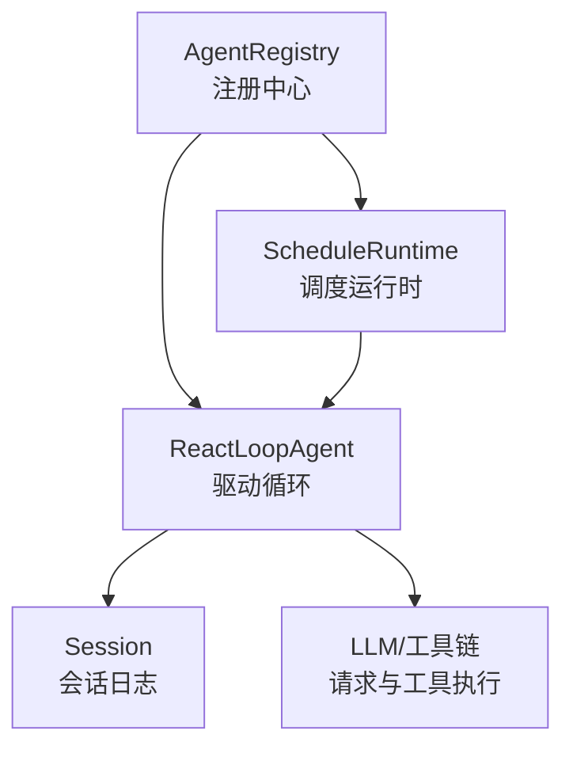
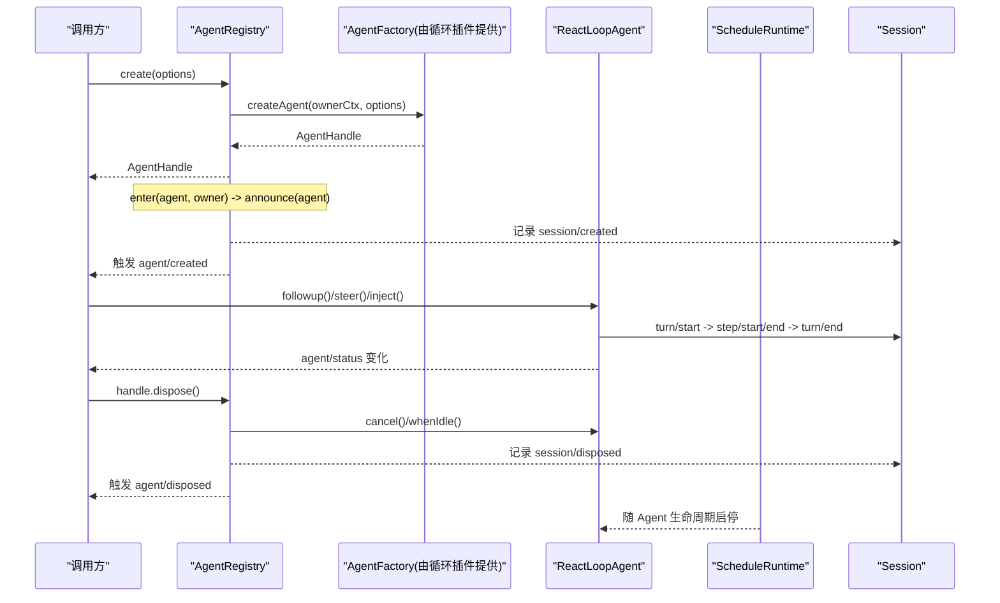
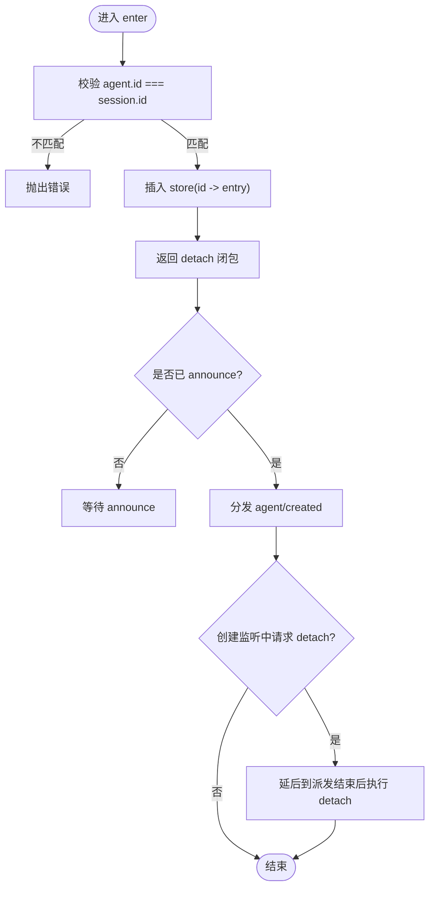
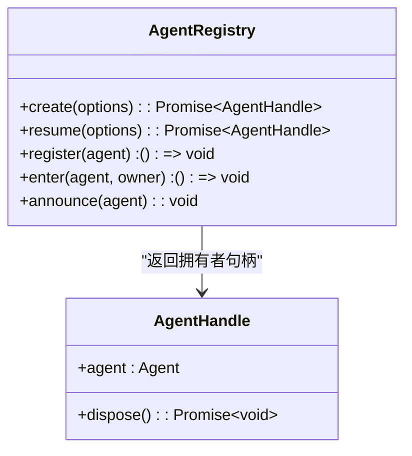
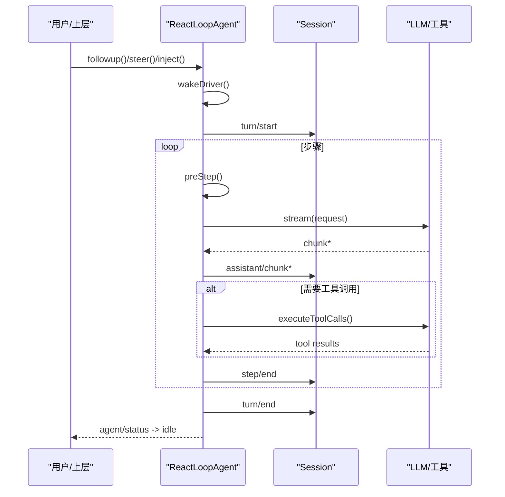
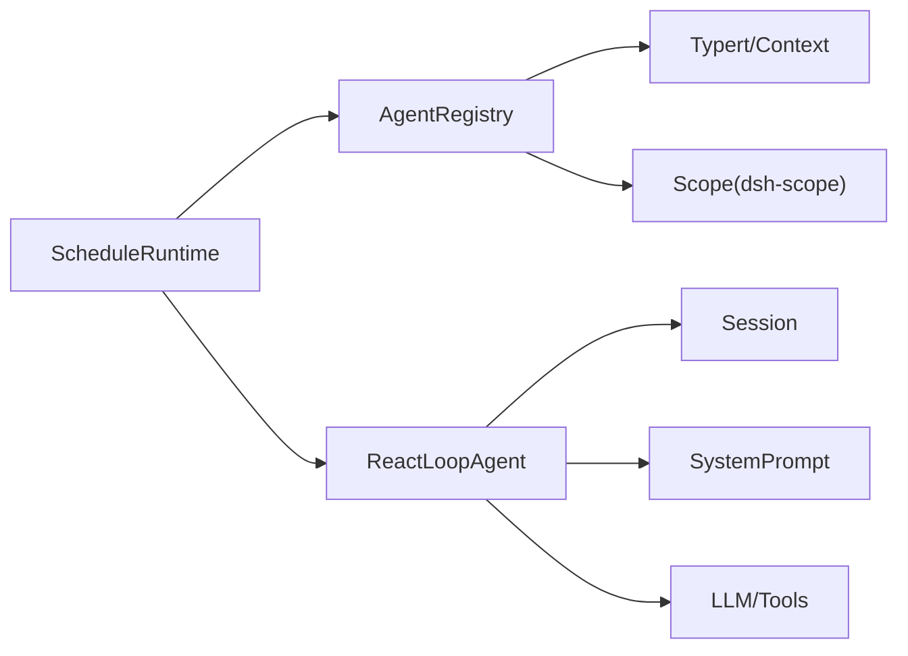

# Agent 生命周期管理

<cite>
**本文引用的文件**
- [packages/core/agent/src/index.ts](file://packages/core/agent/src/index.ts)
- [packages/core/agent-loop/src/agent.ts](file://packages/core/agent-loop/src/agent.ts)
- [packages/core/agent-loop/src/index.ts](file://packages/core/agent-loop/src/index.ts)
- [packages/schedule/schedule/src/index.ts](file://packages/schedule/schedule/src/index.ts)
- [packages/schedule/schedule/src/runtime.ts](file://packages/schedule/schedule/src/runtime.ts)
- [packages/goal/tool-goal/tests/tool-goal.spec.ts](file://packages/goal/tool-goal/tests/tool-goal.spec.ts)
- [packages/core/agent/tests/agent.spec.ts](file://packages/core/agent/tests/agent.spec.ts)
- [packages/core/agent-loop/tests/scope-lifecycle.spec.ts](file://packages/core/agent-loop/tests/scope-lifecycle.spec.ts)
- [docs/agent-lifecycle.md](file://docs/agent-lifecycle.md)
</cite>

## 目录
1. [简介](#简介)
2. [项目结构](#项目结构)
3. [核心组件](#核心组件)
4. [架构总览](#架构总览)
5. [详细组件分析](#详细组件分析)
6. [依赖关系分析](#依赖关系分析)
7. [性能考量](#性能考量)
8. [故障排查指南](#故障排查指南)
9. [结论](#结论)
10. [附录：示例与最佳实践](#附录示例与最佳实践)

## 简介
本文件系统化说明 Agent 的完整生命周期，覆盖从创建、启动到销毁的全过程。重点包括：
- create()、resume()、register()、dispose() 的职责与调用时机
- AgentHandle 的作用与所有权模式
- 启动过程中的 setup 执行时机与提交机制
- 清理过程：资源释放、事件监听器移除、上下文清理
- 生命周期事件：agent/created、agent/disposed 等
- 实际使用示例与异常处理建议

## 项目结构
Agent 生命周期由“注册中心 + 驱动循环 + 外部子系统”协作完成：
- AgentRegistry（注册中心）：负责工厂委托、进入/宣布/注销、事件分发、所有者追踪
- ReactLoopAgent（驱动循环）：实现 Agent 接口，驱动 turn/step、消息入队、状态切换、错误上报
- 外部子系统（如 Schedule）：订阅 agent/created 并建立自身生命周期绑定

图表来源
- [packages/core/agent/src/index.ts:256-707](file://packages/core/agent/src/index.ts#L256-L707)
- [packages/core/agent-loop/src/agent.ts:64-497](file://packages/core/agent-loop/src/agent.ts#L64-L497)
- [packages/schedule/schedule/src/index.ts:44-77](file://packages/schedule/schedule/src/index.ts#L44-L77)

章节来源
- [packages/core/agent/src/index.ts:256-707](file://packages/core/agent/src/index.ts#L256-L707)
- [packages/core/agent-loop/src/agent.ts:64-497](file://packages/core/agent-loop/src/agent.ts#L64-L497)
- [packages/schedule/schedule/src/index.ts:44-77](file://packages/schedule/schedule/src/index.ts#L44-L77)

## 核心组件
- AgentRegistry：提供 create/resume/register/announce/enter/get/list/roots 等方法，维护 Agent 实例表、作用域载体、创建者归属、初始化边界与事件分发。
- AgentHandle：持有 Agent 与 dispose() 能力，是“能力型”拥有者令牌；仅持有者可安全终止该 Agent。
- ReactLoopAgent：实现 Agent 接口，封装运行阶段（idle/maintenance/running），驱动 turn/step，维护 inbox，发出 agent/status 等事件。
- 外部子系统（以 Schedule 为例）：在 agent/created 时建立与 Agent 绑定的资源与监听，并在 Agent 销毁时自动清理。

章节来源
- [packages/core/agent/src/index.ts:158-175](file://packages/core/agent/src/index.ts#L158-L175)
- [packages/core/agent/src/index.ts:256-707](file://packages/core/agent/src/index.ts#L256-L707)
- [packages/core/agent-loop/src/agent.ts:64-497](file://packages/core/agent-loop/src/agent.ts#L64-L497)
- [packages/schedule/schedule/src/index.ts:44-77](file://packages/schedule/schedule/src/index.ts#L44-L77)

## 架构总览
下图展示 Agent 从创建到销毁的关键路径与事件流：

图表来源
- [packages/core/agent/src/index.ts:405-430](file://packages/core/agent/src/index.ts#L405-L430)
- [packages/core/agent/src/index.ts:450-576](file://packages/core/agent/src/index.ts#L450-L576)
- [packages/core/agent-loop/src/agent.ts:113-200](file://packages/core/agent-loop/src/agent.ts#L113-L200)
- [packages/schedule/schedule/src/index.ts:44-77](file://packages/schedule/schedule/src/index.ts#L44-L77)

## 详细组件分析

### AgentRegistry：创建、恢复、注册与注销
- create(options)：通过已注册的 AgentFactory.createAgent 创建新 Agent，完成后返回 AgentHandle。setup 在发布前执行，commit 在发布前同步执行，确保观察者不会看到半配置状态。
- resume(options)：加载持久化会话并恢复 Agent，同样遵循 setup/commit 与有序发布。
- register(agent)：将已构造的 Agent 插入存储并发布 agent/created；返回精确的 Cordis effect disposer，用于按序卸载。
- enter(agent, owner)：高级原语，先插入未发布的 Agent，返回 detach 闭包；在 announce 之前可安全回滚。
- announce(agent)：标记为已宣布，分发 agent/created；若创建监听中请求了 detach，则在派发结束后延迟执行。
- emitDisposed(entry)：分发 agent/disposed，失败被捕获并记录警告。

图表来源
- [packages/core/agent/src/index.ts:474-576](file://packages/core/agent/src/index.ts#L474-L576)

章节来源
- [packages/core/agent/src/index.ts:405-430](file://packages/core/agent/src/index.ts#L405-L430)
- [packages/core/agent/src/index.ts:450-576](file://packages/core/agent/src/index.ts#L450-L576)
- [packages/core/agent/src/index.ts:527-540](file://packages/core/agent/src/index.ts#L527-L540)

### AgentHandle：所有权与 dispose()
- AgentHandle 包含 agent 与 dispose()，是“能力型”拥有者令牌；只有持有者能终止该 Agent。
- dispose() 会停止循环、等待退出、注销 Agent、移除 Session、解绑作用域世界。
- 当工厂提供者卸载时，也会停止并排空其产生的所有句柄。

图表来源
- [packages/core/agent/src/index.ts:158-175](file://packages/core/agent/src/index.ts#L158-L175)
- [packages/core/agent/src/index.ts:405-430](file://packages/core/agent/src/index.ts#L405-L430)

章节来源
- [packages/core/agent/src/index.ts:158-175](file://packages/core/agent/src/index.ts#L158-L175)

### ReactLoopAgent：启动、运行与清理
- 启动：send/followup/steer/inject 将消息入队；wakeDriver 在空闲时开启 running 阶段，设置 abort 控制器，并通过 withInitiator(this) 调用内部 kick() 驱动 turn/step。
- 运行：turn 打开 turn/start，preStep 组装上下文与消息，step 构建 LLM 请求并流式写入 assistant/chunk，必要时执行工具调用，最终关闭 step/end、turn/end。
- 清理：cancel() 清空 inbox（可选）、中止当前活动；whenIdle() 等待活动结束；status 在 idle/maintenance/running 间切换并广播 agent/status。

图表来源
- [packages/core/agent-loop/src/agent.ts:113-200](file://packages/core/agent-loop/src/agent.ts#L113-L200)
- [packages/core/agent-loop/src/agent.ts:225-330](file://packages/core/agent-loop/src/agent.ts#L225-L330)
- [packages/core/agent-loop/src/agent.ts:332-401](file://packages/core/agent-loop/src/agent.ts#L332-L401)

章节来源
- [packages/core/agent-loop/src/agent.ts:64-497](file://packages/core/agent-loop/src/agent.ts#L64-L497)

### 启动流程中的 setup 与提交机制
- setup：在创建或恢复过程中，于 mint 出 agentCtx 之后、插入/宣布 session 与 agent 之前执行。所有注册（工具、提示段、变量、restrict、监听、子插件）在此作用域内完成。
- commit：setup 可返回同步 commit，在所有 await  settle 之后、发布之前调用，用于在发布边界做最终校验。
- 回滚：setup 抛错、commit 抛错或所有者被销毁，都会回滚作用域且不发布任何 id。

章节来源
- [packages/core/agent/src/index.ts:114-132](file://packages/core/agent/src/index.ts#L114-L132)
- [packages/core/agent/src/index.ts:146-155](file://packages/core/agent/src/index.ts#L146-L155)

### 清理过程：资源释放、监听移除、上下文清理
- AgentRegistry：detachEntered 删除条目，若已宣布则分发 agent/disposed；announce 的 finally 块处理创建监听中的延迟 detach。
- ReactLoopAgent：cancel 清空 inbox 并中止活动；kick finally 重置阶段；whenIdle 等待活动结束。
- 外部子系统（以 Schedule 为例）：在 agent/created 时注册工具与状态监听，并在 Agent 作用域 effect 中返回清理函数，保证 Agent 销毁时统一回收。

章节来源
- [packages/core/agent/src/index.ts:512-576](file://packages/core/agent/src/index.ts#L512-L576)
- [packages/core/agent-loop/src/agent.ts:134-200](file://packages/core/agent-loop/src/agent.ts#L134-L200)
- [packages/schedule/schedule/src/index.ts:44-77](file://packages/schedule/schedule/src/index.ts#L44-L77)

### 生命周期事件
- agent/created：在 announce 时分发，携带 agent；可在监听中请求延迟 detach。
- agent/disposed：在 detachEntered 且已宣布时分发，携带 agent；监听失败会被捕获并记录警告。
- agent/status：在状态切换时由驱动循环分发（idle/running）。
- agent/session-start：由循环插件在启动时分发（见测试用例）。

章节来源
- [packages/core/agent/src/index.ts:561-576](file://packages/core/agent/src/index.ts#L561-L576)
- [packages/core/agent/src/index.ts:527-540](file://packages/core/agent/src/index.ts#L527-L540)
- [packages/core/agent/tests/agent.spec.ts:171-188](file://packages/core/agent/tests/agent.spec.ts#L171-L188)

## 依赖关系分析
- AgentRegistry 依赖 Cordis 服务框架、Typert 查找与上下文注入、dsh-scope 作用域。
- ReactLoopAgent 依赖 dsh-session、dsh-system-prompt、dsh-llm 以及工具执行管线。
- Schedule 子系统依赖 AgentRegistry 的事件与 roots 查询，并在 Agent 作用域内注册清理逻辑。

图表来源
- [packages/core/agent/src/index.ts:266-298](file://packages/core/agent/src/index.ts#L266-L298)
- [packages/core/agent-loop/src/agent.ts:80-97](file://packages/core/agent-loop/src/agent.ts#L80-L97)
- [packages/schedule/schedule/src/index.ts:44-77](file://packages/schedule/schedule/src/index.ts#L44-L77)

章节来源
- [packages/core/agent/src/index.ts:266-298](file://packages/core/agent/src/index.ts#L266-L298)
- [packages/core/agent-loop/src/agent.ts:80-97](file://packages/core/agent-loop/src/agent.ts#L80-L97)
- [packages/schedule/schedule/src/index.ts:44-77](file://packages/schedule/schedule/src/index.ts#L44-L77)

## 性能考量
- 避免在 setup 中进行耗时操作；setup 应在发布前快速完成，复杂工作放入 runMaintenance 或后台任务。
- 合理使用 whenIdle 与 runMaintenance，避免阻塞主循环。
- 控制 inbox 大小与消息替换策略，减少重复计算与内存占用。
- 利用 agent/request 与 agent/pre-step 水线进行早期拒绝与压力控制，降低无效模型调用。

[本节为通用指导，无需特定文件引用]

## 故障排查指南
- 无工厂错误：在未注册 AgentFactory 时调用 create/resume 会报错。需确保加载了 agent-loop 插件。
- 重复注册：同一 id 的 Agent 不能重复注册；enter 时会校验冲突。
- 身份不一致：agent.id 必须等于 session.id，否则 enter 抛错。
- 创建监听中的异常：agent/created 监听器的同步抛错会阻止发布；异步拒绝会被捕获并记录警告。
- 销毁监听异常：agent/disposed 监听器的异常会被捕获并记录警告，不会中断其他监听。
- 所有者提前销毁：若在 setup 期间所有者 fiber 被卸载，创建将被中止并回滚。

章节来源
- [packages/core/agent/src/index.ts:216-219](file://packages/core/agent/src/index.ts#L216-L219)
- [packages/core/agent/src/index.ts:474-483](file://packages/core/agent/src/index.ts#L474-L483)
- [packages/core/agent/src/index.ts:561-576](file://packages/core/agent/src/index.ts#L561-L576)
- [packages/core/agent/src/index.ts:527-540](file://packages/core/agent/src/index.ts#L527-L540)
- [packages/core/agent-loop/tests/scope-lifecycle.spec.ts:695-726](file://packages/core/agent-loop/tests/scope-lifecycle.spec.ts#L695-L726)

## 结论
Agent 生命周期围绕“注册中心 + 驱动循环 + 外部子系统”协同工作。通过 create/resume 完成创建与恢复，通过 register/enter/announce 控制发布顺序，通过 AgentHandle.dispose() 安全终止。setup/commit 确保发布边界的原子性与一致性，事件体系（agent/created、agent/disposed、agent/status）贯穿全生命周期。正确理解这些机制，有助于编写健壮、可维护的 Agent 应用。

[本节为总结性内容，无需特定文件引用]

## 附录：示例与最佳实践

- 基本创建与销毁
  - 通过 ctx.agents.create 创建 Agent，获得 AgentHandle；在不再需要时调用 handle.dispose() 安全终止。
  - 参考路径：[packages/core/agent/tests/agent.spec.ts:171-188](file://packages/core/agent/tests/agent.spec.ts#L171-L188)

- 恢复持久化会话
  - 通过 ctx.agents.resume 加载持久化会话并恢复 Agent；setup 中可补充运行时配置。
  - 参考路径：[packages/core/agent/src/index.ts:417-430](file://packages/core/agent/src/index.ts#L417-L430)

- 手动注册与事件观察
  - 使用 ctx.agents.register 注册已有 Agent，并在 agent/created 与 agent/disposed 中观察生命周期。
  - 参考路径：[packages/core/agent/tests/agent.spec.ts:171-188](file://packages/core/agent/tests/agent.spec.ts#L171-L188)

- 在创建监听中延迟分离
  - 在 agent/created 监听中调用 detach 能力，会在派发结束后执行，确保顺序一致。
  - 参考路径：[packages/core/agent/tests/agent.spec.ts:282-298](file://packages/core/agent/tests/agent.spec.ts#L282-L298)

- 外部子系统绑定与清理
  - Schedule 在 agent/created 时建立运行时，并在 Agent 作用域 effect 中返回清理函数，确保 Agent 销毁时统一回收。
  - 参考路径：[packages/schedule/schedule/src/index.ts:44-77](file://packages/schedule/schedule/src/index.ts#L44-L77)

- 驱动循环交互
  - 通过 followup/steer/inject 向 Agent 发送消息；使用 whenIdle 等待空闲；使用 runMaintenance 执行后台任务。
  - 参考路径：[packages/core/agent-loop/src/agent.ts:113-200](file://packages/core/agent-loop/src/agent.ts#L113-L200)

- 常见异常场景
  - 无工厂、重复注册、身份不一致、创建监听异常、所有者提前销毁等。
  - 参考路径：[packages/core/agent/src/index.ts:216-219](file://packages/core/agent/src/index.ts#L216-L219)、[packages/core/agent/src/index.ts:474-483](file://packages/core/agent/src/index.ts#L474-L483)、[packages/core/agent-loop/tests/scope-lifecycle.spec.ts:695-726](file://packages/core/agent-loop/tests/scope-lifecycle.spec.ts#L695-L726)

- 文档参考
  - 回合与步骤的生命周期序列图与事件说明。
  - 参考路径：[docs/agent-lifecycle.md:1-83](file://docs/agent-lifecycle.md#L1-L83)