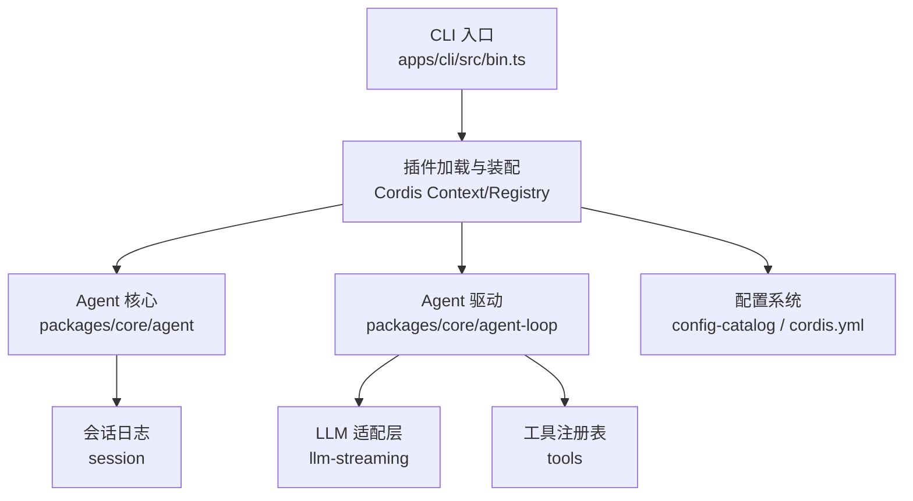
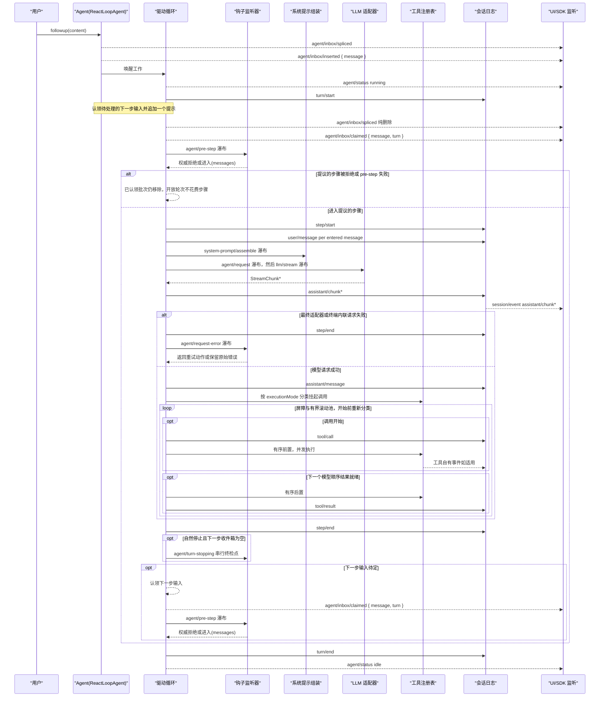
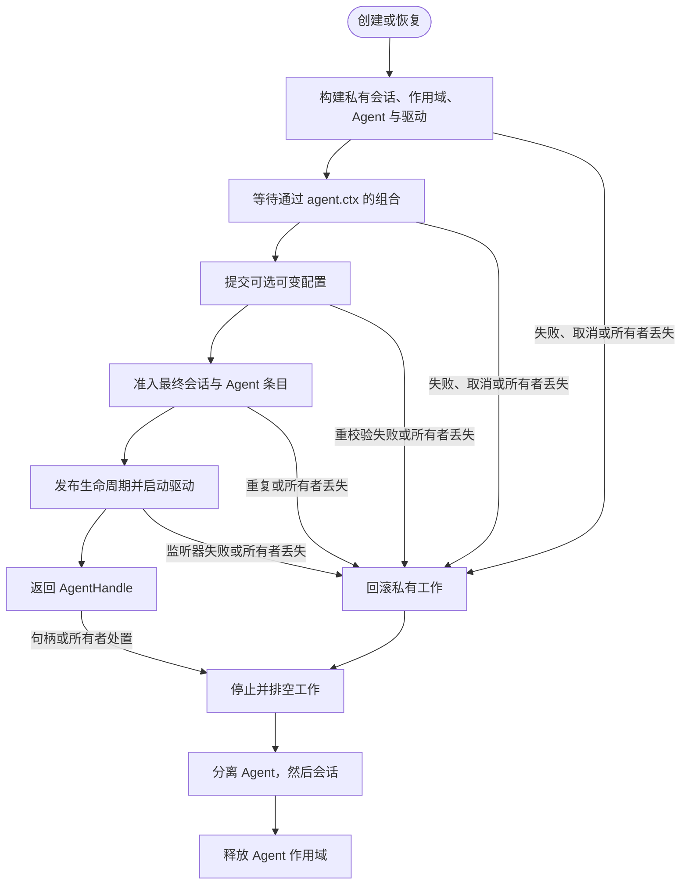
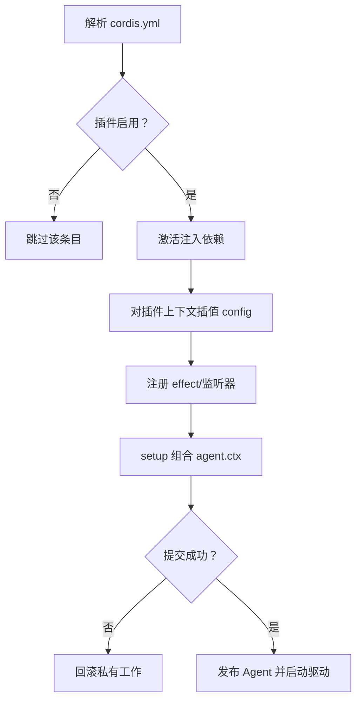
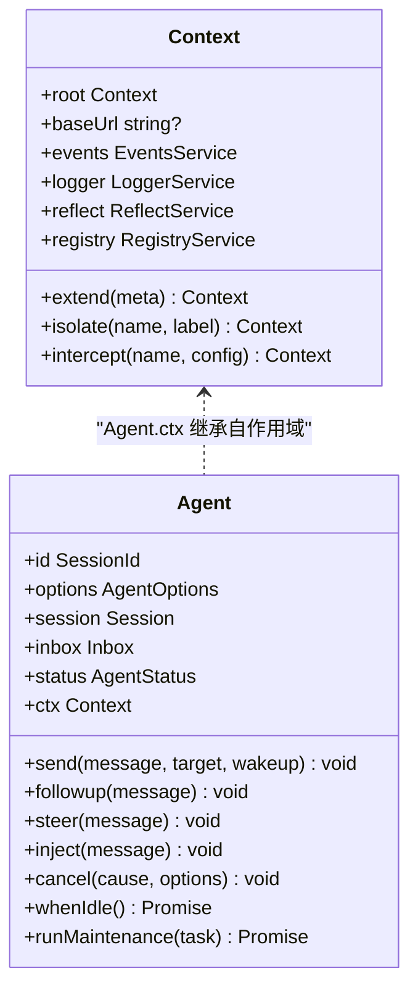
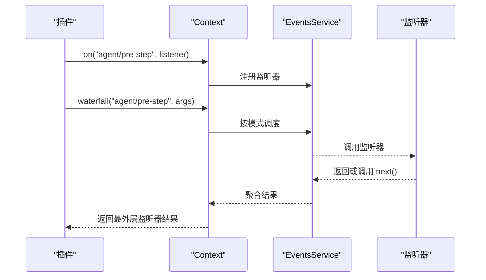
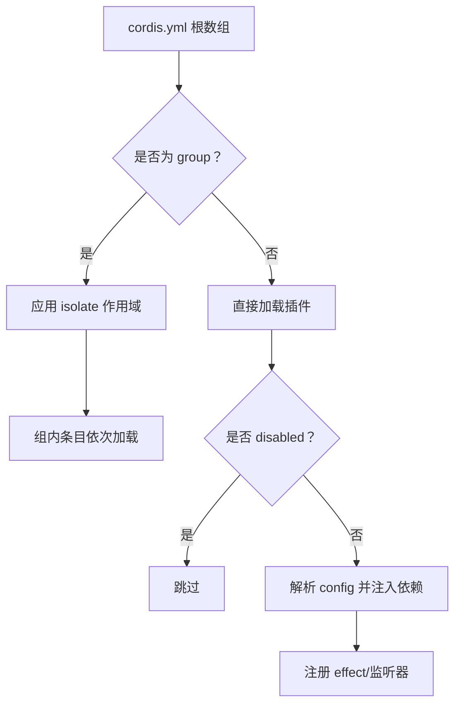
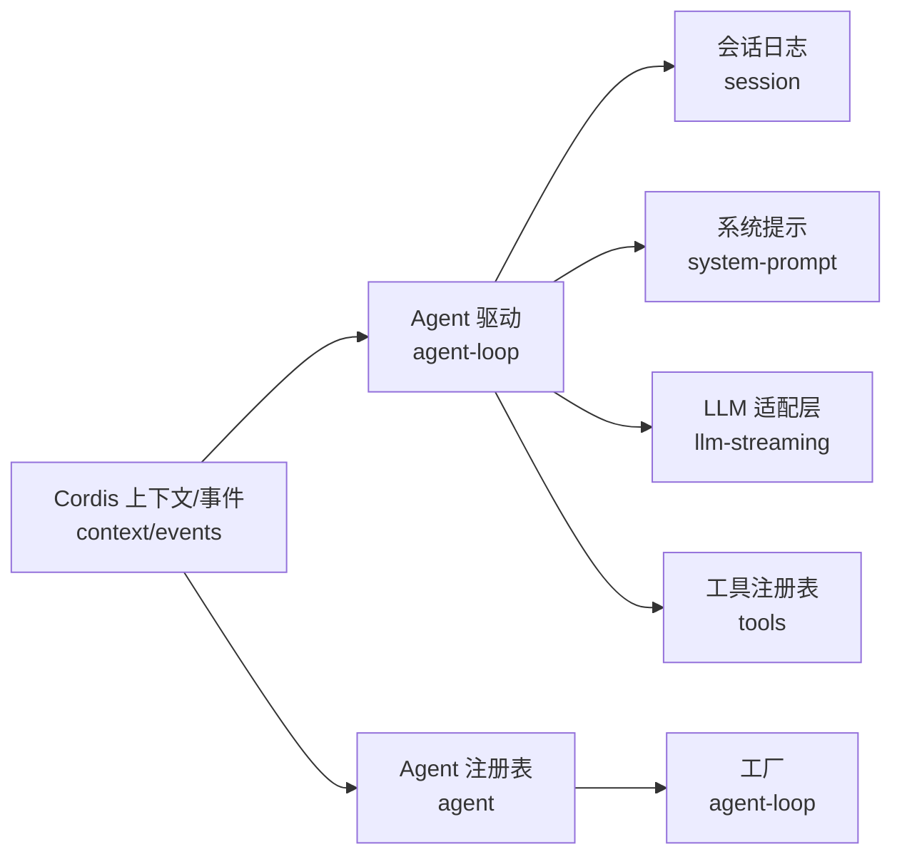

# Agent 管理系统

<cite>
**本文引用的文件**
- [apps/cli/src/bin.ts](file://apps/cli/src/bin.ts)
- [packages/core/agent-loop/src/agent.ts](file://packages/core/agent-loop/src/agent.ts)
- [packages/core/agent-loop/src/index.ts](file://packages/core/agent-loop/src/index.ts)
- [packages/core/agent/src/index.ts](file://packages/core/agent/src/index.ts)
- [docs/subsystems/core.md](file://docs/subsystems/core.md)
- [docs/cordis-primer.md](file://docs/cordis-primer.md)
- [docs/cordis-api/context.md](file://docs/cordis-api/context.md)
- [docs/cordis-api/events.md](file://docs/cordis-api/events.md)
- [examples/headless-agent/cordis.yml](file://examples/headless-agent/cordis.yml)
- [apps/cli/config/agent-presets/standard/agent.cordis.yml](file://apps/cli/config/agent-presets/standard/agent.cordis.yml)
- [docs/config-catalog.md](file://docs/config-catalog.md)
- [docs/agent-lifecycle.md](file://docs/agent-lifecycle.md)
</cite>

## 目录
1. [简介](#简介)
2. [项目结构](#项目结构)
3. [核心组件](#核心组件)
4. [架构总览](#架构总览)
5. [详细组件分析](#详细组件分析)
6. [依赖关系分析](#依赖关系分析)
7. [性能考量](#性能考量)
8. [故障排查指南](#故障排查指南)
9. [结论](#结论)
10. [附录](#附录)

## 简介
本文件系统化说明 DeepSeek Harness 中的 Agent 管理系统，覆盖 Agent 的注册、发现与生命周期管理；Agent 的创建流程（配置解析、依赖注入与服务初始化）；上下文传播机制；事件处理机制（订阅、发布与处理流程）；Agent 配置（cordis.yml 结构与选项）；调试与监控方法；以及性能优化建议。文档同时提供实际代码示例路径，帮助读者快速定位实现细节。

## 项目结构
- CLI 入口负责按模式动态加载子模块（如 profile、plugin、dump-config），为 Agent 运行提供进程级启动能力。
- Agent 核心由 packages/core/agent 与 packages/core/agent-loop 组成：前者定义 Agent 接口、注册表与发起者作用域；后者提供默认驱动实现，驱动会话轮次与步骤。
- Cordis 插件框架通过 context、events、registry 等 API 完成服务装配、事件分发与插件生命周期管理。
- 配置以 cordis.yml 声明式组织，支持预设（preset）组合与隔离作用域。

图表来源
- [apps/cli/src/bin.ts:1-54](file://apps/cli/src/bin.ts#L1-L54)
- [docs/subsystems/core.md:1-20](file://docs/subsystems/core.md#L1-L20)
- [docs/config-catalog.md:1-10](file://docs/config-catalog.md#L1-L10)

章节来源
- [apps/cli/src/bin.ts:1-54](file://apps/cli/src/bin.ts#L1-L54)
- [docs/subsystems/core.md:1-20](file://docs/subsystems/core.md#L1-L20)

## 核心组件
- Agent 接口与注册表：定义 Agent 句柄、状态、入站消息队列、取消与保活语义；提供 create/resume/register/get/list/roots 等能力。
- Agent 驱动（ReactLoopAgent）：实现 turn/step 循环、请求构建、流式响应、工具调用编排、错误处理与恢复。
- Cordis 上下文与事件：context 提供 service store、effect、extend/isolate/intercept；events 提供 emit/parallel/serial/bail/waterfall 等分发模式。
- 配置系统：通过 config-catalog 生成各插件的配置类型与约束；cordis.yml 声明式组装插件与配置。

章节来源
- [packages/core/agent/src/index.ts:216-242](file://packages/core/agent/src/index.ts#L216-L242)
- [packages/core/agent/src/index.ts:417-430](file://packages/core/agent/src/index.ts#L417-L430)
- [packages/core/agent-loop/src/agent.ts:64-97](file://packages/core/agent-loop/src/agent.ts#L64-L97)
- [docs/cordis-api/context.md:1-365](file://docs/cordis-api/context.md#L1-L365)
- [docs/cordis-api/events.md:1-208](file://docs/cordis-api/events.md#L1-L208)
- [docs/config-catalog.md:1-200](file://docs/config-catalog.md#L1-L200)

## 架构总览
Agent 驱动在会话日志之上维护 turn/step 边界，通过 system-prompt 组装提示词，调用 LLM 流式输出，执行工具调用，并将所有模型可见事实写回日志。Agent 注册表负责工厂注册、创建/恢复、发布与发现。Cordis 上下文用于作用域隔离与依赖注入，事件总线用于跨组件通信。

图表来源
- [docs/agent-lifecycle.md:1-83](file://docs/agent-lifecycle.md#L1-L83)
- [packages/core/agent-loop/src/agent.ts:225-330](file://packages/core/agent-loop/src/agent.ts#L225-L330)
- [packages/core/agent-loop/src/agent.ts:332-401](file://packages/core/agent-loop/src/agent.ts#L332-L401)

## 详细组件分析

### Agent 注册、发现与生命周期管理
- 注册与发现：通过 ctx.agents.setFactory 注册工厂；create/resume 通过工厂构造 Agent；register/enter/announce 将已有 Agent 纳入注册表；get/list/roots 进行发现。
- 生命周期：创建/恢复过程包含私有会话与作用域构建、setup 组合、提交可选可变配置、准入并发布、启动驱动；失败或所有者丢失时回滚；处置时停止并排空工作，分离 Agent 与会话，释放作用域。
- 所有权与范围：工厂级所有权跟踪活动与启动任务；Agent 句柄拥有 dispose 能力；withInitiator/withoutInitiator 控制发起者作用域传播。

图表来源
- [.agents/notes/implemented/architecture/2026-07-08-agent-scope-contexts.md:119-145](file://.agents/notes/implemented/architecture/2026-07-08-agent-scope-contexts.md#L119-L145)
- [packages/core/agent/src/index.ts:216-242](file://packages/core/agent/src/index.ts#L216-L242)
- [packages/core/agent/src/index.ts:417-430](file://packages/core/agent/src/index.ts#L417-L430)
- [packages/core/agent-loop/src/index.ts:39-74](file://packages/core/agent-loop/src/index.ts#L39-L74)

章节来源
- [docs/subsystems/core.md:22-51](file://docs/subsystems/core.md#L22-L51)
- [packages/core/agent/src/index.ts:216-242](file://packages/core/agent/src/index.ts#L216-L242)
- [packages/core/agent/src/index.ts:417-430](file://packages/core/agent/src/index.ts#L417-L430)
- [packages/core/agent-loop/src/index.ts:39-74](file://packages/core/agent-loop/src/index.ts#L39-L74)

### Agent 创建过程：配置解析、依赖注入与服务初始化
- 配置解析：通过 Cordis Loader 解析 cordis.yml，支持 !!js 表达式插值与 disabled 字段；每个 entry 的 config 在注入激活后针对插件上下文插值。
- 依赖注入：插件通过 inject 声明所需服务；Context 提供 get/provide/accessor/mixin；isolate/intercept 实现作用域隔离与拦截。
- 服务初始化：setup 回调在 id 未发布前组合 agent 的作用域世界；可返回同步提交函数；失败或所有者丢失会回滚。

图表来源
- [docs/cordis-primer.md:36-45](file://docs/cordis-primer.md#L36-L45)
- [docs/cordis-api/context.md:14-96](file://docs/cordis-api/context.md#L14-L96)
- [docs/subsystems/core.md:22-51](file://docs/subsystems/core.md#L22-L51)

章节来源
- [docs/cordis-primer.md:36-45](file://docs/cordis-primer.md#L36-L45)
- [docs/cordis-api/context.md:14-96](file://docs/cordis-api/context.md#L14-L96)
- [docs/subsystems/core.md:22-51](file://docs/subsystems/core.md#L22-L51)

### 上下文传播机制
- 作用域扩展：ctx.extend 创建带元数据的子上下文；ctx.isolate 对指定服务建立独立作用域；ctx.intercept 合并服务配置。
- 发起者作用域：withInitiator/withoutInitiator 控制 Agent 作为发起者的传播；currentInitiator/requireInitiator 读取发起者。
- 运行时投影：RuntimeContextProjection 将会话与上下文投影到 Agent 的 ctx，供后续步骤使用。

图表来源
- [docs/cordis-api/context.md:14-96](file://docs/cordis-api/context.md#L14-L96)
- [docs/subsystems/core.md:559-721](file://docs/subsystems/core.md#L559-L721)
- [packages/core/agent-loop/src/agent.ts:64-97](file://packages/core/agent-loop/src/agent.ts#L64-L97)

章节来源
- [docs/cordis-api/context.md:1-365](file://docs/cordis-api/context.md#L1-L365)
- [docs/subsystems/core.md:559-721](file://docs/subsystems/core.md#L559-L721)
- [packages/core/agent-loop/src/agent.ts:64-97](file://packages/core/agent-loop/src/agent.ts#L64-L97)

### 事件处理机制：订阅、发布与处理流程
- 事件分发模式：emit（同步忽略返回值）、parallel（并行等待）、serial（顺序直到 bail）、bail（同步短路）、waterfall（链式 next）。
- 订阅：ctx.on/once 注册监听器，支持 prepend/global 选项；监听器受作用域过滤。
- 处理流程：Agent 驱动在关键阶段发出 agent/* 事件（如 agent/inbox/inserted、agent/status、agent/pre-step、agent/request-error、agent/turn-stopping），UI/SDK 通过 session/event 消费持久化事实。

图表来源
- [docs/cordis-api/events.md:8-123](file://docs/cordis-api/events.md#L8-L123)
- [docs/agent-lifecycle.md:1-83](file://docs/agent-lifecycle.md#L1-L83)

章节来源
- [docs/cordis-api/events.md:1-208](file://docs/cordis-api/events.md#L1-L208)
- [docs/agent-lifecycle.md:1-83](file://docs/agent-lifecycle.md#L1-L83)

### Agent 配置详解：cordis.yml 结构与选项
- 根级条目：id、name、config、disabled；group/isolate 用于作用域隔离；!!js 表达式用于动态值。
- 典型插件：settings、credentials、llm 适配器、subprocess/bash、agent-spine-demo、persistence、checkpoint-policy、token-meter、compaction-basic、session-projection、subagent、tool-* 系列。
- 预设组合：标准预设（standard）通过 agent.cordis.yml 挂载 persona、指令、shell、文件系统、背景任务、技能、目标、计划模式、压缩、委托与工作流、模型面向工具等。

图表来源
- [examples/headless-agent/cordis.yml:1-166](file://examples/headless-agent/cordis.yml#L1-L166)
- [apps/cli/config/agent-presets/standard/agent.cordis.yml:1-252](file://apps/cli/config/agent-presets/standard/agent.cordis.yml#L1-L252)
- [docs/config-catalog.md:135-166](file://docs/config-catalog.md#L135-L166)

章节来源
- [examples/headless-agent/cordis.yml:1-166](file://examples/headless-agent/cordis.yml#L1-L166)
- [apps/cli/config/agent-presets/standard/agent.cordis.yml:1-252](file://apps/cli/config/agent-presets/standard/agent.cordis.yml#L1-L252)
- [docs/config-catalog.md:135-166](file://docs/config-catalog.md#L135-L166)

### 实际代码示例：创建与管理自定义 Agent
- 通过 CLI 入口动态加载插件模式，传入 profile、args、patches 等参数。
- 在插件中通过 ctx.agents.create/resume 创建或恢复 Agent；使用 ctx.agents.register/enter/announce 管理生命周期；通过 ctx.events 订阅 agent/* 事件。
- 参考路径：
  - CLI 入口：[apps/cli/src/bin.ts:1-54](file://apps/cli/src/bin.ts#L1-L54)
  - Agent 注册表与工厂：[packages/core/agent/src/index.ts:216-242](file://packages/core/agent/src/index.ts#L216-L242)、[packages/core/agent/src/index.ts:417-430](file://packages/core/agent/src/index.ts#L417-L430)
  - Agent 驱动实现：[packages/core/agent-loop/src/agent.ts:64-97](file://packages/core/agent-loop/src/agent.ts#L64-L97)、[packages/core/agent-loop/src/agent.ts:225-330](file://packages/core/agent-loop/src/agent.ts#L225-L330)
  - 配置与预设：[examples/headless-agent/cordis.yml:1-166](file://examples/headless-agent/cordis.yml#L1-L166)、[apps/cli/config/agent-presets/standard/agent.cordis.yml:1-252](file://apps/cli/config/agent-presets/standard/agent.cordis.yml#L1-L252)

章节来源
- [apps/cli/src/bin.ts:1-54](file://apps/cli/src/bin.ts#L1-L54)
- [packages/core/agent/src/index.ts:216-242](file://packages/core/agent/src/index.ts#L216-L242)
- [packages/core/agent/src/index.ts:417-430](file://packages/core/agent/src/index.ts#L417-L430)
- [packages/core/agent-loop/src/agent.ts:64-97](file://packages/core/agent-loop/src/agent.ts#L64-L97)
- [packages/core/agent-loop/src/agent.ts:225-330](file://packages/core/agent-loop/src/agent.ts#L225-L330)
- [examples/headless-agent/cordis.yml:1-166](file://examples/headless-agent/cordis.yml#L1-L166)
- [apps/cli/config/agent-presets/standard/agent.cordis.yml:1-252](file://apps/cli/config/agent-presets/standard/agent.cordis.yml#L1-L252)

## 依赖关系分析
- 组件耦合：Agent 驱动依赖 session、system-prompt、llm、tools；注册表依赖工厂与上下文；Cordis 上下文贯穿所有组件。
- 外部依赖：LLM 适配器、工具注册表、会话持久化、设置与凭据存储。
- 潜在循环：scope 包位于底层以避免循环；agent-loop 不直接被扩展依赖，保持可替换性。

图表来源
- [docs/subsystems/core.md:1-20](file://docs/subsystems/core.md#L1-L20)
- [packages/core/agent-loop/src/agent.ts:64-97](file://packages/core/agent-loop/src/agent.ts#L64-L97)
- [packages/core/agent/src/index.ts:216-242](file://packages/core/agent/src/index.ts#L216-L242)

章节来源
- [docs/subsystems/core.md:1-20](file://docs/subsystems/core.md#L1-L20)
- [packages/core/agent-loop/src/agent.ts:64-97](file://packages/core/agent-loop/src/agent.ts#L64-L97)
- [packages/core/agent/src/index.ts:216-242](file://packages/core/agent/src/index.ts#L216-L242)

## 性能考量
- 工具调用并发：通过 maxParallelToolCalls 控制每步最大并行工具调用数，避免资源争用。
- 上下文窗口与压缩：token-meter 与 compaction-basic 协作，在接近上下文窗口时触发压缩，减少请求大小。
- 流式处理：LLM stream 分块写入会话日志，降低内存峰值；assistant/chunk 与 assistant/message 分离，便于 UI 增量渲染。
- 作用域隔离：使用 isolate/intercept 避免跨会话污染，提升稳定性。

章节来源
- [docs/config-catalog.md:135-166](file://docs/config-catalog.md#L135-L166)
- [examples/headless-agent/cordis.yml:63-83](file://examples/headless-agent/cordis.yml#L63-L83)
- [packages/core/agent-loop/src/agent.ts:332-401](file://packages/core/agent-loop/src/agent.ts#L332-L401)

## 故障排查指南
- 常见错误：
  - 无工厂注册：create/resume 前需 setFactory，否则抛出“no agent factory registered”。
  - 无发起者作用域：currentInitiator/requireInitiator 在无作用域时返回 undefined 或抛出。
  - 请求头变更：request/header 记录初始、恢复与变更原因，便于追踪配置漂移。
- 调试方法：
  - 订阅 agent/* 事件观察状态转换与收件箱变化。
  - 检查 session/event 持久化事实，定位失败步骤与工具调用。
  - 使用 dump-config 模式导出配置，验证组合与覆盖。
- 恢复策略：
  - agent/request-error 允许重试或保留错误；compaction-basic 在压力条件下触发修剪与摘要。

章节来源
- [packages/core/agent/src/index.ts:216-242](file://packages/core/agent/src/index.ts#L216-L242)
- [docs/subsystems/core.md:559-721](file://docs/subsystems/core.md#L559-L721)
- [packages/core/agent-loop/src/agent.ts:332-401](file://packages/core/agent-loop/src/agent.ts#L332-L401)
- [apps/cli/src/bin.ts:45-48](file://apps/cli/src/bin.ts#L45-L48)

## 结论
Agent 管理系统基于 Cordis 插件框架与事件驱动架构，提供了强大的注册、发现、生命周期管理与上下文传播能力。通过配置驱动的 cordis.yml 与预设组合，开发者可以灵活装配 Agent 能力；通过事件与日志，可实现可靠的调试与监控。遵循并发控制、上下文窗口管理与作用域隔离等最佳实践，可显著提升系统性能与稳定性。

## 附录
- 术语表：Agent、Turn、Step、Inbox、Session、Provider、Adapter、Preset、Scope、Effect、Waterfall。
- 参考路径：
  - CLI 入口：[apps/cli/src/bin.ts:1-54](file://apps/cli/src/bin.ts#L1-L54)
  - Agent 核心：[packages/core/agent/src/index.ts:216-242](file://packages/core/agent/src/index.ts#L216-L242)
  - Agent 驱动：[packages/core/agent-loop/src/agent.ts:64-97](file://packages/core/agent-loop/src/agent.ts#L64-L97)
  - 配置目录：[docs/config-catalog.md:135-166](file://docs/config-catalog.md#L135-L166)
  - 生命周期序列：[docs/agent-lifecycle.md:1-83](file://docs/agent-lifecycle.md#L1-L83)