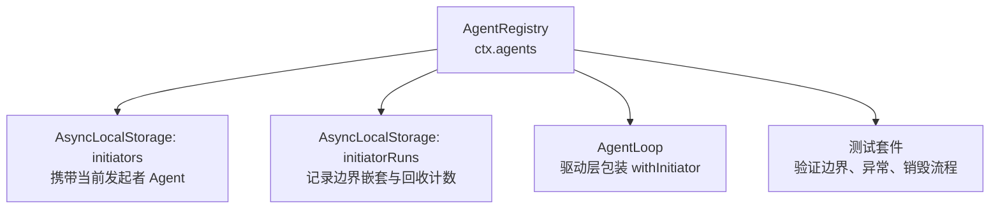
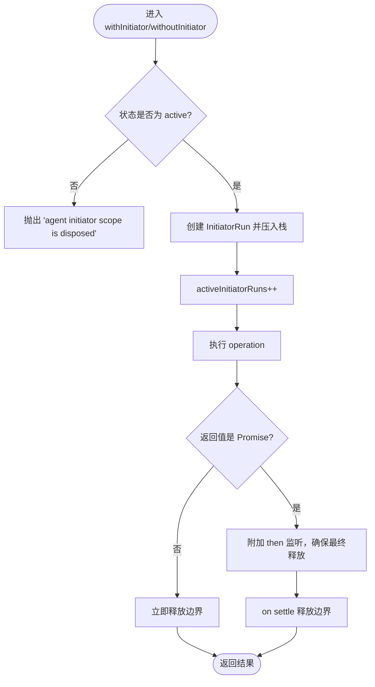
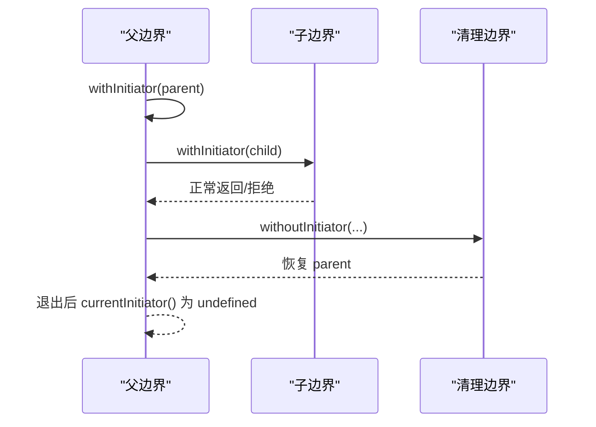
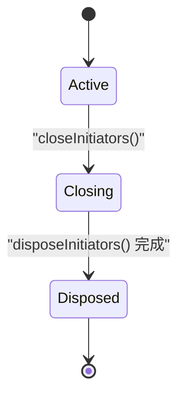
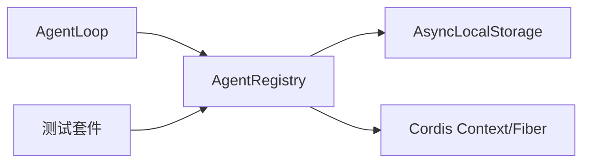
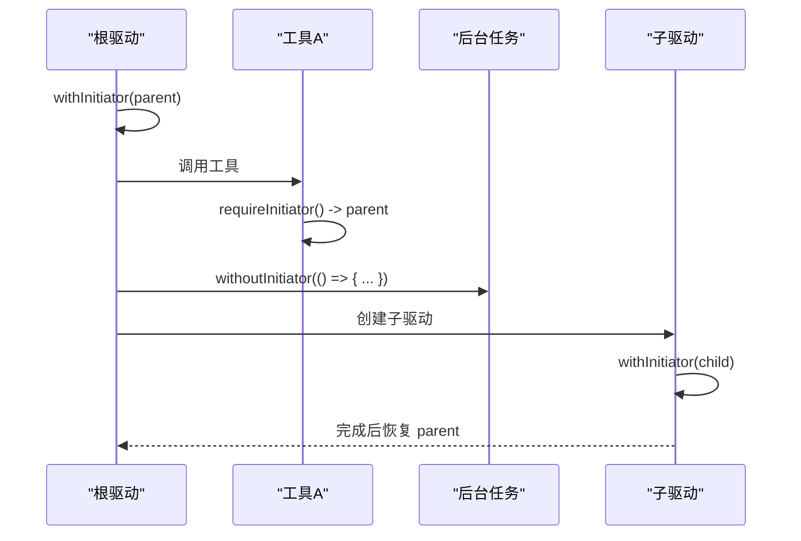

# 上下文传播机制

<cite>
**本文引用的文件**
- [packages/core/agent/src/index.ts](file://packages/core/agent/src/index.ts)
- [packages/core/agent/tests/agent-initiator.spec.ts](file://packages/core/agent/tests/agent-initiator.spec.ts)
- [packages/core/agent/README.md](file://packages/core/agent/README.md)
- [.agents/notes/implemented/architecture/2026-07-15-agent-initiator-scope.md](file://.agents/notes/implemented/architecture/2026-07-15-agent-initiator-scope.md)
- [packages/core/agent-loop/tests/agent-initiator.spec.ts](file://packages/core/agent-loop/tests/agent-initiator.spec.ts)
</cite>

## 目录
1. [简介](#简介)
2. [项目结构](#项目结构)
3. [核心组件](#核心组件)
4. [架构总览](#架构总览)
5. [详细组件分析](#详细组件分析)
6. [依赖关系分析](#依赖关系分析)
7. [性能考虑](#性能考虑)
8. [故障排查指南](#故障排查指南)
9. [结论](#结论)
10. [附录：使用示例与最佳实践](#附录使用示例与最佳实践)

## 简介
本文件系统化说明 Agent 上下文传播机制，重点包括：
- AsyncLocalStorage 在进程内异步调用链中承载“发起者 Agent”的作用。
- initiator 边界的概念、嵌套与清理边界（withInitiator / withoutInitiator）。
- currentInitiator 与 requireInitiator 的区别与适用场景。
- 父 Agent 与子 Agent 的上下文继承链管理。
- 多层调用链中的正确用法、并发隔离、错误恢复与生命周期清理。
- 性能考量与最佳实践。

## 项目结构
Agent 上下文传播由 AgentRegistry 服务提供，基于 Node.js 的 AsyncLocalStorage 实现进程内异步上下文存储；测试与文档位于 agent 包及其相关测试中。



图表来源
- [packages/core/agent/src/index.ts:256-298](file://packages/core/agent/src/index.ts#L256-L298)
- [packages/core/agent/src/index.ts:639-703](file://packages/core/agent/src/index.ts#L639-L703)
- [packages/core/agent-loop/tests/agent-initiator.spec.ts:118-145](file://packages/core/agent-loop/tests/agent-initiator.spec.ts#L118-L145)

章节来源
- [packages/core/agent/src/index.ts:244-298](file://packages/core/agent/src/index.ts#L244-L298)
- [packages/core/agent/README.md:26-35](file://packages/core/agent/README.md#L26-L35)

## 核心组件
- AgentRegistry：维护活跃 Agent 注册表，并提供发起者上下文传播能力。
- Initiator 边界：
  - withInitiator(agent, operation)：为 operation 建立以指定 Agent 为发起者的边界。
  - withoutInitiator(operation)：建立清除继承发起者的边界，用于不应当继承 Agent 的工作。
- 读取接口：
  - currentInitiator()：可选读取当前发起者，无则返回 undefined。
  - requireInitiator()：必须存在发起者，否则抛出“no initiating agent is active”。

关键职责
- 通过两个 AsyncLocalStorage 实例分别承载“当前 Agent”和“边界运行元信息”，保证 await 后仍能正确恢复上下文。
- 在关闭/销毁阶段阻止新建边界并等待已返回 Promise 边界完成，再禁用底层存储。

章节来源
- [packages/core/agent/src/index.ts:300-358](file://packages/core/agent/src/index.ts#L300-L358)
- [packages/core/agent/src/index.ts:619-703](file://packages/core/agent/src/index.ts#L619-L703)
- [packages/core/agent/README.md:26-35](file://packages/core/agent/README.md#L26-L35)

## 架构总览
下图展示 AgentLoop 如何将每个驱动的生命周期包裹在 withInitiator 边界内，以及内部工具/步骤如何安全地读取发起者。

```mermaid
sequenceDiagram
participant Caller as "调用方"
participant Loop as "AgentLoop"
participant Reg as "AgentRegistry"
participant ALS as "AsyncLocalStorage"
participant Driver as "具体驱动"
participant Helper as "工具/步骤辅助函数"
Caller->>Loop : 启动驱动
Loop->>Reg : withInitiator(当前Agent, runLoop)
Reg->>ALS : 设置 initiators = Agent
Loop->>Driver : 执行完整生命周期
Driver->>Helper : 调用内部步骤
Helper->>Reg : requireInitiator()/currentInitiator()
Reg-->>Helper : 返回当前 Agent 或抛错
Driver-->>Loop : 完成/失败
Loop->>Reg : 边界结束，释放计数
Reg->>ALS : 恢复上一层上下文
```

图表来源
- [packages/core/agent/src/index.ts:341-358](file://packages/core/agent/src/index.ts#L341-L358)
- [packages/core/agent/src/index.ts:639-670](file://packages/core/agent/src/index.ts#L639-L670)
- [packages/core/agent-loop/tests/agent-initiator.spec.ts:118-145](file://packages/core/agent-loop/tests/agent-initiator.spec.ts#L118-L145)

## 详细组件分析

### AgentRegistry 与发起者边界
- 存储设计
  - initiators：AsyncLocalStorage<Agent | undefined>，承载当前发起者。
  - initiatorRuns：AsyncLocalStorage<InitiatorRun>，记录边界嵌套链与活跃计数，用于回收与防自锁。
- 边界方法
  - withInitiator：进入新边界，设置 Agent，并在同步返回值或 Promise 完成后释放。
  - withoutInitiator：进入清除边界，将 initiators 置空，用于隔离无关工作。
- 读取方法
  - currentInitiator：安全读取，可能为 undefined。
  - requireInitiator：不存在时抛出“no initiating agent is active”。
- 生命周期
  - closeInitiators：停止接受新边界。
  - disposeInitiators：等待所有返回的 Promise 边界完成，禁用存储，标记 disposed。
  - releaseReentrantInitiatorRuns：排除发起本次卸载的边界链，避免自死锁。



图表来源
- [packages/core/agent/src/index.ts:639-670](file://packages/core/agent/src/index.ts#L639-L670)
- [packages/core/agent/src/index.ts:687-703](file://packages/core/agent/src/index.ts#L687-L703)

章节来源
- [packages/core/agent/src/index.ts:256-358](file://packages/core/agent/src/index.ts#L256-L358)
- [packages/core/agent/src/index.ts:619-703](file://packages/core/agent/src/index.ts#L619-L703)

### 并发隔离与嵌套恢复
- 并发隔离：不同驱动的 continuation 各自携带其 Agent，互不干扰。
- 嵌套恢复：withInitiator 支持嵌套，退出时恢复到外层 Agent；withoutInitiator 可临时屏蔽继承。
- 异常安全：同步抛错或 Promise 拒绝均会恢复外层上下文。



图表来源
- [packages/core/agent/tests/agent-initiator.spec.ts:127-163](file://packages/core/agent/tests/agent-initiator.spec.ts#L127-L163)

章节来源
- [packages/core/agent/tests/agent-initiator.spec.ts:45-163](file://packages/core/agent/tests/agent-initiator.spec.ts#L45-L163)

### 销毁与回收
- 关闭阶段：不再允许新建边界；注入的依赖开始排水。
- 回收阶段：等待所有返回的 Promise 边界完成；若边界链触发了拥有 fiber 的卸载，则从排水中排除该链以避免自锁。
- 最终阶段：禁用 AsyncLocalStorage，使后续访问抛出“agent initiator scope is disposed”。



图表来源
- [packages/core/agent/src/index.ts:619-637](file://packages/core/agent/src/index.ts#L619-L637)
- [packages/core/agent/src/index.ts:687-703](file://packages/core/agent/src/index.ts#L687-L703)

章节来源
- [packages/core/agent/src/index.ts:619-703](file://packages/core/agent/src/index.ts#L619-L703)
- [packages/core/agent/tests/agent-initiator.spec.ts:165-264](file://packages/core/agent/tests/agent-initiator.spec.ts#L165-L264)

### 与 AgentLoop 的集成
- AgentLoop 在每个驱动的生命周期外包裹 withInitiator，使得驱动内部的 turn/step/tool-call 等均可安全读取发起者。
- 并发驱动间彼此独立，child driver 的 continuation 携带 child，parent 在 withInitiator 返回后立即恢复自身上下文。

章节来源
- [packages/core/agent/README.md:26-35](file://packages/core/agent/README.md#L26-L35)
- [packages/core/agent-loop/tests/agent-initiator.spec.ts:118-145](file://packages/core/agent-loop/tests/agent-initiator.spec.ts#L118-L145)

## 依赖关系分析
- AgentRegistry 依赖 Cordis Context/Fiber 进行生命周期管理。
- 依赖 Node AsyncLocalStorage 实现进程内异步上下文。
- 被 AgentLoop 使用以注入发起者上下文；测试覆盖并发、异常、跨 realm Promise、销毁行为。



图表来源
- [packages/core/agent/src/index.ts:8-15](file://packages/core/agent/src/index.ts#L8-L15)
- [packages/core/agent/src/index.ts:256-298](file://packages/core/agent/src/index.ts#L256-L298)

章节来源
- [packages/core/agent/src/index.ts:8-15](file://packages/core/agent/src/index.ts#L8-L15)
- [packages/core/agent/src/index.ts:256-298](file://packages/core/agent/src/index.ts#L256-L298)

## 性能考虑
- 轻量级上下文切换：AsyncLocalStorage 的 getStore/run 开销低，适合高频调用。
- 精确归还：仅对 withInitiator 返回的 Promise 进行 then 观察，避免不必要的额外对象创建。
- 并发隔离：每个驱动独立 store，避免全局锁竞争。
- 销毁期优化：releaseReentrantInitiatorRuns 排除发起卸载的边界链，防止自死锁。
- 建议
  - 尽量将耗时操作放在 withInitiator 内部，确保上下文贯穿。
  - 对于后台任务、定时器、队列泵等不应继承 Agent 的工作，使用 withoutInitiator 明确隔离。
  - 避免在边界内持有长生命周期引用导致无法回收。

[本节为通用指导，不直接分析具体文件]

## 故障排查指南
- 常见错误
  - “no initiating agent is active”：在 requireInitiator 处未处于任何边界。检查是否遗漏 withInitiator 或误用了 withoutInitiator。
  - “agent initiator scope is disposed”：服务已销毁，禁止新建边界或读取。检查是否在 fiber 卸载后仍尝试访问。
- 定位方法
  - 确认调用点是否处于 withInitiator 边界内。
  - 检查是否存在 withoutInitiator 意外清除了上下文。
  - 查看并发场景下是否正确隔离了不同 Agent。
  - 关注销毁时序：ensure 所有返回的 Promise 边界在 dispose 前完成。

章节来源
- [packages/core/agent/tests/agent-initiator.spec.ts:37-43](file://packages/core/agent/tests/agent-initiator.spec.ts#L37-L43)
- [packages/core/agent/tests/agent-initiator.spec.ts:165-186](file://packages/core/agent/tests/agent-initiator.spec.ts#L165-L186)

## 结论
Agent 上下文传播通过 AgentRegistry 与 AsyncLocalStorage 实现了进程内安全的发起者上下文传递。withInitiator/withoutInitiator 提供了明确的边界语义，currentInitiator/requireInitiator 提供了灵活且严格的读取方式。结合 AgentLoop 的集成，可在复杂的多层调用链中保持正确的上下文继承、并发隔离与健壮的错误恢复。遵循本文的最佳实践，可有效避免上下文污染、泄漏与死锁问题。

[本节为总结性内容，不直接分析具体文件]

## 附录：使用示例与最佳实践

### 典型调用链示例（示意）
- 顶层驱动：用 withInitiator(parent) 包裹整个驱动生命周期。
- 中间层：工具/步骤通过 requireInitiator() 获取当前 Agent 进行日志、追踪或路由。
- 后台任务：使用 withoutInitiator(() => { ... }) 避免继承首个初始化时的 Agent。
- 嵌套子 Agent：在创建子 Agent 的 setup 之前，保持父边界；子 Agent 的驱动在其 own boundary 内运行。



图表来源
- [packages/core/agent/src/index.ts:341-358](file://packages/core/agent/src/index.ts#L341-L358)
- [packages/core/agent/src/index.ts:639-670](file://packages/core/agent/src/index.ts#L639-L670)

### 最佳实践清单
- 始终在驱动入口使用 withInitiator(agent, ...) 包裹完整生命周期。
- 需要严格校验时必须使用 requireInitiator()；仅需观测时使用 currentInitiator()。
- 对不应当继承 Agent 的长期资源（定时器、队列、导出器）使用 withoutInitiator()。
- 避免在边界内捕获长生命周期引用；确保所有返回的 Promise 在销毁前完成。
- 在并发场景中，确保每个驱动独立边界，避免共享可变状态。
- 在销毁阶段，先关闭边界，再等待排水完成，最后禁用存储。

章节来源
- [packages/core/agent/README.md:26-35](file://packages/core/agent/README.md#L26-L35)
- [packages/core/agent/src/index.ts:300-358](file://packages/core/agent/src/index.ts#L300-L358)
- [packages/core/agent/src/index.ts:619-703](file://packages/core/agent/src/index.ts#L619-L703)
- [packages/core/agent/tests/agent-initiator.spec.ts:45-264](file://packages/core/agent/tests/agent-initiator.spec.ts#L45-L264)