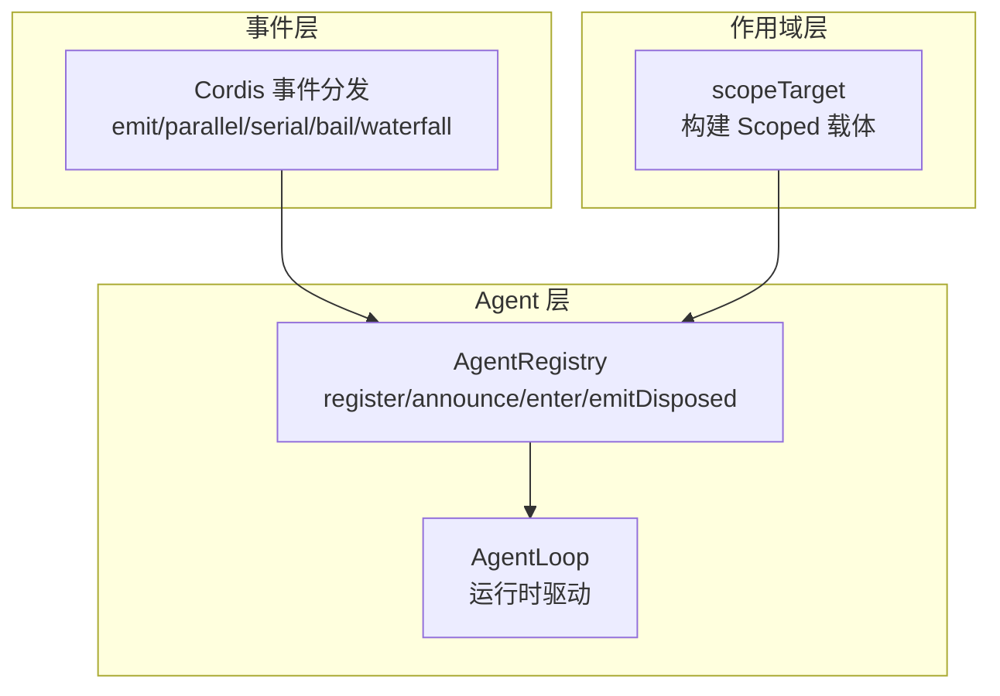
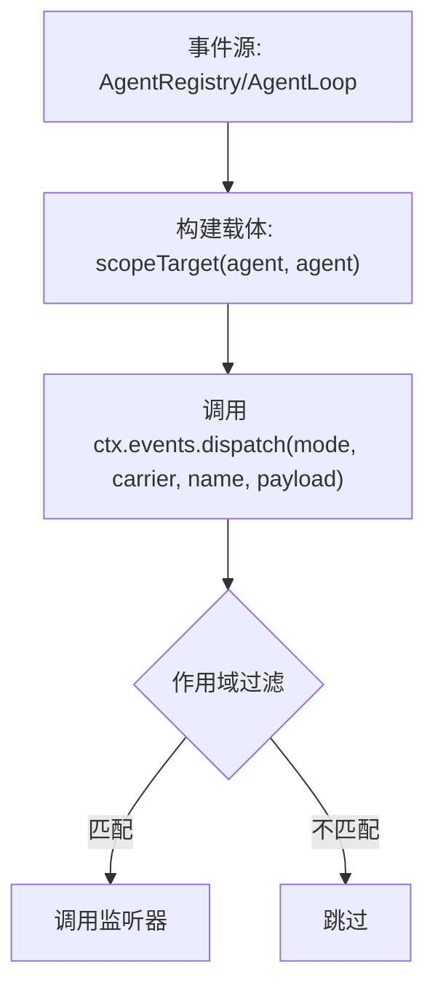
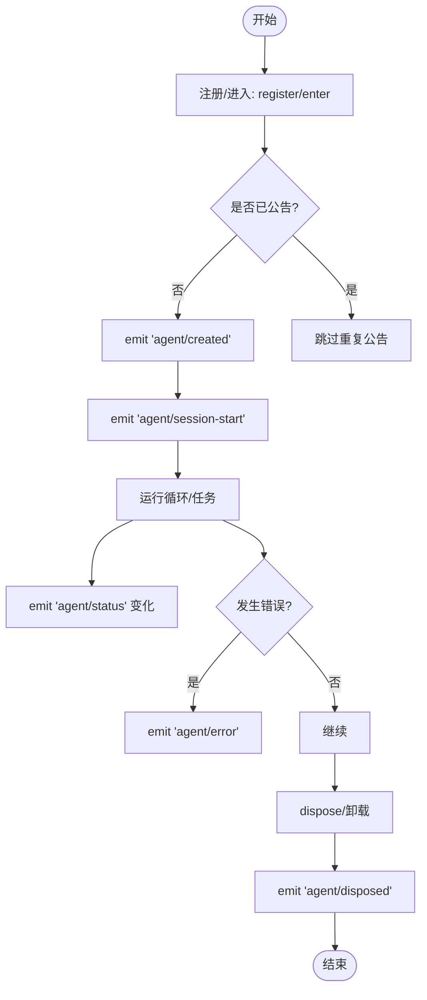
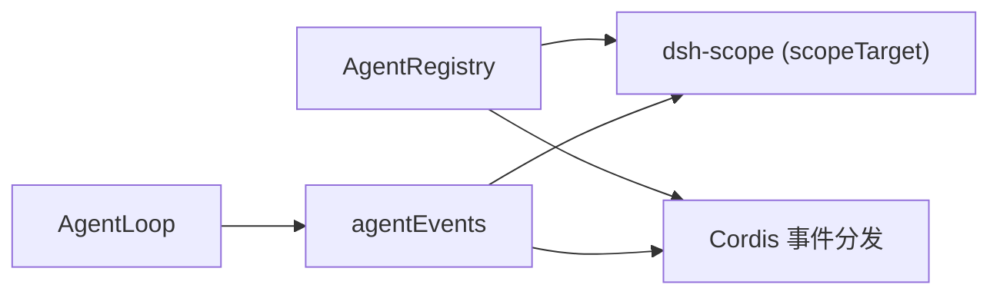

# 事件处理机制

<cite>
**本文引用的文件**
- [packages/core/agent/src/index.ts](file://packages/core/agent/src/index.ts)
- [packages/core/agent/src/dispatch.ts](file://packages/core/agent/src/dispatch.ts)
- [packages/core/agent/src/runtime-types.ts](file://packages/core/agent/src/runtime-types.ts)
- [packages/core/scope/src/index.ts](file://packages/core/scope/src/index.ts)
- [packages/core/agent-loop/src/agent.ts](file://packages/core/agent-loop/src/agent.ts)
- [packages/core/agent-loop/src/index.ts](file://packages/core/agent-loop/src/index.ts)
- [packages/sdk/client/src/client.ts](file://packages/sdk/client/src/client.ts)
- [packages/api/gateway/tests/gateway.client.spec.ts](file://packages/api/gateway/tests/gateway.client.spec.ts)
- [packages/core/agent/tests/agent.spec.ts](file://packages/core/agent/tests/agent.spec.ts)
- [packages/core/agent-loop/tests/scope-lifecycle.spec.ts](file://packages/core/agent-loop/tests/scope-lifecycle.spec.ts)
- [docs/cordis-api/events.md](file://docs/cordis-api/events.md)
</cite>

## 目录
1. [简介](#简介)
2. [项目结构](#项目结构)
3. [核心组件](#核心组件)
4. [架构总览](#架构总览)
5. [详细组件分析](#详细组件分析)
6. [依赖关系分析](#依赖关系分析)
7. [性能考虑](#性能考虑)
8. [故障排查指南](#故障排查指南)
9. [结论](#结论)
10. [附录](#附录)

## 简介
本文件系统化说明 Agent 的事件处理机制，覆盖事件类型与触发时机、发布订阅模式、作用域过滤、错误处理与异常恢复、事件队列与消息传递原理，以及性能优化与调试技巧。重点围绕以下核心事件：
- agent/created：Agent 注册完成并发布后的生命周期起点
- agent/disposed：Agent 从注册表移除的终止边界
- agent/session-start：会话生命周期开始（首轮之前）的通知点
- 其他关键事件：agent/status、agent/error、agent/inbox/*、agent/pre-step、agent/request、agent/request-error、agent/turn-stopping

## 项目结构
Agent 事件体系由三层协作构成：
- 事件声明与调度：在 Cordis Context 中提供 emit/parallel/serial/bail/waterfall 等分发模式，并通过 ctx.on/once 注册监听器
- Agent 作用域与载体：通过 scopeTarget 将 Agent 对象作为事件作用域的键，确保事件仅在对应 Agent 上下文中传播
- Agent 注册与生命周期：AgentRegistry 负责注册、公告、注销与配对的生命周期事件；AgentLoop 驱动实际运行并在合适时机发出 session-start 等事件



图表来源
- [docs/cordis-api/events.md:8-123](file://docs/cordis-api/events.md#L8-L123)
- [packages/core/scope/src/index.ts:158-185](file://packages/core/scope/src/index.ts#L158-L185)
- [packages/core/agent/src/index.ts:450-576](file://packages/core/agent/src/index.ts#L450-L576)
- [packages/core/agent-loop/src/agent.ts:73-97](file://packages/core/agent-loop/src/agent.ts#L73-L97)

章节来源
- [docs/cordis-api/events.md:8-123](file://docs/cordis-api/events.md#L8-L123)
- [packages/core/scope/src/index.ts:158-185](file://packages/core/scope/src/index.ts#L158-L185)
- [packages/core/agent/src/index.ts:450-576](file://packages/core/agent/src/index.ts#L450-L576)
- [packages/core/agent-loop/src/agent.ts:73-97](file://packages/core/agent-loop/src/agent.ts#L73-L97)

## 核心组件
- AgentRegistry：维护 Agent 注册表、创建/恢复代理、注册与公告、配对释放与 disposed 事件发射
- AgentEventDispatch（agentEvents）：为 Agent 主题构建融合派发器，自动注入 agent 主体并绑定作用域载体
- ScopeTarget：基于 dsh-scope 的作用域过滤器，保证事件只在匹配的 Agent 作用域内传播
- AgentLoop：驱动 Agent 运行，构造事件派发器，并在合适时机发出 inbox、session-start、status、error 等事件

章节来源
- [packages/core/agent/src/index.ts:256-707](file://packages/core/agent/src/index.ts#L256-L707)
- [packages/core/agent/src/dispatch.ts:94-165](file://packages/core/agent/src/dispatch.ts#L94-L165)
- [packages/core/scope/src/index.ts:158-185](file://packages/core/scope/src/index.ts#L158-L185)
- [packages/core/agent-loop/src/agent.ts:73-97](file://packages/core/agent-loop/src/agent.ts#L73-L97)

## 架构总览
下图展示 Agent 事件从产生到消费的关键路径：注册公告、作用域过滤、分发模式、以及生命周期配对。

```mermaid
sequenceDiagram
participant Caller as "调用方"
participant Reg as "AgentRegistry"
participant Scope as "scopeTarget"
participant Events as "Cordis 事件分发"
participant Loop as "AgentLoop"
Caller->>Reg : register(agent) / enter(agent)
Reg->>Scope : 构建 Scoped<Agent> 载体
Reg->>Events : emit('agent/created', carrier, payload)
Note over Events : 仅匹配该 Agent 作用域的监听器被调用
Events-->>Caller : 同步失败可撤回发布
Reg->>Loop : announce(agent) 后继续启动
Loop->>Events : emit('agent/session-start', {source})
Loop->>Events : 后续 emit('agent/status'|'error'|'inbox/*')
Caller->>Reg : dispose()
Reg->>Events : emit('agent/disposed', carrier, payload)
```

图表来源
- [packages/core/agent/src/index.ts:450-576](file://packages/core/agent/src/index.ts#L450-L576)
- [packages/core/agent/src/index.ts:527-540](file://packages/core/agent/src/index.ts#L527-L540)
- [packages/core/agent/src/dispatch.ts:107-149](file://packages/core/agent/src/dispatch.ts#L107-L149)
- [packages/core/agent-loop/src/agent.ts:73-97](file://packages/core/agent-loop/src/agent.ts#L73-L97)

## 详细组件分析

### Agent 事件类型与触发时机
- agent/created：注册完成后立即发出，携带新注册的 Agent；同步监听器抛出会撤回发布，异步拒绝会被记录
- agent/disposed：Agent 从注册表移除时发出，位于驱动静默与作用域解绑之后、会话解绑之前
- agent/session-start：第一轮次之前发出一次，source 指示 startup/resume/clear/compact；纯通知，不阻塞启动
- agent/status：idle/running 状态切换时发出
- agent/error：步骤或轮次出错时发出
- agent/inbox/inserted/claimed/discarded：收件箱变更事件
- agent/pre-step、agent/request、agent/request-error、agent/turn-stopping：机器扩展点，用于拦截与决策

章节来源
- [packages/core/agent/src/runtime-types.ts:147-291](file://packages/core/agent/src/runtime-types.ts#L147-L291)

### 发布订阅模式与分发模式
- ctx.on/once：在当前 Fiber 上注册监听器，返回 disposer，随 Fiber 卸载自动清理
- 分发模式：
  - emit：同步执行监听器，忽略返回值，适合非阻断通知
  - parallel：并行等待所有监听器
  - serial：顺序等待，遇到 bail 值停止
  - bail：同步 bail 短路
  - waterfall：以 next 回调组合中间件式链路

章节来源
- [docs/cordis-api/events.md:8-123](file://docs/cordis-api/events.md#L8-L123)

### 作用域过滤机制
- 通过 scopeTarget(agent, agent) 构建 Scoped<Agent> 载体，事件分发时以该载体作为 thisArg
- 作用域过滤器会检查当前上下文 tag 是否在 Agent 作用域链上，从而确保事件只在正确的 Agent 上下文中传播
- 支持保留基础 filter 和 global 监听器语义



图表来源
- [packages/core/scope/src/index.ts:158-185](file://packages/core/scope/src/index.ts#L158-L185)
- [packages/core/agent/src/dispatch.ts:94-149](file://packages/core/agent/src/dispatch.ts#L94-L149)

### 事件处理的错误处理与异常恢复
- agent/created：同步抛出会撤回发布；异步拒绝会被记录，不会中断后续监听器
- agent/disposed：监听器抛错或拒绝会被捕获并记录，不影响后续流程
- agentEvents.emit：对每个监听器的同步异常与异步拒绝分别 try/catch 并记录警告，避免污染其他监听器
- 配置驱动的启动失败会通过专用事件上报，并由上层处理

章节来源
- [packages/core/agent/src/index.ts:527-576](file://packages/core/agent/src/index.ts#L527-L576)
- [packages/core/agent/src/dispatch.ts:120-149](file://packages/core/agent/src/dispatch.ts#L120-L149)
- [packages/core/agent-loop/src/index.ts:384-404](file://packages/core/agent-loop/src/index.ts#L384-L404)

### 事件队列与消息传递
- SDK 客户端侧使用队列与 waiters 实现通知的缓冲与投递：push 根据过滤器匹配入队或唤醒等待者；filter 抛错会隔离到当前订阅并终止该订阅
- Gateway 测试表明无人订阅的事件会被丢弃，体现“无订阅即无开销”的设计

章节来源
- [packages/sdk/client/src/client.ts:133-163](file://packages/sdk/client/src/client.ts#L133-L163)
- [packages/api/gateway/tests/gateway.client.spec.ts:820-829](file://packages/api/gateway/tests/gateway.client.spec.ts#L820-L829)

### 订阅与处理示例（代码片段路径）
- 订阅 agent/created、agent/disposed、agent/session-start：
  - [packages/core/agent/tests/agent.spec.ts:221-232](file://packages/core/agent/tests/agent.spec.ts#L221-L232)
- 使用 agentEvents 进行作用域内事件派发与串行/瀑布流：
  - [packages/core/agent/tests/agent.spec.ts:312-349](file://packages/core/agent/tests/agent.spec.ts#L312-L349)
- 在 AgentLoop 中复用融合派发器以减少分配：
  - [packages/core/agent-loop/src/agent.ts:73-97](file://packages/core/agent-loop/src/agent.ts#L73-L97)
- 已处置上下文再次注册监听器会报错：
  - [packages/core/agent-loop/tests/scope-lifecycle.spec.ts:902-907](file://packages/core/agent-loop/tests/scope-lifecycle.spec.ts#L902-L907)

### 事件处理流程图（创建-启动-销毁）


图表来源
- [packages/core/agent/src/index.ts:450-576](file://packages/core/agent/src/index.ts#L450-L576)
- [packages/core/agent/src/index.ts:527-540](file://packages/core/agent/src/index.ts#L527-L540)
- [packages/core/agent/src/runtime-types.ts:147-291](file://packages/core/agent/src/runtime-types.ts#L147-L291)

## 依赖关系分析
- AgentRegistry 依赖 Cordis Context 的事件能力与 dsh-scope 的作用域能力
- AgentEventDispatch 依赖 dsh-scope 的 scopeTarget 与 Cordis 的事件分发
- AgentLoop 在构造函数中构建 agentEvents 派发器，并在运行期间发出多种事件
- 作用域过滤器确保事件只在匹配的 Agent 作用域内传播，避免跨 Agent 泄漏



图表来源
- [packages/core/agent/src/index.ts:256-707](file://packages/core/agent/src/index.ts#L256-L707)
- [packages/core/agent/src/dispatch.ts:94-165](file://packages/core/agent/src/dispatch.ts#L94-L165)
- [packages/core/scope/src/index.ts:158-185](file://packages/core/scope/src/index.ts#L158-L185)
- [packages/core/agent-loop/src/agent.ts:73-97](file://packages/core/agent-loop/src/agent.ts#L73-L97)

章节来源
- [packages/core/agent/src/index.ts:256-707](file://packages/core/agent/src/index.ts#L256-L707)
- [packages/core/agent/src/dispatch.ts:94-165](file://packages/core/agent/src/dispatch.ts#L94-L165)
- [packages/core/scope/src/index.ts:158-185](file://packages/core/scope/src/index.ts#L158-L185)
- [packages/core/agent-loop/src/agent.ts:73-97](file://packages/core/agent-loop/src/agent.ts#L73-L97)

## 性能考虑
- 热路径零分配：AgentLoop 在构造函数中构建 agentEvents 派发器并复用，避免每次派发都创建载体
- 作用域过滤高效：基于 dsh-scope 的轻量级过滤器，按作用域链快速判定
- 无订阅即无开销：Gateway 行为表明未订阅的事件不会造成额外负载
- 并发与顺序选择：根据场景选择合适的分发模式（emit 用于通知，waterfall/serial 用于控制流）

章节来源
- [packages/core/agent-loop/src/agent.ts:73-97](file://packages/core/agent-loop/src/agent.ts#L73-L97)
- [packages/core/scope/src/index.ts:158-185](file://packages/core/scope/src/index.ts#L158-L185)
- [packages/api/gateway/tests/gateway.client.spec.ts:820-829](file://packages/api/gateway/tests/gateway.client.spec.ts#L820-L829)
- [docs/cordis-api/events.md:8-123](file://docs/cordis-api/events.md#L8-L123)

## 故障排查指南
- 监听器抛错或拒绝：
  - agent/created：同步抛错会撤回发布；异步拒绝会被记录
  - agent/disposed：监听器异常被捕获并记录，不影响后续流程
  - agentEvents.emit：每个监听器异常独立捕获并记录警告
- 已处置上下文注册监听器会抛出无效上下文错误
- 配置驱动启动失败会通过专用事件上报，便于定位问题

章节来源
- [packages/core/agent/src/index.ts:527-576](file://packages/core/agent/src/index.ts#L527-L576)
- [packages/core/agent/src/dispatch.ts:120-149](file://packages/core/agent/src/dispatch.ts#L120-L149)
- [packages/core/agent-loop/tests/scope-lifecycle.spec.ts:902-907](file://packages/core/agent-loop/tests/scope-lifecycle.spec.ts#L902-L907)
- [packages/core/agent-loop/src/index.ts:384-404](file://packages/core/agent-loop/src/index.ts#L384-L404)

## 结论
Agent 事件处理机制通过 Cordis 事件分发、dsh-scope 作用域过滤与 AgentRegistry/AgentLoop 的生命周期管理，提供了安全、可控且高性能的事件系统。核心事件覆盖 Agent 的完整生命周期，配合多种分发模式与严格的错误隔离策略，既保证了可扩展性，又确保了稳定性。实践中建议：
- 使用 agentEvents 进行作用域内派发，避免手动构造载体
- 选择合适的分发模式：通知用 emit，控制流用 waterfall/serial
- 关注作用域过滤，确保事件只在正确上下文中传播
- 利用错误日志与专用事件进行问题定位

## 附录
- 事件清单与模式参考：
  - [packages/core/agent/src/runtime-types.ts:147-291](file://packages/core/agent/src/runtime-types.ts#L147-L291)
- 事件 API 参考：
  - [docs/cordis-api/events.md:8-123](file://docs/cordis-api/events.md#L8-L123)
- 作用域载体与过滤：
  - [packages/core/scope/src/index.ts:158-185](file://packages/core/scope/src/index.ts#L158-L185)
- 注册与生命周期：
  - [packages/core/agent/src/index.ts:450-576](file://packages/core/agent/src/index.ts#L450-L576)
  - [packages/core/agent/src/index.ts:527-540](file://packages/core/agent/src/index.ts#L527-L540)
- 派发器与热路径优化：
  - [packages/core/agent/src/dispatch.ts:94-165](file://packages/core/agent/src/dispatch.ts#L94-L165)
  - [packages/core/agent-loop/src/agent.ts:73-97](file://packages/core/agent-loop/src/agent.ts#L73-L97)
- 队列与消息传递：
  - [packages/sdk/client/src/client.ts:133-163](file://packages/sdk/client/src/client.ts#L133-L163)
  - [packages/api/gateway/tests/gateway.client.spec.ts:820-829](file://packages/api/gateway/tests/gateway.client.spec.ts#L820-L829)