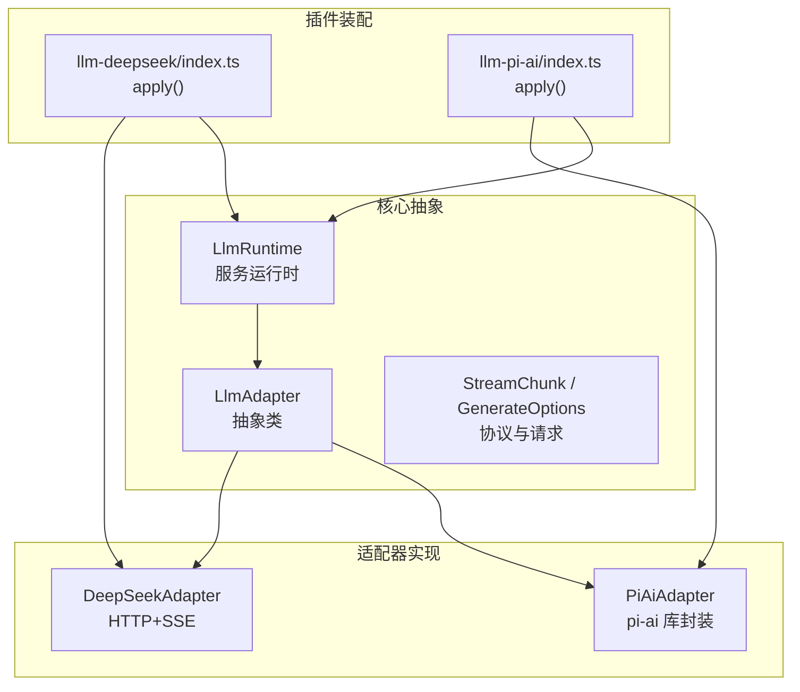
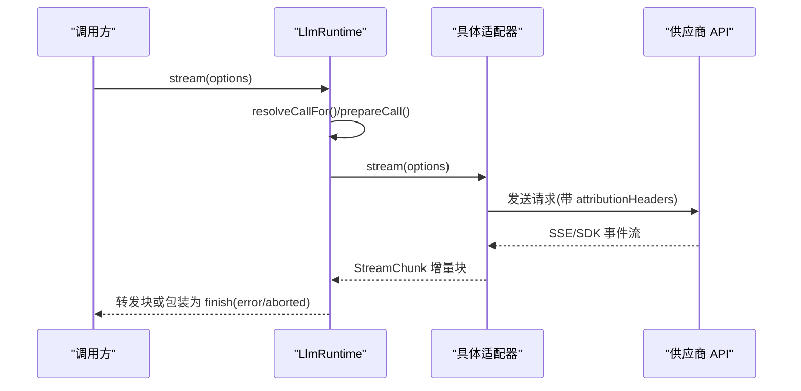
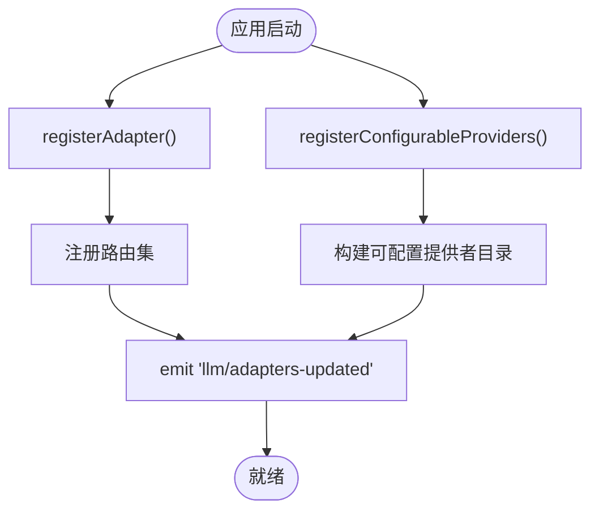
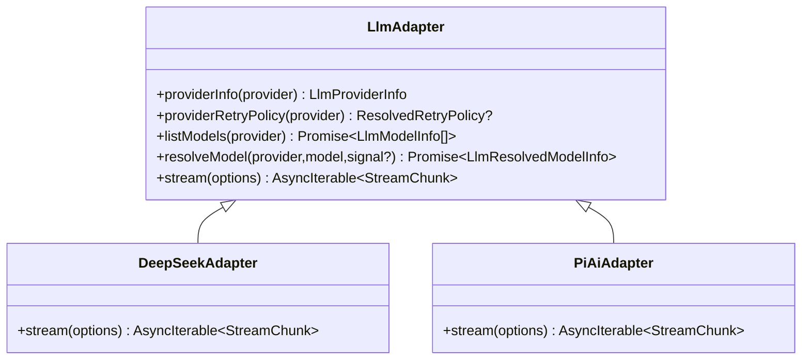
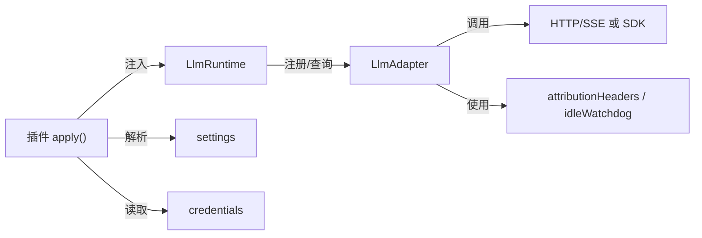
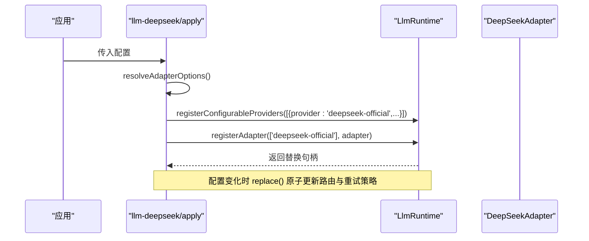
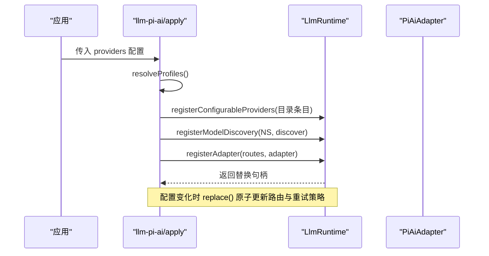

# LLM 适配器架构

<cite>
**本文引用的文件**
- [packages/llm/llm/src/types.ts](file://packages/llm/llm/src/types.ts)
- [packages/llm/llm/src/index.ts](file://packages/llm/llm/src/index.ts)
- [packages/llm/llm-deepseek/src/adapter.ts](file://packages/llm/llm-deepseek/src/adapter.ts)
- [packages/llm/llm-deepseek/src/index.ts](file://packages/llm/llm-deepseek/src/index.ts)
- [packages/llm/llm-pi-ai/src/adapter.ts](file://packages/llm/llm-pi-ai/src/adapter.ts)
- [packages/llm/llm-pi-ai/src/index.ts](file://packages/llm/llm-pi-ai/src/index.ts)
- [docs/cookbook/adding-an-llm-adapter.md](file://docs/cookbook/adding-an-llm-adapter.md)
- [docs/testing.md](file://docs/testing.md)
</cite>

## 目录
1. [简介](#简介)
2. [项目结构](#项目结构)
3. [核心组件](#核心组件)
4. [架构总览](#架构总览)
5. [详细组件分析](#详细组件分析)
6. [依赖关系分析](#依赖关系分析)
7. [性能考量](#性能考量)
8. [故障排查指南](#故障排查指南)
9. [结论](#结论)
10. [附录](#附录)

## 简介
本文件系统化阐述 LLM 适配器的设计模式与接口契约，解释如何通过统一抽象屏蔽不同 LLM 提供商的差异（消息格式转换、API 调用封装、响应处理），并文档化适配器注册机制、服务发现、生命周期管理与依赖注入。同时提供自定义适配器开发指南、错误处理策略与测试策略，辅以 DeepSeek 直连与 pi-ai 库封装两类参考实现的最佳实践。

## 项目结构
LLM 子系统由“核心抽象 + 具体适配器 + 插件装配”三层组成：
- 核心抽象层：定义统一的适配器接口、流式协议、模型元数据、错误类型与服务运行时。
- 适配器实现层：DeepSeek 直连 HTTP+SSE 与 pi-ai 库封装两种实现，分别负责各自供应商的消息序列化、传输与块组装。
- 插件装配层：通过 Cordis 的 apply 函数完成配置解析、凭据注入、适配器注册与可配置提供者目录声明。

图表来源
- [packages/llm/llm/src/index.ts:174-233](file://packages/llm/llm/src/index.ts#L174-L233)
- [packages/llm/llm/src/index.ts:284-870](file://packages/llm/llm/src/index.ts#L284-L870)
- [packages/llm/llm-deepseek/src/adapter.ts:158-347](file://packages/llm/llm-deepseek/src/adapter.ts#L158-L347)
- [packages/llm/llm-pi-ai/src/adapter.ts:186-359](file://packages/llm/llm-pi-ai/src/adapter.ts#L186-L359)
- [packages/llm/llm-deepseek/src/index.ts:200-277](file://packages/llm/llm-deepseek/src/index.ts#L200-L277)
- [packages/llm/llm-pi-ai/src/index.ts:150-313](file://packages/llm/llm-pi-ai/src/index.ts#L150-L313)

章节来源
- [packages/llm/llm/src/index.ts:174-233](file://packages/llm/llm/src/index.ts#L174-L233)
- [packages/llm/llm/src/index.ts:284-870](file://packages/llm/llm/src/index.ts#L284-L870)
- [packages/llm/llm-deepseek/src/adapter.ts:158-347](file://packages/llm/llm-deepseek/src/adapter.ts#L158-L347)
- [packages/llm/llm-pi-ai/src/adapter.ts:186-359](file://packages/llm/llm-pi-ai/src/adapter.ts#L186-L359)
- [packages/llm/llm-deepseek/src/index.ts:200-277](file://packages/llm/llm-deepseek/src/index.ts#L200-L277)
- [packages/llm/llm-pi-ai/src/index.ts:150-313](file://packages/llm/llm-pi-ai/src/index.ts#L150-L313)

## 核心组件
- LlmAdapter：适配器抽象基类，定义 providerInfo、listModels、resolveModel、stream 等能力；所有适配器必须实现 stream。
- LlmRuntime：服务运行时，维护适配器注册表、可配置提供者目录、模型发现、重试策略、准备调用与流式分发，并提供 llm/stream 瀑布拦截点。
- StreamChunk / GenerateOptions：统一的流式协议与请求描述，屏蔽各供应商差异。
- LlmError / LlmFailure：结构化错误与失败事实，用于跨层诊断与重试决策。

章节来源
- [packages/llm/llm/src/types.ts:39-357](file://packages/llm/llm/src/types.ts#L39-L357)
- [packages/llm/llm/src/index.ts:69-117](file://packages/llm/llm/src/index.ts#L69-L117)
- [packages/llm/llm/src/index.ts:174-233](file://packages/llm/llm/src/index.ts#L174-L233)
- [packages/llm/llm/src/index.ts:284-870](file://packages/llm/llm/src/index.ts#L284-L870)

## 架构总览
适配器通过 LlmRuntime 注册到系统，消费者通过 ctx.llm.stream(options) 发起流式调用。运行时负责：
- 选择适配器（按 options.provider）
- 解析与校验调用配置（默认值、推理努力、最大 token 等）
- 将适配器抛出的异常归一化为终止 finish 块（error/aborted）
- 暴露 llm/stream 事件供重试、遥测、路由等中间件拦截

图表来源
- [packages/llm/llm/src/index.ts:838-870](file://packages/llm/llm/src/index.ts#L838-L870)
- [packages/llm/llm-deepseek/src/adapter.ts:214-347](file://packages/llm/llm-deepseek/src/adapter.ts#L214-L347)
- [packages/llm/llm-pi-ai/src/adapter.ts:276-359](file://packages/llm/llm-pi-ai/src/adapter.ts#L276-L359)

## 详细组件分析

### 适配器抽象与协议
- 适配器职责边界
  - providerInfo：声明路由显示信息
  - listModels：列出可 advertised 的模型（建议性）
  - resolveModel：精确模型元数据（上下文窗口、默认 maxTokens、推理努力等）
  - stream：唯一必需方法，输出 StreamChunk 流
- 流式协议约定
  - usage 必须在 finish 之前发出，finish 之后不得再发任何块
  - tool-call arguments 以原始 JSON 字符串端到端传递，增量以 argumentsDelta 形式
  - block index 首次出现顺序分配，同一块的所有 delta 复用该 index
  - 错误两条路径：throw LlmError（传输/协议失败）或 finish{kind:'error'|'aborted'}（供应商内联失败）
  - 必须尊重 options.signal，不支持的能力应抛出 UNSUPPORTED

章节来源
- [packages/llm/llm/src/types.ts:283-357](file://packages/llm/llm/src/types.ts#L283-L357)
- [docs/cookbook/adding-an-llm-adapter.md:25-39](file://docs/cookbook/adding-an-llm-adapter.md#L25-L39)

### 适配器注册与服务发现
- 适配器注册
  - registerAdapter(providers, adapter)：全有或全无注册，重复则抛错；返回可替换句柄 replace()
  - commitRoutes 原子替换，保证观察者不会看到空窗期
  - 每次变更触发 llm/adapters-updated 事件
- 可配置提供者目录
  - registerConfigurableProviders(entries)：声明可通过配置激活的路由集合，支持 replace()
  - listConfigurableProviders()：列出所有已声明的可配置提供者（含休眠态）
- 模型发现
  - registerModelDiscovery(settingsNs, discover)：为设置命名空间注册模型发现回调
  - discoverModels(settingsNs, request)：对草稿进行探测，去重后返回

图表来源
- [packages/llm/llm/src/index.ts:330-413](file://packages/llm/llm/src/index.ts#L330-L413)
- [packages/llm/llm/src/index.ts:431-492](file://packages/llm/llm/src/index.ts#L431-L492)
- [packages/llm/llm/src/index.ts:504-559](file://packages/llm/llm/src/index.ts#L504-L559)

章节来源
- [packages/llm/llm/src/index.ts:330-413](file://packages/llm/llm/src/index.ts#L330-L413)
- [packages/llm/llm/src/index.ts:431-492](file://packages/llm/llm/src/index.ts#L431-L492)
- [packages/llm/llm/src/index.ts:504-559](file://packages/llm/llm/src/index.ts#L504-L559)

### 生命周期管理与依赖注入
- 生命周期
  - 通过 Cordis Service 与 effect 管理注册句柄的释放；dispose 时清理路由并通知
  - replace() 在已释放后调用会抛 REGISTRATION_DISPOSED
- 依赖注入
  - 插件通过 inject = ['llm'] 注入运行时
  - 凭据通过 credentials 服务或环境变量解析，使用 assertUsableApiKey 校验可用性
  - 配置通过 settings 模块安装与热更新，运行时重新解析连接事实

章节来源
- [packages/llm/llm/src/index.ts:284-367](file://packages/llm/llm/src/index.ts#L284-L367)
- [packages/llm/llm/src/index.ts:137-152](file://packages/llm/llm/src/index.ts#L137-L152)
- [packages/llm/llm-deepseek/src/index.ts:200-277](file://packages/llm/llm-deepseek/src/index.ts#L200-L277)
- [packages/llm/llm-pi-ai/src/index.ts:150-313](file://packages/llm/llm-pi-ai/src/index.ts#L150-L313)

### 消息格式转换、API 调用封装与响应处理
- DeepSeek 适配器
  - 直接 fetch + eventsource-parser 解析 SSE
  - 序列化请求、附加 attributionHeaders、会话/用途头
  - 将供应商错误映射为稳定代码（AUTH/RATE_LIMIT/CONTEXT_WINDOW_EXCEEDED 等）
  - 使用 idleWatchdog 保护空闲超时，统一转换为 TIMEOUT
- pi-ai 适配器
  - 基于 pi-ai SDK 的 Models.streamSimple，自动处理多供应商协议
  - 将消息上下文转为 pi-ai 上下文，图片输入需持久附件服务
  - 推理努力级别校验与默认值推导，拒绝不支持的 stop 选项
  - 同样使用 idleWatchdog 与 AbortSignal.any 管理取消与超时

图表来源
- [packages/llm/llm/src/index.ts:174-233](file://packages/llm/llm/src/index.ts#L174-L233)
- [packages/llm/llm-deepseek/src/adapter.ts:158-347](file://packages/llm/llm-deepseek/src/adapter.ts#L158-L347)
- [packages/llm/llm-pi-ai/src/adapter.ts:186-359](file://packages/llm/llm-pi-ai/src/adapter.ts#L186-L359)

章节来源
- [packages/llm/llm-deepseek/src/adapter.ts:214-347](file://packages/llm/llm-deepseek/src/adapter.ts#L214-L347)
- [packages/llm/llm-pi-ai/src/adapter.ts:276-359](file://packages/llm/llm-pi-ai/src/adapter.ts#L276-L359)

### 自定义适配器开发指南
- 最小实现
  - 继承 LlmAdapter，实现 stream(options)
  - 遵循 StreamChunk 协议：block-start/delta/end、usage、finish
  - 正确处理 signal 与错误分类（throw LlmError 或 finish error/aborted）
- 注册与装配
  - 导出 name、inject=['llm']
  - 定义 Config schema（schemastery），在 apply(ctx, config) 中：
    - 解析配置与凭据
    - 创建适配器实例
    - 调用 ctx.llm.registerAdapter([provider], adapter)
    - 可选：registerConfigurableProviders 与 registerModelDiscovery
- 最佳实践
  - 将 wire 类型、请求序列化、传输解析、块转换、适配器类拆分
  - 使用 attributionHeaders() 确保归属头
  - 对不支持的选项抛出 UNSUPPORTED，而非静默丢弃
  - 若需要 replayState，仅当历史与目标由同一适配器实例拥有时才透传

章节来源
- [docs/cookbook/adding-an-llm-adapter.md:7-39](file://docs/cookbook/adding-an-llm-adapter.md#L7-L39)
- [packages/llm/llm-deepseek/src/index.ts:200-277](file://packages/llm/llm-deepseek/src/index.ts#L200-L277)
- [packages/llm/llm-pi-ai/src/index.ts:150-313](file://packages/llm/llm-pi-ai/src/index.ts#L150-L313)

### 实际适配器实现示例与最佳实践
- DeepSeek 直连
  - 使用 fetch + SSE，idleWatchdog 保护空闲超时
  - 错误映射：AUTH、RATE_LIMIT、CONTEXT_WINDOW_EXCEEDED、SERVER 等
  - 推理努力：off/high/max，默认 high；thinking disabled 时强制 off
- pi-ai 封装
  - 通过 createModels 与 streamSimple 统一多供应商
  - 图片输入需 AttachmentStore；不支持 stop 参数
  - 推理级别校验，拒绝不支持的努力级别

章节来源
- [packages/llm/llm-deepseek/src/adapter.ts:158-347](file://packages/llm/llm-deepseek/src/adapter.ts#L158-L347)
- [packages/llm/llm-pi-ai/src/adapter.ts:186-359](file://packages/llm/llm-pi-ai/src/adapter.ts#L186-L359)

## 依赖关系分析
- 耦合与内聚
  - LlmRuntime 与 LlmAdapter 松耦合，通过统一接口交互
  - 适配器内部高内聚：序列化、传输、解析、转换分层清晰
- 外部依赖
  - 凭据：credentials 服务或环境变量
  - 设置：settings 模块安装与热更新
  - 超时：idleWatchdog 与 timeoutOf
  - 归属头：attributionHeaders()
- 循环依赖
  - 适配器不反向依赖运行时细节，仅通过 LlmAdapter 抽象与工具函数

图表来源
- [packages/llm/llm/src/index.ts:284-870](file://packages/llm/llm/src/index.ts#L284-L870)
- [packages/llm/llm-deepseek/src/index.ts:200-277](file://packages/llm/llm-deepseek/src/index.ts#L200-L277)
- [packages/llm/llm-pi-ai/src/index.ts:150-313](file://packages/llm/llm-pi-ai/src/index.ts#L150-L313)

章节来源
- [packages/llm/llm/src/index.ts:284-870](file://packages/llm/llm/src/index.ts#L284-L870)
- [packages/llm/llm-deepseek/src/index.ts:200-277](file://packages/llm/llm-deepseek/src/index.ts#L200-L277)
- [packages/llm/llm-pi-ai/src/index.ts:150-313](file://packages/llm/llm-pi-ai/src/index.ts#L150-L313)

## 性能考量
- 流式处理
  - 增量块尽早 yield，避免阻塞下游
  - 使用 AbortSignal.any 合并上游取消与内部控制器
- 超时与空闲保护
  - idleWatchdog 检测长时间无数据，抛出 TIMEOUT
- 重试策略
  - 通过 providerRetryPolicy 与 resolveRetryPolicy 控制重试行为
- 资源释放
  - finally 中确保 iterator.return 与 AbortController.abort，避免泄漏

[本节为通用指导，不直接分析具体文件]

## 故障排查指南
- 常见错误码
  - AUTH：认证失败（401/403）
  - RATE_LIMIT：限流（429）
  - CONTEXT_WINDOW_EXCEEDED：上下文超限
  - INVALID_REQUEST：请求格式错误（400）
  - SERVER：服务端错误（5xx）
  - TRANSPORT：网络/传输失败
  - ABORTED：调用方取消
  - MISSING_CREDENTIAL：缺少凭据
  - DUPLICATE_ADAPTER/DUPLICATE_DIRECTORY：重复注册
  - INVALID_PREPARED_CALL：prepared 配置不一致
- 定位步骤
  - 检查 attributionHeaders 是否添加
  - 确认 options.signal 正确传播
  - 查看 LlmError.failure 中的 status/providerRetryAfterMs/requestId
  - 核对 StreamChunk 顺序：usage 在 finish 前，finish 后无后续块

章节来源
- [packages/llm/llm-deepseek/src/adapter.ts:138-149](file://packages/llm/llm-deepseek/src/adapter.ts#L138-L149)
- [packages/llm/llm/src/index.ts:838-870](file://packages/llm/llm/src/index.ts#L838-L870)
- [packages/llm/llm-deepseek/src/adapter.ts:246-268](file://packages/llm/llm-deepseek/src/adapter.ts#L246-L268)
- [packages/llm/llm-pi-ai/src/adapter.ts:346-356](file://packages/llm/llm-pi-ai/src/adapter.ts#L346-L356)

## 结论
LLM 适配器架构通过统一的抽象与协议，将不同供应商的差异收敛到适配器层，运行时负责路由、重试、错误归一化与生命周期管理。DeepSeek 与 pi-ai 两种实现展示了直连与库封装两种典型路径。遵循协议契约、错误分类与测试策略，可高效扩展新的适配器并保持系统稳定性与可观测性。

[本节为总结，不直接分析具体文件]

## 附录

### 适配器注册与装配流程（DeepSeek）

图表来源
- [packages/llm/llm-deepseek/src/index.ts:200-277](file://packages/llm/llm-deepseek/src/index.ts#L200-L277)
- [packages/llm/llm/src/index.ts:330-413](file://packages/llm/llm/src/index.ts#L330-L413)

### 适配器注册与装配流程（pi-ai）

图表来源
- [packages/llm/llm-pi-ai/src/index.ts:150-313](file://packages/llm/llm-pi-ai/src/index.ts#L150-L313)
- [packages/llm/llm/src/index.ts:330-413](file://packages/llm/llm/src/index.ts#L330-L413)

### 测试策略
- 层级
  - 单元测试：覆盖包与示例 specs，包含 HMR 安全测试
  - 覆盖率门控：每文件 100% 行覆盖
  - 真实 API e2e：带密钥测试，自跳过保障无密钥 CI
  - 快照测试：键无关的预期输出，锁定传输与呈现
- 原则
  - 优先真实实现，仅 mock 昂贵或非确定性边界
  - 验证世界而非自报告，断言外部状态
  - 测试真实入口路径，使用构建产物 smoke 测试

章节来源
- [docs/testing.md:7-50](file://docs/testing.md#L7-L50)