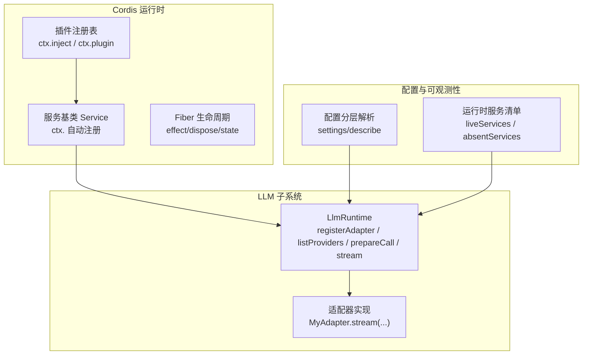
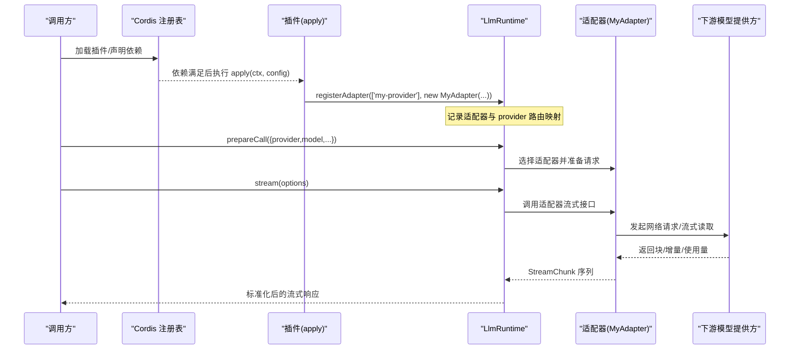
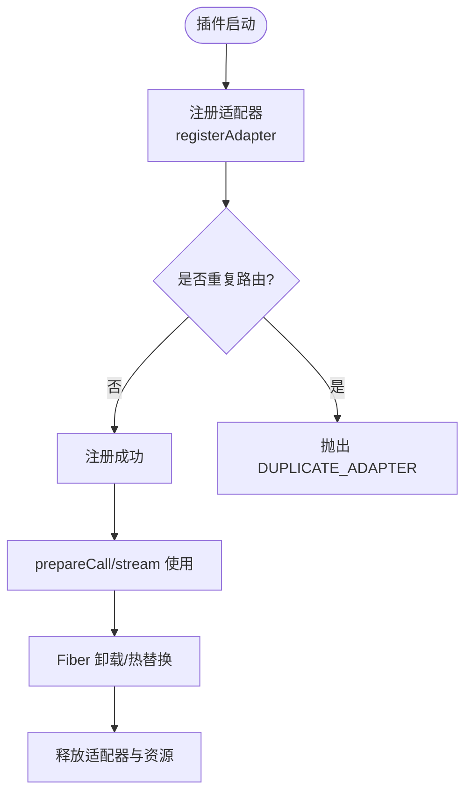
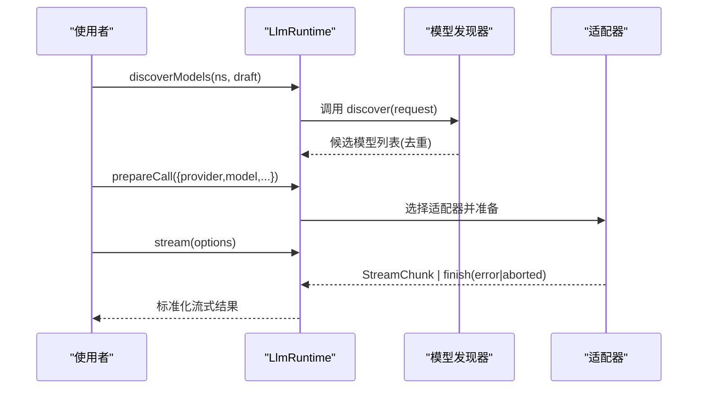
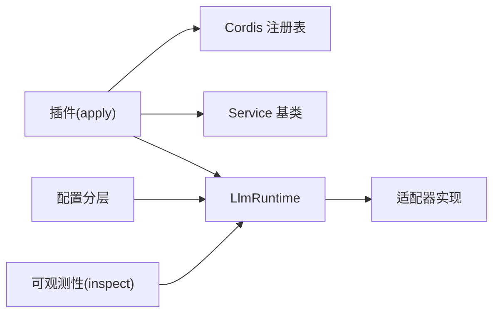

# 服务注册与发现

<cite>
**本文引用的文件**
- [docs/cordis-api/registry.md](file://docs/cordis-api/registry.md)
- [docs/cordis-api/service.md](file://docs/cordis-api/service.md)
- [docs/cordis-tutorial/03-services.md](file://docs/cordis-tutorial/03-services.md)
- [docs/cordis-tutorial/05-config.md](file://docs/cordis-tutorial/05-config.md)
- [docs/subsystems/llm-streaming.md](file://docs/subsystems/llm-streaming.md)
- [docs/cookbook/adding-an-llm-adapter.md](file://docs/cookbook/adding-an-llm-adapter.md)
- [packages/extensions/tool-cordis/src/inspect.ts](file://packages/extensions/tool-cordis/src/inspect.ts)
- [packages/settings/settings/src/index.ts](file://packages/settings/settings/src/index.ts)
- [.agents/notes/implemented/architecture/2026-08-04-configuration-source-ownership.zh.md](file://.agents/notes/implemented/architecture/2026-08-04-configuration-source-ownership.zh.md)
</cite>

## 目录
1. [简介](#简介)
2. [项目结构](#项目结构)
3. [核心组件](#核心组件)
4. [架构总览](#架构总览)
5. [详细组件分析](#详细组件分析)
6. [依赖关系分析](#依赖关系分析)
7. [性能考虑](#性能考虑)
8. [故障排查指南](#故障排查指南)
9. [结论](#结论)
10. [附录](#附录)

## 简介
本文件面向在 Cordis 框架中为 LLM 适配器实现“服务注册与发现”的开发者，系统说明：
- 适配器如何在 Cordis 中以插件形式声明、注入依赖并管理生命周期；
- 服务发现机制如何工作（动态加载、版本/路由选择、故障转移）；
- 配置层次结构与优先级规则；
- 自定义服务注册的完整示例（元数据、健康检查、监控集成）；
- 与服务网格及服务治理的最佳实践。

## 项目结构
围绕 LLM 适配器的注册与发现，仓库提供了三层支撑：
- 运行时服务与插件体系：Cordis 提供插件加载、依赖注入、服务注册与生命周期管理；
- LLM 子系统：抽象出 `LlmRuntime`，负责适配器注册、模型发现、调用准备与流式分发；
- 配置与可观测性：统一的配置分层解析与运行时服务清单/状态暴露。

图表来源
- [docs/cordis-api/registry.md:1-153](file://docs/cordis-api/registry.md#L1-L153)
- [docs/cordis-api/service.md:1-103](file://docs/cordis-api/service.md#L1-L103)
- [docs/subsystems/llm-streaming.md:716-836](file://docs/subsystems/llm-streaming.md#L716-L836)
- [packages/settings/settings/src/index.ts:472-498](file://packages/settings/settings/src/index.ts#L472-L498)
- [packages/extensions/tool-cordis/src/inspect.ts:53-80](file://packages/extensions/tool-cordis/src/inspect.ts#L53-L80)

章节来源
- [docs/cordis-api/registry.md:1-153](file://docs/cordis-api/registry.md#L1-L153)
- [docs/cordis-api/service.md:1-103](file://docs/cordis-api/service.md#L1-L103)
- [docs/subsystems/llm-streaming.md:716-836](file://docs/subsystems/llm-streaming.md#L716-L836)
- [packages/settings/settings/src/index.ts:472-498](file://packages/settings/settings/src/index.ts#L472-L498)
- [packages/extensions/tool-cordis/src/inspect.ts:53-80](file://packages/extensions/tool-cordis/src/inspect.ts#L53-L80)

## 核心组件
- 插件与依赖注入
  - 通过 `ctx.inject(deps, callback)` 或 `ctx.plugin(...)` 加载插件，依赖满足后才执行回调；依赖变化时自动卸载并重载，保证运行期一致性。
  - 支持数组与对象两种依赖声明形式，对象形式可为每个依赖附加拦截配置。
- 服务注册
  - 继承 `Service` 并在构造中调用 `super(ctx, name)` 即完成命名服务注册；实例随所属 fiber 自动回收。
  - 服务名在同一应用内扁平化，需避免冲突。
- LLM 适配器注册与发现
  - `ctx.llm.registerAdapter(providers, adapter)` 将适配器绑定到一组 provider 路由；重复注册会抛出错误，多路由注册为全有或全无。
  - `listProviders()` 列出已注册适配器及其元信息；`registerConfigurableProviders()` 声明可由配置激活的可配置提供者。
  - `discoverModels()`/`listModels()`/`resolveModelInfo()` 用于模型发现与能力校验；`prepareCall()`/`stream()` 完成一次调用的准备与流式执行。
- 配置分层
  - 非机密值统一顺序：本次显式覆盖 > 用户设置 > 组合层 > 进程环境 > 发现的环境文件 > 默认值。
  - 凭据采用独立且更窄的顺序：进程环境 > 提供商管理的凭据文件 > 本地/.env > 全局/.env。
- 可观测性
  - 运行时服务清单与缺失服务可通过 inspect 工具获取，便于诊断与治理。

章节来源
- [docs/cordis-api/registry.md:1-153](file://docs/cordis-api/registry.md#L1-L153)
- [docs/cordis-api/service.md:1-103](file://docs/cordis-api/service.md#L1-L103)
- [docs/cordis-tutorial/03-services.md:1-99](file://docs/cordis-tutorial/03-services.md#L1-L99)
- [docs/subsystems/llm-streaming.md:716-836](file://docs/subsystems/llm-streaming.md#L716-L836)
- [.agents/notes/implemented/architecture/2026-08-04-configuration-source-ownership.zh.md:17-40](file://.agents/notes/implemented/architecture/2026-08-04-configuration-source-ownership.zh.md#L17-L40)
- [packages/extensions/tool-cordis/src/inspect.ts:53-80](file://packages/extensions/tool-cordis/src/inspect.ts#L53-L80)

## 架构总览
下图展示从插件加载到 LLM 适配器注册、模型发现与调用的端到端流程。

图表来源
- [docs/cordis-api/registry.md:1-153](file://docs/cordis-api/registry.md#L1-L153)
- [docs/subsystems/llm-streaming.md:716-836](file://docs/subsystems/llm-streaming.md#L716-L836)
- [docs/cookbook/adding-an-llm-adapter.md:1-44](file://docs/cookbook/adding-an-llm-adapter.md#L1-L44)

## 详细组件分析

### 适配器注册与生命周期
- 注册方式
  - 以插件形式导出 `name`、`inject=['llm']`、`Config` 与 `apply(ctx, config)`，在 `apply` 中调用 `ctx.llm.registerAdapter([...], adapter)`。
  - 注册是“效果式”的（HMR 安全），同一 provider 路由仅允许一个适配器；重复注册抛错；多路由注册为原子性（全部成功或全部失败）。
- 生命周期
  - 适配器实例由 Fiber 拥有，随 Fiber 卸载而释放；插件卸载时，其注册的服务也会一并移除。
  - 若依赖的服务消失（被卸载或热替换），依赖它的插件也会被卸载并在服务恢复后重新加载。

图表来源
- [docs/cookbook/adding-an-llm-adapter.md:1-44](file://docs/cookbook/adding-an-llm-adapter.md#L1-L44)
- [docs/subsystems/llm-streaming.md:716-836](file://docs/subsystems/llm-streaming.md#L716-L836)
- [docs/cordis-tutorial/03-services.md:1-99](file://docs/cordis-tutorial/03-services.md#L1-L99)

章节来源
- [docs/cookbook/adding-an-llm-adapter.md:1-44](file://docs/cookbook/adding-an-llm-adapter.md#L1-L44)
- [docs/cordis-tutorial/03-services.md:1-99](file://docs/cordis-tutorial/03-services.md#L1-L99)
- [docs/subsystems/llm-streaming.md:716-836](file://docs/subsystems/llm-streaming.md#L716-L836)

### 服务发现机制（动态加载、版本管理与故障转移）
- 动态加载
  - 通过 `ctx.llm.registerConfigurableProviders(entries)` 声明可由配置激活的提供者；`listConfigurableProviders()` 可枚举所有已声明条目（含未激活）。
  - 模型发现：`registerModelDiscovery(settingsNs, discover)` 为某个 settings 命名空间提供模型发现能力；`discoverModels(settingsNs, request)` 对草稿请求进行探测，返回去重后的候选模型列表。
- 版本/路由管理
  - 适配器按 provider 路由选择；`options.provider` 决定路由，`options.model` 为具体模型标识。同一路由只能由一个适配器服务，避免歧义。
- 故障转移
  - 适配器侧错误有两种受控路径：从 `stream()` 抛出（传输/协议错误，建议使用稳定错误码），或以 `finish {kind:'error'|'aborted'}` 结束流（提供方内部错误）。上层会将这些异常归一化为终端 chunk。
  - 重试策略：通过 `providerRetryPolicy(provider)` 获取注册时捕获的重试策略；结合 `LlmFailure` 中的 `providerRetryAfterMs` 等字段做决策。

图表来源
- [docs/subsystems/llm-streaming.md:716-836](file://docs/subsystems/llm-streaming.md#L716-L836)

章节来源
- [docs/subsystems/llm-streaming.md:716-836](file://docs/subsystems/llm-streaming.md#L716-L836)

### 服务配置的层次结构与优先级
- 非机密值统一顺序（高到低）
  - 本次显式覆盖（操作级覆盖、CLI 参数）
  - 用户设置（settings.yaml）
  - 组合层（profile bundles、用户 patch 层、--patch overlays）
  - 当前进程的 shell 环境变量
  - 发现的环境文件（<cwd>/.env，然后 $DSH_HOME/.env）
  - 默认值（schema 默认、提供方公开默认）
- 凭据独立顺序（高到低）
  - 继承进程环境变量（只读，最高优先）
  - $DSH_HOME/.credentials.yaml（提供商管理，可写）
  - <cwd>/.env
  - $DSH_HOME/.env
- 配置描述
  - 通过 `describe()` 可获得每个命名空间的 schema、当前值、基础层与用户层差异，便于 UI 呈现与重置。

章节来源
- [.agents/notes/implemented/architecture/2026-08-04-configuration-source-ownership.zh.md:17-40](file://.agents/notes/implemented/architecture/2026-08-04-configuration-source-ownership.zh.md#L17-L40)
- [packages/settings/settings/src/index.ts:472-498](file://packages/settings/settings/src/index.ts#L472-L498)
- [docs/cordis-tutorial/05-config.md:1-85](file://docs/cordis-tutorial/05-config.md#L1-L85)

### 自定义服务注册示例（元数据、健康检查、监控集成）
- 元数据定义
  - 插件导出 `name`、`Config`（Schema）、可选 `provide`/`intercept`；`Config` 同时承担类型与运行时校验。
- 健康检查
  - 在插件的 effect 中注册健康探针；当 Fiber 卸载时自动清理。可基于 `ctx.fiber.state` 与事件监听判断可用性。
- 监控集成
  - 通过 `ctx.on('internal/status')` 监听 Fiber 状态变更；结合 inspect 工具输出 live services 与 absent services，形成可观测闭环。
- 参考路径
  - 插件与依赖注入：[docs/cordis-api/registry.md:1-153](file://docs/cordis-api/registry.md#L1-L153)
  - 服务基类与自动注册：[docs/cordis-api/service.md:1-103](file://docs/cordis-api/service.md#L1-L103)
  - 教程示例（提供/消费服务）：[docs/cordis-tutorial/03-services.md:1-99](file://docs/cordis-tutorial/03-services.md#L1-L99)
  - 配置 Schema 与校验：[docs/cordis-tutorial/05-config.md:1-85](file://docs/cordis-tutorial/05-config.md#L1-L85)
  - 运行时服务清单：[packages/extensions/tool-cordis/src/inspect.ts:53-80](file://packages/extensions/tool-cordis/src/inspect.ts#L53-L80)

章节来源
- [docs/cordis-api/registry.md:1-153](file://docs/cordis-api/registry.md#L1-L153)
- [docs/cordis-api/service.md:1-103](file://docs/cordis-api/service.md#L1-L103)
- [docs/cordis-tutorial/03-services.md:1-99](file://docs/cordis-tutorial/03-services.md#L1-L99)
- [docs/cordis-tutorial/05-config.md:1-85](file://docs/cordis-tutorial/05-config.md#L1-L85)
- [packages/extensions/tool-cordis/src/inspect.ts:53-80](file://packages/extensions/tool-cordis/src/inspect.ts#L53-L80)

### 服务网格集成与服务治理最佳实践
- 服务网格集成建议
  - 将 provider 路由视为“服务地址”，通过 LLM 子系统的适配器注册实现路由与流量控制；利用 `registerConfigurableProviders` 与 `discoverModels` 对接外部目录或服务发现。
  - 借助 `providerRetryPolicy` 与 `LlmFailure` 字段，将重试、熔断、退避策略下沉至网关层。
- 服务治理最佳实践
  - 单一职责：每个 provider 路由仅由一个适配器服务，避免竞态与歧义。
  - 全有或全无：多路由注册失败时整体回滚，防止部分生效。
  - 可观测性：持续输出 live services/absent services，配合健康检查与指标上报。
  - 配置隔离：敏感凭据走独立顺序，避免被普通配置覆盖；非机密值遵循统一优先级。
  - 热更新友好：所有注册均为 effect 式，确保 HMR/热替换下资源正确释放与重建。

章节来源
- [docs/subsystems/llm-streaming.md:716-836](file://docs/subsystems/llm-streaming.md#L716-L836)
- [docs/cookbook/adding-an-llm-adapter.md:1-44](file://docs/cookbook/adding-an-llm-adapter.md#L1-L44)
- [packages/extensions/tool-cordis/src/inspect.ts:53-80](file://packages/extensions/tool-cordis/src/inspect.ts#L53-L80)

## 依赖关系分析
- 插件与服务的耦合
  - 插件通过 `inject` 声明所需服务，Cordis 保证依赖就绪后再执行；服务名扁平化，需避免命名冲突。
- LLM 子系统依赖
  - 适配器依赖 `ctx.llm` 提供的注册与发现能力；调用链通过 `prepareCall` 与 `stream` 解耦上游与下游。
- 配置与可观测性
  - 配置分层影响运行时行为；inspect 工具提供运行时视图，辅助定位缺失服务与状态。

图表来源
- [docs/cordis-api/registry.md:1-153](file://docs/cordis-api/registry.md#L1-L153)
- [docs/cordis-api/service.md:1-103](file://docs/cordis-api/service.md#L1-L103)
- [docs/subsystems/llm-streaming.md:716-836](file://docs/subsystems/llm-streaming.md#L716-L836)
- [packages/extensions/tool-cordis/src/inspect.ts:53-80](file://packages/extensions/tool-cordis/src/inspect.ts#L53-L80)

章节来源
- [docs/cordis-api/registry.md:1-153](file://docs/cordis-api/registry.md#L1-L153)
- [docs/cordis-api/service.md:1-103](file://docs/cordis-api/service.md#L1-L103)
- [docs/subsystems/llm-streaming.md:716-836](file://docs/subsystems/llm-streaming.md#L716-L836)
- [packages/extensions/tool-cordis/src/inspect.ts:53-80](file://packages/extensions/tool-cordis/src/inspect.ts#L53-L80)

## 性能考虑
- 流式处理
  - 适配器应尽早产出 `usage` 并在 `finish` 前结束；避免在 `finish` 之后产生任何数据，减少消费者缓冲压力。
- 模型发现
  - 模型发现需尊重 `request.signal`，避免阻塞；对重复模型进行去重，降低后续处理开销。
- 重试与背压
  - 合理设置重试策略与退避时间，避免雪崩；对上游慢响应进行超时与取消传播。
- 热更新
  - 所有注册与副作用均应为 effect 式，确保热替换时资源及时释放，避免内存泄漏。

[本节为通用指导，不直接分析具体文件]

## 故障排查指南
- 常见症状与定位
  - 插件处于 PENDING：检查 `inject` 依赖是否全部可用；查看缺失服务列表。
  - 适配器重复注册：确认同一 provider 路由未被其他插件注册；多路由注册失败会整体抛错。
  - 模型发现为空：检查 `registerModelDiscovery` 是否正确挂载，以及 `discoverModels` 是否返回有效结果。
- 工具与日志
  - 使用 inspect 工具查看 live services 与 absent services；结合 `ctx.on('internal/status')` 跟踪 Fiber 状态变化。
  - 关注适配器错误路径：抛出异常或 `finish {kind:'error'|'aborted'}`，并记录稳定错误码以便治理。

章节来源
- [packages/extensions/tool-cordis/src/inspect.ts:53-80](file://packages/extensions/tool-cordis/src/inspect.ts#L53-L80)
- [docs/subsystems/llm-streaming.md:716-836](file://docs/subsystems/llm-streaming.md#L716-L836)
- [docs/cordis-tutorial/03-services.md:1-99](file://docs/cordis-tutorial/03-services.md#L1-L99)

## 结论
在 Cordis 框架中，LLM 适配器的注册与发现建立在插件化、依赖注入与效果式生命周期之上。通过 `LlmRuntime` 提供的注册、发现与流式调用能力，结合统一的配置分层与可观测性工具，可实现高内聚、低耦合、可热更新的 LLM 服务生态。遵循“单路由单适配器”“全有或全无注册”“受控错误路径”“配置分层与凭据隔离”等原则，可在生产环境中获得稳定的服务治理能力。

[本节为总结，不直接分析具体文件]

## 附录
- 快速上手
  - 编写适配器类并实现流式接口；在插件 `apply` 中注册到 `ctx.llm`；通过 `prepareCall` 与 `stream` 调用。
  - 使用 `registerConfigurableProviders` 与 `discoverModels` 接入外部模型目录。
- 参考实现
  - 参考适配器布局与协议约定，确保兼容性与可维护性。

[本节为补充说明，不直接分析具体文件]