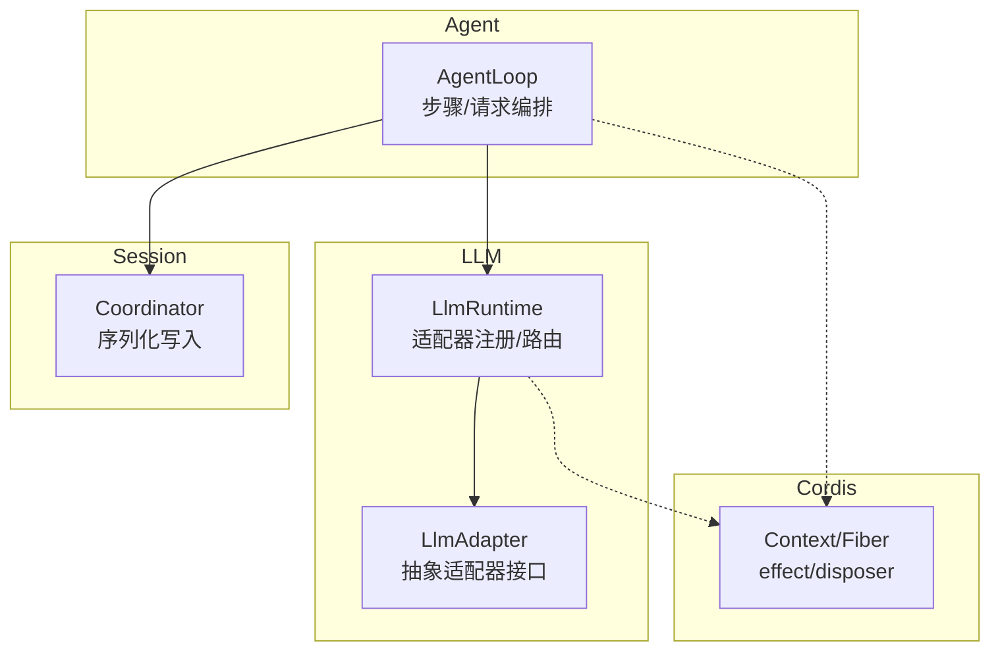
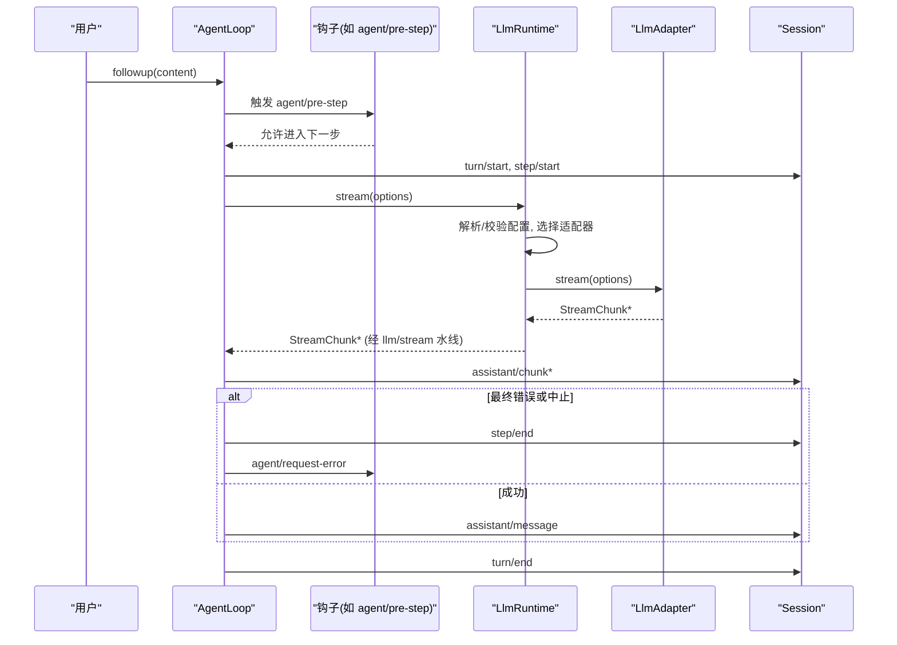
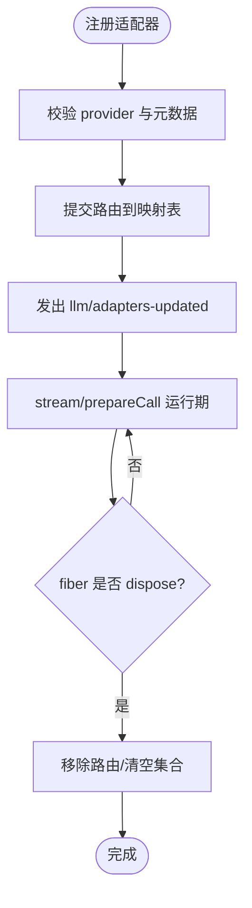
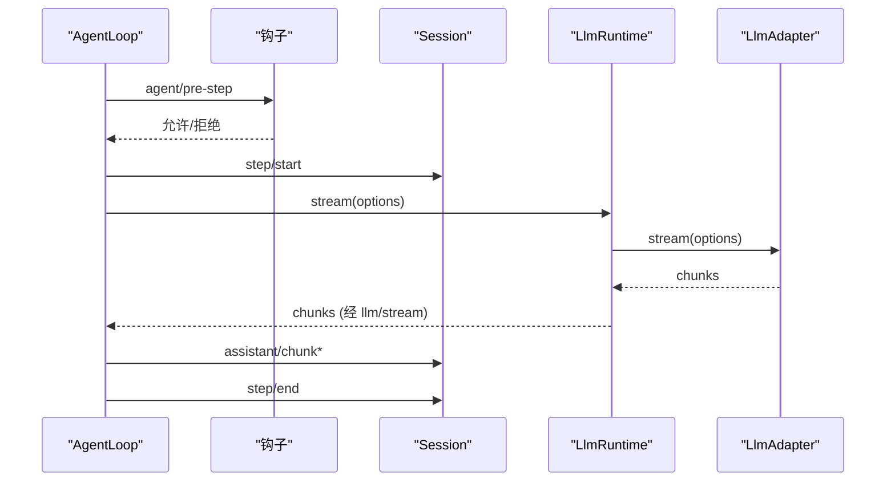
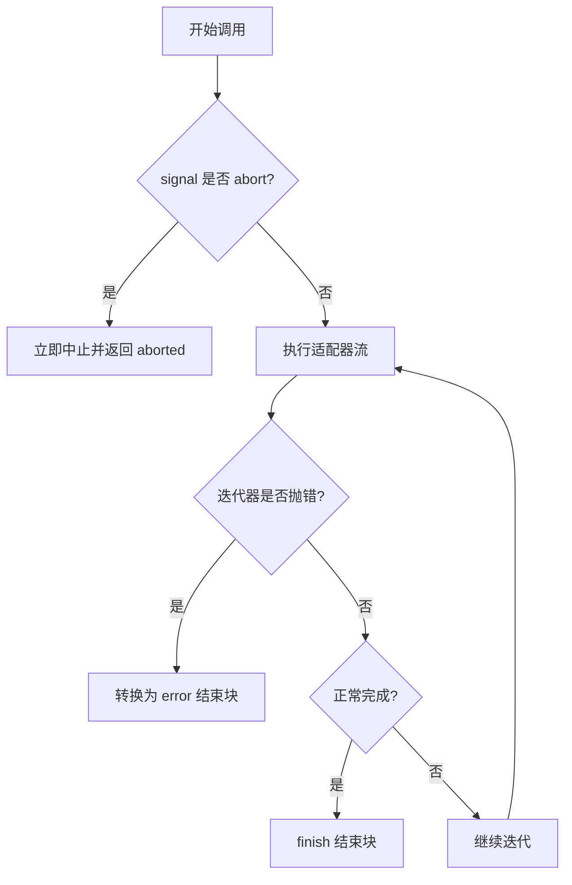
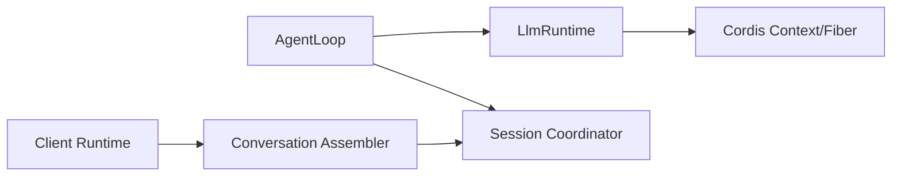

# 生命周期管理

<cite>
**本文引用的文件**
- [packages/llm/llm/src/index.ts](file://packages/llm/llm/src/index.ts)
- [packages/core/agent-loop/src/index.ts](file://packages/core/agent-loop/src/index.ts)
- [docs/cordis-tutorial/02-lifecycle-and-effects.zh.md](file://docs/cordis-tutorial/02-lifecycle-and-effects.zh.md)
- [docs/agent-lifecycle.md](file://docs/agent-lifecycle.md)
- [packages/session/session-persistence/src/coordinator.ts](file://packages/session/session-persistence/src/coordinator.ts)
- [packages/client/runtime/src/client/sessions/conversation-assembler.ts](file://packages/client/runtime/src/client/sessions/conversation-assembler.ts)
</cite>

## 目录
1. [简介](#简介)
2. [项目结构](#项目结构)
3. [核心组件](#核心组件)
4. [架构总览](#架构总览)
5. [详细组件分析](#详细组件分析)
6. [依赖关系分析](#依赖关系分析)
7. [性能考虑](#性能考虑)
8. [故障排查指南](#故障排查指南)
9. [结论](#结论)
10. [附录](#附录)

## 简介
本文件面向 LLM 适配器的生命周期管理，覆盖初始化、启动、运行与销毁四个阶段，解释钩子函数与执行顺序、依赖准备、资源分配与清理；说明异步协调机制与错误恢复策略；提供生命周期事件监听与处理示例（状态变更通知、性能指标采集）；并给出并发安全与资源泄漏防护的最佳实践。文档以代码库中的 LLM 运行时、Agent 循环、Cordis 插件 fiber 以及会话持久化等实现为依据进行系统化梳理。

## 项目结构
围绕 LLM 适配器生命周期的关键位置：
- LLM 服务与适配器注册：位于 packages/llm/llm/src/index.ts，提供适配器注册、模型发现、流式调用与事件水线拦截。
- Agent 循环与取消传播：位于 packages/core/agent-loop/src/index.ts，负责在创建与停用期间统一传播取消信号，避免资源悬挂。
- Cordis 插件生命周期：位于 docs/cordis-tutorial/02-lifecycle-and-effects.zh.md，描述 effect/disposer、fiber 状态机与卸载语义。
- Agent 步骤与请求流程：位于 docs/agent-lifecycle.md，展示 agent/pre-step、llm/stream 等事件与阶段。
- 会话写串行化：位于 packages/session/session-persistence/src/coordinator.ts，保证同 session 的写入不交错。
- 上下文依赖重放：位于 packages/client/runtime/src/client/sessions/conversation-assembler.ts，用于依赖变更后的重放与一致性维护。

图表来源
- [packages/llm/llm/src/index.ts:284-928](file://packages/llm/llm/src/index.ts#L284-L928)
- [packages/core/agent-loop/src/index.ts:474-487](file://packages/core/agent-loop/src/index.ts#L474-L487)
- [docs/cordis-tutorial/02-lifecycle-and-effects.zh.md:68-94](file://docs/cordis-tutorial/02-lifecycle-and-effects.zh.md#L68-L94)
- [packages/session/session-persistence/src/coordinator.ts:1000-1033](file://packages/session/session-persistence/src/coordinator.ts#L1000-L1033)

章节来源
- [packages/llm/llm/src/index.ts:284-928](file://packages/llm/llm/src/index.ts#L284-L928)
- [docs/cordis-tutorial/02-lifecycle-and-effects.zh.md:68-94](file://docs/cordis-tutorial/02-lifecycle-and-effects.zh.md#L68-L94)

## 核心组件
- LlmRuntime：提供适配器注册、可配置提供者目录、模型发现、模型能力解析、调用配置校验与准备、流式调用入口与事件水线拦截。
- LlmAdapter：抽象适配器，定义 providerInfo、listModels、resolveModel、stream 等扩展点。
- Cordis Context/Fiber：插件加载/卸载的生命周期容器，effect/disposer 自动随 fiber 生命周期管理。
- AgentLoop：编排 agent 的 turn/step，注入 pre-step 钩子，驱动 llm/stream 调用，并在失败时进入重试或终止流程。
- Session Coordinator：对同一 session 的写操作进行串行化，避免并发交错导致的不一致。
- Conversation Assembler：维护依赖图，支持依赖替换后的重放，确保上下文一致性。

章节来源
- [packages/llm/llm/src/index.ts:174-928](file://packages/llm/llm/src/index.ts#L174-L928)
- [docs/cordis-tutorial/02-lifecycle-and-effects.zh.md:68-94](file://docs/cordis-tutorial/02-lifecycle-and-effects.zh.md#L68-L94)
- [packages/core/agent-loop/src/index.ts:474-487](file://packages/core/agent-loop/src/index.ts#L474-L487)
- [packages/session/session-persistence/src/coordinator.ts:1000-1033](file://packages/session/session-persistence/src/coordinator.ts#L1000-L1033)
- [packages/client/runtime/src/client/sessions/conversation-assembler.ts:556-586](file://packages/client/runtime/src/client/sessions/conversation-assembler.ts#L556-L586)

## 架构总览
下图展示了从 Agent 发起一轮请求到 LLM 适配器流式返回的关键路径，以及生命周期钩子的介入点。

图表来源
- [docs/agent-lifecycle.md:8-72](file://docs/agent-lifecycle.md#L8-L72)
- [packages/llm/llm/src/index.ts:913-927](file://packages/llm/llm/src/index.ts#L913-L927)
- [packages/core/agent-loop/src/index.ts:474-487](file://packages/core/agent-loop/src/index.ts#L474-L487)

## 详细组件分析

### LLM 适配器生命周期（初始化/启动/运行/销毁）
- 初始化
  - 通过 registerAdapter 将适配器实例与一组 provider 路由绑定，内部会校验 provider 名称、元数据、重复性，并生成注册项。
  - 通过 registerConfigurableProviders 声明可配置提供者目录，供设置界面动态启用。
  - 通过 registerModelDiscovery 为特定 settings namespace 注册模型发现回调。
- 启动
  - 首次调用 prepareCall/listModels/resolveModelInfo 时会读取已注册的适配器能力，完成配置默认值填充与能力校验。
  - 所有注册均作为 effect 挂载到当前 fiber，随插件卸载自动撤销。
- 运行
  - stream 入口通过 waterfall 暴露 llm/stream 事件，允许中间件拦截、重试、回放、指标收集等。
  - adapterStream 负责选择适配器、构造迭代器、捕获异常并转换为 finish/error/aborted 结束块，确保下游消费端看到一致的终止语义。
- 销毁
  - 当持有注册的 fiber 被 dispose 时，对应 effect 的 disposer 会移除路由、清空集合并广播 llm/adapters-updated。
  - 若 replace 在 disposed 后调用，会抛出 REGISTRATION_DISPOSED，防止使用失效句柄。

图表来源
- [packages/llm/llm/src/index.ts:330-413](file://packages/llm/llm/src/index.ts#L330-L413)
- [packages/llm/llm/src/index.ts:431-484](file://packages/llm/llm/src/index.ts#L431-L484)
- [packages/llm/llm/src/index.ts:504-521](file://packages/llm/llm/src/index.ts#L504-L521)
- [packages/llm/llm/src/index.ts:913-927](file://packages/llm/llm/src/index.ts#L913-L927)

章节来源
- [packages/llm/llm/src/index.ts:330-413](file://packages/llm/llm/src/index.ts#L330-L413)
- [packages/llm/llm/src/index.ts:431-484](file://packages/llm/llm/src/index.ts#L431-L484)
- [packages/llm/llm/src/index.ts:504-521](file://packages/llm/llm/src/index.ts#L504-L521)
- [packages/llm/llm/src/index.ts:913-927](file://packages/llm/llm/src/index.ts#L913-L927)

### 钩子函数与执行顺序（pre-step、llm/stream）
- agent/pre-step：在每步开始前由 AgentLoop 触发，可用于拒绝、改写消息、压力测试或前置检查。
- llm/stream：每次流式调用都会经过该水线，适合做重试、回放、鉴权、指标统计与审计。
- 执行顺序：先 agent/pre-step，再进入 session/step 记录与 prompt 组装，随后进入 llm/stream 水线与适配器流式输出。

图表来源
- [docs/agent-lifecycle.md:8-72](file://docs/agent-lifecycle.md#L8-L72)
- [packages/llm/llm/src/index.ts:913-927](file://packages/llm/llm/src/index.ts#L913-L927)

章节来源
- [docs/agent-lifecycle.md:8-72](file://docs/agent-lifecycle.md#L8-L72)
- [packages/llm/llm/src/index.ts:913-927](file://packages/llm/llm/src/index.ts#L913-L927)

### 异步协调与错误恢复
- 取消传播：AgentLoop 在创建与停用时统一关联 callerSignal 与工厂侧 ownership.signal，任一 abort 都会中断后续异步过程，避免悬挂任务。
- 适配器流终止：adapterStream 将适配器抛错或迭代器异常转换为 finish/error/aborted 结束块，保证下游消费端稳定。
- 会话写入串行化：Coordinator 对同一 session 的操作按 id 串行化，避免并发写交错；失败不会污染后续链。
- 依赖重放：ConversationAssembler 在依赖变更后追踪受影响上下文并重放，保持 UI/状态一致性。

图表来源
- [packages/core/agent-loop/src/index.ts:474-487](file://packages/core/agent-loop/src/index.ts#L474-L487)
- [packages/llm/llm/src/index.ts:843-900](file://packages/llm/llm/src/index.ts#L843-L900)
- [packages/session/session-persistence/src/coordinator.ts:1000-1033](file://packages/session/session-persistence/src/coordinator.ts#L1000-L1033)

章节来源
- [packages/core/agent-loop/src/index.ts:474-487](file://packages/core/agent-loop/src/index.ts#L474-L487)
- [packages/llm/llm/src/index.ts:843-900](file://packages/llm/llm/src/index.ts#L843-L900)
- [packages/session/session-persistence/src/coordinator.ts:1000-1033](file://packages/session/session-persistence/src/coordinator.ts#L1000-L1033)

### 生命周期事件监听与处理示例
- 状态变更通知
  - 监听 llm/adapters-updated：在适配器注册/替换/释放时触发，适合刷新可用模型列表或 UI。
  - 监听 internal/status：Fiber 状态变化时触发，可用于诊断与监控。
- 性能指标收集
  - 在 llm/stream 水线中记录请求开始时间、适配器选择耗时、首包延迟、总时长与 token 用量。
  - 在 agent/pre-step 中记录步骤排队与进入耗时，便于定位瓶颈。
- 示例要点
  - 使用 ctx.waterfall('llm/stream', ...) 包裹 next() 前后打点。
  - 在 effect 内注册监听器，随 fiber 卸载自动移除，避免内存泄漏。

章节来源
- [packages/llm/llm/src/index.ts:296-328](file://packages/llm/llm/src/index.ts#L296-L328)
- [packages/llm/llm/src/index.ts:913-927](file://packages/llm/llm/src/index.ts#L913-L927)
- [docs/cordis-tutorial/02-lifecycle-and-effects.zh.md:84-94](file://docs/cordis-tutorial/02-lifecycle-and-effects.zh.md#L84-L94)

### 并发安全与资源泄漏防护最佳实践
- 并发安全
  - 适配器路由替换 commitRoutes 在同一同步区块内完成，避免观察者看到中间态。
  - 会话写入通过 serialize 按 session id 串行化，失败吞掉以保护后续等待者。
  - 依赖变更使用 replaceDependencies + replayRevisedDependents 保证一致性。
- 资源泄漏防护
  - 所有注册（registerAdapter/registerConfigurableProviders/registerModelDiscovery）都作为 effect 管理，随 fiber 卸载自动清理。
  - 外部资源（定时器、连接、watcher）必须用 ctx.effect 包装并返回 disposer。
  - 在 adapterStream 中确保 iterator.return 被调用，即使发生异常也能关闭上游资源。
  - 在 AgentLoop 中统一传播取消信号，避免长任务悬挂。

章节来源
- [packages/llm/llm/src/index.ts:330-413](file://packages/llm/llm/src/index.ts#L330-L413)
- [packages/llm/llm/src/index.ts:843-900](file://packages/llm/llm/src/index.ts#L843-L900)
- [packages/session/session-persistence/src/coordinator.ts:1000-1033](file://packages/session/session-persistence/src/coordinator.ts#L1000-L1033)
- [packages/client/runtime/src/client/sessions/conversation-assembler.ts:556-586](file://packages/client/runtime/src/client/sessions/conversation-assembler.ts#L556-L586)
- [docs/cordis-tutorial/02-lifecycle-and-effects.zh.md:84-94](file://docs/cordis-tutorial/02-lifecycle-and-effects.zh.md#L84-L94)

## 依赖关系分析
- LlmRuntime 依赖 Cordis 的 Context/Service/waterfall/effect 机制来管理生命周期与事件。
- AgentLoop 依赖 LlmRuntime 进行模型调用，并通过钩子与 Session 协作。
- Session Coordinator 提供跨调用的串行化保障，避免并发写冲突。
- Conversation Assembler 维护依赖图，支持依赖更新后的重放。

图表来源
- [packages/core/agent-loop/src/index.ts:474-487](file://packages/core/agent-loop/src/index.ts#L474-L487)
- [packages/llm/llm/src/index.ts:284-928](file://packages/llm/llm/src/index.ts#L284-L928)
- [packages/session/session-persistence/src/coordinator.ts:1000-1033](file://packages/session/session-persistence/src/coordinator.ts#L1000-L1033)
- [packages/client/runtime/src/client/sessions/conversation-assembler.ts:556-586](file://packages/client/runtime/src/client/sessions/conversation-assembler.ts#L556-L586)

章节来源
- [packages/core/agent-loop/src/index.ts:474-487](file://packages/core/agent-loop/src/index.ts#L474-L487)
- [packages/llm/llm/src/index.ts:284-928](file://packages/llm/llm/src/index.ts#L284-L928)
- [packages/session/session-persistence/src/coordinator.ts:1000-1033](file://packages/session/session-persistence/src/coordinator.ts#L1000-L1033)
- [packages/client/runtime/src/client/sessions/conversation-assembler.ts:556-586](file://packages/client/runtime/src/client/sessions/conversation-assembler.ts#L556-L586)

## 性能考虑
- 适配器路由替换与 emitAdaptersUpdated 尽量保持同步与最小临界区，减少观察者的抖动。
- 在 llm/stream 中避免阻塞型操作，优先使用非阻塞 I/O 与背压友好的流式处理。
- 对高频指标采集采用批量上报或采样策略，降低开销。
- 会话写入串行化虽增加局部等待，但能显著降低不一致导致的回滚与重试成本。

[本节为通用指导，无需具体文件引用]

## 故障排查指南
- 常见问题
  - 适配器未注册：调用 resolveModelInfo/prepareCall 时报 NO_ADAPTER，需检查 registerAdapter 是否生效且未被 dispose。
  - 重复注册：DUPLICATE_ADAPTER，检查 providers 是否唯一且未被其他注册占用。
  - 配置不匹配：INVALID_PREPARED_CALL，prepareCall 后再次修改 options 或未使用 prepared.stream。
  - 模型能力不支持：UNSUPPORTED_REASONING_EFFORT，检查 resolveModelInfo 返回的能力集。
- 调试建议
  - 订阅 llm/adapters-updated 与 internal/status，确认注册与 fiber 状态。
  - 在 llm/stream 水线中打印请求摘要与错误码，快速定位问题阶段。
  - 对长时间运行的流式调用，关注 AbortSignal 是否提前触发。

章节来源
- [packages/llm/llm/src/index.ts:330-413](file://packages/llm/llm/src/index.ts#L330-L413)
- [packages/llm/llm/src/index.ts:779-814](file://packages/llm/llm/src/index.ts#L779-L814)
- [packages/llm/llm/src/index.ts:843-900](file://packages/llm/llm/src/index.ts#L843-L900)

## 结论
LLM 适配器的生命周期由 Cordis 的 fiber/effect 机制统一管理，配合 LlmRuntime 的注册、能力解析与流式调用水线，形成清晰的初始化、启动、运行与销毁流程。AgentLoop 通过 pre-step 与 request-error 钩子实现强控制与恢复策略；会话层通过串行化与依赖重放保障一致性。遵循本文的最佳实践可有效避免并发问题与资源泄漏，提升系统的稳定性与可观测性。

[本节为总结，无需具体文件引用]

## 附录
- 术语
  - Fiber：插件实例的运行时句柄，承载加载/卸载生命周期。
  - Effect：与 fiber 生命周期绑定的副作用，包含资源获取与释放。
  - Waterfall：可插拔的事件管道，允许中间件拦截与增强。
- 参考
  - Cordis 教程关于生命周期与 effect 的说明。
  - Agent 步骤与请求流程图，理解钩子介入时机。

[本节为补充信息，无需具体文件引用]