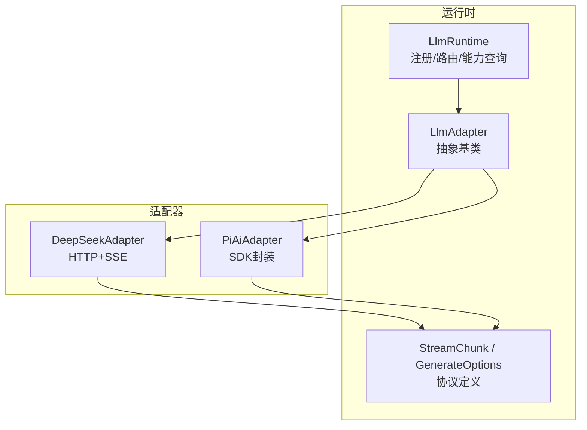
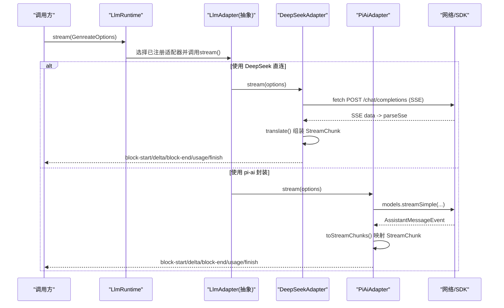
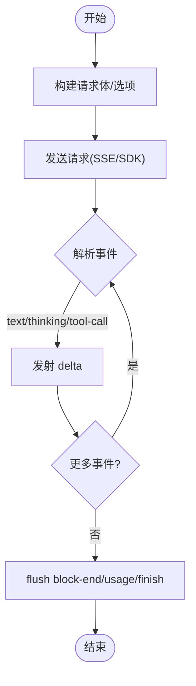
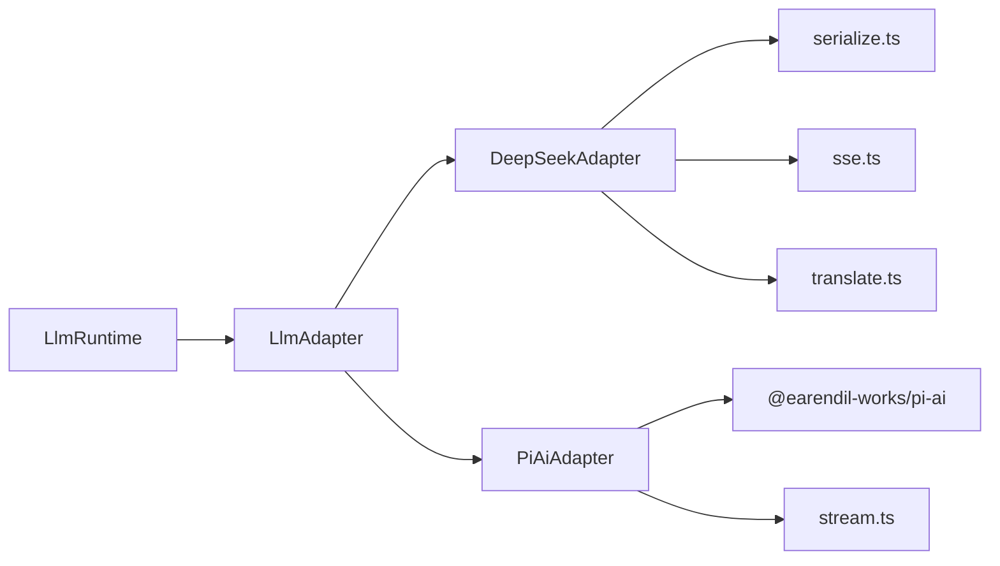
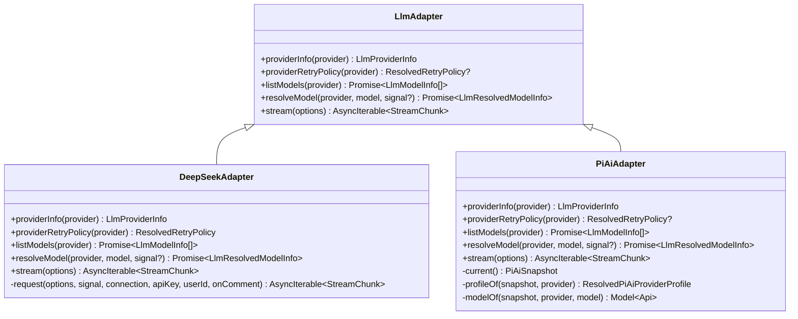

# 自定义适配器开发

<cite>
**本文引用的文件**
- [packages/llm/llm/src/index.ts](file://packages/llm/llm/src/index.ts)
- [packages/llm/llm/src/types.ts](file://packages/llm/llm/src/types.ts)
- [packages/llm/llm/src/error.ts](file://packages/llm/llm/src/error.ts)
- [packages/llm/llm-deepseek/src/adapter.ts](file://packages/llm/llm-deepseek/src/adapter.ts)
- [packages/llm/llm-deepseek/src/translate.ts](file://packages/llm/llm-deepseek/src/translate.ts)
- [packages/llm/llm-pi-ai/src/adapter.ts](file://packages/llm/llm-pi-ai/src/adapter.ts)
- [packages/llm/llm-pi-ai/src/stream.ts](file://packages/llm/llm-pi-ai/src/stream.ts)
- [docs/cookbook/adding-an-llm-adapter.md](file://docs/cookbook/adding-an-llm-adapter.md)
- [packages/llm/llm-deepseek/tests/adapter.spec.ts](file://packages/llm/llm-deepseek/tests/adapter.spec.ts)
- [packages/llm/llm-pi-ai/tests/adapter.spec.ts](file://packages/llm/llm-pi-ai/tests/adapter.spec.ts)
</cite>

## 目录
1. [简介](#简介)
2. [项目结构](#项目结构)
3. [核心组件](#核心组件)
4. [架构总览](#架构总览)
5. [详细组件分析](#详细组件分析)
6. [依赖关系分析](#依赖关系分析)
7. [性能考虑](#性能考虑)
8. [故障排查指南](#故障排查指南)
9. [结论](#结论)
10. [附录](#附录)

## 简介
本指南面向希望为 Harness LLM 服务实现自定义适配器的开发者。内容覆盖：
- 如何继承基础类、实现接口方法、处理配置与注册
- 消息格式转换：请求构建、响应解析、数据映射
- 错误处理策略：网络异常、API 限制、业务错误的统一处理
- 完整示例：从简单文本生成到复杂流式对话（含工具调用）
- 单元测试与集成测试策略

## 项目结构
LLM 子系统由“抽象运行时 + 具体适配器”组成：
- 抽象运行时提供适配器注册、模型能力查询、流式调用入口与错误体系
- 具体适配器负责将上游协议（HTTP/SSE 或第三方 SDK）转换为统一的 StreamChunk 协议
- 两个参考实现：
  - DeepSeek 直连 HTTP+SSE 适配器
  - pi-ai 多提供商适配器（封装第三方 SDK）

图表来源
- [packages/llm/llm/src/index.ts:174-233](file://packages/llm/llm/src/index.ts#L174-L233)
- [packages/llm/llm/src/types.ts:283-303](file://packages/llm/llm/src/types.ts#L283-L303)
- [packages/llm/llm-deepseek/src/adapter.ts:151-173](file://packages/llm/llm-deepseek/src/adapter.ts#L151-L173)
- [packages/llm/llm-pi-ai/src/adapter.ts:181-249](file://packages/llm/llm-pi-ai/src/adapter.ts#L181-L249)

章节来源
- [packages/llm/llm/src/index.ts:174-233](file://packages/llm/llm/src/index.ts#L174-L233)
- [packages/llm/llm/src/types.ts:283-303](file://packages/llm/llm/src/types.ts#L283-L303)

## 核心组件
- LlmAdapter：抽象基类，要求实现 stream(options)，可选实现 providerInfo、providerRetryPolicy、listModels、resolveModel
- LlmRuntime：适配器注册、可配置提供者目录、模型发现、能力校验、prepareCall 等
- StreamChunk：统一的流式协议块（block-start/text-delta/reasoning-delta/tool-call-delta/block-end/usage/finish）
- GenerateOptions：一次调用的输入参数（provider/model/messages/tools/temperature/maxTokens/stop/signal/sessionId/purpose）
- LlmError/HarnessError：统一错误类型与稳定 code，便于上层按码路由重试/降级/提示

章节来源
- [packages/llm/llm/src/index.ts:174-233](file://packages/llm/llm/src/index.ts#L174-L233)
- [packages/llm/llm/src/types.ts:319-356](file://packages/llm/llm/src/types.ts#L319-L356)
- [packages/llm/llm/src/error.ts:13-22](file://packages/llm/llm/src/error.ts#L13-L22)

## 架构总览
下图展示一次流式调用从高层到适配器的调用链，以及两种适配器的差异路径。

图表来源
- [packages/llm/llm/src/index.ts:284-367](file://packages/llm/llm/src/index.ts#L284-L367)
- [packages/llm/llm-deepseek/src/adapter.ts:214-345](file://packages/llm/llm-deepseek/src/adapter.ts#L214-L345)
- [packages/llm/llm-pi-ai/src/adapter.ts:276-357](file://packages/llm/llm-pi-ai/src/adapter.ts#L276-L357)

## 详细组件分析

### 基础类与接口契约
- 必须实现：stream(options)
- 建议实现：
  - providerInfo(provider)：返回 {id, name}
  - providerRetryPolicy(provider)：返回已解析的重试策略
  - listModels(provider)：返回可发现的模型元数据（仅建议性）
  - resolveModel(provider, model, signal?)：返回精确模型的上下文窗口、默认 maxTokens、推理努力等级等
- 协议约定（来自 cookbook 与类型定义）：
  - usage 必须在 finish 之前发出；finish 之后不得再发任何块
  - tool-call 的 arguments 必须是原始 JSON 字符串；增量以 argumentsDelta 形式传递
  - 为每个首次出现的块分配 index，并在该块的所有 delta 中复用
  - 错误两条合法路径：throw LlmError（传输/协议失败），或在 finish 中以 kind:'error'|'aborted' 结束
  - 必须尊重 options.signal；不支持的能力应抛出 UNSUPPORTED 而非静默丢弃
  - 如需原生 replayState，应在 finish.replayState 中携带最小无损 JSON 投影

章节来源
- [packages/llm/llm/src/index.ts:174-233](file://packages/llm/llm/src/index.ts#L174-L233)
- [packages/llm/llm/src/types.ts:283-303](file://packages/llm/llm/src/types.ts#L283-L303)
- [docs/cookbook/adding-an-llm-adapter.md:25-35](file://docs/cookbook/adding-an-llm-adapter.md#L25-L35)

### 配置与注册
- 通过 ctx.llm.registerAdapter(['route'], new MyAdapter(...)) 注册适配器
- 支持 registerConfigurableProviders 声明可配置提供者目录
- 支持 registerModelDiscovery 暴露端点探测能力
- 插件内通过 apply(ctx, config) 完成注册；密钥通过 cordis Config 与环境变量注入，不在代码中硬编码

章节来源
- [packages/llm/llm/src/index.ts:330-484](file://packages/llm/llm/src/index.ts#L330-L484)
- [docs/cookbook/adding-an-llm-adapter.md:7-23](file://docs/cookbook/adding-an-llm-adapter.md#L7-L23)

### 消息格式转换（请求构建、响应解析、数据映射）
- DeepSeek 适配器
  - 请求：序列化 GenerateOptions 为 OpenAI 兼容 JSON，附加授权头、用户标识、会话 ID、用途标记等
  - 响应：SSE 事件经 parseSse 后进入 translate，维护 open blocks，最终在 [DONE] 时输出 block-end、usage、finish
  - 工具调用：arguments 保持原始 JSON 字符串；name/id 在首个 delta 出现时记录
- pi-ai 适配器
  - 请求：基于 profile 与 Resolve 后的 Models 集合构造 SimpleStreamOptions，透传 temperature/maxTokens/sessionId 等
  - 响应：toStreamChunks 将 AssistantMessageEvent 映射为 StreamChunk；tool-call 的 parsed arguments 在结束时序列化为原始 JSON 字符串
  - 终止：done/error 事件分别映射为 usage+finish；空内容 stop 映射为 EMPTY_RESPONSE

图表来源
- [packages/llm/llm-deepseek/src/adapter.ts:271-345](file://packages/llm/llm-deepseek/src/adapter.ts#L271-L345)
- [packages/llm/llm-deepseek/src/translate.ts:86-185](file://packages/llm/llm-deepseek/src/translate.ts#L86-L185)
- [packages/llm/llm-pi-ai/src/stream.ts:124-209](file://packages/llm/llm-pi-ai/src/stream.ts#L124-L209)

章节来源
- [packages/llm/llm-deepseek/src/adapter.ts:214-345](file://packages/llm/llm-deepseek/src/adapter.ts#L214-L345)
- [packages/llm/llm-deepseek/src/translate.ts:86-185](file://packages/llm/llm-deepseek/src/translate.ts#L86-L185)
- [packages/llm/llm-pi-ai/src/stream.ts:124-209](file://packages/llm/llm-pi-ai/src/stream.ts#L124-L209)

### 错误处理策略
- 统一错误类型：LlmError(code, message, options) 继承自 HarnessError，携带稳定 code 与可选 status/providerRetryAfterMs/requestId
- 分类规则：
  - 认证失败：AUTH
  - 配额耗尽：QUOTA
  - 速率限制：RATE_LIMIT
  - 上下文窗口超限：CONTEXT_WINDOW_EXCEEDED（通过文本模式匹配识别）
  - 无效请求：INVALID_REQUEST
  - 服务端错误：SERVER
  - 传输错误：TRANSPORT
  - 空响应：EMPTY_RESPONSE
  - 不支持的能力/选项：UNSUPPORTED_REASONING_EFFORT / UNSUPPORTED_OPTION
- 两种错误投递方式：
  - throw LlmError：用于传输/协议失败
  - finish{kind:'error'|'aborted'}：用于提供方内联错误
- 超时与取消：
  - 空闲超时：idleWatchdog 检测无活动读取，抛出 TIMEOUT
  - 调用方取消：options.signal 传播，抛 ABORTED

章节来源
- [packages/llm/llm/src/error.ts:13-164](file://packages/llm/llm/src/error.ts#L13-L164)
- [packages/llm/llm-deepseek/src/adapter.ts:117-149](file://packages/llm/llm-deepseek/src/adapter.ts#L117-L149)
- [packages/llm/llm-pi-ai/src/stream.ts:31-62](file://packages/llm/llm-pi-ai/src/stream.ts#L31-L62)
- [packages/llm/llm-deepseek/src/adapter.ts:246-259](file://packages/llm/llm-deepseek/src/adapter.ts#L246-L259)
- [packages/llm/llm-pi-ai/src/adapter.ts:346-353](file://packages/llm/llm-pi-ai/src/adapter.ts#L346-L353)

### 完整开发示例

#### 示例一：简单文本生成（DeepSeek 直连）
- 步骤
  - 继承 LlmAdapter，实现 stream(options)
  - 使用 fetch 发起 POST /chat/completions，设置 authorization/content-type/accept 等头
  - 解析 SSE，使用 translate 将事件转为 StreamChunk
  - 在 finish 前输出 usage，finish 后不再输出
- 关键点
  - 使用 AbortController 合并 caller 信号与内部空闲超时
  - 非 2xx 响应映射为 LlmError，包含 status/code/providerRetryAfterMs/requestId
  - 空内容完成映射为 EMPTY_RESPONSE

章节来源
- [packages/llm/llm-deepseek/src/adapter.ts:151-173](file://packages/llm/llm-deepseek/src/adapter.ts#L151-L173)
- [packages/llm/llm-deepseek/src/adapter.ts:214-345](file://packages/llm/llm-deepseek/src/adapter.ts#L214-L345)
- [packages/llm/llm-deepseek/src/translate.ts:86-185](file://packages/llm/llm-deepseek/src/translate.ts#L86-L185)

#### 示例二：复杂流式对话（pi-ai 多提供商）
- 步骤
  - 继承 LlmAdapter，实现 stream(options)
  - 通过 createModels/profiles 获取模型能力，resolveModel 返回 contextWindow/defaultMaxTokens/reasoning
  - 使用 models.streamSimple 发起流式调用，toStreamChunks 将事件映射为 StreamChunk
  - 对工具调用：将解析后的 arguments 在结束时序列化为原始 JSON 字符串
- 关键点
  - 支持 reasoning effort 的动态选择与校验
  - 图片输入需检查模型 input 能力并接入附件服务
  - 停止原因映射：stop/length/toolUse/aborted/error，空内容 stop 映射为 EMPTY_RESPONSE

章节来源
- [packages/llm/llm-pi-ai/src/adapter.ts:181-274](file://packages/llm/llm-pi-ai/src/adapter.ts#L181-L274)
- [packages/llm/llm-pi-ai/src/adapter.ts:276-357](file://packages/llm/llm-pi-ai/src/adapter.ts#L276-L357)
- [packages/llm/llm-pi-ai/src/stream.ts:124-209](file://packages/llm/llm-pi-ai/src/stream.ts#L124-L209)

### 单元测试编写指南
- 使用 mock server 模拟 SSE/HTTP 响应，验证：
  - 流式块顺序：block-start → text-delta/reasoning-delta/tool-call-delta → block-end → usage → finish
  - 头部字段：authorization/user-agent/x-deepseek-harness-user-id/x-deepseek-harness-session-id/x-deepseek-harness-compact
  - 行为：动态切换 reasoning effort、maxTokens 默认值、unsupported option 拒绝
- 断言要点
  - finish.reason 与 usage 的顺序与存在性
  - 错误码：AUTH/RATE_LIMIT/CONTEXT_WINDOW_EXCEEDED/EMPTY_RESPONSE/UNSUPPORTED_*
  - 请求体字段：model/temperature/max_tokens/reasoning_effort/stream/stream_options

章节来源
- [packages/llm/llm-deepseek/tests/adapter.spec.ts:59-200](file://packages/llm/llm-deepseek/tests/adapter.spec.ts#L59-L200)
- [packages/llm/llm-pi-ai/tests/adapter.spec.ts:59-200](file://packages/llm/llm-pi-ai/tests/adapter.spec.ts#L59-L200)

### 集成测试策略
- 端到端装配器 assemble：组合 LlmRuntime + 插件 + 适配器，验证真实链路
- 场景覆盖
  - 正常文本生成、工具调用、推理模式切换
  - 错误恢复：配额/限流/上下文溢出/空响应
  - 跨配置热更新：HMR 安全，操作级快照隔离
- 指标与追踪
  - 验证 attributionHeaders 是否注入
  - 验证 sessionId/userId/compact 标记是否正确透传

章节来源
- [packages/llm/llm-deepseek/tests/adapter.spec.ts:59-200](file://packages/llm/llm-deepseek/tests/adapter.spec.ts#L59-L200)
- [packages/llm/llm-pi-ai/tests/adapter.spec.ts:59-200](file://packages/llm/llm-pi-ai/tests/adapter.spec.ts#L59-L200)

## 依赖关系分析
- LlmRuntime 依赖 LlmAdapter 抽象，管理适配器注册表与可配置提供者目录
- DeepSeekAdapter 依赖 serialize/parseSse/translate 模块，直接进行 HTTP+SSE 通信
- PiAiAdapter 依赖 @earendil-works/pi-ai SDK，通过 Models.streamSimple 获取事件流
- 两者均依赖 @deepseek-ai/dsh-llm 的类型与错误体系

图表来源
- [packages/llm/llm/src/index.ts:284-367](file://packages/llm/llm/src/index.ts#L284-L367)
- [packages/llm/llm-deepseek/src/adapter.ts:214-345](file://packages/llm/llm-deepseek/src/adapter.ts#L214-L345)
- [packages/llm/llm-pi-ai/src/adapter.ts:276-357](file://packages/llm/llm-pi-ai/src/adapter.ts#L276-L357)

章节来源
- [packages/llm/llm/src/index.ts:284-367](file://packages/llm/llm/src/index.ts#L284-L367)
- [packages/llm/llm-deepseek/src/adapter.ts:214-345](file://packages/llm/llm-deepseek/src/adapter.ts#L214-L345)
- [packages/llm/llm-pi-ai/src/adapter.ts:276-357](file://packages/llm/llm-pi-ai/src/adapter.ts#L276-L357)

## 性能考虑
- 流式处理：尽量增量产出 StreamChunk，避免全量缓冲
- 空闲超时：使用 idleWatchdog 防止长连接挂起
- 信号合并：AbortSignal.any 合并 caller 与内部信号，及时释放资源
- 重试策略：providerRetryPolicy 由适配器提供，运行时捕获并应用
- 头部与元数据：最小化额外头部，避免影响握手与首包延迟

[本节为通用指导，不直接分析具体文件]

## 故障排查指南
- 常见问题定位
  - 认证失败：检查 authorization 头与密钥来源（env/credentials seam）
  - 配额耗尽：根据 QUOTA 码提示调整用量或升级套餐
  - 速率限制：根据 RATE_LIMIT 码实施退避重试
  - 上下文溢出：CONTEXT_WINDOW_EXCEEDED 码提示压缩历史或缩短 prompt
  - 空响应：EMPTY_RESPONSE 表示完成但无内容，适合重试
  - 传输错误：TRANSPORT 码关注 DNS/TLS/代理/连接中断
- 诊断工具
  - errorChain：渲染完整的 cause 链与 AggregateError 成员
  - isContextWindowExceededError/isQuotaExceededError：识别特定错误语义
  - httpErrorCode：将 HTTP 状态映射为稳定 code

章节来源
- [packages/llm/llm/src/error.ts:13-164](file://packages/llm/llm/src/error.ts#L13-L164)
- [packages/llm/llm-deepseek/src/adapter.ts:117-149](file://packages/llm/llm-deepseek/src/adapter.ts#L117-L149)
- [packages/llm/llm-pi-ai/src/stream.ts:31-62](file://packages/llm/llm-pi-ai/src/stream.ts#L31-L62)

## 结论
实现一个符合规范的自定义 LLM 适配器，关键在于：
- 严格遵循 StreamChunk 协议与 FinishReason 约定
- 将 provider 特定的错误与能力映射为稳定的 code 与元数据
- 在适配器层完成请求构建、SSE/SDK 事件解析与数据映射
- 通过 LlmRuntime 的注册与能力查询机制，无缝融入系统生态
- 借助完善的单测与集成测试，保障正确性与稳定性

[本节为总结性内容，不直接分析具体文件]

## 附录

### 适配器类图（代码级）

图表来源
- [packages/llm/llm/src/index.ts:174-233](file://packages/llm/llm/src/index.ts#L174-L233)
- [packages/llm/llm-deepseek/src/adapter.ts:151-173](file://packages/llm/llm-deepseek/src/adapter.ts#L151-L173)
- [packages/llm/llm-deepseek/src/adapter.ts:271-345](file://packages/llm/llm-deepseek/src/adapter.ts#L271-L345)
- [packages/llm/llm-pi-ai/src/adapter.ts:181-274](file://packages/llm/llm-pi-ai/src/adapter.ts#L181-L274)
- [packages/llm/llm-pi-ai/src/adapter.ts:276-357](file://packages/llm/llm-pi-ai/src/adapter.ts#L276-L357)