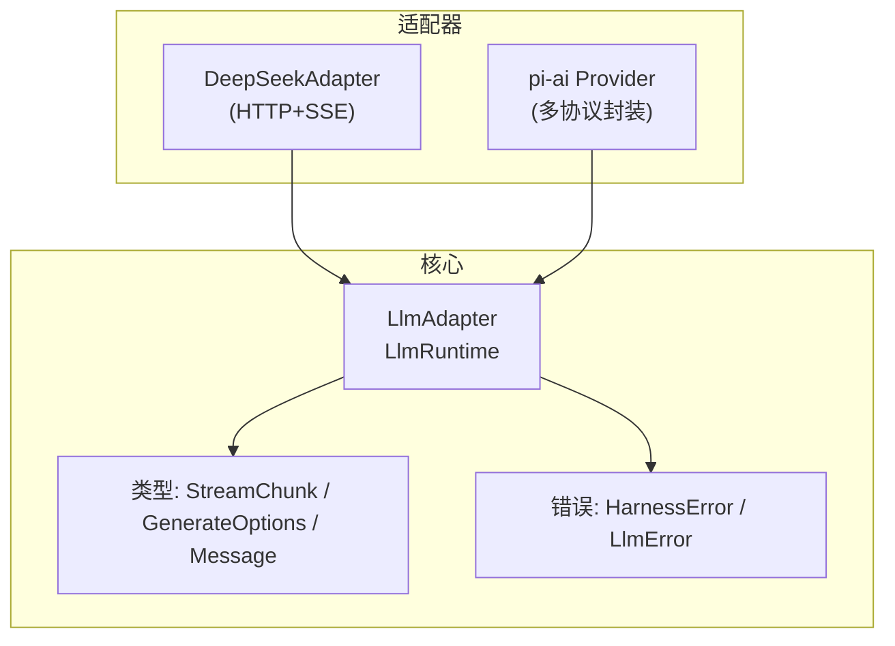
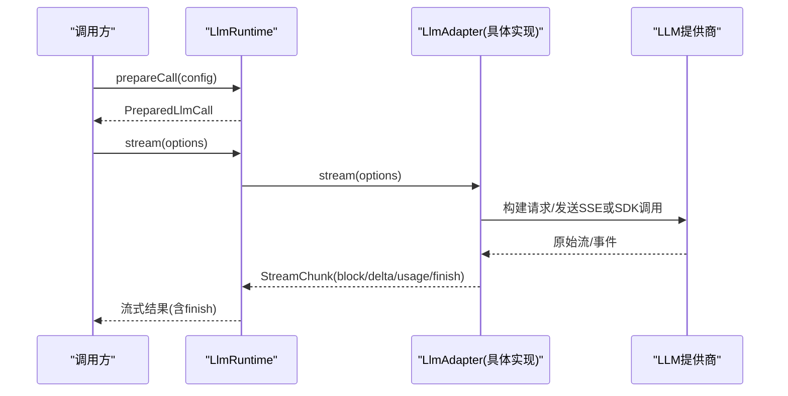
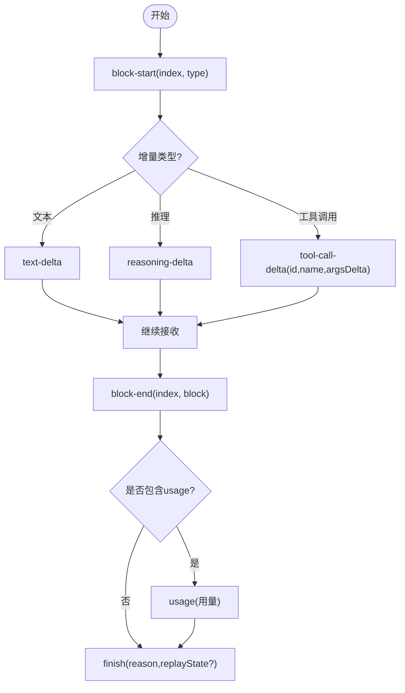
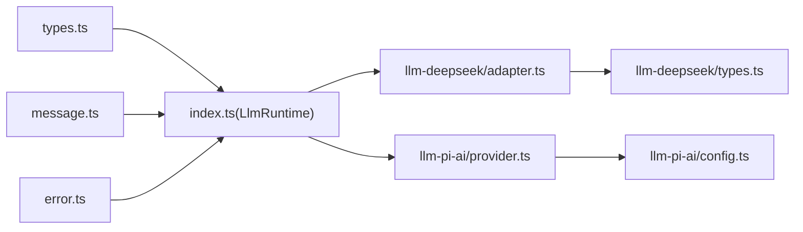

# 适配器接口设计

<cite>
**本文引用的文件**
- [packages/llm/llm/src/index.ts](file://packages/llm/llm/src/index.ts)
- [packages/llm/llm/src/types.ts](file://packages/llm/llm/src/types.ts)
- [packages/llm/llm/src/message.ts](file://packages/llm/llm/src/message.ts)
- [packages/llm/llm/src/error.ts](file://packages/llm/llm/src/error.ts)
- [packages/llm/llm-deepseek/src/adapter.ts](file://packages/llm/llm-deepseek/src/adapter.ts)
- [packages/llm/llm-deepseek/src/types.ts](file://packages/llm/llm-deepseek/src/types.ts)
- [packages/llm/llm-pi-ai/src/provider.ts](file://packages/llm/llm-pi-ai/src/provider.ts)
- [packages/llm/llm-pi-ai/src/config.ts](file://packages/llm/llm-pi-ai/src/config.ts)
- [docs/cookbook/adding-an-llm-adapter.md](file://docs/cookbook/adding-an-llm-adapter.md)
</cite>

## 目录
1. [简介](#简介)
2. [项目结构](#项目结构)
3. [核心组件](#核心组件)
4. [架构总览](#架构总览)
5. [详细组件分析](#详细组件分析)
6. [依赖关系分析](#依赖关系分析)
7. [性能考量](#性能考量)
8. [故障排查指南](#故障排查指南)
9. [结论](#结论)
10. [附录：TypeScript 类型与使用示例](#附录typescript-类型与使用示例)

## 简介
本文件系统化阐述 LLM 适配器接口设计，覆盖消息格式抽象、流式响应处理、错误处理机制、配置参数、统一调用方式（请求构建、响应解析、异常转换）、扩展点与自定义实现指南，以及接口版本兼容性与向后兼容策略。文档基于仓库中的核心类型定义与两个参考实现（DeepSeek 直连 HTTP/SSE 与 pi-ai 库封装）进行说明，确保读者能据此实现符合规范的适配器。

## 项目结构
LLM 子系统由“核心抽象 + 具体适配器”构成：
- 核心抽象位于 packages/llm/llm，提供统一的适配器基类、消息与流式协议、错误体系、重试策略、注册运行时等。
- 参考适配器：
  - DeepSeek 适配器：直接 HTTP + SSE，按 OpenAI 兼容协议序列化/反序列化。
  - pi-ai 适配器：通过第三方 SDK 适配多种协议（OpenAI Completions/Responses、Anthropic Messages 等），并支持目录化模型发现与配置。

图表来源
- [packages/llm/llm/src/index.ts:174-233](file://packages/llm/llm/src/index.ts#L174-L233)
- [packages/llm/llm/src/types.ts:283-357](file://packages/llm/llm/src/types.ts#L283-L357)
- [packages/llm/llm/src/error.ts:13-117](file://packages/llm/llm/src/error.ts#L13-L117)
- [packages/llm/llm-deepseek/src/adapter.ts:151-269](file://packages/llm/llm-deepseek/src/adapter.ts#L151-L269)
- [packages/llm/llm-pi-ai/src/provider.ts:167-193](file://packages/llm/llm-pi-ai/src/provider.ts#L167-L193)

章节来源
- [packages/llm/llm/src/index.ts:1-948](file://packages/llm/llm/src/index.ts#L1-L948)
- [packages/llm/llm/src/types.ts:1-357](file://packages/llm/llm/src/types.ts#L1-L357)
- [packages/llm/llm/src/error.ts:1-164](file://packages/llm/llm/src/error.ts#L1-L164)
- [packages/llm/llm-deepseek/src/adapter.ts:1-347](file://packages/llm/llm-deepseek/src/adapter.ts#L1-L347)
- [packages/llm/llm-pi-ai/src/provider.ts:1-193](file://packages/llm/llm-pi-ai/src/provider.ts#L1-L193)
- [packages/llm/llm-pi-ai/src/config.ts:1-373](file://packages/llm/llm-pi-ai/src/config.ts#L1-L373)
- [docs/cookbook/adding-an-llm-adapter.md:1-44](file://docs/cookbook/adding-an-llm-adapter.md#L1-L44)

## 核心组件
- 适配器抽象 LlmAdapter：定义 providerInfo、listModels、resolveModel、stream 等能力；stream 是唯一必须实现的方法。
- 运行时 LlmRuntime：适配器注册、可插拔的 llm/stream 瀑布拦截、模型发现、重试策略注入、调用准备与执行。
- 消息与内容块：Message、ContentBlock（text/reasoning/image/tool-call/tool-result）及工具调用关联。
- 流式协议 StreamChunk：block-start/text-delta/reasoning-delta/tool-call-delta/block-end/usage/finish，保证跨提供商一致。
- 错误体系：HarnessError/LlmError 提供稳定 code、status、providerRetryAfterMs、requestId 等结构化失败信息。
- 配置与发现：GenerateOptions、LlmModelDiscoveryRequest、LlmDiscoveredModel、LlmResolvedModelInfo 等描述请求与模型元数据。

章节来源
- [packages/llm/llm/src/index.ts:174-233](file://packages/llm/llm/src/index.ts#L174-L233)
- [packages/llm/llm/src/index.ts:284-800](file://packages/llm/llm/src/index.ts#L284-L800)
- [packages/llm/llm/src/types.ts:27-357](file://packages/llm/llm/src/types.ts#L27-L357)
- [packages/llm/llm/src/message.ts:1-262](file://packages/llm/llm/src/message.ts#L1-L262)
- [packages/llm/llm/src/error.ts:13-117](file://packages/llm/llm/src/error.ts#L13-L117)

## 架构总览
适配器将不同 LLM 提供商的协议差异收敛到统一的 StreamChunk 与 Message 上。LlmRuntime 负责注册适配器、路由选择、重试策略、瀑布拦截（如重试、回放、遥测），并提供 prepareCall/stream 的统一入口。

图表来源
- [packages/llm/llm/src/index.ts:779-800](file://packages/llm/llm/src/index.ts#L779-L800)
- [packages/llm/llm/src/index.ts:174-233](file://packages/llm/llm/src/index.ts#L174-L233)
- [packages/llm/llm-deepseek/src/adapter.ts:214-345](file://packages/llm/llm-deepseek/src/adapter.ts#L214-L345)
- [packages/llm/llm-pi-ai/src/provider.ts:167-193](file://packages/llm/llm-pi-ai/src/provider.ts#L167-L193)

## 详细组件分析

### 适配器抽象与运行时
- LlmAdapter
  - providerInfo：声明提供者展示信息。
  - listModels：返回可发现的模型列表（建议性）。
  - resolveModel：精确模型元数据（上下文窗口、默认 maxTokens、推理努力级别等）。
  - stream：唯一必需方法，输出 StreamChunk 流。
- LlmRuntime
  - registerAdapter/registerConfigurableProviders：原子替换、去重校验、生命周期管理。
  - discoverModels/listModels/resolveModelInfo：模型发现与元数据解析。
  - prepareCall：绑定一次注册的上下文，冻结配置，暴露 stream。
  - llm/stream 瀑布：允许在运行时对每个流进行拦截（重试、回放、日志等）。

章节来源
- [packages/llm/llm/src/index.ts:174-233](file://packages/llm/llm/src/index.ts#L174-L233)
- [packages/llm/llm/src/index.ts:284-800](file://packages/llm/llm/src/index.ts#L284-L800)

### 消息与流式协议
- 消息模型
  - Message/UserMessage/AssistantMessage/ToolResultMessage：角色、内容块、来源（user/plugin/model/tool）。
  - ContentBlock：text/reasoning/image/tool-call/tool-result，可扩展。
- 流式协议 StreamChunk
  - block-start/text-delta/reasoning-delta/tool-call-delta/block-end：按 index 对齐同一块的增量。
  - usage：token 用量统计（input/output/cache/reasoning）。
  - finish：终止原因 stop/tool-calls/max-tokens/error/aborted，可选 replayState 用于回放。
- 首 token 判定 isTokenDelta：用于 UI 首次渲染与计时。

图表来源
- [packages/llm/llm/src/types.ts:283-303](file://packages/llm/llm/src/types.ts#L283-L303)
- [packages/llm/llm/src/message.ts:243-262](file://packages/llm/llm/src/message.ts#L243-L262)

章节来源
- [packages/llm/llm/src/types.ts:27-357](file://packages/llm/llm/src/types.ts#L27-L357)
- [packages/llm/llm/src/message.ts:1-262](file://packages/llm/llm/src/message.ts#L1-L262)

### 错误处理机制
- 基础错误 HarnessError：带稳定 code、cause 链，便于诊断与分类。
- LlmError：面向 LLM 调用的结构化错误，携带 status、providerRetryAfterMs、requestId 等。
- 错误分类与识别：
  - 上下文超限 CONTEXT_WINDOW_EXCEEDED_CODE、配额耗尽 QUOTA_EXCEEDED_CODE、空响应 EMPTY_RESPONSE_CODE、无效凭证 INVALID_CREDENTIAL_CODE。
  - 文本模式匹配识别上下文超限与配额耗尽。
- 适配器错误路径：
  - 抛出 LlmError（传输/协议失败），或由 finish {kind:'error'|'aborted'} 传递内联失败。
  - 尊重 options.signal 取消；超时与空闲超时映射为 TIMEOUT/ABORTED。

章节来源
- [packages/llm/llm/src/error.ts:13-117](file://packages/llm/llm/src/error.ts#L13-L117)
- [packages/llm/llm/src/index.ts:69-117](file://packages/llm/llm/src/index.ts#L69-L117)
- [packages/llm/llm-deepseek/src/adapter.ts:132-149](file://packages/llm/llm-deepseek/src/adapter.ts#L132-L149)
- [packages/llm/llm-deepseek/src/adapter.ts:246-269](file://packages/llm/llm-deepseek/src/adapter.ts#L246-L269)

### 配置参数与模型元数据
- GenerateOptions：provider、model、messages、system、tools、temperature、maxTokens、stop、signal、sessionId、purpose 等。
- 模型元数据：
  - LlmModelInfo/LlmResolvedModelInfo：id/name/description/inputModalities/context/defaultMaxTokens/reasoning(efforts/defaultEffort)。
  - LlmReasoningEffortInfo：稳定的 effort id 与显示名。
- 模型发现：
  - LlmModelDiscoveryRequest/LlmDiscoveredModel：临时探测端点能力，不存储凭据。
- 适配器默认值：
  - 通过 resolveModel 提供 defaultMaxTokens、reasoning 默认级别；运行时 resolveCallConfig 会填充缺失字段并校验。

章节来源
- [packages/llm/llm/src/types.ts:143-357](file://packages/llm/llm/src/types.ts#L143-L357)
- [packages/llm/llm/src/index.ts:730-769](file://packages/llm/llm/src/index.ts#L730-L769)

### 统一调用方式：请求构建、响应解析、异常转换
- 请求构建
  - DeepSeek：serializeRequest 将 GenerateOptions 转为 OpenAI 兼容 JSON，附加 attributionHeaders、用户 ID、会话 ID、压缩标记等。
  - pi-ai：根据协议表构建 Provider，复用已安装目录的 Provider 或按需创建，注入 apiKey、baseUrl、models、headers 等。
- 响应解析
  - DeepSeek：parseSse 解析事件流，translate 将原始 chunk 转换为 StreamChunk（注意 tool-call arguments 保持原始 JSON 字符串拼接）。
  - pi-ai：通过 SDK 的 stream/streamSimple 获取事件，再映射为 StreamChunk。
- 异常转换
  - HTTP 非 2xx 时，依据状态码与错误体映射为 LlmError 的稳定 code（AUTH/RATE_LIMIT/CONTEXT_WINDOW_EXCEEDED/QUOTA/INVALID_REQUEST/SERVER）。
  - 传输层异常包装为 TRANSPORT，保留 cause 链以便诊断。

章节来源
- [packages/llm/llm-deepseek/src/adapter.ts:271-345](file://packages/llm/llm-deepseek/src/adapter.ts#L271-L345)
- [packages/llm/llm-deepseek/src/types.ts:12-153](file://packages/llm/llm-deepseek/src/types.ts#L12-L153)
- [packages/llm/llm-pi-ai/src/provider.ts:167-193](file://packages/llm/llm-pi-ai/src/provider.ts#L167-L193)
- [packages/llm/llm-pi-ai/src/config.ts:301-373](file://packages/llm/llm-pi-ai/src/config.ts#L301-L373)

### 扩展点与自定义实现指南
- 扩展点
  - 实现 LlmAdapter.stream 以输出 StreamChunk。
  - 重写 providerInfo/providerRetryPolicy/listModels/resolveModel 以提供元数据与重试策略。
  - 通过 LlmRuntime.registerAdapter 注册路由；通过 registerConfigurableProviders 声明可配置提供者。
  - 通过 registerModelDiscovery 提供端点探测能力。
- 实现约束（来自 cookbook）
  - usage 必须在 finish 之前发出，finish 之后不得再发任何块。
  - tool-call arguments 始终为原始 JSON 字符串，增量以 argumentsDelta 形式拼接。
  - 按首次出现顺序分配 block index，并在同块的所有 delta 中复用。
  - 错误两条受支持路径：throw LlmError（传输/协议失败）或 finish {kind:'error'|'aborted'}（提供商内联失败）。
  - 必须尊重 options.signal；不支持的选项应抛 UNSUPPORTED。
  - 如需原生元数据回放，通过 finish.replayState 透传最小无损 JSON 投影，并在重建历史时验证。
  - 推理努力级别通过 resolveModel 暴露稳定 id，适配器维护可选择列表与默认值。

章节来源
- [docs/cookbook/adding-an-llm-adapter.md:1-44](file://docs/cookbook/adding-an-llm-adapter.md#L1-L44)
- [packages/llm/llm/src/index.ts:284-800](file://packages/llm/llm/src/index.ts#L284-L800)

### 版本兼容性与向后兼容策略
- 合并可扩展的联合类型：ContentBlockMap、FinishReasonMap、ModelModalityMap 等通过新增键值扩展，消费者需 switch 未知分支并安全降级。
- 适配器注册与目录声明采用原子 replace，避免中间态；重复注册与冲突检测保证稳定性。
- 模型元数据校验：运行时 validate 返回的 model/info/reasoning 字段，非法值拒绝并给出明确 code。
- 配置演进：移除旧字段并提示迁移（如 pi-ai 配置中移除 maxRetries/maxRetryDelayMs），validator 在写入时拒绝不兼容项。
- 错误码稳定：LlmError.code 作为机器路由依据，禁止按 message 解析。

章节来源
- [packages/llm/llm/src/types.ts:95-125](file://packages/llm/llm/src/types.ts#L95-L125)
- [packages/llm/llm/src/index.ts:338-413](file://packages/llm/llm/src/index.ts#L338-L413)
- [packages/llm/llm/src/index.ts:619-718](file://packages/llm/llm/src/index.ts#L619-L718)
- [packages/llm/llm-pi-ai/src/config.ts:275-291](file://packages/llm/llm-pi-ai/src/config.ts#L275-L291)

## 依赖关系分析
- LlmAdapter 依赖 types/message/error 等核心类型。
- DeepSeekAdapter 依赖 serialize/sse/translate 模块，将 OpenAI 兼容协议映射到 StreamChunk。
- pi-ai Provider 依赖 catalog 与协议表，复用或创建 Provider 实例，注入认证与模型。
- LlmRuntime 聚合所有适配器，提供注册、发现、重试、调用准备与流式分发。

图表来源
- [packages/llm/llm/src/index.ts:1-948](file://packages/llm/llm/src/index.ts#L1-L948)
- [packages/llm/llm/src/types.ts:1-357](file://packages/llm/llm/src/types.ts#L1-L357)
- [packages/llm/llm/src/message.ts:1-262](file://packages/llm/llm/src/message.ts#L1-L262)
- [packages/llm/llm/src/error.ts:1-164](file://packages/llm/llm/src/error.ts#L1-L164)
- [packages/llm/llm-deepseek/src/adapter.ts:1-347](file://packages/llm/llm-deepseek/src/adapter.ts#L1-L347)
- [packages/llm/llm-deepseek/src/types.ts:1-153](file://packages/llm/llm-deepseek/src/types.ts#L1-L153)
- [packages/llm/llm-pi-ai/src/provider.ts:1-193](file://packages/llm/llm-pi-ai/src/provider.ts#L1-L193)
- [packages/llm/llm-pi-ai/src/config.ts:1-373](file://packages/llm/llm-pi-ai/src/config.ts#L1-L373)

章节来源
- [packages/llm/llm/src/index.ts:1-948](file://packages/llm/llm/src/index.ts#L1-L948)
- [packages/llm/llm-deepseek/src/adapter.ts:1-347](file://packages/llm/llm-deepseek/src/adapter.ts#L1-L347)
- [packages/llm/llm-pi-ai/src/provider.ts:1-193](file://packages/llm/llm-pi-ai/src/provider.ts#L1-L193)
- [packages/llm/llm-pi-ai/src/config.ts:1-373](file://packages/llm/llm-pi-ai/src/config.ts#L1-L373)

## 性能考量
- 流式处理：适配器应在收到提供商结束标记后再一次性 flush usage/finish，避免尾随 usage-only 块导致的状态不一致。
- 空闲超时：适配器应使用 idle watchdog（如 DeepSeek 的 streamIdleTimeoutMs）防止长时间无数据的挂起连接。
- 信号传播：严格遵循 options.signal，及时中止 fetch/SDK 调用，避免资源泄漏。
- 首 token 优化：isTokenDelta 可用于快速判断首个可见 token，减少不必要的前置处理。
- 重试策略：通过 providerRetryPolicy 与 LlmRuntime 的重试框架，结合 provider 返回的 Retry-After 与错误码，合理退避。

[本节为通用指导，不直接分析具体文件]

## 故障排查指南
- 常见错误码与定位
  - AUTH/INVALID_CREDENTIAL：检查凭据引用与值是否可用（空白/不可打印字符）。
  - RATE_LIMIT：关注 providerRetryAfterMs 与退避策略。
  - CONTEXT_WINDOW_EXCEEDED：检查 messages/tools/system 长度与模型 contextWindow。
  - QUOTA：账户余额/配额耗尽，需调整预算或升级。
  - TRANSPORT/TIMEOUT/ABORTED：网络问题、DNS/TLS/代理失败、调用方取消或空闲超时。
- 诊断技巧
  - 使用 errorChain 渲染完整 cause 链，保留底层异常细节。
  - 记录 requestId（来自响应头 x-request-id/x-deepseek-request-id）以便跨系统追踪。
  - 确认 StreamChunk 顺序：usage 必须在 finish 之前；finish 后不应再有块。
  - 校验 tool-call arguments 是否为原始 JSON 字符串，避免提前解析导致丢失精度。

章节来源
- [packages/llm/llm/src/error.ts:13-117](file://packages/llm/llm/src/error.ts#L13-L117)
- [packages/llm/llm/src/index.ts:69-117](file://packages/llm/llm/src/index.ts#L69-L117)
- [packages/llm/llm-deepseek/src/adapter.ts:127-149](file://packages/llm/llm-deepseek/src/adapter.ts#L127-L149)
- [packages/llm/llm-deepseek/src/adapter.ts:246-269](file://packages/llm/llm-deepseek/src/adapter.ts#L246-L269)

## 结论
本设计通过 LlmAdapter 抽象与 StreamChunk 协议，将不同 LLM 提供商的请求/响应/错误统一为一致的调用与消费模型。LlmRuntime 提供注册、发现、重试与拦截能力，使上层应用无需关心底层差异。参考实现（DeepSeek/pi-ai）展示了两种典型集成方式：直连 HTTP+SSE 与 SDK 封装。遵循 cookbook 的契约与错误路径，可实现高可靠、可观测、可扩展的适配器。

[本节为总结，不直接分析具体文件]

## 附录：TypeScript 类型与使用示例
- 关键类型（路径引用）
  - 适配器基类与运行时：[LlmAdapter/LlmRuntime:174-233](file://packages/llm/llm/src/index.ts#L174-L233), [LlmRuntime 注册与调用:284-800](file://packages/llm/llm/src/index.ts#L284-L800)
  - 消息与流式协议：[StreamChunk/GenerateOptions:283-357](file://packages/llm/llm/src/types.ts#L283-L357), [Message/ContentBlock:27-110](file://packages/llm/llm/src/types.ts#L27-L110), [消息构造与首 token 判定:128-262](file://packages/llm/llm/src/message.ts#L128-L262)
  - 错误体系：[HarnessError/LlmError:13-117](file://packages/llm/llm/src/error.ts#L13-L117), [LlmError 构造与校验:69-117](file://packages/llm/llm/src/index.ts#L69-L117)
  - 模型元数据与发现：[LlmModelInfo/LlmResolvedModelInfo:232-281](file://packages/llm/llm/src/types.ts#L232-L281), [LlmModelDiscoveryRequest:195-214](file://packages/llm/llm/src/types.ts#L195-L214)
  - 参考实现：
    - DeepSeek 适配器与类型：[adapter:151-345](file://packages/llm/llm-deepseek/src/adapter.ts#L151-L345), [wire types:12-153](file://packages/llm/llm-deepseek/src/types.ts#L12-L153)
    - pi-ai 配置与 Provider：[config:64-179](file://packages/llm/llm-pi-ai/src/config.ts#L64-L179), [provider 构建:167-193](file://packages/llm/llm-pi-ai/src/provider.ts#L167-L193)

- 使用示例（步骤指引）
  - 实现适配器
    - 继承 LlmAdapter，实现 stream 输出 StreamChunk；必要时重写 providerInfo/listModels/resolveModel。
    - 参考：[DeepSeekAdapter.stream:214-269](file://packages/llm/llm-deepseek/src/adapter.ts#L214-L269)
  - 注册适配器
    - 使用 ctx.llm.registerAdapter(['your-provider'], new YourAdapter(...))。
    - 参考：[注册与替换:338-413](file://packages/llm/llm/src/index.ts#L338-L413)
  - 声明可配置提供者
    - 使用 ctx.llm.registerConfigurableProviders([...]) 暴露设置命名空间。
    - 参考：[目录注册:431-484](file://packages/llm/llm/src/index.ts#L431-L484)
  - 发起调用
    - 使用 ctx.llm.prepareCall(config) 获取 PreparedLlmCall，再调用其 stream(options)。
    - 参考：[prepareCall/stream:779-800](file://packages/llm/llm/src/index.ts#L779-L800)
  - 错误处理
    - 捕获 LlmError，按 code 分类处理；利用 failure.status/providerRetryAfterMs/requestId。
    - 参考：[错误结构与识别:13-117](file://packages/llm/llm/src/error.ts#L13-L117), [httpErrorCode 映射:132-149](file://packages/llm/llm-deepseek/src/adapter.ts#L132-L149)

章节来源
- [packages/llm/llm/src/index.ts:174-800](file://packages/llm/llm/src/index.ts#L174-L800)
- [packages/llm/llm/src/types.ts:27-357](file://packages/llm/llm/src/types.ts#L27-L357)
- [packages/llm/llm/src/message.ts:128-262](file://packages/llm/llm/src/message.ts#L128-L262)
- [packages/llm/llm/src/error.ts:13-117](file://packages/llm/llm/src/error.ts#L13-L117)
- [packages/llm/llm-deepseek/src/adapter.ts:151-345](file://packages/llm/llm-deepseek/src/adapter.ts#L151-L345)
- [packages/llm/llm-deepseek/src/types.ts:12-153](file://packages/llm/llm-deepseek/src/types.ts#L12-L153)
- [packages/llm/llm-pi-ai/src/config.ts:64-179](file://packages/llm/llm-pi-ai/src/config.ts#L64-L179)
- [packages/llm/llm-pi-ai/src/provider.ts:167-193](file://packages/llm/llm-pi-ai/src/provider.ts#L167-L193)