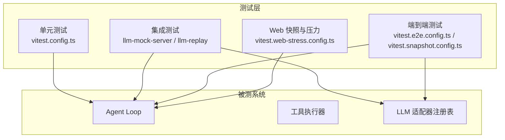
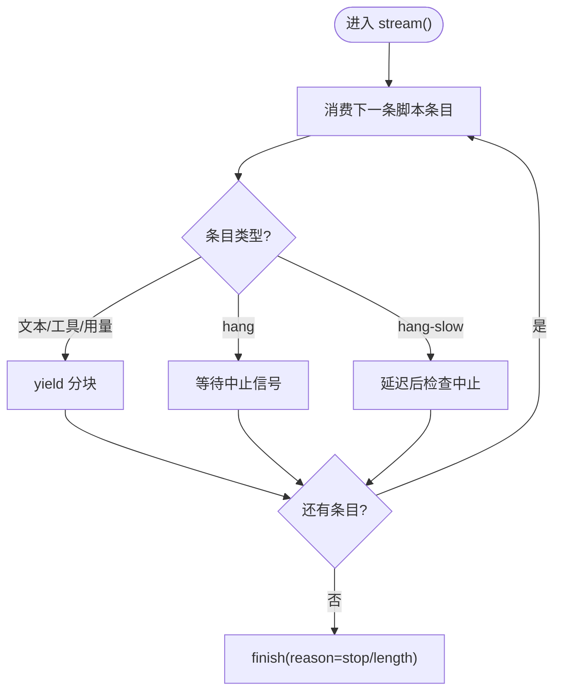
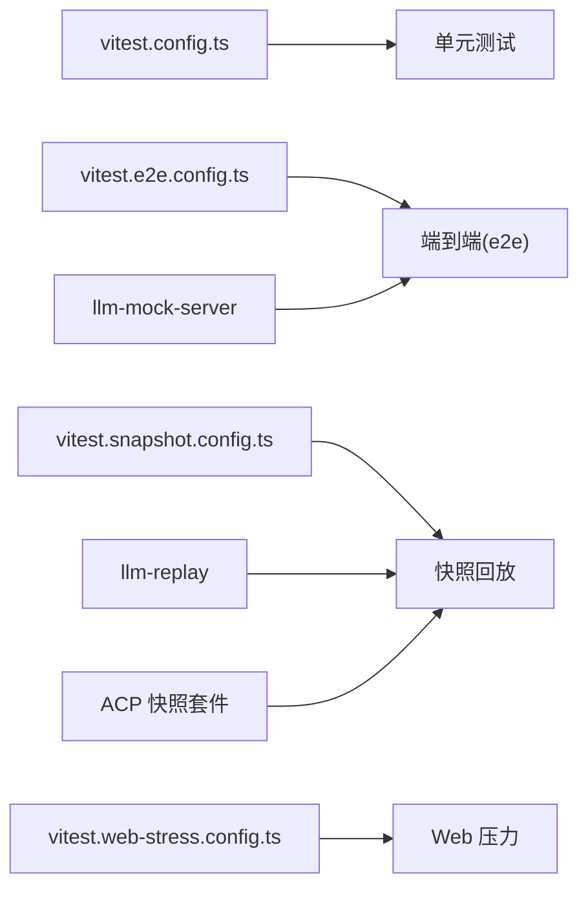

# 适配器测试策略

<cite>
**本文引用的文件**
- [docs/testing.md](file://docs/testing.md)
- [packages/test-support/README.md](file://packages/test-support/README.md)
- [packages/test-support/llm-mock-server/README.md](file://packages/test-support/llm-mock-server/README.md)
- [packages/test-support/llm-replay/README.md](file://packages/test-support/llm-replay/README.md)
- [packages/core/agent-loop/tests/mock-adapter.ts](file://packages/core/agent-loop/tests/mock-adapter.ts)
- [packages/subagent/subagent/tests/continuation.spec.ts](file://packages/subagent/subagent/tests/continuation.spec.ts)
- [examples/jsonrpc-agent/tests/fixtures/subagent/subagent-dsh-sdk/mock-delegating-llm.ts](file://examples/jsonrpc-agent/tests/fixtures/subagent/subagent-dsh-sdk/mock-delegating-llm.ts)
- [examples/acp-agent/tests/fixtures/subagent/subagent-acp/mock-delegating-llm.ts](file://examples/acp-agent/tests/fixtures/subagent/subagent-acp/mock-delegating-llm.ts)
- [packages/llm/llm/src/index.ts](file://packages/llm/llm/src/index.ts)
- [packages/llm/llm/tests/service.spec.ts](file://packages/llm/llm/tests/service.spec.ts)
- [vitest.config.ts](file://vitest.config.ts)
- [vitest.e2e.config.ts](file://vitest.e2e.config.ts)
- [vitest.snapshot.config.ts](file://vitest.snapshot.config.ts)
- [vitest.web-stress.config.ts](file://vitest.web-stress.config.ts)
- [scripts/session-fixture-layout.ts](file://scripts/session-fixture-layout.ts)
- [packages/test-support/acp-snapshot/src/suite.ts](file://packages/test-support/acp-snapshot/src/suite.ts)
- [apps/web/tests/scaffold.ts](file://apps/web/tests/scaffold.ts)
- [BENCHMARK.md](file://BENCHMARK.md)
</cite>

## 目录
1. [简介](#简介)
2. [项目结构](#项目结构)
3. [核心组件](#核心组件)
4. [架构总览](#架构总览)
5. [详细组件分析](#详细组件分析)
6. [依赖分析](#依赖分析)
7. [性能考量](#性能考量)
8. [故障排查指南](#故障排查指南)
9. [结论](#结论)
10. [附录](#附录)

## 简介
本文件面向 LLM 适配器的测试策略，围绕“测试金字塔”（单元测试、集成测试、端到端测试）给出设计原则与落地实践。重点说明如何模拟不同 LLM 提供商行为（成功响应、错误情况、边界条件），如何准备与管理测试数据（会话快照、工具调用记录、性能基准），如何使用测试工具（Mock 框架、断言库、覆盖率分析），以及如何在持续集成中自动化执行并检测性能回归。

## 项目结构
仓库采用分层与按包组织的测试结构：
- 单元测试：位于各包的 tests 目录，使用 Vitest 运行；覆盖核心逻辑、错误路径、并发与事件顺序等。
- 集成测试：通过真实或可复现的 LLM 接口（mock 服务器或回放）驱动 Agent Loop 与工具链，验证端到端协议与持久化日志。
- 端到端测试：包含带密钥的真实 API e2e、无密钥快照回放、Web 浏览器快照与压力测试。
- 测试基础设施：提供 llm-mock-server（OpenAI 兼容 HTTP/SSE）、llm-replay（基于 session.jsonl 的重放插件）、ACP 快照套件等。



图表来源
- [vitest.config.ts:117-159](file://vitest.config.ts#L117-L159)
- [vitest.e2e.config.ts:31-57](file://vitest.e2e.config.ts#L31-L57)
- [vitest.snapshot.config.ts:39-68](file://vitest.snapshot.config.ts#L39-L68)
- [vitest.web-stress.config.ts:5-14](file://vitest.web-stress.config.ts#L5-L14)

章节来源
- [docs/testing.md:7-15](file://docs/testing.md#L7-L15)
- [vitest.config.ts:117-159](file://vitest.config.ts#L117-L159)
- [vitest.e2e.config.ts:31-57](file://vitest.e2e.config.ts#L31-L57)
- [vitest.snapshot.config.ts:39-68](file://vitest.snapshot.config.ts#L39-L68)
- [vitest.web-stress.config.ts:5-14](file://vitest.web-stress.config.ts#L5-L14)

## 核心组件
- LLM 适配器抽象与注册：统一 provider 路由、模型元数据解析、重试策略与流式分片输出；支持替换与 HMR 安全释放。
- Mock 适配器：脚本驱动的流式响应，支持挂起、慢取消、工具调用完成、用量统计等场景。
- llm-mock-server：OpenAI 兼容 HTTP/SSE 服务器，提供连接重置、流断开、部分断开、限流/服务不可用、认证失败、上下文溢出、成功/慢成功/推理成功、工具调用成功、长度截断、错误内容类型等丰富行为序列。
- llm-replay：基于 session.jsonl 的无密钥回放插件，将记录的 assistant/chunk 与标记的本地摘要还原为流式调用，支持子代理多会话绑定与请求内占位符替换。
- ACP 快照套件：管理 scenario 目录中的 session.jsonl 与子会话文件，校验命名与顺序，派生归一化上下文。
- Web 测试脚手架：在 record/replay 模式下启动真实 Web 组合，控制凭据与环境变量，确保 CI 只回放不写入。

章节来源
- [packages/llm/llm/src/index.ts:330-354](file://packages/llm/llm/src/index.ts#L330-L354)
- [packages/core/agent-loop/tests/mock-adapter.ts:58-88](file://packages/core/agent-loop/tests/mock-adapter.ts#L58-L88)
- [packages/test-support/llm-mock-server/README.md:1-87](file://packages/test-support/llm-mock-server/README.md#L1-L87)
- [packages/test-support/llm-replay/README.md:1-81](file://packages/test-support/llm-replay/README.md#L1-L81)
- [packages/test-support/acp-snapshot/src/suite.ts:323-375](file://packages/test-support/acp-snapshot/src/suite.ts#L323-L375)
- [apps/web/tests/scaffold.ts:289-316](file://apps/web/tests/scaffold.ts#L289-L316)

## 架构总览
下图展示从测试到被测系统的交互：测试通过适配器注册表挂载 mock 或 replay 适配器，驱动 Agent Loop 与工具执行，最终产出 JSONL 会话日志与 UI 快照用于断言。

```mermaid
sequenceDiagram
participant Test as "测试用例"
participant Reg as "LLM 适配器注册表"
participant Adapter as "Mock/Replay 适配器"
participant Loop as "Agent Loop"
participant Tools as "工具执行器"
participant Store as "持久化/快照"
Test->>Reg : 注册适配器(提供者路由)
Test->>Loop : 发起生成调用
Loop->>Adapter : stream(options)
Adapter-->>Loop : 分块(StreamChunk)
Loop->>Tools : 工具调用(可选)
Tools-->>Loop : 结果
Loop->>Store : 写入会话JSONL/快照
Store-->>Test : 断言(日志/输出)
```

图表来源
- [packages/llm/llm/src/index.ts:330-354](file://packages/llm/llm/src/index.ts#L330-L354)
- [packages/core/agent-loop/tests/mock-adapter.ts:58-88](file://packages/core/agent-loop/tests/mock-adapter.ts#L58-L88)
- [packages/test-support/llm-replay/README.md:9-24](file://packages/test-support/llm-replay/README.md#L9-L24)
- [packages/test-support/acp-snapshot/src/suite.ts:323-375](file://packages/test-support/acp-snapshot/src/suite.ts#L323-L375)

## 详细组件分析

### 单元测试：Mock 适配器与注册契约
- 目标：验证适配器注册、重复注册保护、空路由拒绝、模型元数据校验、流式中断与取消、工具调用与用量上报。
- 关键实现：
  - 脚本化 MockAdapter：按脚本消费请求并产出 StreamChunk，支持 hang/hang-slow 模拟取消与慢回切。
  - GatedAdapter：在子代理续传场景中，允许测试门控暂停流以验证取消与恢复。
  - 注册表测试：覆盖 DUPLICATE_ADAPTER、INVALID_ADAPTER、模型上下文非法值等。



图表来源
- [packages/core/agent-loop/tests/mock-adapter.ts:58-88](file://packages/core/agent-loop/tests/mock-adapter.ts#L58-L88)
- [packages/subagent/subagent/tests/continuation.spec.ts:26-57](file://packages/subagent/subagent/tests/continuation.spec.ts#L26-L57)

章节来源
- [packages/core/agent-loop/tests/mock-adapter.ts:58-88](file://packages/core/agent-loop/tests/mock-adapter.ts#L58-L88)
- [packages/subagent/subagent/tests/continuation.spec.ts:26-57](file://packages/subagent/subagent/tests/continuation.spec.ts#L26-L57)
- [packages/llm/llm/tests/service.spec.ts:957-1207](file://packages/llm/llm/tests/service.spec.ts#L957-L1207)

### 集成测试：llm-mock-server 行为矩阵
- 目标：在不消耗真实配额的情况下，对真实 LLM 适配器进行健壮性、恢复策略与传输层容错测试。
- 行为矩阵要点：
  - 连接/流错误：connection_reset、stream_disconnect、partial_disconnect、stall、empty_body/stream_eof/partial_eof。
  - 协议错误：malformed_json、malformed_event、wrong_content_type。
  - 业务错误：rate_limit、server_error、service_unavailable、auth_error、invalid_request、context_overflow、quota_exceeded。
  - 成功路径：success、slow_success、reasoning_success、tool_call_success、max_tokens。
- 使用方式：通过 CLI 指定 --sequence 与随机权重，配合 DEEPSEEK_BASE_URL/DEEPSEEK_API_KEY 指向本地服务器，驱动 headless 流程。

```mermaid
sequenceDiagram
participant Test as "集成测试"
participant Server as "llm-mock-server"
participant Adapter as "真实适配器"
participant Loop as "Agent Loop"
Test->>Server : POST /chat/completions (SSE)
Server-->>Adapter : 转发请求
Adapter-->>Server : 流式分块
Server-->>Adapter : 根据序列注入错误/延迟
Adapter-->>Loop : 分块/错误/终止
Loop-->>Test : 断言恢复/重试/取消
```

图表来源
- [packages/test-support/llm-mock-server/README.md:1-87](file://packages/test-support/llm-mock-server/README.md#L1-L87)

章节来源
- [packages/test-support/llm-mock-server/README.md:1-87](file://packages/test-support/llm-mock-server/README.md#L1-L87)

### 端到端测试：无密钥快照回放与 Web 浏览器快照
- 无密钥回放：
  - 通过 llm-replay 将 session.jsonl 中的 assistant/chunk 与标记的本地摘要还原为流式调用，支持子代理多会话绑定与请求内占位符替换。
  - ACP 快照套件负责校验 scenario 目录下的 session.jsonl 与子会话文件命名与顺序，并派生归一化上下文。
- Web 浏览器快照：
  - 在 record 模式需要真实凭据；CI 强制 replay 模式且禁止写入预期输出，所有差异需人工审查。
  - 通过 Web 脚手架在 record/replay 之间切换环境变量与凭据掩码。

```mermaid
sequenceDiagram
participant Suite as "ACP 快照套件"
participant Replay as "llm-replay"
participant Fixture as "session.jsonl"
participant Loop as "Agent Loop"
participant Output as "输出/快照"
Suite->>Fixture : 读取会话头与事件
Suite->>Replay : 安装回放适配器(含 providers/paceMs)
Loop->>Replay : stream(options)
Replay-->>Loop : 从 Fixture 派生的分块
Loop-->>Output : 生成会话日志/产物
Suite-->>Suite : 比较归一化输出
```

图表来源
- [packages/test-support/llm-replay/README.md:9-24](file://packages/test-support/llm-replay/README.md#L9-L24)
- [packages/test-support/acp-snapshot/src/suite.ts:323-375](file://packages/test-support/acp-snapshot/src/suite.ts#L323-L375)
- [apps/web/tests/scaffold.ts:289-316](file://apps/web/tests/scaffold.ts#L289-L316)

章节来源
- [packages/test-support/llm-replay/README.md:9-24](file://packages/test-support/llm-replay/README.md#L9-L24)
- [packages/test-support/acp-snapshot/src/suite.ts:323-375](file://packages/test-support/acp-snapshot/src/suite.ts#L323-L375)
- [apps/web/tests/scaffold.ts:289-316](file://apps/web/tests/scaffold.ts#L289-L316)

### 示例：子代理委托的 Mock 适配器
- 在 jsonrpc-agent 与 acp-agent 示例中，通过插件形式注册名为 mock 的适配器，向父代理返回由工具结果拼接的文本，并附带 usage 与 finish 事件，便于端到端验证子代理报告链路。

章节来源
- [examples/jsonrpc-agent/tests/fixtures/subagent/subagent-dsh-sdk/mock-delegating-llm.ts:30-48](file://examples/jsonrpc-agent/tests/fixtures/subagent/subagent-dsh-sdk/mock-delegating-llm.ts#L30-L48)
- [examples/acp-agent/tests/fixtures/subagent/subagent-acp/mock-delegating-llm.ts:30-48](file://examples/acp-agent/tests/fixtures/subagent/subagent-acp/mock-delegating-llm.ts#L30-L48)

## 依赖分析
- 测试配置依赖：
  - 单元测试：vitest.config.ts 定义线程安全与进程绑定两类项目，严格覆盖率阈值（每文件 100%）。
  - 端到端：vitest.e2e.config.ts 加载 .env，限制工作进程数，设置较长超时与重试。
  - 快照：vitest.snapshot.config.ts 限定快照文件范围，replay 并行度受 DSH_SNAPSHOT 控制。
  - Web 压力：vitest.web-stress.config.ts 仅包含 stress-tests，关闭文件并行。
- 外部依赖：
  - llm-mock-server：OpenAI 兼容 HTTP/SSE 服务器，作为适配器下游边界。
  - llm-replay：基于 session.jsonl 的无密钥回放，替代真实模型调用。
  - ACP 快照套件：管理 fixture 清单与归一化上下文。



图表来源
- [vitest.config.ts:117-159](file://vitest.config.ts#L117-L159)
- [vitest.e2e.config.ts:31-57](file://vitest.e2e.config.ts#L31-L57)
- [vitest.snapshot.config.ts:39-68](file://vitest.snapshot.config.ts#L39-L68)
- [vitest.web-stress.config.ts:5-14](file://vitest.web-stress.config.ts#L5-L14)

章节来源
- [vitest.config.ts:117-159](file://vitest.config.ts#L117-L159)
- [vitest.e2e.config.ts:31-57](file://vitest.e2e.config.ts#L31-L57)
- [vitest.snapshot.config.ts:39-68](file://vitest.snapshot.config.ts#L39-L68)
- [vitest.web-stress.config.ts:5-14](file://vitest.web-stress.config.ts#L5-L14)

## 性能考量
- 压力测试：Web 压力通道单独配置，关闭文件并行，延长超时，用于观察浏览器渲染与 SSE 推送的响应性。
- 回放速率：llm-replay 支持 paceMs 控制分块间隔，便于下游传输看到增量交付；但不应将其作为正确性依赖。
- 基准运行：遵循 BENCHMARK.md 指引，使用 Python SDK 与最小变体独立任务隔离运行，避免相互干扰。

章节来源
- [vitest.web-stress.config.ts:5-14](file://vitest.web-stress.config.ts#L5-L14)
- [packages/test-support/llm-replay/README.md:25-34](file://packages/test-support/llm-replay/README.md#L25-L34)
- [BENCHMARK.md:1-4](file://BENCHMARK.md#L1-L4)

## 故障排查指南
- 适配器注册问题：
  - 重复注册会抛出 DUPLICATE_ADAPTER；空路由或内部重复路由会抛出 INVALID_ADAPTER。
  - 模型上下文非法（如 contextWindow 非正整数）会被拒绝。
- 回放与快照：
  - 缺少 session.jsonl 或子会话命名不规范会失败；fixture 上下文派生自首行 header。
  - Web 录制模式必须提供凭据；CI 强制 replay 且不写预期输出。
- 覆盖率门禁：
  - 每文件 100% 阈值；未覆盖行通常意味着死代码或需要删除而非补测；pwsh 缺失时豁免特定文件以保持绿色。

章节来源
- [packages/llm/llm/tests/service.spec.ts:957-1207](file://packages/llm/llm/tests/service.spec.ts#L957-L1207)
- [packages/test-support/acp-snapshot/src/suite.ts:323-375](file://packages/test-support/acp-snapshot/src/suite.ts#L323-L375)
- [apps/web/tests/scaffold.ts:289-316](file://apps/web/tests/scaffold.ts#L289-L316)
- [vitest.config.ts:160-283](file://vitest.config.ts#L160-L283)

## 结论
本策略以“优先真实实现、仅在昂贵或非确定性边界使用 Mock”为原则，结合脚本化 Mock 适配器、OpenAI 兼容 mock 服务器与 session.jsonl 回放，构建覆盖单元、集成与端到端的完整测试金字塔。通过严格的覆盖率门禁、快照对比与 Web 压力通道，保障适配器在不同提供商行为下的稳定性与可观测性，并在 CI 中实现自动化与回归检测。

## 附录

### 测试金字塔与命令速查
- 单元测试：pnpm run test（Vitest，含覆盖率门禁）
- 端到端（带密钥）：pnpm run test:e2e（自动跳过缺密钥场景）
- 快照回放：pnpm run test:snapshot（DSH_SNAPSHOT=replay 默认）
- Web 浏览器快照：pnpm run test:web（CI 强制 replay）
- Web 压力：显式启用，关闭并行，长超时

章节来源
- [docs/testing.md:7-15](file://docs/testing.md#L7-L15)
- [vitest.e2e.config.ts:31-57](file://vitest.e2e.config.ts#L31-L57)
- [vitest.snapshot.config.ts:39-68](file://vitest.snapshot.config.ts#L39-L68)
- [vitest.web-stress.config.ts:5-14](file://vitest.web-stress.config.ts#L5-L14)

### 测试数据准备与管理
- 会话快照：
  - 主文件 session.jsonl；子会话 session.1.jsonl … 连续编号；名称与顺序由 ACP 套件校验。
  - 规范化：脚本将事件打包为紧凑行，保证幂等性与可比性。
- 工具调用记录：
  - 通过 MockAdapter/GatedAdapter 与 llm-mock-server 的行为序列，构造工具调用与分块边界，验证工具侧副作用与消息生成。
- 性能基准：
  - 使用 BENCHMARK.md 指引，独立工作区与会话 ID 运行；Web 压力通道用于浏览器侧响应性证据。

章节来源
- [packages/test-support/acp-snapshot/src/suite.ts:323-375](file://packages/test-support/acp-snapshot/src/suite.ts#L323-L375)
- [scripts/session-fixture-layout.ts:43-83](file://scripts/session-fixture-layout.ts#L43-L83)
- [packages/core/agent-loop/tests/mock-adapter.ts:58-88](file://packages/core/agent-loop/tests/mock-adapter.ts#L58-L88)
- [packages/test-support/llm-mock-server/README.md:31-72](file://packages/test-support/llm-mock-server/README.md#L31-L72)
- [BENCHMARK.md:1-4](file://BENCHMARK.md#L1-L4)

### 测试工具使用指南
- Mock 框架：
  - 脚本化 MockAdapter：按条目消费请求，支持 hang/hang-slow、工具调用、用量统计。
  - GatedAdapter：门控流以验证取消与恢复。
- 断言库：
  - Vitest expect 扩展 toThrowMatchingObject 用于精确匹配错误对象字段。
- 覆盖率分析：
  - v8 提供者，每文件 100% 阈值；CI 下输出未覆盖位置详情；pwsh 缺失时豁免特定文件。

章节来源
- [packages/core/agent-loop/tests/mock-adapter.ts:58-88](file://packages/core/agent-loop/tests/mock-adapter.ts#L58-L88)
- [packages/subagent/subagent/tests/continuation.spec.ts:26-57](file://packages/subagent/subagent/tests/continuation.spec.ts#L26-L57)
- [packages/storage/storage/tests/registry.spec.ts:71-89](file://packages/storage/storage/tests/registry.spec.ts#L71-L89)
- [vitest.config.ts:160-283](file://vitest.config.ts#L160-L283)

### 持续集成与性能回归检测
- CI 门禁：
  - 单元测试与覆盖率门禁（per-file 100%）。
  - 快照回放（keyless）与 Web 浏览器快照（CI 强制 replay）。
  - 端到端（with-key）在具备密钥的工作流中运行，无密钥时自跳过。
- 性能回归：
  - Web 压力通道提供浏览器响应性信号；回放速率可控但不作为正确性依赖。
  - 基准运行遵循 BENCHMARK.md，独立任务隔离，避免相互干扰。

章节来源
- [vitest.config.ts:160-283](file://vitest.config.ts#L160-L283)
- [vitest.e2e.config.ts:31-57](file://vitest.e2e.config.ts#L31-L57)
- [vitest.snapshot.config.ts:39-68](file://vitest.snapshot.config.ts#L39-L68)
- [vitest.web-stress.config.ts:5-14](file://vitest.web-stress.config.ts#L5-L14)
- [BENCHMARK.md:1-4](file://BENCHMARK.md#L1-L4)