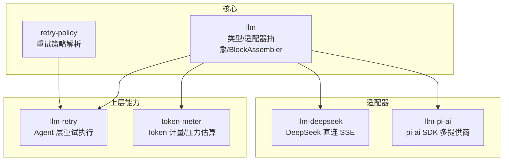
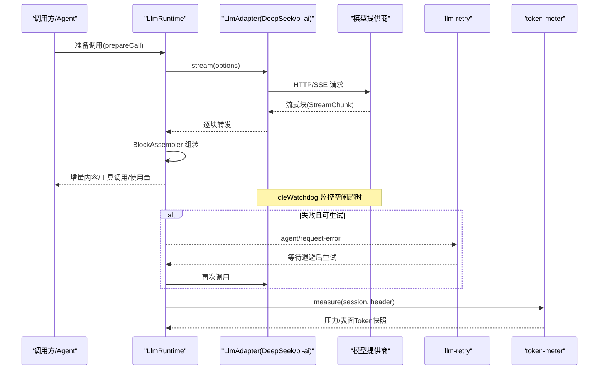
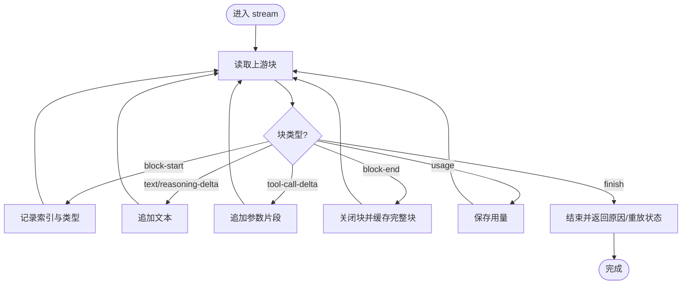
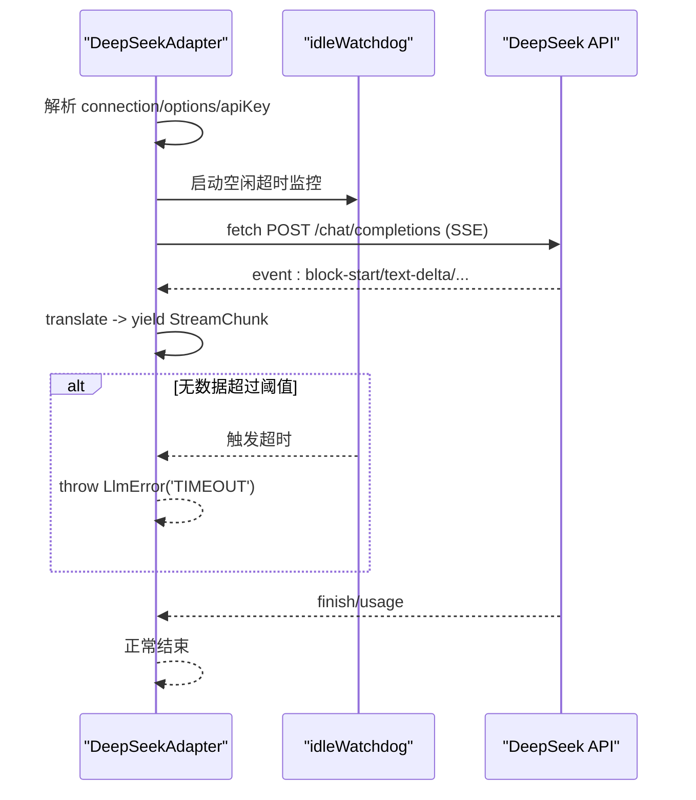
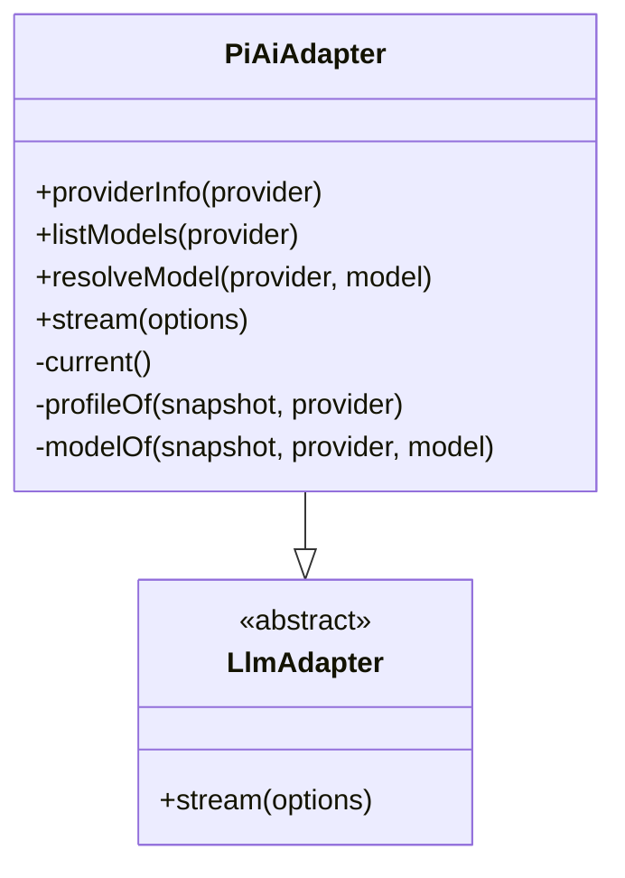
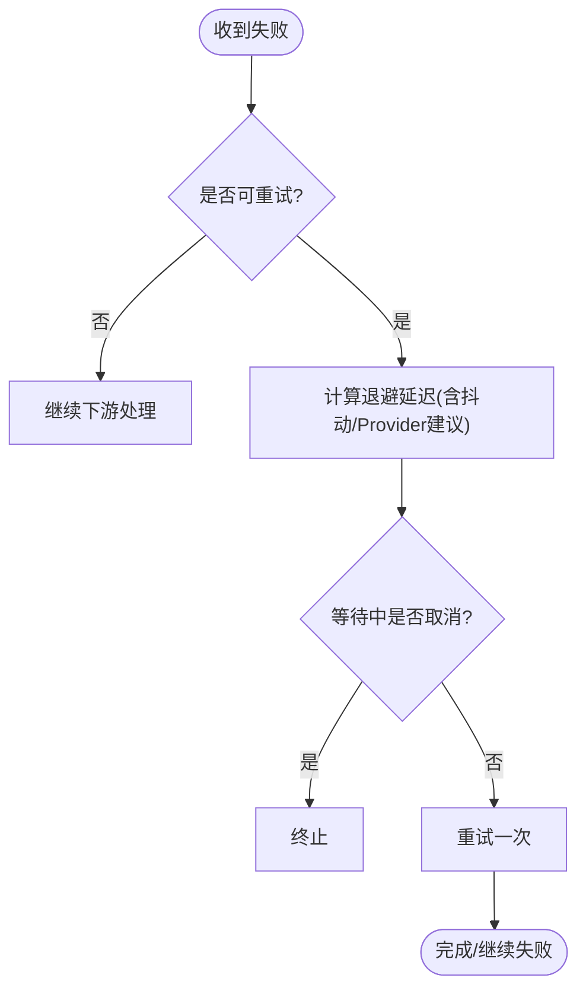
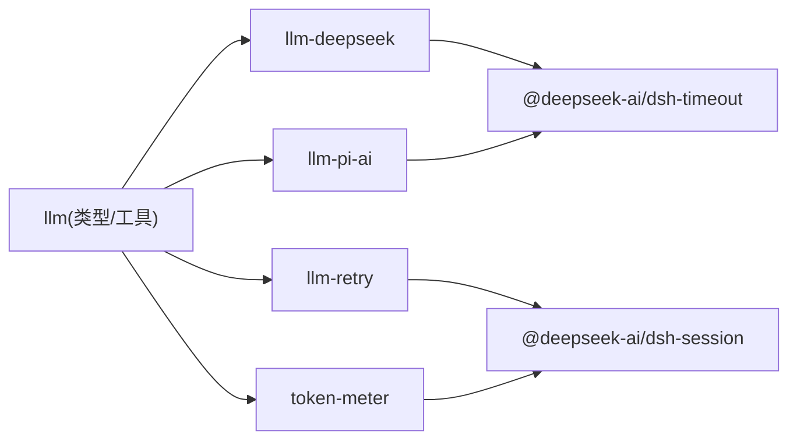

# LLM 集成

<cite>
**本文引用的文件**
- [packages/llm/llm/src/types.ts](file://packages/llm/llm/src/types.ts)
- [packages/llm/llm/src/assembler.ts](file://packages/llm/llm/src/assembler.ts)
- [packages/llm/llm/src/retry-policy.ts](file://packages/llm/llm/src/retry-policy.ts)
- [packages/llm/llm-deepseek/src/adapter.ts](file://packages/llm/llm-deepseek/src/adapter.ts)
- [packages/llm/llm-pi-ai/src/adapter.ts](file://packages/llm/llm-pi-ai/src/adapter.ts)
- [packages/llm/llm-retry/src/index.ts](file://packages/llm/llm-retry/src/index.ts)
- [packages/llm/token-meter/src/index.ts](file://packages/llm/token-meter/src/index.ts)
- [docs/subsystems/llm-streaming.md](file://docs/subsystems/llm-streaming.md)
- [docs/cookbook/adding-an-llm-adapter.md](file://docs/cookbook/adding-an-llm-adapter.md)
- [docs/subsystems/token-meter.md](file://docs/subsystems/token-meter.md)
</cite>

## 目录
1. [简介](#简介)
2. [项目结构](#项目结构)
3. [核心组件](#核心组件)
4. [架构总览](#架构总览)
5. [详细组件分析](#详细组件分析)
6. [依赖关系分析](#依赖关系分析)
7. [性能与可靠性](#性能与可靠性)
8. [故障排除指南](#故障排除指南)
9. [结论](#结论)
10. [附录：最佳实践与示例](#附录最佳实践与示例)

## 简介
本文件系统化说明 Harness 的 LLM 集成方案，覆盖适配器契约、流式协议、重试与超时、负载均衡策略、成本与配额管理、自定义适配器开发方法，以及实际集成与排障要点。目标是帮助读者在不深入源码的情况下理解整体设计，并在需要时快速定位到具体实现位置。

## 项目结构
LLM 相关代码集中在 packages/llm 下，按职责拆分为多个包：
- llm：定义消息、流式协议、适配器抽象、重试策略等核心类型与工具（如 BlockAssembler）。
- llm-deepseek：基于 OpenAI 兼容接口的 DeepSeek 直连适配器（SSE + fetch）。
- llm-pi-ai：基于 pi-ai SDK 的多提供商适配器封装。
- llm-retry：在 Agent 层提供可配置的请求重试执行器。
- token-meter：会话级 Token 用量计量与上下文压力估算服务。

图表来源
- [packages/llm/llm/src/types.ts:1-357](file://packages/llm/llm/src/types.ts#L1-L357)
- [packages/llm/llm/src/assembler.ts:1-165](file://packages/llm/llm/src/assembler.ts#L1-L165)
- [packages/llm/llm/src/retry-policy.ts:1-192](file://packages/llm/llm/src/retry-policy.ts#L1-L192)
- [packages/llm/llm-deepseek/src/adapter.ts:1-347](file://packages/llm/llm-deepseek/src/adapter.ts#L1-L347)
- [packages/llm/llm-pi-ai/src/adapter.ts:1-359](file://packages/llm/llm-pi-ai/src/adapter.ts#L1-L359)
- [packages/llm/llm-retry/src/index.ts:1-227](file://packages/llm/llm-retry/src/index.ts#L1-L227)
- [packages/llm/token-meter/src/index.ts:1-314](file://packages/llm/token-meter/src/index.ts#L1-L314)

章节来源
- [docs/subsystems/llm-streaming.md:1-800](file://docs/subsystems/llm-streaming.md#L1-L800)
- [docs/cookbook/adding-an-llm-adapter.md:1-44](file://docs/cookbook/adding-an-llm-adapter.md#L1-L44)

## 核心组件
- 适配器契约与模型调用
  - LlmAdapter：统一抽象，要求实现 stream()，并可选提供 providerInfo/listModels/resolveModel/providerRetryPolicy。
  - GenerateOptions：一次模型调用的完整入参（provider、model、messages、system、tools、temperature、maxTokens、stop、signal、sessionId、purpose）。
  - StreamChunk：原始流式协议（block-start/text-delta/reasoning-delta/tool-call-delta/block-end/usage/finish），由 BlockAssembler 组装为最终内容块与消息。
- 重试策略
  - ResolvedRetryPolicy：normal（有限次）或 always（无限次）两种模式，支持初始延迟、最大延迟、抖动比例；默认可重试错误码包含空响应、限流、服务端错误、超时、传输错误。
- Token 计量
  - TokenMeter：基于会话事件回放，聚合 provider usage 与启发式表面定价，输出当前请求压力与上下文占用快照。

章节来源
- [packages/llm/llm/src/types.ts:1-357](file://packages/llm/llm/src/types.ts#L1-L357)
- [packages/llm/llm/src/assembler.ts:1-165](file://packages/llm/llm/src/assembler.ts#L1-L165)
- [packages/llm/llm/src/retry-policy.ts:1-192](file://packages/llm/llm/src/retry-policy.ts#L1-L192)
- [packages/llm/token-meter/src/index.ts:1-314](file://packages/llm/token-meter/src/index.ts#L1-L314)
- [docs/subsystems/llm-streaming.md:154-308](file://docs/subsystems/llm-streaming.md#L154-L308)

## 架构总览
下图展示了从调用方到适配器的端到端流程，包括流式数据、重试、超时与计量。

图表来源
- [packages/llm/llm-deepseek/src/adapter.ts:214-345](file://packages/llm/llm-deepseek/src/adapter.ts#L214-L345)
- [packages/llm/llm-pi-ai/src/adapter.ts:276-357](file://packages/llm/llm-pi-ai/src/adapter.ts#L276-L357)
- [packages/llm/llm/src/assembler.ts:26-165](file://packages/llm/llm/src/assembler.ts#L26-L165)
- [packages/llm/llm-retry/src/index.ts:99-227](file://packages/llm/llm-retry/src/index.ts#L99-L227)
- [packages/llm/token-meter/src/index.ts:100-147](file://packages/llm/token-meter/src/index.ts#L100-L147)

## 详细组件分析

### 适配器契约与流式协议
- 适配器必须遵守的契约
  - 先 emit usage，再 finish；finish 之后不再 emit 任何块。
  - tool-call 的 arguments 始终为原始 JSON 字符串片段，通过 argumentsDelta 拼接，block-end 携带完整 ContentBlock。
  - 错误路径二选一：throw（传输/协议错误）或 finish {kind:'error'|'aborted'}（提供方内联错误）。
  - 必须尊重 options.signal；不支持的选项应抛出明确错误。
  - 成功 finish 可携带 replayState，用于跨步骤/跨模型恢复原生响应。
- 流式协议 StreamChunk
  - 通过 index 关联交错块；block-end 提供已组装块，避免消费者重复拼装。
  - finish.reason 包含 stop/tool-calls/max-tokens/error/aborted 等。
- BlockAssembler
  - 将 StreamChunk 增量组装为 ContentBlock[] 与 Message；对异常流具备容错（忽略已关闭块的后续 delta）。

图表来源
- [packages/llm/llm/src/types.ts:283-303](file://packages/llm/llm/src/types.ts#L283-L303)
- [packages/llm/llm/src/assembler.ts:47-165](file://packages/llm/llm/src/assembler.ts#L47-L165)

章节来源
- [docs/subsystems/llm-streaming.md:154-308](file://docs/subsystems/llm-streaming.md#L154-L308)
- [docs/cookbook/adding-an-llm-adapter.md:25-35](file://docs/cookbook/adding-an-llm-adapter.md#L25-L35)

### DeepSeek 适配器（直连 SSE）
- 连接与认证
  - 通过 baseURL + /chat/completions 发起 POST，Authorization 使用 Bearer Token。
  - 每请求解析 apiKey，确保 endpoint 与密钥来自同一配置快照，防止配置漂移。
- 流式处理与超时
  - 使用 idleWatchdog 监控每次读取的空闲超时，默认 5 分钟；超时映射为 TIMEOUT。
  - 调用方 AbortSignal 与内部控制器合并，取消映射为 ABORTED。
- 错误映射
  - 非 2xx 响应根据状态码与错误体映射为稳定错误码（AUTH/RATE_LIMIT/CONTEXT_WINDOW_EXCEEDED/INVALID_REQUEST/SERVER/TRANSPORT 等）。
  - 支持 providerRetryAfterMs（秒或日期）与 requestId 透传。
- 模型元数据
  - listModels/resolveModel 暴露输入模态、上下文窗口、默认 maxTokens 与推理努力等级。

图表来源
- [packages/llm/llm-deepseek/src/adapter.ts:214-345](file://packages/llm/llm-deepseek/src/adapter.ts#L214-L345)

章节来源
- [packages/llm/llm-deepseek/src/adapter.ts:1-347](file://packages/llm/llm-deepseek/src/adapter.ts#L1-L347)

### pi-ai 适配器（SDK 封装）
- 多提供商与快照隔离
  - 每次操作捕获不可变快照（profiles + Models），保证进行中请求不受配置变更影响。
  - 通过 resolveApiKey 注入最高优先级鉴权，避免 SDK 持有凭证。
- 流式处理与超时
  - 同样使用 idleWatchdog 监控空闲超时；支持 websocket/connect 超时等传输参数。
  - 若检测到图片输入但模型不支持，直接拒绝（UNSUPPORTED_CONTENT）。
- 模型能力与推理努力
  - 通过 getSupportedThinkingLevels 获取支持的推理级别；resolveModel 暴露 contextWindow、defaultMaxTokens 与 reasoning efforts。

图表来源
- [packages/llm/llm-pi-ai/src/adapter.ts:186-359](file://packages/llm/llm-pi-ai/src/adapter.ts#L186-L359)

章节来源
- [packages/llm/llm-pi-ai/src/adapter.ts:1-359](file://packages/llm/llm-pi-ai/src/adapter.ts#L1-L359)

### 重试机制与超时处理
- 重试策略
  - normal：限定最大重试次数与可重试错误码集合；always：无限重试直到成功或被取消。
  - 指数退避 + 对称抖动；支持 providerRetryAfterMs 优先于本地计算。
- 执行点
  - 在 Agent 层的 request-error 扩展点拦截，结合 session 事件记录重试轨迹。
- 超时
  - 适配器侧空闲超时映射为 TIMEOUT；调用方取消映射为 ABORTED。

图表来源
- [packages/llm/llm-retry/src/index.ts:111-208](file://packages/llm/llm-retry/src/index.ts#L111-L208)
- [packages/llm/llm/src/retry-policy.ts:14-24](file://packages/llm/llm/src/retry-policy.ts#L14-L24)

章节来源
- [packages/llm/llm-retry/src/index.ts:1-227](file://packages/llm/llm-retry/src/index.ts#L1-L227)
- [packages/llm/llm/src/retry-policy.ts:1-192](file://packages/llm/llm/src/retry-policy.ts#L1-L192)

### 负载均衡策略
- 当前实现未内置自动负载均衡；路由选择由 GenerateOptions.provider 决定，插件可在运行时动态替换注册表以切换提供商。
- 建议策略
  - 多提供商注册：在同一应用内注册多个 provider 路由，按业务需求选择。
  - 动态路由：在 prepareCall 阶段根据负载、成本、延迟指标选择 provider/model。
  - 降级：当某提供商持续失败或配额耗尽时，切换到备用提供商。

[本节为概念性说明，不直接分析具体文件]

### 成本与配额管理
- Token 计量
  - TokenMeter 基于会话事件回放，聚合 provider usage 与启发式表面定价，输出 totalTokens/surfaceTokens/pressure 等指标。
  - 当最近一次成功请求的请求信封匹配且用量不低于启发式锚点时，复用 provider usage；否则重新估算。
- 配额超限识别
  - 适配器错误映射中识别“配额/余额/额度耗尽”类错误，便于上层做配额告警或降级。
- 控制建议
  - 设置合理的 maxTokens、stop 序列，限制输出长度。
  - 结合 TokenMeter 的 surfaceTokens 与 pressure 进行前端提示与节流。
  - 对配额耗尽错误实施快速失败与用户提示，避免无效重试。

章节来源
- [packages/llm/token-meter/src/index.ts:100-147](file://packages/llm/token-meter/src/index.ts#L100-L147)
- [docs/subsystems/token-meter.md:1-91](file://docs/subsystems/token-meter.md#L1-L91)
- [packages/llm/llm-deepseek/src/adapter.ts:138-149](file://packages/llm/llm-deepseek/src/adapter.ts#L138-L149)

### 自定义 LLM 适配器开发
- 基本形状
  - 继承 LlmAdapter，实现 stream(options)，注册到 ctx.llm.registerAdapter(['your-provider'], adapter)。
- 协议义务
  - 严格遵循 StreamChunk 顺序与语义；arguments 保持原始 JSON 字符串；finish 前 emit usage；finish 后不再 emit。
  - 正确处理 signal 取消与空闲超时；不支持的选项抛出不支持错误。
  - 如需跨步骤恢复，提供 replayState。
- 模型能力
  - 实现 resolveModel 暴露 contextWindow、defaultMaxTokens、reasoning efforts；listModels 提供可选目录。
- 参考布局
  - 将 wire 类型、请求序列化、传输解析、chunk 转换与适配器类分离，参考 llm-deepseek 的模块划分。

章节来源
- [docs/cookbook/adding-an-llm-adapter.md:1-44](file://docs/cookbook/adding-an-llm-adapter.md#L1-L44)
- [packages/llm/llm/src/types.ts:627-702](file://packages/llm/llm/src/types.ts#L627-L702)

## 依赖关系分析
- 适配器依赖
  - llm-deepseek 依赖 @deepseek-ai/dsh-timeout 实现空闲超时；依赖 dsh-credentials 解析密钥；依赖 dsh-llm 的类型与工具。
  - llm-pi-ai 依赖 pi-ai SDK；同样使用 dsh-timeout 与 dsh-llm。
- 重试与计量
  - llm-retry 监听 agent/request-error，依据 provider 注册的 retryPolicy 执行退避与重试。
  - token-meter 消费 session 事件，结合 BlockAssembler 重建 provider 输出以精确计价。

图表来源
- [packages/llm/llm-deepseek/src/adapter.ts:1-27](file://packages/llm/llm-deepseek/src/adapter.ts#L1-L27)
- [packages/llm/llm-pi-ai/src/adapter.ts:24-54](file://packages/llm/llm-pi-ai/src/adapter.ts#L24-L54)
- [packages/llm/llm-retry/src/index.ts:1-22](file://packages/llm/llm-retry/src/index.ts#L1-L22)
- [packages/llm/token-meter/src/index.ts:1-24](file://packages/llm/token-meter/src/index.ts#L1-L24)

章节来源
- [packages/llm/llm-deepseek/src/adapter.ts:1-347](file://packages/llm/llm-deepseek/src/adapter.ts#L1-L347)
- [packages/llm/llm-pi-ai/src/adapter.ts:1-359](file://packages/llm/llm-pi-ai/src/adapter.ts#L1-L359)
- [packages/llm/llm-retry/src/index.ts:1-227](file://packages/llm/llm-retry/src/index.ts#L1-L227)
- [packages/llm/token-meter/src/index.ts:1-314](file://packages/llm/token-meter/src/index.ts#L1-L314)

## 性能与可靠性
- 流式缓冲与内存
  - BlockAssembler 仅维护每个块的增量状态；对已关闭块的后续 delta 忽略，避免恶意流导致内存增长。
- 超时与背压
  - idleWatchdog 在每次 next() 期间计时，避免长时无数据阻塞；结合调用方 AbortSignal 实现快速退出。
- 重试与抖动
  - 指数退避 + 抖动降低雪崩风险；支持 providerRetryAfterMs 优先，提高恢复效率。
- 计量精度
  - 当 provider usage 可用且请求信封一致时，采用 provider 用量作为基准；否则回退到启发式估算，兼顾准确性与可用性。

[本节为通用指导，不直接分析具体文件]

## 故障排除指南
- 常见错误与定位
  - AUTH：检查 Authorization 头与密钥来源（ensure endpoint 与 key 来自同一配置快照）。
  - RATE_LIMIT：调整重试策略或增加 backoff；考虑降级到其他提供商。
  - CONTEXT_WINDOW_EXCEEDED：缩短上下文或启用压缩；确认 resolveModel 返回的 contextWindow。
  - EMPTY_RESPONSE：视为可重试错误；检查适配器是否正确处理空响应。
  - TIMEOUT/ABORTED：检查网络与上游响应速度；确认 idleWatchdog 阈值合理。
- 诊断信息
  - 利用 requestId 与 providerRetryAfterMs 提升问题定位效率。
  - 通过 TokenMeter 的 baseline 与 surfaceTokens 判断是否为上下文过大导致的截断或计费异常。

章节来源
- [packages/llm/llm-deepseek/src/adapter.ts:138-149](file://packages/llm/llm-deepseek/src/adapter.ts#L138-L149)
- [packages/llm/llm/src/retry-policy.ts:14-24](file://packages/llm/llm/src/retry-policy.ts#L14-L24)
- [packages/llm/token-meter/src/index.ts:100-147](file://packages/llm/token-meter/src/index.ts#L100-L147)

## 结论
Harness 的 LLM 集成以清晰的适配器契约与流式协议为核心，配合 BlockAssembler 实现稳健的内容组装；通过 llm-retry 提供可配置的重试策略，并通过 idleWatchdog 保障超时安全；token-meter 提供会话级用量与压力度量，支撑成本控制与配额管理。开发者可按 cookbook 快速接入新提供商，并结合上述策略优化性能与可靠性。

[本节为总结性内容，不直接分析具体文件]

## 附录：最佳实践与示例
- 配置最佳实践
  - 为每个 provider 注册独立的 retryPolicy；对高频场景使用 normal 模式并设置合理的 initialDelayMs/maxDelayMs/jitterRatio。
  - 合理设置 maxTokens 与 stop 序列，避免过长输出；对不支持的选项显式抛出 UNSUPPORTED。
  - 使用 resolveModel 暴露 contextWindow 与 defaultMaxTokens，辅助上层做容量规划。
- 性能优化
  - 启用流式传输，减少首字节延迟；避免在适配器内进行重型同步操作。
  - 对图片输入提前校验模型能力，尽早失败。
- 成本控制
  - 结合 TokenMeter 的 surfaceTokens 与 pressure 做前端提示与节流；对配额耗尽错误快速失败并提示用户。
- 集成示例
  - 新增适配器：参考 cookbook 中的最小实现，注册到 ctx.llm.registerAdapter。
  - 动态路由：在 prepareCall 阶段根据负载/成本选择 provider/model。
  - 重试与降级：在 llm-retry 中配置可重试错误码；当配额耗尽时切换到备用提供商。

章节来源
- [docs/cookbook/adding-an-llm-adapter.md:1-44](file://docs/cookbook/adding-an-llm-adapter.md#L1-L44)
- [packages/llm/llm/src/retry-policy.ts:14-24](file://packages/llm/llm/src/retry-policy.ts#L14-L24)
- [packages/llm/token-meter/src/index.ts:100-147](file://packages/llm/token-meter/src/index.ts#L100-L147)