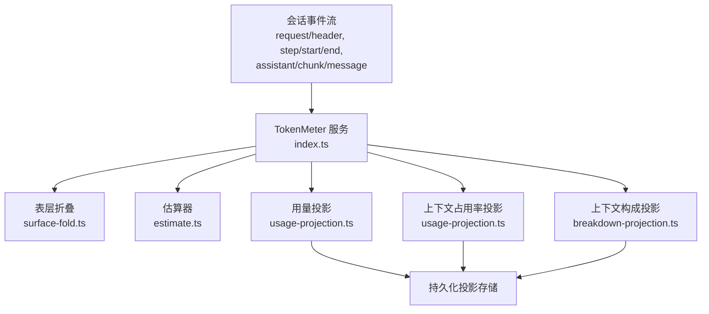
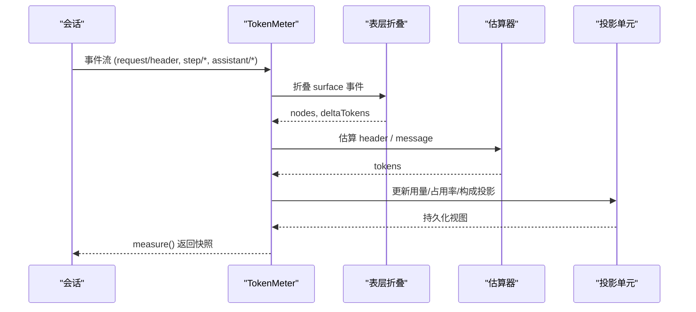
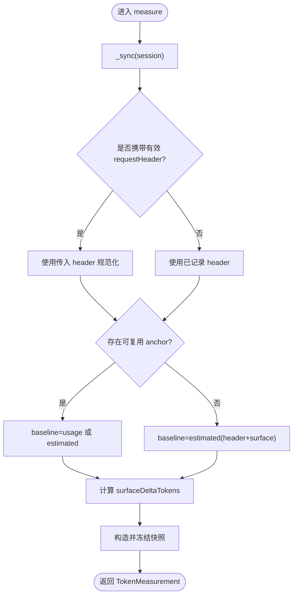
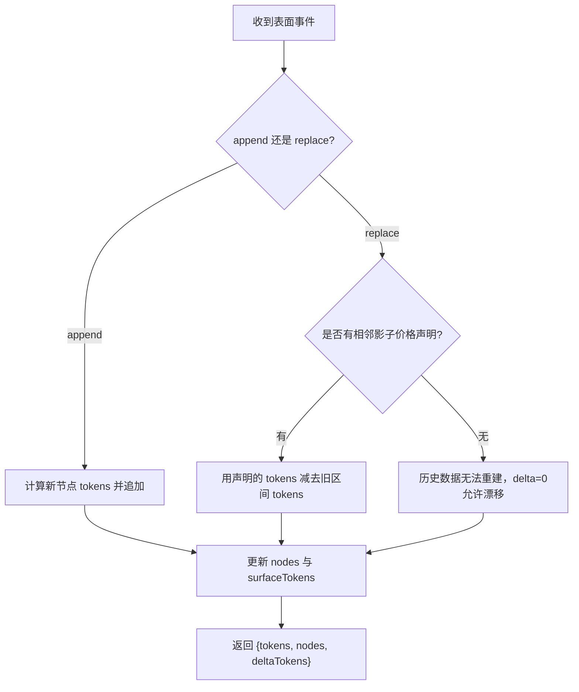
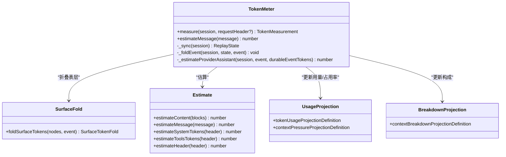
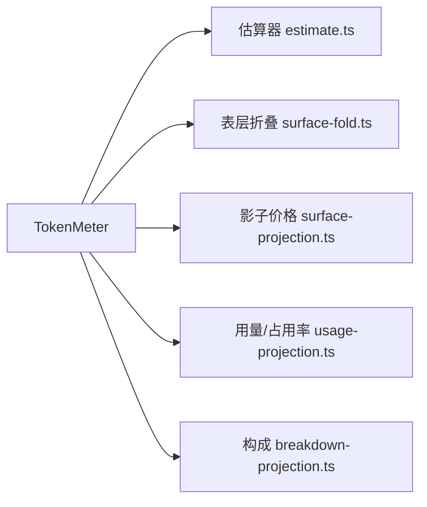

# Token 计量和管理

<cite>
**本文引用的文件**
- [packages/llm/token-meter/src/index.ts](file://packages/llm/token-meter/src/index.ts)
- [packages/llm/token-meter/src/types.ts](file://packages/llm/token-meter/src/types.ts)
- [packages/llm/token-meter/src/estimate.ts](file://packages/llm/token-meter/src/estimate.ts)
- [packages/llm/token-meter/src/surface-fold.ts](file://packages/llm/token-meter/src/surface-fold.ts)
- [packages/llm/token-meter/src/surface-projection.ts](file://packages/llm/token-meter/src/surface-projection.ts)
- [packages/llm/token-meter/src/usage-projection.ts](file://packages/llm/token-meter/src/usage-projection.ts)
- [packages/llm/token-meter/src/breakdown-projection.ts](file://packages/llm/token-meter/src/breakdown-projection.ts)
- [packages/llm/token-meter/tests/token-meter.spec.ts](file://packages/llm/token-meter/tests/token-meter.spec.ts)
- [packages/llm/token-meter/tests/token-usage-projection.spec.ts](file://packages/llm/token-meter/tests/token-usage-projection.spec.ts)
- [docs/subsystems/token-meter.zh.md](file://docs/subsystems/token-meter.zh.md)
- [.agents/notes/implemented/architecture/2026-07-15-replay-token-meter-service.zh.md](file://.agents/notes/implemented/architecture/2026-07-15-replay-token-meter-service.zh.md)
- [.agents/notes/implemented/architecture/2026-07-29-projected-token-usage-and-request-context.zh.md](file://.agents/notes/implemented/architecture/2026-07-29-projected-token-usage-and-request-context.zh.md)
- [packages/llm/llm/src/error.ts](file://packages/llm/llm/src/error.ts)
</cite>

## 目录
1. [简介](#简介)
2. [项目结构](#项目结构)
3. [核心组件](#核心组件)
4. [架构总览](#架构总览)
5. [详细组件分析](#详细组件分析)
6. [依赖关系分析](#依赖关系分析)
7. [性能考量](#性能考量)
8. [故障排查指南](#故障排查指南)
9. [结论](#结论)
10. [附录](#附录)

## 简介
本文件系统化说明 Token 计量与管理机制，覆盖以下目标：
- 解释 Token 计量的原理与实现：基于会话事件回放、表层折叠与提供方用量锚点。
- 输入输出 Token 统计方法与成本计算：固定密度启发式估算与提供方用量结合。
- Token 使用预测与配额管理：上下文占用率投影、下一请求提示词规模预测。
- 多模型、多用户跟踪：按会话维度的独立状态与持久化投影。
- 成本控制策略与预算限制：maxTokens 配置、提供方配额错误识别与告警建议。
- 最佳实践与监控告警：如何观测、校验与预警 Token 使用异常。

## 项目结构
Token 计量由一个独立的回放服务与若干纯函数投影组成，围绕“会话事件流”进行增量折叠，提供：
- 当前请求压力与表层快照（measure）
- 累计用量投影（tokenUsage）
- 上下文占用率投影（contextPressure）
- 上下文构成投影（contextBreakdown）

图表来源
- [packages/llm/token-meter/src/index.ts:74-180](file://packages/llm/token-meter/src/index.ts#L74-L180)
- [packages/llm/token-meter/src/surface-fold.ts:42-65](file://packages/llm/token-meter/src/surface-fold.ts#L42-L65)
- [packages/llm/token-meter/src/estimate.ts:26-87](file://packages/llm/token-meter/src/estimate.ts#L26-L87)
- [packages/llm/token-meter/src/usage-projection.ts:107-206](file://packages/llm/token-meter/src/usage-projection.ts#L107-L206)
- [packages/llm/token-meter/src/breakdown-projection.ts:42-70](file://packages/llm/token-meter/src/breakdown-projection.ts#L42-L70)

章节来源
- [packages/llm/token-meter/src/index.ts:74-180](file://packages/llm/token-meter/src/index.ts#L74-L180)
- [docs/subsystems/token-meter.zh.md:1-91](file://docs/subsystems/token-meter.zh.md#L1-L91)

## 核心组件
- TokenMeter 服务：维护每会话的回放状态，增量处理事件，提供 measure() 与 estimateMessage()。
- 表层折叠：对 append/replace 操作维护有序节点与 token 总量。
- 估算器：统一文本密度与结构开销的启发式定价。
- 用量投影：累计 uncachedInput/output/cacheRead/cacheWrite。
- 上下文占用率投影：pressureTokens、projectedTokens、contextWindow。
- 上下文构成投影：systemTokens、toolsTokens、messageTokens。

章节来源
- [packages/llm/token-meter/src/index.ts:74-180](file://packages/llm/token-meter/src/index.ts#L74-L180)
- [packages/llm/token-meter/src/surface-fold.ts:42-65](file://packages/llm/token-meter/src/surface-fold.ts#L42-L65)
- [packages/llm/token-meter/src/estimate.ts:26-87](file://packages/llm/token-meter/src/estimate.ts#L26-L87)
- [packages/llm/token-meter/src/usage-projection.ts:107-206](file://packages/llm/token-meter/src/usage-projection.ts#L107-L206)
- [packages/llm/token-meter/src/breakdown-projection.ts:42-70](file://packages/llm/token-meter/src/breakdown-projection.ts#L42-L70)

## 架构总览
Token 计量采用“事件驱动 + 回放折叠”的架构：
- 所有计量以会话事件为唯一事实源，避免 UI 分页或压缩带来的不一致。
- 通过“提供方用量锚点 + 表层增量”的方式，既保留提供方计费事实，又实时反映表层变化。
- 投影单元保持 O(1) 状态，便于持久化与跨进程共享。

图表来源
- [packages/llm/token-meter/src/index.ts:116-180](file://packages/llm/token-meter/src/index.ts#L116-L180)
- [packages/llm/token-meter/src/surface-fold.ts:42-65](file://packages/llm/token-meter/src/surface-fold.ts#L42-L65)
- [packages/llm/token-meter/src/estimate.ts:26-87](file://packages/llm/token-meter/src/estimate.ts#L26-L87)
- [packages/llm/token-meter/src/usage-projection.ts:107-206](file://packages/llm/token-meter/src/usage-projection.ts#L107-L206)

## 详细组件分析

### TokenMeter 服务与测量流程
- 职责：维护每会话回放状态，增量处理事件，产出不可变快照。
- 关键方法：
  - measure(session, requestHeader?)：返回 logRevision、baseline、surfaceDeltaTokens、totalTokens、surfaceTokens、nodes。
  - estimateMessage(message)：对单条消息进行启发式定价。
- 回放同步：_sync() 从上次消费位置继续折叠；_foldEvent() 按事件类型更新 header、step、surface、anchor。
- 提供方用量锚点：当最新成功调用的规范请求 envelope 匹配且总量不低于完整启发式锚点时，复用提供方 usage；否则回退到估计值。

图表来源
- [packages/llm/token-meter/src/index.ts:116-147](file://packages/llm/token-meter/src/index.ts#L116-L147)
- [packages/llm/token-meter/src/index.ts:188-270](file://packages/llm/token-meter/src/index.ts#L188-L270)

章节来源
- [packages/llm/token-meter/src/index.ts:74-311](file://packages/llm/token-meter/src/index.ts#L74-L311)
- [packages/llm/token-meter/src/types.ts:14-42](file://packages/llm/token-meter/src/types.ts#L14-L42)
- [docs/subsystems/token-meter.zh.md:9-89](file://docs/subsystems/token-meter.zh.md#L9-L89)

### 表层折叠与压缩影子价格
- 表层折叠：对 append/replace 维护有序节点与总量，支持替换区间删除与插入。
- 压缩影子价格：compaction/summary 或 compaction/prune 会声明被替换区间的启发式 token 数，后续 replace 事件消费该声明，保证 O(1) 状态下的精确计数。

图表来源
- [packages/llm/token-meter/src/surface-fold.ts:42-65](file://packages/llm/token-meter/src/surface-fold.ts#L42-L65)
- [packages/llm/token-meter/src/surface-projection.ts:66-94](file://packages/llm/token-meter/src/surface-projection.ts#L66-L94)

章节来源
- [packages/llm/token-meter/src/surface-fold.ts:1-66](file://packages/llm/token-meter/src/surface-fold.ts#L1-L66)
- [packages/llm/token-meter/src/surface-projection.ts:1-95](file://packages/llm/token-meter/src/surface-projection.ts#L1-L95)

### 估算器与成本计算
- 固定密度启发式：文本按“字符/4≈1 token”，块级结构开销固定，工具调用参数按名称与参数字符串分别估算。
- 消息与信封：每条消息加角色开销；系统提示与工具 schema 单独估算；合计得到非表层请求部分。
- 用途：用于 baseline 估计、上下文构成投影、以及压缩影子价格的生成。

章节来源
- [packages/llm/token-meter/src/estimate.ts:1-88](file://packages/llm/token-meter/src/estimate.ts#L1-L88)

### 用量投影与累计统计
- 统计维度：uncachedInputTokens、outputTokens、cacheReadTokens、cacheWriteTokens。
- 去重与替换：同一 turn/step 的多次 usage 样本仅替换不重复计数。
- 来源：assistant/chunk.usage 与 assistant/message.usage。

章节来源
- [packages/llm/token-meter/src/usage-projection.ts:13-53](file://packages/llm/token-meter/src/usage-projection.ts#L13-L53)
- [packages/llm/token-meter/src/usage-projection.ts:107-140](file://packages/llm/token-meter/src/usage-projection.ts#L107-L140)

### 上下文占用率投影与预测
- pressureTokens：最近一次请求的提示词规模（不含输出），来自 usage 的 input + cacheRead + cacheWrite。
- projectedTokens：下一次请求的提示词规模预测 = pressureTokens + 自采样以来表层的符号增量。
- contextWindow：最新记录的模型上下文容量。
- 设计要点：pressureTokens 与 projectedTokens 并非原子观测，切换模型时可能短暂配对上一路由的压力与新的容量，这是面向用户的参考值而非计费依据。

章节来源
- [packages/llm/token-meter/src/projection.ts:20-48](file://packages/llm/token-meter/src/projection.ts#L20-L48)
- [packages/llm/token-meter/src/usage-projection.ts:142-206](file://packages/llm/token-meter/src/usage-projection.ts#L142-L206)
- [.agents/notes/implemented/architecture/2026-07-29-projected-token-usage-and-request-context.zh.md:1-19](file://.agents/notes/implemented/architecture/2026-07-29-projected-token-usage-and-request-context.zh.md#L1-L19)

### 上下文构成投影
- systemTokens：来自最新 request/header 的系统提示估算。
- toolsTokens：来自最新 request/header 的工具 schema 估算。
- messageTokens：来自当前表层的消息估算，随折叠与压缩同步更新。

章节来源
- [packages/llm/token-meter/src/breakdown-projection.ts:1-71](file://packages/llm/token-meter/src/breakdown-projection.ts#L1-L71)

### 类图：TokenMeter 与其协作模块

图表来源
- [packages/llm/token-meter/src/index.ts:74-311](file://packages/llm/token-meter/src/index.ts#L74-L311)
- [packages/llm/token-meter/src/surface-fold.ts:42-65](file://packages/llm/token-meter/src/surface-fold.ts#L42-L65)
- [packages/llm/token-meter/src/estimate.ts:26-87](file://packages/llm/token-meter/src/estimate.ts#L26-L87)
- [packages/llm/token-meter/src/usage-projection.ts:107-206](file://packages/llm/token-meter/src/usage-projection.ts#L107-L206)
- [packages/llm/token-meter/src/breakdown-projection.ts:42-70](file://packages/llm/token-meter/src/breakdown-projection.ts#L42-L70)

## 依赖关系分析
- 内部依赖：
  - TokenMeter 依赖估算器、表层折叠与投影定义。
  - 投影单元共享 surface-projection 的影子价格协议，确保压缩场景下 O(1) 状态与一致性。
- 外部依赖：
  - 会话事件模型（request/header、step/*、assistant/*）。
  - LLM 消息与内容块模型（用于估算）。
- 耦合与内聚：
  - 计量逻辑集中在 TokenMeter，投影单元保持纯函数与低耦合，便于测试与复用。
  - 估算器为共享纯函数，保证不同路径对相同内容的定价一致。

图表来源
- [packages/llm/token-meter/src/index.ts:74-180](file://packages/llm/token-meter/src/index.ts#L74-L180)
- [packages/llm/token-meter/src/surface-projection.ts:66-94](file://packages/llm/token-meter/src/surface-projection.ts#L66-L94)

章节来源
- [packages/llm/token-meter/src/index.ts:74-180](file://packages/llm/token-meter/src/index.ts#L74-L180)
- [packages/llm/token-meter/src/surface-projection.ts:1-95](file://packages/llm/token-meter/src/surface-projection.ts#L1-L95)

## 性能考量
- 时间复杂度：
  - measure() 每次调用克隆表层节点，复杂度 O(surface)。
  - 投影单元维护 O(1) 状态，压缩通过影子价格协议避免全量重建。
- 空间复杂度：
  - 表层节点数量等于可见消息数；投影状态恒定大小。
- 优化建议：
  - 仅在需要时调用 measure()，避免高频快照。
  - 利用投影视图获取累计与预测指标，减少重复计算。
  - 合理设置 maxTokens，避免过长输出导致上下文膨胀。

[本节为通用指导，无需特定文件引用]

## 故障排查指南
- 常见错误与定位：
  - step/start 未结束即再次开始：检查事件顺序与 turn/step 边界。
  - assistant/message 缺少匹配的 step/start：确认步骤生命周期事件完整性。
  - 替换区间无效或影子价格不匹配：检查压缩事件与 replace 事件的相邻性与范围一致性。
- 提供方配额耗尽识别：
  - 通过错误信息关键词判断是否为账户配额/余额/预算耗尽，以便触发告警或降级。
- 建议告警策略：
  - 当 projectedTokens 接近 contextWindow 时发出警告。
  - 当检测到 isQuotaExceededError 时立即停止新增请求并通知运维。

章节来源
- [packages/llm/token-meter/src/index.ts:188-270](file://packages/llm/token-meter/src/index.ts#L188-L270)
- [packages/llm/token-meter/src/surface-projection.ts:82-94](file://packages/llm/token-meter/src/surface-projection.ts#L82-L94)
- [packages/llm/llm/src/error.ts:88-100](file://packages/llm/llm/src/error.ts#L88-L100)

## 结论
Token 计量通过“提供方用量锚点 + 表层增量”的设计，在保持计费准确性的同时，实现对当前与下一请求压力的实时预测。投影单元以 O(1) 状态支撑持久化与跨进程共享，配合压缩影子价格协议，确保在会话压缩后仍保持一致性。结合 maxTokens 配置与配额错误识别，可实现有效的成本控制与告警闭环。

[本节为总结性内容，无需特定文件引用]

## 附录

### 输入输出 Token 统计与成本计算
- 输入侧：uncachedInputTokens + cacheReadTokens + cacheWriteTokens 构成提示词规模。
- 输出侧：outputTokens 作为响应规模。
- 成本估算：
  - 无提供方用量时，使用 estimateHeader + surfaceTokens 的启发式估计。
  - 有提供方用量且满足保守条件时，直接采用 usage 总量。

章节来源
- [packages/llm/token-meter/src/usage-projection.ts:31-53](file://packages/llm/token-meter/src/usage-projection.ts#L31-L53)
- [packages/llm/token-meter/src/index.ts:232-260](file://packages/llm/token-meter/src/index.ts#L232-L260)
- [packages/llm/token-meter/src/estimate.ts:60-87](file://packages/llm/token-meter/src/estimate.ts#L60-L87)

### Token 使用预测与配额管理
- 预测：projectedTokens = pressureTokens + (当前 surfaceTokens - 采样时 surfaceTokens)。
- 配额：结合 contextWindow 与 projectedTokens 评估占用率；当接近上限时提示缩减输入或启用压缩。
- 预算限制：通过 maxTokens 控制输出预算，避免过度占用上下文。

章节来源
- [packages/llm/token-meter/src/usage-projection.ts:142-206](file://packages/llm/token-meter/src/usage-projection.ts#L142-L206)
- [.agents/notes/implemented/architecture/2026-07-29-projected-token-usage-and-request-context.zh.md:1-19](file://.agents/notes/implemented/architecture/2026-07-29-projected-token-usage-and-request-context.zh.md#L1-L19)

### 多模型、多用户 Token 使用跟踪
- 多会话隔离：每个 Session 拥有独立的 ReplayState，WeakMap 管理。
- 多模型：不同模型的 contextWindow 与路由能力通过 request/context 与适配器上报，投影中独立维护。
- 多用户：在宿主层按会话维度组合 TokenMeter，天然支持多用户隔离。

章节来源
- [packages/llm/token-meter/src/index.ts:79-97](file://packages/llm/token-meter/src/index.ts#L79-L97)
- [packages/llm/token-meter/src/usage-projection.ts:163-206](file://packages/llm/token-meter/src/usage-projection.ts#L163-L206)

### 成本控制策略与预算限制实现方案
- 配置层面：显式设置 maxTokens，避免默认值过大导致上下文膨胀。
- 运行时：监测 projectedTokens 与 contextWindow，超过阈值时提前截断或触发压缩。
- 错误处理：识别配额耗尽错误，快速降级并通知。

章节来源
- [packages/llm/llm/src/error.ts:88-100](file://packages/llm/llm/src/error.ts#L88-L100)
- [packages/llm/token-meter/src/usage-projection.ts:142-206](file://packages/llm/token-meter/src/usage-projection.ts#L142-L206)

### 最佳实践与监控告警配置
- 最佳实践：
  - 使用 measure().logRevision 对齐快照版本，避免读取过期状态。
  - 优先使用投影视图获取累计与预测指标，减少重复计算。
  - 在压缩前后对比 projectedTokens，验证影子价格协议生效。
- 监控告警：
  - 当 projectedTokens > 0.8 * contextWindow 时发出警告。
  - 当连续出现配额耗尽错误时触发紧急告警。
  - 定期导出 tokenUsage 投影，审计输入/输出比例与缓存命中率。

章节来源
- [packages/llm/token-meter/src/usage-projection.ts:107-206](file://packages/llm/token-meter/src/usage-projection.ts#L107-L206)
- [packages/llm/token-meter/src/surface-projection.ts:66-94](file://packages/llm/token-meter/src/surface-projection.ts#L66-L94)