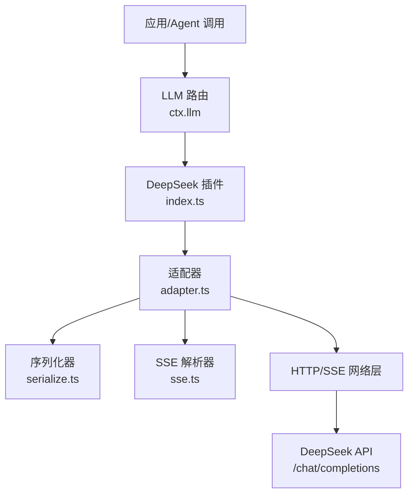
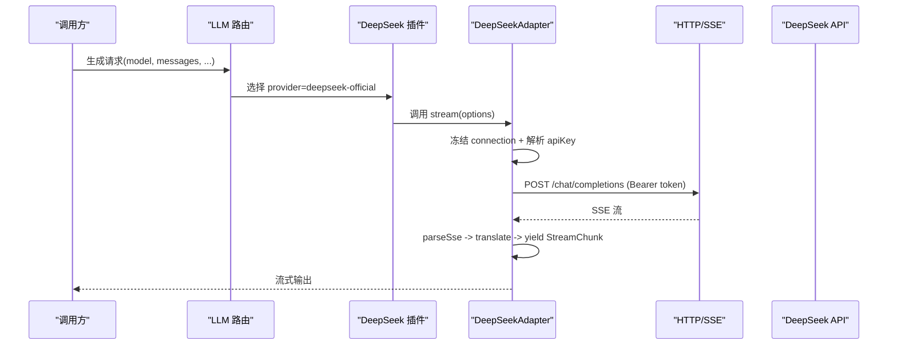
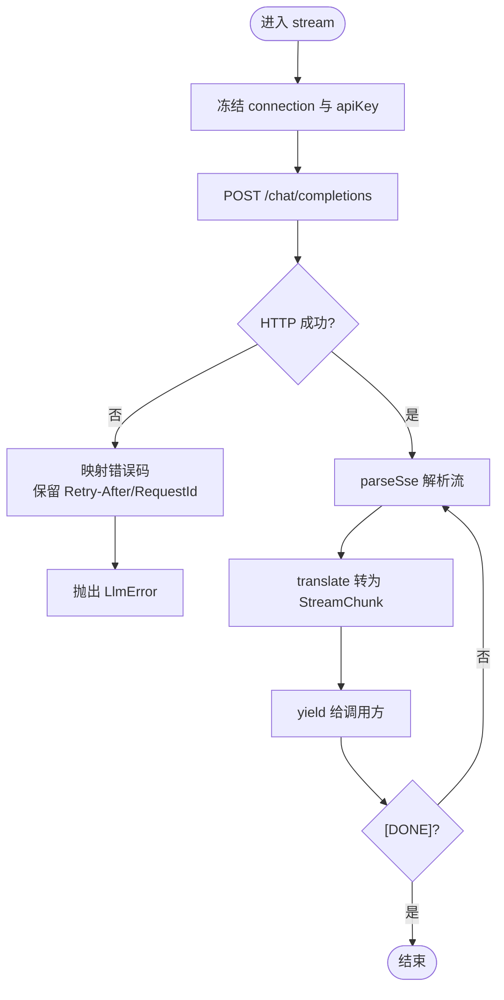
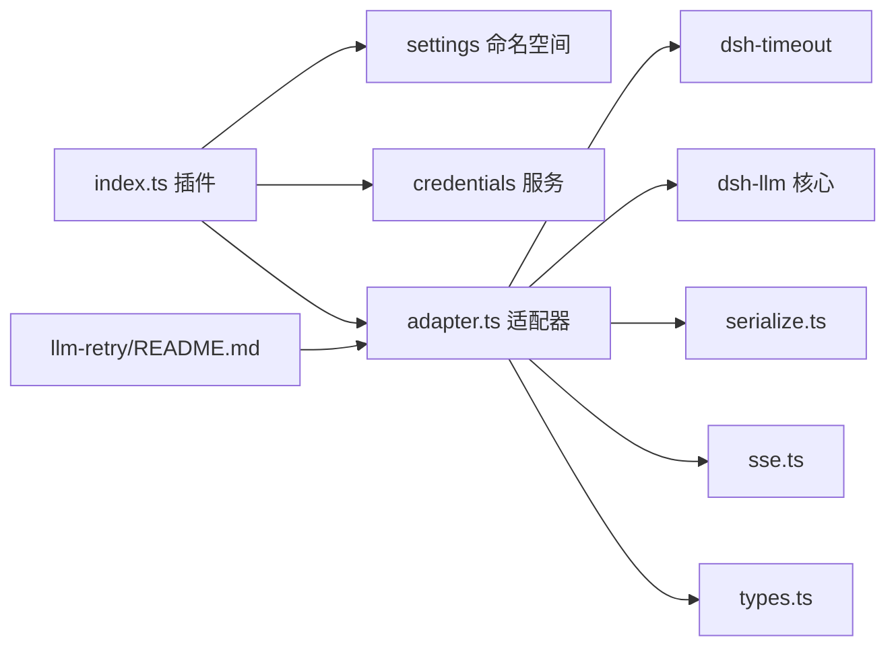

# DeepSeek 提供商

<cite>
**本文引用的文件**
- [packages/llm/llm-deepseek/src/index.ts](file://packages/llm/llm-deepseek/src/index.ts)
- [packages/llm/llm-deepseek/src/adapter.ts](file://packages/llm/llm-deepseek/src/adapter.ts)
- [packages/llm/llm-deepseek/src/serialize.ts](file://packages/llm/llm-deepseek/src/serialize.ts)
- [packages/llm/llm-deepseek/src/sse.ts](file://packages/llm/llm-deepseek/src/sse.ts)
- [packages/llm/llm-deepseek/src/types.ts](file://packages/llm/llm-deepseek/src/types.ts)
- [packages/llm/llm-deepseek/tests/adapter.spec.ts](file://packages/llm/llm-deepseek/tests/adapter.spec.ts)
- [packages/web/web-search-deepseek/src/provider.ts](file://packages/web/web-search-deepseek/src/provider.ts)
- [examples/headless-agent/cordis.yml](file://examples/headless-agent/cordis.yml)
- [packages/llm/llm-retry/README.md](file://packages/llm/llm-retry/README.md)
- [packages/llm/llm/src/retry-policy.ts](file://packages/llm/llm/src/retry-policy.ts)
- [packages/llm/llm/tests/retry-policy.spec.ts](file://packages/llm/llm/tests/retry-policy.spec.ts)
- [packages/host/apiproxy/tests/api-proxy-config.spec.ts](file://packages/host/apiproxy/tests/api-proxy-config.spec.ts)
- [packages/client/ui-settings-models/tests/onboarding-dialog.client.spec.tsx](file://packages/client/ui-settings-models/tests/onboarding-dialog.client.spec.tsx)
</cite>

## 目录
1. [简介](#简介)
2. [项目结构](#项目结构)
3. [核心组件](#核心组件)
4. [架构总览](#架构总览)
5. [详细组件分析](#详细组件分析)
6. [依赖关系分析](#依赖关系分析)
7. [性能与并发](#性能与并发)
8. [故障排查指南](#故障排查指南)
9. [结论](#结论)
10. [附录：配置示例与最佳实践](#附录：配置示例与最佳实践)

## 简介
本文件面向在 DeepSeek Harness 中使用 DeepSeek 模型提供商的开发者与运维人员，系统说明 DeepSeek 插件的配置项、API 密钥与连接参数、支持的模型与能力、速率限制与重试策略、错误处理机制，以及性能调优与最佳实践。内容基于仓库内 DeepSeek LLM 适配器、序列化器、SSE 解析器、设置命名空间与重试策略等源码实现进行整理。

## 项目结构
DeepSeek 提供商由以下关键模块组成：
- 插件注册与配置解析：负责将 llm-deepseek 插件注册到 LLM 路由，提供 per-request 的连接事实与凭据解析。
- 适配器（Adapter）：封装对 DeepSeek OpenAI 兼容 /chat/completions 端点的 HTTP 请求与 SSE 流式读取。
- 序列化器（Serialize）：将 Harness 消息转换为 DeepSeek wire 格式，并处理 thinking/reasoning_effort、工具调用等。
- SSE 解析器（SSE）：严格遵循事件源协议，产出数据片段与结束标记。
- 类型定义（Types）：描述请求体、消息、流式块、用量统计与错误体。
- 重试策略（Retry Policy）：为 provider 级请求提供可配置的退避与重试。

图表来源
- [packages/llm/llm-deepseek/src/index.ts:1-12](file://packages/llm/llm-deepseek/src/index.ts#L1-L12)
- [packages/llm/llm-deepseek/src/adapter.ts:1-28](file://packages/llm/llm-deepseek/src/adapter.ts#L1-L28)
- [packages/llm/llm-deepseek/src/serialize.ts:1-18](file://packages/llm/llm-deepseek/src/serialize.ts#L1-L18)
- [packages/llm/llm-deepseek/src/sse.ts:1-12](file://packages/llm/llm-deepseek/src/sse.ts#L1-L12)

章节来源
- [packages/llm/llm-deepseek/src/index.ts:1-12](file://packages/llm/llm-deepseek/src/index.ts#L1-L12)
- [packages/llm/llm-deepseek/src/adapter.ts:1-28](file://packages/llm/llm-deepseek/src/adapter.ts#L1-L28)

## 核心组件
- 插件与配置（index.ts）
  - 暴露 Config schema，支持 apiKeyEnv、baseURL、thinking、reasoningEffort、maxTokens、defaultContextWindow、models、streamIdleTimeoutMs、retryPolicy。
  - 通过 settings 命名空间安装用户设置段，运行时热更新；每次请求重新解析连接事实，保证 endpoint 与密钥同代一致性。
  - 默认公开端点为 https://api.deepseek.com；可从可信环境层覆盖 DEEPSEEK_BASE_URL。
- 适配器（adapter.ts）
  - 实现 LlmAdapter，listModels、resolveModel、stream。
  - 使用 fetch 发起 POST /chat/completions，携带 Bearer 令牌与追踪头；解析 SSE 流并翻译为 Harness StreamChunk。
  - 统一错误映射：AUTH、RATE_LIMIT、CONTEXT_WINDOW_EXCEEDED、INVALID_REQUEST、SERVER、TRANSPORT、EMPTY_RESPONSE 等。
  - 支持 stream idle watchdog 超时与 caller abort 区分。
- 序列化器（serialize.ts）
  - 将 Harness 消息序列化为 DeepSeek wire 格式；仅支持文本输入（图片将被拒绝）。
  - 处理 thinking/reasoning_effort 的映射与校验；按规则回传 reasoning_content（仅在含 tool_calls 的 assistant 消息中）。
- SSE 解析器（sse.ts）
  - 严格解析事件源流，产出 data 片段与 [DONE] 终止符；未收到 [DONE] 抛出 STREAM_CLOSED。
- 类型（types.ts）
  - 定义 WireRequest/WireMessage/WireChunk/WireUsage/WireError 等 wire 结构。

章节来源
- [packages/llm/llm-deepseek/src/index.ts:54-101](file://packages/llm/llm-deepseek/src/index.ts#L54-L101)
- [packages/llm/llm-deepseek/src/adapter.ts:158-212](file://packages/llm/llm-deepseek/src/adapter.ts#L158-L212)
- [packages/llm/llm-deepseek/src/serialize.ts:14-53](file://packages/llm/llm-deepseek/src/serialize.ts#L14-L53)
- [packages/llm/llm-deepseek/src/sse.ts:17-40](file://packages/llm/llm-deepseek/src/sse.ts#L17-L40)
- [packages/llm/llm-deepseek/src/types.ts:12-30](file://packages/llm/llm-deepseek/src/types.ts#L12-L30)

## 架构总览
DeepSeek 提供商以“每请求解析”的方式解耦连接与凭据：插件持有 options() 与 resolveApiKey()，适配器在每次流式调用时冻结一次连接快照，确保不会混用不同代的 endpoint 与密钥。

图表来源
- [packages/llm/llm-deepseek/src/index.ts:200-276](file://packages/llm/llm-deepseek/src/index.ts#L200-L276)
- [packages/llm/llm-deepseek/src/adapter.ts:214-269](file://packages/llm/llm-deepseek/src/adapter.ts#L214-L269)
- [packages/llm/llm-deepseek/src/sse.ts:28-40](file://packages/llm/llm-deepseek/src/sse.ts#L28-L40)

## 详细组件分析

### 插件与配置（index.ts）
- 配置项
  - apiKeyEnv：凭据引用名，默认 DEEPSEEK_API_KEY。
  - baseURL：端点基址；优先从可信环境层 DEEPSEEK_BASE_URL 获取，否则使用公开地址。
  - thinking：部署级思考模式开关（enabled/disabled）。
  - reasoningEffort：推理努力级别（off/high/max），默认 high。
  - maxTokens：默认最大输出 token 数。
  - defaultContextWindow：默认上下文窗口大小。
  - models：建议模型目录（id/name/description/contextWindow/maxTokens）。
  - streamIdleTimeoutMs：流空闲超时。
  - retryPolicy：provider 级重试策略。
- 动态配置
  - 通过 installSettingsSection 挂载 llm-deepseek 设置段，变更即时生效。
  - 每次调用前重新解析 options，但流内保持同一快照。
- 凭据解析
  - 优先通过 ctx.credentials 服务解析 apiKeyEnv；若无 seam，则回退到进程环境变量。
  - 缺失凭据抛出 MISSING_CREDENTIAL。

章节来源
- [packages/llm/llm-deepseek/src/index.ts:54-101](file://packages/llm/llm-deepseek/src/index.ts#L54-L101)
- [packages/llm/llm-deepseek/src/index.ts:161-198](file://packages/llm/llm-deepseek/src/index.ts#L161-L198)
- [packages/llm/llm-deepseek/src/index.ts:200-276](file://packages/llm/llm-deepseek/src/index.ts#L200-L276)

### 适配器（adapter.ts）
- 模型能力
  - listModels 返回 models 目录中的条目；resolveModel 根据配置决定 contextWindow、默认 maxTokens 与 reasoning efforts。
  - 当前 wire 通道为纯文本，inputModalities 固定为 text。
- 流式生成
  - stream 方法冻结 connection 与 apiKey，构造 AbortSignal.any 合并外部取消信号。
  - 使用 idleWatchdog 监控流空闲，超时抛出 TIMEOUT。
  - 请求失败时，根据 HTTP 状态与错误体映射稳定错误码。
- 错误映射
  - 401/403 → AUTH；429 → RATE_LIMIT；400 且上下文超限 → CONTEXT_WINDOW_EXCEEDED；其他 4xx → INVALID_REQUEST/HTTP_XXX；5xx → SERVER；无响应体 → EMPTY_RESPONSE。
  - 保留 providerRetryAfterMs 与 requestId（x-request-id 或 x-deepseek-request-id）。

图表来源
- [packages/llm/llm-deepseek/src/adapter.ts:214-269](file://packages/llm/llm-deepseek/src/adapter.ts#L214-L269)
- [packages/llm/llm-deepseek/src/adapter.ts:321-345](file://packages/llm/llm-deepseek/src/adapter.ts#L321-L345)
- [packages/llm/llm-deepseek/src/sse.ts:28-40](file://packages/llm/llm-deepseek/src/sse.ts#L28-L40)

章节来源
- [packages/llm/llm-deepseek/src/adapter.ts:107-149](file://packages/llm/llm-deepseek/src/adapter.ts#L107-L149)
- [packages/llm/llm-deepseek/src/adapter.ts:175-212](file://packages/llm/llm-deepseek/src/adapter.ts#L175-L212)
- [packages/llm/llm-deepseek/src/adapter.ts:214-269](file://packages/llm/llm-deepseek/src/adapter.ts#L214-L269)
- [packages/llm/llm-deepseek/src/adapter.ts:321-345](file://packages/llm/llm-deepseek/src/adapter.ts#L321-L345)

### 序列化器（serialize.ts）
- 仅支持文本输入；检测到图片会抛出 UNSUPPORTED_CONTENT。
- thinking/reasoning_effort 映射：
  - off → thinking disabled；high/max → thinking enabled 并附带 reasoning_effort。
  - 当部署禁用 thinking 时，仅允许 effort=off。
- 工具调用：assistant 消息若包含 tool_calls，需回传 reasoning_content（thinking 模式下）。
- 构建请求体：始终 stream=true，include_usage=true；按需附加 tools、temperature、max_tokens、stop。

章节来源
- [packages/llm/llm-deepseek/src/serialize.ts:25-53](file://packages/llm/llm-deepseek/src/serialize.ts#L25-L53)
- [packages/llm/llm-deepseek/src/serialize.ts:70-101](file://packages/llm/llm-deepseek/src/serialize.ts#L70-L101)
- [packages/llm/llm-deepseek/src/serialize.ts:151-187](file://packages/llm/llm-deepseek/src/serialize.ts#L151-L187)

### SSE 解析器（sse.ts）
- 严格事件源协议：跳过注释与非 data 字段，拼接多行 data。
- 必须收到 [DONE] 才结束；否则抛出 STREAM_CLOSED。
- 通过 onComment 回调上报传输活动（如心跳/保活）。

章节来源
- [packages/llm/llm-deepseek/src/sse.ts:17-40](file://packages/llm/llm-deepseek/src/sse.ts#L17-L40)

### 类型（types.ts）
- WireRequest/WireMessage/WireChunk/WireUsage/WireError 等定义了与 DeepSeek API 交互的数据契约。
- usage 字段用于 token 计量；prompt_tokens 包含命中缓存部分，上层会做去重计算。

章节来源
- [packages/llm/llm-deepseek/src/types.ts:12-30](file://packages/llm/llm-deepseek/src/types.ts#L12-L30)
- [packages/llm/llm-deepseek/src/types.ts:133-147](file://packages/llm/llm-deepseek/src/types.ts#L133-L147)

## 依赖关系分析
- 插件依赖
  - 设置命名空间（installSettingsSection）用于热更新配置。
  - 凭据服务（ctx.credentials）用于 per-request 解析 API Key。
  - 匿名用户 ID 用于追踪头。
- 适配器依赖
  - dsh-timeout 提供 idleWatchdog 与 timeoutOf。
  - dsh-llm 提供 LlmAdapter、错误码、attributionHeaders、ReasoningEffortId 等。
- 重试策略
  - 默认 normal 模式：最多 2 次重试，适用于 EMPTY_RESPONSE、RATE_LIMIT、SERVER、TIMEOUT、TRANSPORT。
  - always 模式：不限次数，先走下游恢复再重试。
  - 支持 providerRetryAfterMs 覆盖本地退避（不超过 maxDelayMs）。

图表来源
- [packages/llm/llm-deepseek/src/index.ts:200-276](file://packages/llm/llm-deepseek/src/index.ts#L200-L276)
- [packages/llm/llm-deepseek/src/adapter.ts:11-27](file://packages/llm/llm-deepseek/src/adapter.ts#L11-L27)
- [packages/llm/llm-retry/README.md:1-9](file://packages/llm/llm-retry/README.md#L1-L9)

章节来源
- [packages/llm/llm-deepseek/src/index.ts:200-276](file://packages/llm/llm-deepseek/src/index.ts#L200-L276)
- [packages/llm/llm-deepseek/src/adapter.ts:11-27](file://packages/llm/llm-deepseek/src/adapter.ts#L11-L27)
- [packages/llm/llm-retry/README.md:1-9](file://packages/llm/llm-retry/README.md#L1-L9)

## 性能与并发
- 流式 I/O
  - 适配器使用流式 SSE，逐块 yield，降低内存占用与首字延迟。
  - idleWatchdog 防止长时间无活动的流挂起，默认空闲超时可配置。
- 并发与取消
  - 每个流调用独立冻结 connection 与 apiKey，避免跨请求共享状态。
  - 支持 AbortSignal 合并，调用方可随时取消；取消被映射为 ABORTED。
- 重试与退避
  - 默认 normal 模式提供指数退避与抖动；always 模式适合需要强恢复的场景。
  - 尊重 provider 返回的 Retry-After（秒或日期），并在上限内直接采用。
- 吞吐优化建议
  - 合理设置 maxTokens 与 temperature，避免过大输出导致长尾。
  - 使用合适的 reasoningEffort：高推理成本场景谨慎开启。
  - 调整 streamIdleTimeoutMs 以适应网络波动。

章节来源
- [packages/llm/llm-deepseek/src/adapter.ts:214-269](file://packages/llm/llm-deepseek/src/adapter.ts#L214-L269)
- [packages/llm/llm-deepseek/src/adapter.ts:321-345](file://packages/llm/llm-deepseek/src/adapter.ts#L321-L345)
- [packages/llm/llm/tests/retry-policy.spec.ts:1-60](file://packages/llm/llm/tests/retry-policy.spec.ts#L1-L60)
- [packages/llm/llm/src/retry-policy.ts:14-24](file://packages/llm/llm/src/retry-policy.ts#L14-L24)

## 故障排查指南
- 认证失败
  - 现象：AUTH 错误（401/403）。
  - 检查：apiKeyEnv 是否正确指向有效的凭据；credentials 服务是否可用；环境变量是否注入。
- 速率限制
  - 现象：RATE_LIMIT（429），可能携带 Retry-After。
  - 处理：等待 providerRetryAfterMs 后重试；或在重试策略中扩大预算。
- 上下文超限
  - 现象：CONTEXT_WINDOW_EXCEEDED（400）。
  - 处理：缩短历史或启用压缩；提高 defaultContextWindow 或模型自身上限。
- 传输错误
  - 现象：TRANSPORT（DNS/TLS/代理失败）、TIMEOUT（流空闲超时）、STREAM_CLOSED（未收到 [DONE]）。
  - 处理：检查网络与代理；增大 streamIdleTimeoutMs；确认服务端正常。
- 不支持的内容
  - 现象：UNSUPPORTED_CONTENT（图片）。
  - 处理：当前适配器仅支持文本；如需多模态，请使用支持图像的路径或后端。
- Web 搜索相关
  - 现象：WEB_PROVIDER_ERROR、WEB_ABORTED。
  - 处理：检查 credentials 解析与取消信号传播。

章节来源
- [packages/llm/llm-deepseek/src/adapter.ts:138-149](file://packages/llm/llm-deepseek/src/adapter.ts#L138-L149)
- [packages/llm/llm-deepseek/src/adapter.ts:246-269](file://packages/llm/llm-deepseek/src/adapter.ts#L246-L269)
- [packages/llm/llm-deepseek/src/adapter.ts:321-345](file://packages/llm/llm-deepseek/src/adapter.ts#L321-L345)
- [packages/llm/llm-deepseek/src/serialize.ts:63-68](file://packages/llm/llm-deepseek/src/serialize.ts#L63-L68)
- [packages/web/web-search-deepseek/src/provider.ts:303-347](file://packages/web/web-search-deepseek/src/provider.ts#L303-L347)

## 结论
DeepSeek 提供商在 Harness 中以“每请求解析”的方式实现了灵活、安全的连接与凭据管理；适配器专注流式 I/O 与错误映射，序列化器确保 wire 正确性；配合重试策略与超时控制，可在生产环境中获得稳定的文本生成体验。对于多模态需求，当前适配器限定为文本路径，可通过扩展或替代后端满足。

## 附录：配置示例与最佳实践

### 环境变量与凭据
- 推荐通过凭据服务管理 API Key，键名为 apiKeyEnv 指定的名称（默认 DEEPSEEK_API_KEY）。
- 在 CI/容器场景中，可直接注入进程环境变量作为最高优先级覆盖。
- 若未挂载凭据服务，适配器会回退到进程环境变量。

章节来源
- [packages/llm/llm-deepseek/src/index.ts:225-246](file://packages/llm/llm-deepseek/src/index.ts#L225-L246)
- [packages/host/apiproxy/tests/api-proxy-config.spec.ts:158-164](file://packages/host/apiproxy/tests/api-proxy-config.spec.ts#L158-L164)

### cordis.yml 配置要点
- 启用 llm-deepseek 插件，并通过 config 指定 thinking、reasoningEffort、models 等。
- 结合 settings 与 credentials 插件，实现运行时热更新与凭据管理。
- 在 agent-spine 中指定 provider 与 model，例如 deepseek-official 与 deepseek-v4-flash/pro。

章节来源
- [examples/headless-agent/cordis.yml:23-33](file://examples/headless-agent/cordis.yml#L23-L33)
- [examples/headless-agent/cordis.yml:44-54](file://examples/headless-agent/cordis.yml#L44-L54)

### 前端设置命名空间（UI）
- 设置命名空间为 llm-deepseek，包含 apiKeyEnv、baseURL、reasoningEffort、defaultContextWindow、models 等字段。
- 默认模型目录包含 deepseek-v4-flash 与 deepseek-v4-pro，contextWindow 默认值来自常量。

章节来源
- [packages/client/ui-settings-models/tests/onboarding-dialog.client.spec.tsx:29-54](file://packages/client/ui-settings-models/tests/onboarding-dialog.client.spec.tsx#L29-L54)
- [packages/client/ui-settings-models/tests/components.client.spec.tsx:48-84](file://packages/client/ui-settings-models/tests/components.client.spec.tsx#L48-L84)

### 速率限制与重试
- 默认 normal 模式：针对 EMPTY_RESPONSE、RATE_LIMIT、SERVER、TIMEOUT、TRANSPORT 最多重试 2 次，指数退避 500ms~10s，抖动 10%。
- always 模式：不限次数，先尝试下游恢复，再重试所有失败。
- 尊重 provider 的 Retry-After（秒或日期），并在上限内直接使用。

章节来源
- [packages/llm/llm-retry/README.md:1-9](file://packages/llm/llm-retry/README.md#L1-L9)
- [packages/llm/llm/src/retry-policy.ts:14-24](file://packages/llm/llm/src/retry-policy.ts#L14-L24)
- [packages/llm/llm/tests/retry-policy.spec.ts:1-60](file://packages/llm/llm/tests/retry-policy.spec.ts#L1-L60)
- [packages/llm/llm-deepseek/tests/adapter.spec.ts:310-359](file://packages/llm/llm-deepseek/tests/adapter.spec.ts#L310-L359)

### 认证流程与令牌管理
- 插件在 apply 中注册 provider 与适配器，并通过 settings 命名空间监听配置变化。
- 每次调用前解析 connection 与 apiKey，确保 endpoint 与密钥同代一致。
- 凭据解析顺序：优先 ctx.credentials，其次进程环境变量；缺失则抛出 MISSING_CREDENTIAL。

章节来源
- [packages/llm/llm-deepseek/src/index.ts:200-276](file://packages/llm/llm-deepseek/src/index.ts#L200-L276)

### 功能特性与模型版本
- 当前适配器为文本通道，inputModalities 固定为 text；图片内容会被拒绝。
- 支持 thinking 模式与 reasoning_effort（high/max），部署可强制关闭 thinking。
- 默认模型目录包含 V4 Flash 与 V4 Pro，可自定义 contextWindow 与 maxTokens。

章节来源
- [packages/llm/llm-deepseek/src/adapter.ts:175-212](file://packages/llm/llm-deepseek/src/adapter.ts#L175-L212)
- [packages/llm/llm-deepseek/src/serialize.ts:63-68](file://packages/llm/llm-deepseek/src/serialize.ts#L63-L68)
- [packages/llm/llm-deepseek/src/index.ts:49-52](file://packages/llm/llm-deepseek/src/index.ts#L49-L52)

### 最佳实践
- 在生产环境使用凭据服务管理 API Key，避免硬编码。
- 合理设置 thinking/reasoningEffort，平衡质量与成本。
- 根据业务场景调整 maxTokens、defaultContextWindow 与 streamIdleTimeoutMs。
- 使用重试策略应对瞬时错误；对持续限流场景考虑降级或排队。
- 监控错误码分布（RATE_LIMIT、CONTEXT_WINDOW_EXCEEDED、TRANSPORT），针对性优化。