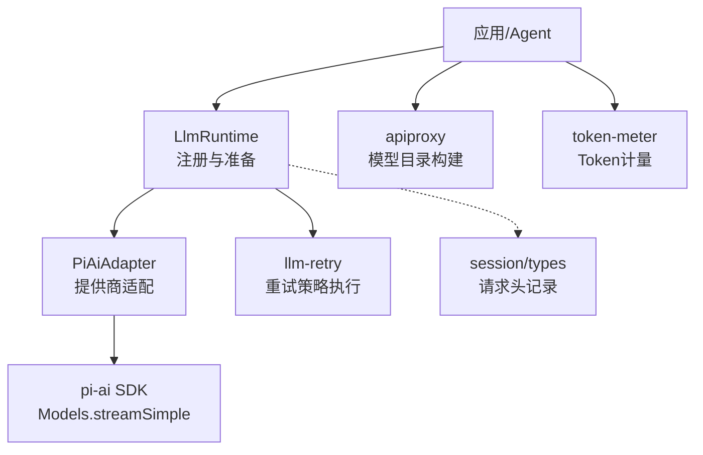
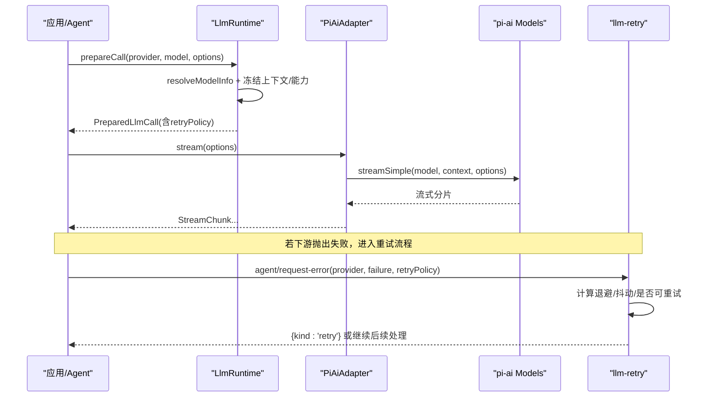
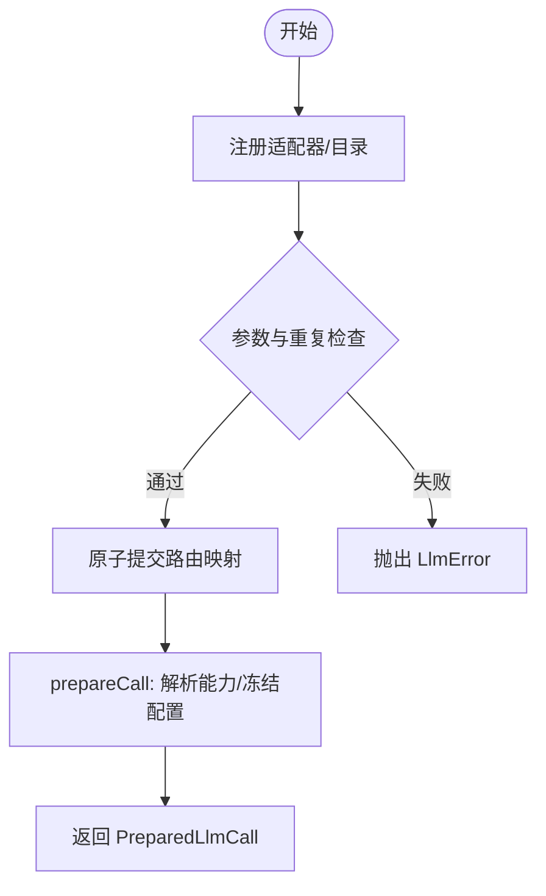
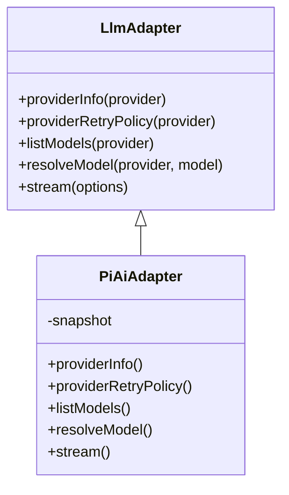
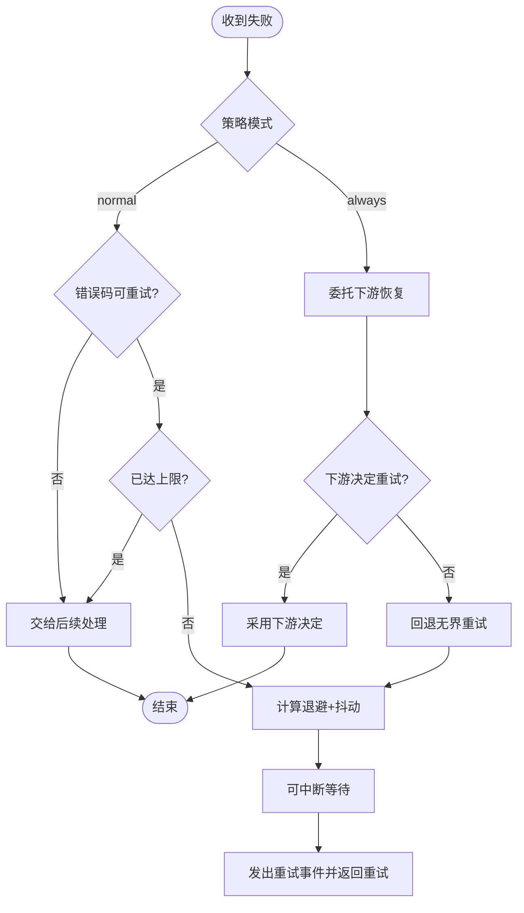
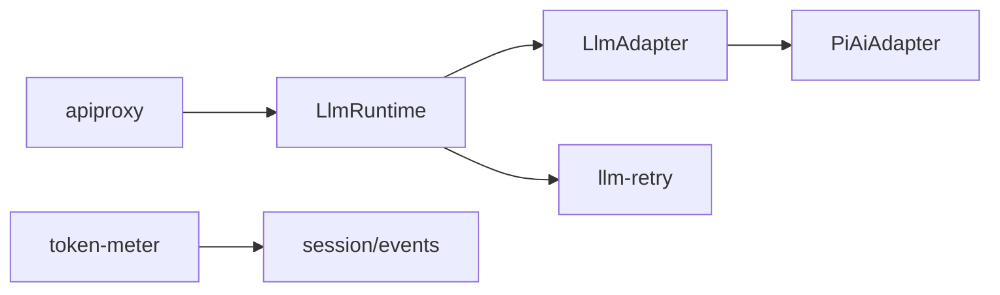

# 提供商路由策略

<cite>
**本文引用的文件**
- [packages/llm/llm/src/index.ts](file://packages/llm/llm/src/index.ts)
- [packages/llm/llm/src/retry-policy.ts](file://packages/llm/llm/src/retry-policy.ts)
- [packages/llm/llm-retry/src/index.ts](file://packages/llm/llm-retry/src/index.ts)
- [packages/llm/llm-pi-ai/src/adapter.ts](file://packages/llm/llm-pi-ai/src/adapter.ts)
- [packages/llm/llm-pi-ai/src/config.ts](file://packages/llm/llm-pi-ai/src/config.ts)
- [packages/host/apiproxy/src/api-proxy.ts](file://packages/host/apiproxy/src/api-proxy.ts)
- [packages/core/session/src/types.ts](file://packages/core/session/src/types.ts)
- [packages/token-meter/src/index.ts](file://packages/token-meter/src/index.ts)
</cite>

## 目录
1. [简介](#简介)
2. [项目结构](#项目结构)
3. [核心组件](#核心组件)
4. [架构总览](#架构总览)
5. [详细组件分析](#详细组件分析)
6. [依赖关系分析](#依赖关系分析)
7. [性能考量](#性能考量)
8. [故障排查指南](#故障排查指南)
9. [结论](#结论)
10. [附录：配置与调试](#附录：配置与调试)

## 简介
本文件系统化说明多提供商环境下的请求路由、重试与监控机制。重点覆盖：
- 路由决策：基于已注册提供商路由、模型能力（上下文窗口、推理能力）与调用配置的匹配与校验。
- 负载均衡：当前实现以“按路由选择”为主，未内置跨提供商的权重轮询；可通过外部编排或会话级选择器实现。
- 故障转移与重试：提供“正常模式”（有界瞬态错误重试）和“始终重试”（无界重试）两种策略，结合退避与抖动。
- 上下文与条件判断：在准备阶段冻结提供商、模型与能力元数据，确保一次流式调用内不漂移。
- 自定义路由：通过适配器扩展点与可配置提供商目录进行扩展。
- 监控与指标：Token 计量、重试事件与会话投影，便于观测与排障。

## 项目结构
围绕 LLM 路由的关键代码分布在以下模块：
- llm：抽象运行时、适配器注册、重试策略定义、调用准备与瀑布拦截。
- llm-pi-ai：具体提供商适配器，负责模型目录、能力解析、流式调用与超时控制。
- llm-retry：在智能体循环的请求错误恢复钩子上执行重试策略。
- apiproxy：构建模型目录与失败分组，供上层 UI/选择器使用。
- session/types：记录请求头中的提供商与模型信息，用于回放与度量。
- token-meter：会话回放感知 Token 计量，聚合提供方用量与表面负载。

图表来源
- [packages/llm/llm/src/index.ts:284-413](file://packages/llm/llm/src/index.ts#L284-L413)
- [packages/llm/llm-pi-ai/src/adapter.ts:186-359](file://packages/llm/llm-pi-ai/src/adapter.ts#L186-L359)
- [packages/llm/llm-retry/src/index.ts:99-227](file://packages/llm/llm-retry/src/index.ts#L99-L227)
- [packages/host/apiproxy/src/api-proxy.ts:320-348](file://packages/host/apiproxy/src/api-proxy.ts#L320-L348)
- [packages/core/session/src/types.ts:212-228](file://packages/core/session/src/types.ts#L212-L228)
- [packages/token-meter/src/index.ts:74-147](file://packages/token-meter/src/index.ts#L74-L147)

章节来源
- [packages/llm/llm/src/index.ts:284-413](file://packages/llm/llm/src/index.ts#L284-L413)
- [packages/llm/llm-pi-ai/src/adapter.ts:186-359](file://packages/llm/llm-pi-ai/src/adapter.ts#L186-L359)
- [packages/llm/llm-retry/src/index.ts:99-227](file://packages/llm/llm-retry/src/index.ts#L99-L227)
- [packages/host/apiproxy/src/api-proxy.ts:320-348](file://packages/host/apiproxy/src/api-proxy.ts#L320-L348)
- [packages/core/session/src/types.ts:212-228](file://packages/core/session/src/types.ts#L212-L228)
- [packages/token-meter/src/index.ts:74-147](file://packages/token-meter/src/index.ts#L74-L147)

## 核心组件
- LlmRuntime：适配器注册、路由发现、调用准备与瀑布拦截；将每个提供商路由与其重试策略绑定并冻结。
- PiAiAdapter：将配置解析为不可变快照，提供 listModels/resolveModel/stream，并在流中处理超时、中止与内容校验。
- llm-retry：监听 agent/request-error，依据提供商路由的重试策略执行指数退避与抖动，支持 normal/always 两种模式。
- apiproxy：汇总各提供商模型目录，生成可供选择的分组与失败信息。
- token-meter：基于会话事件回放，估算并聚合 Token 用量，提供压力与上下文度量。

章节来源
- [packages/llm/llm/src/index.ts:284-800](file://packages/llm/llm/src/index.ts#L284-L800)
- [packages/llm/llm-pi-ai/src/adapter.ts:186-359](file://packages/llm/llm-pi-ai/src/adapter.ts#L186-L359)
- [packages/llm/llm-retry/src/index.ts:99-227](file://packages/llm/llm-retry/src/index.ts#L99-L227)
- [packages/host/apiproxy/src/api-proxy.ts:320-348](file://packages/host/apiproxy/src/api-proxy.ts#L320-L348)
- [packages/token-meter/src/index.ts:74-147](file://packages/token-meter/src/index.ts#L74-L147)

## 架构总览
下图展示一次带重试的流式调用从准备到执行的完整链路，以及重试策略如何介入失败恢复。

图表来源
- [packages/llm/llm/src/index.ts:619-800](file://packages/llm/llm/src/index.ts#L619-L800)
- [packages/llm/llm-pi-ai/src/adapter.ts:276-359](file://packages/llm/llm-pi-ai/src/adapter.ts#L276-L359)
- [packages/llm/llm-retry/src/index.ts:156-208](file://packages/llm/llm-retry/src/index.ts#L156-L208)

## 详细组件分析

### 路由与调用准备（LlmRuntime）
- 适配器注册：registerAdapter 接收一组 provider 名称，验证唯一性并收集 providerInfo/providerRetryPolicy，原子提交到内部映射。
- 目录注册：registerConfigurableProviders 允许插件声明可配置提供商条目，支持原子替换。
- 模型目录：listModels/resolveModelInfo 仅做能力查询与校验，不参与路由选择；catalog 成员是建议性的。
- 调用准备：prepareCall 会解析模型能力（上下文窗口、默认 maxTokens、推理能力），冻结配置与上下文，并将 retryPolicy 一并绑定到 PreparedLlmCall。

图表来源
- [packages/llm/llm/src/index.ts:338-413](file://packages/llm/llm/src/index.ts#L338-L413)
- [packages/llm/llm/src/index.ts:779-800](file://packages/llm/llm/src/index.ts#L779-L800)

章节来源
- [packages/llm/llm/src/index.ts:338-413](file://packages/llm/llm/src/index.ts#L338-L413)
- [packages/llm/llm/src/index.ts:779-800](file://packages/llm/llm/src/index.ts#L779-L800)

### 提供商适配器（PiAiAdapter）
- 快照化：每次操作读取当前 profiles，构建不可变的 Models 集合，避免配置变更影响进行中请求。
- 能力解析：resolveModel 输出上下文窗口、默认 maxTokens、推理能力等；stream 中进行图像输入校验、附件服务要求、空闲超时保护。
- 认证与头部：apiKey 由 harness 注入，headers 合并时保留 Harness 的 attribution 优先。
- 重试策略暴露：providerRetryPolicy 返回该路由已解析的策略。

图表来源
- [packages/llm/llm/src/index.ts:180-233](file://packages/llm/llm/src/index.ts#L180-L233)
- [packages/llm/llm-pi-ai/src/adapter.ts:186-359](file://packages/llm/llm-pi-ai/src/adapter.ts#L186-L359)

章节来源
- [packages/llm/llm-pi-ai/src/adapter.ts:186-359](file://packages/llm/llm-pi-ai/src/adapter.ts#L186-L359)

### 重试策略（llm-retry）
- 策略类型：
  - normal：仅对配置的可重试错误码进行有界重试，次数不超过 maxRetries。
  - always：对所有失败进行无界重试，直到成功、取消或插件销毁。
- 退避与抖动：指数退避，范围 initialDelayMs~maxDelayMs，乘以均匀抖动比例 jitterRatio。
- 优先级：always 模式先委托下游恢复（如压缩策略），若下游决定重试则采纳；否则回退到无界重试同一提供商请求。
- 历史延续：按 provider + 策略规范键（包含排序后的 retryableCodes）延续重试计数；路由替换后即使模式不变也会重置。

图表来源
- [packages/llm/llm-retry/src/index.ts:156-208](file://packages/llm/llm-retry/src/index.ts#L156-L208)
- [packages/llm/llm-retry/src/index.ts:58-76](file://packages/llm/llm-retry/src/index.ts#L58-L76)

章节来源
- [packages/llm/llm-retry/src/index.ts:58-76](file://packages/llm/llm-retry/src/index.ts#L58-L76)
- [packages/llm/llm-retry/src/index.ts:156-208](file://packages/llm/llm-retry/src/index.ts#L156-L208)

### 模型目录与选择（apiproxy）
- 构建目录：遍历所有已注册提供商，列出模型并解析能力，形成 ModelProviderGroup。
- 失败分组：按提供商失败的组别上报，不影响其他组的可用性。
- 选择逻辑：目录成员为建议性；实际路由由调用方根据 provider/model 选择，未被列出的模型仍可被接受但不会反向注入选择器。

章节来源
- [packages/host/apiproxy/src/api-proxy.ts:320-348](file://packages/host/apiproxy/src/api-proxy.ts#L320-L348)

### 请求上下文与容量（session/types）
- RequestContext：记录本次请求所属的 provider 与 model，以及上下文窗口（若提供）。
- 用途：回放、计量与压缩策略可据此精确识别目标路由与容量。

章节来源
- [packages/core/session/src/types.ts:212-228](file://packages/core/session/src/types.ts#L212-L228)

## 依赖关系分析
- LlmRuntime 依赖适配器接口，解耦具体提供商实现；重试策略由适配器在注册时提供。
- PiAiAdapter 依赖 pi-ai SDK 与配置解析，提供不可变快照保证一致性。
- llm-retry 依赖 agent 的事件系统，按 provider 与策略键维护重试历史。
- apiproxy 依赖 LlmRuntime 的列表与解析能力，生成面向 UI 的分组。
- token-meter 依赖会话事件回放，聚合 Token 用量与上下文压力。

图表来源
- [packages/llm/llm/src/index.ts:284-413](file://packages/llm/llm/src/index.ts#L284-L413)
- [packages/llm/llm-pi-ai/src/adapter.ts:186-359](file://packages/llm/llm-pi-ai/src/adapter.ts#L186-L359)
- [packages/llm/llm-retry/src/index.ts:99-227](file://packages/llm/llm-retry/src/index.ts#L99-L227)
- [packages/host/apiproxy/src/api-proxy.ts:320-348](file://packages/host/apiproxy/src/api-proxy.ts#L320-L348)
- [packages/token-meter/src/index.ts:74-147](file://packages/token-meter/src/index.ts#L74-L147)

章节来源
- [packages/llm/llm/src/index.ts:284-413](file://packages/llm/llm/src/index.ts#L284-L413)
- [packages/llm/llm-pi-ai/src/adapter.ts:186-359](file://packages/llm/llm-pi-ai/src/adapter.ts#L186-L359)
- [packages/llm/llm-retry/src/index.ts:99-227](file://packages/llm/llm-retry/src/index.ts#L99-L227)
- [packages/host/apiproxy/src/api-proxy.ts:320-348](file://packages/host/apiproxy/src/api-proxy.ts#L320-L348)
- [packages/token-meter/src/index.ts:74-147](file://packages/token-meter/src/index.ts#L74-L147)

## 性能考量
- 快照化与冻结：PiAiAdapter 每次操作构建不可变快照，避免并发下配置漂移；prepareCall 冻结配置与上下文，减少运行时开销。
- 流式空闲超时：PiAiAdapter 使用 idleWatchdog 防止长时间无读阻塞。
- Token 计量：token-meter 基于会话回放增量折叠，O(表面大小)，在阈值检查前复用最近锚点，降低重复估算成本。
- 重试退避：指数退避与抖动避免雪崩；always 模式仅在必要时才无界重试，且受最大延迟限制。

[本节为通用指导，无需特定文件引用]

## 故障排查指南
- 常见错误码与分类：
  - UNSUPPORTED_REASONING_EFFORT：请求的推理级别不被模型支持。
  - UNKNOWN_MODEL：所选模型未在提供商目录中配置。
  - TIMEOUT/ABORTED：流空闲超时或被调用方中止。
  - INVALID_CATALOG/INVALID_MODEL_INFO：适配器返回的目录或模型元数据非法。
- 定位步骤：
  - 查看会话事件 llm/retry 与 llm/retry-started，确认重试模式、策略键与退避时间。
  - 检查 request/header 中的 provider/model，确认路由与上下文窗口。
  - 核对适配器返回的模型能力（contextWindow、reasoning.efforts、defaultMaxTokens）。
  - 对于图像输入，确认模型 input 包含 image 且启用了附件服务。
- 日志与诊断：
  - llm-retry 在 always 模式下忽略下游恢复失败时会记录警告。
  - LlmError 携带结构化 failure（code/status/providerRetryAfterMs/requestId），便于上层统一处理。

章节来源
- [packages/llm/llm/src/index.ts:83-117](file://packages/llm/llm/src/index.ts#L83-L117)
- [packages/llm/llm-pi-ai/src/adapter.ts:217-359](file://packages/llm/llm-pi-ai/src/adapter.ts#L217-L359)
- [packages/llm/llm-retry/src/index.ts:156-208](file://packages/llm/llm-retry/src/index.ts#L156-L208)

## 结论
本实现以“路由即提供者”为核心，通过适配器注册与快照化保证一致性与可观测性；重试策略按提供商粒度配置，支持有界与无界两种模式，配合退避与抖动提升鲁棒性。模型目录与能力解析为可选建议，不强制路由；Token 计量与事件回放提供完整的监控与排障基础。未来可在选择层引入更复杂的负载均衡策略，或在适配器层扩展更多提供商。

[本节为总结，无需特定文件引用]

## 附录：配置与调试

### 提供商路由与重试策略配置要点
- 在提供商配置中设置 retryPolicy：
  - mode: 'normal' | 'always'
  - normal 模式可配置 maxRetries、retryableCodes、backoff
  - backoff 可配置 initialDelayMs、maxDelayMs、jitterRatio
- 在 PiAiProviderProfile 中可配置：
  - displayName、api、baseURL、models、modelOverrides、compat
  - defaultContextWindow、defaultMaxTokens、defaultInput
  - headers、reasoning、thinkingBudgets、cacheRetention、transport
  - timeoutMs、websocketConnectTimeoutMs、streamIdleTimeoutMs
  - retryPolicy

章节来源
- [packages/llm/llm-pi-ai/src/config.ts:64-179](file://packages/llm/llm-pi-ai/src/config.ts#L64-L179)
- [packages/llm/llm-pi-ai/src/config.ts:232-257](file://packages/llm/llm-pi-ai/src/config.ts#L232-L257)
- [packages/llm/llm/src/retry-policy.ts:26-79](file://packages/llm/llm/src/retry-policy.ts#L26-L79)
- [packages/llm/llm/src/retry-policy.ts:145-191](file://packages/llm/llm/src/retry-policy.ts#L145-L191)

### 自定义路由逻辑实现指南
- 通过 LlmAdapter 扩展：
  - 实现 providerInfo、listModels、resolveModel、stream
  - 在 providerRetryPolicy 中返回该路由的重试策略
- 通过 registerConfigurableProviders 声明可配置提供商条目，使配置界面可管理
- 在 prepareCall 阶段冻结配置与上下文，确保一次调用内路由稳定

章节来源
- [packages/llm/llm/src/index.ts:180-233](file://packages/llm/llm/src/index.ts#L180-L233)
- [packages/llm/llm/src/index.ts:431-484](file://packages/llm/llm/src/index.ts#L431-L484)
- [packages/llm/llm/src/index.ts:779-800](file://packages/llm/llm/src/index.ts#L779-L800)

### 监控与性能指标
- 重试事件：llm/retry、llm/retry-started 记录重试次数、策略键、退避时间与失败详情
- Token 计量：measure 返回 baseline/surfaceDeltaTokens/totalTokens，支持 usage 与 estimated 基线
- 会话投影：token-meter 注册上下文压力与用量投影，便于可视化

章节来源
- [packages/llm/llm-retry/src/index.ts:126-153](file://packages/llm/llm-retry/src/index.ts#L126-L153)
- [packages/token-meter/src/index.ts:100-147](file://packages/token-meter/src/index.ts#L100-L147)
- [packages/token-meter/src/index.ts:183-270](file://packages/token-meter/src/index.ts#L183-L270)