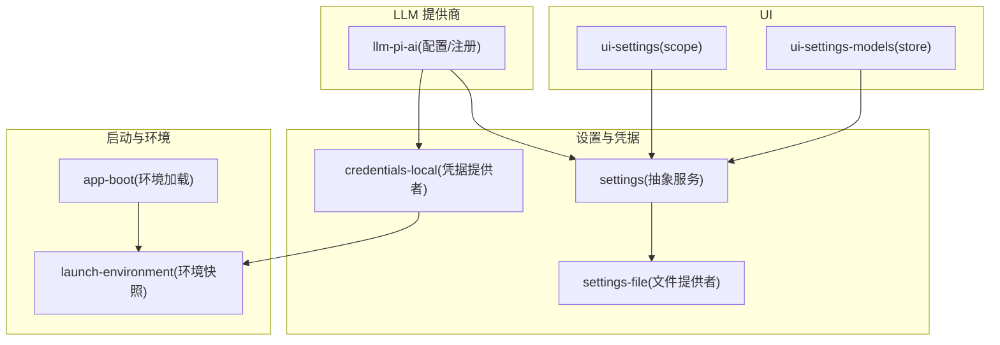
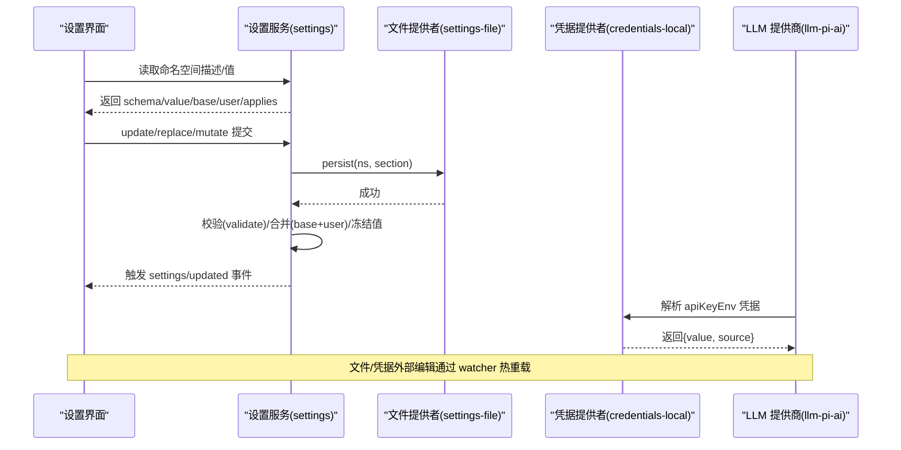
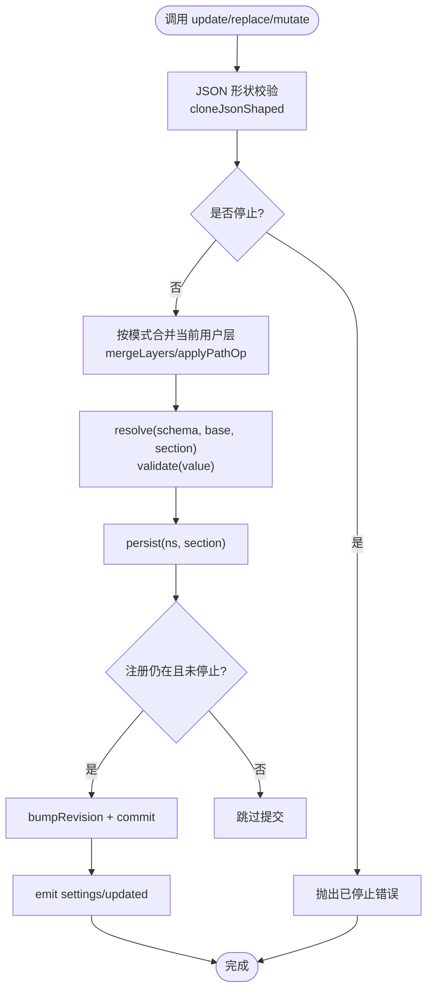
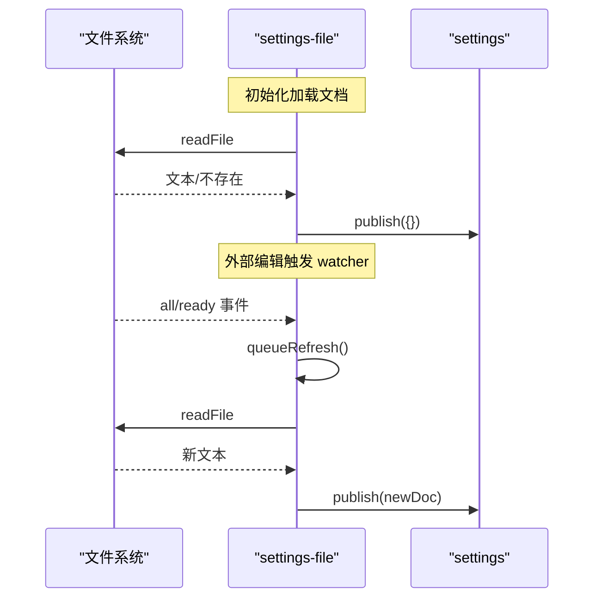
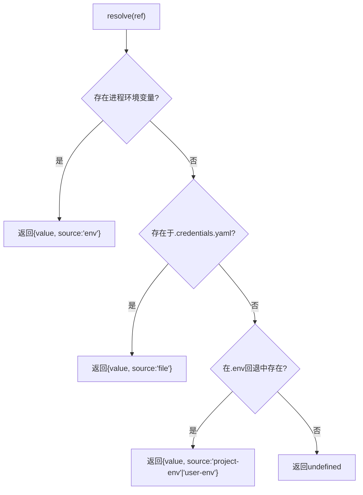
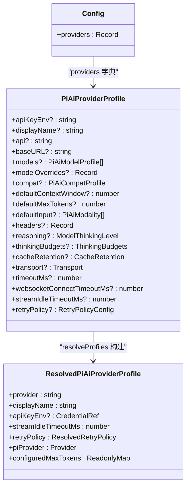
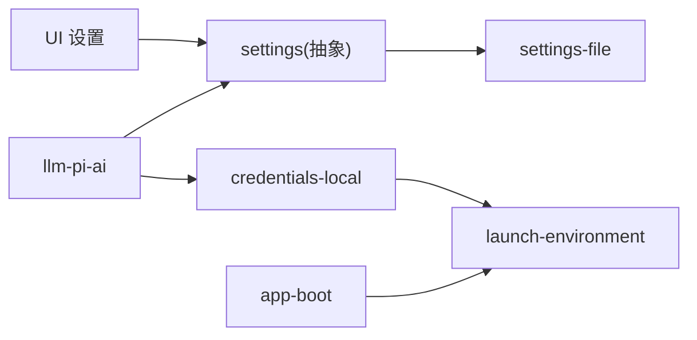

# 提供商配置管理

<cite>
**本文引用的文件**
- [packages/settings/settings/src/index.ts](file://packages/settings/settings/src/index.ts)
- [packages/settings/settings-file/src/index.ts](file://packages/settings/settings-file/src/index.ts)
- [packages/credentials/credentials-local/src/index.ts](file://packages/credentials/credentials-local/src/index.ts)
- [packages/llm/llm-pi-ai/src/config.ts](file://packages/llm/llm-pi-ai/src/config.ts)
- [packages/llm/llm-pi-ai/src/index.ts](file://packages/llm/llm-pi-ai/src/index.ts)
- [packages/client/ui-settings-models/src/client/store.ts](file://packages/client/ui-settings-models/src/client/store.ts)
- [packages/client/ui-settings/src/client/settings-scope.ts](file://packages/client/ui-settings/src/client/settings-scope.ts)
- [packages/boot/app-boot/src/index.ts](file://packages/boot/app-boot/src/index.ts)
- [packages/util/launch-environment/README.md](file://packages/util/launch-environment/README.md)
- [.agents/notes/implemented/architecture/2026-08-04-configuration-source-ownership.md](file://.agents/notes/implemented/architecture/2026-08-04-configuration-source-ownership.md)
</cite>

## 目录
1. [简介](#简介)
2. [项目结构](#项目结构)
3. [核心组件](#核心组件)
4. [架构总览](#架构总览)
5. [详细组件分析](#详细组件分析)
6. [依赖关系分析](#依赖关系分析)
7. [性能与并发特性](#性能与并发特性)
8. [故障排查指南](#故障排查指南)
9. [结论](#结论)
10. [附录：多环境配置策略与最佳实践](#附录多环境配置策略与最佳实践)

## 简介
本文件系统化说明模型提供商配置的层次结构、优先级规则、配置文件格式与语法（YAML/JSON）、环境变量映射、动态更新与热重载机制、配置验证与默认值处理，以及跨开发/测试/生产环境的配置策略。同时解释配置继承与覆盖机制，并提供最佳实践与常见问题解决方案。

## 项目结构
围绕“提供商配置”的关键实现分布在以下模块：
- 设置服务抽象与分层解析：settings
- 文件型设置存储与热重载：settings-file
- 凭据存储与环境层：credentials-local
- LLM 提供商适配器配置与注册：llm-pi-ai
- 前端设置视图与编辑：ui-settings-models、ui-settings
- 启动期环境快照与合并：app-boot、launch-environment

图表来源
- [packages/settings/settings/src/index.ts:344-512](file://packages/settings/settings/src/index.ts#L344-L512)
- [packages/settings/settings-file/src/index.ts:104-168](file://packages/settings/settings-file/src/index.ts#L104-L168)
- [packages/credentials/credentials-local/src/index.ts:207-331](file://packages/credentials/credentials-local/src/index.ts#L207-L331)
- [packages/llm/llm-pi-ai/src/config.ts:171-257](file://packages/llm/llm-pi-ai/src/config.ts#L171-L257)
- [packages/client/ui-settings-models/src/client/store.ts:22-49](file://packages/client/ui-settings-models/src/client/store.ts#L22-L49)
- [packages/client/ui-settings/src/client/settings-scope.ts:235-270](file://packages/client/ui-settings/src/client/settings-scope.ts#L235-L270)
- [packages/boot/app-boot/src/index.ts:166-191](file://packages/boot/app-boot/src/index.ts#L166-L191)
- [packages/util/launch-environment/README.md:1-19](file://packages/util/launch-environment/README.md#L1-L19)

章节来源
- [packages/settings/settings/src/index.ts:344-512](file://packages/settings/settings/src/index.ts#L344-L512)
- [packages/settings/settings-file/src/index.ts:104-168](file://packages/settings/settings-file/src/index.ts#L104-L168)
- [packages/credentials/credentials-local/src/index.ts:207-331](file://packages/credentials/credentials-local/src/index.ts#L207-L331)
- [packages/llm/llm-pi-ai/src/config.ts:171-257](file://packages/llm/llm-pi-ai/src/config.ts#L171-L257)
- [packages/client/ui-settings-models/src/client/store.ts:22-49](file://packages/client/ui-settings-models/src/client/store.ts#L22-L49)
- [packages/client/ui-settings/src/client/settings-scope.ts:235-270](file://packages/client/ui-settings/src/client/settings-scope.ts#L235-L270)
- [packages/boot/app-boot/src/index.ts:166-191](file://packages/boot/app-boot/src/index.ts#L166-L191)
- [packages/util/launch-environment/README.md:1-19](file://packages/util/launch-environment/README.md#L1-L19)

## 核心组件
- 设置服务（settings）：提供命名空间注册、分层解析（schema 默认值 → 组合 base → 用户层）、变更监听、持久化提交、冲突检测与事件发布。
- 文件设置提供者（settings-file）：以 YAML/JSON 文档承载所有命名空间段，支持外部编辑热重载、原子写入与注释保留。
- 凭据提供者（credentials-local）：基于 $DSH_HOME/.credentials.yaml 的密钥存储，结合进程环境与 .env 回退，提供只读/可写标记与热重载。
- LLM 提供商配置（llm-pi-ai）：定义 providers 字典的 schema、校验与解析，将每个 provider 路由构建为可调度的 Provider，并接入 settings 与 credentials。
- 前端设置视图（ui-settings-models / ui-settings）：读取命名空间描述、渲染提供商行、驱动编辑与提交，订阅远程设置变更。

章节来源
- [packages/settings/settings/src/index.ts:344-512](file://packages/settings/settings/src/index.ts#L344-L512)
- [packages/settings/settings-file/src/index.ts:104-168](file://packages/settings/settings-file/src/index.ts#L104-L168)
- [packages/credentials/credentials-local/src/index.ts:207-331](file://packages/credentials/credentials-local/src/index.ts#L207-L331)
- [packages/llm/llm-pi-ai/src/config.ts:171-257](file://packages/llm/llm-pi-ai/src/config.ts#L171-L257)
- [packages/client/ui-settings-models/src/client/store.ts:22-49](file://packages/client/ui-settings-models/src/client/store.ts#L22-L49)
- [packages/client/ui-settings/src/client/settings-scope.ts:235-270](file://packages/client/ui-settings/src/client/settings-scope.ts#L235-L270)

## 架构总览
下图展示从 UI 到设置服务、文件提供者、凭据提供者与 LLM 适配器的完整链路，包括热重载路径。

图表来源
- [packages/settings/settings/src/index.ts:514-648](file://packages/settings/settings/src/index.ts#L514-L648)
- [packages/settings/settings-file/src/index.ts:184-230](file://packages/settings/settings-file/src/index.ts#L184-L230)
- [packages/credentials/credentials-local/src/index.ts:309-331](file://packages/credentials/credentials-local/src/index.ts#L309-L331)
- [packages/llm/llm-pi-ai/src/config.ts:259-273](file://packages/llm/llm-pi-ai/src/config.ts#L259-L273)

## 详细组件分析

### 设置服务（settings）
- 命名空间注册：register(ns, schema, {base, applies, validate})，其中 validate 用于表达跨字段约束或运行时业务规则。
- 分层解析：resolve(schema, base, userSection) 顺序为 schema 默认值 → 组合 base → 用户层；最终 deepFreeze 保证不可变快照。
- 写入流程：update/replace/mutate 均会进行 JSON 形状校验、序列化队列、冲突检测（expectedRevision）、持久化、重解析与事件发布。
- 热重载：publish(doc) 对每个已注册命名空间重新解析，失败时保留上次有效值并告警。

图表来源
- [packages/settings/settings/src/index.ts:514-648](file://packages/settings/settings/src/index.ts#L514-L648)
- [packages/settings/settings/src/index.ts:657-684](file://packages/settings/settings/src/index.ts#L657-L684)
- [packages/settings/settings/src/index.ts:696-710](file://packages/settings/settings/src/index.ts#L696-L710)

章节来源
- [packages/settings/settings/src/index.ts:344-512](file://packages/settings/settings/src/index.ts#L344-L512)
- [packages/settings/settings/src/index.ts:514-648](file://packages/settings/settings/src/index.ts#L514-L648)
- [packages/settings/settings/src/index.ts:657-684](file://packages/settings/settings/src/index.ts#L657-L684)
- [packages/settings/settings/src/index.ts:696-710](file://packages/settings/settings/src/index.ts#L696-L710)

### 文件设置提供者（settings-file）
- 文档格式：根据扩展名选择 YAML 或 JSON；空文档视为无段。
- 热重载：使用 chokidar 监听文件变化，去抖后 reconcileFromDisk，保持最后有效快照。
- 持久化：withFileLock 原子写入，YAML 采用最小差异 patch 保留注释与锚点。
- 权限：目录与文件分别以 0700/0600 创建，保护用户私有数据。

图表来源
- [packages/settings/settings-file/src/index.ts:170-182](file://packages/settings/settings-file/src/index.ts#L170-L182)
- [packages/settings/settings-file/src/index.ts:232-269](file://packages/settings/settings-file/src/index.ts#L232-L269)
- [packages/settings/settings-file/src/index.ts:271-295](file://packages/settings/settings-file/src/index.ts#L271-L295)
- [packages/settings/settings-file/src/index.ts:304-338](file://packages/settings/settings-file/src/index.ts#L304-L338)

章节来源
- [packages/settings/settings-file/src/index.ts:20-67](file://packages/settings/settings-file/src/index.ts#L20-L67)
- [packages/settings/settings-file/src/index.ts:170-182](file://packages/settings/settings-file/src/index.ts#L170-L182)
- [packages/settings/settings-file/src/index.ts:232-269](file://packages/settings/settings-file/src/index.ts#L232-L269)
- [packages/settings/settings-file/src/index.ts:271-295](file://packages/settings/settings-file/src/index.ts#L271-L295)
- [packages/settings/settings-file/src/index.ts:304-338](file://packages/settings/settings-file/src/index.ts#L304-L338)

### 凭据提供者（credentials-local）
- 层级顺序（从高到低）：
  - 继承进程环境（只读，最高优先）
  - $DSH_HOME/.credentials.yaml（可写，受管）
  - <invocation cwd>/.env（只读回退）
  - $DSH_HOME/.env（只读回退）
- 安全：拒绝组/其他可读的文件权限；写入使用原子写与锁；删除/设置操作保留注释。
- 热重载：watcher 事件触发 refresh，reconcileFromDisk 比较并通知变更。

图表来源
- [packages/credentials/credentials-local/src/index.ts:249-263](file://packages/credentials/credentials-local/src/index.ts#L249-L263)
- [packages/credentials/credentials-local/src/index.ts:309-331](file://packages/credentials/credentials-local/src/index.ts#L309-L331)

章节来源
- [packages/credentials/credentials-local/src/index.ts:1-49](file://packages/credentials/credentials-local/src/index.ts#L1-L49)
- [packages/credentials/credentials-local/src/index.ts:207-331](file://packages/credentials/credentials-local/src/index.ts#L207-L331)
- [packages/credentials/credentials-local/src/index.ts:333-417](file://packages/credentials/credentials-local/src/index.ts#L333-L417)
- [packages/credentials/credentials-local/src/index.ts:419-493](file://packages/credentials/credentials-local/src/index.ts#L419-L493)

### LLM 提供商配置（llm-pi-ai）
- 配置结构：providers 为字典，键为路由标识；每个 profile 包含 apiKeyEnv、displayName、api、baseURL、models、modelOverrides、compat、默认上下文窗口/最大输出 token、输入模态、headers、reasoning/thinkingBudgets、cacheRetention、transport、超时、重试策略等。
- 校验与默认值：Config 使用 schemastery 定义；resolveProfiles 执行范围更广的业务校验（如非空、正数、上限），并构建 piProvider。
- 与 settings 集成：installSettingsSection 注册命名空间，validate=assertServiceable 确保可服务性；onChange 中确保注册事实与目录一致性，失败时保留上一版本继续服务。

图表来源
- [packages/llm/llm-pi-ai/src/config.ts:64-179](file://packages/llm/llm-pi-ai/src/config.ts#L64-L179)
- [packages/llm/llm-pi-ai/src/config.ts:181-257](file://packages/llm/llm-pi-ai/src/config.ts#L181-L257)
- [packages/llm/llm-pi-ai/src/config.ts:259-373](file://packages/llm/llm-pi-ai/src/config.ts#L259-L373)

章节来源
- [packages/llm/llm-pi-ai/src/config.ts:171-257](file://packages/llm/llm-pi-ai/src/config.ts#L171-L257)
- [packages/llm/llm-pi-ai/src/config.ts:259-373](file://packages/llm/llm-pi-ai/src/config.ts#L259-L373)
- [packages/llm/llm-pi-ai/src/index.ts:278-312](file://packages/llm/llm-pi-ai/src/index.ts#L278-L312)

### 前端设置视图与编辑
- store：聚合 providers 列表与其配置状态（configured/removable/apiKeyEnv/credential），暴露页面级状态。
- scope：绑定命名空间到连接失效与远程 document-updated 事件，实现跨标签页同步刷新。

章节来源
- [packages/client/ui-settings-models/src/client/store.ts:22-49](file://packages/client/ui-settings-models/src/client/store.ts#L22-L49)
- [packages/client/ui-settings/src/client/settings-scope.ts:235-270](file://packages/client/ui-settings/src/client/settings-scope.ts#L235-L270)

## 依赖关系分析
- settings 作为中心抽象，被 UI 与 LLM 适配器消费；settings-file 是其具体实现。
- credentials-local 提供凭据解析，供 LLM 适配器在请求前获取 API Key。
- app-boot 与 launch-environment 提供启动期环境快照，决定非机密值的来源层。
- llm-pi-ai 通过 settings 注册命名空间，并在 onChange 中维护路由注册与目录一致性。

图表来源
- [packages/settings/settings/src/index.ts:344-512](file://packages/settings/settings/src/index.ts#L344-L512)
- [packages/settings/settings-file/src/index.ts:104-168](file://packages/settings/settings-file/src/index.ts#L104-L168)
- [packages/credentials/credentials-local/src/index.ts:207-331](file://packages/credentials/credentials-local/src/index.ts#L207-L331)
- [packages/llm/llm-pi-ai/src/config.ts:171-257](file://packages/llm/llm-pi-ai/src/config.ts#L171-L257)
- [packages/boot/app-boot/src/index.ts:166-191](file://packages/boot/app-boot/src/index.ts#L166-L191)
- [packages/util/launch-environment/README.md:1-19](file://packages/util/launch-environment/README.md#L1-L19)

章节来源
- [packages/settings/settings/src/index.ts:344-512](file://packages/settings/settings/src/index.ts#L344-L512)
- [packages/settings/settings-file/src/index.ts:104-168](file://packages/settings/settings-file/src/index.ts#L104-L168)
- [packages/credentials/credentials-local/src/index.ts:207-331](file://packages/credentials/credentials-local/src/index.ts#L207-L331)
- [packages/llm/llm-pi-ai/src/config.ts:171-257](file://packages/llm/llm-pi-ai/src/config.ts#L171-L257)
- [packages/boot/app-boot/src/index.ts:166-191](file://packages/boot/app-boot/src/index.ts#L166-L191)
- [packages/util/launch-environment/README.md:1-19](file://packages/util/launch-environment/README.md#L1-L19)

## 性能与并发特性
- 设置写入串行化：每个命名空间有独立写队列，失败不污染后续写入；commit 时按序触发观察者回调。
- 文件 I/O 原子性与防竞态：settings-file 与 credentials-local 均使用 withFileLock 与原子写；watcher 去抖避免风暴。
- 内存快照冻结：resolved 值 deepFreeze，避免下游意外修改导致不一致。
- 热重载健壮性：reload 失败仅告警并保留最后有效快照，不会中断运行。

[本节为通用性能讨论，无需特定文件引用]

## 故障排查指南
- 配置冲突：当客户端携带 expectedRevision 与当前不一致时，会抛出 SETTINGS_CONFLICT；需重新读取最新描述后再提交。
- 无效文档：settings-file 与 credentials-local 在 reload 时若解析失败，会警告并保留上次有效快照；检查文件格式与权限。
- 凭据被覆盖：若进程环境设置了同名变量，则无法通过 .credentials.yaml 覆盖；需在启动 shell 中调整。
- 提供商不可服务：llm-pi-ai 的 assertServiceable 会在写入时拒绝不可服务的 profile；查看报错中的路由与模型信息。

章节来源
- [packages/settings/settings/src/index.ts:159-183](file://packages/settings/settings/src/index.ts#L159-L183)
- [packages/settings/settings-file/src/index.ts:298-313](file://packages/settings/settings-file/src/index.ts#L298-L313)
- [packages/credentials/credentials-local/src/index.ts:405-417](file://packages/credentials/credentials-local/src/index.ts#L405-L417)
- [packages/llm/llm-pi-ai/src/config.ts:259-273](file://packages/llm/llm-pi-ai/src/config.ts#L259-L273)

## 结论
本系统通过统一的设置服务抽象、文件型持久化与凭据管理，实现了模型提供商配置的强类型校验、分层合并、热重载与高可用保障。配合前端设置视图，可在不重启的情况下安全地增删改提供商配置，并通过严格的优先级与权限控制确保部署稳定性。

[本节为总结，无需特定文件引用]

## 附录：多环境配置策略与最佳实践

### 配置层次与优先级
- 非机密值统一顺序（从高到低）：
  - 本次运行显式覆盖（每操作覆盖、CLI 参数）
  - 用户设置（settings.yaml）
  - 组合（profile bundles、用户 patch 层、--patch overlays）
  - 本次启动的 shell 环境（inherited process environment）
  - 发现的文件（<invocation cwd>/.env，然后 $DSH_HOME/.env）
  - 默认值（schema 默认、提供商公开默认）
- 凭据独立顺序（从高到低）：
  - 继承进程环境（只读，最高优先）
  - $DSH_HOME/.credentials.yaml（可写，受管）
  - <invocation cwd>/.env
  - $DSH_HOME/.env

章节来源
- [.agents/notes/implemented/architecture/2026-08-04-configuration-source-ownership.md:17-39](file://.agents/notes/implemented/architecture/2026-08-04-configuration-source-ownership.md#L17-L39)
- [packages/util/launch-environment/README.md:1-19](file://packages/util/launch-environment/README.md#L1-L19)
- [packages/boot/app-boot/src/index.ts:166-191](file://packages/boot/app-boot/src/index.ts#L166-L191)

### 配置文件格式与语法
- 设置文档：settings.yaml 或 settings.json；YAML 支持注释与锚点，JSON 更简洁。
- 凭据文档：$DSH_HOME/.credentials.yaml，严格映射 credentialRef→字符串，禁止空值与非字符串。
- 字段校验：通过 schemastery 声明 schema，运行时 resolve 阶段进行类型与范围校验；自定义 validate 可表达跨字段约束。

章节来源
- [packages/settings/settings-file/src/index.ts:20-67](file://packages/settings/settings-file/src/index.ts#L20-L67)
- [packages/settings/settings-file/src/index.ts:271-295](file://packages/settings/settings-file/src/index.ts#L271-L295)
- [packages/credentials/credentials-local/src/index.ts:129-186](file://packages/credentials/credentials-local/src/index.ts#L129-L186)
- [packages/llm/llm-pi-ai/src/config.ts:181-257](file://packages/llm/llm-pi-ai/src/config.ts#L181-L257)

### 环境变量映射
- 非机密值：由 app-boot 加载 layered env，形成不可变快照；消费者通过 launch-environment 查询各层来源。
- 凭据：credentials-local 优先读取进程环境，其次 managed 文档，再回退到 .env；set/unset 会阻止被进程环境 shadow 的写入。

章节来源
- [packages/boot/app-boot/src/index.ts:166-191](file://packages/boot/app-boot/src/index.ts#L166-L191)
- [packages/credentials/credentials-local/src/index.ts:249-263](file://packages/credentials/credentials-local/src/index.ts#L249-L263)
- [packages/credentials/credentials-local/src/index.ts:405-417](file://packages/credentials/credentials-local/src/index.ts#L405-L417)

### 动态配置更新与热重载
- settings-file：watcher 监听文件变化，去抖后 reconcileFromDisk，publish 新文档；解析失败保留上次有效快照。
- credentials-local：watcher 监听凭据文件，refresh 后 notifyUpdated 变更项；同样保留最后有效快照。
- llm-pi-ai：settings onChange 中 ensureRegistrationFacts/ensureDirectory，失败时保留上一版本继续服务。

章节来源
- [packages/settings/settings-file/src/index.ts:232-269](file://packages/settings/settings-file/src/index.ts#L232-L269)
- [packages/settings/settings-file/src/index.ts:298-313](file://packages/settings/settings-file/src/index.ts#L298-L313)
- [packages/credentials/credentials-local/src/index.ts:265-307](file://packages/credentials/credentials-local/src/index.ts#L265-L307)
- [packages/credentials/credentials-local/src/index.ts:419-493](file://packages/credentials/credentials-local/src/index.ts#L419-L493)
- [packages/llm/llm-pi-ai/src/index.ts:278-312](file://packages/llm/llm-pi-ai/src/index.ts#L278-L312)

### 配置继承与覆盖机制
- 继承链：schema 默认值 → 组合 base → 用户层；用户层来自 settings 文档。
- 覆盖语义：update 合并 patch；replace 替换整个用户段；mutate 路径级编辑，适合持有部分视图的场景。
- 冲突检测：通过 revision 与 expectedRevision 防止并发覆盖。

章节来源
- [packages/settings/settings/src/index.ts:696-710](file://packages/settings/settings/src/index.ts#L696-L710)
- [packages/settings/settings/src/index.ts:514-648](file://packages/settings/settings/src/index.ts#L514-L648)
- [packages/settings/settings/src/index.ts:159-183](file://packages/settings/settings/src/index.ts#L159-L183)

### 多环境配置策略（开发/测试/生产）
- 开发：使用本地 settings.yaml 与 .env 快速迭代；开启 watch 与较短 debounce。
- 测试：通过 memory 或临时文件 settings 提供隔离；CI 注入进程环境变量覆盖关键值。
- 生产：锁定 composition 层与 settings 文档；凭据通过 .credentials.yaml 管理；必要时禁用 settings 提供方或使用只读挂载。

[本节为策略建议，无需特定文件引用]

### 最佳实践
- 使用 schema 明确必填与范围，利用 validate 表达跨字段约束。
- 敏感信息一律走凭据通道，避免明文进入 settings。
- 使用 replace({}) 重置用户层至组合 base；谨慎使用 update 合并。
- 在 UI 中始终携带 expectedRevision 提交，避免并发冲突。
- 对外部编辑启用 watcher，但注意 debounce 与错误恢复策略。

[本节为最佳实践建议，无需特定文件引用]