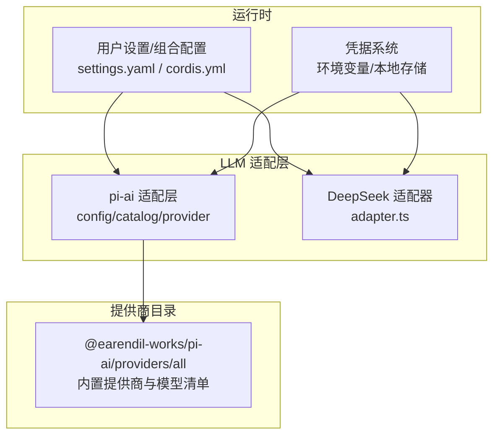
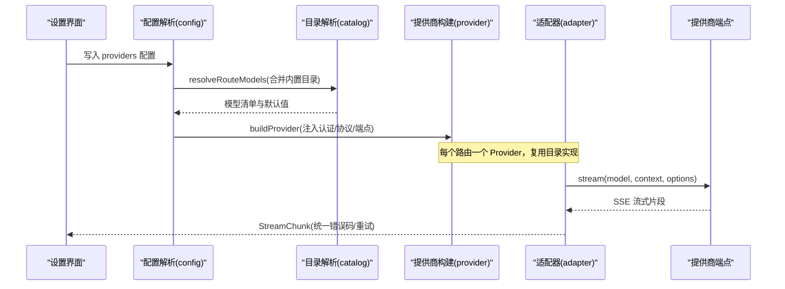
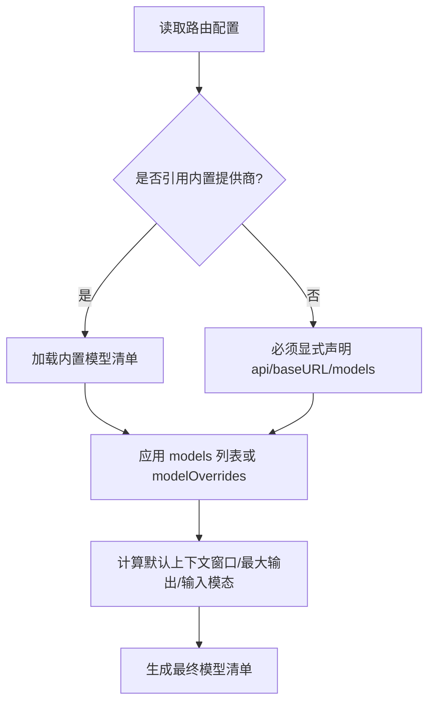
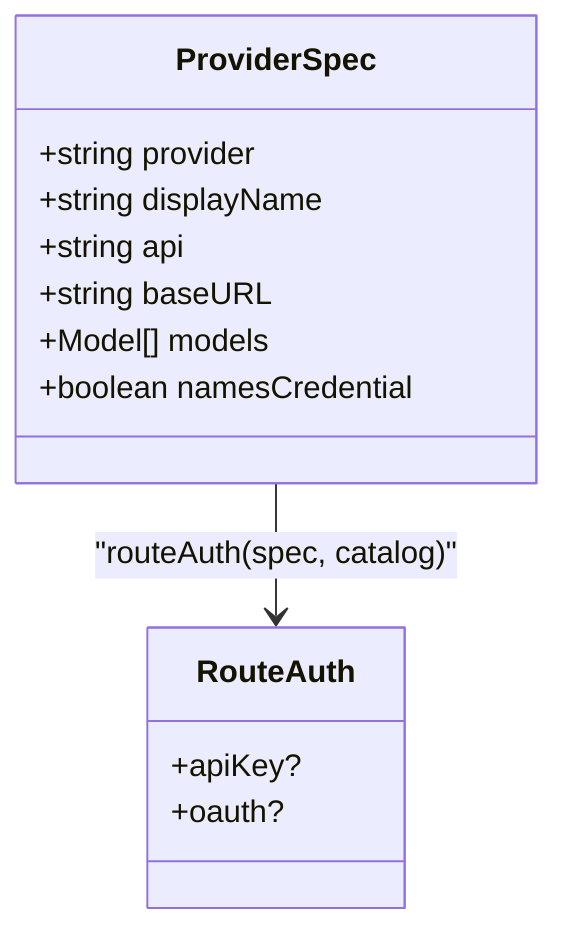
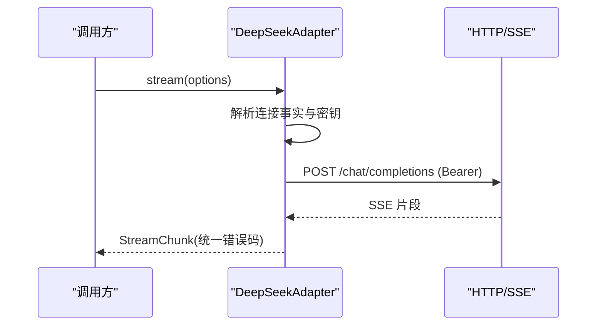
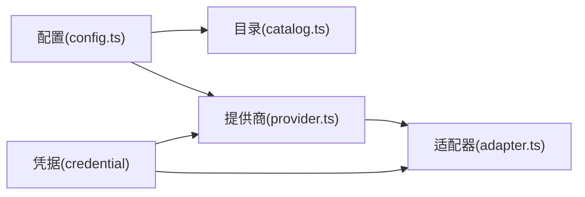

# 模型提供商集成

<cite>
**本文引用的文件**
- [packages/llm/llm-pi-ai/src/config.ts](file://packages/llm/llm-pi-ai/src/config.ts)
- [packages/llm/llm-pi-ai/src/catalog.ts](file://packages/llm/llm-pi-ai/src/catalog.ts)
- [packages/llm/llm-pi-ai/src/provider.ts](file://packages/llm/llm-pi-ai/src/provider.ts)
- [packages/llm/llm-deepseek/src/adapter.ts](file://packages/llm/llm-deepseek/src/adapter.ts)
- [packages/core/agent-default-model/src/index.ts](file://packages/core/agent-default-model/src/index.ts)
- [docs/user/guide/providers.md](file://docs/user/guide/providers.md)
- [docs/subsystems/credentials.md](file://docs/subsystems/credentials.md)
- [docs/subsystems/settings.md](file://docs/subsystems/settings.md)
- [packages/client/ui-settings-models/src/client/store.ts](file://packages/client/ui-settings-models/src/client/store.ts)
- [packages/client/ui-settings-plugins/src/client/web-search-card-controller.ts](file://packages/client/ui-settings-plugins/src/client/web-search-card-controller.ts)
- [packages/llm/llm/src/index.ts](file://packages/llm/llm/src/index.ts)
</cite>

## 目录
1. [简介](#简介)
2. [项目结构](#项目结构)
3. [核心组件](#核心组件)
4. [架构总览](#架构总览)
5. [详细组件分析](#详细组件分析)
6. [依赖关系分析](#依赖关系分析)
7. [性能与限制](#性能与限制)
8. [故障排查指南](#故障排查指南)
9. [结论](#结论)
10. [附录：配置示例与最佳实践](#附录：配置示例与最佳实践)

## 简介
本文件面向“模型提供商集成”，系统化说明支持的 LLM 提供商、连接方式、配置选项、认证方法、API 限制、提供商特定能力与兼容性要求，并提供多提供商切换与动态配置的实施方案、选择策略与路由规则，以及各提供商的实际配置示例与性能对比要点。

## 项目结构
本项目通过两套适配器实现模型接入：
- pi-ai 适配层（通用）：负责提供商目录解析、模型清单合并、协议与兼容开关、凭据注入与提供者构建。
- DeepSeek 直连适配器：针对 OpenAI 兼容的 chat-completions 端点，提供流式请求、SSE 解析与错误归一化。

图表来源
- [packages/llm/llm-pi-ai/src/config.ts:1-179](file://packages/llm/llm-pi-ai/src/config.ts#L1-L179)
- [packages/llm/llm-pi-ai/src/catalog.ts:114-173](file://packages/llm/llm-pi-ai/src/catalog.ts#L114-L173)
- [packages/llm/llm-deepseek/src/adapter.ts:43-71](file://packages/llm/llm-deepseek/src/adapter.ts#L43-L71)

章节来源
- [packages/llm/llm-pi-ai/src/config.ts:1-179](file://packages/llm/llm-pi-ai/src/config.ts#L1-L179)
- [packages/llm/llm-deepseek/src/adapter.ts:43-71](file://packages/llm/llm-deepseek/src/adapter.ts#L43-L71)

## 核心组件
- pi-ai 配置与目录解析：将用户配置与内置提供商目录合并，生成可服务的模型清单与请求默认值。
- 提供商构建与认证：为每个路由构建 pi-ai Provider，并注入 API Key 或保留原生 OAuth 发现。
- DeepSeek 适配器：对 OpenAI 兼容端点进行 SSE 流式调用，统一错误码与重试策略。
- 默认模型选择：独立于宿主与传输，持有 provider/model 选择并可叠加推理努力等级。
- 设置与凭据：用户设置与凭据分离，支持热更新；凭据按严格顺序解析，避免硬编码密钥。

章节来源
- [packages/llm/llm-pi-ai/src/config.ts:143-179](file://packages/llm/llm-pi-ai/src/config.ts#L143-L179)
- [packages/llm/llm-pi-ai/src/provider.ts:109-159](file://packages/llm/llm-pi-ai/src/provider.ts#L109-L159)
- [packages/llm/llm-deepseek/src/adapter.ts:151-212](file://packages/llm/llm-deepseek/src/adapter.ts#L151-L212)
- [packages/core/agent-default-model/src/index.ts:40-70](file://packages/core/agent-default-model/src/index.ts#L40-L70)
- [docs/subsystems/credentials.md:1-50](file://docs/subsystems/credentials.md#L1-L50)
- [docs/subsystems/settings.md:1-16](file://docs/subsystems/settings.md#L1-L16)

## 架构总览
下图展示从用户设置到具体提供商调用的完整链路，包括目录解析、认证注入、模型选择与流式响应。

图表来源
- [packages/llm/llm-pi-ai/src/config.ts:301-372](file://packages/llm/llm-pi-ai/src/config.ts#L301-L372)
- [packages/llm/llm-pi-ai/src/catalog.ts:446-546](file://packages/llm/llm-pi-ai/src/catalog.ts#L446-L546)
- [packages/llm/llm-pi-ai/src/provider.ts:137-159](file://packages/llm/llm-pi-ai/src/provider.ts#L137-L159)
- [packages/llm/llm-deepseek/src/adapter.ts:214-345](file://packages/llm/llm-deepseek/src/adapter.ts#L214-L345)

## 详细组件分析

### 提供商目录与模型清单（pi-ai catalog）
- 内置提供商索引与模型清单由 @earendil-works/pi-ai/providers/all 提供。
- 支持文本与图像两种输入模态，并通过门控类型防止漂移。
- 推理能力与推理级别映射在目录中声明，支持多种 wire 格式（如 openai/deepseek/openrouter 等）。
- 路由级与模型级覆盖：models 列表替换目录，modelOverrides 仅修改指定模型字段。
- 校验严格：缺失必填字段、重复 id、空 baseURL/api 等会在配置阶段报错，便于定位问题。

图表来源
- [packages/llm/llm-pi-ai/src/catalog.ts:114-173](file://packages/llm/llm-pi-ai/src/catalog.ts#L114-L173)
- [packages/llm/llm-pi-ai/src/catalog.ts:446-546](file://packages/llm/llm-pi-ai/src/catalog.ts#L446-L546)

章节来源
- [packages/llm/llm-pi-ai/src/catalog.ts:15-112](file://packages/llm/llm-pi-ai/src/catalog.ts#L15-L112)
- [packages/llm/llm-pi-ai/src/catalog.ts:201-269](file://packages/llm/llm-pi-ai/src/catalog.ts#L201-L269)
- [packages/llm/llm-pi-ai/src/catalog.ts:446-546](file://packages/llm/llm-pi-ai/src/catalog.ts#L446-L546)

### 提供商构建与认证（provider）
- 若路由对应内置提供商，则复用其实现以保留协议细节与原生凭据发现。
- 对于仅支持 OAuth 的提供商（如 Codex），若未配置 apiKeyEnv，则在设置页隐藏该路由，避免无法认证的无效入口。
- 若配置了 apiKeyEnv，则为路由附加 harness 的 API Key 认证方法，与原生认证并存。
- 路由级 baseUrl/displayName 与模型级 baseUrl 共同决定实际端点。

图表来源
- [packages/llm/llm-pi-ai/src/provider.ts:109-159](file://packages/llm/llm-pi-ai/src/provider.ts#L109-L159)

章节来源
- [packages/llm/llm-pi-ai/src/provider.ts:109-159](file://packages/llm/llm-pi-ai/src/provider.ts#L109-L159)

### DeepSeek 适配器（直连 OpenAI 兼容）
- 适配器只负责传输：连接事实通过回调每操作解析一次，Bearer Token 通过 per-request 解析器获取。
- 支持流式 SSE，空闲超时保护，统一错误码映射（AUTH/RATE_LIMIT/CONTEXT_WINDOW_EXCEEDED/SERVER 等）。
- 暴露模型信息、推理努力等级与默认输出上限。

图表来源
- [packages/llm/llm-deepseek/src/adapter.ts:151-212](file://packages/llm/llm-deepseek/src/adapter.ts#L151-L212)
- [packages/llm/llm-deepseek/src/adapter.ts:214-345](file://packages/llm/llm-deepseek/src/adapter.ts#L214-L345)

章节来源
- [packages/llm/llm-deepseek/src/adapter.ts:29-71](file://packages/llm/llm-deepseek/src/adapter.ts#L29-L71)
- [packages/llm/llm-deepseek/src/adapter.ts:132-149](file://packages/llm/llm-deepseek/src/adapter.ts#L132-L149)
- [packages/llm/llm-deepseek/src/adapter.ts:151-212](file://packages/llm/llm-deepseek/src/adapter.ts#L151-L212)
- [packages/llm/llm-deepseek/src/adapter.ts:214-345](file://packages/llm/llm-deepseek/src/adapter.ts#L214-L345)

### 默认模型选择与路由
- 默认模型选择独立于宿主与传输，包含 provider/model 与可选推理努力等级。
- 当保存的默认模型被删除时，界面会提示重新选择，阻止发送请求。

章节来源
- [packages/core/agent-default-model/src/index.ts:40-70](file://packages/core/agent-default-model/src/index.ts#L40-L70)

### 设置与凭据（动态配置）
- 设置（settings）与凭据（credentials）分离：设置文档持有非敏感配置，凭据通过引用（环境变量名）管理。
- 设置变更即时生效（live），无需重启；凭据每操作重解析，支持热更新。
- 设置页面提供“添加提供商/自定义提供商”表单，支持协议选择、模型发现与输入模态声明。

章节来源
- [docs/subsystems/settings.md:1-16](file://docs/subsystems/settings.md#L1-L16)
- [docs/subsystems/credentials.md:1-50](file://docs/subsystems/credentials.md#L1-L50)
- [docs/user/guide/providers.md:1-99](file://docs/user/guide/providers.md#L1-L99)
- [packages/client/ui-settings-models/src/client/store.ts:73-96](file://packages/client/ui-settings-models/src/client/store.ts#L73-L96)
- [packages/client/ui-settings-plugins/src/client/web-search-card-controller.ts:108-137](file://packages/client/ui-settings-plugins/src/client/web-search-card-controller.ts#L108-L137)

## 依赖关系分析
- 配置层依赖 schema 验证与默认值填充，确保路由可用后再构建 Provider。
- 目录层依赖内置提供商清单，保证协议、模型能力与兼容开关的一致性。
- 适配器层依赖凭据系统与超时/重试策略，保障稳定与可观测性。
- 设置与凭据解耦，避免密钥泄露与配置漂移。

图表来源
- [packages/llm/llm-pi-ai/src/config.ts:301-372](file://packages/llm/llm-pi-ai/src/config.ts#L301-L372)
- [packages/llm/llm-pi-ai/src/catalog.ts:446-546](file://packages/llm/llm-pi-ai/src/catalog.ts#L446-L546)
- [packages/llm/llm-pi-ai/src/provider.ts:109-159](file://packages/llm/llm-pi-ai/src/provider.ts#L109-L159)
- [packages/llm/llm-deepseek/src/adapter.ts:214-345](file://packages/llm/llm-deepseek/src/adapter.ts#L214-L345)

章节来源
- [packages/llm/llm-pi-ai/src/config.ts:301-372](file://packages/llm/llm-pi-ai/src/config.ts#L301-L372)
- [packages/llm/llm-pi-ai/src/catalog.ts:446-546](file://packages/llm/llm-pi-ai/src/catalog.ts#L446-L546)
- [packages/llm/llm-pi-ai/src/provider.ts:109-159](file://packages/llm/llm-pi-ai/src/provider.ts#L109-L159)
- [packages/llm/llm-deepseek/src/adapter.ts:214-345](file://packages/llm/llm-deepseek/src/adapter.ts#L214-L345)

## 性能与限制
- 流式超时保护：适配器在流读取期间启用空闲看门狗，超过阈值抛出 TIMEOUT。
- 重试策略：提供商级重试策略在配置阶段解析并绑定，避免每次请求重复计算。
- 上下文窗口与输出上限：目录与配置共同决定，未声明时使用路由默认值，避免过度猜测。
- 错误归一化：HTTP 状态与提供商错误体映射为稳定错误码，便于上层重试与告警。
- 模型发现限制：部分网关不提供 /models 接口，需手动声明模型；图像能力需显式声明 input。

章节来源
- [packages/llm/llm-deepseek/src/adapter.ts:88-97](file://packages/llm/llm-deepseek/src/adapter.ts#L88-L97)
- [packages/llm/llm-deepseek/src/adapter.ts:214-269](file://packages/llm/llm-deepseek/src/adapter.ts#L214-L269)
- [packages/llm/llm-deepseek/src/adapter.ts:132-149](file://packages/llm/llm-deepseek/src/adapter.ts#L132-L149)
- [packages/llm/llm-pi-ai/src/config.ts:34-53](file://packages/llm/llm-pi-ai/src/config.ts#L34-L53)
- [docs/user/guide/providers.md:88-99](file://docs/user/guide/providers.md#L88-L99)

## 故障排查指南
- 缺少凭据：检查 Models 页面是否已保存密钥，或环境变量是否正确设置。
- 未知模型：选择已配置的模型或在自定义提供商中添加缺失模型。
- 模型发现失败：若 /models 返回 401，检查密钥；不支持发现的网关请手动声明模型。
- 图片被拒绝：模型未声明 image 模态；为自定义提供商模型添加 input: [text, image]。
- 提供商拒绝携带图片：模型声明了 endpoint 不提供的图像能力；移除相应 input 并新建会话。
- 仅 OAuth 提供商不可用：若未配置 apiKeyEnv，设置页会隐藏该路由；如需使用，需在配置中提供密钥引用。

章节来源
- [docs/user/guide/providers.md:88-99](file://docs/user/guide/providers.md#L88-L99)
- [packages/llm/llm-pi-ai/src/provider.ts:109-159](file://packages/llm/llm-pi-ai/src/provider.ts#L109-L159)
- [packages/llm/llm/src/index.ts:119-143](file://packages/llm/llm/src/index.ts#L119-L143)

## 结论
本集成通过“目录+配置+适配器”的分层设计，实现了多提供商的统一接入与灵活扩展。pi-ai 适配层负责目录合并与认证注入，DeepSeek 适配器提供稳定的流式传输与错误归一化。设置与凭据解耦支持热更新与最小权限原则。通过严格的配置校验与清晰的错误码，部署方可快速定位问题并优化性能。

## 附录：配置示例与最佳实践
- 添加内置提供商：在设置页面选择提供商（如 Anthropic/OpenAI），填写 API Key 并保存。
- 添加自定义提供商：提供小写 Provider ID、base URL、API 协议、凭据引用与至少一个模型。
- 图像能力声明：为自定义提供商的视觉模型添加 input: [text, image]；或使用 route 级 defaultInput。
- 推理控制：为 openai-completions 模型设置 thinkingFormat 与 supportsReasoningEffort；非该协议的模型忽略这些开关。
- 默认模型选择：在 Agent 默认模型配置中指定 provider 与 model，并可叠加推理努力等级。
- 凭据管理：优先使用环境变量或本地凭据存储，避免在配置文件中硬编码密钥。

章节来源
- [docs/user/guide/providers.md:15-99](file://docs/user/guide/providers.md#L15-L99)
- [packages/core/agent-default-model/src/index.ts:40-70](file://packages/core/agent-default-model/src/index.ts#L40-L70)
- [docs/subsystems/credentials.md:1-50](file://docs/subsystems/credentials.md#L1-L50)
- [packages/llm/llm-pi-ai/src/config.ts:64-141](file://packages/llm/llm-pi-ai/src/config.ts#L64-L141)
- [packages/llm/llm-pi-ai/src/catalog.ts:185-238](file://packages/llm/llm-pi-ai/src/catalog.ts#L185-L238)