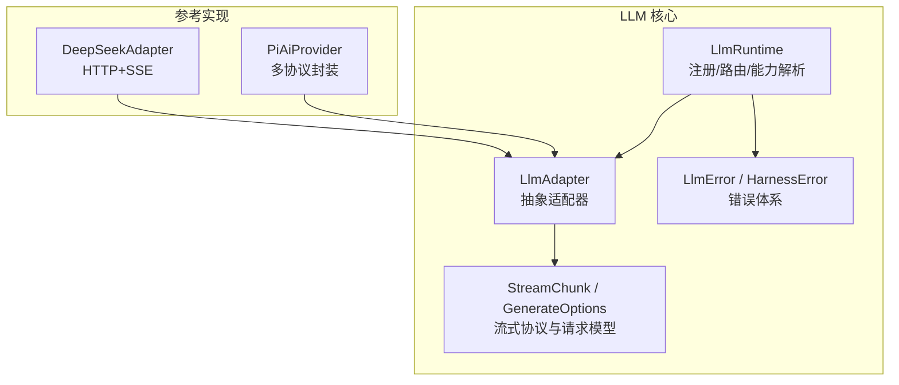
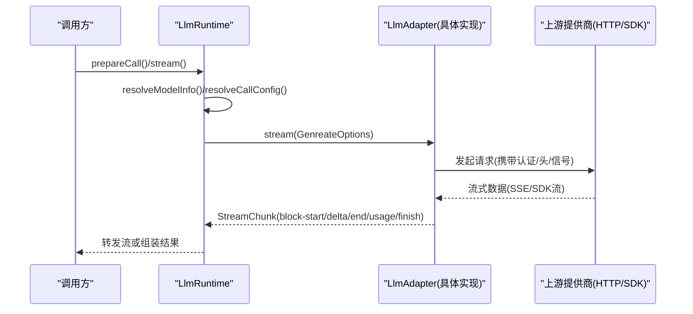
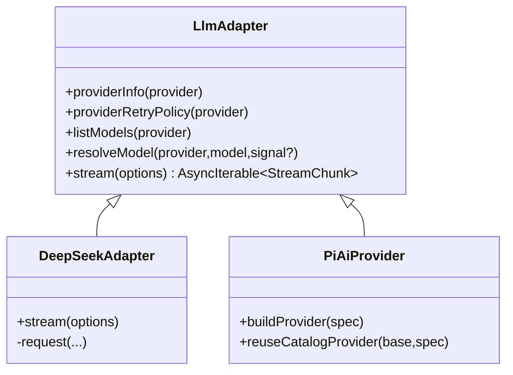
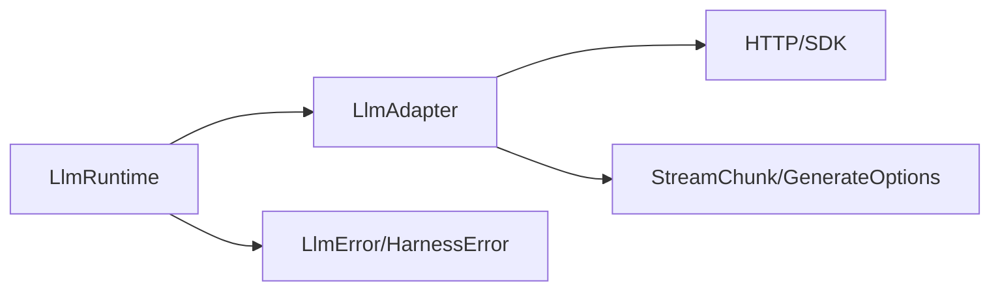

# 自定义提供商开发

<cite>
**本文引用的文件**
- [packages/llm/llm/src/types.ts](file://packages/llm/llm/src/types.ts)
- [packages/llm/llm/src/index.ts](file://packages/llm/llm/src/index.ts)
- [packages/llm/llm/src/error.ts](file://packages/llm/llm/src/error.ts)
- [packages/llm/llm-deepseek/src/adapter.ts](file://packages/llm/llm-deepseek/src/adapter.ts)
- [packages/llm/llm-deepseek/src/index.ts](file://packages/llm/llm-deepseek/src/index.ts)
- [packages/llm/llm-pi-ai/src/provider.ts](file://packages/llm/llm-pi-ai/src/provider.ts)
- [packages/llm/llm-pi-ai/src/index.ts](file://packages/llm/llm-pi-ai/src/index.ts)
- [docs/cookbook/adding-an-llm-adapter.md](file://docs/cookbook/adding-an-llm-adapter.md)
</cite>

## 目录
1. [简介](#简介)
2. [项目结构](#项目结构)
3. [核心组件](#核心组件)
4. [架构总览](#架构总览)
5. [详细组件分析](#详细组件分析)
6. [依赖关系分析](#依赖关系分析)
7. [性能考虑](#性能考虑)
8. [故障排查指南](#故障排查指南)
9. [结论](#结论)
10. [附录：自定义提供商开发示例与测试要点](#附录：自定义提供商开发示例与测试要点)

## 简介
本文件面向希望为 DeepSeek Harness 实现“自定义 LLM 提供商”的开发者，系统说明提供商接口的实现要求、适配器模式与生命周期管理、消息格式转换与响应处理机制、认证集成与错误处理规范、提供商注册与发现机制，以及性能优化与调试技巧。文档同时提供基于仓库中现有实现的参考路径与图示，帮助快速落地一个稳定、可维护、可扩展的自定义提供商插件。

## 项目结构
围绕 LLM 子系统的关键代码位于 packages/llm 下：
- llm：抽象接口、运行时服务、类型定义、错误体系、重试策略等
- llm-deepseek：直接 HTTP + SSE 的参考实现（DeepSeek OpenAI 兼容）
- llm-pi-ai：封装第三方 SDK 的通用适配插件（支持多种协议）
- token-meter：令牌用量统计（可选）
- docs/cookbook：官方“添加 LLM 适配器”指南

图表来源
- [packages/llm/llm/src/index.ts:175-233](file://packages/llm/llm/src/index.ts#L175-L233)
- [packages/llm/llm/src/types.ts:283-357](file://packages/llm/llm/src/types.ts#L283-L357)
- [packages/llm/llm/src/error.ts:13-22](file://packages/llm/llm/src/error.ts#L13-L22)
- [packages/llm/llm-deepseek/src/adapter.ts:151-169](file://packages/llm/llm-deepseek/src/adapter.ts#L151-L169)
- [packages/llm/llm-pi-ai/src/provider.ts:167-193](file://packages/llm/llm-pi-ai/src/provider.ts#L167-L193)

章节来源
- [packages/llm/llm/src/index.ts:175-233](file://packages/llm/llm/src/index.ts#L175-L233)
- [packages/llm/llm/src/types.ts:283-357](file://packages/llm/llm/src/types.ts#L283-L357)
- [packages/llm/llm/src/error.ts:13-22](file://packages/llm/llm/src/error.ts#L13-L22)
- [packages/llm/llm-deepseek/src/adapter.ts:151-169](file://packages/llm/llm-deepseek/src/adapter.ts#L151-L169)
- [packages/llm/llm-pi-ai/src/provider.ts:167-193](file://packages/llm/llm-pi-ai/src/provider.ts#L167-L193)

## 核心组件
- LlmAdapter：抽象适配器基类，要求实现 stream(options) 并可选择性实现 providerInfo、providerRetryPolicy、listModels、resolveModel。
- LlmRuntime：运行时服务，负责适配器注册、配置化提供商目录、模型发现、能力解析、调用准备与拦截（waterfall）。
- StreamChunk：流式协议的核心数据结构，包含块开始、增量、结束、用量、完成等事件。
- GenerateOptions：一次模型调用的完整输入，包括 provider、model、messages、tools、信号、会话标识等。
- LlmError/HarnessError：统一错误码与结构化失败信息，便于重试与诊断。

章节来源
- [packages/llm/llm/src/index.ts:175-233](file://packages/llm/llm/src/index.ts#L175-L233)
- [packages/llm/llm/src/index.ts:284-568](file://packages/llm/llm/src/index.ts#L284-L568)
- [packages/llm/llm/src/types.ts:283-357](file://packages/llm/llm/src/types.ts#L283-L357)
- [packages/llm/llm/src/error.ts:13-22](file://packages/llm/llm/src/error.ts#L13-L22)

## 架构总览
下图展示了从上层调用到适配器流式响应的端到端流程，以及适配器如何遵守统一的流式协议。

图表来源
- [packages/llm/llm/src/index.ts:779-800](file://packages/llm/llm/src/index.ts#L779-L800)
- [packages/llm/llm-deepseek/src/adapter.ts:214-269](file://packages/llm/llm-deepseek/src/adapter.ts#L214-L269)
- [packages/llm/llm-deepseek/src/adapter.ts:271-345](file://packages/llm/llm-deepseek/src/adapter.ts#L271-L345)

## 详细组件分析

### 适配器接口与生命周期
- 必须实现：stream(options)
- 可选扩展：
  - providerInfo(provider)：声明提供商显示信息
  - providerRetryPolicy(provider)：返回该提供商的重试策略
  - listModels(provider)：列出可发现的模型（建议性）
  - resolveModel(provider, model, signal?)：精确模型的上下文窗口、默认 maxTokens、推理努力级别等元数据

生命周期要点：
- registerAdapter(providers, adapter) 会校验并原子提交路由；支持 replace() 在同一实例上替换路由集合
- registerConfigurableProviders(entries) 声明可配置的提供商目录，供 UI 展示与编辑
- registerModelDiscovery(ns, discover) 暴露模型发现能力，供配置界面探测远端端点

章节来源
- [packages/llm/llm/src/index.ts:175-233](file://packages/llm/llm/src/index.ts#L175-L233)
- [packages/llm/llm/src/index.ts:330-421](file://packages/llm/llm/src/index.ts#L330-L421)
- [packages/llm/llm/src/index.ts:423-568](file://packages/llm/llm/src/index.ts#L423-L568)

### 流式协议与消息转换
- StreamChunk 是适配器与宿主之间的契约：
  - block-start：新块开始，分配 index
  - text-delta/reasoning-delta/tool-call-delta：增量内容
  - block-end：块结束，附带已组装的 ContentBlock
  - usage：用量统计（必须在 finish 之前）
  - finish：完成原因（stop/tool-calls/max-tokens/error/aborted），可携带 replayState
- 工具调用参数必须以原始 JSON 字符串形式传递，增量以 argumentsDelta 发送
- 错误两种合法路径：抛出 LlmError（传输/协议失败）或在流末尾以 finish{kind:'error'|'aborted'} 上报（提供商内联失败）
- 必须尊重 options.signal 进行取消

章节来源
- [packages/llm/llm/src/types.ts:283-357](file://packages/llm/llm/src/types.ts#L283-L357)
- [docs/cookbook/adding-an-llm-adapter.md:25-36](file://docs/cookbook/adding-an-llm-adapter.md#L25-L36)

### 认证集成
- 密钥通过凭证服务或环境变量按需提供，适配器不应硬编码密钥
- 参考实现：
  - DeepSeek：在 apply 中通过 credentials 或环境解析 API Key，并在每次请求时注入 Authorization 头
  - pi-ai：通过 ProviderSpec 的 auth 钩子注入 apiKey，或由底层 provider 自行发现
- 使用 assertUsableApiKey 对密钥做基本校验，避免非法字符进入请求头

章节来源
- [packages/llm/llm-deepseek/src/index.ts:200-277](file://packages/llm/llm-deepseek/src/index.ts#L200-L277)
- [packages/llm/llm-pi-ai/src/provider.ts:77-135](file://packages/llm/llm-pi-ai/src/provider.ts#L77-L135)
- [packages/llm/llm/src/index.ts:119-152](file://packages/llm/llm/src/index.ts#L119-L152)

### 错误处理规范
- 统一使用 LlmError，携带稳定的 code（如 AUTH、RATE_LIMIT、CONTEXT_WINDOW_EXCEEDED、QUOTA、EMPTY_RESPONSE、INVALID_CREDENTIAL 等）
- 将 HTTP 状态映射为稳定错误码，提取 provider 提供的 retry-after、request-id 等结构化信息
- 空响应（无内容块）归类为 EMPTY_RESPONSE，以便重试策略安全重试
- 上下文超限识别：根据供应商消息文本匹配上下文溢出语义

章节来源
- [packages/llm/llm/src/error.ts:24-100](file://packages/llm/llm/src/error.ts#L24-L100)
- [packages/llm/llm-deepseek/src/adapter.ts:138-149](file://packages/llm/llm-deepseek/src/adapter.ts#L138-L149)
- [packages/llm/llm-deepseek/src/adapter.ts:321-345](file://packages/llm/llm-deepseek/src/adapter.ts#L321-L345)

### 提供商注册与发现
- 注册适配器：ctx.llm.registerAdapter(['my-provider'], new MyAdapter(...))
- 声明可配置提供商目录：ctx.llm.registerConfigurableProviders([...])
- 模型发现：ctx.llm.registerModelDiscovery(settingsNs, discover)
- 动态更新：通过 registration.replace() 或 directory.replace() 原子替换，保证无间隙切换

章节来源
- [packages/llm/llm/src/index.ts:330-421](file://packages/llm/llm/src/index.ts#L330-L421)
- [packages/llm/llm/src/index.ts:423-568](file://packages/llm/llm/src/index.ts#L423-L568)
- [packages/llm/llm-deepseek/src/index.ts:200-277](file://packages/llm/llm-deepseek/src/index.ts#L200-L277)
- [packages/llm/llm-pi-ai/src/index.ts:149-313](file://packages/llm/llm-pi-ai/src/index.ts#L149-L313)

### 参考实现对比
- DeepSeek 适配器：直接 HTTP + SSE，逐条解析事件并转换为 StreamChunk，严格遵循协议顺序与错误分类
- pi-ai 适配器：封装第三方 SDK，通过 ProviderSpec 与协议表组合不同后端，复用安装目录中的 Provider 实现

图表来源
- [packages/llm/llm/src/index.ts:175-233](file://packages/llm/llm/src/index.ts#L175-L233)
- [packages/llm/llm-deepseek/src/adapter.ts:151-169](file://packages/llm/llm-deepseek/src/adapter.ts#L151-L169)
- [packages/llm/llm-pi-ai/src/provider.ts:144-193](file://packages/llm/llm-pi-ai/src/provider.ts#L144-L193)

## 依赖关系分析
- LlmRuntime 依赖 LlmAdapter 抽象，解耦具体提供商实现
- 适配器依赖外部网络/SDK，但通过 options.signal 与超时控制保持可控
- 错误体系集中管理，便于跨层诊断与重试决策
- 配置与凭证通过 Cordis 生态注入，避免耦合

图表来源
- [packages/llm/llm/src/index.ts:284-568](file://packages/llm/llm/src/index.ts#L284-L568)
- [packages/llm/llm/src/types.ts:283-357](file://packages/llm/llm/src/types.ts#L283-L357)
- [packages/llm/llm/src/error.ts:13-22](file://packages/llm/llm/src/error.ts#L13-L22)

## 性能考虑
- 流式优先：尽量以增量方式输出，减少内存占用与首字节延迟
- 空闲超时：为长连接设置合理的 idle timeout，避免僵尸流
- 重试策略：结合 provider 返回的 retry-after 与错误码，合理配置指数退避
- 资源释放：确保 AbortController/AbortSignal 正确传播，及时关闭流
- 缓存与去重：模型列表与能力解析结果可缓存，避免重复网络开销
- 头部与追踪：加入 attributionHeaders 与用户/会话标识，便于问题定位

[本节为通用指导，不直接分析具体文件]

## 故障排查指南
- 认证失败：检查密钥是否通过凭证服务或环境变量正确注入，并使用 assertUsableApiKey 验证
- 上下文超限：识别上下文溢出错误码，调整消息长度或启用压缩/摘要
- 配额耗尽：区分 RATE_LIMIT 与 QUOTA，前者可重试，后者需提示用户充值
- 空响应：EMPTY_RESPONSE 属于可重试场景，检查上游是否返回了无内容的终止
- 流中断：确认 options.signal 是否正确传递，检查超时与取消逻辑
- 调试技巧：
  - 打印 StreamChunk 序列，验证 block-start/delta/end/usage/finish 的顺序与完整性
  - 记录 request-id 与 retry-after，辅助定位上游问题
  - 使用 errorChain 渲染完整的 cause 链，便于日志与 UI 展示

章节来源
- [packages/llm/llm/src/error.ts:24-100](file://packages/llm/llm/src/error.ts#L24-L100)
- [packages/llm/llm-deepseek/src/adapter.ts:321-345](file://packages/llm/llm-deepseek/src/adapter.ts#L321-L345)
- [packages/llm/llm/src/index.ts:119-152](file://packages/llm/llm/src/index.ts#L119-L152)

## 结论
通过 LlmAdapter 抽象与 LlmRuntime 服务，DeepSeek Harness 提供了稳定、可扩展的 LLM 提供商接入方案。遵循统一的流式协议、错误码与认证规范，开发者可以以最小成本实现自定义提供商，并通过注册与发现机制无缝集成到系统中。参考实现（DeepSeek/pi-ai）展示了两种典型路径：直接 HTTP+SSE 与 SDK 封装，均具备良好的可维护性与可观测性。

[本节为总结，不直接分析具体文件]

## 附录：自定义提供商开发示例与测试要点

### 示例：实现一个自定义适配器
- 步骤概览：
  - 继承 LlmAdapter，实现 stream(options)
  - 按需实现 providerInfo、providerRetryPolicy、listModels、resolveModel
  - 在插件 apply 中注册适配器与可配置提供商目录
  - 通过凭证服务或环境变量注入密钥
  - 遵循 StreamChunk 协议，正确处理 usage 与 finish
  - 使用 LlmError 上报错误，携带稳定 code 与结构化信息

参考路径
- 适配器基类与运行时：[packages/llm/llm/src/index.ts:175-233](file://packages/llm/llm/src/index.ts#L175-L233)
- 流式协议与类型：[packages/llm/llm/src/types.ts:283-357](file://packages/llm/llm/src/types.ts#L283-L357)
- 错误体系：[packages/llm/llm/src/error.ts:13-22](file://packages/llm/llm/src/error.ts#L13-L22)
- 参考实现（DeepSeek）：[packages/llm/llm-deepseek/src/adapter.ts:151-169](file://packages/llm/llm-deepseek/src/adapter.ts#L151-L169)
- 参考实现（pi-ai 提供者构建）：[packages/llm/llm-pi-ai/src/provider.ts:167-193](file://packages/llm/llm-pi-ai/src/provider.ts#L167-L193)
- 官方指南：[docs/cookbook/adding-an-llm-adapter.md:7-23](file://docs/cookbook/adding-an-llm-adapter.md#L7-L23)

### 测试要点
- 流式协议合规性：验证 block-start/delta/end/usage/finish 的顺序与完整性
- 工具调用参数：确保 arguments 为原始 JSON 字符串，argumentsDelta 拼接后一致
- 错误路径：覆盖 throw LlmError 与 finish{kind:'error'|'aborted'} 两条路径
- 取消与超时：验证 options.signal 与 idle timeout 的行为
- 重试策略：结合错误码与 retry-after 验证重试行为
- 注册与发现：验证 registerAdapter/registerConfigurableProviders/registerModelDiscovery 的原子性与可替换性

参考路径
- 流式协议约定：[docs/cookbook/adding-an-llm-adapter.md:25-36](file://docs/cookbook/adding-an-llm-adapter.md#L25-L36)
- 适配器注册与替换：[packages/llm/llm/src/index.ts:330-421](file://packages/llm/llm/src/index.ts#L330-L421)
- 模型发现：[packages/llm/llm/src/index.ts:494-568](file://packages/llm/llm/src/index.ts#L494-L568)