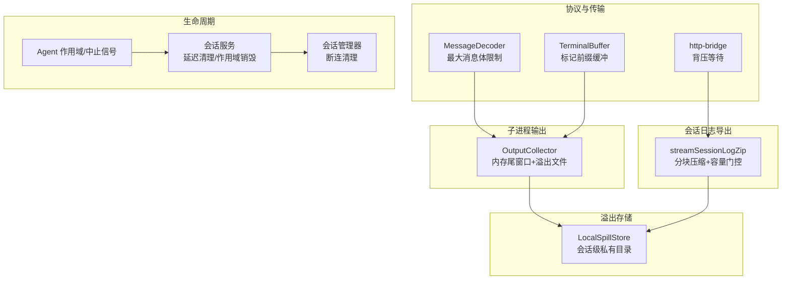
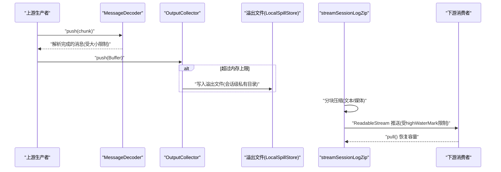
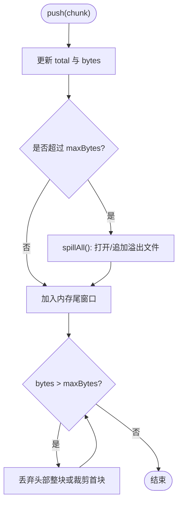
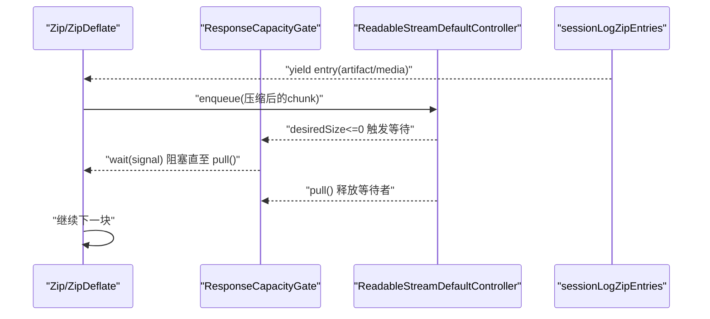
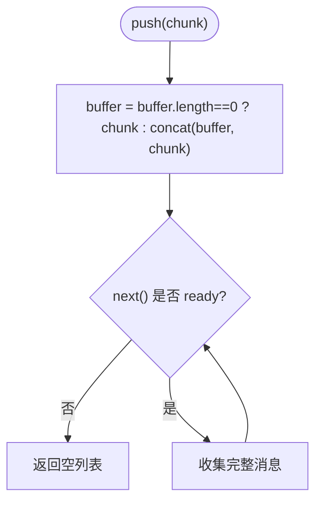
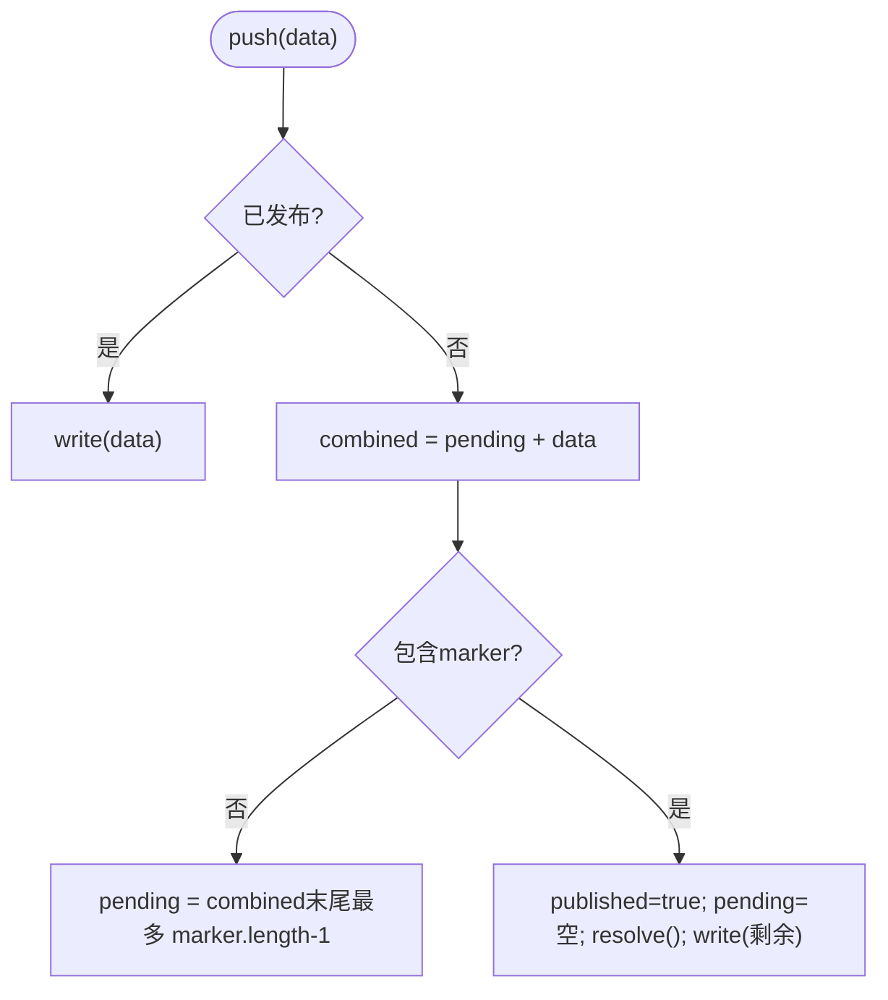
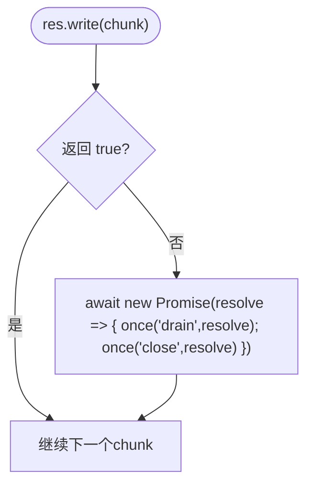
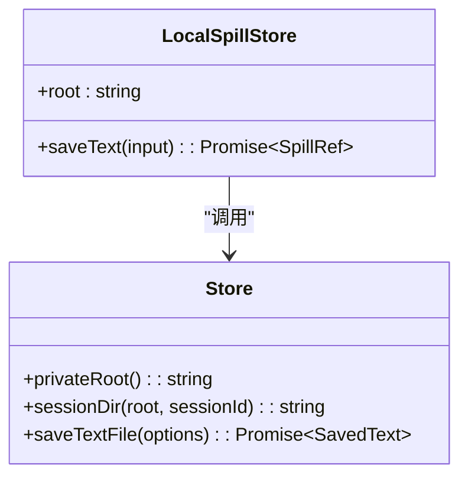
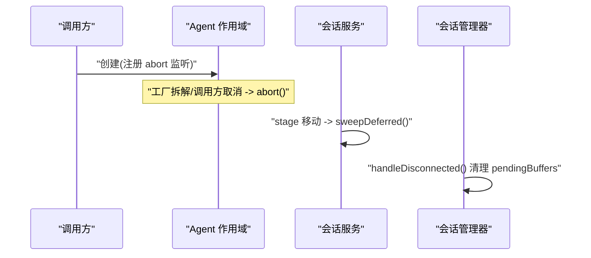
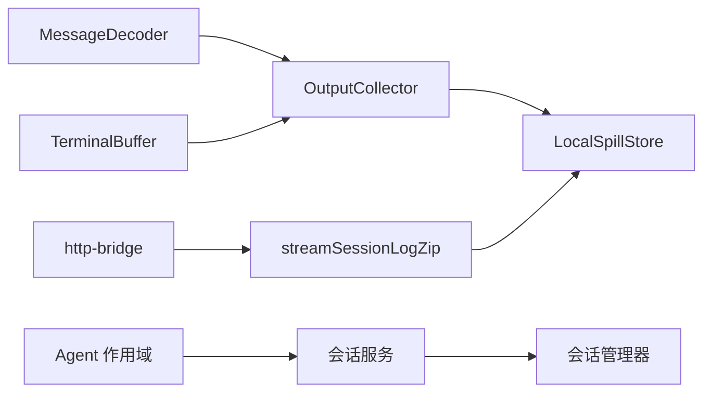

# 内存管理与优化

<cite>
**本文引用的文件**
- [packages/subprocess/subprocess-local/src/spawn.ts](file://packages/subprocess/subprocess-local/src/spawn.ts)
- [packages/host/apiproxy/src/session-export.ts](file://packages/host/apiproxy/src/session-export.ts)
- [packages/lsp/lsp-stdio/src/framing.ts](file://packages/lsp/lsp-stdio/src/framing.ts)
- [packages/e2b/subprocess-e2b/src/terminal.ts](file://packages/e2b/subprocess-e2b/src/terminal.ts)
- [packages/client/connection/src/http-bridge.ts](file://packages/client/connection/src/http-bridge.ts)
- [packages/spill/spill-local/src/index.ts](file://packages/spill/spill-local/src/index.ts)
- [packages/spill/spill-local/src/store.ts](file://packages/spill/spill-local/src/store.ts)
- [packages/core/agent-loop/src/index.ts](file://packages/core/agent-loop/src/index.ts)
- [packages/client/runtime/src/client/sessions/service.ts](file://packages/client/runtime/src/client/sessions/service.ts)
- [packages/client/runtime/src/client/sessions/manager.ts](file://packages/client/runtime/src/client/sessions/manager.ts)
- [apps/web/tests/complex-history.perf.ts](file://apps/web/tests/complex-history.perf.ts)
</cite>

## 目录
1. [简介](#简介)
2. [项目结构](#项目结构)
3. [核心组件](#核心组件)
4. [架构总览](#架构总览)
5. [详细组件分析](#详细组件分析)
6. [依赖关系分析](#依赖关系分析)
7. [性能考量](#性能考量)
8. [故障排查指南](#故障排查指南)
9. [结论](#结论)
10. [附录](#附录)

## 简介
本文件聚焦于流式响应与大数据量处理中的内存管理与优化，覆盖以下主题：
- 动态缓冲区分配与回退策略（内存尾窗口 + 溢出转储）
- 内存池与对象复用模式（以固定大小分块、缓冲拼接为例）
- 垃圾回收友好实践（不可变结果、及时释放引用、避免长生命周期闭包）
- 大数据场景下的内存泄漏防护（对象生命周期管理、引用清理、资源释放）
- 内存监控与性能分析技巧（指标采集、压测与回归）
- 实际优化案例与最佳实践（常见内存问题的诊断与解决）

## 项目结构
本项目在多处实现了面向流式数据的内存安全设计：
- 子进程输出收集：按最大内存保留尾部，溢出时写入临时文件，读取支持增量定位。
- 会话日志导出：ZIP 流式压缩，按固定大小推送文本与媒体，受控于消费者拉取能力。
- LSP 消息帧解析：限制单条消息体大小，防止超大负载撑爆内存。
- 终端标记缓冲：合并小块数据并维护最小前缀，避免无界增长。
- HTTP 桥接写回压：基于背压等待，避免积压导致内存暴涨。
- 溢出存储：会话级私有目录、随机文件名、独占写入，保障安全与可检索性。
- 会话与连接生命周期：断连清理、延迟清理、作用域销毁，避免悬挂引用。

图表来源
- [packages/subprocess/subprocess-local/src/spawn.ts:104-251](file://packages/subprocess/subprocess-local/src/spawn.ts#L104-L251)
- [packages/host/apiproxy/src/session-export.ts:268-458](file://packages/host/apiproxy/src/session-export.ts#L268-L458)
- [packages/lsp/lsp-stdio/src/framing.ts:34-56](file://packages/lsp/lsp-stdio/src/framing.ts#L34-L56)
- [packages/e2b/subprocess-e2b/src/terminal.ts:61-89](file://packages/e2b/subprocess-e2b/src/terminal.ts#L61-L89)
- [packages/client/connection/src/http-bridge.ts:84-99](file://packages/client/connection/src/http-bridge.ts#L84-L99)
- [packages/spill/spill-local/src/index.ts:37-63](file://packages/spill/spill-local/src/index.ts#L37-L63)
- [packages/core/agent-loop/src/index.ts:474-487](file://packages/core/agent-loop/src/index.ts#L474-L487)
- [packages/client/runtime/src/client/sessions/service.ts:768-791](file://packages/client/runtime/src/client/sessions/service.ts#L768-L791)
- [packages/client/runtime/src/client/sessions/manager.ts:878-899](file://packages/client/runtime/src/client/sessions/manager.ts#L878-L899)

章节来源
- [packages/subprocess/subprocess-local/src/spawn.ts:104-251](file://packages/subprocess/subprocess-local/src/spawn.ts#L104-L251)
- [packages/host/apiproxy/src/session-export.ts:268-458](file://packages/host/apiproxy/src/session-export.ts#L268-L458)
- [packages/lsp/lsp-stdio/src/framing.ts:34-56](file://packages/lsp/lsp-stdio/src/framing.ts#L34-L56)
- [packages/e2b/subprocess-e2b/src/terminal.ts:61-89](file://packages/e2b/subprocess-e2b/src/terminal.ts#L61-L89)
- [packages/client/connection/src/http-bridge.ts:84-99](file://packages/client/connection/src/http-bridge.ts#L84-L99)
- [packages/spill/spill-local/src/index.ts:37-63](file://packages/spill/spill-local/src/index.ts#L37-L63)
- [packages/core/agent-loop/src/index.ts:474-487](file://packages/core/agent-loop/src/index.ts#L474-L487)
- [packages/client/runtime/src/client/sessions/service.ts:768-791](file://packages/client/runtime/src/client/sessions/service.ts#L768-L791)
- [packages/client/runtime/src/client/sessions/manager.ts:878-899](file://packages/client/runtime/src/client/sessions/manager.ts#L878-L899)

## 核心组件
- OutputCollector：子进程 stdout/stderr 的有界内存尾窗口 + 溢出文件；支持增量读取与丢失标记。
- streamSessionLogZip：会话日志 ZIP 流式导出，文本与媒体分块推送，受 ResponseCapacityGate 控制。
- MessageDecoder：LSP 消息帧解析器，限制单条消息体大小，拒绝超大负载。
- TerminalBuffer：终端输出缓冲，维护标记前缀的最小保留，避免无界累积。
- http-bridge 写回压：当响应队列满时等待 drain/close，避免积压。
- LocalSpillStore：会话级私有目录、随机文件名、独占写入，提供溢出文本持久化与检索提示。
- Agent 作用域与中止信号：在创建阶段注册清理，确保异常路径不泄露。
- 会话服务与管理器：延迟清理与断连清理，避免悬挂状态与缓冲残留。

章节来源
- [packages/subprocess/subprocess-local/src/spawn.ts:104-251](file://packages/subprocess/subprocess-local/src/spawn.ts#L104-L251)
- [packages/host/apiproxy/src/session-export.ts:268-458](file://packages/host/apiproxy/src/session-export.ts#L268-L458)
- [packages/lsp/lsp-stdio/src/framing.ts:34-56](file://packages/lsp/lsp-stdio/src/framing.ts#L34-L56)
- [packages/e2b/subprocess-e2b/src/terminal.ts:61-89](file://packages/e2b/subprocess-e2b/src/terminal.ts#L61-L89)
- [packages/client/connection/src/http-bridge.ts:84-99](file://packages/client/connection/src/http-bridge.ts#L84-L99)
- [packages/spill/spill-local/src/index.ts:37-63](file://packages/spill/spill-local/src/index.ts#L37-L63)
- [packages/core/agent-loop/src/index.ts:474-487](file://packages/core/agent-loop/src/index.ts#L474-L487)
- [packages/client/runtime/src/client/sessions/service.ts:768-791](file://packages/client/runtime/src/client/sessions/service.ts#L768-L791)
- [packages/client/runtime/src/client/sessions/manager.ts:878-899](file://packages/client/runtime/src/client/sessions/manager.ts#L878-L899)

## 架构总览
下图展示了从输入到输出的内存安全路径：协议层限制消息体大小，子进程输出通过有界尾窗口与溢出文件控制内存峰值，会话日志导出使用分块压缩与容量门控，所有资源均受作用域与中止信号约束。

图表来源
- [packages/lsp/lsp-stdio/src/framing.ts:34-56](file://packages/lsp/lsp-stdio/src/framing.ts#L34-L56)
- [packages/subprocess/subprocess-local/src/spawn.ts:104-251](file://packages/subprocess/subprocess-local/src/spawn.ts#L104-L251)
- [packages/host/apiproxy/src/session-export.ts:268-458](file://packages/host/apiproxy/src/session-export.ts#L268-L458)
- [packages/spill/spill-local/src/index.ts:37-63](file://packages/spill/spill-local/src/index.ts#L37-L63)

## 详细组件分析

### 子进程输出收集：OutputCollector
- 内存模型：维护 chunks 数组与累计字节数，保持最近 maxBytes 的尾部。
- 溢出策略：首次超限时打开临时文件，将历史与后续数据追加写入；达到 maxSpillBytes 后停止转储并清理。
- 读取语义：支持从任意字节偏移读取，若已滑出内存窗口则返回 lossy 标志并提供 spillPath。
- 资源释放：seal() 关闭文件句柄，finalize() 返回最终文本与截断标记。

图表来源
- [packages/subprocess/subprocess-local/src/spawn.ts:123-153](file://packages/subprocess/subprocess-local/src/spawn.ts#L123-L153)
- [packages/subprocess/subprocess-local/src/spawn.ts:155-197](file://packages/subprocess/subprocess-local/src/spawn.ts#L155-L197)
- [packages/subprocess/subprocess-local/src/spawn.ts:207-251](file://packages/subprocess/subprocess-local/src/spawn.ts#L207-L251)

章节来源
- [packages/subprocess/subprocess-local/src/spawn.ts:104-251](file://packages/subprocess/subprocess-local/src/spawn.ts#L104-L251)

### 会话日志导出：streamSessionLogZip
- 分块编码：文本按代码单元分块，媒体按字节分块，避免一次性加载大对象。
- 容量门控：ResponseCapacityGate 在 ReadableStream 队列满时暂停生产，直到消费者 pull 释放空间。
- 高水位：highWaterMark 限制响应队列大小，结合 size 函数按字节计数。
- 取消与终止：producerSignal 聚合请求与消费者取消，错误路径立即终止压缩器，避免半归档。

图表来源
- [packages/host/apiproxy/src/session-export.ts:268-308](file://packages/host/apiproxy/src/session-export.ts#L268-L308)
- [packages/host/apiproxy/src/session-export.ts:319-371](file://packages/host/apiproxy/src/session-export.ts#L319-L371)
- [packages/host/apiproxy/src/session-export.ts:388-458](file://packages/host/apiproxy/src/session-export.ts#L388-L458)

章节来源
- [packages/host/apiproxy/src/session-export.ts:268-458](file://packages/host/apiproxy/src/session-export.ts#L268-L458)

### LSP 消息帧解析：MessageDecoder
- 单消息体大小限制：构造时传入 maxMessageBytes，超出即抛出错误，防止恶意或异常大包。
- 分片重组：支持跨 chunk 的 header/body 重组，保证完整性。

图表来源
- [packages/lsp/lsp-stdio/src/framing.ts:34-56](file://packages/lsp/lsp-stdio/src/framing.ts#L34-L56)

章节来源
- [packages/lsp/lsp-stdio/src/framing.ts:34-56](file://packages/lsp/lsp-stdio/src/framing.ts#L34-L56)

### 终端缓冲：TerminalBuffer
- 标记匹配：累积数据直到出现特定 marker，未出现时仅保留 marker.length-1 的前缀，避免无界增长。
- 发布后直通：一旦发布，后续数据直接写出，不再缓存。

图表来源
- [packages/e2b/subprocess-e2b/src/terminal.ts:61-89](file://packages/e2b/subprocess-e2b/src/terminal.ts#L61-L89)

章节来源
- [packages/e2b/subprocess-e2b/src/terminal.ts:61-89](file://packages/e2b/subprocess-e2b/src/terminal.ts#L61-L89)

### HTTP 桥接写回压
- 当 res.write(chunk) 返回 false 时，监听 drain/close 事件，避免持续积压。
- 确保在 close 时中断循环，防止挂起。

图表来源
- [packages/client/connection/src/http-bridge.ts:84-99](file://packages/client/connection/src/http-bridge.ts#L84-L99)

章节来源
- [packages/client/connection/src/http-bridge.ts:84-99](file://packages/client/connection/src/http-bridge.ts#L84-L99)

### 溢出存储：LocalSpillStore
- 会话级私有目录：根目录为进程私有，子目录按会话哈希隔离。
- 安全写入：随机前缀 + 建议名，'wx' 独占打开，权限 0o600，防符号链接攻击。
- 检索提示：返回 locator 与检索建议，便于按需读取或 grep。

图表来源
- [packages/spill/spill-local/src/index.ts:37-63](file://packages/spill/spill-local/src/index.ts#L37-L63)
- [packages/spill/spill-local/src/store.ts:27-121](file://packages/spill/spill-local/src/store.ts#L27-L121)

章节来源
- [packages/spill/spill-local/src/index.ts:37-63](file://packages/spill/spill-local/src/index.ts#L37-L63)
- [packages/spill/spill-local/src/store.ts:27-121](file://packages/spill/spill-local/src/store.ts#L27-L121)

### 生命周期与清理：Agent 作用域、会话服务与管理器
- Agent 作用域：在创建阶段注册中止监听，确保工厂拆解与调用方取消都能触发清理。
- 会话服务延迟清理：在 stage 移动时 sweepDeferred，清理不再被观察的作用域。
- 会话管理器断连清理：断开时清空待处理交互与缓冲，避免跨代残留。

图表来源
- [packages/core/agent-loop/src/index.ts:474-487](file://packages/core/agent-loop/src/index.ts#L474-L487)
- [packages/client/runtime/src/client/sessions/service.ts:768-791](file://packages/client/runtime/src/client/sessions/service.ts#L768-L791)
- [packages/client/runtime/src/client/sessions/manager.ts:878-899](file://packages/client/runtime/src/client/sessions/manager.ts#L878-L899)

章节来源
- [packages/core/agent-loop/src/index.ts:474-487](file://packages/core/agent-loop/src/index.ts#L474-L487)
- [packages/client/runtime/src/client/sessions/service.ts:768-791](file://packages/client/runtime/src/client/sessions/service.ts#L768-L791)
- [packages/client/runtime/src/client/sessions/manager.ts:878-899](file://packages/client/runtime/src/client/sessions/manager.ts#L878-L899)

## 依赖关系分析
- OutputCollector 依赖文件系统进行溢出落盘，并通过 finalize/readFrom 暴露结果。
- streamSessionLogZip 依赖 sessionLogZipEntries 生成条目，再经 Zip/ZipDeflate 压缩输出。
- MessageDecoder 作为协议层入口，限制消息体大小，保护下游组件。
- TerminalBuffer 与 http-bridge 分别负责终端与网络层的缓冲与背压。
- LocalSpillStore 封装存储细节，对外提供统一接口。
- Agent/Session/Manager 共同构成生命周期与清理体系，减少悬挂引用。

图表来源
- [packages/lsp/lsp-stdio/src/framing.ts:34-56](file://packages/lsp/lsp-stdio/src/framing.ts#L34-L56)
- [packages/subprocess/subprocess-local/src/spawn.ts:104-251](file://packages/subprocess/subprocess-local/src/spawn.ts#L104-L251)
- [packages/host/apiproxy/src/session-export.ts:268-458](file://packages/host/apiproxy/src/session-export.ts#L268-L458)
- [packages/e2b/subprocess-e2b/src/terminal.ts:61-89](file://packages/e2b/subprocess-e2b/src/terminal.ts#L61-L89)
- [packages/client/connection/src/http-bridge.ts:84-99](file://packages/client/connection/src/http-bridge.ts#L84-L99)
- [packages/spill/spill-local/src/index.ts:37-63](file://packages/spill/spill-local/src/index.ts#L37-L63)
- [packages/core/agent-loop/src/index.ts:474-487](file://packages/core/agent-loop/src/index.ts#L474-L487)
- [packages/client/runtime/src/client/sessions/service.ts:768-791](file://packages/client/runtime/src/client/sessions/service.ts#L768-L791)
- [packages/client/runtime/src/client/sessions/manager.ts:878-899](file://packages/client/runtime/src/client/sessions/manager.ts#L878-L899)

章节来源
- [packages/lsp/lsp-stdio/src/framing.ts:34-56](file://packages/lsp/lsp-stdio/src/framing.ts#L34-L56)
- [packages/subprocess/subprocess-local/src/spawn.ts:104-251](file://packages/subprocess/subprocess-local/src/spawn.ts#L104-L251)
- [packages/host/apiproxy/src/session-export.ts:268-458](file://packages/host/apiproxy/src/session-export.ts#L268-L458)
- [packages/e2b/subprocess-e2b/src/terminal.ts:61-89](file://packages/e2b/subprocess-e2b/src/terminal.ts#L61-L89)
- [packages/client/connection/src/http-bridge.ts:84-99](file://packages/client/connection/src/http-bridge.ts#L84-L99)
- [packages/spill/spill-local/src/index.ts:37-63](file://packages/spill/spill-local/src/index.ts#L37-L63)
- [packages/core/agent-loop/src/index.ts:474-487](file://packages/core/agent-loop/src/index.ts#L474-L487)
- [packages/client/runtime/src/client/sessions/service.ts:768-791](file://packages/client/runtime/src/client/sessions/service.ts#L768-L791)
- [packages/client/runtime/src/client/sessions/manager.ts:878-899](file://packages/client/runtime/src/client/sessions/manager.ts#L878-L899)

## 性能考量
- 固定大小分块：文本与媒体均以固定单位推送，降低单次分配与 GC 压力。
- 高水位限流：ReadableStream highWaterMark 与 size 函数配合，限制队列占用。
- 背压驱动：仅在消费者拉取时推进，避免生产者超前堆积。
- 溢出阈值：子进程输出按 maxBytes 与 maxSpillBytes 双阈值控制，平衡内存与磁盘。
- 不可变结果：测量结果冻结，避免意外修改导致的额外拷贝与持有。
- 指标采集：通过 ChromiumMetrics 等指标跟踪堆使用与任务耗时，辅助回归测试。

章节来源
- [packages/host/apiproxy/src/session-export.ts:268-458](file://packages/host/apiproxy/src/session-export.ts#L268-L458)
- [packages/subprocess/subprocess-local/src/spawn.ts:104-251](file://packages/subprocess/subprocess-local/src/spawn.ts#L104-L251)
- [apps/web/tests/complex-history.perf.ts:544-568](file://apps/web/tests/complex-history.perf.ts#L544-L568)

## 故障排查指南
- 内存持续增长
  - 检查是否有未设置大小的消息解码器或无限拼接缓冲。
  - 确认 OutputCollector 的 maxBytes/maxSpillBytes 配置合理。
  - 验证 streamSessionLogZip 的 highWaterMark 与 capacity gate 是否生效。
- 溢出文件泄漏
  - 检查 discardSpill/seal 是否被调用，失败关闭是否降级处理。
  - 确认 spillDir 权限与命名策略，避免共享目录风险。
- 背压失效
  - 确认 http-bridge 是否正确监听 drain/close，避免静默积压。
  - 检查 ReadableStream 的 size 函数与 desiredSize 行为。
- 悬挂引用
  - 审查 Agent 作用域的 abort 监听是否在创建早期注册。
  - 检查会话服务的 sweepDeferred 与 manager 的 handleDisconnected 是否执行。

章节来源
- [packages/subprocess/subprocess-local/src/spawn.ts:155-251](file://packages/subprocess/subprocess-local/src/spawn.ts#L155-L251)
- [packages/host/apiproxy/src/session-export.ts:268-458](file://packages/host/apiproxy/src/session-export.ts#L268-L458)
- [packages/client/connection/src/http-bridge.ts:84-99](file://packages/client/connection/src/http-bridge.ts#L84-L99)
- [packages/core/agent-loop/src/index.ts:474-487](file://packages/core/agent-loop/src/index.ts#L474-L487)
- [packages/client/runtime/src/client/sessions/service.ts:768-791](file://packages/client/runtime/src/client/sessions/service.ts#L768-L791)
- [packages/client/runtime/src/client/sessions/manager.ts:878-899](file://packages/client/runtime/src/client/sessions/manager.ts#L878-L899)

## 结论
该仓库在流式响应与大数据处理中采用了系统化的内存管理策略：通过有界缓冲、溢出转储、分块压缩与背压控制，有效抑制内存峰值；借助作用域与中止信号实现可靠的生命周期管理；通过固定大小分块与高水位限流降低 GC 压力；并以指标采集与测试支撑性能回归。这些实践为构建稳定、可扩展的流式系统提供了坚实基础。

## 附录
- 常用参数参考
  - OutputCollector.maxBytes：内存尾窗口上限
  - OutputCollector.maxSpillBytes：溢出文件大小上限
  - streamSessionLogZip.highWaterMark：响应队列高水位
  - MessageDecoder.maxMessageBytes：单条消息体上限
- 推荐实践
  - 始终为外部输入设置大小限制
  - 对长时间运行的流启用容量门控
  - 在作用域内尽早注册清理逻辑
  - 使用不可变数据结构减少意外持有
  - 定期采集堆与任务指标，建立基线与告警