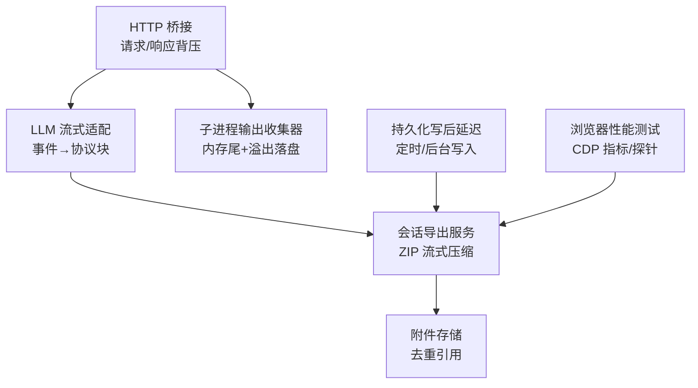
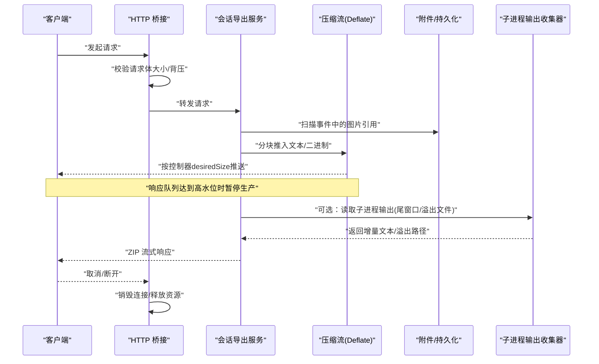
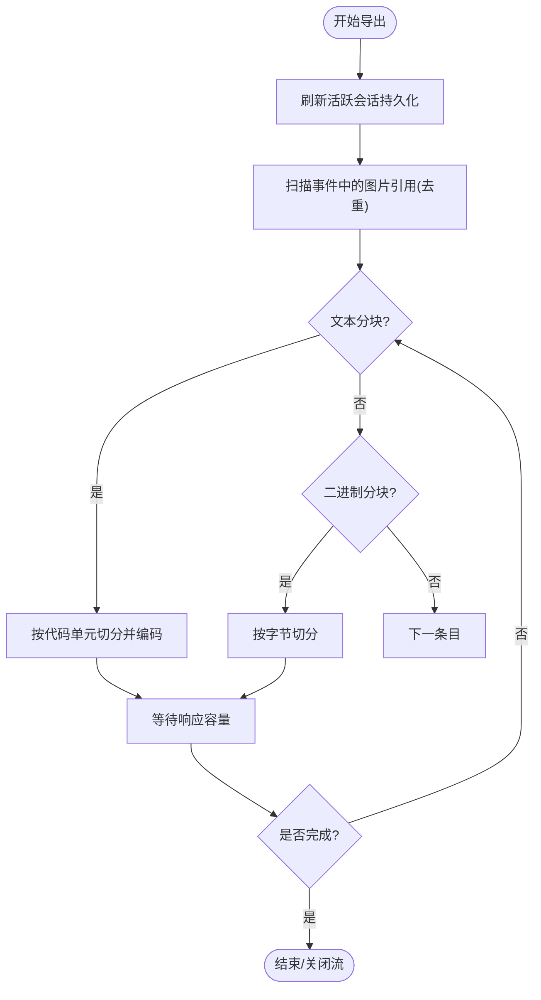
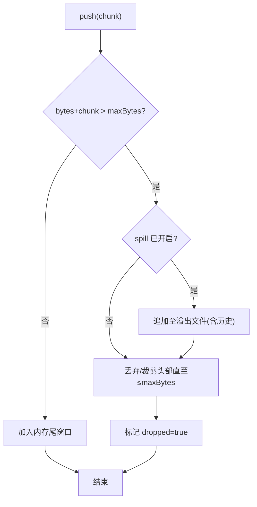
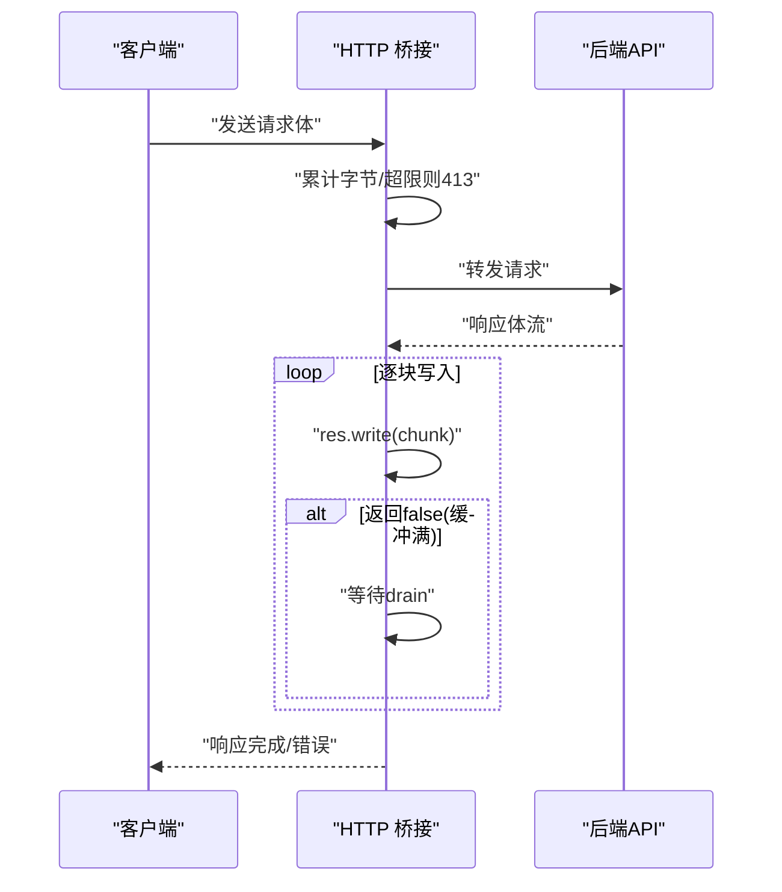
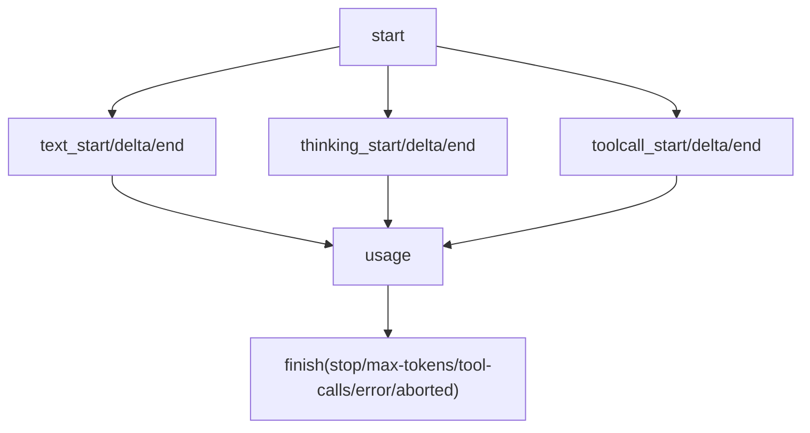
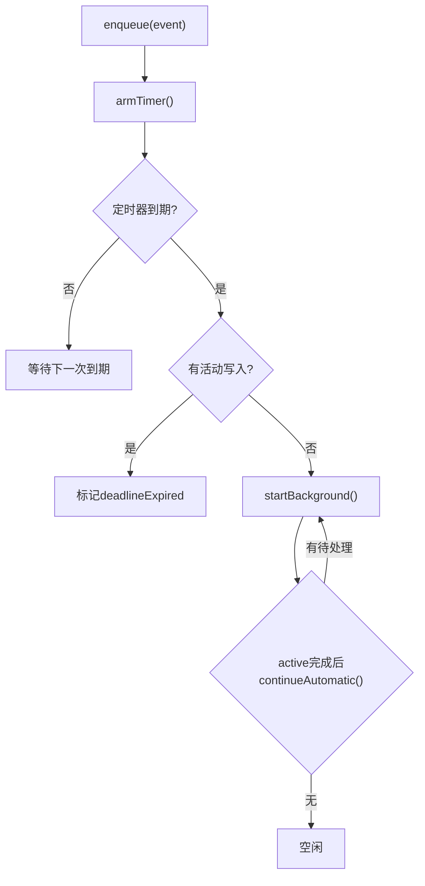
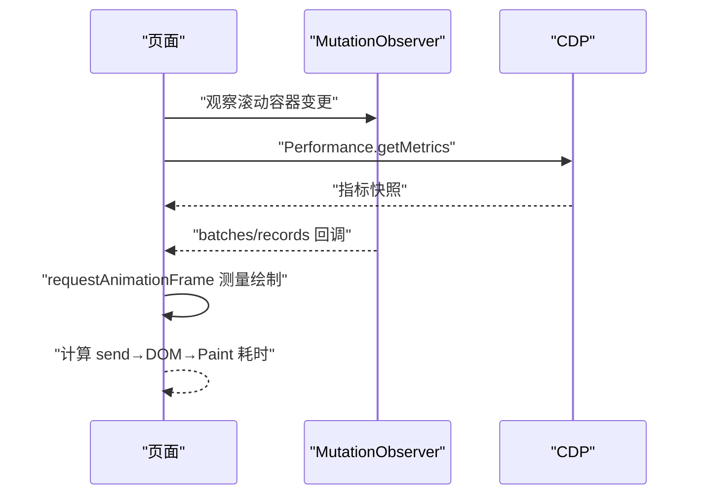
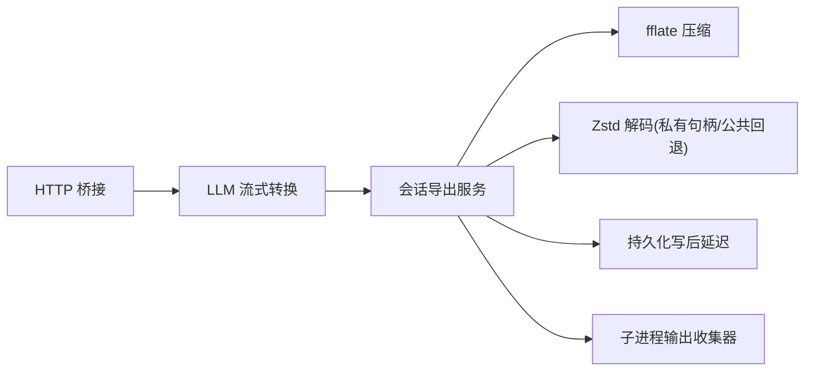

# 性能优化与内存管理

<cite>
**本文引用的文件**
- [session-export.ts](file://packages/host/apiproxy/src/session-export.ts)
- [spawn.ts](file://packages/subprocess/subprocess-local/src/spawn.ts)
- [http-bridge.ts](file://packages/client/connection/src/http-bridge.ts)
- [stream.ts](file://packages/llm/llm-pi-ai/src/stream.ts)
- [complex-history.perf.ts](file://apps/web/tests/complex-history.perf.ts)
- [zstd.ts](file://packages/session/session-persistence-jsonl/src/zstd.ts)
- [write-behind.ts](file://packages/session/session-persistence/src/write-behind.ts)
- [index.ts](file://packages/core/agent-loop/src/index.ts)
- [token-meter.spec.ts](file://packages/llm/token-meter/tests/token-meter.spec.ts)
- [BENCHMARK.md](file://BENCHMARK.md)
</cite>

## 目录
1. [简介](#简介)
2. [项目结构](#项目结构)
3. [核心组件](#核心组件)
4. [架构总览](#架构总览)
5. [详细组件分析](#详细组件分析)
6. [依赖关系分析](#依赖关系分析)
7. [性能考量](#性能考量)
8. [故障排查指南](#故障排查指南)
9. [结论](#结论)
10. [附录](#附录)

## 简介
本文件聚焦于流式响应、大数据量处理与资源生命周期中的性能优化与内存管理。围绕缓冲区管理、背压控制、分块压缩、溢出转储、并发控制、可观测性与基准测试，给出基于仓库实际实现的策略说明、流程图与最佳实践。

## 项目结构
本项目在多个层级实现了流式与内存友好的设计：
- 主机侧导出：将会话日志与媒体以 ZIP 流式输出，使用固定大小的缓冲与拉取驱动（pull-driven）的容量门控，避免整包驻留内存。
- 子进程输出：对长输出采用“内存尾窗口 + 溢出落盘”的策略，保证诊断可读性同时限制内存占用。
- HTTP 桥接：对请求体大小进行上限保护，对响应体写入遵循背压，防止慢消费者导致无限缓冲。
- LLM 流式适配：将上游事件流转换为统一的流式协议块，并在终止事件中统一收敛为 finish。
- 持久化写后延迟：通过定时器与后台写入，降低同步写入对主流程的影响。
- 浏览器端性能测试：利用 CDP 指标与 MutationObserver 等探针，量化渲染与内存变化。

图表来源
- [http-bridge.ts:50-84](file://packages/client/connection/src/http-bridge.ts#L50-L84)
- [stream.ts:124-209](file://packages/llm/llm-pi-ai/src/stream.ts#L124-L209)
- [session-export.ts:1-200](file://packages/host/apiproxy/src/session-export.ts#L1-L200)
- [spawn.ts:100-299](file://packages/subprocess/subprocess-local/src/spawn.ts#L100-L299)
- [write-behind.ts:80-115](file://packages/session/session-persistence/src/write-behind.ts#L80-L115)
- [complex-history.perf.ts:519-580](file://apps/web/tests/complex-history.perf.ts#L519-L580)

章节来源
- [session-export.ts:1-200](file://packages/host/apiproxy/src/session-export.ts#L1-L200)
- [spawn.ts:100-299](file://packages/subprocess/subprocess-local/src/spawn.ts#L100-L299)
- [http-bridge.ts:50-84](file://packages/client/connection/src/http-bridge.ts#L50-L84)
- [stream.ts:124-209](file://packages/llm/llm-pi-ai/src/stream.ts#L124-L209)
- [write-behind.ts:80-115](file://packages/session/session-persistence/src/write-behind.ts#L80-L115)
- [complex-history.perf.ts:519-580](file://apps/web/tests/complex-history.perf.ts#L519-L580)

## 核心组件
- 流式导出与压缩：按固定字节/代码单元分块推入压缩流，配合 ReadableStream 控制器 desiredSize 实现拉取驱动的容量门控，确保响应队列不超过高水位。
- 子进程输出收集：维护固定大小的内存尾部窗口；首次溢出即打开临时文件追加所有数据；读取支持从任意偏移增量恢复，必要时回退到溢出文件。
- HTTP 桥接背压：对请求体累计超过阈值直接拒绝；对响应体逐块写入并等待 drain，避免慢 SSE 消费者撑爆内存。
- LLM 流式转换：将上游事件映射为协议块，统一在结束事件产出 usage 与 finish，便于上层消费与统计。
- 持久化写后延迟：通过定时器触发批量写入，避免频繁 I/O 阻塞；后台写入失败被记录但不中断主流程。
- 浏览器性能测量：采集 Chromium 任务/脚本/布局/样式/DevTools 耗时与节点、监听器、堆内存变化，结合 MutationObserver 评估 DOM 变更批次。

章节来源
- [session-export.ts:268-371](file://packages/host/apiproxy/src/session-export.ts#L268-L371)
- [spawn.ts:123-218](file://packages/subprocess/subprocess-local/src/spawn.ts#L123-L218)
- [http-bridge.ts:50-84](file://packages/client/connection/src/http-bridge.ts#L50-L84)
- [stream.ts:124-209](file://packages/llm/llm-pi-ai/src/stream.ts#L124-L209)
- [write-behind.ts:80-115](file://packages/session/session-persistence/src/write-behind.ts#L80-L115)
- [complex-history.perf.ts:519-580](file://apps/web/tests/complex-history.perf.ts#L519-L580)

## 架构总览
下图展示了从客户端请求到流式响应、压缩与落盘的端到端路径，以及背压与资源清理的关键点。

图表来源
- [http-bridge.ts:50-84](file://packages/client/connection/src/http-bridge.ts#L50-L84)
- [session-export.ts:1-200](file://packages/host/apiproxy/src/session-export.ts#L1-L200)
- [session-export.ts:268-371](file://packages/host/apiproxy/src/session-export.ts#L268-L371)
- [spawn.ts:123-218](file://packages/subprocess/subprocess-local/src/spawn.ts#L123-L218)

## 详细组件分析

### 组件A：会话导出与流式压缩
- 分块策略
  - 文本按固定代码单元数分块，避免拆分代理对，防止编码损坏。
  - 二进制按固定字节数分块，适合媒体对象。
- 背压与容量门控
  - 使用 ReadableStreamDefaultController.desiredSize 判断是否可继续推送。
  - 自定义 ResponseCapacityGate 在 desiredSize ≤ 0 时挂起生产者，直到消费者 pull 恢复容量。
- 资源清理
  - 压缩流与响应流共享 AbortSignal，取消或关闭时立即停止生产。
- 性能要点
  - 固定高水位的响应队列（例如 64 KiB）加上一次同步 push，使慢消费者不会导致无界缓冲。
  - 先刷新活跃会话的持久化屏障，再读取原始工件，保证一致性。

图表来源
- [session-export.ts:268-371](file://packages/host/apiproxy/src/session-export.ts#L268-L371)
- [session-export.ts:1-200](file://packages/host/apiproxy/src/session-export.ts#L1-L200)

章节来源
- [session-export.ts:1-200](file://packages/host/apiproxy/src/session-export.ts#L1-L200)
- [session-export.ts:268-371](file://packages/host/apiproxy/src/session-export.ts#L268-L371)

### 组件B：子进程输出收集器（内存尾窗口 + 溢出落盘）
- 内存尾窗口
  - 维护 chunks 数组与 bytes 计数，保持最近 maxBytes 的数据在内存中。
  - 超出时丢弃头部整块或裁剪首块，确保保留的是“最后 N 字节”。
- 溢出落盘
  - 首次溢出且启用 spill 时创建临时文件，追加历史与后续数据。
  - 超过最大 spill 大小时主动丢弃 spill 文件，避免磁盘膨胀。
- 增量读取
  - 支持从任意字节偏移读取增量，若已滑出内存窗口则标记 lossy，并可返回 spill 路径用于恢复缺失部分。
- 资源清理
  - seal/finalize 时关闭文件描述符，失败不影响内存结果；最终返回 truncated 标志与 spill 路径。

图表来源
- [spawn.ts:123-153](file://packages/subprocess/subprocess-local/src/spawn.ts#L123-L153)
- [spawn.ts:155-197](file://packages/subprocess/subprocess-local/src/spawn.ts#L155-L197)
- [spawn.ts:199-218](file://packages/subprocess/subprocess-local/src/spawn.ts#L199-L218)
- [spawn.ts:220-250](file://packages/subprocess/subprocess-local/src/spawn.ts#L220-L250)

章节来源
- [spawn.ts:123-218](file://packages/subprocess/subprocess-local/src/spawn.ts#L123-L218)
- [spawn.ts:155-197](file://packages/subprocess/subprocess-local/src/spawn.ts#L155-L197)
- [spawn.ts:220-250](file://packages/subprocess/subprocess-local/src/spawn.ts#L220-L250)

### 组件C：HTTP 桥接背压与请求体保护
- 请求体保护
  - 累计接收 chunk 长度，超过阈值立即返回 413 并销毁请求，防止恶意或异常大请求。
- 响应体背压
  - 逐块写入响应，当 socket 缓冲满时 write 返回 false，循环等待 drain 后再继续，避免慢消费者导致内存增长。
- 取消与清理
  - 使用 AbortSignal 贯穿请求/响应生命周期，确保中途断开能及时释放资源。

图表来源
- [http-bridge.ts:50-84](file://packages/client/connection/src/http-bridge.ts#L50-L84)

章节来源
- [http-bridge.ts:50-84](file://packages/client/connection/src/http-bridge.ts#L50-L84)

### 组件D：LLM 流式转换与终止收敛
- 事件映射
  - 将上游事件流（如 pi-ai）转换为统一的 StreamChunk 协议块（text/reasoning/tool-call 等）。
- 终止收敛
  - 在 done/error 事件中产出 usage 与 finish，统一错误分类（认证、配额、超时、传输截断等）。
- 上下文溢出
  - 根据模型上下文窗口检测溢出，映射为特定错误码，便于上层重试或降级。

图表来源
- [stream.ts:124-209](file://packages/llm/llm-pi-ai/src/stream.ts#L124-L209)

章节来源
- [stream.ts:124-209](file://packages/llm/llm-pi-ai/src/stream.ts#L124-L209)

### 组件E：持久化写后延迟与后台写入
- 定时器窗口
  - 启动固定时间窗口的定时器，到期后尝试后台写入；若已有活动写入，仅标记过期，待其完成后立即续写。
- 后台写入
  - 独立 Promise 执行写入，失败上报但不阻塞主流程；成功后检查是否有待处理工作继续推进。
- 性能收益
  - 合并多次写入，减少 I/O 抖动；避免同步写入阻塞关键路径。

图表来源
- [write-behind.ts:80-115](file://packages/session/session-persistence/src/write-behind.ts#L80-L115)

章节来源
- [write-behind.ts:80-115](file://packages/session/session-persistence/src/write-behind.ts#L80-L115)

### 组件F：浏览器端性能监控与基准
- 指标采集
  - 通过 CDP 获取任务、脚本、布局、样式、DevTools 耗时，以及节点数、监听器数、堆内存。
- 用户交互探针
  - 使用 MutationObserver 观察目标区域变更，统计批次与记录数；通过 requestAnimationFrame 测量 DOM 插入到绘制的时间。
- 场景构造
  - 生成大量会话与长历史，模拟工具调用与流式增量，验证渲染与内存稳定性。

图表来源
- [complex-history.perf.ts:519-580](file://apps/web/tests/complex-history.perf.ts#L519-L580)
- [complex-history.perf.ts:582-617](file://apps/web/tests/complex-history.perf.ts#L582-L617)
- [complex-history.perf.ts:619-779](file://apps/web/tests/complex-history.perf.ts#L619-L779)

章节来源
- [complex-history.perf.ts:519-580](file://apps/web/tests/complex-history.perf.ts#L519-L580)
- [complex-history.perf.ts:582-617](file://apps/web/tests/complex-history.perf.ts#L582-L617)
- [complex-history.perf.ts:619-779](file://apps/web/tests/complex-history.perf.ts#L619-L779)

## 依赖关系分析
- 低耦合接口
  - 导出服务依赖查询、持久化、附件与会话存储，但通过按需注入，未部署的服务可安全忽略。
- 背压链
  - HTTP 桥接 → LLM 流式转换 → 导出压缩 → 客户端拉取，形成完整的背压链路，任一环节阻塞都会向上传播。
- 资源生命周期
  - 通过 AbortSignal 贯穿请求/导出/压缩，确保取消时及时释放；子进程输出收集器在 finalize/seal 时关闭文件描述符。
- 外部依赖
  - 压缩库 fflate 提供流式 ZIP；Node 原生 zstd 解码在兼容时走私有句柄优化，否则回退到公共 API。

图表来源
- [session-export.ts:1-200](file://packages/host/apiproxy/src/session-export.ts#L1-L200)
- [zstd.ts:138-156](file://packages/session/session-persistence-jsonl/src/zstd.ts#L138-L156)
- [write-behind.ts:80-115](file://packages/session/session-persistence/src/write-behind.ts#L80-L115)
- [spawn.ts:123-218](file://packages/subprocess/subprocess-local/src/spawn.ts#L123-L218)

章节来源
- [session-export.ts:1-200](file://packages/host/apiproxy/src/session-export.ts#L1-L200)
- [zstd.ts:138-156](file://packages/session/session-persistence-jsonl/src/zstd.ts#L138-L156)
- [write-behind.ts:80-115](file://packages/session/session-persistence/src/write-behind.ts#L80-L115)
- [spawn.ts:123-218](file://packages/subprocess/subprocess-local/src/spawn.ts#L123-L218)

## 性能考量
- 缓冲区管理
  - 响应队列高水位：导出服务使用固定字节高水位（如 64 KiB），配合控制器 desiredSize 实现拉取驱动，避免慢消费者堆积。
  - 文本分块边界：按代码单元切分并规避代理对拆分，避免编码错误导致的重算与修复成本。
  - 子进程输出：内存尾窗口保证诊断可读性，溢出落盘避免 OOM。
- 内存泄漏防护
  - 取消信号：AbortSignal 贯穿请求/导出/压缩，取消时立即停止生产与压缩。
  - 资源关闭：子进程输出收集器在 finalize/seal 时关闭文件描述符；失败不阻断主流程但会隐藏 spill 路径。
  - 作用域清理：Agent 生命周期在卸载前注册 disposer，避免资源创建期间的竞态导致泄漏。
- 资源清理机制
  - 导出：ZIP 流与响应流共享信号，取消即停。
  - 子进程：killGroup/taskkillProcessTree 提供跨平台进程树终止能力，失败被吞以避免破坏幂等清理。
- 大数据量处理
  - 分块处理：文本/二进制均按固定大小分块，降低峰值内存。
  - 流式压缩：边读边压，避免整包驻留。
  - 并发控制：工具调用与 Agent 运行存在并发上限配置，避免资源争用。
- 性能监控指标
  - 浏览器：任务/脚本/布局/样式/DevTools 耗时，节点/监听器数量，堆内存；MutationObserver 统计变更批次与记录数。
  - 服务端：导出高水位、spill 文件大小、写入批次数与失败率。
- 基准测试方法
  - 使用浏览器性能测试构造长历史与高频工具调用，对比不同参数下的渲染与内存表现。
  - 使用 Python SDK 最小变体进行端到端基准，隔离工作区与会话 ID 保证独立性。
- 调优技巧
  - 调整导出压缩级别与分块大小，平衡 CPU 与内存。
  - 合理设置子进程输出内存尾窗口与 spill 上限，兼顾诊断与资源。
  - 针对慢消费者，适当提高响应高水位或引入节流。
  - 对工具调用与 Agent 并发度进行限流，避免热点竞争。

章节来源
- [session-export.ts:268-371](file://packages/host/apiproxy/src/session-export.ts#L268-L371)
- [spawn.ts:123-218](file://packages/subprocess/subprocess-local/src/spawn.ts#L123-L218)
- [index.ts:474-487](file://packages/core/agent-loop/src/index.ts#L474-L487)
- [complex-history.perf.ts:519-580](file://apps/web/tests/complex-history.perf.ts#L519-L580)
- [BENCHMARK.md:1-4](file://BENCHMARK.md#L1-L4)

## 故障排查指南
- 导出卡顿或内存飙升
  - 检查响应控制器 desiredSize 是否为 0 或 null，确认消费者是否持续 pull。
  - 查看压缩流是否因取消信号未正确释放。
- 子进程输出丢失
  - 若 readFrom 返回 lossy=true，需从 spillPath 恢复缺失片段。
  - 检查 spill 文件是否被提前丢弃（超过 maxSpillBytes）。
- 请求被拒绝
  - 确认请求体是否超过最大限制；关注 413 响应与连接关闭。
- 流式结束异常
  - 检查上游事件流是否在未完成终端事件的情况下关闭，可能抛出 STREAM_CLOSED。
- 浏览器渲染抖动
  - 通过 MutationObserver 统计 batches/records，定位过多细粒度更新；合并更新或使用虚拟滚动。

章节来源
- [session-export.ts:268-371](file://packages/host/apiproxy/src/session-export.ts#L268-L371)
- [spawn.ts:199-218](file://packages/subprocess/subprocess-local/src/spawn.ts#L199-L218)
- [http-bridge.ts:50-84](file://packages/client/connection/src/http-bridge.ts#L50-L84)
- [stream.ts:124-209](file://packages/llm/llm-pi-ai/src/stream.ts#L124-L209)
- [complex-history.perf.ts:582-617](file://apps/web/tests/complex-history.perf.ts#L582-L617)

## 结论
该代码库在多处实现了面向性能的流式与内存友好设计：通过固定高水位的响应队列、分块压缩、溢出落盘、背压控制与完善的取消/清理机制，有效控制了内存峰值与资源占用。配合浏览器端性能探针与基准测试，可在真实场景中持续验证与调优。建议在生产环境中结合业务负载，合理配置导出压缩级别、分块大小、子进程输出窗口与并发上限，并建立持续的监控与回归基线。

## 附录
- 令牌计量不可变性
  - 空测量返回深冻结对象，防止意外修改影响统计。
- 基准入口
  - 参考仓库根文档，使用 Python SDK 最小变体运行独立基准任务。

章节来源
- [token-meter.spec.ts:148-167](file://packages/llm/token-meter/tests/token-meter.spec.ts#L148-L167)
- [BENCHMARK.md:1-4](file://BENCHMARK.md#L1-L4)