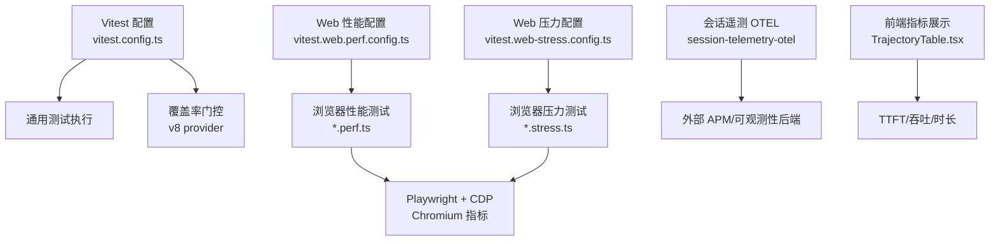
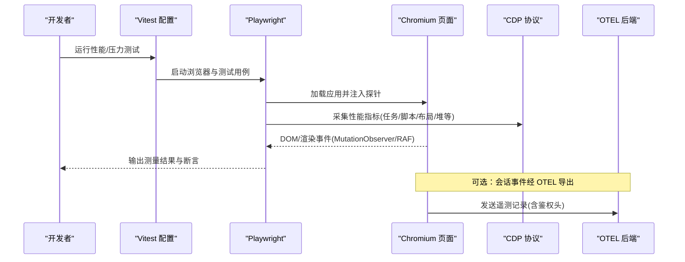
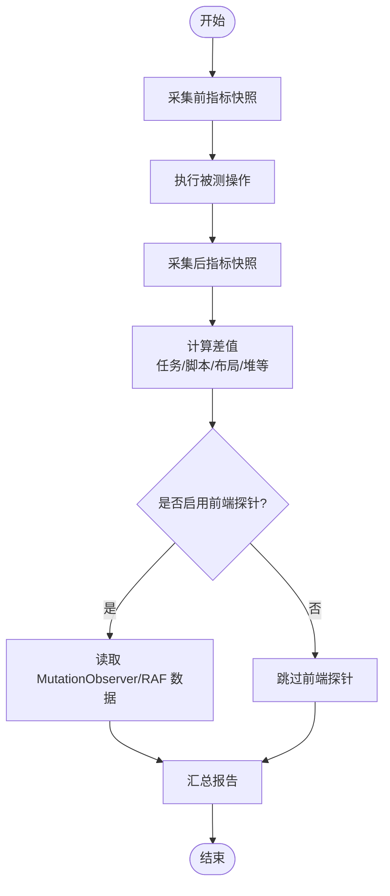
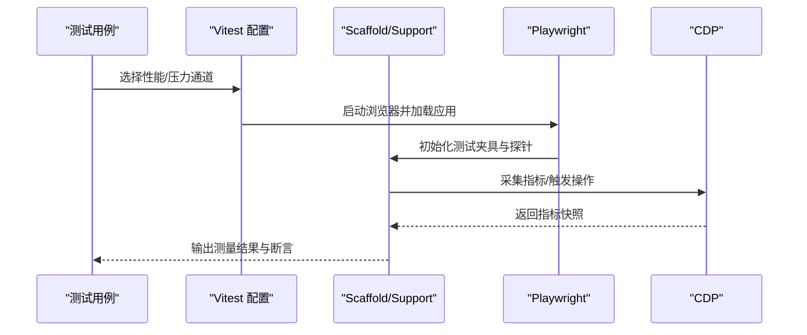
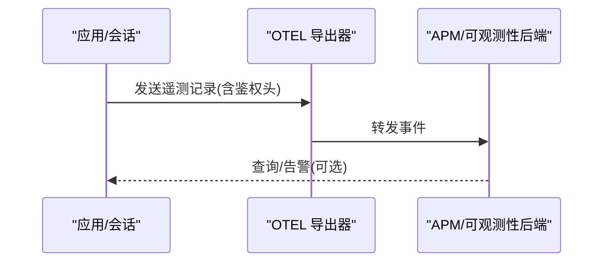
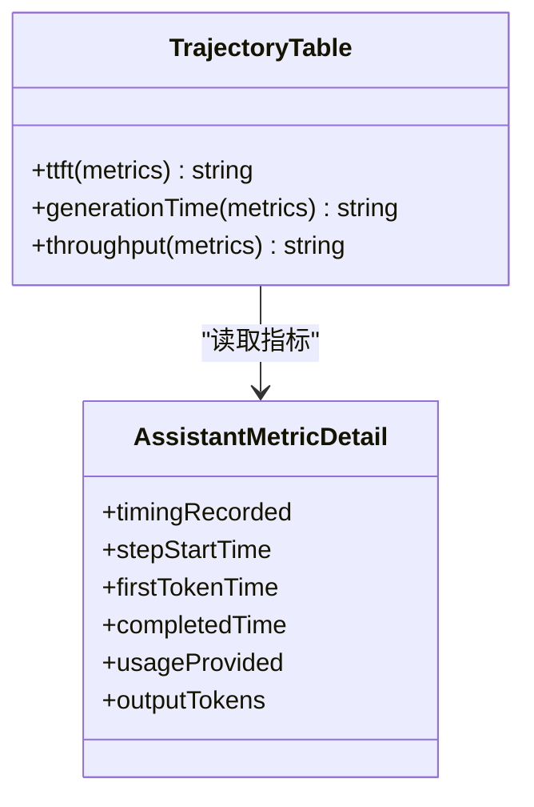
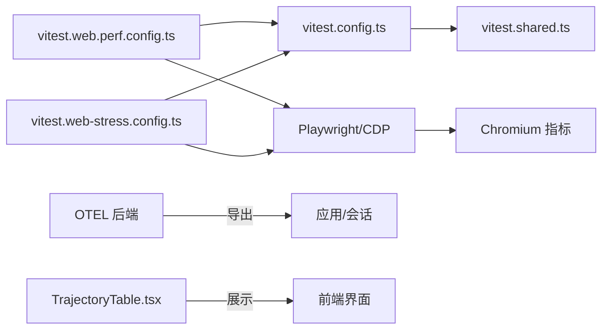

# 性能监控与基准测试

<cite>
**本文引用的文件**
- [BENCHMARK.md](file://BENCHMARK.md)
- [vitest.config.ts](file://vitest.config.ts)
- [vitest.shared.ts](file://vitest.shared.ts)
- [vitest.web.perf.config.ts](file://vitest.web.perf.config.ts)
- [vitest.web-stress.config.ts](file://vitest.web-stress.config.ts)
- [apps/web/stress-tests/reasoning-chunks.stress.ts](file://apps/web/stress-tests/reasoning-chunks.stress.ts)
- [apps/web/tests/complex-history.perf.ts](file://apps/web/tests/complex-history.perf.ts)
- [packages/client/ui-trajectory/src/client/TrajectoryTable.tsx](file://packages/client/ui-trajectory/src/client/TrajectoryTable.tsx)
- [packages/client/ui-conversation/tests/turn-metrics.client.spec.ts](file://packages/client/ui-conversation/tests/turn-metrics.client.spec.ts)
- [packages/session/session-telemetry-otel/tests/otel.spec.ts](file://packages/session/session-telemetry-otel/tests/otel.spec.ts)
</cite>

## 目录
1. [简介](#简介)
2. [项目结构](#项目结构)
3. [核心组件](#核心组件)
4. [架构总览](#架构总览)
5. [详细组件分析](#详细组件分析)
6. [依赖关系分析](#依赖关系分析)
7. [性能考量](#性能考量)
8. [故障排查指南](#故障排查指南)
9. [结论](#结论)
10. [附录](#附录)

## 简介
本文件面向性能监控与基准测试，覆盖以下目标：
- 指标收集与分析：响应时间、吞吐量、资源使用率等关键指标的采集方法与口径。
- 基准测试框架与用例：单元测试、集成测试、压力测试的组织方式与自定义方法。
- 监控工具部署与配置：APM（OpenTelemetry）集成、日志分析与告警设置建议。
- 回归检测、趋势分析与容量规划：最佳实践与落地步骤。

## 项目结构
仓库采用多包多应用结构，性能相关能力分布在测试配置、浏览器压测脚本、会话遥测与前端指标展示中：
- 测试与基准配置：Vitest 统一入口与各场景专用配置（通用、Web 性能、Web 压力）。
- Web 端性能与压力测试：基于 Playwright + Chromium CDP 的指标采集与断言。
- 会话遥测：通过 OpenTelemetry 后端将事件导出到外部系统。
- 前端指标展示：对话轨迹中的 TTFT、生成耗时、吞吐等可视化。

图表来源
- [vitest.config.ts:117-159](file://vitest.config.ts#L117-L159)
- [vitest.web.perf.config.ts:6-15](file://vitest.web.perf.config.ts#L6-L15)
- [vitest.web-stress.config.ts:6-15](file://vitest.web-stress.config.ts#L6-L15)
- [apps/web/tests/complex-history.perf.ts:519-580](file://apps/web/tests/complex-history.perf.ts#L519-L580)
- [packages/session/session-telemetry-otel/tests/otel.spec.ts:98-119](file://packages/session/session-telemetry-otel/tests/otel.spec.ts#L98-L119)
- [packages/client/ui-trajectory/src/client/TrajectoryTable.tsx:311-344](file://packages/client/ui-trajectory/src/client/TrajectoryTable.tsx#L311-L344)

章节来源
- [vitest.config.ts:117-159](file://vitest.config.ts#L117-L159)
- [vitest.web.perf.config.ts:6-15](file://vitest.web.perf.config.ts#L6-L15)
- [vitest.web-stress.config.ts:6-15](file://vitest.web-stress.config.ts#L6-L15)

## 核心组件
- 基准测试入口与运行说明
  - Python SDK 最小变体用于基准任务隔离与独立工作区/会话 ID 管理。
- Vitest 测试与覆盖率
  - 线程安全与进程绑定两类项目隔离；v8 覆盖率门控（语句/分支/函数/行 100%）。
  - 共享装饰器预处理与跨平台兼容参数。
- Web 性能与压力测试
  - 性能测试：高基数历史渲染、流式增量、用户交互首帧等指标。
  - 压力测试：大量推理分片渲染下的主线程阻塞与交互延迟预算。
- 会话遥测（OTEL）
  - 以 Session Telemetry 后端模式导出事件至外部系统，支持鉴权头。
- 前端指标展示
  - TTFT、生成耗时、吞吐等指标在轨迹面板中呈现，并附带格式化逻辑。

章节来源
- [BENCHMARK.md:1-4](file://BENCHMARK.md#L1-L4)
- [vitest.config.ts:117-159](file://vitest.config.ts#L117-L159)
- [vitest.config.ts:160-283](file://vitest.config.ts#L160-L283)
- [vitest.shared.ts:1-43](file://vitest.shared.ts#L1-L43)
- [apps/web/tests/complex-history.perf.ts:519-580](file://apps/web/tests/complex-history.perf.ts#L519-L580)
- [apps/web/stress-tests/reasoning-chunks.stress.ts:46-153](file://apps/web/stress-tests/reasoning-chunks.stress.ts#L46-L153)
- [packages/session/session-telemetry-otel/tests/otel.spec.ts:98-119](file://packages/session/session-telemetry-otel/tests/otel.spec.ts#L98-L119)
- [packages/client/ui-trajectory/src/client/TrajectoryTable.tsx:311-344](file://packages/client/ui-trajectory/src/client/TrajectoryTable.tsx#L311-L344)

## 架构总览
下图展示了从测试配置到浏览器指标采集、再到遥测导出的端到端链路。

图表来源
- [vitest.web.perf.config.ts:6-15](file://vitest.web.perf.config.ts#L6-L15)
- [vitest.web-stress.config.ts:6-15](file://vitest.web-stress.config.ts#L6-L15)
- [apps/web/tests/complex-history.perf.ts:519-580](file://apps/web/tests/complex-history.perf.ts#L519-L580)
- [packages/session/session-telemetry-otel/tests/otel.spec.ts:98-119](file://packages/session/session-telemetry-otel/tests/otel.spec.ts#L98-L119)

## 详细组件分析

### 指标定义与采集方法
- 响应时间
  - TTFT（首字到达时间）：首次 token 时间与步骤开始时间的差值。
  - 生成耗时：首个 token 到完成时间的差值。
  - 端到端时延：用户点击发送到首帧可见/绘制的时间段。
- 吞吐量
  - 令牌吞吐：输出 token 数除以生成耗时（秒），单位 tok/s。
- 资源使用率
  - 任务/脚本/布局/样式重算/DevTools 命令耗时（CDP Performance.getMetrics）。
  - DOM 节点数、事件监听器数量、JS Heap 使用量变化。
- 采集手段
  - CDP 指标：通过 before/after 差值计算各阶段耗时与资源增量。
  - 前端探针：MutationObserver、requestAnimationFrame、performance.now() 标记关键时间点。
  - 遥测事件：会话事件经 OTEL 后端导出，便于集中分析与告警。

图表来源
- [apps/web/tests/complex-history.perf.ts:519-580](file://apps/web/tests/complex-history.perf.ts#L519-L580)
- [apps/web/tests/complex-history.perf.ts:582-617](file://apps/web/tests/complex-history.perf.ts#L582-L617)
- [apps/web/tests/complex-history.perf.ts:619-779](file://apps/web/tests/complex-history.perf.ts#L619-L779)

章节来源
- [apps/web/tests/complex-history.perf.ts:519-580](file://apps/web/tests/complex-history.perf.ts#L519-L580)
- [apps/web/tests/complex-history.perf.ts:582-617](file://apps/web/tests/complex-history.perf.ts#L582-L617)
- [apps/web/tests/complex-history.perf.ts:619-779](file://apps/web/tests/complex-history.perf.ts#L619-L779)
- [packages/client/ui-trajectory/src/client/TrajectoryTable.tsx:311-344](file://packages/client/ui-trajectory/src/client/TrajectoryTable.tsx#L311-L344)

### 基准测试框架与用例开发
- 运行方式
  - 使用 Python SDK 的最小变体进行基准任务隔离，不同工作区与会话 ID 避免相互干扰。
- 单元测试与覆盖率
  - Vitest 双项目策略：线程安全与进程绑定分离；v8 覆盖率门控要求每文件 100%。
  - 共享装饰器预处理保证测试环境一致性。
- 性能测试（Web）
  - 针对高基数历史渲染、流式增量、用户交互首帧等场景，使用 Playwright + CDP 采集指标并做结构性断言。
- 压力测试（Web）
  - 模拟大量推理分片渲染，验证主线程阻塞与交互延迟预算，确保 UI 保持响应。
- 自定义用例
  - 新增 *.perf.ts 或 *.stress.ts 文件，复用 scaffold/support 工具与 CDP 指标采集封装。
  - 通过 vitest.web.perf.config.ts 与 vitest.web-stress.config.ts 分别纳入对应执行通道。

图表来源
- [vitest.config.ts:117-159](file://vitest.config.ts#L117-L159)
- [vitest.web.perf.config.ts:6-15](file://vitest.web.perf.config.ts#L6-L15)
- [vitest.web-stress.config.ts:6-15](file://vitest.web-stress.config.ts#L6-L15)
- [apps/web/tests/complex-history.perf.ts:519-580](file://apps/web/tests/complex-history.perf.ts#L519-L580)
- [apps/web/stress-tests/reasoning-chunks.stress.ts:46-153](file://apps/web/stress-tests/reasoning-chunks.stress.ts#L46-L153)

章节来源
- [BENCHMARK.md:1-4](file://BENCHMARK.md#L1-L4)
- [vitest.config.ts:117-159](file://vitest.config.ts#L117-L159)
- [vitest.config.ts:160-283](file://vitest.config.ts#L160-L283)
- [vitest.shared.ts:1-43](file://vitest.shared.ts#L1-L43)
- [apps/web/tests/complex-history.perf.ts:519-580](file://apps/web/tests/complex-history.perf.ts#L519-L580)
- [apps/web/stress-tests/reasoning-chunks.stress.ts:46-153](file://apps/web/stress-tests/reasoning-chunks.stress.ts#L46-L153)

### 性能监控工具部署与配置（APM 集成、日志分析、告警）
- APM 集成
  - 通过会话遥测后端以 FULL 模式导出事件，支持 URL 与鉴权头配置。
  - 测试中捕获导出记录并校验事件类型，便于验证集成正确性。
- 日志分析
  - 利用浏览器控制台监控与失败截图辅助定位问题；性能测试输出结构化 JSON 报告。
- 告警设置
  - 建议在 APM 系统中对 TTFT、吞吐、错误率、资源使用阈值设置告警规则；结合 CI 覆盖率门控保障质量基线。

图表来源
- [packages/session/session-telemetry-otel/tests/otel.spec.ts:98-119](file://packages/session/session-telemetry-otel/tests/otel.spec.ts#L98-L119)

章节来源
- [packages/session/session-telemetry-otel/tests/otel.spec.ts:98-119](file://packages/session/session-telemetry-otel/tests/otel.spec.ts#L98-L119)

### 指标计算与展示（TTFT、吞吐、时长）
- TTFT：首次 token 时间与步骤开始时间之差。
- 生成耗时：首个 token 到完成时间之差。
- 吞吐：输出 token 数除以生成耗时（秒），保留一位小数。
- 展示：轨迹面板提供“开始”“总时长”“TTFT”“生成”“吞吐”等字段，缺失数据时给出友好提示。

图表来源
- [packages/client/ui-trajectory/src/client/TrajectoryTable.tsx:311-344](file://packages/client/ui-trajectory/src/client/TrajectoryTable.tsx#L311-L344)

章节来源
- [packages/client/ui-trajectory/src/client/TrajectoryTable.tsx:311-344](file://packages/client/ui-trajectory/src/client/TrajectoryTable.tsx#L311-L344)
- [packages/client/ui-conversation/tests/turn-metrics.client.spec.ts:86-154](file://packages/client/ui-conversation/tests/turn-metrics.client.spec.ts#L86-L154)

## 依赖关系分析
- 测试配置依赖
  - vitest.config.ts 提供通用测试与覆盖率门控；vitest.web.perf.config.ts 与 vitest.web-stress.config.ts 分别扩展 Web 性能与压力测试通道。
  - vitest.shared.ts 提供装饰器预处理与跨平台 execArgv 处理。
- 运行时依赖
  - 性能测试依赖 Playwright 与 Chromium CDP；压力测试同样基于此栈。
  - 遥测导出依赖 OTEL 后端与鉴权头配置。
- 前端展示依赖
  - 轨迹面板消费会话指标模型，负责 TTFT、吞吐等展示。

图表来源
- [vitest.config.ts:117-159](file://vitest.config.ts#L117-L159)
- [vitest.web.perf.config.ts:6-15](file://vitest.web.perf.config.ts#L6-L15)
- [vitest.web-stress.config.ts:6-15](file://vitest.web-stress.config.ts#L6-L15)
- [vitest.shared.ts:1-43](file://vitest.shared.ts#L1-L43)
- [packages/client/ui-trajectory/src/client/TrajectoryTable.tsx:311-344](file://packages/client/ui-trajectory/src/client/TrajectoryTable.tsx#L311-L344)

章节来源
- [vitest.config.ts:117-159](file://vitest.config.ts#L117-L159)
- [vitest.web.perf.config.ts:6-15](file://vitest.web.perf.config.ts#L6-L15)
- [vitest.web-stress.config.ts:6-15](file://vitest.web-stress.config.ts#L6-L15)
- [vitest.shared.ts:1-43](file://vitest.shared.ts#L1-L43)

## 性能考量
- 指标稳定性
  - 使用 CDP 指标差值与多次采样降低噪声；对不稳定计数采用稳定判定（如连续多次相同计数）。
- 资源泄漏防护
  - 在性能测试前后清理观察者、定时器与全局状态，避免累积影响后续用例。
- 并发与隔离
  - 线程安全与进程绑定测试分离，避免全局状态污染；压力测试关闭文件并行以减少竞争。
- 前端渲染优化
  - 控制批量更新次数与记录数，减少 MutationObserver 开销；合理使用 requestAnimationFrame 合并绘制。
- 遥测开销
  - 在高负载场景下评估 OTEL 导出频率与批大小，避免阻塞主路径。

[本节为通用指导，不直接分析具体文件]

## 故障排查指南
- 指标不可用
  - 检查 CDP 指标名称是否存在；若缺失则抛出明确错误信息以便快速定位。
- 探针未触发
  - 确认 MutationObserver 目标元素存在且观察范围正确；必要时增加调试输出与截图。
- 遥测导出失败
  - 校验 OTEL 后端 URL 与鉴权头；在测试中捕获并打印导出记录以验证链路。
- 覆盖率门控失败
  - 根据 v8 覆盖率报告定位未覆盖分支；必要时调整排除列表或补充测试。

章节来源
- [apps/web/tests/complex-history.perf.ts:519-580](file://apps/web/tests/complex-history.perf.ts#L519-L580)
- [apps/web/tests/complex-history.perf.ts:582-617](file://apps/web/tests/complex-history.perf.ts#L582-L617)
- [packages/session/session-telemetry-otel/tests/otel.spec.ts:98-119](file://packages/session/session-telemetry-otel/tests/otel.spec.ts#L98-L119)
- [vitest.config.ts:160-283](file://vitest.config.ts#L160-L283)

## 结论
本项目提供了完整的性能监控与基准测试体系：以 Vitest 为核心组织测试与覆盖率门控，借助 Playwright 与 CDP 采集浏览器级指标，通过 OTEL 实现会话遥测导出，并在前端直观展示关键性能指标。结合压力测试与回归检测机制，可有效保障系统在大规模交互与长历史场景下的稳定性与性能。

[本节为总结性内容，不直接分析具体文件]

## 附录
- 运行基准
  - 参考 Python SDK 最小变体的安装与运行说明，使用独立工作区与会话 ID 执行基准任务。
- 新增性能用例
  - 在 apps/web/tests 或 apps/web/stress-tests 下新增 *.perf.ts 或 *.stress.ts，复用现有 scaffold/support 与指标采集封装。
- 告警与趋势
  - 在 APM 中建立 TTFT、吞吐、错误率、资源使用阈值告警；结合 CI 覆盖率门控形成持续质量闭环。

[本节为补充说明，不直接分析具体文件]