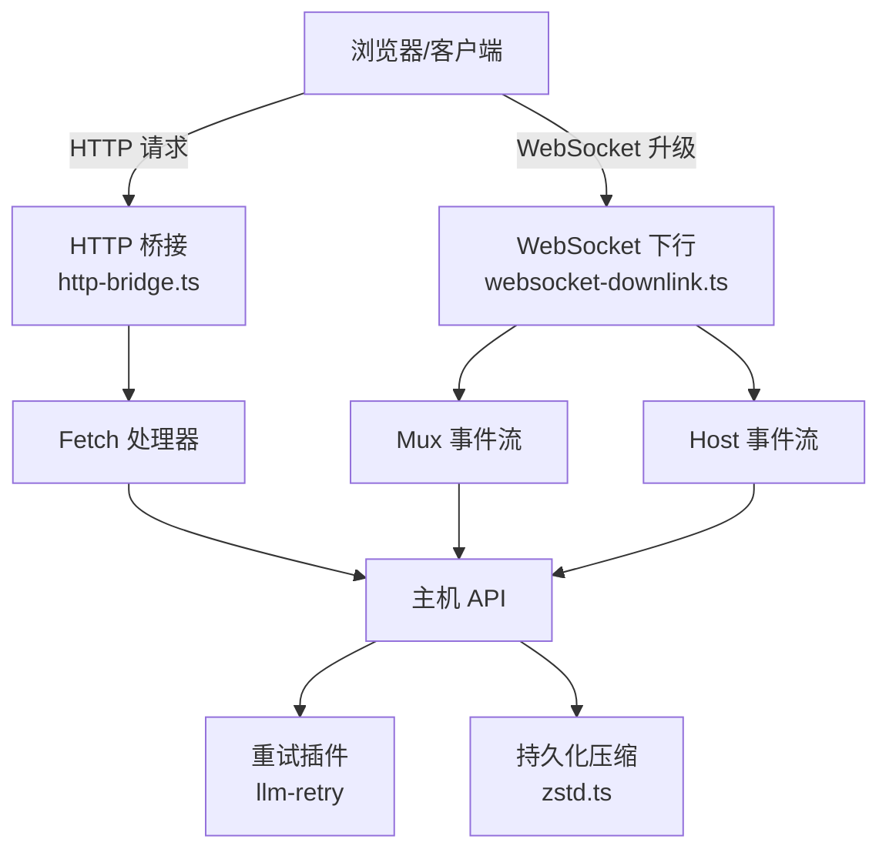
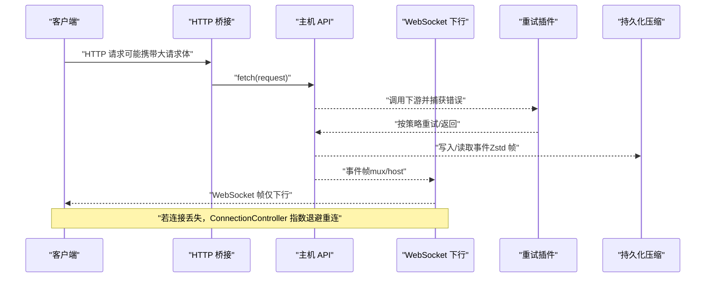
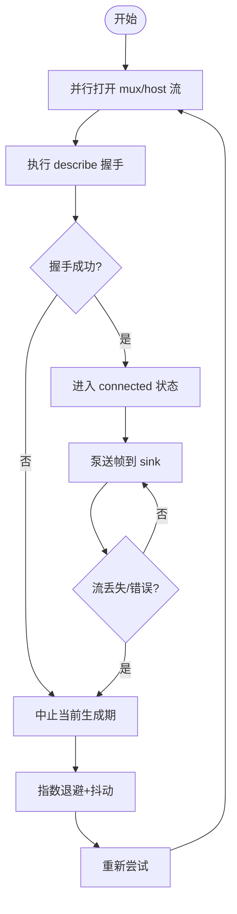
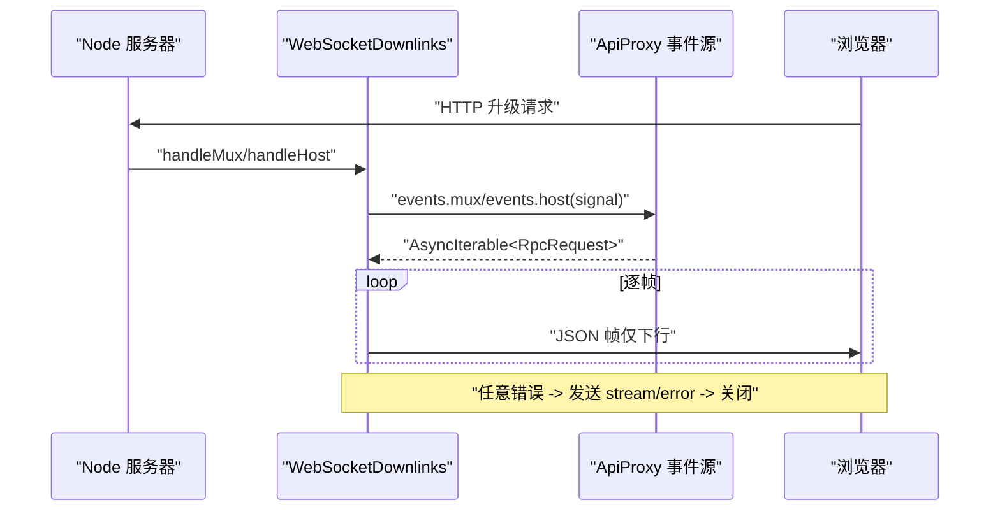
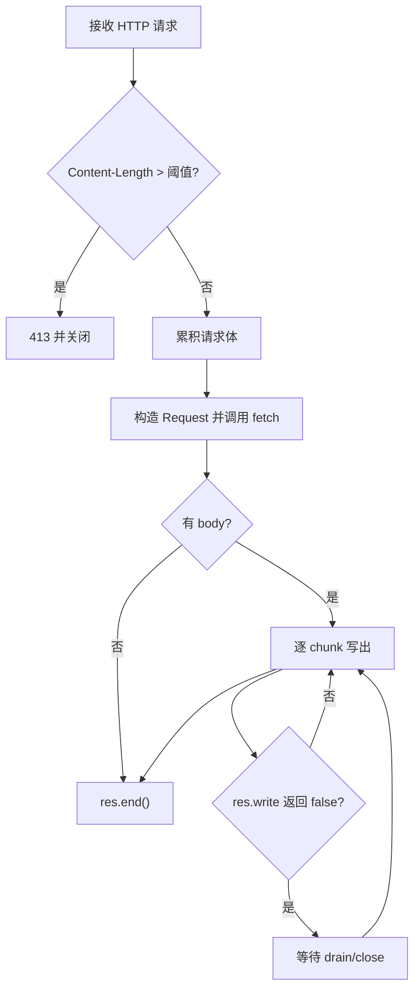
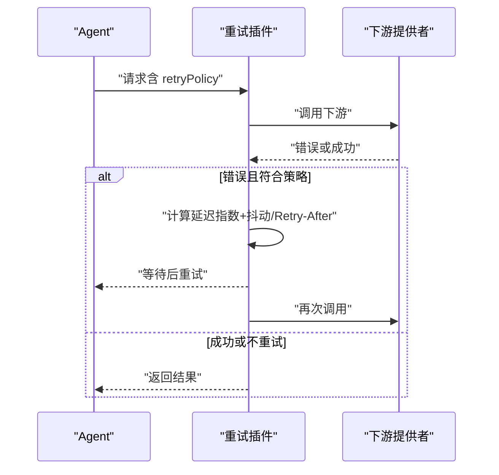
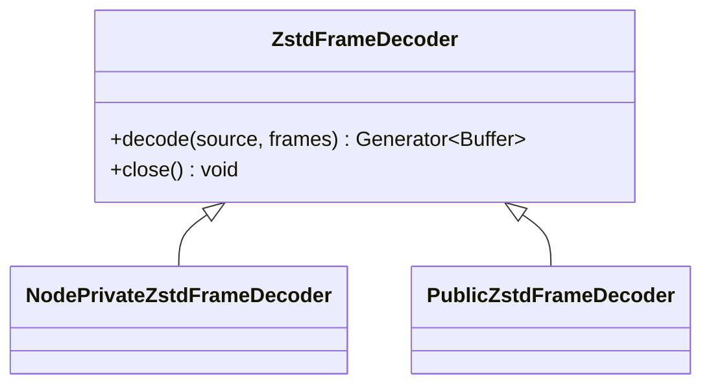
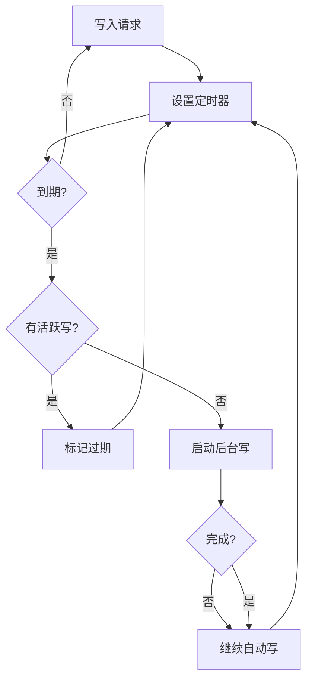
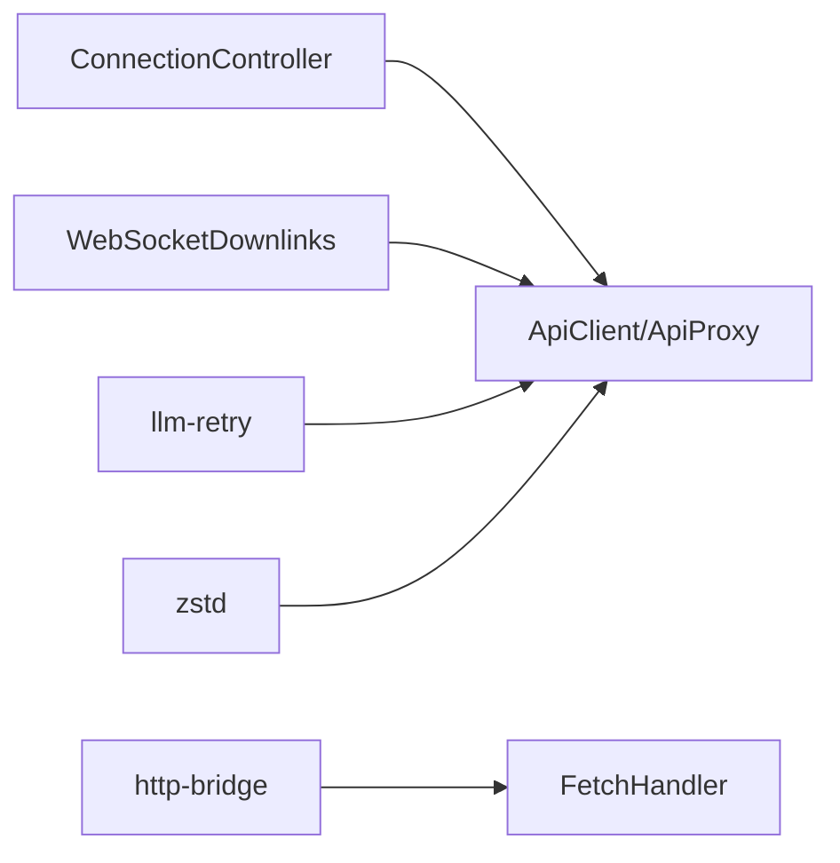

# 网络传输优化

<cite>
**本文引用的文件**
- [packages/client/connection/src/client/connection.ts](file://packages/client/connection/src/client/connection.ts)
- [packages/client/connection/src/websocket-downlink.ts](file://packages/client/connection/src/websocket-downlink.ts)
- [packages/client/connection/src/http-bridge.ts](file://packages/client/connection/src/http-bridge.ts)
- [packages/llm/llm-retry/src/index.ts](file://packages/llm/llm-retry/src/index.ts)
- [packages/host/apiproxy/src/session-export.ts](file://packages/host/apiproxy/src/session-export.ts)
- [packages/session/session-persistence-jsonl/src/zstd.ts](file://packages/session/session-persistence-jsonl/src/zstd.ts)
- [packages/session/session-persistence-jsonl/tests/zstd.compat.spec.ts](file://packages/session/session-persistence-jsonl/tests/zstd.compat.spec.ts)
- [packages/session/session-persistence/src/write-behind.ts](file://packages/session/session-persistence/src/write-behind.ts)
</cite>

## 目录
1. [简介](#简介)
2. [项目结构](#项目结构)
3. [核心组件](#核心组件)
4. [架构总览](#架构总览)
5. [详细组件分析](#详细组件分析)
6. [依赖关系分析](#依赖关系分析)
7. [性能考量](#性能考量)
8. [故障排查指南](#故障排查指南)
9. [结论](#结论)
10. [附录](#附录)

## 简介
本文件聚焦于仓库中与网络传输相关的实现与优化策略，覆盖以下主题：
- 流式数据传输优化：TCP 连接复用、HTTP/2 多路复用与 WebSocket 消息压缩。
- 大文件传输优化：分块上传、断点续传思路与并发下载控制。
- 网络请求的缓存策略、重试机制与错误恢复方案。
- 网络性能监控指标与调优技巧：延迟优化、带宽利用率与连接池管理。

说明：本仓库未提供通用 HTTP/2 客户端或浏览器侧缓存策略的实现；相关能力以 WebSocket 下行链路、HTTP 桥接、重试插件与持久化压缩等为核心。对于“缓存”“HTTP/2 多路复用”等主题，本节给出概念性建议与在本仓库中的落地对照。

## 项目结构
围绕网络传输的关键代码集中在以下模块：
- 客户端连接与重连：ConnectionController 负责双流（mux/host）建立、握手、泵送与指数退避重连。
- 下行载体：WebSocketDownlinks 将服务端事件流通过 WebSocket 推送至浏览器，避免 HTTP/1.1 连接数限制。
- HTTP 桥接：http-bridge.ts 将 Node.js http 请求桥接到 fetch 形状处理器，支持 SSE 流式响应与背压。
- 重试与恢复：llm-retry 插件提供可配置的重试策略（含抖动、上限、可重试错误码）。
- 数据压缩：session-persistence-jsonl 使用 Zstandard 帧进行序列化/反序列化，降低存储与传输体积。
- 写入节流：write-behind 提供后台写回与超时窗口，减少频繁 I/O 对整体吞吐的影响。

图示来源
- [packages/client/connection/src/http-bridge.ts:1-100](file://packages/client/connection/src/http-bridge.ts#L1-L100)
- [packages/client/connection/src/websocket-downlink.ts:1-154](file://packages/client/connection/src/websocket-downlink.ts#L1-L154)
- [packages/llm/llm-retry/src/index.ts:1-227](file://packages/llm/llm-retry/src/index.ts#L1-L227)
- [packages/session/session-persistence-jsonl/src/zstd.ts:103-136](file://packages/session/session-persistence-jsonl/src/zstd.ts#L103-L136)

章节来源
- [packages/client/connection/src/client/connection.ts:1-203](file://packages/client/connection/src/client/connection.ts#L1-L203)
- [packages/client/connection/src/websocket-downlink.ts:1-154](file://packages/client/connection/src/websocket-downlink.ts#L1-L154)
- [packages/client/connection/src/http-bridge.ts:1-100](file://packages/client/connection/src/http-bridge.ts#L1-L100)
- [packages/llm/llm-retry/src/index.ts:1-227](file://packages/llm/llm-retry/src/index.ts#L1-L227)
- [packages/session/session-persistence-jsonl/src/zstd.ts:103-136](file://packages/session/session-persistence-jsonl/src/zstd.ts#L103-L136)

## 核心组件
- 连接控制器（ConnectionController）
  - 职责：启动并维护两条事件流的读取循环，完成严格握手（describe + onOpen），失败时指数退避重连，状态去重上报。
  - 关键特性：流级超时保护、生成期隔离、sink 异常隔离、重连退避带随机抖动。
- WebSocket 下行（WebSocketDownlinks）
  - 职责：在服务器端接受两个专用 WebSocket（mux/host），仅允许下行帧，禁止上游消息；发生错误时发送 stream/error 帧并关闭连接。
  - 关键特性：拒绝非信任升级、单连接单流泵、优雅关闭与资源回收。
- HTTP 桥接（http-bridge）
  - 职责：将 Node.js http 请求转换为 fetch 请求，支持流式响应与背压；限制请求体大小，防止内存膨胀。
  - 关键特性：SSE 流式写出、drain 背压、client 断开检测、最大请求体限制。
- 重试插件（llm-retry）
  - 职责：在模型请求出错时按策略重试，支持 always/normal 模式、抖动、最大延迟、provider 指定的 Retry-After 优先。
  - 关键特性：可取消等待、生命周期内活跃操作追踪、事件记录。
- 持久化压缩（zstd）
  - 职责：对 JSONL 事件进行 Zstandard 帧压缩/解压，支持帧扫描与校验和验证。
  - 关键特性：独立可解码帧、兼容公开/私有解码器、容错前缀解压。
- 写入节流（write-behind）
  - 职责：合并批量写回，固定时间窗触发后台写，避免阻塞主路径。
  - 关键特性：超时门限、活跃写屏障、自动继续。

章节来源
- [packages/client/connection/src/client/connection.ts:1-203](file://packages/client/connection/src/client/connection.ts#L1-L203)
- [packages/client/connection/src/websocket-downlink.ts:1-154](file://packages/client/connection/src/websocket-downlink.ts#L1-L154)
- [packages/client/connection/src/http-bridge.ts:1-100](file://packages/client/connection/src/http-bridge.ts#L1-L100)
- [packages/llm/llm-retry/src/index.ts:1-227](file://packages/llm/llm-retry/src/index.ts#L1-L227)
- [packages/session/session-persistence-jsonl/src/zstd.ts:103-136](file://packages/session/session-persistence-jsonl/src/zstd.ts#L103-L136)
- [packages/session/session-persistence/src/write-behind.ts:80-115](file://packages/session/session-persistence/src/write-behind.ts#L80-L115)

## 架构总览
下图展示了从客户端到服务端的端到端数据通路，包括 HTTP 上行、WebSocket 下行、重试与压缩环节。

图示来源
- [packages/client/connection/src/http-bridge.ts:1-100](file://packages/client/connection/src/http-bridge.ts#L1-L100)
- [packages/client/connection/src/websocket-downlink.ts:1-154](file://packages/client/connection/src/websocket-downlink.ts#L1-L154)
- [packages/llm/llm-retry/src/index.ts:1-227](file://packages/llm/llm-retry/src/index.ts#L1-L227)
- [packages/session/session-persistence-jsonl/src/zstd.ts:103-136](file://packages/session/session-persistence-jsonl/src/zstd.ts#L103-L136)

## 详细组件分析

### 连接控制器（ConnectionController）
- 设计要点
  - 双流并行建立：同时打开 mux 与 host 流，等待双方 onOpen 与 describe 成功才认为连接就绪。
  - 严格握手与超时：streamOpenTimeoutMs 防止无响应的载体导致永久阻塞。
  - 指数退避重连：backoffBaseMs/backoffFactor/backoffMaxMs 配合随机抖动，避免雪崩。
  - 状态去重：onStateChange 仅在状态变化时触发，避免 UI 抖动。
  - Sink 隔离：业务层抛错不会中断连接泵。
- 复杂度与性能
  - 重连延迟为 O(1)，退避上限受 backoffMaxMs 限制。
  - 流泵为拉取模式，空闲不消费时不触发事件，降低 CPU 占用。

图示来源
- [packages/client/connection/src/client/connection.ts:1-203](file://packages/client/connection/src/client/connection.ts#L1-L203)

章节来源
- [packages/client/connection/src/client/connection.ts:1-203](file://packages/client/connection/src/client/connection.ts#L1-L203)

### WebSocket 下行（WebSocketDownlinks）
- 设计要点
  - 仅下行通道：收到任何上游消息立即关闭并提示 downlink only。
  - 错误帧：当源迭代器抛出异常时，发送 stream/error 帧后关闭连接。
  - 资源清理：close() 终止所有 socket 并等待 pump 结束。
- 与 HTTP/1.1 的限制
  - 通过独立的 WebSocket 承载事件流，规避浏览器对同一域名最多 6 个 TCP 连接的 HTTP/1.1 限制。

图示来源
- [packages/client/connection/src/websocket-downlink.ts:1-154](file://packages/client/connection/src/websocket-downlink.ts#L1-L154)

章节来源
- [packages/client/connection/src/websocket-downlink.ts:1-154](file://packages/client/connection/src/websocket-downlink.ts#L1-L154)

### HTTP 桥接（http-bridge）
- 设计要点
  - 请求体限制：超过默认阈值直接 413 并关闭连接，防止内存爆炸。
  - SSE 流式输出：逐 chunk 写出，遇到 res.write 返回 false 时等待 drain 事件，避免无界缓冲。
  - 断开检测：监听 response close 且 writableEnded 为假时 abort，及时释放资源。
- 适用场景
  - 适合短请求与流式响应（如 SSE），不适合超大请求体。

图示来源
- [packages/client/connection/src/http-bridge.ts:1-100](file://packages/client/connection/src/http-bridge.ts#L1-L100)

章节来源
- [packages/client/connection/src/http-bridge.ts:1-100](file://packages/client/connection/src/http-bridge.ts#L1-L100)

### 重试与恢复（llm-retry）
- 设计要点
  - 两种模式：always（无条件重试直到下游决策）与 normal（基于可重试错误码与最大次数）。
  - 延迟策略：初始延迟指数增长，乘以抖动比例，上限封顶；优先使用 provider 提供的 Retry-After。
  - 可取消等待：等待期间支持 AbortSignal，避免悬挂任务。
  - 可观测性：记录 llm/retry 与 llm/retry-started 事件。
- 适用场景
  - 适用于易抖动的远程模型调用，缓解瞬时拥塞与限流。

图示来源
- [packages/llm/llm-retry/src/index.ts:1-227](file://packages/llm/llm-retry/src/index.ts#L1-L227)

章节来源
- [packages/llm/llm-retry/src/index.ts:1-227](file://packages/llm/llm-retry/src/index.ts#L1-L227)

### 数据压缩（Zstandard 帧）
- 设计要点
  - 帧级压缩：每个帧独立可解码，便于增量处理与容错。
  - 校验和：每帧包含校验信息，确保完整性。
  - 解码器选择：优先使用 Node 私有高性能解码器，回退到公开实现。
- 适用场景
  - 日志/会话事件的高密度存储与传输，显著降低体积与 I/O 压力。

图示来源
- [packages/session/session-persistence-jsonl/src/zstd.ts:103-136](file://packages/session/session-persistence-jsonl/src/zstd.ts#L103-L136)
- [packages/session/session-persistence-jsonl/tests/zstd.compat.spec.ts:1-40](file://packages/session/session-persistence-jsonl/tests/zstd.compat.spec.ts#L1-L40)

章节来源
- [packages/session/session-persistence-jsonl/src/zstd.ts:103-136](file://packages/session/session-persistence-jsonl/src/zstd.ts#L103-L136)
- [packages/session/session-persistence-jsonl/tests/zstd.compat.spec.ts:1-40](file://packages/session/session-persistence-jsonl/tests/zstd.compat.spec.ts#L1-L40)

### 写入节流（write-behind）
- 设计要点
  - 固定时间窗：到达 maxDelayMs 触发一次后台写，避免频繁落盘。
  - 活跃写屏障：若已有写进行中，标记 deadlineExpired，完成后继续下一次。
  - 失败容忍：后台写失败被捕获并保留，不影响主流程。
- 适用场景
  - 高频事件写入，平滑 I/O 峰值，提升整体吞吐。

图示来源
- [packages/session/session-persistence/src/write-behind.ts:80-115](file://packages/session/session-persistence/src/write-behind.ts#L80-L115)

章节来源
- [packages/session/session-persistence/src/write-behind.ts:80-115](file://packages/session/session-persistence/src/write-behind.ts#L80-L115)

## 依赖关系分析
- ConnectionController 依赖 ApiClient 的事件流与描述接口，并通过 sinks 与上层 SessionManager 解耦。
- WebSocketDownlinks 依赖 ApiProxy 的事件源，将事件帧推送到浏览器 WebSocket。
- http-bridge 作为传输无关的桥接层，将 Node http 与 fetch 语义对齐，供上层处理器使用。
- llm-retry 通过插件机制拦截 agent/request-error，注入重试逻辑。
- zstd 压缩用于持久化层，间接影响网络负载（更小的事件包）。

图示来源
- [packages/client/connection/src/client/connection.ts:1-203](file://packages/client/connection/src/client/connection.ts#L1-L203)
- [packages/client/connection/src/websocket-downlink.ts:1-154](file://packages/client/connection/src/websocket-downlink.ts#L1-L154)
- [packages/client/connection/src/http-bridge.ts:1-100](file://packages/client/connection/src/http-bridge.ts#L1-L100)
- [packages/llm/llm-retry/src/index.ts:1-227](file://packages/llm/llm-retry/src/index.ts#L1-L227)
- [packages/session/session-persistence-jsonl/src/zstd.ts:103-136](file://packages/session/session-persistence-jsonl/src/zstd.ts#L103-L136)

章节来源
- [packages/client/connection/src/client/connection.ts:1-203](file://packages/client/connection/src/client/connection.ts#L1-L203)
- [packages/client/connection/src/websocket-downlink.ts:1-154](file://packages/client/connection/src/websocket-downlink.ts#L1-L154)
- [packages/client/connection/src/http-bridge.ts:1-100](file://packages/client/connection/src/http-bridge.ts#L1-L100)
- [packages/llm/llm-retry/src/index.ts:1-227](file://packages/llm/llm-retry/src/index.ts#L1-L227)
- [packages/session/session-persistence-jsonl/src/zstd.ts:103-136](file://packages/session/session-persistence-jsonl/src/zstd.ts#L103-L136)

## 性能考量
- 流式数据传输优化
  - TCP 连接复用：通过 WebSocket 下行将事件流与 HTTP 请求分离，避免 HTTP/1.1 的 6 连接限制；连接控制器在连接丢失时自动重连。
  - HTTP/2 多路复用：本仓库未内置 HTTP/2 客户端；若部署前置代理支持 HTTP/2，可利用其多路复用优势，但需评估代理行为差异。
  - WebSocket 消息压缩：事件载荷可通过上层协议压缩后再经 WebSocket 下发；持久化层已采用 Zstandard 帧，可作为参考。
- 大文件传输优化
  - 分块上传：可在应用层实现分块与并发控制；本仓库的 HTTP 桥接支持流式写出，适合后端逐步产出响应。
  - 断点续传：需在应用层引入分片元数据与断点记录；当前代码未提供通用实现。
  - 并发下载控制：结合队列与令牌桶限制并发度，避免打满带宽或连接池。
- 缓存策略
  - 浏览器侧缓存：由前端框架与代理决定；本仓库未内置通用缓存层。
  - 服务端缓存：可在 FetchHandler 中实现幂等 GET 的内存/磁盘缓存，注意失效与一致性。
- 重试机制与错误恢复
  - 使用 llm-retry 的 always/normal 模式与抖动策略，结合 provider 的 Retry-After 头，提高鲁棒性。
  - 连接层重连：ConnectionController 指数退避，避免风暴。
- 监控指标与调优
  - 延迟：测量握手耗时、首字节时间、端到端 RTT；关注 streamOpenTimeoutMs 与 backoff 参数。
  - 带宽利用率：监控 SSE 写出速率与 WebSocket 帧率，调整分块大小与压缩级别。
  - 连接池：统计活跃连接数、重连频率与失败原因，必要时调整 backoffBaseMs/backoffMaxMs。

[本节为通用指导，不直接分析具体文件]

## 故障排查指南
- 连接反复重连
  - 检查 streamOpenTimeoutMs 是否过短；确认 describe 与 onOpen 是否正常触发。
  - 观察 backoff 参数是否合理，避免退避不足导致雪崩。
- WebSocket 下行异常
  - 若收到 stream/error 帧，定位上游事件源抛错位置；确认未向 downlink 发送上游消息。
- HTTP 请求过大
  - 若出现 413，检查 Content-Length 与 DEFAULT_MAX_REQUEST_BODY_BYTES；考虑分块或压缩。
- 重试风暴
  - 调整 llm-retry 的 initialDelayMs、maxDelayMs、jitterRatio；确认 providerRetryAfterMs 是否生效。
- 写入阻塞
  - 检查 write-behind 的 maxDelayMs 与活跃写情况；必要时增大批处理窗口。

章节来源
- [packages/client/connection/src/client/connection.ts:1-203](file://packages/client/connection/src/client/connection.ts#L1-L203)
- [packages/client/connection/src/websocket-downlink.ts:1-154](file://packages/client/connection/src/websocket-downlink.ts#L1-L154)
- [packages/client/connection/src/http-bridge.ts:1-100](file://packages/client/connection/src/http-bridge.ts#L1-L100)
- [packages/llm/llm-retry/src/index.ts:1-227](file://packages/llm/llm-retry/src/index.ts#L1-L227)
- [packages/session/session-persistence/src/write-behind.ts:80-115](file://packages/session/session-persistence/src/write-behind.ts#L80-L115)

## 结论
本仓库在网络传输方面提供了稳健的连接管理与流式传输基础：
- 通过 WebSocket 下行与 HTTP 桥接，有效规避 HTTP/1.1 连接限制并实现流式响应。
- 连接控制器提供可靠的握手与重连机制，重试插件增强对瞬态错误的弹性。
- 持久化层的 Zstandard 压缩为后续传输压缩提供了参考范式。
针对大文件传输与缓存策略，建议在应用层扩展分块、断点与缓存逻辑，并结合监控指标持续调优。

[本节为总结，不直接分析具体文件]

## 附录
- 关键可调参数
  - 连接层：backoffBaseMs、backoffFactor、backoffMaxMs、streamOpenTimeoutMs。
  - HTTP 桥接：DEFAULT_MAX_REQUEST_BODY_BYTES。
  - 重试层：initialDelayMs、maxDelayMs、jitterRatio、retryableCodes、mode。
  - 持久化：Zstandard 帧大小与压缩级别（按需调整）。
- 实践建议
  - 将连接超时与重试策略与业务 SLA 对齐。
  - 对大流量场景启用压缩与分块，监控带宽与 CPU 平衡。
  - 在生产环境开启可观测性（事件、指标、日志），快速定位瓶颈。

[本节为补充信息，不直接分析具体文件]