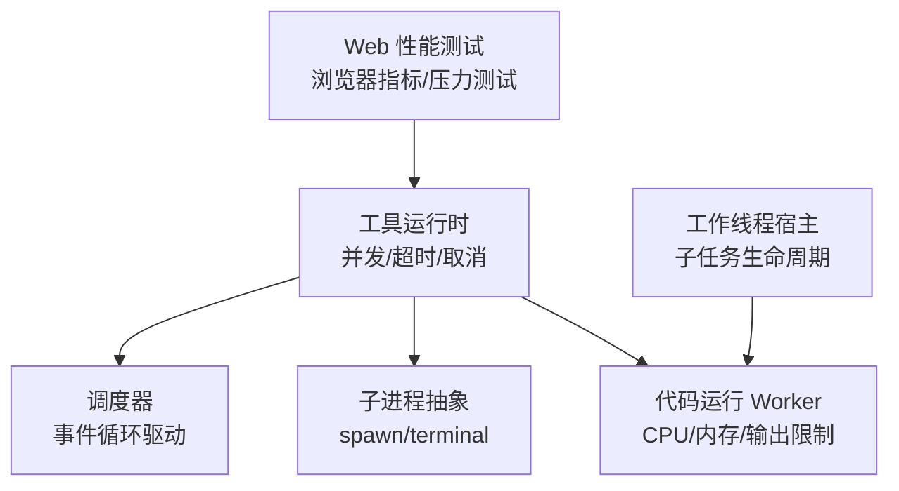
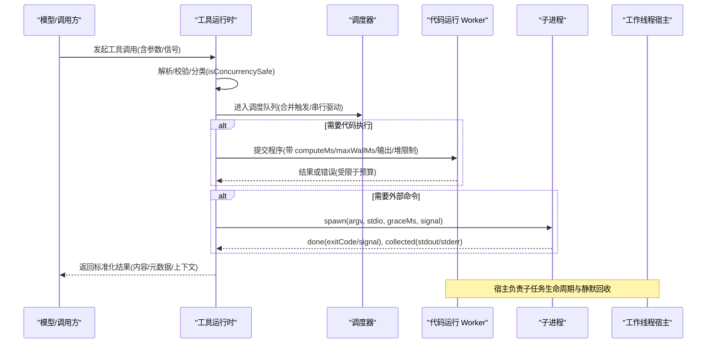
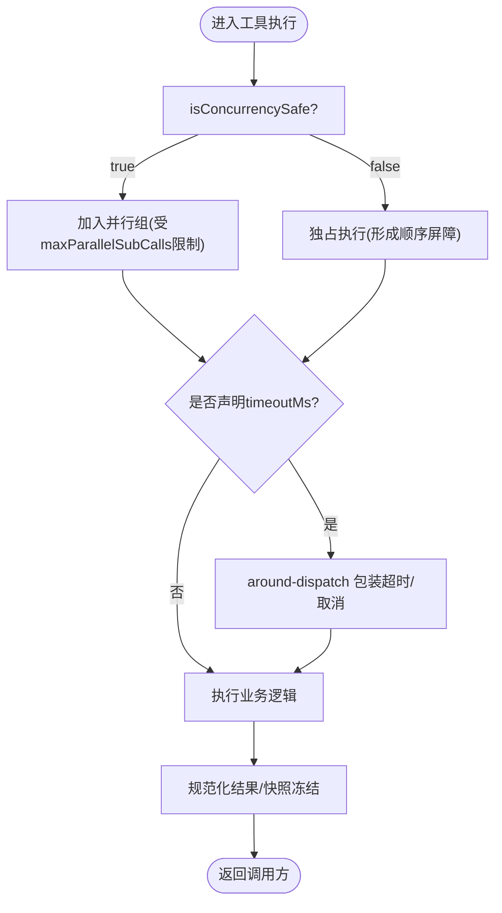
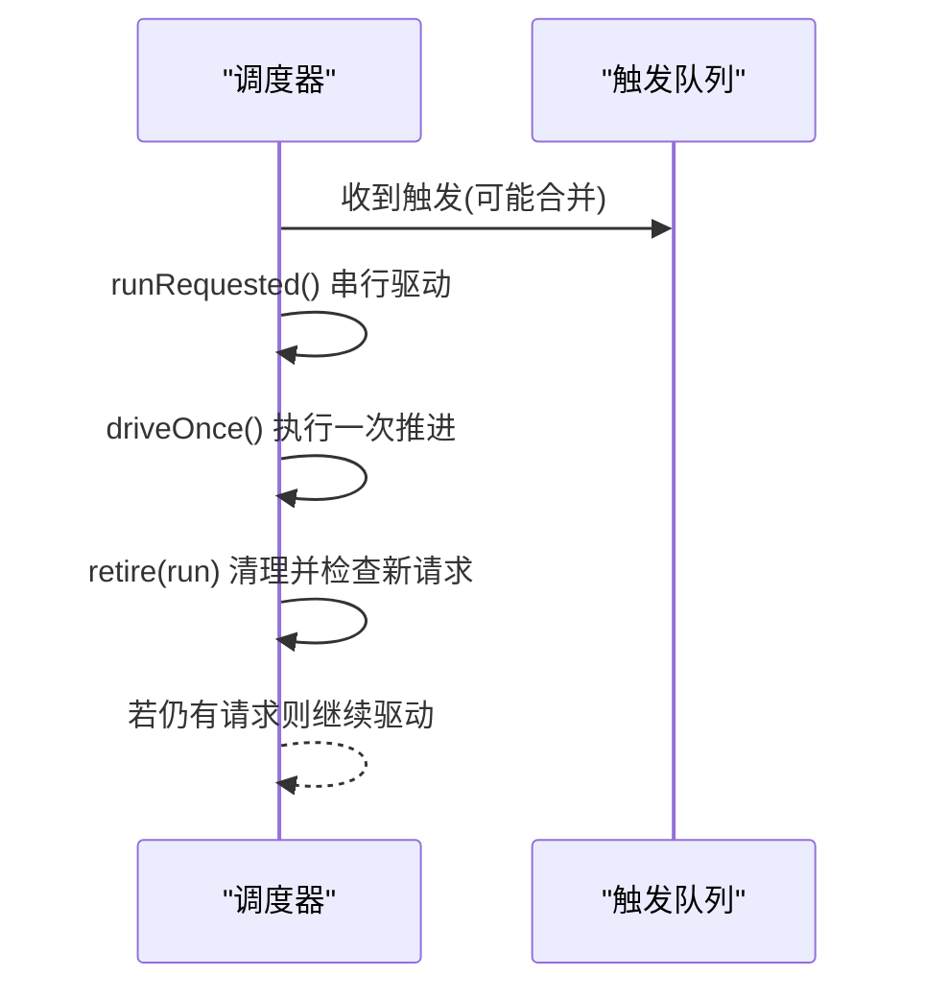
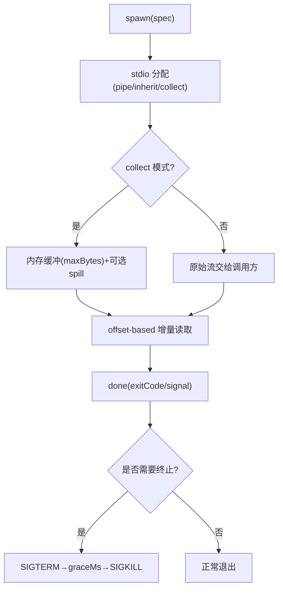
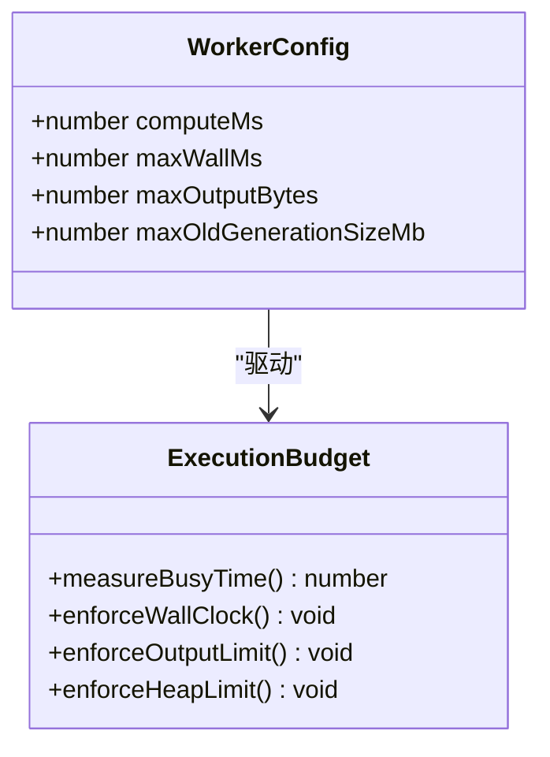
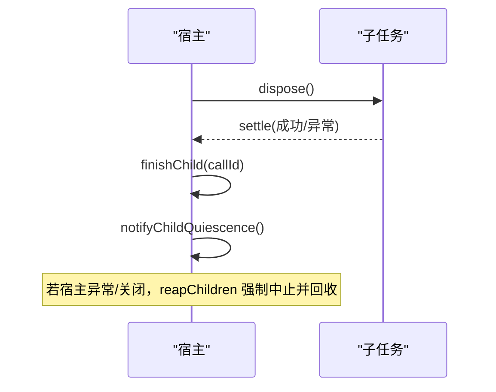
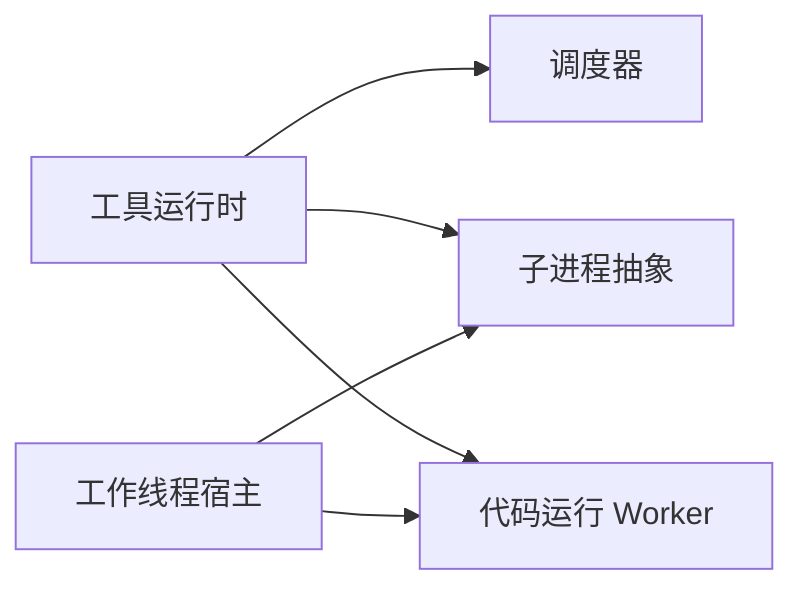

# 计算性能优化

<cite>
**本文引用的文件**
- [BENCHMARK.md](file://BENCHMARK.md)
- [vitest.web.perf.config.ts](file://vitest.web.perf.config.ts)
- [complex-history.perf.ts](file://apps/web/tests/complex-history.perf.ts)
- [reasoning-chunks.stress.ts](file://apps/web/stress-tests/reasoning-chunks.stress.ts)
- [index.ts（工具运行时）](file://packages/core/tools/src/index.ts)
- [runtime.ts（调度器）](file://packages/schedule/schedule/src/runtime.ts)
- [subprocess.md（子进程子系统文档）](file://docs/subsystems/subprocess.md)
- [index.ts（本地 Bash 执行器）](file://packages/shell/bash-local/src/index.ts)
- [index.ts（代码运行 Worker 配置）](file://packages/code-runtime/code-runtime-worker-thread/src/index.ts)
- [README.zh.md（代码运行 Worker 限制说明）](file://packages/code-runtime/code-runtime-worker-thread/README.zh.md)
- [host.ts（工作线程宿主）](file://packages/workflow/workflow-worker-thread/src/host.ts)
</cite>

## 目录
1. [简介](#简介)
2. [项目结构](#项目结构)
3. [核心组件](#核心组件)
4. [架构总览](#架构总览)
5. [详细组件分析](#详细组件分析)
6. [依赖关系分析](#依赖关系分析)
7. [性能考量](#性能考量)
8. [故障排查指南](#故障排查指南)
9. [结论](#结论)
10. [附录](#附录)

## 简介
本文件聚焦于计算性能优化，覆盖并行与异步策略、任务调度与线程池管理、CPU 利用率优化、算法层数据结构与复杂度优化、缓存策略、子进程资源限制与 I/O 调优，以及基准测试方法与瓶颈识别技巧。内容基于仓库中工具运行时、调度器、子进程抽象、代码运行 Worker、工作线程宿主与 Web 性能测试等实现进行系统化梳理。

## 项目结构
本项目将“计算性能”相关能力分散在多个子系统：
- 工具运行时与并发控制：通过工具注册表与执行管线提供并行/独占模式、最大并发子调用上限、超时与取消信号传播。
- 调度器：以单线程事件循环驱动定时任务，串行消费合并触发，避免抖动。
- 子进程：统一的 spawn/终端原语，支持输出收集、溢出落盘、树级终止与优雅退出。
- 代码运行 Worker：对 CPU 忙时、墙钟时间、输出大小、堆内存进行硬限制，保障隔离与可预测性。
- 工作线程宿主：子任务生命周期、销毁与静默回收，保证整体可终结。
- Web 性能测试：浏览器指标采集与压力测试入口，用于端到端性能证据。

**图表来源**
- [index.ts（工具运行时）:650-800](file://packages/core/tools/src/index.ts#L650-L800)
- [runtime.ts（调度器）:142-175](file://packages/schedule/schedule/src/runtime.ts#L142-L175)
- [subprocess.md（子进程子系统文档）:89-174](file://docs/subsystems/subprocess.md#L89-L174)
- [index.ts（代码运行 Worker 配置）:24-54](file://packages/code-runtime/code-runtime-worker-thread/src/index.ts#L24-L54)
- [host.ts（工作线程宿主）:426-484](file://packages/workflow/workflow-worker-thread/src/host.ts#L426-L484)
- [complex-history.perf.ts:515-568](file://apps/web/tests/complex-history.perf.ts#L515-L568)

**章节来源**
- [index.ts（工具运行时）:650-800](file://packages/core/tools/src/index.ts#L650-L800)
- [runtime.ts（调度器）:142-175](file://packages/schedule/schedule/src/runtime.ts#L142-L175)
- [subprocess.md（子进程子系统文档）:89-174](file://docs/subsystems/subprocess.md#L89-L174)
- [index.ts（代码运行 Worker 配置）:24-54](file://packages/code-runtime/code-runtime-worker-thread/src/index.ts#L24-L54)
- [host.ts（工作线程宿主）:426-484](file://packages/workflow/workflow-worker-thread/src/host.ts#L426-L484)
- [complex-history.perf.ts:515-568](file://apps/web/tests/complex-history.perf.ts#L515-L568)

## 核心组件
- 工具运行时与并发控制
  - 支持 per-call 的 isConcurrencySafe 分类，决定 parallel/exclusive 调度。
  - 提供 maxParallelSubCalls 上限，限制 run_code 程序内并发子调用窗口。
  - 统一超时与取消信号传播，确保可中断与可恢复。
- 调度器
  - 单线程事件循环驱动，合并触发后串行处理，降低抖动与上下文切换成本。
- 子进程
  - 统一 spawn/terminal 抽象，支持输出收集、溢出落盘、树级终止与优雅退出。
- 代码运行 Worker
  - 忙时 CPU 预算、墙钟上限、输出字节上限、旧代堆内存上限，保障隔离与可预测。
- 工作线程宿主
  - 子任务启动/销毁/静默回收，保证整体可终结与资源释放。
- Web 性能测试
  - 通过 CDP 采集浏览器指标，构造压测用例，作为端到端性能证据。

**章节来源**
- [index.ts（工具运行时）:256-288](file://packages/core/tools/src/index.ts#L256-L288)
- [index.ts（工具运行时）:666-674](file://packages/core/tools/src/index.ts#L666-L674)
- [runtime.ts（调度器）:142-175](file://packages/schedule/schedule/src/runtime.ts#L142-L175)
- [subprocess.md（子进程子系统文档）:89-174](file://docs/subsystems/subprocess.md#L89-L174)
- [index.ts（代码运行 Worker 配置）:24-54](file://packages/code-runtime/code-runtime-worker-thread/src/index.ts#L24-L54)
- [host.ts（工作线程宿主）:426-484](file://packages/workflow/workflow-worker-thread/src/host.ts#L426-L484)
- [complex-history.perf.ts:515-568](file://apps/web/tests/complex-history.perf.ts#L515-L568)

## 架构总览
下图展示从模型请求到工具执行、子进程与 Worker 执行的完整路径，以及调度器与宿主的生命周期管理。

**图表来源**
- [index.ts（工具运行时）:650-800](file://packages/core/tools/src/index.ts#L650-L800)
- [runtime.ts（调度器）:142-175](file://packages/schedule/schedule/src/runtime.ts#L142-L175)
- [subprocess.md（子进程子系统文档）:89-174](file://docs/subsystems/subprocess.md#L89-L174)
- [index.ts（代码运行 Worker 配置）:24-54](file://packages/code-runtime/code-runtime-worker-thread/src/index.ts#L24-L54)
- [host.ts（工作线程宿主）:426-484](file://packages/workflow/workflow-worker-thread/src/host.ts#L426-L484)

## 详细组件分析

### 工具运行时与并发控制
- 并发模式
  - 每个工具可通过 isConcurrencySafe(args) 声明是否允许与兄弟调用重叠；未声明或返回非真则走 exclusive 模式，形成顺序屏障。
  - 工具运行时维护 per-call 的执行模式，并在调度阶段决定并行或独占。
- 并发上限
  - maxParallelSubCalls 限制 run_code 程序内的并发子调用窗口，默认值有约束且必须为正整数。
- 超时与取消
  - 工具定义可声明 timeoutMs，由 around-dispatch 包装执行；所有异步阶段需监听 exec.signal，确保可中断与可恢复。
- 结果与呈现
  - 成功/失败结果均经过规范化与快照冻结，保证可重放与一致性。

**图表来源**
- [index.ts（工具运行时）:256-288](file://packages/core/tools/src/index.ts#L256-L288)
- [index.ts（工具运行时）:666-674](file://packages/core/tools/src/index.ts#L666-L674)

**章节来源**
- [index.ts（工具运行时）:256-288](file://packages/core/tools/src/index.ts#L256-L288)
- [index.ts（工具运行时）:666-674](file://packages/core/tools/src/index.ts#L666-L674)

### 调度器与事件循环
- 单线程驱动
  - 使用 runRequested 串行消费合并后的触发，避免并发竞争与重复唤醒。
- 保活与退役
  - retire 清理当前运行并检查是否有新的请求；isRunnable 确保仅在存活且未停止时继续推进。
- 定时器管理
  - clearTimer 安全清理已武装的定时器，防止泄漏。

**图表来源**
- [runtime.ts（调度器）:142-175](file://packages/schedule/schedule/src/runtime.ts#L142-L175)

**章节来源**
- [runtime.ts（调度器）:142-175](file://packages/schedule/schedule/src/runtime.ts#L142-L175)

### 子进程执行与资源限制
- 规格化 spawn
  - 完全显式的 SubprocessSpawnSpec：argv、cwd、stdio、graceMs、signal、env，无隐式默认，便于审计与调优。
- 输出收集与溢出
  - collect 模式支持 maxBytes 内存缓冲与可选 spillPath 全量落盘；offset-based 读取避免争用。
- 终止与优雅退出
  - terminate() 统一 SIGTERM→graceMs→SIGKILL 升级；waitForExit() 等待整棵进程树退出。
- Bash 执行器预算
  - LocalBashExecutor 为每次 spawn 注入超时、输出与 spill 预算，并在配置阶段做合法性断言。

**图表来源**
- [subprocess.md（子进程子系统文档）:89-174](file://docs/subsystems/subprocess.md#L89-L174)
- [index.ts（本地 Bash 执行器）:75-103](file://packages/shell/bash-local/src/index.ts#L75-L103)

**章节来源**
- [subprocess.md（子进程子系统文档）:89-174](file://docs/subsystems/subprocess.md#L89-L174)
- [index.ts（本地 Bash 执行器）:75-103](file://packages/shell/bash-local/src/index.ts#L75-L103)

### 代码运行 Worker 与 CPU/内存预算
- 预算维度
  - computeMs：基于 eventLoopUtilization 的忙时预算，公平且不可作弊。
  - maxWallMs：墙钟上限，兜底无法被忙时捕获的挂起场景。
  - maxOutputBytes：序列化日志/完成值/失败消息的硬上限。
  - maxOldGenerationSizeMb：Worker 旧代堆上限，超界直接杀死 Worker。
- 已知限制
  - 采样粒度固定（约 25ms），最多超过一个轮询间隔。
  - 中间绑定值无字节上限，需避免通过中间值耗尽内存。
  - 默认 64MiB 为拒绝边界，非可恢复存储。

**图表来源**
- [index.ts（代码运行 Worker 配置）:24-54](file://packages/code-runtime/code-runtime-worker-thread/src/index.ts#L24-L54)
- [README.zh.md（代码运行 Worker 限制说明）:47-55](file://packages/code-runtime/code-runtime-worker-thread/README.zh.md#L47-L55)

**章节来源**
- [index.ts（代码运行 Worker 配置）:24-54](file://packages/code-runtime/code-runtime-worker-thread/src/index.ts#L24-L54)
- [README.zh.md（代码运行 Worker 限制说明）:47-55](file://packages/code-runtime/code-runtime-worker-thread/README.zh.md#L47-L55)

### 工作线程宿主与子任务生命周期
- 子任务销毁
  - disposeChild 幂等执行，异常被包含并记录，最终 finishChild 移除记录并通知静默。
- 静默与回收
  - notifyChildQuiescence 在所有子任务与待启动任务结束后释放等待者。
- 批量终止
  - reapChildren 在宿主死亡或最终清理时中止并回收全部子任务。

**图表来源**
- [host.ts（工作线程宿主）:426-484](file://packages/workflow/workflow-worker-thread/src/host.ts#L426-L484)

**章节来源**
- [host.ts（工作线程宿主）:426-484](file://packages/workflow/workflow-worker-thread/src/host.ts#L426-L484)

### 算法层性能优化建议（结合现有机制）
- 数据结构选择
  - 优先使用只读/冻结结构（工具结果快照冻结）减少拷贝与竞态。
  - 子进程输出采用 offset-based 读取，避免锁与争用。
- 计算复杂度优化
  - 利用 isConcurrencySafe 将可并行的 I/O/CPU 任务拆分，配合 maxParallelSubCalls 控制并发度。
  - 对长耗时任务设置 computeMs 与 maxWallMs，避免热点阻塞事件循环。
- 缓存策略
  - 会话投影缓存按 turn/end 写回，冷启动时从 checkpoint+tail 恢复，减少重复计算。
  - 模块加载器具备模块表缓存，避免重复构建与导入。

**章节来源**
- [index.ts（工具运行时）:256-288](file://packages/core/tools/src/index.ts#L256-L288)
- [subprocess.md（子进程子系统文档）:176-218](file://docs/subsystems/subprocess.md#L176-L218)
- [index.ts（代码运行 Worker 配置）:24-54](file://packages/code-runtime/code-runtime-worker-thread/src/index.ts#L24-L54)

## 依赖关系分析
- 工具运行时依赖调度器进行任务编排，并通过子进程与代码运行 Worker 扩展执行域。
- 调度器仅依赖事件循环与最小状态机，保持低耦合与高吞吐。
- 子进程抽象屏蔽平台差异，供 Bash/LSP/PTY/ACP 等多消费者复用。
- 工作线程宿主与代码运行 Worker 协作，确保子任务生命周期可控。

**图表来源**
- [index.ts（工具运行时）:650-800](file://packages/core/tools/src/index.ts#L650-L800)
- [runtime.ts（调度器）:142-175](file://packages/schedule/schedule/src/runtime.ts#L142-L175)
- [subprocess.md（子进程子系统文档）:89-174](file://docs/subsystems/subprocess.md#L89-L174)
- [index.ts（代码运行 Worker 配置）:24-54](file://packages/code-runtime/code-runtime-worker-thread/src/index.ts#L24-L54)
- [host.ts（工作线程宿主）:426-484](file://packages/workflow/workflow-worker-thread/src/host.ts#L426-L484)

**章节来源**
- [index.ts（工具运行时）:650-800](file://packages/core/tools/src/index.ts#L650-L800)
- [runtime.ts（调度器）:142-175](file://packages/schedule/schedule/src/runtime.ts#L142-L175)
- [subprocess.md（子进程子系统文档）:89-174](file://docs/subsystems/subprocess.md#L89-L174)
- [index.ts（代码运行 Worker 配置）:24-54](file://packages/code-runtime/code-runtime-worker-thread/src/index.ts#L24-L54)
- [host.ts（工作线程宿主）:426-484](file://packages/workflow/workflow-worker-thread/src/host.ts#L426-L484)

## 性能考量
- 并行与异步
  - 合理声明 isConcurrencySafe，将 I/O 密集型与纯计算任务拆分；对共享状态访问加互斥或改为无共享设计。
  - 使用 maxParallelSubCalls 控制并发窗口，避免资源争用与上下文切换开销。
- 任务调度
  - 依赖调度器的串行驱动特性，避免在高频触发下产生抖动；合并触发可降低事件循环压力。
- CPU 利用率
  - 通过 computeMs 监控忙时 CPU，及时降级或中断热点任务；maxWallMs 兜底挂起场景。
- I/O 优化
  - 子进程输出采用 collect+spill 策略，避免大输出阻塞内存；offset-based 读取减少锁竞争。
- 缓存策略
  - 利用会话投影缓存的 checkpoint+tail 恢复机制，减少冷启动与回放成本；模块加载器缓存避免重复构建。

[本节为通用指导，不直接分析具体文件]

## 故障排查指南
- 工具调用超时/取消
  - 确认工具是否声明 timeoutMs 并正确转发 exec.signal；检查 around-dispatch 包装是否正确恢复信号。
- 并发超限
  - 检查 isConcurrencySafe 分类是否符合预期；调整 maxParallelSubCalls 以匹配系统负载。
- 子进程卡死
  - 确认 terminate() 与 waitForExit() 的使用；检查 graceMs 是否过小导致来不及优雅退出。
- Worker 崩溃
  - 关注 maxOldGenerationSizeMb 与 maxOutputBytes 是否过低；检查是否存在中间值占用过多内存。
- 宿主回收异常
  - 查看 disposeChild 的异常日志；确认 finishChild 是否被调用以释放等待者。

**章节来源**
- [index.ts（工具运行时）:256-288](file://packages/core/tools/src/index.ts#L256-L288)
- [subprocess.md（子进程子系统文档）:89-174](file://docs/subsystems/subprocess.md#L89-L174)
- [index.ts（代码运行 Worker 配置）:24-54](file://packages/code-runtime/code-runtime-worker-thread/src/index.ts#L24-L54)
- [host.ts（工作线程宿主）:426-484](file://packages/workflow/workflow-worker-thread/src/host.ts#L426-L484)

## 结论
该仓库在工具运行时、调度器、子进程抽象、代码运行 Worker 与工作线程宿主之间形成了清晰的分层与契约，提供了完善的并发控制、资源限制与生命周期管理能力。通过合理的 isConcurrencySafe 分类、maxParallelSubCalls 上限、computeMs/maxWallMs 预算、子进程输出收集与溢出策略，以及会话投影缓存，可以在多类负载下获得稳定且可预测的性能表现。配合 Web 性能测试与基准流程，可持续验证与优化关键路径。

[本节为总结，不直接分析具体文件]

## 附录

### 基准测试方法
- Python SDK 基准
  - 参考仓库根目录的基准说明，安装 SDK 并运行 jsonrpc-agent 最小变体，使用独立工作区与会话 ID 执行独立基准任务。
- Web 性能测试
  - 使用专用配置文件启用高性能测试集，延长钩子与测试超时，禁用控制台拦截以获得更真实的指标。
  - 通过 CDP 采集浏览器指标（如 TaskDuration、ScriptDuration、LayoutDuration、JSHeapUsedSize 等），构造前后对比测量。
- 压力测试
  - 使用 web stress-tests 中的用例作为响应性信号与可视化性能分析的入口，注意硬件与调度差异使其更适合显式性能证据。

**章节来源**
- [BENCHMARK.md:1-4](file://BENCHMARK.md#L1-L4)
- [vitest.web.perf.config.ts:1-16](file://vitest.web.perf.config.ts#L1-L16)
- [complex-history.perf.ts:515-568](file://apps/web/tests/complex-history.perf.ts#L515-L568)
- [reasoning-chunks.stress.ts](file://apps/web/stress-tests/reasoning-chunks.stress.ts)