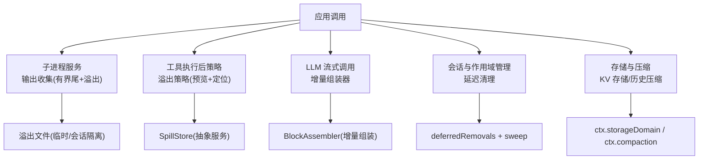
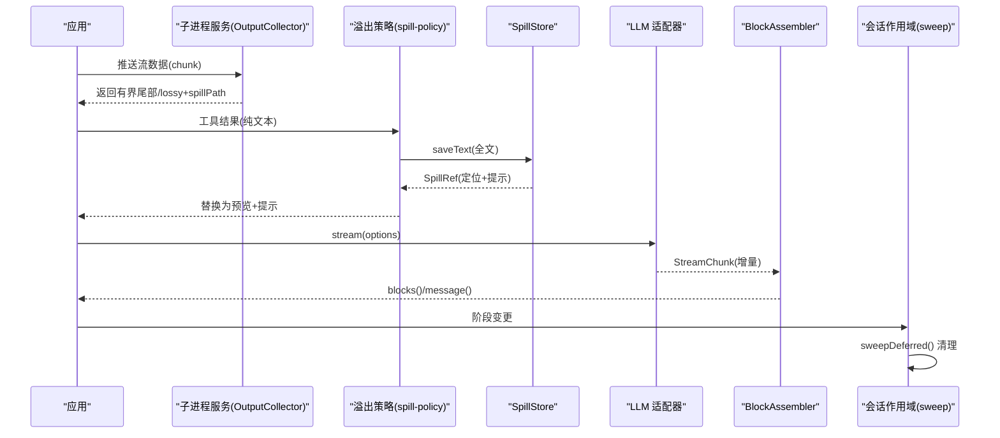
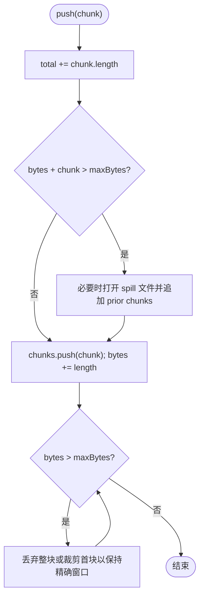
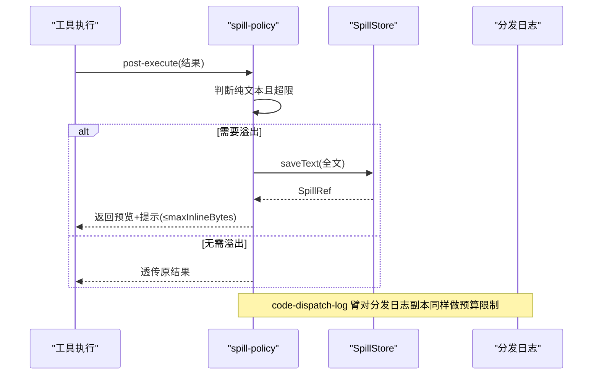
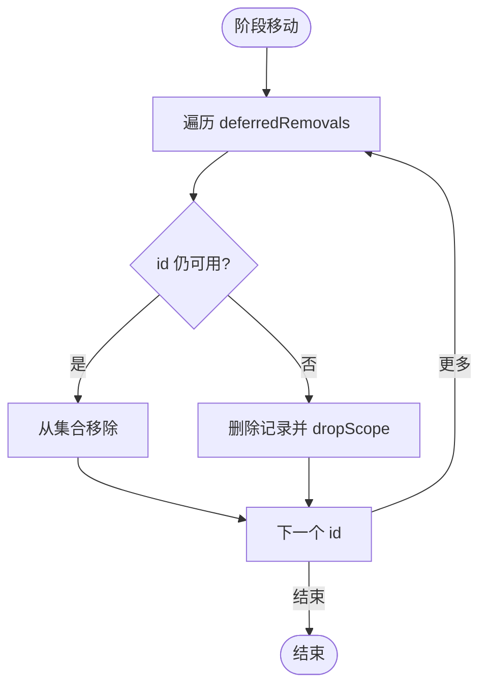
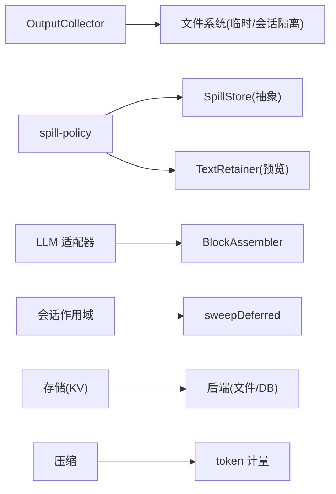

# 内存管理与优化

<cite>
**本文引用的文件**
- [packages/subprocess/subprocess-local/src/spawn.ts](file://packages/subprocess/subprocess-local/src/spawn.ts)
- [packages/spill/spill-policy/src/index.ts](file://packages/spill/spill-policy/src/index.ts)
- [docs/subsystems/spill.md](file://docs/subsystems/spill.md)
- [docs/subsystems/llm-streaming.md](file://docs/subsystems/llm-streaming.md)
- [docs/subsystems/compaction.md](file://docs/subsystems/compaction.md)
- [docs/subsystems/storage.md](file://docs/subsystems/storage.md)
- [packages/e2b/subprocess-e2b/tests/subprocess.spec.ts](file://packages/e2b/subprocess-e2b/tests/subprocess.spec.ts)
- [packages/client/runtime/src/client/sessions/service.ts](file://packages/client/runtime/src/client/sessions/service.ts)
- [packages/code-runtime/code-runtime-worker-thread/README.zh.md](file://packages/code-runtime/code-runtime-worker-thread/README.zh.md)
</cite>

## 目录
1. [简介](#简介)
2. [项目结构](#项目结构)
3. [核心组件](#核心组件)
4. [架构总览](#架构总览)
5. [详细组件分析](#详细组件分析)
6. [依赖关系分析](#依赖关系分析)
7. [性能考量](#性能考量)
8. [故障排查指南](#故障排查指南)
9. [结论](#结论)
10. [附录](#附录)

## 简介
本文件聚焦于流式数据处理中的内存管理策略与优化实践，覆盖缓冲区管理、溢出落盘（spill）、垃圾回收与资源释放、大数据量流式传输的内存控制、内存监控工具使用与性能分析方法，以及生产环境的内存调优指南。文档基于代码库中子进程输出收集、工具结果溢出策略、会话作用域清理、存储与压缩等关键实现进行系统化说明，并提供可操作的流程图与时序图以辅助理解。

## 项目结构
围绕内存管理的核心能力分布在以下子系统：
- 子进程输出收集与溢出：本地子进程的 stdout/stderr 流采用有界尾部保留与可选溢出文件，避免大输出撑爆内存。
- 工具结果溢出策略：对超出阈值的纯文本工具结果进行“头部+尾部”预览替换，并将完整内容保存到会话级 spill 存储。
- LLM 流式协议与组装：通过流式块协议与增量组装器，边到边消费数据，减少中间态驻留。
- 会话与作用域清理：延迟移除与扫描机制确保不再使用的对象及时释放。
- 存储与压缩：持久化与历史压缩降低上下文占用，配合 token 计量进行容量控制。



**图示来源**
- [packages/subprocess/subprocess-local/src/spawn.ts:94-250](file://packages/subprocess/subprocess-local/src/spawn.ts#L94-L250)
- [packages/spill/spill-policy/src/index.ts:110-232](file://packages/spill/spill-policy/src/index.ts#L110-L232)
- [docs/subsystems/llm-streaming.md:154-308](file://docs/subsystems/llm-streaming.md#L154-L308)
- [packages/client/runtime/src/client/sessions/service.ts:768-791](file://packages/client/runtime/src/client/sessions/service.ts#L768-L791)
- [docs/subsystems/storage.md:9-47](file://docs/subsystems/storage.md#L9-L47)
- [docs/subsystems/compaction.md:60-87](file://docs/subsystems/compaction.md#L60-L87)

**章节来源**
- [packages/subprocess/subprocess-local/src/spawn.ts:94-250](file://packages/subprocess/subprocess-local/src/spawn.ts#L94-L250)
- [packages/spill/spill-policy/src/index.ts:110-232](file://packages/spill/spill-policy/src/index.ts#L110-L232)
- [docs/subsystems/llm-streaming.md:154-308](file://docs/subsystems/llm-streaming.md#L154-L308)
- [packages/client/runtime/src/client/sessions/service.ts:768-791](file://packages/client/runtime/src/client/sessions/service.ts#L768-L791)
- [docs/subsystems/storage.md:9-47](file://docs/subsystems/storage.md#L9-L47)
- [docs/subsystems/compaction.md:60-87](file://docs/subsystems/compaction.md#L60-L87)

## 核心组件
- 子进程输出收集器（OutputCollector）
  - 维护有界内存尾部（chunks），超过阈值时打开溢出文件并追加写入；读取时支持从整体字节坐标恢复，必要时标记 lossy 并提示 spillPath。
- 工具结果溢出策略（spill-policy）
  - 在工具执行后拦截纯文本结果，若超过 maxInlineBytes，则保存全文至 SpillStore，并以“头部+尾部+提示”的预览替换原结果，保证模型上下文不膨胀。
- LLM 流式协议与 BlockAssembler
  - 将 StreamChunk 增量组装为 ContentBlock，避免全量驻留；finish/usage 顺序严格约束，错误归一化为 LlmFailure。
- 会话作用域清理（deferred removal + sweep）
  - 延迟移除集合在阶段移动时触发清理，确保不再被引用的作用域及时释放。
- 存储与压缩
  - KV 存储提供原子写与事件通知；压缩在压力或上下文溢出时选择安全范围生成摘要，减少历史占用。

**章节来源**
- [packages/subprocess/subprocess-local/src/spawn.ts:104-250](file://packages/subprocess/subprocess-local/src/spawn.ts#L104-L250)
- [packages/spill/spill-policy/src/index.ts:110-232](file://packages/spill/spill-policy/src/index.ts#L110-L232)
- [docs/subsystems/llm-streaming.md:154-308](file://docs/subsystems/llm-streaming.md#L154-L308)
- [packages/client/runtime/src/client/sessions/service.ts:768-791](file://packages/client/runtime/src/client/sessions/service.ts#L768-L791)
- [docs/subsystems/storage.md:9-47](file://docs/subsystems/storage.md#L9-L47)
- [docs/subsystems/compaction.md:60-87](file://docs/subsystems/compaction.md#L60-L87)

## 架构总览
下图展示流式处理中的内存控制路径：子进程输出进入 OutputCollector，按阈值决定是否落盘；工具结果经 spill-policy 判断是否溢出；LLM 流通过 BlockAssembler 增量组装；会话作用域由 sweep 定期清理；存储与压缩负责持久化与历史缩减。



**图示来源**
- [packages/subprocess/subprocess-local/src/spawn.ts:131-218](file://packages/subprocess/subprocess-local/src/spawn.ts#L131-L218)
- [packages/spill/spill-policy/src/index.ts:190-231](file://packages/spill/spill-policy/src/index.ts#L190-L231)
- [docs/subsystems/llm-streaming.md:154-308](file://docs/subsystems/llm-streaming.md#L154-L308)
- [packages/client/runtime/src/client/sessions/service.ts:768-791](file://packages/client/runtime/src/client/sessions/service.ts#L768-L791)

## 详细组件分析

### 子进程输出收集与溢出（OutputCollector）
- 设计要点
  - 有界内存尾部：仅保留最近 N 字节，超出部分丢弃或裁剪首块以保持精确窗口。
  - 溢出文件：首次超限时创建私有临时文件，追加所有 chunk；当总量超过 spill 上限时停止并清理。
  - 读取接口：支持从整体字节坐标增量读取，若偏移已滑出内存窗口则标记 lossy，并通过 spillPath 恢复缺失部分。
- 复杂度与性能
  - push 均摊 O(1)，但可能触发一次 spillAll（追加 prior chunks）。
  - readFrom 在 lossy=false 时为 subarray，O(1)；lossy=true 时拼接全部 chunks，O(n)。
- 错误与边界
  - 关闭 spill 文件失败时隐藏 spillPath，避免不可靠引用；删除失败最多残留受控大小的文件。



**图示来源**
- [packages/subprocess/subprocess-local/src/spawn.ts:131-153](file://packages/subprocess/subprocess-local/src/spawn.ts#L131-L153)
- [packages/subprocess/subprocess-local/src/spawn.ts:155-197](file://packages/subprocess/subprocess-local/src/spawn.ts#L155-L197)

**章节来源**
- [packages/subprocess/subprocess-local/src/spawn.ts:104-250](file://packages/subprocess/subprocess-local/src/spawn.ts#L104-L250)
- [packages/e2b/subprocess-e2b/tests/subprocess.spec.ts:362-385](file://packages/e2b/subprocess-e2b/tests/subprocess.spec.ts#L362-L385)
- [packages/e2b/subprocess-e2b/tests/subprocess.spec.ts:731-755](file://packages/e2b/subprocess-e2b/tests/subprocess.spec.ts#L731-L755)

### 工具结果溢出策略（spill-policy）
- 设计要点
  - 仅在纯文本结果且超过 maxInlineBytes 时触发；跳过嵌套复合调用与 read 工具以避免循环。
  - 保存全文到 SpillStore，并用“头部+尾部+提示”的预览替换原结果，确保模型上下文不超过预算。
  - 日志臂（code-dispatch-log）对分发日志中的子调用结果也做相同限制，不影响程序返回值。
- 健壮性
  - 无 session owner、无后端或保存失败时，保持原始内联结果，绝不让成功调用变为错误。
  - 预留提示行字节预算，确保替换后的总大小不超过 cap。



**图示来源**
- [packages/spill/spill-policy/src/index.ts:190-231](file://packages/spill/spill-policy/src/index.ts#L190-L231)
- [docs/subsystems/spill.md:81-86](file://docs/subsystems/spill.md#L81-L86)

**章节来源**
- [packages/spill/spill-policy/src/index.ts:110-232](file://packages/spill/spill-policy/src/index.ts#L110-L232)
- [docs/subsystems/spill.md:81-86](file://docs/subsystems/spill.md#L81-L86)

### LLM 流式协议与增量组装（BlockAssembler）
- 设计要点
  - StreamChunk 包含 text-delta、reasoning-delta、tool-call-delta、block-start/end、usage、finish 等类型，index 关联块，block-end 携带完整块。
  - BlockAssembler 增量折叠 delta 为 ContentBlock，容忍畸形流（忽略已关闭块的后续 delta），防止内存无限增长。
  - usage 必须在 finish 之前；空完成视为可重试错误；上下文溢出统一为 CONTEXT_WINDOW_EXCEEDED。
- 内存影响
  - 增量组装避免构建完整请求体；finish 后才产出最终消息，便于流式消费与回退。

```mermaid
classDiagram
class BlockAssembler {
+push(chunk)
+blocks()
+get usage
+get finish
+get replayState
+message(source)
}
class StreamChunk {
<<union>>
"block-start"
"text-delta"
"reasoning-delta"
"tool-call-delta"
"block-end"
"usage"
"finish"
}
BlockAssembler --> StreamChunk : "消费"
```

**图示来源**
- [docs/subsystems/llm-streaming.md:154-308](file://docs/subsystems/llm-streaming.md#L154-L308)

**章节来源**
- [docs/subsystems/llm-streaming.md:154-308](file://docs/subsystems/llm-streaming.md#L154-L308)

### 会话作用域清理（deferred removal + sweep）
- 设计要点
  - 延迟移除集合记录待清理的作用域 ID；阶段移动时触发 sweep，检查是否仍可用，否则删除并释放。
  - 防御性保护：当前 watched 的 ID 不会被误删；重复删除路径被阻止。
- 内存影响
  - 及时释放不再引用的作用域，避免长期持有导致内存泄漏。



**图示来源**
- [packages/client/runtime/src/client/sessions/service.ts:768-791](file://packages/client/runtime/src/client/sessions/service.ts#L768-L791)

**章节来源**
- [packages/client/runtime/src/client/sessions/service.ts:768-791](file://packages/client/runtime/src/client/sessions/service.ts#L768-L791)

### 存储与压缩（Storage & Compaction）
- 存储
  - KV 存储提供原子写与事件通知；读操作从权威内存状态同步，写队列串行化，保证一致性。
- 压缩
  - 在压力或上下文溢出时，选择安全范围生成摘要，替换表面节点；工具结果剪枝可减少 Unicode 字符占用。
- 内存影响
  - 通过 KV 持久化与历史压缩，降低长会话的上下文与内存占用。

**章节来源**
- [docs/subsystems/storage.md:9-47](file://docs/subsystems/storage.md#L9-L47)
- [docs/subsystems/compaction.md:60-87](file://docs/subsystems/compaction.md#L60-L87)

## 依赖关系分析
- OutputCollector 依赖文件系统（临时目录、随机文件名、权限控制）与 Node 子进程管道。
- spill-policy 依赖 SpillStore 抽象与 output-retention 的 TextRetainer，用于生成头尾预览。
- LLM 流式协议依赖适配器与 BlockAssembler，确保增量组装与错误归一化。
- 会话清理依赖生命周期钩子与阶段管理。
- 存储与压缩依赖 domain facility 与 backend 路由。



**图示来源**
- [packages/subprocess/subprocess-local/src/spawn.ts:155-197](file://packages/subprocess/subprocess-local/src/spawn.ts#L155-L197)
- [packages/spill/spill-policy/src/index.ts:110-232](file://packages/spill/spill-policy/src/index.ts#L110-L232)
- [docs/subsystems/llm-streaming.md:154-308](file://docs/subsystems/llm-streaming.md#L154-L308)
- [packages/client/runtime/src/client/sessions/service.ts:768-791](file://packages/client/runtime/src/client/sessions/service.ts#L768-L791)
- [docs/subsystems/storage.md:9-47](file://docs/subsystems/storage.md#L9-L47)
- [docs/subsystems/compaction.md:60-87](file://docs/subsystems/compaction.md#L60-L87)

**章节来源**
- [packages/subprocess/subprocess-local/src/spawn.ts:155-197](file://packages/subprocess/subprocess-local/src/spawn.ts#L155-L197)
- [packages/spill/spill-policy/src/index.ts:110-232](file://packages/spill/spill-policy/src/index.ts#L110-L232)
- [docs/subsystems/llm-streaming.md:154-308](file://docs/subsystems/llm-streaming.md#L154-L308)
- [packages/client/runtime/src/client/sessions/service.ts:768-791](file://packages/client/runtime/src/client/sessions/service.ts#L768-L791)
- [docs/subsystems/storage.md:9-47](file://docs/subsystems/storage.md#L9-L47)
- [docs/subsystems/compaction.md:60-87](file://docs/subsystems/compaction.md#L60-L87)

## 性能考量
- 流式消费优先：尽量使用流式 API（如 LLM 流、子进程管道）以减少峰值内存。
- 有界尾部与溢出：合理设置 maxBytes 与 spill 上限，平衡诊断需求与内存占用。
- 增量组装：利用 BlockAssembler 避免全量拼接；关注畸形流的容错。
- 作用域清理：确保阶段切换时触发 sweep，避免悬挂引用。
- 压缩与剪枝：在压力或溢出时启用压缩与工具结果剪枝，降低上下文体积。
- 运行时限制：注意 worker 线程默认拒绝边界（例如 64 MiB），超出部分不会到达落盘层，需在上层控制输入规模。

[本节为通用指导，不直接分析具体文件]

## 故障排查指南
- 子进程输出丢失
  - 现象：readFrom 返回 lossy=true 且存在 spillPath。
  - 处理：通过 spillPath 读取缺失部分；确认 spill 未被关闭或损坏。
- 工具结果未溢出
  - 现象：模型上下文仍过大。
  - 处理：检查 maxInlineBytes 配置；确认结果为纯文本且未被嵌套调用或 read 工具绕过。
- LLM 流异常
  - 现象：finish 前无 usage 或出现空完成。
  - 处理：遵循适配器契约；空完成应视为可重试错误；上下文溢出统一码值处理。
- 作用域未释放
  - 现象：内存持续增长。
  - 处理：确认阶段移动触发 sweep；检查是否有悬挂引用或监听器未移除。
- 存储写入失败
  - 现象：KV 写拒绝或版本不匹配。
  - 处理：检查后端可用性、权限与版本；根据错误码重试或降级。

**章节来源**
- [packages/subprocess/subprocess-local/src/spawn.ts:199-250](file://packages/subprocess/subprocess-local/src/spawn.ts#L199-L250)
- [packages/spill/spill-policy/src/index.ts:190-231](file://packages/spill/spill-policy/src/index.ts#L190-L231)
- [docs/subsystems/llm-streaming.md:154-308](file://docs/subsystems/llm-streaming.md#L154-L308)
- [packages/client/runtime/src/client/sessions/service.ts:768-791](file://packages/client/runtime/src/client/sessions/service.ts#L768-L791)
- [docs/subsystems/storage.md:9-47](file://docs/subsystems/storage.md#L9-L47)

## 结论
该代码库通过有界尾部、溢出落盘、流式增量组装、作用域清理与压缩剪枝等多重机制，构建了稳健的内存管理方案。生产环境应结合业务负载合理配置阈值，启用溢出与压缩，并持续监控内存与 token 使用情况，确保在大数据量流式场景下稳定运行。

[本节为总结，不直接分析具体文件]

## 附录
- 生产环境内存调优建议
  - 设置合理的 maxBytes 与 spill 上限，依据典型输出规模与诊断需求调整。
  - 启用 spill-policy 的 maxInlineBytes，避免超大文本进入模型上下文。
  - 开启压缩与工具结果剪枝，在压力或溢出时自动缩减历史。
  - 监控 LLM 流式 usage 与 finish，及时处理空完成与上下文溢出。
  - 定期检查作用域清理是否生效，避免悬挂引用。
  - 对于 worker 线程，注意默认拒绝边界，上层需控制输入规模。

[本节为通用指导，不直接分析具体文件]