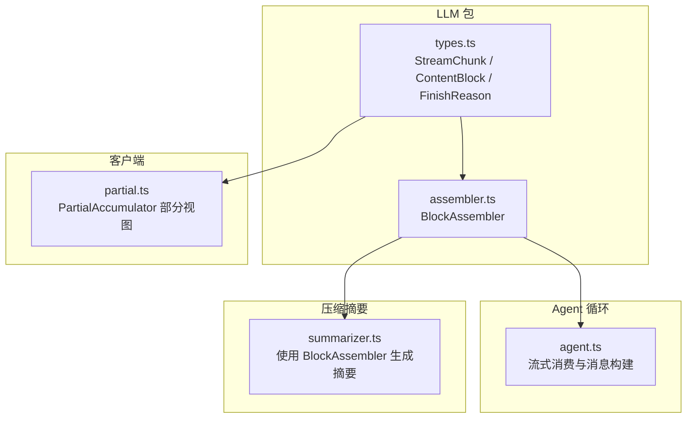
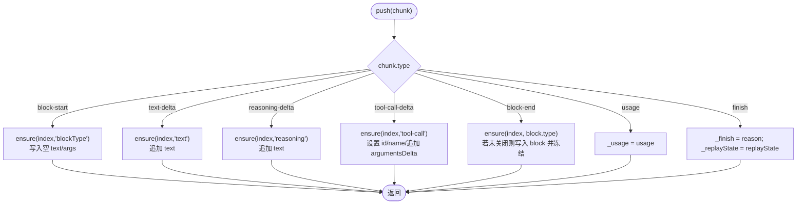
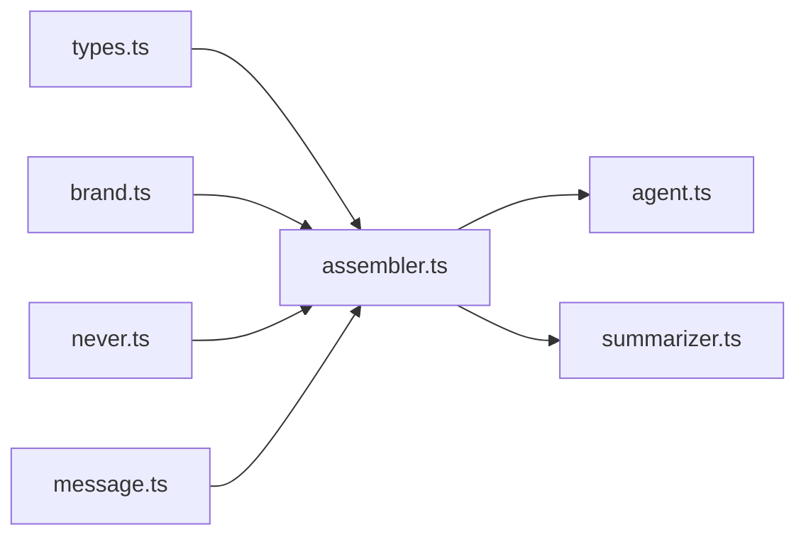

# 块组装器实现

<cite>
**本文引用的文件**
- [packages/llm/llm/src/assembler.ts](file://packages/llm/llm/src/assembler.ts)
- [packages/llm/llm/src/types.ts](file://packages/llm/llm/src/types.ts)
- [packages/llm/llm/tests/assembler.spec.ts](file://packages/llm/llm/tests/assembler.spec.ts)
- [packages/llm/llm/tests/properties.spec.ts](file://packages/llm/llm/tests/properties.spec.ts)
- [packages/core/agent-loop/src/agent.ts](file://packages/core/agent-loop/src/agent.ts)
- [packages/client/runtime/src/client/sessions/partial.ts](file://packages/client/runtime/src/client/sessions/partial.ts)
- [packages/compaction/compaction-basic/src/summarizer.ts](file://packages/compaction/compaction-basic/src/summarizer.ts)
</cite>

## 目录
1. [简介](#简介)
2. [项目结构](#项目结构)
3. [核心组件](#核心组件)
4. [架构总览](#架构总览)
5. [详细组件分析](#详细组件分析)
6. [依赖关系分析](#依赖关系分析)
7. [性能考量](#性能考量)
8. [故障排查指南](#故障排查指南)
9. [结论](#结论)
10. [附录](#附录)

## 简介
本文件围绕 BlockAssembler 类的设计与实现，系统性阐述其如何增量地将流式数据块（StreamChunk）组装为完整的助手消息内容块（ContentBlock），并覆盖文本块、推理块、工具调用块的组装策略、合并规则、状态管理与生命周期处理。同时说明其在代理循环中的使用方式、并发与线程安全特性、以及面向扩展的优化建议。文档还包含客户端 PartialAccumulator 的对比视角，帮助理解“最终消息”和“UI 部分视图”的不同职责。

## 项目结构
- 核心实现位于 llm 包：
  - assembler.ts：BlockAssembler 的核心算法与状态机
  - types.ts：流式协议 StreamChunk、内容块类型、完成原因等类型定义
- 测试用例：
  - assembler.spec.ts：单元行为验证
  - properties.spec.ts：基于属性的健壮性验证（乱序、重复索引、尾随 delta 等）
- 上层集成：
  - agent-loop/agent.ts：在代理循环中消费流式输出，构建助手消息
  - compaction/compaction-basic/summarizer.ts：压缩摘要场景下对 BlockAssembler 的使用
- 客户端侧：
  - client/runtime/partial.ts：PartialAccumulator，用于 UI 的部分视图累积与快照稳定



图表来源
- [packages/llm/llm/src/assembler.ts:1-165](file://packages/llm/llm/src/assembler.ts#L1-L165)
- [packages/llm/llm/src/types.ts:283-303](file://packages/llm/llm/src/types.ts#L283-L303)
- [packages/core/agent-loop/src/agent.ts:340-399](file://packages/core/agent-loop/src/agent.ts#L340-L399)
- [packages/compaction/compaction-basic/src/summarizer.ts:140-182](file://packages/compaction/compaction-basic/src/summarizer.ts#L140-L182)
- [packages/client/runtime/src/client/sessions/partial.ts:22-102](file://packages/client/runtime/src/client/sessions/partial.ts#L22-L102)

章节来源
- [packages/llm/llm/src/assembler.ts:1-165](file://packages/llm/llm/src/assembler.ts#L1-L165)
- [packages/llm/llm/src/types.ts:283-303](file://packages/llm/llm/src/types.ts#L283-L303)

## 核心组件
- BlockAssembler：增量组装器，维护每个 index 对应的“部分块”（PartialBlock），支持文本、推理、工具调用三类块；提供 blocks()、message()、usage、finish、replayState 等访问器。
- StreamChunk：适配器输出的原始流式片段，包括 block-start、text-delta、reasoning-delta、tool-call-delta、block-end、usage、finish。
- PartialAccumulator：客户端 UI 的部分视图累积器，负责将相同类型的 StreamChunk 折叠为 AssistantBlock[]，并提供稳定的快照引用。

章节来源
- [packages/llm/llm/src/assembler.ts:15-165](file://packages/llm/llm/src/assembler.ts#L15-L165)
- [packages/llm/llm/src/types.ts:283-303](file://packages/llm/llm/src/types.ts#L283-L303)
- [packages/client/runtime/src/client/sessions/partial.ts:22-102](file://packages/client/runtime/src/client/sessions/partial.ts#L22-L102)

## 架构总览
BlockAssembler 作为“协议形状”的增量组装器，被 Agent 循环在每次模型调用时创建并逐块推送，最终产出 assistant 消息。压缩摘要流程同样复用该组装器以获取结构化输出。客户端 PartialAccumulator 则独立维护 UI 可见的部分视图，与最终消息解耦。

```mermaid
sequenceDiagram
participant Loop as "Agent 循环"
participant Adapter as "LLM 适配器"
participant Asm as "BlockAssembler"
participant Msg as "助手消息"
Loop->>Adapter : 发起流式请求
loop 接收流式片段
Adapter-->>Loop : StreamChunk
Loop->>Asm : push(chunk)
end
Note over Asm : 内部维护 partials/order/_usage/_finish/_replayState
Loop->>Asm : blocks()/message()
Asm-->>Loop : ContentBlock[] / Message
Loop->>Msg : createAssistantMessage(content=blocks())
Loop-->>Adapter : 结束
```

图表来源
- [packages/core/agent-loop/src/agent.ts:340-399](file://packages/core/agent-loop/src/agent.ts#L340-L399)
- [packages/llm/llm/src/assembler.ts:47-165](file://packages/llm/llm/src/assembler.ts#L47-L165)

## 详细组件分析

### BlockAssembler 设计与状态机
- 数据结构
  - partials：Map<number, PartialBlock>，按 index 缓存当前未闭合或部分闭合的块
  - order：number[]，记录首次出现的 index 顺序，保证输出顺序与流一致
  - _usage：TokenUsage | undefined，统计信息
  - _finish：FinishReason，默认 {kind:'stop'}，记录终止原因
  - _replayState：unknown，适配器私有回放状态
- 关键方法
  - push(chunk)：根据 chunk.type 分派到不同分支，更新对应 index 的 PartialBlock 或全局状态
  - ensure(index, blockType)：懒初始化 PartialBlock，若不存在则创建并加入 order
  - assemble(partial, index)：将 PartialBlock 转换为最终 ContentBlock；未知 blockType 会抛错
  - blocks()：按 order 组装所有块；当 finish.kind === 'max-tokens' 时过滤掉 tool-call 块
  - message(source)：基于 blocks() 构造冻结的 assistant 角色消息
- 容错与不变量
  - 忽略 block-end 之后的同 index 的后续 delta（防止畸形流污染已闭合块）
  - 重复 block-start 对同一 index 无副作用
  - mustGet 断言 order 中每个 index 都有 partial，否则抛出不变量错误



图表来源
- [packages/llm/llm/src/assembler.ts:47-94](file://packages/llm/llm/src/assembler.ts#L47-L94)
- [packages/llm/llm/src/assembler.ts:96-119](file://packages/llm/llm/src/assembler.ts#L96-L119)

章节来源
- [packages/llm/llm/src/assembler.ts:15-165](file://packages/llm/llm/src/assembler.ts#L15-L165)
- [packages/llm/llm/tests/assembler.spec.ts:4-118](file://packages/llm/llm/tests/assembler.spec.ts#L4-L118)

### 不同类型块的组装逻辑
- 文本块（text）
  - 通过 text-delta 累积 text；若无显式 block-start/end，也能隐式形成单块
- 推理块（reasoning）
  - reasoning-delta 累积 text；与 text 块相互独立，共享 index 隔离机制
- 工具调用块（tool-call）
  - tool-call-delta 累积 id、name、argumentsDelta；id 缺失时使用 call-{index} 回退
  - block-end 可携带权威块，优先采用；若 finish.kind === 'max-tokens'，blocks() 会过滤 tool-call 块以保证安全性

章节来源
- [packages/llm/llm/src/assembler.ts:60-81](file://packages/llm/llm/src/assembler.ts#L60-L81)
- [packages/llm/llm/src/assembler.ts:106-139](file://packages/llm/llm/src/assembler.ts#L106-L139)
- [packages/llm/llm/tests/assembler.spec.ts:5-30](file://packages/llm/llm/tests/assembler.spec.ts#L5-L30)
- [packages/llm/llm/tests/assembler.spec.ts:93-111](file://packages/llm/llm/tests/assembler.spec.ts#L93-L111)

### 合并策略与幂等性
- 幂等读取：blocks() 多次调用结果一致；message().content 与 blocks() 保持一致
- 去重与覆盖：
  - 重复 block-start 对同一 index 无影响
  - 首个 block-end 生效，后续重复 block-end 被忽略，确保流式输出与最终输出一致
- 尾部容忍：block-end 后的同 index delta 被忽略，避免畸形流破坏已闭合块

章节来源
- [packages/llm/llm/tests/properties.spec.ts:60-81](file://packages/llm/llm/tests/properties.spec.ts#L60-L81)
- [packages/llm/llm/tests/assembler.spec.ts:82-101](file://packages/llm/llm/tests/assembler.spec.ts#L82-L101)
- [packages/llm/llm/tests/assembler.spec.ts:136-147](file://packages/llm/llm/tests/assembler.spec.ts#L136-L147)

### 状态管理与生命周期
- 生命周期
  - 创建：每轮模型调用创建一个实例
  - 推进：逐块 push(chunk)，记录 usage/finish/replayState
  - 终结：循环结束后读取 blocks()/message()/usage/finish
- 状态字段
  - partials/order：块级增量状态
  - _usage/_finish/_replayState：全局元数据与回放状态
- 异常路径
  - 未知 blockType 无法从部分 delta 组装时抛错
  - mustGet 断言失败时抛错，保护不变量

章节来源
- [packages/core/agent-loop/src/agent.ts:340-399](file://packages/core/agent-loop/src/agent.ts#L340-L399)
- [packages/llm/llm/src/assembler.ts:121-165](file://packages/llm/llm/src/assembler.ts#L121-L165)
- [packages/llm/llm/tests/assembler.spec.ts:64-80](file://packages/llm/llm/tests/assembler.spec.ts#L64-L80)

### 并发处理与线程安全
- 设计假设
  - Node.js 事件循环单线程执行；BlockAssembler 不引入锁或异步竞态
  - 每个流一个实例，避免跨流共享状态
- 并发实践
  - 在 for await 循环中同步 push，配合 AbortSignal 检查中断
  - 对外暴露的 blocks()/message() 为纯读操作，无副作用
- 风险点
  - 外部并发修改同一实例会导致不一致；应遵循“一实例一流”的约定

章节来源
- [packages/core/agent-loop/src/agent.ts:340-399](file://packages/core/agent-loop/src/agent.ts#L340-L399)
- [packages/llm/llm/src/assembler.ts:36-42](file://packages/llm/llm/src/assembler.ts#L36-L42)

### 与客户端 PartialAccumulator 的关系
- 职责分离
  - BlockAssembler：构建最终的 assistant 消息内容块（含 tool-call、usage、finish）
  - PartialAccumulator：构建 UI 可见的部分视图（AssistantBlock[]），保持快照引用稳定
- 差异点
  - PartialAccumulator 对 unknown blockType 降级为 other，不影响渲染
  - 对 usage/finish 等不可见变更直接返回 false，减少通知开销
  - 稀疏数组 + 压缩，保证渲染顺序稳定

章节来源
- [packages/client/runtime/src/client/sessions/partial.ts:22-102](file://packages/client/runtime/src/client/sessions/partial.ts#L22-L102)
- [packages/client/runtime/tests/partial.client.spec.ts:12-97](file://packages/client/runtime/tests/partial.client.spec.ts#L12-L97)

### 扩展新块类型的步骤
- 新增块类型需满足的条件
  - 在 StreamChunk 的 blockType 中声明新类型
  - 在 BlockAssembler.assemble 中增加分支，支持从部分 delta 组装或要求 block-end 权威块
  - 在 PartialAccumulator.emptyAssistantBlock 中提供 UI 初始投影
- 示例路径
  - 参考现有 text/reasoning/tool-call 的实现模式
  - 若新类型需要强制 block-end，可在 assemble 中拒绝未闭合的情况

章节来源
- [packages/llm/llm/src/assembler.ts:106-119](file://packages/llm/llm/src/assembler.ts#L106-L119)
- [packages/client/runtime/src/client/sessions/partial.ts:110-117](file://packages/client/runtime/src/client/sessions/partial.ts#L110-L117)
- [packages/llm/llm/tests/assembler.spec.ts:64-70](file://packages/llm/llm/tests/assembler.spec.ts#L64-L70)

## 依赖关系分析
- BlockAssembler 依赖
  - types.ts：StreamChunk、ContentBlock、FinishReason、TokenUsage 等
  - brand.ts：CallId 品牌类型
  - never.ts：assertNever 用于穷尽分支检查
  - message.ts：createMessage 构造助手消息
- 上层依赖
  - agent-loop：消费流并构建消息
  - compaction-basic：压缩摘要流程
  - token-meter：估算消息 token 数时可能用到 assembled content



图表来源
- [packages/llm/llm/src/assembler.ts:9-13](file://packages/llm/llm/src/assembler.ts#L9-L13)
- [packages/core/agent-loop/src/agent.ts:340-399](file://packages/core/agent-loop/src/agent.ts#L340-L399)
- [packages/compaction/compaction-basic/src/summarizer.ts:140-182](file://packages/compaction/compaction-basic/src/summarizer.ts#L140-L182)

章节来源
- [packages/llm/llm/src/assembler.ts:9-13](file://packages/llm/llm/src/assembler.ts#L9-L13)
- [packages/core/agent-loop/src/agent.ts:340-399](file://packages/core/agent-loop/src/agent.ts#L340-L399)
- [packages/compaction/compaction-basic/src/summarizer.ts:140-182](file://packages/compaction/compaction-basic/src/summarizer.ts#L140-L182)

## 性能考量
- 时间复杂度
  - push：O(1) 均摊（Map 查找/插入）
  - blocks：O(n) 遍历 order 并组装 n 个块
- 空间复杂度
  - partials：O(n) 存储每个 index 的部分块
  - order：O(n) 记录顺序
- 优化点
  - max-tokens 时过滤 tool-call 块，避免不安全执行
  - 使用 Map + 顺序数组，避免哈希表无序导致的排序开销
  - 客户端 PartialAccumulator 通过快照引用稳定减少 UI 重渲染

章节来源
- [packages/llm/llm/src/assembler.ts:36-42](file://packages/llm/llm/src/assembler.ts#L36-L42)
- [packages/llm/llm/src/assembler.ts:128-139](file://packages/llm/llm/src/assembler.ts#L128-L139)
- [packages/client/runtime/src/client/sessions/partial.ts:91-102](file://packages/client/runtime/src/client/sessions/partial.ts#L91-L102)

## 故障排查指南
- 常见错误
  - 未知 blockType 无法组装：检查是否缺少 assemble 分支或必须依赖 block-end
  - 不变量违反：order 中存在但 partials 缺失，通常由外部篡改导致
  - 重复 block-end：首个生效，后续被忽略，属预期行为
- 定位方法
  - 查看 push 的分派分支，确认 chunk.type 是否被正确处理
  - 检查 blocks() 是否在 finish.kind === 'max-tokens' 后仍期望 tool-call
  - 使用单元测试与属性测试复现边界情况

章节来源
- [packages/llm/llm/src/assembler.ts:106-126](file://packages/llm/llm/src/assembler.ts#L106-L126)
- [packages/llm/llm/tests/assembler.spec.ts:64-80](file://packages/llm/llm/tests/assembler.spec.ts#L64-L80)
- [packages/llm/llm/tests/assembler.spec.ts:136-147](file://packages/llm/llm/tests/assembler.spec.ts#L136-L147)

## 结论
BlockAssembler 以简洁的状态机实现了稳健的流式块组装，支持文本、推理、工具调用三类块，具备幂等读取、容错与安全的 max-tokens 处理。它与 Agent 循环紧密集成，并在压缩摘要场景中复用。客户端 PartialAccumulator 提供了独立的 UI 部分视图能力，二者职责清晰、互不干扰。通过明确的类型契约与完善的测试覆盖，BlockAssembler 为扩展新块类型提供了清晰的入口与约束。

## 附录
- 使用示例路径（不展示代码内容）
  - 在代理循环中消费流并构建助手消息：[agent.ts:340-399](file://packages/core/agent-loop/src/agent.ts#L340-L399)
  - 压缩摘要中使用 BlockAssembler：[summarizer.ts:140-182](file://packages/compaction/compaction-basic/src/summarizer.ts#L140-L182)
  - 单元测试覆盖典型场景：[assembler.spec.ts:4-118](file://packages/llm/llm/tests/assembler.spec.ts#L4-L118)
  - 属性测试保障健壮性：[properties.spec.ts:60-81](file://packages/llm/llm/tests/properties.spec.ts#L60-L81)