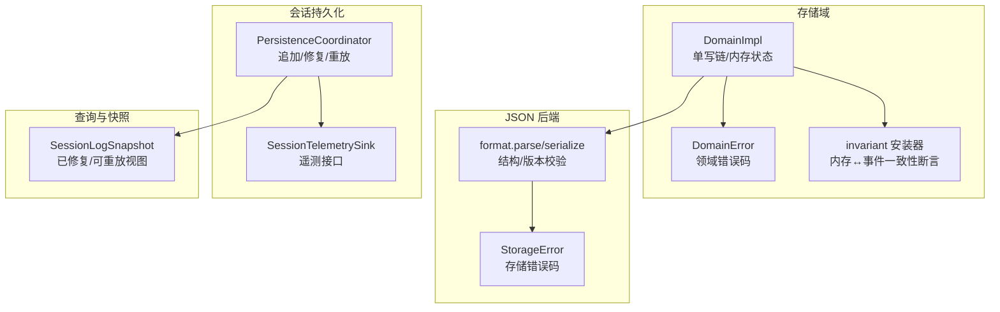
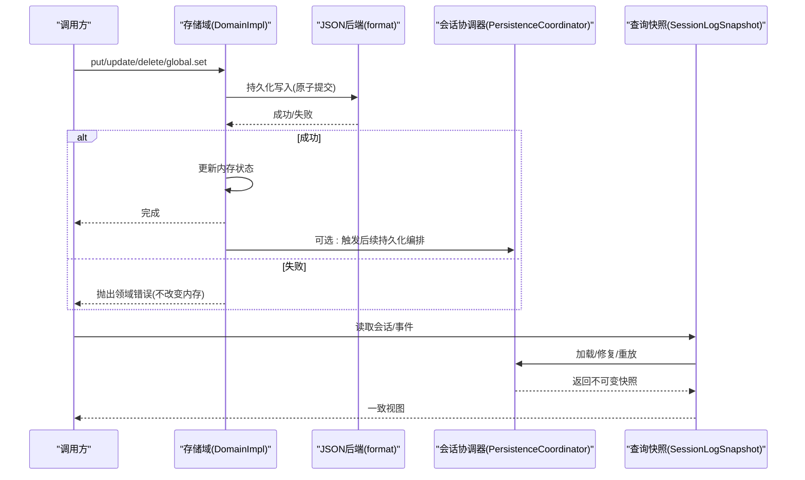
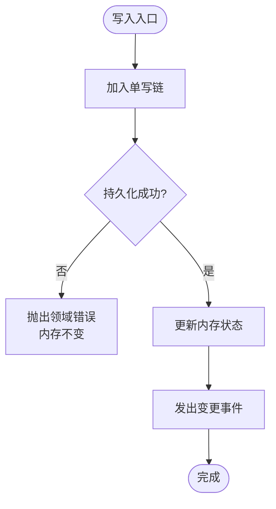
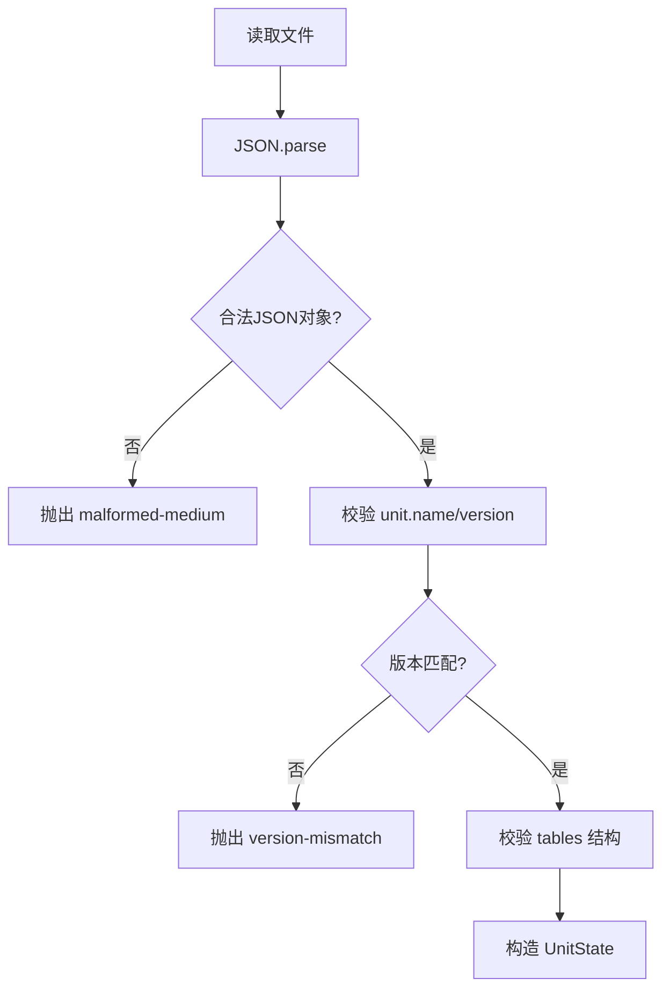
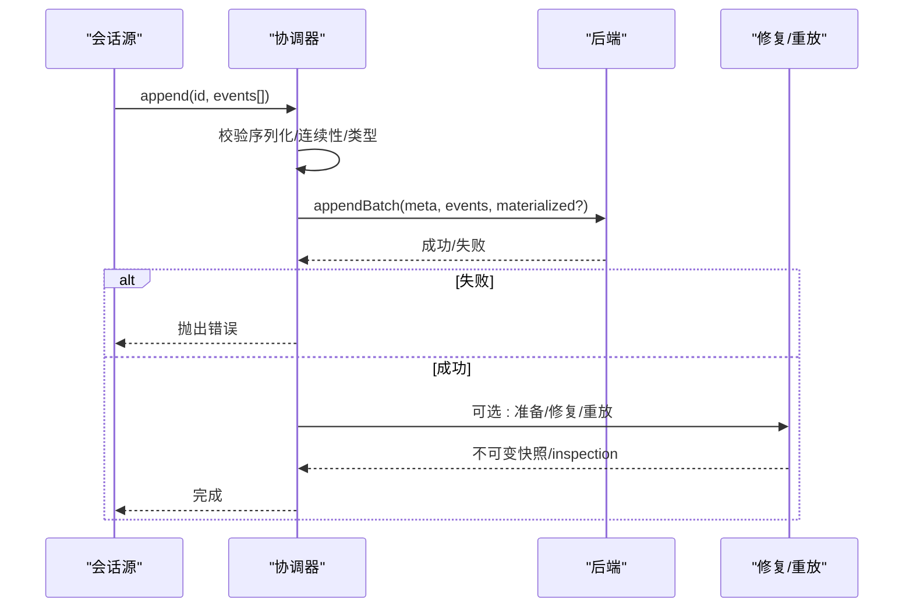
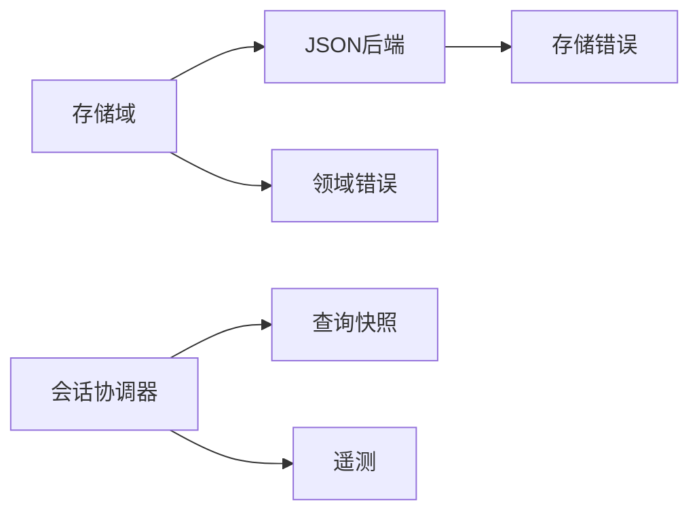

# 数据完整性验证

<cite>
**本文引用的文件**
- [packages/storage/storage-domain/src/domain.ts](file://packages/storage/storage-domain/src/domain.ts)
- [packages/storage/storage-domain/src/error.ts](file://packages/storage/storage-domain/src/error.ts)
- [packages/storage/storage-domain/src/invariant.ts](file://packages/storage/storage-domain/src/invariant.ts)
- [packages/storage/storage-json/src/format.ts](file://packages/storage/storage-json/src/format.ts)
- [packages/storage/storage/src/error.ts](file://packages/storage/storage/src/error.ts)
- [packages/session/session-persistence/src/coordinator.ts](file://packages/session/session-persistence/src/coordinator.ts)
- [packages/session/session-query/src/types.ts](file://packages/session/session-query/src/types.ts)
- [packages/session/session-telemetry/src/index.ts](file://packages/session/session-telemetry/src/index.ts)
- [packages/session/session-telemetry-otel/src/index.ts](file://packages/session/session-telemetry-otel/src/index.ts)
</cite>

## 目录
1. [简介](#简介)
2. [项目结构](#项目结构)
3. [核心组件](#核心组件)
4. [架构总览](#架构总览)
5. [详细组件分析](#详细组件分析)
6. [依赖关系分析](#依赖关系分析)
7. [性能考量](#性能考量)
8. [故障排查指南](#故障排查指南)
9. [结论](#结论)
10. [附录](#附录)

## 简介
本文件聚焦于“数据完整性验证”在数据解析与组装过程中的实现，覆盖校验和计算、数据格式验证、边界条件检查、错误检测策略、异常处理与恢复机制，并提供实际场景示例（损坏数据、网络中断、数据丢失）以及性能监控与调试技巧。内容基于存储域、JSON 后端、会话持久化协调器、查询快照与遥测等模块的源码分析与集成视角整理而成。

## 项目结构
围绕数据完整性，仓库中相关能力分布在以下层次：
- 存储域层：提供单写链、内存状态与持久化的一致性保证，事件驱动变更通知。
- JSON 后端：负责磁盘文件的序列化/反序列化、版本与结构校验。
- 会话持久化协调器：对会话日志进行追加、修复、重放、版本兼容与不可变快照构建。
- 查询与快照：对外暴露已修复且可重放的逻辑会话视图。
- 遥测：记录运行期指标与告警，辅助定位问题。

**图表来源**
- [packages/storage/storage-domain/src/domain.ts:1-358](file://packages/storage/storage-domain/src/domain.ts#L1-L358)
- [packages/storage/storage-domain/src/error.ts:1-53](file://packages/storage/storage-domain/src/error.ts#L1-L53)
- [packages/storage/storage-domain/src/invariant.ts:23-67](file://packages/storage/storage-domain/src/invariant.ts#L23-L67)
- [packages/storage/storage-json/src/format.ts:1-85](file://packages/storage/storage-json/src/format.ts#L1-L85)
- [packages/storage/storage/src/error.ts:1-36](file://packages/storage/storage/src/error.ts#L1-L36)
- [packages/session/session-persistence/src/coordinator.ts:1-800](file://packages/session/session-persistence/src/coordinator.ts#L1-L800)
- [packages/session/session-query/src/types.ts:43-71](file://packages/session/session-query/src/types.ts#L43-L71)
- [packages/session/session-telemetry/src/index.ts:133-178](file://packages/session/session-telemetry/src/index.ts#L133-L178)

**章节来源**
- [packages/storage/storage-domain/src/domain.ts:1-358](file://packages/storage/storage-domain/src/domain.ts#L1-L358)
- [packages/storage/storage-json/src/format.ts:1-85](file://packages/storage/storage-json/src/format.ts#L1-L85)
- [packages/session/session-persistence/src/coordinator.ts:1-800](file://packages/session/session-persistence/src/coordinator.ts#L1-L800)
- [packages/session/session-query/src/types.ts:43-71](file://packages/session/session-query/src/types.ts#L43-L71)

## 核心组件
- 存储域（DomainImpl）：以单写链串行化所有变更，先持久化再更新内存并广播事件；拒绝写入时不改变内存，避免内存与介质不一致。
- JSON 后端（format.parse/serialize）：严格校验文件格式、单元头、表结构与版本；失败返回稳定错误码。
- 会话持久化协调器（PersistenceCoordinator）：负责追加、修复、重放、版本兼容、不可变快照构建与回退策略。
- 查询快照（SessionLogSnapshot）：对外暴露“已修复、可重放”的会话视图，确保读取端看到一致结果。
- 遥测（SessionTelemetrySink）：统一上报度量与告警，支持不同后端模式（全量/仅反馈/禁用）。

**章节来源**
- [packages/storage/storage-domain/src/domain.ts:1-358](file://packages/storage/storage-domain/src/domain.ts#L1-L358)
- [packages/storage/storage-json/src/format.ts:1-85](file://packages/storage/storage-json/src/format.ts#L1-L85)
- [packages/session/session-persistence/src/coordinator.ts:1-800](file://packages/session/session-persistence/src/coordinator.ts#L1-L800)
- [packages/session/session-query/src/types.ts:43-71](file://packages/session/session-query/src/types.ts#L43-L71)
- [packages/session/session-telemetry/src/index.ts:133-178](file://packages/session/session-telemetry/src/index.ts#L133-L178)

## 架构总览
下图展示从写入到持久化、再到读取与修复的完整链路，强调“先持久化后更新内存”的顺序与“不可变快照”的读取语义。

**图表来源**
- [packages/storage/storage-domain/src/domain.ts:140-358](file://packages/storage/storage-domain/src/domain.ts#L140-L358)
- [packages/storage/storage-json/src/format.ts:24-85](file://packages/storage/storage-json/src/format.ts#L24-L85)
- [packages/session/session-persistence/src/coordinator.ts:629-775](file://packages/session/session-persistence/src/coordinator.ts#L629-L775)
- [packages/session/session-query/src/types.ts:43-71](file://packages/session/session-query/src/types.ts#L43-L71)

## 详细组件分析

### 存储域：单写链与内存-介质一致性
- 单写链：所有写操作排队执行，避免并发交错；关闭时等待队列排空后再释放资源。
- 顺序保证：先持久化成功，再更新内存，最后发出变更事件；若持久化失败，内存不变，事件不发。
- 边界检查：关闭后读抛错；删除前判断存在性；update 要求键存在否则抛错。
- 事件一致性：通过 invariant 监听 domain/changed，校验事件值与内存一致。

**图表来源**
- [packages/storage/storage-domain/src/domain.ts:263-358](file://packages/storage/storage-domain/src/domain.ts#L263-L358)
- [packages/storage/storage-domain/src/invariant.ts:23-67](file://packages/storage/storage-domain/src/invariant.ts#L23-L67)

**章节来源**
- [packages/storage/storage-domain/src/domain.ts:140-358](file://packages/storage/storage-domain/src/domain.ts#L140-L358)
- [packages/storage/storage-domain/src/error.ts:6-53](file://packages/storage/storage-domain/src/error.ts#L6-L53)
- [packages/storage/storage-domain/src/invariant.ts:23-67](file://packages/storage/storage-domain/src/invariant.ts#L23-L67)

### JSON 后端：格式与版本校验
- 解析阶段：JSON 合法性、对象类型、unit 头（name/version）、tables 结构、版本匹配。
- 错误分类：malformed-medium（结构/语法错误）、version-mismatch（版本不匹配）。
- 序列化：稳定键序、人类可读、带换行尾，便于人工核对与 diff。

**图表来源**
- [packages/storage/storage-json/src/format.ts:24-85](file://packages/storage/storage-json/src/format.ts#L24-L85)

**章节来源**
- [packages/storage/storage-json/src/format.ts:1-85](file://packages/storage/storage-json/src/format.ts#L1-L85)
- [packages/storage/storage/src/error.ts:6-36](file://packages/storage/storage/src/error.ts#L6-L36)

### 会话持久化协调器：追加、修复与重放
- 追加校验：事件批次必须可 JSON 序列化、seq 连续、受支持的 event type。
- 修复流程：检测到撕裂尾部时，使用后端提供的 torn marker 截断并追加闭合事件；commitRepair 非原子但保证最终一致。
- 重放与快照：将存储事件迁移/升级为当前格式，生成不可变快照供查询与回放。
- 版本兼容：拒绝未知或不受支持的旧事件类型，必要时给出升级提示。

**图表来源**
- [packages/session/session-persistence/src/coordinator.ts:629-775](file://packages/session/session-persistence/src/coordinator.ts#L629-L775)
- [packages/session/session-persistence/src/coordinator.ts:117-215](file://packages/session/session-persistence/src/coordinator.ts#L117-L215)

**章节来源**
- [packages/session/session-persistence/src/coordinator.ts:1-800](file://packages/session/session-persistence/src/coordinator.ts#L1-L800)

### 查询快照：一致的只读视图
- SessionLogSnapshot 包含会话头与已修复、可重放的事件序列，确保读取端看到的是“修复后”的一致视图。
- 适合离线分析、审计与回放，避免直接访问可变中间态。

**章节来源**
- [packages/session/session-query/src/types.ts:43-71](file://packages/session/session-query/src/types.ts#L43-L71)

### 遥测：监控与调试
- 统一抽象：SessionTelemetrySink 定义 emit/flush/shutdown，屏蔽后端差异。
- 模式控制：FULL / FEEDBACK_ONLY / DISABLED，默认禁用；禁用模式下对 feedback 事件仅记录本地警告。
- 共享策略：向用户界面披露 sharing status，增强透明度。

**章节来源**
- [packages/session/session-telemetry/src/index.ts:133-178](file://packages/session/session-telemetry/src/index.ts#L133-L178)
- [packages/session/session-telemetry-otel/src/index.ts:50-168](file://packages/session/session-telemetry-otel/src/index.ts#L50-L168)

## 依赖关系分析
- 存储域依赖 JSON 后端进行介质读写；通过错误码区分介质错误与领域错误。
- 会话协调器依赖后端接口，封装追加、修复、重放；对外暴露不可变快照。
- 查询模块消费协调器的输出，形成稳定的只读视图。
- 遥测作为横切关注点，贯穿各层，用于观测与诊断。

**图表来源**
- [packages/storage/storage-domain/src/domain.ts:140-358](file://packages/storage/storage-domain/src/domain.ts#L140-L358)
- [packages/storage/storage-json/src/format.ts:24-85](file://packages/storage/storage-json/src/format.ts#L24-L85)
- [packages/session/session-persistence/src/coordinator.ts:117-215](file://packages/session/session-persistence/src/coordinator.ts#L117-L215)
- [packages/session/session-query/src/types.ts:43-71](file://packages/session/session-query/src/types.ts#L43-L71)
- [packages/session/session-telemetry/src/index.ts:133-178](file://packages/session/session-telemetry/src/index.ts#L133-L178)

**章节来源**
- [packages/storage/storage-domain/src/domain.ts:140-358](file://packages/storage/storage-domain/src/domain.ts#L140-L358)
- [packages/storage/storage-json/src/format.ts:24-85](file://packages/storage/storage-json/src/format.ts#L24-L85)
- [packages/session/session-persistence/src/coordinator.ts:117-215](file://packages/session/session-persistence/src/coordinator.ts#L117-L215)
- [packages/session/session-query/src/types.ts:43-71](file://packages/session/session-query/src/types.ts#L43-L71)
- [packages/session/session-telemetry/src/index.ts:133-178](file://packages/session/session-telemetry/src/index.ts#L133-L178)

## 性能考量
- 单写链减少锁竞争与竞态，提高吞吐与一致性；批量追加降低 IO 次数。
- 不可变快照避免深拷贝开销，提升读取性能。
- 遥测开关与模式选择可在高负载下降低额外开销。
- 建议：在高写入场景下增大批大小；在低延迟场景下减小批延迟；结合遥测观察 flush/shutdown 耗时。

[本节为通用指导，无需特定文件引用]

## 故障排查指南
- 损坏数据（JSON 非法/结构不符）：解析阶段抛出 malformed-medium；检查 unit 头与 tables 结构，确认版本匹配。
- 版本不兼容：version-mismatch 或会话格式不支持；升级 harness 或回滚至兼容版本。
- 网络中断/IO 失败：持久化失败时内存不变；重试策略应在上层实现，避免重复写入导致重复 seq。
- 数据丢失/撕裂尾部：协调器使用 torn marker 截断并追加闭合事件；检查 commitRepair 是否成功。
- 事件类型未知：拒绝加载并提示升级；保留原始日志位置以便取证。
- 调试技巧：启用遥测（FULL），记录 emit/flush/shutdown；利用不可变快照进行离线回放与比对。

**章节来源**
- [packages/storage/storage-json/src/format.ts:43-85](file://packages/storage/storage-json/src/format.ts#L43-L85)
- [packages/storage/storage/src/error.ts:6-36](file://packages/storage/storage/src/error.ts#L6-L36)
- [packages/session/session-persistence/src/coordinator.ts:35-81](file://packages/session/session-persistence/src/coordinator.ts#L35-L81)
- [packages/session/session-persistence/src/coordinator.ts:117-215](file://packages/session/session-persistence/src/coordinator.ts#L117-L215)
- [packages/session/session-telemetry/src/index.ts:133-178](file://packages/session/session-telemetry/src/index.ts#L133-L178)

## 结论
该代码库通过“单写链 + 先持久化后内存 + 不可变快照”的组合，实现了强一致的数据完整性保障。JSON 后端提供严格的格式与版本校验，会话协调器负责修复与重放，查询模块提供稳定只读视图，遥测贯穿全程用于监控与调试。面对损坏数据、网络中断与数据丢失等异常，系统具备明确的错误分类、恢复路径与可观测性，满足生产环境的高可靠需求。

## 附录
- 关键错误码速查
  - 存储错误：backend-not-found、form-not-mounted、duplicate-backend、duplicate-mount、version-mismatch、malformed-medium、closed
  - 领域错误：already-open、facet-unsupported、invalid-record、missing-key、closed
- 推荐实践
  - 所有写路径走单写链，禁止绕过直接修改内存。
  - 对事件批次进行一次性序列化与校验，避免二次转换引入不一致。
  - 使用不可变快照进行读取与分析，避免并发干扰。
  - 开启遥测并合理配置模式，结合日志与快照定位问题。

[本节为总结性内容，无需特定文件引用]