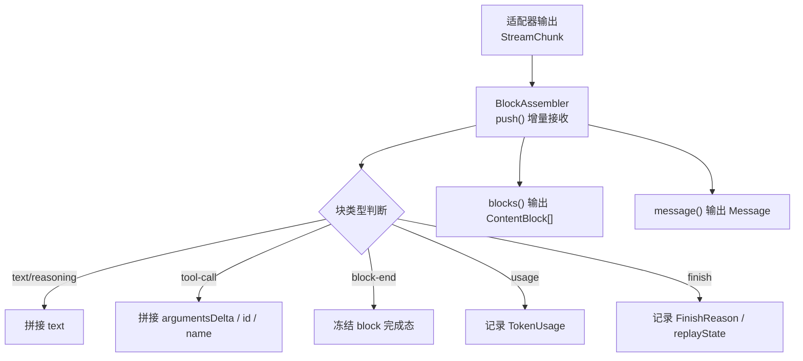
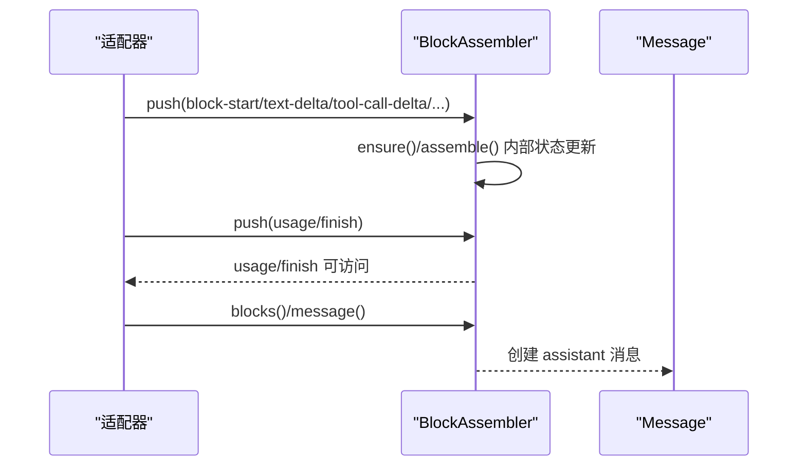
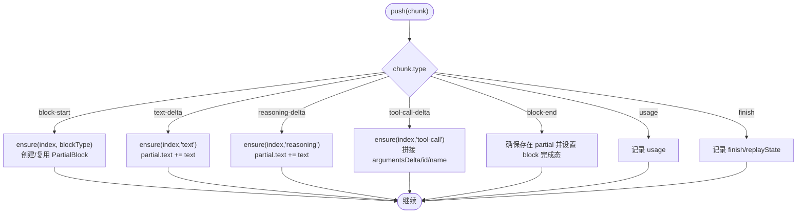
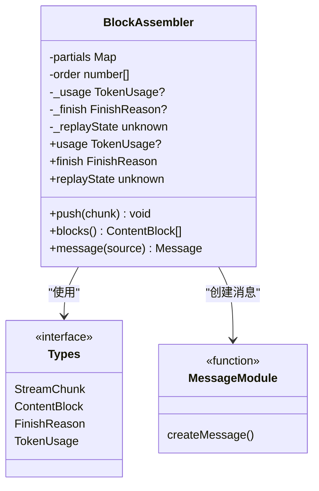

# 数据解析与组装

<cite>
**本文引用的文件**
- [packages/llm/llm/src/assembler.ts](file://packages/llm/llm/src/assembler.ts)
- [packages/llm/llm/src/types.ts](file://packages/llm/llm/src/types.ts)
- [packages/llm/llm/src/message.ts](file://packages/llm/llm/src/message.ts)
- [packages/llm/llm/tests/assembler.spec.ts](file://packages/llm/llm/tests/assembler.spec.ts)
- [packages/llm/llm/tests/properties.spec.ts](file://packages/llm/llm/tests/properties.spec.ts)
- [docs/subsystems/llm-streaming.md](file://docs/subsystems/llm-streaming.md)
- [packages/subprocess/subprocess-local/src/spawn.ts](file://packages/subprocess/subprocess-local/src/spawn.ts)
</cite>

## 目录
1. [简介](#简介)
2. [项目结构](#项目结构)
3. [核心组件](#核心组件)
4. [架构总览](#架构总览)
5. [详细组件分析](#详细组件分析)
6. [依赖关系分析](#依赖关系分析)
7. [性能考量](#性能考量)
8. [故障排查指南](#故障排查指南)
9. [结论](#结论)
10. [附录](#附录)

## 简介
本文件聚焦于流式响应数据的解析与组装，围绕 StreamChunk 流的增量缓冲、合并与最终块（ContentBlock）的组装机制展开。重点说明 BlockAssembler 类如何安全地处理文本、推理、工具调用等不同类型的块，并保证数据完整性、错误恢复与内存管理策略。文末提供实际的数据解析示例与性能优化建议。

## 项目结构
与“数据解析与组装”直接相关的代码集中在 LLM 包中：
- 类型定义：StreamChunk、ContentBlock、FinishReason、TokenUsage 等
- 组装器：BlockAssembler 将原始流式分片增量拼装为完整块和助手消息
- 消息构造：createMessage/freezeMessage 等用于生成不可变的消息对象
- 文档：llm-streaming.md 对 StreamChunk 协议进行规范说明
- 测试：assembler.spec.ts、properties.spec.ts 覆盖功能与属性不变量
- 内存溢出与回退：subprocess-local 中的 OutputCollector 展示了流式缓冲的溢出与落盘策略，可作为参考

图表来源
- [packages/llm/llm/src/assembler.ts:47-94](file://packages/llm/llm/src/assembler.ts#L47-L94)
- [packages/llm/llm/src/assembler.ts:134-163](file://packages/llm/llm/src/assembler.ts#L134-L163)
- [packages/llm/llm/src/types.ts:291-303](file://packages/llm/llm/src/types.ts#L291-L303)

章节来源
- [packages/llm/llm/src/assembler.ts:1-165](file://packages/llm/llm/src/assembler.ts#L1-L165)
- [packages/llm/llm/src/types.ts:283-303](file://packages/llm/llm/src/types.ts#L283-L303)
- [docs/subsystems/llm-streaming.md:156-182](file://docs/subsystems/llm-streaming.md#L156-L182)

## 核心组件
- StreamChunk：适配器输出的原始流式协议，包含块开始、增量、块结束、用量统计与结束原因等事件。通过 index 关联同一块的多个增量；block-end 携带已组装好的 ContentBlock，便于下游消费。
- BlockAssembler：增量组装器，维护每个 index 的 PartialBlock（文本/推理/工具调用），按顺序收集并支持幂等读取 blocks()/message()。
- ContentBlock：文本、推理、图片、工具调用、工具结果等结构化内容块。
- Message：由 createMessage 创建的不可变消息，role 为 assistant 时承载 blocks() 的结果。

章节来源
- [packages/llm/llm/src/types.ts:54-110](file://packages/llm/llm/src/types.ts#L54-L110)
- [packages/llm/llm/src/types.ts:291-303](file://packages/llm/llm/src/types.ts#L291-L303)
- [packages/llm/llm/src/assembler.ts:15-23](file://packages/llm/llm/src/assembler.ts#L15-L23)
- [packages/llm/llm/src/message.ts:128-138](file://packages/llm/llm/src/message.ts#L128-L138)

## 架构总览
BlockAssembler 作为单一装配算法，负责：
- 增量接收：push(chunk) 按流序处理每种 chunk
- 状态维护：partials Map<index, PartialBlock> + order 数组保持块出现顺序
- 容错设计：忽略重复 block-start、忽略 block-end 后的 straggler、未知 blockType 在 assemble 时报错
- 终止信息：usage 与 finish 分别记录用量与结束原因；replayState 透传适配器私有状态
- 输出：blocks() 返回 ContentBlock[]；message() 包装为 assistant 消息

图表来源
- [packages/llm/llm/src/assembler.ts:47-94](file://packages/llm/llm/src/assembler.ts#L47-L94)
- [packages/llm/llm/src/assembler.ts:134-163](file://packages/llm/llm/src/assembler.ts#L134-L163)
- [packages/llm/llm/src/message.ts:178-185](file://packages/llm/llm/src/message.ts#L178-L185)

## 详细组件分析

### StreamChunk 协议与语义
- 块生命周期：block-start -> 若干 delta -> block-end
- 索引关联：index 绑定同一块的所有增量
- 终结事件：usage 提供 TokenUsage；finish 提供 FinishReason 与可选 replayState
- 协议闭包：switch 必须穷尽所有 type，新增类型需同步更新消费者

章节来源
- [docs/subsystems/llm-streaming.md:156-182](file://docs/subsystems/llm-streaming.md#L156-L182)
- [packages/llm/llm/src/types.ts:291-303](file://packages/llm/llm/src/types.ts#L291-L303)

### BlockAssembler 工作原理
- 增量缓冲：PartialBlock 保存 text 或 toolCallArguments 的累积字符串
- 合并规则：
  - text-delta/reasoning-delta 追加到对应 partial.text
  - tool-call-delta 追加 argumentsDelta，并记录 id/name（name 可选）
  - block-end 设置 partial.block 并冻结该块
- 自动隐式块：若未显式 block-start，ensure() 会基于 delta 类型推断块类型并创建 partial
- 幂等性：重复 block-start 被忽略；重复 block-end 以首次为准；block-end 后后续 delta 被丢弃
- 最大 token 截断：当 finish.kind === 'max-tokens' 时，blocks() 过滤掉 tool-call 块，避免不安全执行
- 消息构建：message() 使用 createMessage 生成 assistant 角色消息，content 即 blocks()

图表来源
- [packages/llm/llm/src/assembler.ts:47-94](file://packages/llm/llm/src/assembler.ts#L47-L94)
- [packages/llm/llm/src/assembler.ts:96-119](file://packages/llm/llm/src/assembler.ts#L96-L119)

章节来源
- [packages/llm/llm/src/assembler.ts:47-119](file://packages/llm/llm/src/assembler.ts#L47-L119)
- [packages/llm/llm/tests/assembler.spec.ts:5-30](file://packages/llm/llm/tests/assembler.spec.ts#L5-L30)
- [packages/llm/llm/tests/assembler.spec.ts:32-45](file://packages/llm/llm/tests/assembler.spec.ts#L32-L45)
- [packages/llm/llm/tests/assembler.spec.ts:93-111](file://packages/llm/llm/tests/assembler.spec.ts#L93-L111)

### 数据完整性保证
- 契约一致性：block-end 携带的 ContentBlock 是权威来源，避免下游重复拼接导致不一致
- 幂等读取：blocks()/message() 多次调用结果稳定
- 不变量保护：order 中每个 index 必有 partial；缺失则抛出异常
- 关闭优先：重复 block-end 以第一次为准，防止流式输出与最终块不一致
- 未知类型防御：未知 blockType 在 assemble 时抛错，强制扩展点同步更新

章节来源
- [packages/llm/llm/src/assembler.ts:75-81](file://packages/llm/llm/src/assembler.ts#L75-L81)
- [packages/llm/llm/src/assembler.ts:121-126](file://packages/llm/llm/src/assembler.ts#L121-L126)
- [packages/llm/llm/tests/properties.spec.ts:74-81](file://packages/llm/llm/tests/properties.spec.ts#L74-L81)

### 错误恢复与健壮性
- 容忍无显式 block-start/end：delta-only 也能正确组装
- 忽略 straggler：block-end 之后的 delta 被丢弃，防止恶意或错误流污染内存
- 失败归一化：适配器抛错会被上层 stream() 转换为 error/aborted 的 finish 事件，再由 BlockAssembler 记录
- 最大 token 截断：finish 为 max-tokens 时过滤 tool-call，避免不完整工具调用被误执行

章节来源
- [packages/llm/llm/src/types.ts:116-125](file://packages/llm/llm/src/types.ts#L116-L125)
- [packages/llm/llm/src/types.ts:283-303](file://packages/llm/llm/src/types.ts#L283-L303)
- [packages/llm/llm/tests/assembler.spec.ts:40-45](file://packages/llm/llm/tests/assembler.spec.ts#L40-L45)

### 内存管理策略
- 增量拼接：PartialBlock 使用字符串累积，适合高频小增量场景；注意长文本时的内存占用
- 有序集合：order 数组仅存储 distinct index，控制 blocks() 输出规模
- 上限与溢出：对于更底层的字节流缓冲，可参考 subprocess-local 的 OutputCollector，采用固定窗口 + 溢出落盘策略，保障诊断尾部始终保留最近 N 字节
- 资源释放：子进程输出收集器在 spill 超过阈值时主动丢弃临时文件，避免磁盘膨胀

章节来源
- [packages/llm/llm/src/assembler.ts:37-41](file://packages/llm/llm/src/assembler.ts#L37-L41)
- [packages/subprocess/subprocess-local/src/spawn.ts:123-197](file://packages/subprocess/subprocess-local/src/spawn.ts#L123-L197)

### 实际数据解析示例
以下示例展示典型流片段与 BlockAssembler 的行为（不直接粘贴代码，路径见下）：
- 混合文本、推理、工具调用增量，并在 finish 前记录 usage
- 仅凭 delta 隐式开启块并正确组装
- block-end 权威块覆盖与重复 close 的忽略
- 无 id 的工具调用使用 call-{index} 回退 id

章节来源
- [packages/llm/llm/tests/assembler.spec.ts:5-30](file://packages/llm/llm/tests/assembler.spec.ts#L5-L30)
- [packages/llm/llm/tests/assembler.spec.ts:32-45](file://packages/llm/llm/tests/assembler.spec.ts#L32-L45)
- [packages/llm/llm/tests/assembler.spec.ts:93-111](file://packages/llm/llm/tests/assembler.spec.ts#L93-L111)

## 依赖关系分析
- BlockAssembler 依赖：
  - types.ts 中的 StreamChunk、ContentBlock、FinishReason、TokenUsage
  - message.ts 中的 createMessage 生成 assistant 消息
  - brand.ts 中的 CallId 用于工具调用标识
  - never.ts 中的 assertNever 实现穷尽分支检查

图表来源
- [packages/llm/llm/src/assembler.ts:15-23](file://packages/llm/llm/src/assembler.ts#L15-L23)
- [packages/llm/llm/src/assembler.ts:37-41](file://packages/llm/llm/src/assembler.ts#L37-L41)
- [packages/llm/llm/src/types.ts:291-303](file://packages/llm/llm/src/types.ts#L291-L303)
- [packages/llm/llm/src/message.ts:178-185](file://packages/llm/llm/src/message.ts#L178-L185)

章节来源
- [packages/llm/llm/src/assembler.ts:1-165](file://packages/llm/llm/src/assembler.ts#L1-L165)
- [packages/llm/llm/src/types.ts:283-303](file://packages/llm/llm/src/types.ts#L283-L303)
- [packages/llm/llm/src/message.ts:178-185](file://packages/llm/llm/src/message.ts#L178-L185)

## 性能考量
- 增量拼接成本：字符串拼接在高频小增量场景高效；超长文本建议结合分块策略或外部缓冲以降低内存峰值
- 幂等读取：blocks()/message() 应缓存结果或在 UI 层去抖，避免重复计算
- 最大 token 截断：及时过滤 tool-call 可减少无效执行开销
- 流控与背压：上游适配器应控制推送速率，避免阻塞主线程
- 溢出与落盘：对于底层字节流，采用固定窗口 + 溢出落盘，确保诊断尾部可用且可控磁盘增长

[本节为通用指导，不直接分析具体文件]

## 故障排查指南
- 未知块类型：assemble() 抛出错误，检查是否遗漏对新 ContentBlockType 的支持
- 不变量违反：mustGet() 抛错表示 order 与 partials 不一致，检查 push() 逻辑与并发访问
- 重复 close：确认业务侧是否正确发送 block-end，避免重复关闭造成数据丢失
- 工具调用不完整：finish 为 max-tokens 时 tool-call 被过滤，检查模型输出长度限制
- 首 token 判定：isTokenDelta() 可用于客户端首 token 计时，空 delta 不计入

章节来源
- [packages/llm/llm/src/assembler.ts:106-119](file://packages/llm/llm/src/assembler.ts#L106-L119)
- [packages/llm/llm/src/assembler.ts:121-126](file://packages/llm/llm/src/assembler.ts#L121-L126)
- [packages/llm/llm/src/message.ts:243-261](file://packages/llm/llm/src/message.ts#L243-L261)

## 结论
BlockAssembler 提供了稳健、幂等、可扩展的流式数据组装能力，能够正确处理文本、推理与工具调用等多种块类型，并通过严格的协议约束与错误恢复机制保障数据完整性。配合上下游的流控与内存管理策略，可在高吞吐场景下保持稳定与可观测性。

[本节为总结，不直接分析具体文件]

## 附录
- 关键 API 与类型路径
  - StreamChunk 协议定义：[packages/llm/llm/src/types.ts:291-303](file://packages/llm/llm/src/types.ts#L291-L303)
  - BlockAssembler 核心方法：[packages/llm/llm/src/assembler.ts:47-94](file://packages/llm/llm/src/assembler.ts#L47-L94)
  - 消息构造：[packages/llm/llm/src/message.ts:178-185](file://packages/llm/llm/src/message.ts#L178-L185)
  - 流协议文档：[docs/subsystems/llm-streaming.md:156-182](file://docs/subsystems/llm-streaming.md#L156-L182)
  - 单元测试用例：[packages/llm/llm/tests/assembler.spec.ts:5-119](file://packages/llm/llm/tests/assembler.spec.ts#L5-L119)
  - 属性测试不变量：[packages/llm/llm/tests/properties.spec.ts:60-105](file://packages/llm/llm/tests/properties.spec.ts#L60-L105)
  - 溢出与落盘参考：[packages/subprocess/subprocess-local/src/spawn.ts:123-197](file://packages/subprocess/subprocess-local/src/spawn.ts#L123-L197)