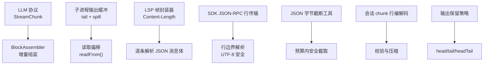
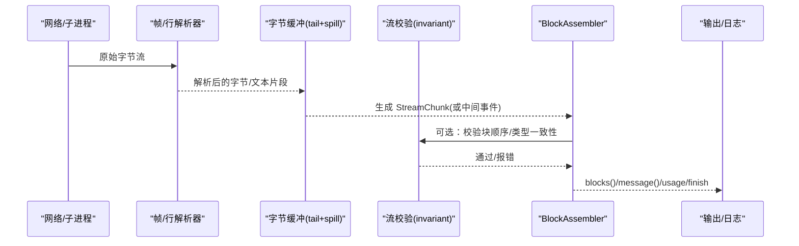
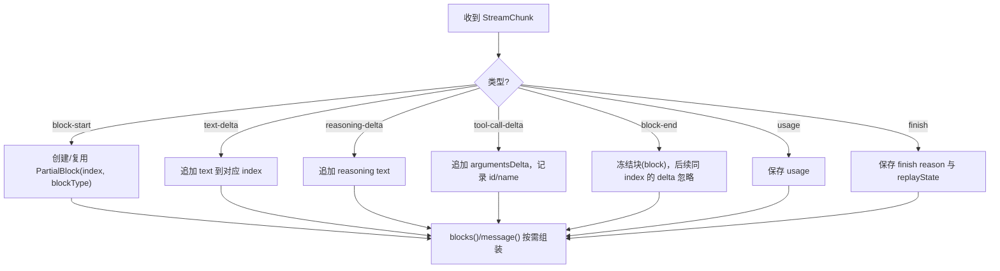
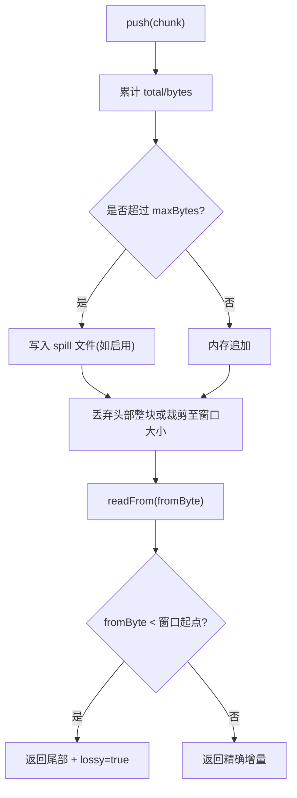
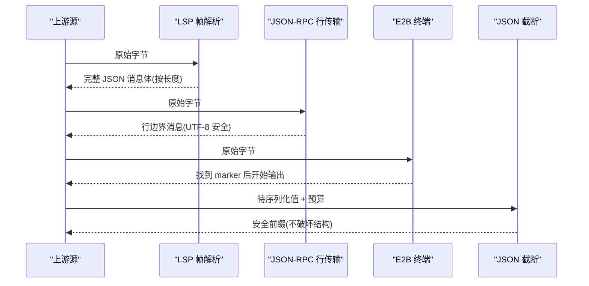
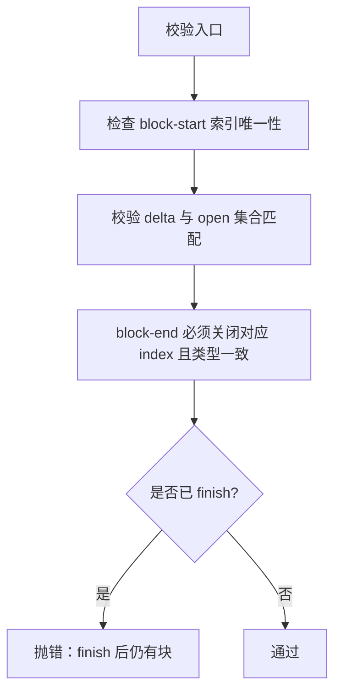
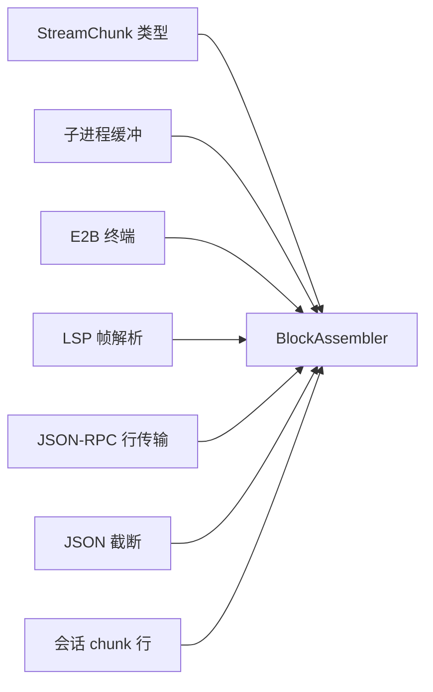

# 流式数据块解析

<cite>
**本文引用的文件**
- [packages/llm/llm/src/types.ts](file://packages/llm/llm/src/types.ts)
- [packages/llm/llm/src/assembler.ts](file://packages/llm/llm/src/assembler.ts)
- [packages/llm/llm/src/invariant.ts](file://packages/llm/llm/src/invariant.ts)
- [packages/llm/llm/tests/assembler.spec.ts](file://packages/llm/llm/tests/assembler.spec.ts)
- [packages/subprocess/subprocess-local/src/spawn.ts](file://packages/subprocess/subprocess-local/src/spawn.ts)
- [packages/e2b/subprocess-e2b/src/terminal.ts](file://packages/e2b/subprocess-e2b/src/terminal.ts)
- [packages/lsp/lsp-stdio/src/framing.ts](file://packages/lsp/lsp-stdio/src/framing.ts)
- [packages/sdk/protocol/src/transport.ts](file://packages/sdk/protocol/src/transport.ts)
- [packages/code-runtime/code-runtime-worker-thread/src/output-json.ts](file://packages/code-runtime/code-runtime-worker-thread/src/output-json.ts)
- [packages/core/session/src/chunk-rows.ts](file://packages/core/session/src/chunk-rows.ts)
- [packages/util/output-retention/src/index.ts](file://packages/util/output-retention/src/index.ts)
- [docs/subsystems/llm-streaming.md](file://docs/subsystems/llm-streaming.md)
</cite>

## 目录
1. [简介](#简介)
2. [项目结构](#项目结构)
3. [核心组件](#核心组件)
4. [架构总览](#架构总览)
5. [详细组件分析](#详细组件分析)
6. [依赖关系分析](#依赖关系分析)
7. [性能考量](#性能考量)
8. [故障排查指南](#故障排查指南)
9. [结论](#结论)
10. [附录](#附录)

## 简介
本文件围绕“流式数据块解析”展开，聚焦 StreamChunk 的解析与组装、增量缓冲策略、数据块识别与分割机制、多格式流式响应（JSON、文本、二进制）的处理方式，以及完整性校验与错误检测。同时提供从原始字节流中提取有意义片段的实践示例，并总结性能优化与内存管理最佳实践。

## 项目结构
本项目将“流式数据块解析”能力分布在多个子系统：
- LLM 层定义 StreamChunk 协议与 BlockAssembler 组装器，负责将流式片段组装为完整内容块与消息。
- 子进程与终端子系统实现字节级流缓冲、溢出转储与标记符分割。
- LSP 帧封装器按 Content-Length 边界解析 JSON 消息体。
- SDK 传输层以行分隔 JSON-RPC 流进行可靠收发。
- 代码运行时输出 JSON 截断工具用于在字节预算内安全截取 JSON。
- 会话持久化对 chunk 行进行压缩与校验。
- 通用输出保留模块提供头/尾/双端保留策略。

图表来源
- [packages/llm/llm/src/types.ts:291-303](file://packages/llm/llm/src/types.ts#L291-L303)
- [packages/llm/llm/src/assembler.ts:36-165](file://packages/llm/llm/src/assembler.ts#L36-L165)
- [packages/subprocess/subprocess-local/src/spawn.ts:123-218](file://packages/subprocess/subprocess-local/src/spawn.ts#L123-L218)
- [packages/lsp/lsp-stdio/src/framing.ts:34-56](file://packages/lsp/lsp-stdio/src/framing.ts#L34-L56)
- [packages/sdk/protocol/src/transport.ts:51-92](file://packages/sdk/protocol/src/transport.ts#L51-L92)
- [packages/code-runtime/code-runtime-worker-thread/src/output-json.ts:135-179](file://packages/code-runtime/code-runtime-worker-thread/src/output-json.ts#L135-L179)
- [packages/core/session/src/chunk-rows.ts:247-275](file://packages/core/session/src/chunk-rows.ts#L247-L275)
- [packages/util/output-retention/src/index.ts:256-298](file://packages/util/output-retention/src/index.ts#L256-L298)

章节来源
- [packages/llm/llm/src/types.ts:291-303](file://packages/llm/llm/src/types.ts#L291-L303)
- [packages/llm/llm/src/assembler.ts:36-165](file://packages/llm/llm/src/assembler.ts#L36-L165)
- [packages/subprocess/subprocess-local/src/spawn.ts:123-218](file://packages/subprocess/subprocess-local/src/spawn.ts#L123-L218)
- [packages/lsp/lsp-stdio/src/framing.ts:34-56](file://packages/lsp/lsp-stdio/src/framing.ts#L34-L56)
- [packages/sdk/protocol/src/transport.ts:51-92](file://packages/sdk/protocol/src/transport.ts#L51-L92)
- [packages/code-runtime/code-runtime-worker-thread/src/output-json.ts:135-179](file://packages/code-runtime/code-runtime-worker-thread/src/output-json.ts#L135-L179)
- [packages/core/session/src/chunk-rows.ts:247-275](file://packages/core/session/src/chunk-rows.ts#L247-L275)
- [packages/util/output-retention/src/index.ts:256-298](file://packages/util/output-retention/src/index.ts#L256-L298)

## 核心组件
- StreamChunk 协议：定义 block-start/text-delta/reasoning-delta/tool-call-delta/block-end/usage/finish 等原子事件，通过 index 关联同一块的增量片段，block-end 携带已组装的完整块。
- BlockAssembler：增量接收 StreamChunk，维护部分块状态，产出 blocks()/message()，并在 finish 时暴露 usage 与 replayState。
- 字节缓冲与溢出处理：子进程输出采用固定窗口 tail 缓冲，超限时落盘 spill；支持按全局字节坐标 readFrom 增量读取。
- 帧/行解析：LSP 使用 Content-Length 帧边界；SDK 使用行分隔 JSON-RPC；E2B 终端使用特定 marker 完成首帧同步。
- JSON 安全截断：在字节预算内计算可序列化前缀，避免破坏 JSON 结构。
- 会话 chunk 行：对 chunk 行进行严格校验与压缩存储。
- 输出保留策略：统一 head/tail/headTail 策略，控制保留范围与丢弃标志。

章节来源
- [packages/llm/llm/src/types.ts:291-303](file://packages/llm/llm/src/types.ts#L291-L303)
- [packages/llm/llm/src/assembler.ts:36-165](file://packages/llm/llm/src/assembler.ts#L36-L165)
- [packages/subprocess/subprocess-local/src/spawn.ts:123-218](file://packages/subprocess/subprocess-local/src/spawn.ts#L123-L218)
- [packages/lsp/lsp-stdio/src/framing.ts:34-56](file://packages/lsp/lsp-stdio/src/framing.ts#L34-L56)
- [packages/sdk/protocol/src/transport.ts:51-92](file://packages/sdk/protocol/src/transport.ts#L51-L92)
- [packages/code-runtime/code-runtime-worker-thread/src/output-json.ts:135-179](file://packages/code-runtime/code-runtime-worker-thread/src/output-json.ts#L135-L179)
- [packages/core/session/src/chunk-rows.ts:247-275](file://packages/core/session/src/chunk-rows.ts#L247-L275)
- [packages/util/output-retention/src/index.ts:256-298](file://packages/util/output-retention/src/index.ts#L256-L298)

## 架构总览
下图展示从原始字节到最终消息的端到端流程：底层字节流经帧/行解析或标记符匹配后，得到 StreamChunk 序列；随后由 BlockAssembler 增量组装为内容块与消息；期间配合字节缓冲、溢出落盘、JSON 截断与校验，确保完整性与性能。

图表来源
- [packages/lsp/lsp-stdio/src/framing.ts:34-56](file://packages/lsp/lsp-stdio/src/framing.ts#L34-L56)
- [packages/sdk/protocol/src/transport.ts:51-92](file://packages/sdk/protocol/src/transport.ts#L51-L92)
- [packages/subprocess/subprocess-local/src/spawn.ts:123-218](file://packages/subprocess/subprocess-local/src/spawn.ts#L123-L218)
- [packages/llm/llm/src/invariant.ts:35-69](file://packages/llm/llm/src/invariant.ts#L35-L69)
- [packages/llm/llm/src/assembler.ts:36-165](file://packages/llm/llm/src/assembler.ts#L36-L165)

## 详细组件分析

### StreamChunk 协议与 BlockAssembler 组装算法
- 协议要点
  - 使用 index 将同一块的多段 delta 串联起来。
  - block-end 携带已组装的完整块，作为权威结果，避免下游重复拼接。
  - usage 在 finish 之前出现，finish 之后不再出现新块。
- 组装策略
  - 维护每个 index 的部分块状态（文本/推理/工具调用），按到达顺序记录 order。
  - 对重复 block-start 与 block-end 做幂等处理，忽略迟到/重复片段，防止内存膨胀与状态污染。
  - 当 finish.reason 为 max-tokens 时，过滤掉无法安全执行的 tool-call 块。
  - 未显式 block-start/end 的 delta 也能被容忍，自动创建隐式块。

图表来源
- [packages/llm/llm/src/assembler.ts:36-165](file://packages/llm/llm/src/assembler.ts#L36-L165)
- [packages/llm/llm/src/types.ts:291-303](file://packages/llm/llm/src/types.ts#L291-L303)

章节来源
- [packages/llm/llm/src/types.ts:291-303](file://packages/llm/llm/src/types.ts#L291-L303)
- [packages/llm/llm/src/assembler.ts:36-165](file://packages/llm/llm/src/assembler.ts#L36-L165)
- [packages/llm/llm/tests/assembler.spec.ts:1-148](file://packages/llm/llm/tests/assembler.spec.ts#L1-L148)

### 增量数据缓冲与溢出策略（子进程输出）
- 固定窗口 tail 缓冲：仅保留最近 maxBytes 字节，保证诊断尾部精确。
- 溢出落盘：首次超过阈值即打开 spill 文件，后续所有 chunk 写入磁盘；内存中只保留尾部窗口。
- 增量读取：readFrom(fromByte) 基于全局字节坐标返回增量文本；若 fromByte 已滑出内存窗口则 lossy=true，需从 spill 恢复缺失部分。

图表来源
- [packages/subprocess/subprocess-local/src/spawn.ts:123-218](file://packages/subprocess/subprocess-local/src/spawn.ts#L123-L218)

章节来源
- [packages/subprocess/subprocess-local/src/spawn.ts:123-218](file://packages/subprocess/subprocess-local/src/spawn.ts#L123-L218)

### 不同格式流式响应的识别与分割
- LSP JSON 帧：按 Content-Length 边界解析，单条消息体受最大字节限制保护内存。
- SDK JSON-RPC 行传输：按换行分隔，UTF-8 安全解码，忽略无效行，支持通知无参。
- E2B 终端首帧同步：使用固定 marker 定位有效输出起始位置，找到后即发布 ready。
- JSON 值字节截断：在预算内计算可序列化前缀，保证字符串/数组/对象不被截断在非法位置。

图表来源
- [packages/lsp/lsp-stdio/src/framing.ts:34-56](file://packages/lsp/lsp-stdio/src/framing.ts#L34-L56)
- [packages/sdk/protocol/src/transport.ts:51-92](file://packages/sdk/protocol/src/transport.ts#L51-L92)
- [packages/e2b/subprocess-e2b/src/terminal.ts:61-89](file://packages/e2b/subprocess-e2b/src/terminal.ts#L61-L89)
- [packages/code-runtime/code-runtime-worker-thread/src/output-json.ts:135-179](file://packages/code-runtime/code-runtime-worker-thread/src/output-json.ts#L135-L179)

章节来源
- [packages/lsp/lsp-stdio/src/framing.ts:34-56](file://packages/lsp/lsp-stdio/src/framing.ts#L34-L56)
- [packages/sdk/protocol/src/transport.ts:51-92](file://packages/sdk/protocol/src/transport.ts#L51-L92)
- [packages/e2b/subprocess-e2b/src/terminal.ts:61-89](file://packages/e2b/subprocess-e2b/src/terminal.ts#L61-L89)
- [packages/code-runtime/code-runtime-worker-thread/src/output-json.ts:135-179](file://packages/code-runtime/code-runtime-worker-thread/src/output-json.ts#L135-L179)

### 数据完整性验证与错误检测
- 流语法校验：检查 block-start 与 block-end 成对且类型一致，禁止 finish 后再发块，重复 index 报错。
- 会话 chunk 行校验：严格校验 envelope 字段与数据类型，异常抛出结构化错误。
- 错误链渲染：将 Error.cause 链与 AggregateError 成员串接，便于诊断。

图表来源
- [packages/llm/llm/src/invariant.ts:35-69](file://packages/llm/llm/src/invariant.ts#L35-L69)
- [packages/core/session/src/chunk-rows.ts:247-275](file://packages/core/session/src/chunk-rows.ts#L247-L275)

章节来源
- [packages/llm/llm/src/invariant.ts:35-69](file://packages/llm/llm/src/invariant.ts#L35-L69)
- [packages/core/session/src/chunk-rows.ts:247-275](file://packages/core/session/src/chunk-rows.ts#L247-L275)

### 实际解析示例（从字节流提取有意义片段）
- 场景一：LSP 服务器 stderr 诊断尾部
  - 输入：大量子进程输出字节流，可能跨 Buffer 分片。
  - 处理：push 累积，超限后开启 spill；readFrom(0) 获取最后 maxBytes 文本，lossy=true 表示有丢失，可从 spill 恢复。
  - 参考路径：[子进程输出缓冲 push/readFrom:123-218](file://packages/subprocess/subprocess-local/src/spawn.ts#L123-L218)
- 场景二：E2B 终端首帧同步
  - 输入：包含未知前缀的字节流。
  - 处理：查找 marker，定位后释放 pending，开始转发有效输出。
  - 参考路径：[E2B 终端 push:61-89](file://packages/e2b/subprocess-e2b/src/terminal.ts#L61-L89)
- 场景三：JSON-RPC 行传输
  - 输入：多行 JSON，可能夹杂空行/无效行。
  - 处理：按行缓冲与 UTF-8 解码，忽略无效行，触发通知回调。
  - 参考路径：[JSON-RPC 行传输 start/onData:51-92](file://packages/sdk/protocol/src/transport.ts#L51-L92)
- 场景四：JSON 值安全截断
  - 输入：大对象需要按字节预算截取。
  - 处理：遍历键/值，累加序列化字节，遇到预算不足即停止，返回安全前缀。
  - 参考路径：[JSON 值字节计数与截断:135-179](file://packages/code-runtime/code-runtime-worker-thread/src/output-json.ts#L135-L179)

章节来源
- [packages/subprocess/subprocess-local/src/spawn.ts:123-218](file://packages/subprocess/subprocess-local/src/spawn.ts#L123-L218)
- [packages/e2b/subprocess-e2b/src/terminal.ts:61-89](file://packages/e2b/subprocess-e2b/src/terminal.ts#L61-L89)
- [packages/sdk/protocol/src/transport.ts:51-92](file://packages/sdk/protocol/src/transport.ts#L51-L92)
- [packages/code-runtime/code-runtime-worker-thread/src/output-json.ts:135-179](file://packages/code-runtime/code-runtime-worker-thread/src/output-json.ts#L135-L179)

## 依赖关系分析
- BlockAssembler 依赖 StreamChunk 类型定义，并通过测试用例验证其容错与组装行为。
- 子进程缓冲与 E2B 终端为上层提供稳定字节流，供 LLM 适配器或日志消费。
- LSP 与 SDK 传输层为 JSON 类流提供可靠的帧/行边界解析。
- JSON 截断工具为 UI/日志等场景提供预算内安全截取能力。
- 会话 chunk 行编解码保障持久化的正确性与压缩效率。

图表来源
- [packages/llm/llm/src/types.ts:291-303](file://packages/llm/llm/src/types.ts#L291-L303)
- [packages/llm/llm/src/assembler.ts:36-165](file://packages/llm/llm/src/assembler.ts#L36-L165)
- [packages/subprocess/subprocess-local/src/spawn.ts:123-218](file://packages/subprocess/subprocess-local/src/spawn.ts#L123-L218)
- [packages/e2b/subprocess-e2b/src/terminal.ts:61-89](file://packages/e2b/subprocess-e2b/src/terminal.ts#L61-L89)
- [packages/lsp/lsp-stdio/src/framing.ts:34-56](file://packages/lsp/lsp-stdio/src/framing.ts#L34-L56)
- [packages/sdk/protocol/src/transport.ts:51-92](file://packages/sdk/protocol/src/transport.ts#L51-L92)
- [packages/code-runtime/code-runtime-worker-thread/src/output-json.ts:135-179](file://packages/code-runtime/code-runtime-worker-thread/src/output-json.ts#L135-L179)
- [packages/core/session/src/chunk-rows.ts:247-275](file://packages/core/session/src/chunk-rows.ts#L247-L275)

章节来源
- [packages/llm/llm/src/types.ts:291-303](file://packages/llm/llm/src/types.ts#L291-L303)
- [packages/llm/llm/src/assembler.ts:36-165](file://packages/llm/llm/src/assembler.ts#L36-L165)
- [packages/subprocess/subprocess-local/src/spawn.ts:123-218](file://packages/subprocess/subprocess-local/src/spawn.ts#L123-L218)
- [packages/e2b/subprocess-e2b/src/terminal.ts:61-89](file://packages/e2b/subprocess-e2b/src/terminal.ts#L61-L89)
- [packages/lsp/lsp-stdio/src/framing.ts:34-56](file://packages/lsp/lsp-stdio/src/framing.ts#L34-L56)
- [packages/sdk/protocol/src/transport.ts:51-92](file://packages/sdk/protocol/src/transport.ts#L51-L92)
- [packages/code-runtime/code-runtime-worker-thread/src/output-json.ts:135-179](file://packages/code-runtime/code-runtime-worker-thread/src/output-json.ts#L135-L179)
- [packages/core/session/src/chunk-rows.ts:247-275](file://packages/core/session/src/chunk-rows.ts#L247-L275)

## 性能考量
- 内存占用控制
  - 子进程输出采用固定窗口 tail，避免全量缓存；超限后 spill 到磁盘，降低峰值内存。
  - LSP 帧解析设置最大消息体大小，防止恶意或异常大包导致 OOM。
- 零拷贝与切片
  - 子进程读回使用 Buffer.subarray 避免复制；仅在必要时 concat。
  - JSON 截断按字符成本递增计算，避免不必要的大对象序列化。
- 增量处理
  - BlockAssembler 按 index 增量拼接，减少重复构造；对迟到/重复片段直接忽略。
  - SDK 行传输按行缓冲，边到边处理，降低延迟。
- 吞吐优化
  - E2B 终端在找到 marker 后立即开始转发，减少首包延迟。
  - 会话 chunk 行压缩存储，降低 I/O 压力。

章节来源
- [packages/subprocess/subprocess-local/src/spawn.ts:123-218](file://packages/subprocess/subprocess-local/src/spawn.ts#L123-L218)
- [packages/lsp/lsp-stdio/src/framing.ts:34-56](file://packages/lsp/lsp-stdio/src/framing.ts#L34-L56)
- [packages/code-runtime/code-runtime-worker-thread/src/output-json.ts:135-179](file://packages/code-runtime/code-runtime-worker-thread/src/output-json.ts#L135-L179)
- [packages/llm/llm/src/assembler.ts:36-165](file://packages/llm/llm/src/assembler.ts#L36-L165)
- [packages/sdk/protocol/src/transport.ts:51-92](file://packages/sdk/protocol/src/transport.ts#L51-L92)
- [packages/e2b/subprocess-e2b/src/terminal.ts:61-89](file://packages/e2b/subprocess-e2b/src/terminal.ts#L61-L89)

## 故障排查指南
- 常见错误与定位
  - 流结束后仍收到块：由 invariant 校验捕获，提示 finish 后不应再发块。
  - block-end 类型不匹配：校验器会指出期望与实际类型不一致。
  - 重复 block-start 或重复 close：BlockAssembler 幂等处理，但需关注上游协议是否正确。
  - 超长消息：LSP 帧解析拒绝超过阈值的消息体，需调整配置或修复上游。
  - JSON 截断失败：当预算过小无法容纳任何有用内容时，返回空串，应增大预算或优化数据结构。
- 诊断建议
  - 使用 errorChain 渲染错误链，查看 cause 与 AggregateError 成员。
  - 对于子进程输出，结合 spillPath 与 lossy 标志判断是否发生丢失，并从 spill 文件恢复。
  - 对会话 chunk 行，检查校验失败的具体字段，修正数据模型或写入逻辑。

章节来源
- [packages/llm/llm/src/invariant.ts:35-69](file://packages/llm/llm/src/invariant.ts#L35-L69)
- [packages/subprocess/subprocess-local/src/spawn.ts:123-218](file://packages/subprocess/subprocess-local/src/spawn.ts#L123-L218)
- [packages/lsp/lsp-stdio/src/framing.ts:34-56](file://packages/lsp/lsp-stdio/src/framing.ts#L34-L56)
- [packages/core/session/src/chunk-rows.ts:247-275](file://packages/core/session/src/chunk-rows.ts#L247-L275)

## 结论
本项目通过统一的 StreamChunk 协议与 BlockAssembler 实现了高内聚的流式数据块解析与组装；配合子进程缓冲、帧/行解析、JSON 截断与会话校验，形成了从原始字节到可用消息的完整链路。该设计在保证数据完整性与错误可观测性的同时，提供了良好的性能与内存管理能力，适用于多种流式响应格式与复杂场景。

## 附录
- 协议参考：StreamChunk 的定义与说明见文档子系统描述。
- 更多示例：单元测试覆盖 BlockAssembler 的多种边界情况与容错行为。

章节来源
- [docs/subsystems/llm-streaming.md:156-182](file://docs/subsystems/llm-streaming.md#L156-L182)
- [packages/llm/llm/tests/assembler.spec.ts:1-148](file://packages/llm/llm/tests/assembler.spec.ts#L1-L148)