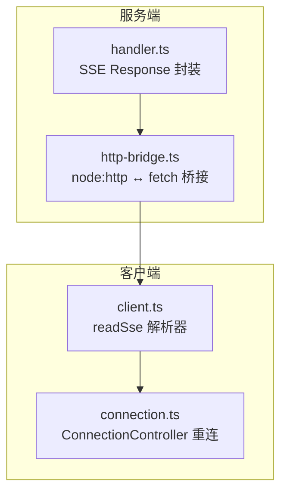
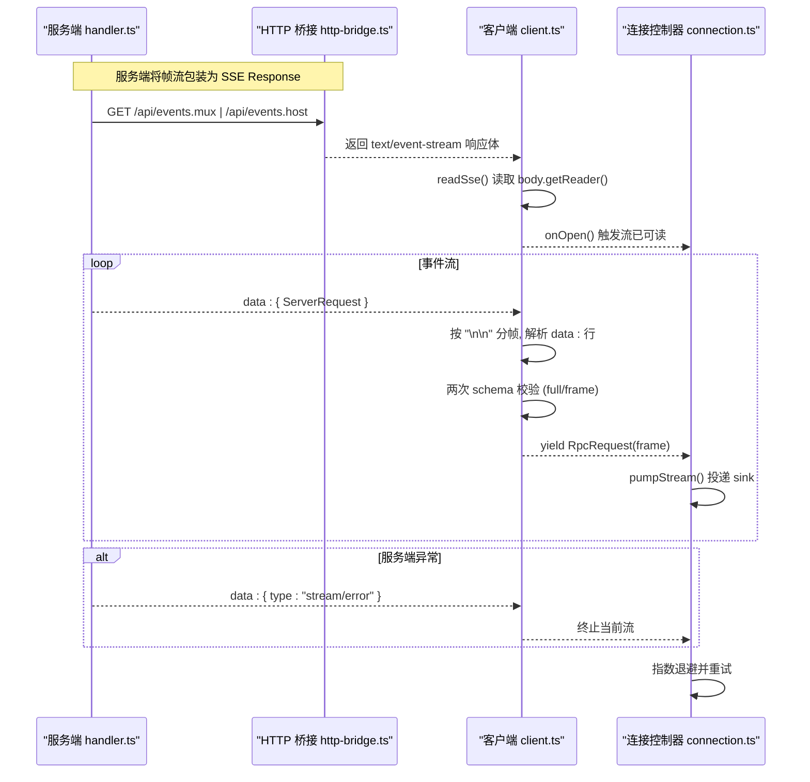

# SSE 实现

<cite>
**本文引用的文件**
- [packages/host/apiproxy/src/fetch/handler.ts](file://packages/host/apiproxy/src/fetch/handler.ts)
- [packages/host/apiproxy/src/fetch/client.ts](file://packages/host/apiproxy/src/fetch/client.ts)
- [packages/client/connection/src/http-bridge.ts](file://packages/client/connection/src/http-bridge.ts)
- [packages/client/connection/src/client/connection.ts](file://packages/client/connection/src/client/connection.ts)
- [packages/client/hmr/src/events.ts](file://packages/client/hmr/src/events.ts)
- [packages/client/hmr/src/client/index.ts](file://packages/client/hmr/src/client/index.ts)
- [packages/client/hmr/src/index.ts](file://packages/client/hmr/src/index.ts)
- [docs/subsystems/llm-streaming.md](file://docs/subsystems/llm-streaming.md)
</cite>

## 目录
1. [简介](#简介)
2. [项目结构](#项目结构)
3. [核心组件](#核心组件)
4. [架构总览](#架构总览)
5. [详细组件分析](#详细组件分析)
6. [依赖关系分析](#依赖关系分析)
7. [性能与网络优化](#性能与网络优化)
8. [故障排查指南](#故障排查指南)
9. [结论](#结论)
10. [附录：协议与事件格式](#附录协议与事件格式)

## 简介
本文件系统性梳理 DeepSeek Harness 中的 SSE（Server-Sent Events）实现，覆盖连接建立、事件流处理、错误处理与重连机制；文档化 SSE 消息格式、事件类型与数据处理流程；提供客户端与服务端集成要点、不同网络环境的优化策略与调试技巧；并对 SSE 与其他流式传输协议的优缺点及适用场景进行对比。

## 项目结构
SSE 在 Harness 中贯穿“服务端响应封装 → HTTP 桥接 → 客户端解析 → 连接控制器”的完整链路：
- 服务端将帧流包装为 SSE Response，设置 content-type 为 text/event-stream，并在打开时发送一条注释行以提示代理/中间件通道已活。
- Node.js 侧通过 http-bridge 将 node:http 请求转换为 fetch-shaped handler，并负责背压控制与断开检测。
- 客户端使用 fetch + ReadableStream 读取 SSE 文本流，按 “\n\n” 分帧，解析 data: 行，再经 schema 校验后投递给上层。
- 连接控制器维护双路流（mux/host），执行严格握手（describe + onOpen），失败则指数退避重连。



图表来源
- [packages/host/apiproxy/src/fetch/handler.ts:203-236](file://packages/host/apiproxy/src/fetch/handler.ts#L203-L236)
- [packages/client/connection/src/http-bridge.ts:32-99](file://packages/client/connection/src/http-bridge.ts#L32-L99)
- [packages/host/apiproxy/src/fetch/client.ts:362-408](file://packages/host/apiproxy/src/fetch/client.ts#L362-L408)
- [packages/client/connection/src/client/connection.ts:107-169](file://packages/client/connection/src/client/connection.ts#L107-L169)

章节来源
- [packages/host/apiproxy/src/fetch/handler.ts:203-236](file://packages/host/apiproxy/src/fetch/handler.ts#L203-L236)
- [packages/client/connection/src/http-bridge.ts:32-99](file://packages/client/connection/src/http-bridge.ts#L32-L99)
- [packages/host/apiproxy/src/fetch/client.ts:362-408](file://packages/host/apiproxy/src/fetch/client.ts#L362-L408)
- [packages/client/connection/src/client/connection.ts:107-169](file://packages/client/connection/src/client/connection.ts#L107-L169)

## 核心组件
- 服务端 SSE 封装：将帧流转为 SSE 文本流，首行发送注释行，异常时发送 stream/error 帧后关闭。
- HTTP 桥接：Node 侧将 node:http 请求转成 fetch Request，并将 Response.body 逐块写出，处理背压与断开。
- 客户端 SSE 解析：基于 fetch + ReadableStream 的分帧解析器，支持 onOpen 回调、容错丢弃坏帧、Envelope 观察。
- 连接控制器：双路流泵送、严格握手、指数退避重连、状态去抖上报。

章节来源
- [packages/host/apiproxy/src/fetch/handler.ts:203-236](file://packages/host/apiproxy/src/fetch/handler.ts#L203-L236)
- [packages/client/connection/src/http-bridge.ts:32-99](file://packages/client/connection/src/http-bridge.ts#L32-L99)
- [packages/host/apiproxy/src/fetch/client.ts:362-408](file://packages/host/apiproxy/src/fetch/client.ts#L362-L408)
- [packages/client/connection/src/client/connection.ts:107-169](file://packages/client/connection/src/client/connection.ts#L107-L169)

## 架构总览
下图展示一次 SSE 事件从服务端到客户端的端到端调用序列，包括握手、数据推送、错误与重连。



图表来源
- [packages/host/apiproxy/src/fetch/handler.ts:203-236](file://packages/host/apiproxy/src/fetch/handler.ts#L203-L236)
- [packages/client/connection/src/http-bridge.ts:32-99](file://packages/client/connection/src/http-bridge.ts#L32-L99)
- [packages/host/apiproxy/src/fetch/client.ts:362-408](file://packages/host/apiproxy/src/fetch/client.ts#L362-L408)
- [packages/client/connection/src/client/connection.ts:178-192](file://packages/client/connection/src/client/connection.ts#L178-L192)

## 详细组件分析

### 服务端 SSE 封装（handler.ts）
- 行为要点
  - 将 AsyncIterable 帧流包装为 ReadableStream，content-type 设置为 text/event-stream，并禁用缓存。
  - 打开时立即写入一条注释行 “: connected”，使代理/中间件识别通道活跃。
  - 正常帧以 “data: <JSON(ServerRequest)>” 形式输出，并以 “\n\n” 作为帧边界。
  - 流内异常捕获后，发送一个 stream/error 帧（携带内部错误信息），然后关闭流。
- 设计考量
  - 注释行避免空闲期无字节导致代理误判连接未建立。
  - 异常帧保证客户端能感知服务侧错误而非静默断开。

章节来源
- [packages/host/apiproxy/src/fetch/handler.ts:203-236](file://packages/host/apiproxy/src/fetch/handler.ts#L203-L236)

### HTTP 桥接（http-bridge.ts）
- 行为要点
  - 将 node:http IncomingMessage 转换为标准 Request，将 Response.body 逐块写出。
  - 通过 res.write 返回值判断背压，必要时等待 drain；同时监听 close 事件以中止上游流。
  - 对过大请求体进行限制，防止内存膨胀。
- 设计考量
  - 断开检测挂靠在 response 上，避免 Node 16+ 中 request close 过早触发导致 SSE 流被误杀。
  - 背压控制确保慢/暂停的 SSE 消费者不会造成无限缓冲。

章节来源
- [packages/client/connection/src/http-bridge.ts:32-99](file://packages/client/connection/src/http-bridge.ts#L32-L99)

### 客户端 SSE 解析器（client.ts）
- 行为要点
  - 使用 fetch 发起 GET，获取 Response.body 的 reader，TextDecoder 解码累积。
  - 按 “\n\n” 分帧，提取所有 data: 行拼接为 payload，先解析为 ServerRequest，再解析 frame。
  - 任一解析失败记录日志并跳过该帧，不中断流；onOpen 在响应头就绪且 body 可读时触发。
  - 暴露 envelope 订阅能力，便于诊断与观测。
- 设计考量
  - 容错优先：单条坏帧不影响整条流。
  - 延迟启动：生成器惰性消费，真正迭代时才建立底层 fetch。

章节来源
- [packages/host/apiproxy/src/fetch/client.ts:362-408](file://packages/host/apiproxy/src/fetch/client.ts#L362-L408)

### 连接控制器（connection.ts）
- 行为要点
  - 同时打开 mux 与 host 两条流，分别注册 onOpen 回调；等待 describe 成功完成严格握手。
  - 若任一流结束或出现 stream/error，进入重连循环；使用指数退避（可配置 base/factor/max）。
  - 状态去抖上报 connected/reconnecting，避免 UI 抖动。
  - 超时保护：当 carrier 从不触发 onOpen 时，通过 streamOpenTimeoutMs 超时继续推进。
- 设计考量
  - 将“物理流建立”和“业务可达性”（describe）绑定，确保 onConnected 时机正确。
  - 重试期间保持幂等，避免重复创建资源。

章节来源
- [packages/client/connection/src/client/connection.ts:107-169](file://packages/client/connection/src/client/connection.ts#L107-L169)
- [packages/client/connection/src/client/connection.ts:178-192](file://packages/client/connection/src/client/connection.ts#L178-L192)

### HMR 开发通道（events.ts / client/index.ts / index.ts）
- 行为要点
  - 开发环境提供 /plugins/events 的 SSE 通道，推送 graph 快照与 rebuilt 通知。
  - 浏览器端使用原生 EventSource 订阅，收到 rebuilt 后按序刷新模块并替换 fiber。
  - 服务端注册路由，收集连接并广播重建事件。
- 设计考量
  - 复用 SSE 语义，但走独立路径，与生产 API 解耦。
  - 自更新安全：旧 bundle 的 EventSource 随旧 fiber 效果关闭，新 bundle 重新建立通道。

章节来源
- [packages/client/hmr/src/events.ts:1-17](file://packages/client/hmr/src/events.ts#L1-L17)
- [packages/client/hmr/src/client/index.ts:98-182](file://packages/client/hmr/src/client/index.ts#L98-L182)
- [packages/client/hmr/src/index.ts:165-191](file://packages/client/hmr/src/index.ts#L165-L191)

## 依赖关系分析
- 耦合与内聚
  - handler.ts 仅关注“帧→SSE 文本”的转换，低耦合。
  - http-bridge.ts 屏蔽 Node 与 fetch 差异，职责单一。
  - client.ts 专注“SSE 文本→结构化帧”的解析与校验。
  - connection.ts 聚合两条流的生命周期与重连策略，是连接层的核心。
- 外部依赖
  - 依赖 WHATWG Fetch/ReadableStream、Node http、EventSource（HMR）。
  - 依赖 Zod schema 做二次校验，保障 wire 契约一致性。
- 潜在环路与风险
  - 各层通过接口/抽象隔离，未见直接循环依赖。
  - 需关注代理/网关对 SSE 的缓存、超时、缓冲策略影响。

```mermaid
graph LR
H["handler.ts"] --> |text/event-stream| B["http-bridge.ts"]
B --> |ReadableStream| C["client.ts"]
C --> |RpcRequest<frame>| CC["connection.ts"]
CC --> |sink(envelope)| 上层业务
```

图表来源
- [packages/host/apiproxy/src/fetch/handler.ts:203-236](file://packages/host/apiproxy/src/fetch/handler.ts#L203-L236)
- [packages/client/connection/src/http-bridge.ts:32-99](file://packages/client/connection/src/http-bridge.ts#L32-L99)
- [packages/host/apiproxy/src/fetch/client.ts:362-408](file://packages/host/apiproxy/src/fetch/client.ts#L362-L408)
- [packages/client/connection/src/client/connection.ts:178-192](file://packages/client/connection/src/client/connection.ts#L178-L192)

## 性能与网络优化
- 服务端
  - 首行注释行提升代理存活探测速度。
  - 异常时发送 stream/error 帧，减少客户端误判。
- 传输层
  - 背压控制：res.write 返回值驱动等待 drain，避免阻塞。
  - 请求体大小限制：防止大请求占用过多内存。
- 客户端
  - 惰性建立：生成器仅在迭代时发起 fetch，降低无用开销。
  - 容错解析：坏帧丢弃，结合 gap detection 由上层修复。
  - 指数退避：backoffBaseMs/backoffFactor/backoffMaxMs 可调，兼顾快速恢复与防风暴。
  - 握手超时：streamOpenTimeoutMs 防止 carrier 不触发 onOpen 导致的死等。
- 代理/网关
  - 建议禁用 SSE 缓存（no-cache），允许长连接与 chunked 传输。
  - 合理设置超时与缓冲上限，避免中间层截断长流。

[本节为通用指导，无需特定文件引用]

## 故障排查指南
- 常见问题定位
  - 连接无法建立：检查 content-type 是否为 text/event-stream；确认代理未缓存或拦截。
  - 流无数据：确认服务端是否发送了注释行；检查 onOpen 是否触发。
  - 频繁重连：查看 backoff 配置与网络抖动；关注 stream/error 帧内容。
  - 解析失败：client.ts 会记录 malformed frame 并跳过；核对 schema 变更与版本兼容。
- 调试技巧
  - 启用 envelope 订阅，观察原始消息到达顺序与数量。
  - 在服务端打印 sseResponse 的 start/close 生命周期，验证帧输出。
  - 在连接控制器中打印 state 变化与重试次数，辅助定位不稳定点。
- 参考实现
  - 连接控制器状态机与重试逻辑见 connection.ts。
  - SSE 解析与容错见 client.ts 的 readSse。
  - 服务端异常帧发送见 handler.ts。

章节来源
- [packages/client/connection/src/client/connection.ts:107-169](file://packages/client/connection/src/client/connection.ts#L107-L169)
- [packages/host/apiproxy/src/fetch/client.ts:362-408](file://packages/host/apiproxy/src/fetch/client.ts#L362-L408)
- [packages/host/apiproxy/src/fetch/handler.ts:203-236](file://packages/host/apiproxy/src/fetch/handler.ts#L203-L236)

## 结论
Harness 的 SSE 实现以“简洁、健壮、可观测”为目标：服务端以最小成本将帧流推送到客户端；传输层保证背压与断开检测；客户端解析器具备强容错；连接控制器提供严格的握手与稳健的重连策略。配合 HMR 通道的独立 SSE 路径，开发与生产场景均获得一致的事件流体验。

[本节为总结，无需特定文件引用]

## 附录：协议与事件格式

### SSE 消息格式
- 媒体类型：text/event-stream
- 帧边界：以两个换行符 “\n\n” 分隔
- 数据行：data: <JSON(ServerRequest)>
- 可选注释行：: connected（用于提示通道活跃）
- 错误帧：data: { type: "stream/error", error: {...} }

章节来源
- [packages/host/apiproxy/src/fetch/handler.ts:203-236](file://packages/host/apiproxy/src/fetch/handler.ts#L203-L236)

### 事件类型与数据结构
- MuxFrame / HostFrame：由各自 schema 定义，承载具体业务事件。
- ServerRequest：包含 rpcId、method、payload 的标准信封，客户端进行两层解析（full → frame）。
- HMR 事件：PluginsEventFrame 包含 graph 与 rebuilt 两种类型，用于开发热重载。

章节来源
- [packages/host/apiproxy/src/fetch/client.ts:362-408](file://packages/host/apiproxy/src/fetch/client.ts#L362-L408)
- [packages/client/hmr/src/events.ts:1-17](file://packages/client/hmr/src/events.ts#L1-L17)

### 流式 LLM 上下文
- StreamChunk 定义了模型响应的原始流协议（block-start/text-delta/tool-call-delta/block-end/usage/finish），供适配器与装配器协作。
- 注意：LLM 流式协议与 SSE 传输层解耦，SSE 可用于承载任意帧流，而 LLM 流通常通过适配器在更高层组织。

章节来源
- [docs/subsystems/llm-streaming.md:154-182](file://docs/subsystems/llm-streaming.md#L154-L182)