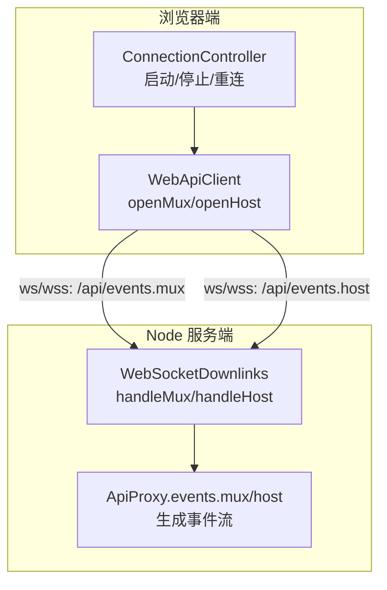
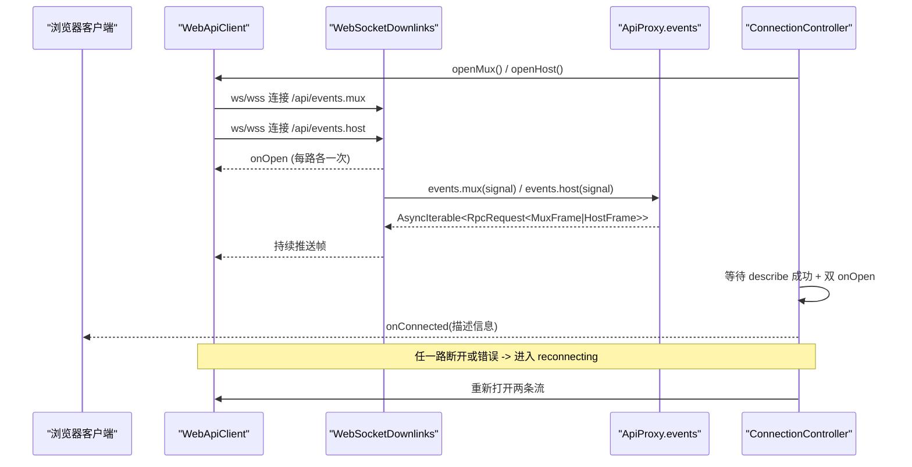
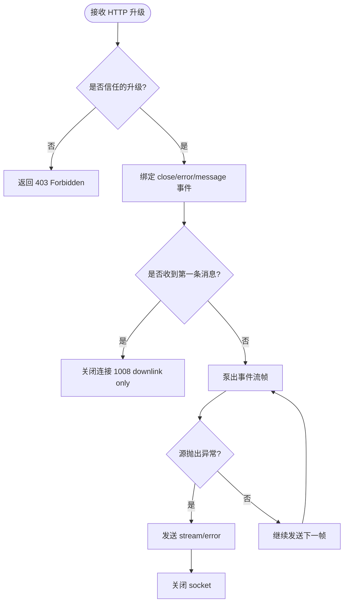
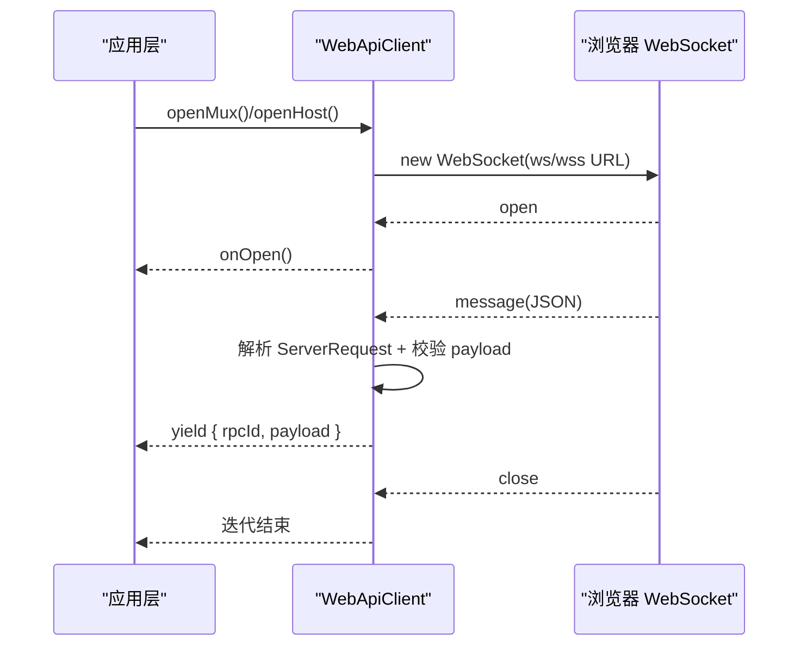
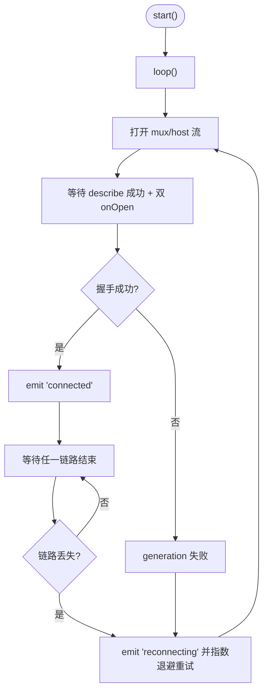
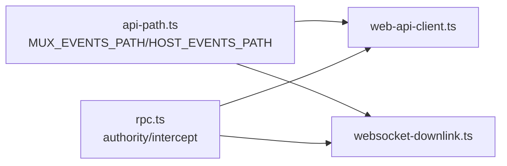

# WebSocket 实现

<cite>
**本文引用的文件**
- [websocket-downlink.ts](file://packages/client/connection/src/websocket-downlink.ts)
- [web-api-client.ts](file://packages/client/connection/src/client/web-api-client.ts)
- [connection.ts](file://packages/client/connection/src/client/connection.ts)
- [api-path.ts](file://packages/client/connection/src/api-path.ts)
- [rpc.ts](file://packages/client/connection/src/rpc.ts)
- [api.ts](file://packages/client/connection/src/client/api.ts)
- [websocket-downlink.host.spec.ts](file://packages/client/connection/tests/websocket-downlink.host.spec.ts)
- [connection.client.spec.ts](file://packages/client/connection/tests/connection.client.spec.ts)
- [web-server.md](file://docs/subsystems/web-server.md)
</cite>

## 目录
1. [简介](#简介)
2. [项目结构](#项目结构)
3. [核心组件](#核心组件)
4. [架构总览](#架构总览)
5. [详细组件分析](#详细组件分析)
6. [依赖关系分析](#依赖关系分析)
7. [性能与兼容性](#性能与兼容性)
8. [故障排查指南](#故障排查指南)
9. [结论](#结论)

## 简介
本文件系统化说明 DeepSeek Harness 中基于 WebSocket 的客户端/服务端连接实现，覆盖连接建立、消息协议、双向通信边界、连接管理与重连策略。重点包括：
- 两条独立的下游事件流：mux（会话/模型等）与 host（主机事件），各自通过独立 WebSocket 承载
- 上行仍为 HTTP（RPC 调用与 respond 走 fetch），下行使用 WebSocket
- 严格的握手流程：描述接口 + 双通道 onOpen 就绪后才认为连接成功
- 断线检测与指数退避重连、状态机管理、错误帧处理与资源清理

## 项目结构
WebSocket 相关代码集中在 client/connection 包内，分为“服务端载体”和“浏览器客户端载体”，并由连接控制器统一编排生命周期与重连。

图表来源
- [web-api-client.ts:18-32](file://packages/client/connection/src/client/web-api-client.ts#L18-L32)
- [websocket-downlink.ts:64-82](file://packages/client/connection/src/websocket-downlink.ts#L64-L82)
- [connection.ts:107-169](file://packages/client/connection/src/client/connection.ts#L107-L169)

章节来源
- [api-path.ts:7-14](file://packages/client/connection/src/api-path.ts#L7-L14)
- [web-server.md:73-78](file://docs/subsystems/web-server.md#L73-L78)

## 核心组件
- WebApiClient：浏览器端载体，HTTP 用于上行 RPC，WebSocket 用于两条下游事件流；负责 URL 构造、消息解析、异常丢弃与关闭信号传播
- WebSocketDownlinks：服务端载体，持有 ws 服务器，按路径升级 mux/host 两个 WebSocket，并将上游事件流泵出到 socket；拒绝任何来自客户端的上行消息
- ConnectionController：连接控制器，维护 generation/attempt、指数退避、严格握手（describe + 双 onOpen）、状态切换（connected/reconnecting）、sink 隔离与异常保护
- 协议与路径：/api/events.mux 与 /api/events.host 为固定路径；RPC 信封使用 RpcRequest/ServerRequest 模式，payload 由 schema 校验

章节来源
- [web-api-client.ts:1-92](file://packages/client/connection/src/client/web-api-client.ts#L1-L92)
- [websocket-downlink.ts:1-154](file://packages/client/connection/src/websocket-downlink.ts#L1-L154)
- [connection.ts:1-203](file://packages/client/connection/src/client/connection.ts#L1-L203)
- [api-path.ts:1-15](file://packages/client/connection/src/api-path.ts#L1-L15)
- [rpc.ts:1-78](file://packages/client/connection/src/rpc.ts#L1-L78)
- [api.ts:1-55](file://packages/client/connection/src/client/api.ts#L1-L55)

## 架构总览
下图展示一次完整连接的生命周期：客户端发起两条 WebSocket 连接，服务端分别升级为 mux/host 流；控制器等待 describe 成功且两路 onOpen 后进入 connected；任一链路失败触发重连。

图表来源
- [web-api-client.ts:18-32](file://packages/client/connection/src/client/web-api-client.ts#L18-L32)
- [websocket-downlink.ts:64-82](file://packages/client/connection/src/websocket-downlink.ts#L64-L82)
- [connection.ts:107-169](file://packages/client/connection/src/client/connection.ts#L107-L169)

## 详细组件分析

### 服务端载体：WebSocketDownlinks
- 职责：持有 ws 服务器实例，按路径升级 mux/host 两个 WebSocket；将 ApiProxy 的事件流泵送到 socket；禁止客户端上行消息（收到即关闭并返回 1008）
- 关键行为：
  - handleMux/handleHost：创建 AbortController，监听 close/error 以中止源流；首次 message 即关闭连接（downlink only）
  - pump：逐条发送帧；若源抛出异常则先发送 stream/error 再关闭；finally 确保 abort 与 socket 关闭
  - rejectWebSocketUpgrade：对未信任的升级请求直接返回 403

图表来源
- [websocket-downlink.ts:99-137](file://packages/client/connection/src/websocket-downlink.ts#L99-L137)
- [websocket-downlink.ts:144-153](file://packages/client/connection/src/websocket-downlink.ts#L144-L153)

章节来源
- [websocket-downlink.ts:1-154](file://packages/client/connection/src/websocket-downlink.ts#L1-L154)
- [websocket-downlink.host.spec.ts:78-156](file://packages/client/connection/tests/websocket-downlink.host.spec.ts#L78-L156)
- [websocket-downlink.host.spec.ts:158-198](file://packages/client/connection/tests/websocket-downlink.host.spec.ts#L158-L198)
- [websocket-downlink.host.spec.ts:233-272](file://packages/client/connection/tests/websocket-downlink.host.spec.ts#L233-L272)

### 客户端载体：WebApiClient
- 职责：封装浏览器 WebSocket 接入；将 ws 消息解析为 ServerRequest，再用 schema 校验 payload；将帧推入异步生成器供上层消费；在 abort/close 时正确释放资源
- 关键点：
  - openMux/openHost：根据当前协议选择 ws/wss，并传入对应 schema
  - readWebSocket：维护 inbox 与 wake 机制，保证有序消费；遇到二进制帧或解析失败直接丢弃并记录日志
  - 关闭语义：abort 或 close 时立即关闭 socket，移除监听器

图表来源
- [web-api-client.ts:18-92](file://packages/client/connection/src/client/web-api-client.ts#L18-L92)

章节来源
- [web-api-client.ts:1-92](file://packages/client/connection/src/client/web-api-client.ts#L1-L92)

### 连接控制器：ConnectionController
- 职责：启动/停止连接循环；维护 generation/attempt；执行严格握手（host.describe + 双 onOpen）；失败后指数退避重连；对外暴露 connected/reconnecting 状态
- 关键参数：
  - backoffBaseMs/backoffFactor/backoffMaxMs：退避策略
  - streamOpenTimeoutMs：等待双 onOpen 的超时上限，避免代理不触发 onOpen 导致死等
- 关键流程：
  - loop：并发开启 mux/host 流，等待 describe 与 onOpen；成功后 emit connected；任一失败进入 reconnecting 并重试
  - pumpStream：遇到 stream/error 或异常中断即结束当前 generation，交由上层重连
  - sink 隔离：业务 sink 抛错不会中断连接泵

图表来源
- [connection.ts:107-169](file://packages/client/connection/src/client/connection.ts#L107-L169)
- [connection.ts:178-201](file://packages/client/connection/src/client/connection.ts#L178-L201)

章节来源
- [connection.ts:1-203](file://packages/client/connection/src/client/connection.ts#L1-L203)
- [connection.client.spec.ts:1-322](file://packages/client/connection/tests/connection.client.spec.ts#L1-L322)

### 消息协议与事件类型
- 传输信封：RpcRequest/ServerRequest，包含 rpcId 与 method/payload
- 事件类型：
  - MuxFrame：会话/模型/工具等事件（如 session/subscribed）
  - HostFrame：主机事件（如 host/remote-event）
  - 错误帧：stream/error，携带 code/message/details
- 校验：客户端使用 schema 对 payload 进行强校验，非法帧直接丢弃并记录日志

章节来源
- [api.ts:8-36](file://packages/client/connection/src/client/api.ts#L8-L36)
- [websocket-downlink.ts:36-44](file://packages/client/connection/src/websocket-downlink.ts#L36-L44)
- [web-api-client.ts:51-64](file://packages/client/connection/src/client/web-api-client.ts#L51-L64)

### 连接管理与重连
- 双通道独立：mux 与 host 各自拥有独立 WebSocket，互不影响
- 严格握手：describe 成功 + 双 onOpen 才认为连接就绪
- 断线检测：任一链路错误或关闭即视为 generation 失败
- 重连策略：指数退避 + 抖动，最大延迟上限；可配置
- 资源清理：abort/close 时关闭 socket、移除监听、终止源迭代器

章节来源
- [connection.ts:3-24](file://packages/client/connection/src/client/connection.ts#L3-L24)
- [connection.ts:107-169](file://packages/client/connection/src/client/connection.ts#L107-L169)
- [websocket-downlink.ts:84-97](file://packages/client/connection/src/websocket-downlink.ts#L84-L97)

## 依赖关系分析
- 路径与路由：/api 前缀由 web server 注册，具体 upgrade 路径由 connection 插件声明
- 客户端与服务端共享路径常量，避免漂移
- RPC 通道与信任策略：通过 rpc.ts 定义 authority 与拦截器，保障安全边界

图表来源
- [api-path.ts:7-14](file://packages/client/connection/src/api-path.ts#L7-L14)
- [rpc.ts:24-53](file://packages/client/connection/src/rpc.ts#L24-L53)

章节来源
- [web-server.md:73-78](file://docs/subsystems/web-server.md#L73-L78)
- [rpc.ts:1-78](file://packages/client/connection/src/rpc.ts#L1-L78)

## 性能与兼容性
- 连接复用与限制：
  - 两条独立 WebSocket 绕过 HTTP/1.1 六连接限制，提升并发能力
  - 上行仍走 HTTP fetch，保持超时、取消、状态码与相关性等既有语义
- 背压与吞吐：
  - 服务端逐帧发送，失败时快速失败并关闭，避免堆积
  - 客户端使用 inbox + wake 机制顺序消费，避免阻塞主线程
- 兼容性：
  - 自动选择 ws/wss 协议
  - 二进制帧与非法 payload 被静默丢弃，增强鲁棒性
- 心跳与保活：
  - 当前实现未内置心跳；可通过上层业务帧或 keepalive 扩展
  - 若需跨代理/CDN 保活，可在框架层增加 ping/pong 或应用级心跳帧

[本节为通用指导，不直接分析具体文件]

## 故障排查指南
- 客户端收到 1008 downlink only：
  - 原因：向 downlink-only 的 WebSocket 发送了上行消息
  - 定位：检查是否误用 WebSocket 做上行 RPC（应使用 fetch）
  - 参考：服务端在首次 message 即关闭连接
- 连接无法就绪：
  - 现象：长时间停留在 connecting
  - 可能原因：代理未转发 onOpen、describe 失败、网络不可达
  - 处理：检查 streamOpenTimeoutMs 配置与网络策略
- 频繁重连：
  - 现象：反复出现 reconnecting
  - 可能原因：服务端异常、网络抖动、证书问题
  - 处理：查看 stream/error 帧内容，确认后端健康
- 资源泄漏：
  - 现象：页面关闭后仍有连接
  - 处理：确认 abort/close 时已关闭 socket 并移除监听

章节来源
- [websocket-downlink.ts:109-111](file://packages/client/connection/src/websocket-downlink.ts#L109-L111)
- [websocket-downlink.host.spec.ts:134-156](file://packages/client/connection/tests/websocket-downlink.host.spec.ts#L134-L156)
- [connection.ts:132-169](file://packages/client/connection/src/client/connection.ts#L132-L169)
- [web-api-client.ts:66-90](file://packages/client/connection/src/client/web-api-client.ts#L66-L90)

## 结论
DeepSeek Harness 的 WebSocket 实现采用“上行 HTTP + 下行双 WebSocket”的分层设计，结合严格握手、指数退避重连与健壮的错误处理，既满足高并发与低耦合需求，又保持了与现有 RPC 语义的一致性。对于生产环境，建议在上层补充心跳与监控指标，并根据部署环境调优重连与超时参数。