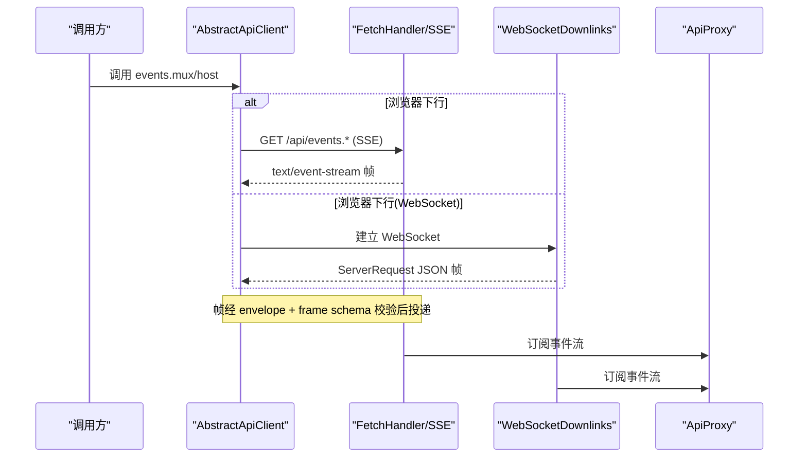
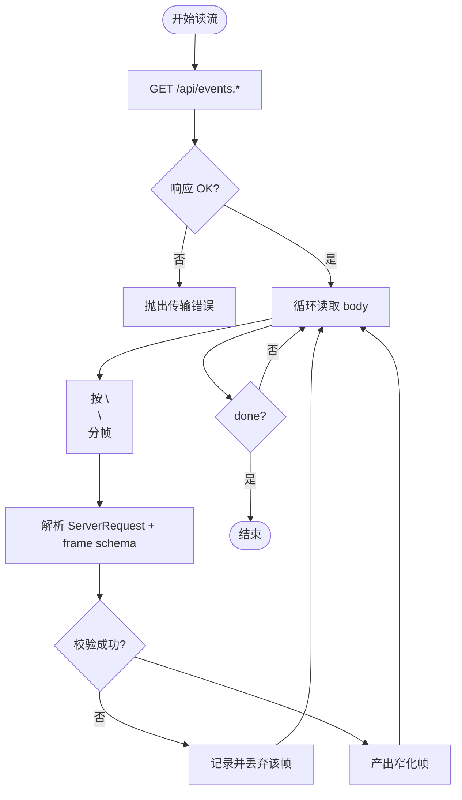
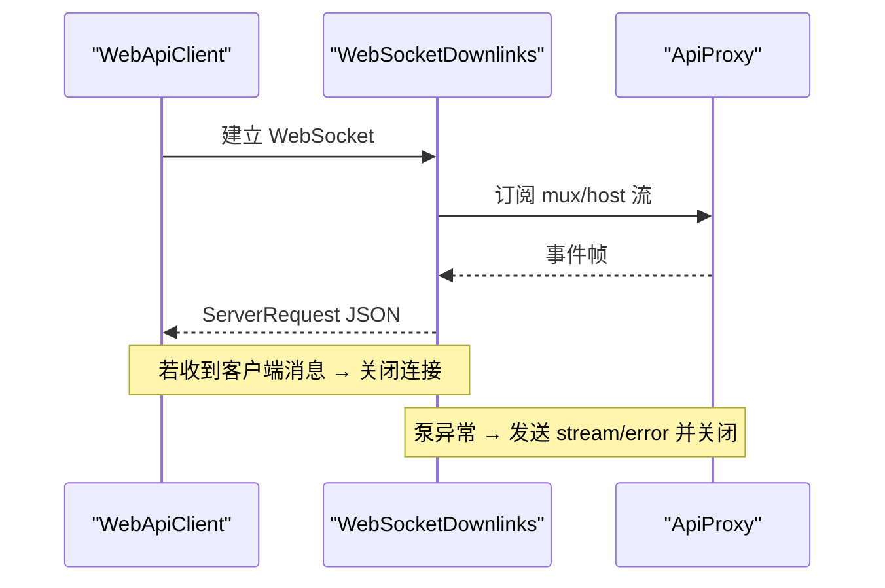
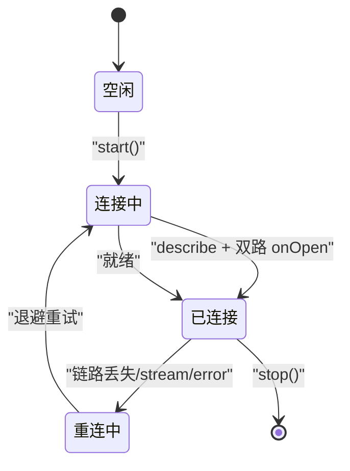
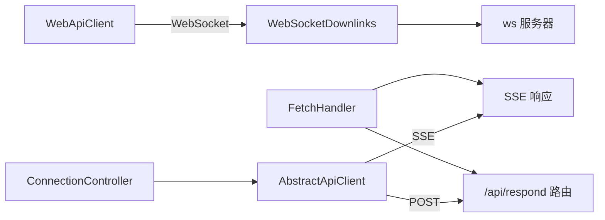

# 流式传输协议

<cite>
**本文引用的文件**
- [packages/host/apiproxy/src/fetch/client.ts](file://packages/host/apiproxy/src/fetch/client.ts)
- [packages/host/apiproxy/src/fetch/handler.ts](file://packages/host/apiproxy/src/fetch/handler.ts)
- [packages/client/connection/src/client/web-api-client.ts](file://packages/client/connection/src/client/web-api-client.ts)
- [packages/client/connection/src/websocket-downlink.ts](file://packages/client/connection/src/websocket-downlink.ts)
- [packages/client/connection/src/client/connection.ts](file://packages/client/connection/src/client/connection.ts)
- [packages/mcp/mcp-client/src/connection.ts](file://packages/mcp/mcp-client/src/connection.ts)
- [packages/llm/llm-deepseek/src/sse.ts](file://packages/llm/llm-deepseek/src/sse.ts)
- [apps/web/tests/smoke-real.e2e.ts](file://apps/web/tests/smoke-real.e2e.ts)
</cite>

## 目录
1. [简介](#简介)
2. [项目结构](#项目结构)
3. [核心组件](#核心组件)
4. [架构总览](#架构总览)
5. [详细组件分析](#详细组件分析)
6. [依赖关系分析](#依赖关系分析)
7. [性能考量](#性能考量)
8. [故障排查指南](#故障排查指南)
9. [结论](#结论)
10. [附录](#附录)

## 简介
本文件系统性说明 DeepSeek Harness 中流式传输协议的实现与使用，重点覆盖：
- SSE（Server-Sent Events）与 WebSocket 两种下行通道在浏览器与宿主端的实现、数据帧格式、错误处理与断线重连。
- 协议选择策略与在不同网络环境下的优化建议。
- 实际集成示例与调试技巧。

DeepSeek Harness 将“逻辑 RPC 协议”与“物理载体”解耦：上层业务只面对统一的 IApiClient 抽象；底层通过 HTTP POST 上行 + SSE/WebSocket 下行承载事件流。浏览器端默认以 WebSocket 作为下行通道，进程内或测试路径可回退到基于 fetch 的 SSE 通道，从而保证协议一致性与可测试性。

## 项目结构
围绕流式传输的关键代码分布在以下位置：
- 主机侧 API 代理与 SSE 编码：packages/host/apiproxy/src/fetch/handler.ts
- 通用客户端抽象与 SSE 解码：packages/host/apiproxy/src/fetch/client.ts
- 浏览器端 WebSocket 下行实现：packages/client/connection/src/client/web-api-client.ts
- 主机侧 WebSocket 下行泵：packages/client/connection/src/websocket-downlink.ts
- 连接控制器与重连策略：packages/client/connection/src/client/connection.ts
- MCP 客户端的重连策略参考：packages/mcp/mcp-client/src/connection.ts
- LLM 适配器中的 SSE 解析参考：packages/llm/llm-deepseek/src/sse.ts
- 测试中对 text/event-stream 的使用：apps/web/tests/smoke-real.e2e.ts

```mermaid
graph TB
subgraph "浏览器"
A["WebApiClient<br/>HTTP 上行 + WebSocket 下行"]
end
subgraph "宿主/服务器"
B["WebSocketDownlinks<br/>升级并泵送事件流"]
C["FetchHandler<br/>SSE 响应封装"]
D["ApiProxy<br/>事件源 mux/host"]
end
A --> |POST /api/*| C
A --> |GET /api/events.* (SSE)| C
A --> |WS /api/events.*| B
B --> |文本消息: ServerRequest JSON| A
C --> |text/event-stream| A
D --> B
D --> C
```

图表来源
- [packages/client/connection/src/client/web-api-client.ts:12-32](file://packages/client/connection/src/client/web-api-client.ts#L12-L32)
- [packages/client/connection/src/websocket-downlink.ts:51-82](file://packages/client/connection/src/websocket-downlink.ts#L51-L82)
- [packages/host/apiproxy/src/fetch/handler.ts:203-235](file://packages/host/apiproxy/src/fetch/handler.ts#L203-L235)
- [packages/host/apiproxy/src/fetch/client.ts:352-360](file://packages/host/apiproxy/src/fetch/client.ts#L352-L360)

章节来源
- [packages/host/apiproxy/src/fetch/handler.ts:1-321](file://packages/host/apiproxy/src/fetch/handler.ts#L1-L321)
- [packages/host/apiproxy/src/fetch/client.ts:1-550](file://packages/host/apiproxy/src/fetch/client.ts#L1-L550)
- [packages/client/connection/src/client/web-api-client.ts:1-92](file://packages/client/connection/src/client/web-api-client.ts#L1-L92)
- [packages/client/connection/src/websocket-downlink.ts:1-154](file://packages/client/connection/src/websocket-downlink.ts#L1-L154)
- [packages/client/connection/src/client/connection.ts:54-95](file://packages/client/connection/src/client/connection.ts#L54-L95)

## 核心组件
- 主机侧 SSE 编码器：将 ApiProxy 的事件流包装为 text/event-stream，首行发送注释行以提示“通道已建立”，并在实现异常时发送 stream/error 帧后关闭。
- 通用客户端 SSE 解码器：基于 streaming fetch 读取 body，按 \n\n 分帧，提取 data: 行，解析 ServerRequest 与具体 frame schema，失败帧丢弃不中断流。
- 浏览器 WebSocket 下行：每个逻辑流一个独立 WebSocket，仅接收服务端推送；每条消息为完整 ServerRequest JSON，先校验信封再校验具体 frame。
- 主机侧 WebSocket 下行泵：拒绝任何客户端应用消息（downlink only），发生异常时发送 stream/error 帧并关闭连接。
- 连接控制器：负责打开两个下行流（mux/host）、等待 onOpen 就绪、投递帧至 sink、在丢失时指数退避重连、隔离 sink 异常。

章节来源
- [packages/host/apiproxy/src/fetch/handler.ts:194-235](file://packages/host/apiproxy/src/fetch/handler.ts#L194-L235)
- [packages/host/apiproxy/src/fetch/client.ts:362-408](file://packages/host/apiproxy/src/fetch/client.ts#L362-L408)
- [packages/client/connection/src/client/web-api-client.ts:34-90](file://packages/client/connection/src/client/web-api-client.ts#L34-L90)
- [packages/client/connection/src/websocket-downlink.ts:23-44](file://packages/client/connection/src/websocket-downlink.ts#L23-L44)
- [packages/client/connection/src/websocket-downlink.ts:118-137](file://packages/client/connection/src/websocket-downlink.ts#L118-L137)
- [packages/client/connection/src/client/connection.ts:54-95](file://packages/client/connection/src/client/connection.ts#L54-L95)

## 架构总览
- 上行：所有客户端→宿主的调用统一走 HTTP POST /api/<method>，携带 ClientRequest 信封。
- 下行：
  - 浏览器：每个逻辑流（mux/host）一个 WebSocket，消息体为 ServerRequest JSON。
  - 进程内/测试：SSE GET /api/events.mux 与 /api/events.host，text/event-stream，\n\n 分帧。
- 协议一致性：无论载体如何，均遵循同一 ServerRequest/RpcRequest 模型与 Zod schema 校验。



图表来源
- [packages/host/apiproxy/src/fetch/handler.ts:252-259](file://packages/host/apiproxy/src/fetch/handler.ts#L252-L259)
- [packages/host/apiproxy/src/fetch/client.ts:352-360](file://packages/host/apiproxy/src/fetch/client.ts#L352-L360)
- [packages/client/connection/src/client/web-api-client.ts:18-32](file://packages/client/connection/src/client/web-api-client.ts#L18-L32)
- [packages/client/connection/src/websocket-downlink.ts:64-82](file://packages/client/connection/src/websocket-downlink.ts#L64-L82)

## 详细组件分析

### SSE 通道（fetch + text/event-stream）
- 建立：客户端发起 GET /api/events.*，服务端返回 content-type: text/event-stream，首行发送注释行表明通道活跃。
- 分帧：客户端按 \n\n 切分，收集 data: 行拼接，解析为 ServerRequest，再按路径对应的 frame schema 校验。
- 错误处理：任一帧解析失败则记录并跳过，不中断流；实现异常时服务端发送 stream/error 帧后关闭。
- 取消：迭代结束或信号中止时取消 reader。



图表来源
- [packages/host/apiproxy/src/fetch/client.ts:362-408](file://packages/host/apiproxy/src/fetch/client.ts#L362-L408)
- [packages/host/apiproxy/src/fetch/handler.ts:203-235](file://packages/host/apiproxy/src/fetch/handler.ts#L203-L235)

章节来源
- [packages/host/apiproxy/src/fetch/client.ts:362-408](file://packages/host/apiproxy/src/fetch/client.ts#L362-L408)
- [packages/host/apiproxy/src/fetch/handler.ts:203-235](file://packages/host/apiproxy/src/fetch/handler.ts#L203-L235)

### WebSocket 下行通道
- 建立：浏览器为每个逻辑流新建 WebSocket，URL 由 base 转换 ws/wss。
- 消息：每条消息为完整 ServerRequest JSON；先校验信封，再校验具体 frame。
- 单向：仅允许服务端→客户端；收到客户端消息直接关闭（downlink only）。
- 错误：泵异常时发送 stream/error 帧并关闭；连接关闭时通知消费者。



图表来源
- [packages/client/connection/src/client/web-api-client.ts:34-90](file://packages/client/connection/src/client/web-api-client.ts#L34-L90)
- [packages/client/connection/src/websocket-downlink.ts:109-115](file://packages/client/connection/src/websocket-downlink.ts#L109-L115)
- [packages/client/connection/src/websocket-downlink.ts:118-137](file://packages/client/connection/src/websocket-downlink.ts#L118-L137)

章节来源
- [packages/client/connection/src/client/web-api-client.ts:34-90](file://packages/client/connection/src/client/web-api-client.ts#L34-L90)
- [packages/client/connection/src/websocket-downlink.ts:109-137](file://packages/client/connection/src/websocket-downlink.ts#L109-L137)

### 连接控制器与重连机制
- 生命周期：start() 启动循环，stop() 中止当前 generation 的流。
- 就绪握手：等待 describe 完成且两个下行流的 onOpen 都触发，超时保护避免卡死。
- 重连策略：指数退避 + 抖动，失败收敛为 reconnecting 状态，stream/error 视为链路丢失触发重连。
- 隔离性：sink 抛错不影响泵继续消费后续帧。



图表来源
- [packages/client/connection/src/client/connection.ts:54-95](file://packages/client/connection/src/client/connection.ts#L54-L95)
- [packages/mcp/mcp-client/src/connection.ts:214-225](file://packages/mcp/mcp-client/src/connection.ts#L214-L225)

章节来源
- [packages/client/connection/src/client/connection.ts:54-95](file://packages/client/connection/src/client/connection.ts#L54-L95)
- [packages/mcp/mcp-client/src/connection.ts:214-225](file://packages/mcp/mcp-client/src/connection.ts#L214-L225)

### LLM 适配器的 SSE 解析（参考）
- 使用标准库 EventSourceParserStream 对 text/event-stream 进行分帧，过滤注释行，逐条产出 data。
- 遇到 [DONE] 终止；流结束未见到哨兵则抛出 STREAM_CLOSED。

章节来源
- [packages/llm/llm-deepseek/src/sse.ts:14-34](file://packages/llm/llm-deepseek/src/sse.ts#L14-L34)

## 依赖关系分析
- 主机侧：
  - FetchHandler 提供 /api/events.mux 与 /api/events.host 的 SSE 响应，以及 /api/respond 的上行应答路由。
  - WebSocketDownlinks 提供浏览器下行的 WebSocket 升级与泵送。
- 客户端侧：
  - AbstractApiClient 定义统一接口与 SSE 解码；WebApiClient 在浏览器中以 WebSocket 替代 SSE 下行。
  - ConnectionController 管理多流生命周期与重连。
- 外部依赖：
  - ws 用于 Node 端 WebSocket 服务。
  - eventsource-parser/stream 用于 LLM SSE 解析（非主通道）。



图表来源
- [packages/host/apiproxy/src/fetch/handler.ts:243-318](file://packages/host/apiproxy/src/fetch/handler.ts#L243-L318)
- [packages/client/connection/src/websocket-downlink.ts:51-56](file://packages/client/connection/src/websocket-downlink.ts#L51-L56)
- [packages/host/apiproxy/src/fetch/client.ts:352-360](file://packages/host/apiproxy/src/fetch/client.ts#L352-L360)
- [packages/client/connection/src/client/web-api-client.ts:12-32](file://packages/client/connection/src/client/web-api-client.ts#L12-L32)
- [packages/client/connection/src/client/connection.ts:54-95](file://packages/client/connection/src/client/connection.ts#L54-L95)

章节来源
- [packages/host/apiproxy/src/fetch/handler.ts:243-318](file://packages/host/apiproxy/src/fetch/handler.ts#L243-L318)
- [packages/client/connection/src/websocket-downlink.ts:51-56](file://packages/client/connection/src/websocket-downlink.ts#L51-L56)
- [packages/host/apiproxy/src/fetch/client.ts:352-360](file://packages/host/apiproxy/src/fetch/client.ts#L352-L360)
- [packages/client/connection/src/client/web-api-client.ts:12-32](file://packages/client/connection/src/client/web-api-client.ts#L12-L32)
- [packages/client/connection/src/client/connection.ts:54-95](file://packages/client/connection/src/client/connection.ts#L54-L95)

## 性能考量
- 连接并发：
  - 浏览器端每个逻辑流一个独立 WebSocket，避免受限于 HTTP/1.1 的六连接配额；开发服务器默认 HTTP/1.1，生产部署前缀代理可能支持 HTTP/2，但产品不依赖其特性。
- 帧开销：
  - SSE 使用 \n\n 分帧与 data: 行拼接；WebSocket 每条消息为完整 JSON，两者均经过 schema 校验，确保类型安全。
- 背压与缓冲：
  - 客户端维护 inbox 队列与唤醒机制，避免事件风暴导致 UI 频繁更新；事件观察采用微任务批处理。
- 重连成本：
  - 指数退避 + 抖动减少拥塞；stream/error 被收敛为重连而非业务层分发，降低无效处理。

[本节为通用指导，无需特定文件引用]

## 故障排查指南
- 无法建立 SSE：
  - 检查响应是否为 2xx 且 content-type 为 text/event-stream；确认首行注释是否发出。
  - 参考测试中对 text/event-stream 的设置与读取。
- 帧解析失败：
  - 客户端会记录并丢弃坏帧；检查上游是否产生非法 JSON 或 schema 不匹配。
- WebSocket 被拒绝：
  - 主机端对非信任升级返回 403；确认请求来自可信来源且未发送应用层消息。
- 重连风暴：
  - 调整 backoffBaseMs/backoffFactor/backoffMaxMs；确认 streamOpenTimeoutMs 合理以避免假就绪。
- 调试技巧：
  - 订阅 envelope 批处理日志，定位问题帧。
  - 在浏览器控制台查看 WebSocket 消息内容；在服务端捕获 pump 异常与关闭原因。

章节来源
- [apps/web/tests/smoke-real.e2e.ts:213-408](file://apps/web/tests/smoke-real.e2e.ts#L213-L408)
- [packages/host/apiproxy/src/fetch/client.ts:394-400](file://packages/host/apiproxy/src/fetch/client.ts#L394-L400)
- [packages/client/connection/src/websocket-downlink.ts:144-153](file://packages/client/connection/src/websocket-downlink.ts#L144-L153)
- [packages/client/connection/src/client/connection.ts:54-95](file://packages/client/connection/src/client/connection.ts#L54-L95)

## 结论
DeepSeek Harness 通过统一的 RPC 信封与 schema 校验，将 SSE 与 WebSocket 两种物理载体无缝接入同一逻辑协议层。浏览器端优先使用 WebSocket 以获得更好的并发与实时性；进程内与测试路径保留 SSE 以保证等价性与可测性。连接控制器提供健壮的重连与状态管理，配合错误帧与超时保护，确保在复杂网络环境下稳定运行。

[本节为总结性内容，无需特定文件引用]

## 附录

### 协议选择策略
- 浏览器：
  - 下行：WebSocket（每逻辑流一条连接）。
  - 上行：HTTP POST /api/*。
- 进程内/测试：
  - 下行：SSE GET /api/events.*。
  - 上行：HTTP POST /api/*。
- 理由：
  - WebSocket 突破 HTTP/1.1 连接限制，适合高并发事件推送；SSE 便于进程内复用与测试。

章节来源
- [packages/client/connection/src/client/web-api-client.ts:12-32](file://packages/client/connection/src/client/web-api-client.ts#L12-L32)
- [packages/host/apiproxy/src/fetch/handler.ts:252-259](file://packages/host/apiproxy/src/fetch/handler.ts#L252-L259)

### 数据传输格式
- 信封：ServerRequest（type/rpcId/method/payload）。
- 帧：MuxFrame/HostFrame，按路径分别限定。
- 分帧：
  - SSE：\n\n 分隔，data: 行拼接。
  - WebSocket：单条消息即完整 JSON。

章节来源
- [packages/host/apiproxy/src/fetch/handler.ts:194-235](file://packages/host/apiproxy/src/fetch/handler.ts#L194-L235)
- [packages/client/connection/src/client/web-api-client.ts:51-64](file://packages/client/connection/src/client/web-api-client.ts#L51-L64)

### 错误处理与断线重连
- 错误帧：stream/error 表示实现异常，客户端将其视为链路丢失并触发重连。
- 重连：指数退避 + 抖动，直到恢复；stop() 立即中止当前 generation。
- 超时：streamOpenTimeoutMs 防止 onOpen 永不触发导致的假就绪。

章节来源
- [packages/host/apiproxy/src/fetch/handler.ts:215-225](file://packages/host/apiproxy/src/fetch/handler.ts#L215-L225)
- [packages/client/connection/src/websocket-downlink.ts:118-137](file://packages/client/connection/src/websocket-downlink.ts#L118-L137)
- [packages/client/connection/src/client/connection.ts:54-95](file://packages/client/connection/src/client/connection.ts#L54-L95)

### 集成示例与调试
- 集成要点：
  - 浏览器端使用 WebApiClient，自动选择 WebSocket 下行。
  - 进程内使用 InProcessApiClient，走 SSE 通道验证协议等价性。
- 调试建议：
  - 启用 envelope 批处理监听，输出关键帧。
  - 在 WebSocket 端记录 message/close/error 事件。
  - 在 SSE 端检查 content-type 与首行注释。

章节来源
- [packages/host/apiproxy/src/fetch/client.ts:515-540](file://packages/host/apiproxy/src/fetch/client.ts#L515-L540)
- [packages/client/connection/src/client/web-api-client.ts:12-32](file://packages/client/connection/src/client/web-api-client.ts#L12-L32)
- [apps/web/tests/smoke-real.e2e.ts:213-408](file://apps/web/tests/smoke-real.e2e.ts#L213-L408)

### 不同网络环境的优化方案
- 弱网/高延迟：
  - 增大 backoffBaseMs 与 backoffMaxMs，降低重连频率。
  - 适当提高 streamOpenTimeoutMs，避免误判。
- 代理/防火墙：
  - 优先使用 WebSocket，必要时回退到 SSE；确保代理放行 text/event-stream 与 Upgrade。
- 高吞吐场景：
  - 保持每逻辑流独立 WebSocket，避免 HTTP/1.1 连接竞争。
  - 利用事件批处理与惰性消费，降低 UI 压力。

[本节为通用指导，无需特定文件引用]