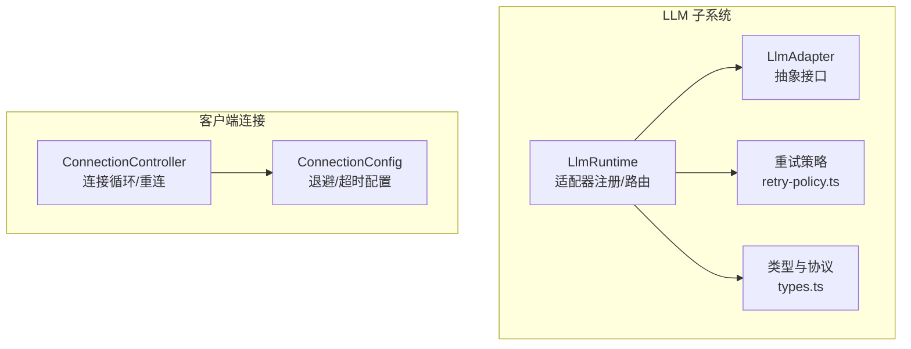
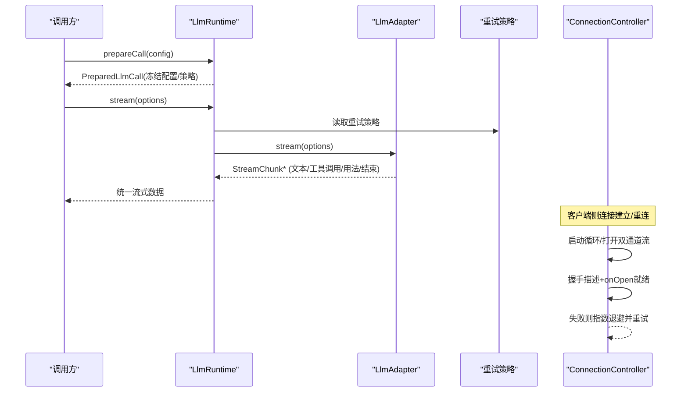
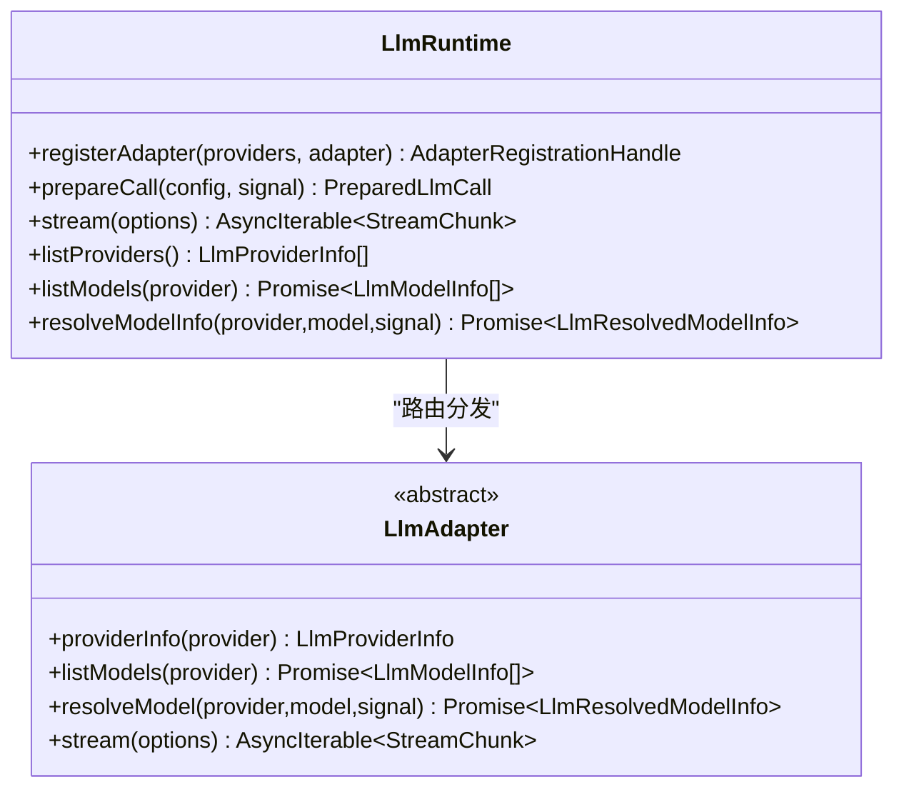
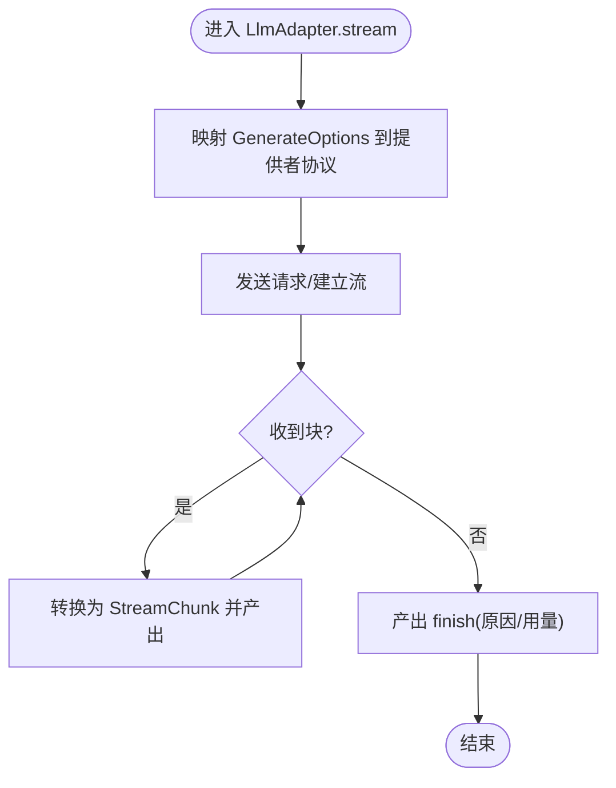
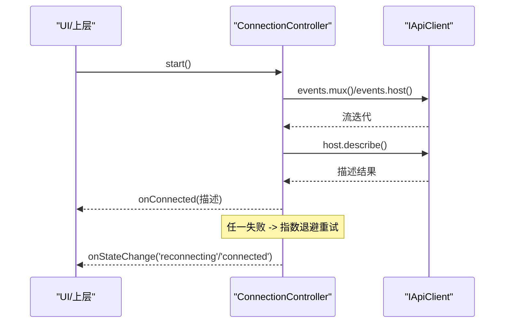
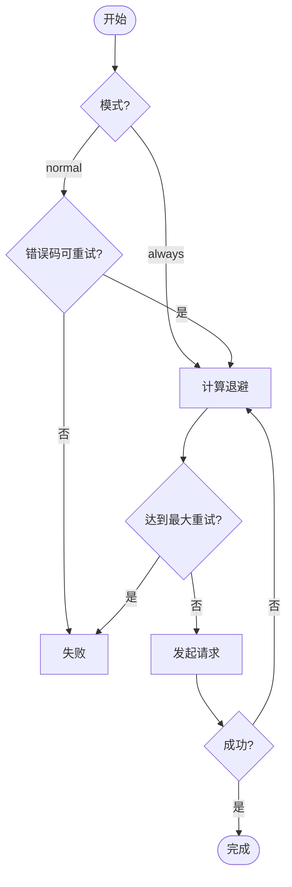
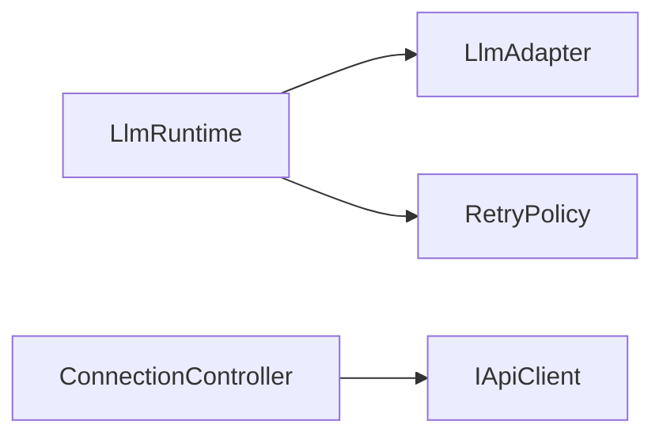

# 流式连接管理

<cite>
**本文引用的文件**
- [packages/llm/llm/src/index.ts](file://packages/llm/llm/src/index.ts)
- [packages/llm/llm/src/types.ts](file://packages/llm/llm/src/types.ts)
- [packages/llm/llm/src/retry-policy.ts](file://packages/llm/llm/src/retry-policy.ts)
- [packages/client/connection/src/client/connection.ts](file://packages/client/connection/src/client/connection.ts)
</cite>

## 目录
1. [简介](#简介)
2. [项目结构](#项目结构)
3. [核心组件](#核心组件)
4. [架构总览](#架构总览)
5. [详细组件分析](#详细组件分析)
6. [依赖关系分析](#依赖关系分析)
7. [性能考量](#性能考量)
8. [故障排查指南](#故障排查指南)
9. [结论](#结论)
10. [附录：配置与调优](#附录：配置与调优)

## 简介
本文件聚焦 DeepSeek Harness 中的“流式连接管理”，围绕以下目标展开：
- 流式连接生命周期管理、连接池实现与资源优化
- 连接复用策略、负载均衡与故障转移机制
- 连接监控、性能指标收集与异常处理策略
- 不同流式传输协议的统一抽象层设计与适配器模式应用
- 连接配置选项与调优指南

为便于理解，文档将分层说明：从高层架构到具体实现细节，配合图示与源码路径定位。

## 项目结构
与流式连接相关的代码主要分布在两个子系统中：
- LLM 流式调用抽象与适配器注册（packages/llm）
- 客户端连接控制器与重连循环（packages/client/connection）

图表来源
- [packages/llm/llm/src/index.ts:284-800](file://packages/llm/llm/src/index.ts#L284-L800)
- [packages/llm/llm/src/types.ts:283-357](file://packages/llm/llm/src/types.ts#L283-L357)
- [packages/llm/llm/src/retry-policy.ts:14-192](file://packages/llm/llm/src/retry-policy.ts#L14-L192)
- [packages/client/connection/src/client/connection.ts:1-203](file://packages/client/connection/src/client/connection.ts#L1-L203)

章节来源
- [packages/llm/llm/src/index.ts:284-800](file://packages/llm/llm/src/index.ts#L284-L800)
- [packages/llm/llm/src/types.ts:283-357](file://packages/llm/llm/src/types.ts#L283-L357)
- [packages/llm/llm/src/retry-policy.ts:14-192](file://packages/llm/llm/src/retry-policy.ts#L14-L192)
- [packages/client/connection/src/client/connection.ts:1-203](file://packages/client/connection/src/client/connection.ts#L1-L203)

## 核心组件
- LlmRuntime：提供适配器注册、模型能力查询、准备调用与流式调用入口；通过事件瀑布拦截每次流式调用，支持重试、回放与路由。
- LlmAdapter：抽象的提供者适配器接口，定义 providerInfo、listModels、resolveModel、stream 等能力，其中 stream 是必须实现的流式输出方法。
- PreparedLlmCall：一次“已准备”的调用句柄，冻结了配置、上下文与重试策略，确保后续流式调用绑定同一注册。
- ConnectionController：客户端侧的连接控制器，负责打开双通道流、握手就绪、状态上报、失败重连与指数退避。
- RetryPolicy：可配置的请求级重试策略（normal/always），包含退避参数与抖动，用于对瞬态错误进行恢复。

章节来源
- [packages/llm/llm/src/index.ts:174-233](file://packages/llm/llm/src/index.ts#L174-L233)
- [packages/llm/llm/src/index.ts:284-800](file://packages/llm/llm/src/index.ts#L284-L800)
- [packages/llm/llm/src/types.ts:283-357](file://packages/llm/llm/src/types.ts#L283-L357)
- [packages/llm/llm/src/retry-policy.ts:14-192](file://packages/llm/llm/src/retry-policy.ts#L14-L192)
- [packages/client/connection/src/client/connection.ts:1-203](file://packages/client/connection/src/client/connection.ts#L1-L203)

## 架构总览
下图展示了从上层调用到适配器流式输出的完整链路，以及客户端连接的重连流程。

图表来源
- [packages/llm/llm/src/index.ts:779-800](file://packages/llm/llm/src/index.ts#L779-L800)
- [packages/llm/llm/src/types.ts:283-357](file://packages/llm/llm/src/types.ts#L283-L357)
- [packages/llm/llm/src/retry-policy.ts:14-192](file://packages/llm/llm/src/retry-policy.ts#L14-L192)
- [packages/client/connection/src/client/connection.ts:107-169](file://packages/client/connection/src/client/connection.ts#L107-L169)

## 详细组件分析

### LlmRuntime：适配器注册与流式调用中枢
- 适配器注册与替换
  - registerAdapter：校验并原子提交路由表，支持 replace 动态更新，释放时清理。
  - commitRoutes：一次性删除旧路由并写入新路由，保证观察者不会看到中间态。
- 模型发现与能力解析
  - listModels/resolveModelInfo：从适配器获取模型元数据并进行严格校验与解耦。
  - discoverModels/registerModelDiscovery：为配置界面提供端点探测能力。
- 调用准备与流式执行
  - prepareCall：冻结配置与上下文，捕获重试策略，返回一次性 PreparedLlmCall。
  - stream：通过事件瀑布拦截，统一处理重试、回放与终止语义。

图表来源
- [packages/llm/llm/src/index.ts:284-800](file://packages/llm/llm/src/index.ts#L284-L800)
- [packages/llm/llm/src/index.ts:174-233](file://packages/llm/llm/src/index.ts#L174-L233)

章节来源
- [packages/llm/llm/src/index.ts:338-413](file://packages/llm/llm/src/index.ts#L338-L413)
- [packages/llm/llm/src/index.ts:581-625](file://packages/llm/llm/src/index.ts#L581-L625)
- [packages/llm/llm/src/index.ts:779-800](file://packages/llm/llm/src/index.ts#L779-L800)

### LlmAdapter：统一抽象层与适配器模式
- 职责边界
  - 仅关注“如何把 GenerateOptions 映射到提供者协议并产出 StreamChunk”。
  - 不关心重试、回放、路由等横切逻辑，这些由 LlmRuntime 与插件完成。
- 扩展点
  - providerRetryPolicy：可为特定提供者覆盖默认重试策略。
  - resolveModel/listModels：提供模型能力与目录信息。
- 流式契约
  - stream 必须遵守 StreamChunk 协议，并在结束时发出 finish（含原因）。

图表来源
- [packages/llm/llm/src/index.ts:174-233](file://packages/llm/llm/src/index.ts#L174-L233)
- [packages/llm/llm/src/types.ts:283-357](file://packages/llm/llm/src/types.ts#L283-L357)

章节来源
- [packages/llm/llm/src/index.ts:174-233](file://packages/llm/llm/src/index.ts#L174-L233)
- [packages/llm/llm/src/types.ts:283-357](file://packages/llm/llm/src/types.ts#L283-L357)

### ConnectionController：连接生命周期与重连
- 生命周期
  - start：启动连接循环，创建 AbortController 隔离每代连接。
  - loop：打开两条流（mux/host），等待 onOpen 与 describe 就绪，成功后上报 connected。
  - stop：停止循环并中止当前代连接。
- 重连与退避
  - 失败后进入 reconnecting，按 backoffBaseMs/backoffFactor/backoffMaxMs 计算延迟并重试。
  - 使用 streamOpenTimeoutMs 防止代理或载体永不触发 onOpen 导致死等。
- 状态与隔离
  - onStateChange 去抖上报，sink 异常被隔离不影响泵与重连。

图表来源
- [packages/client/connection/src/client/connection.ts:61-169](file://packages/client/connection/src/client/connection.ts#L61-L169)

章节来源
- [packages/client/connection/src/client/connection.ts:1-203](file://packages/client/connection/src/client/connection.ts#L1-L203)

### 重试策略：可配置的请求级恢复
- 两种模式
  - normal：针对指定错误码集合进行有限次重试。
  - always：对所有失败持续重试直到成功/取消/释放。
- 退避与抖动
  - initialDelayMs、maxDelayMs、jitterRatio 控制本地退避曲线。
- 默认行为
  - 未配置时采用 normal 模式与默认错误码集合（如空响应、限流、服务端错误、超时、传输错误）。

图表来源
- [packages/llm/llm/src/retry-policy.ts:14-192](file://packages/llm/llm/src/retry-policy.ts#L14-L192)

章节来源
- [packages/llm/llm/src/retry-policy.ts:14-192](file://packages/llm/llm/src/retry-policy.ts#L14-L192)

## 依赖关系分析
- LlmRuntime 依赖 LlmAdapter 抽象以屏蔽底层协议差异；通过事件系统注入重试、回放等横切能力。
- ConnectionController 依赖 IApiClient 提供的流式事件通道，独立于业务层，专注于连接可靠性。
- 重试策略模块与 LlmRuntime 解耦，可由插件在 agent 失败扩展点执行。

图表来源
- [packages/llm/llm/src/index.ts:284-800](file://packages/llm/llm/src/index.ts#L284-L800)
- [packages/client/connection/src/client/connection.ts:1-203](file://packages/client/connection/src/client/connection.ts#L1-L203)
- [packages/llm/llm/src/retry-policy.ts:14-192](file://packages/llm/llm/src/retry-policy.ts#L14-L192)

章节来源
- [packages/llm/llm/src/index.ts:284-800](file://packages/llm/llm/src/index.ts#L284-L800)
- [packages/client/connection/src/client/connection.ts:1-203](file://packages/client/connection/src/client/connection.ts#L1-L203)
- [packages/llm/llm/src/retry-policy.ts:14-192](file://packages/llm/llm/src/retry-policy.ts#L14-L192)

## 性能考量
- 流式缓冲与背压
  - 适配器应尽快产出 StreamChunk，避免阻塞上游；消费者按需消费，减少内存峰值。
- 重试与退避
  - 合理设置 retryableCodes 与 backoff 参数，避免雪崩；结合 jitter 降低集中重试。
- 连接握手超时
  - streamOpenTimeoutMs 防止不可用载体导致的永久等待；建议根据网络环境调优。
- 冻结与克隆
  - prepareCall 中 deepFreeze/structuredClone 提升安全性但带来开销，应在高频路径评估成本。

[本节为通用指导，不直接分析具体文件]

## 故障排查指南
- 适配器元数据无效
  - 现象：listModels/resolveModelInfo 抛出 INVALID_* 错误。
  - 排查：检查适配器返回的 model/provider/name 等字段是否符合契约。
- 重试策略配置错误
  - 现象：resolveRetryPolicy 抛出未知键或越界值错误。
  - 排查：确认 mode、backoff.*、retryableCodes 等字段合法且非空。
- 连接握手失败
  - 现象：describe 失败或 onOpen 超时。
  - 排查：检查网络可达性、代理行为、streamOpenTimeoutMs 是否过短。
- 流中断与重连
  - 现象：pumpStream 捕获异常后进入重连循环。
  - 排查：观察 onStateChange 变化频率与日志，调整 backoff 参数。

章节来源
- [packages/llm/llm/src/index.ts:581-625](file://packages/llm/llm/src/index.ts#L581-L625)
- [packages/llm/llm/src/retry-policy.ts:117-192](file://packages/llm/llm/src/retry-policy.ts#L117-L192)
- [packages/client/connection/src/client/connection.ts:132-169](file://packages/client/connection/src/client/connection.ts#L132-L169)

## 结论
DeepSeek Harness 通过 LlmRuntime 与 LlmAdapter 实现了跨协议的流式调用抽象，并以 PreparedLlmCall 固化调用上下文与重试策略，确保一致性与可观测性。客户端 ConnectionController 提供健壮的连接生命周期管理与指数退避重连。结合可配置的重试策略与严格的元数据校验，系统在可用性、可扩展性与可维护性之间取得平衡。生产部署中建议依据网络与负载特征调优退避与超时参数，并完善监控与告警。

[本节为总结性内容，不直接分析具体文件]

## 附录：配置与调优
- 客户端连接配置（ConnectionConfig）
  - backoffBaseMs：首次重试退避基数（毫秒），实际延迟带抖动。
  - backoffFactor：连续失败时的指数增长因子。
  - backoffMaxMs：退避上限（毫秒）。
  - streamOpenTimeoutMs：等待双通道 onOpen 与 describe 的超时阈值。
- 重试策略配置（RetryPolicy）
  - 模式：normal（有限重试，基于错误码）或 always（无限重试直至成功/取消/释放）。
  - backoff.initialDelayMs：初始退避时间。
  - backoff.maxDelayMs：最大退避时间。
  - backoff.jitterRatio：抖动比例。
  - normal.retryableCodes：允许重试的错误码集合（默认包含空响应、限流、服务端错误、超时、传输错误）。
- 调优建议
  - 高延迟网络：增大 backoffBaseMs 与 maxDelayMs，适当提高 jitterRatio。
  - 高并发场景：限制 maxRetries，避免风暴；结合熔断/降级策略。
  - 不稳定载体：缩短 streamOpenTimeoutMs 以便快速失败与切换。

章节来源
- [packages/client/connection/src/client/connection.ts:3-24](file://packages/client/connection/src/client/connection.ts#L3-L24)
- [packages/llm/llm/src/retry-policy.ts:14-192](file://packages/llm/llm/src/retry-policy.ts#L14-L192)