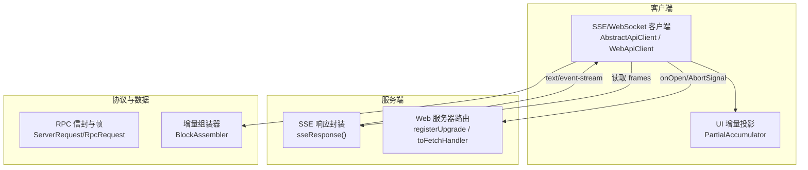
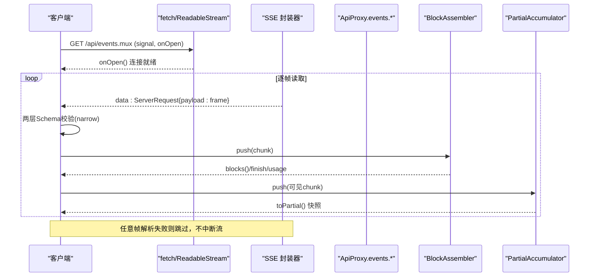
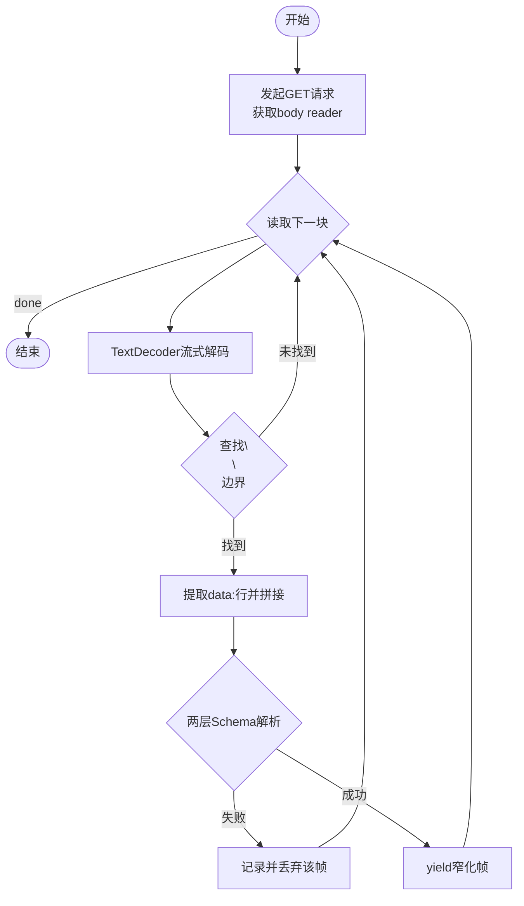
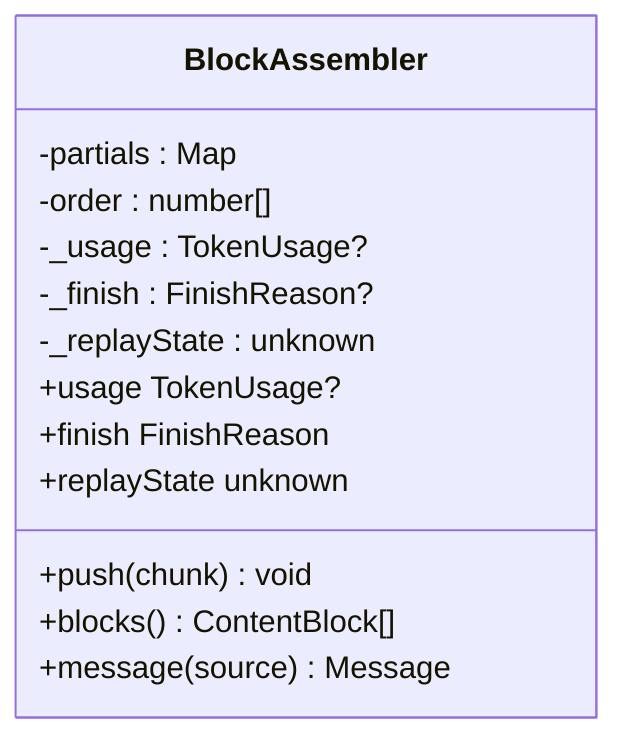
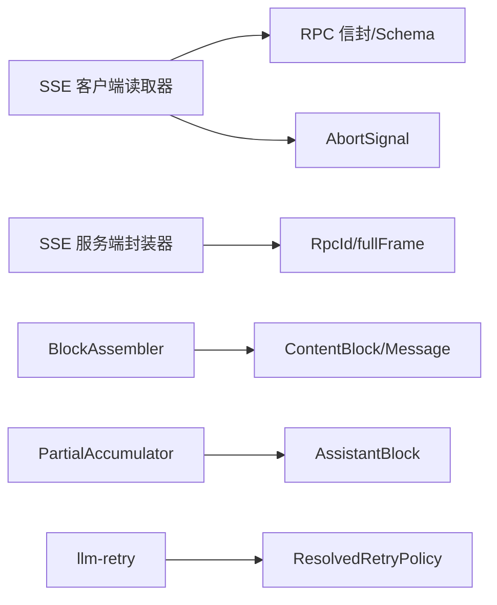

# 流式响应处理

<cite>
**本文引用的文件**
- [packages/host/apiproxy/src/fetch/client.ts](file://packages/host/apiproxy/src/fetch/client.ts)
- [packages/host/apiproxy/src/fetch/handler.ts](file://packages/host/apiproxy/src/fetch/handler.ts)
- [packages/llm/llm/src/assembler.ts](file://packages/llm/llm/src/assembler.ts)
- [packages/client/connection/src/client/web-api-client.ts](file://packages/client/connection/src/client/web-api-client.ts)
- [packages/client/runtime/src/client/sessions/partial.ts](file://packages/client/runtime/src/client/sessions/partial.ts)
- [packages/llm/llm-retry/src/index.ts](file://packages/llm/llm-retry/src/index.ts)
- [packages/llm/llm/src/retry-policy.ts](file://packages/llm/llm/src/retry-policy.ts)
- [docs/subsystems/llm-streaming.md](file://docs/subsystems/llm-streaming.md)
- [docs/subsystems/web-server.md](file://docs/subsystems/web-server.md)
</cite>

## 目录
1. [简介](#简介)
2. [项目结构](#项目结构)
3. [核心组件](#核心组件)
4. [架构总览](#架构总览)
5. [详细组件分析](#详细组件分析)
6. [依赖关系分析](#依赖关系分析)
7. [性能考量](#性能考量)
8. [故障排查指南](#故障排查指南)
9. [结论](#结论)
10. [附录](#附录)

## 简介
本文件系统性梳理仓库中的流式响应处理机制，覆盖 SSE（Server-Sent Events）与 WebSocket 两种传输协议、增量数据的解析与组装、UI 实时反馈、错误处理与重试、断线恢复策略，以及性能优化与内存管理方案。文档同时提供可操作的集成示例与调试技巧，帮助读者在浏览器端或 Node 端稳定实现低延迟、高可靠的流式交互体验。

## 项目结构
围绕流式响应的关键代码分布在以下模块：
- 传输层（SSE/WebSocket）：客户端读取器与服务端封装器
- 协议层：RPC 信封、事件帧、Schema 校验
- 数据组装：将 StreamChunk 增量拼装为完整消息块
- UI 投影：将增量块映射到前端可见的“部分助手”视图
- 重试与恢复：基于策略的重试与退避
- Web 服务器：HTTP 路由与升级通道注册

图表来源
- [packages/host/apiproxy/src/fetch/handler.ts:203-236](file://packages/host/apiproxy/src/fetch/handler.ts#L203-L236)
- [packages/host/apiproxy/src/fetch/client.ts:369-408](file://packages/host/apiproxy/src/fetch/client.ts#L369-L408)
- [packages/client/connection/src/client/web-api-client.ts:34-91](file://packages/client/connection/src/client/web-api-client.ts#L34-L91)
- [packages/llm/llm/src/assembler.ts:36-165](file://packages/llm/llm/src/assembler.ts#L36-L165)
- [docs/subsystems/web-server.md:59-105](file://docs/subsystems/web-server.md#L59-L105)

章节来源
- [docs/subsystems/web-server.md:59-105](file://docs/subsystems/web-server.md#L59-L105)

## 核心组件
- SSE 客户端读取器：使用 fetch + ReadableStream 按行分隔符解析 data: 帧，进行两层 Schema 校验并产出窄化帧；支持 onOpen 回调与 AbortSignal 取消。
- SSE 服务端封装器：将帧流包装为 text/event-stream，发送连接注释以保活，异常时发送 stream/error 帧后关闭。
- WebSocket 客户端读取器：建立 ws/wss 连接，解析 JSON 帧，维护 inbox 队列与唤醒信号，支持 abort/close/open 事件。
- 增量组装器：将 StreamChunk 序列增量合并为 ContentBlock[]，并在 finish 时生成最终 Message。
- UI 部分助手投影：将 StreamChunk 折叠为 AssistantBlock[]，仅对可见类型触发更新，避免不必要的渲染。
- 重试策略：基于 provider 注册的 ResolvedRetryPolicy，结合 backoff/jitter 与可重试错误码集合，统一在 agent/request-error 事件中恢复。

章节来源
- [packages/host/apiproxy/src/fetch/client.ts:369-408](file://packages/host/apiproxy/src/fetch/client.ts#L369-L408)
- [packages/host/apiproxy/src/fetch/handler.ts:203-236](file://packages/host/apiproxy/src/fetch/handler.ts#L203-L236)
- [packages/client/connection/src/client/web-api-client.ts:34-91](file://packages/client/connection/src/client/web-api-client.ts#L34-L91)
- [packages/llm/llm/src/assembler.ts:36-165](file://packages/llm/llm/src/assembler.ts#L36-L165)
- [packages/client/runtime/src/client/sessions/partial.ts:23-103](file://packages/client/runtime/src/client/sessions/partial.ts#L23-L103)
- [packages/llm/llm-retry/src/index.ts:156-179](file://packages/llm/llm-retry/src/index.ts#L156-L179)
- [packages/llm/llm/src/retry-policy.ts:145-156](file://packages/llm/llm/src/retry-policy.ts#L145-L156)

## 架构总览
下图展示一次 SSE 流式调用从客户端发起、服务端封装、到客户端解析与 UI 更新的端到端流程。

图表来源
- [packages/host/apiproxy/src/fetch/client.ts:369-408](file://packages/host/apiproxy/src/fetch/client.ts#L369-L408)
- [packages/host/apiproxy/src/fetch/handler.ts:203-236](file://packages/host/apiproxy/src/fetch/handler.ts#L203-L236)
- [packages/llm/llm/src/assembler.ts:36-165](file://packages/llm/llm/src/assembler.ts#L36-L165)
- [packages/client/runtime/src/client/sessions/partial.ts:23-103](file://packages/client/runtime/src/client/sessions/partial.ts#L23-L103)

## 详细组件分析

### SSE 客户端读取器（readSse）
- 功能要点
  - 使用 fetch 获取 Response.body.getReader()，配合 TextDecoder 流式解码。
  - 以 "\n\n" 作为帧边界，提取 data: 行拼接 payload。
  - 先解析 ServerRequest 再 narrow 为具体 frame schema，任一失败记录日志并跳过，保证单帧损坏不影响整条流。
  - 通过 onOpen 回调通知“物理通道已可读”，便于上层做握手或状态切换。
  - finally 中确保 reader.cancel() 释放资源。
- 错误与健壮性
  - 非 2xx 或 body 为空直接抛错。
  - 解析失败不中断流，交由上层 gap 检测兜底。
- 性能与内存
  - 使用字符串缓冲累积，遇到帧边界立即切片释放，避免无界增长。
  - 文本解码采用流模式，减少中间拷贝。

图表来源
- [packages/host/apiproxy/src/fetch/client.ts:369-408](file://packages/host/apiproxy/src/fetch/client.ts#L369-L408)

章节来源
- [packages/host/apiproxy/src/fetch/client.ts:369-408](file://packages/host/apiproxy/src/fetch/client.ts#L369-L408)

### SSE 服务端封装器（sseResponse）
- 功能要点
  - 将 AsyncIterable<RpcRequest<frame>> 包装为 ReadableStream，设置 content-type=text/event-stream 与 no-cache。
  - 首帧发送 ": connected" 注释，使代理/客户端感知活跃通道。
  - 每帧编码为 data: {JSON} 并以 "\n\n" 结尾。
  - 实现抛出异常时，发送一个 stream/error 帧后再关闭，避免静默断开。
- 错误与健壮性
  - 捕获实现侧异常，构造标准错误帧，提升可观测性与可恢复性。
- 性能与内存
  - 使用 TextEncoder 与控制器 enqueue，零拷贝直出。

章节来源
- [packages/host/apiproxy/src/fetch/handler.ts:203-236](file://packages/host/apiproxy/src/fetch/handler.ts#L203-L236)

### WebSocket 客户端读取器（readWebSocket）
- 功能要点
  - 根据当前协议自动选择 ws/wss，建立 WebSocket 连接。
  - 监听 open/message/close/abort，将帧入队至 inbox，并通过 Promise wake 唤醒迭代器。
  - 对二进制帧拒绝，仅接受 JSON 字符串帧，并进行两层解析。
  - 支持外部 AbortSignal 主动关闭连接。
- 错误与健壮性
  - 解析失败记录日志并丢弃该帧，保持连接存活。
  - close 事件触发迭代结束，清理监听器。
- 性能与内存
  - 使用简单数组队列与一次性唤醒，避免频繁微任务开销。

章节来源
- [packages/client/connection/src/client/web-api-client.ts:34-91](file://packages/client/connection/src/client/web-api-client.ts#L34-L91)

### 增量组装器（BlockAssembler）
- 功能要点
  - 接收 StreamChunk 序列，维护 partials Map 与顺序列表 order。
  - 支持 block-start/text-delta/reasoning-delta/tool-call-delta/block-end/usage/finish。
  - 对已关闭块的后续 delta 忽略，防止畸形流导致内存膨胀或数据污染。
  - 结束时按流序组装 ContentBlock[]，过滤不可执行工具调用（max-tokens 场景）。
- 复杂度
  - 时间：O(N) 增量处理；空间：O(B) 其中 B 为并发块数。
- 输出
  - usage、finish、replayState 可在流结束后读取；message() 生成最终 assistant 消息。

图表来源
- [packages/llm/llm/src/assembler.ts:36-165](file://packages/llm/llm/src/assembler.ts#L36-L165)

章节来源
- [packages/llm/llm/src/assembler.ts:36-165](file://packages/llm/llm/src/assembler.ts#L36-L165)

### UI 部分助手投影（PartialAccumulator）
- 功能要点
  - 将 StreamChunk 折叠为 AssistantBlock[]，键为 block index。
  - 仅当 chunk 类型为 block-start/text-delta/reasoning-delta/tool-call-delta/block-end 时标记变更，避免无效刷新。
  - toPartial() 会压缩稀疏索引为渲染顺序，返回不可变快照供 UI 消费。
- 性能
  - 块级不可变替换，最小化重绘范围。
  - 按需压缩，降低高频推送下的计算成本。

章节来源
- [packages/client/runtime/src/client/sessions/partial.ts:23-103](file://packages/client/runtime/src/client/sessions/partial.ts#L23-L103)

### 重试与恢复（llm-retry）
- 策略来源
  - 每次调用绑定 ResolvedRetryPolicy（包含 mode、maxRetries、retryableCodes、initialDelayMs、maxDelayMs、jitterRatio）。
- 行为
  - always 模式：始终尝试下游恢复，即使下游决策失败也会记录警告。
  - normal 模式：仅当 failure.code 在 retryableCodes 内才重试。
  - 退避：cancellableDelay 支持被 AbortSignal 打断，避免长时间阻塞。
- 集成点
  - 订阅 agent/request-error 事件，决定 retry 或放弃。

章节来源
- [packages/llm/llm-retry/src/index.ts:156-179](file://packages/llm/llm-retry/src/index.ts#L156-L179)
- [packages/llm/llm/src/retry-policy.ts:145-156](file://packages/llm/llm/src/retry-policy.ts#L145-L156)

## 依赖关系分析
- 客户端 SSE 读取器依赖：
  - fetch/ReadableStream 与 TextDecoder
  - RPC 信封与 Schema（serverRequestSchema、frameSchema）
  - AbortSignal 用于取消
- 服务端 SSE 封装器依赖：
  - ReadableStream 控制器与 TextEncoder
  - RpcId 生成与 fullFrame 转换
- 数据组装依赖：
  - StreamChunk 类型定义与 ContentBlock 模型
- UI 投影依赖：
  - StreamChunk 与 AssistantBlock 映射
- 重试依赖：
  - agent/request-error 事件与 ResolvedRetryPolicy

图表来源
- [packages/host/apiproxy/src/fetch/client.ts:369-408](file://packages/host/apiproxy/src/fetch/client.ts#L369-L408)
- [packages/host/apiproxy/src/fetch/handler.ts:203-236](file://packages/host/apiproxy/src/fetch/handler.ts#L203-L236)
- [packages/llm/llm/src/assembler.ts:36-165](file://packages/llm/llm/src/assembler.ts#L36-L165)
- [packages/client/runtime/src/client/sessions/partial.ts:23-103](file://packages/client/runtime/src/client/sessions/partial.ts#L23-L103)
- [packages/llm/llm-retry/src/index.ts:156-179](file://packages/llm/llm-retry/src/index.ts#L156-L179)
- [packages/llm/llm/src/retry-policy.ts:145-156](file://packages/llm/llm/src/retry-policy.ts#L145-L156)

章节来源
- [packages/host/apiproxy/src/fetch/client.ts:369-408](file://packages/host/apiproxy/src/fetch/client.ts#L369-L408)
- [packages/host/apiproxy/src/fetch/handler.ts:203-236](file://packages/host/apiproxy/src/fetch/handler.ts#L203-L236)
- [packages/llm/llm/src/assembler.ts:36-165](file://packages/llm/llm/src/assembler.ts#L36-L165)
- [packages/client/runtime/src/client/sessions/partial.ts:23-103](file://packages/client/runtime/src/client/sessions/partial.ts#L23-L103)
- [packages/llm/llm-retry/src/index.ts:156-179](file://packages/llm/llm-retry/src/index.ts#L156-L179)
- [packages/llm/llm/src/retry-policy.ts:145-156](file://packages/llm/llm/src/retry-policy.ts#L145-L156)

## 性能考量
- 传输层
  - 使用流式解码与分片读取，避免整包加载；SSE 以 "\n\n" 为帧边界，及时释放缓冲。
  - 服务端使用 ReadableStream 控制器直出，减少序列化与拷贝。
- 解析与组装
  - 双层 Schema 校验仅在必要时执行；解析失败丢弃单帧，不阻塞整体流。
  - BlockAssembler 对已关闭块忽略后续 delta，防止内存泄漏。
- UI 更新
  - PartialAccumulator 仅对可见类型触发变更，toPartial() 批量压缩后提交，降低渲染频率。
- 超时与取消
  - 所有流均支持 AbortSignal；客户端在 finally 中确保 reader 取消与监听器移除。
- 内存管理
  - 服务端发送连接注释以保持长连接活跃，避免空闲超时。
  - 客户端使用有限缓冲与惰性迭代，避免积压。

[本节为通用指导，无需特定文件引用]

## 故障排查指南
- 常见症状
  - 流中断但无错误帧：检查服务端是否发送了 stream/error 帧；确认 onOpen 是否触发。
  - 解析失败：查看控制台日志中“丢弃畸形帧”的记录，定位具体字段问题。
  - 连接未建立：确认 WebSocket 协议转换与 CORS/预检；SSE 需 text/event-stream 与 no-cache。
- 诊断步骤
  - 启用 envelope 观察（subscribeEnvelopes），核对帧到达顺序与 rpcId 匹配。
  - 在 readSse/readWebSocket 中打印帧内容与解析结果，快速定位畸形帧。
  - 使用 AbortSignal 主动取消并重连，验证恢复逻辑。
- 恢复策略
  - 依据 ResolvedRetryPolicy 决定是否重试；always 模式下关注下游恢复失败告警。
  - 对网络抖动导致的断线，结合指数退避与抖动重试。

章节来源
- [packages/host/apiproxy/src/fetch/client.ts:369-408](file://packages/host/apiproxy/src/fetch/client.ts#L369-L408)
- [packages/host/apiproxy/src/fetch/handler.ts:203-236](file://packages/host/apiproxy/src/fetch/handler.ts#L203-L236)
- [packages/llm/llm-retry/src/index.ts:156-179](file://packages/llm/llm-retry/src/index.ts#L156-L179)

## 结论
本项目实现了稳健的流式响应处理：SSE 与 WebSocket 双通道、严格的 Schema 校验、容错的单帧丢弃策略、增量组装与 UI 投影分离、以及基于策略的重试与恢复。通过流式解码、缓冲控制与最小化渲染，系统在真实场景中具备低延迟与高可靠性。建议在实际集成中遵循本文的协议约定与最佳实践，并结合监控与日志完善可观测性。

[本节为总结性内容，无需特定文件引用]

## 附录
- 集成示例（SSE）
  - 客户端：调用 events.mux 接口，传入 signal 与 onOpen；迭代 AsyncGenerator 消费帧；将可见 chunk 推入 PartialAccumulator 并渲染 toPartial()。
  - 服务端：通过 toFetchHandler 注册 /api/events.mux 与 /api/events.host 的 GET 路由，返回 sseResponse(frames)。
- 集成示例（WebSocket）
  - 客户端：根据协议构建 ws/wss URL，建立连接；监听 message 事件解析 JSON 帧；在 abort/close 时清理资源。
- 调试技巧
  - 使用 subscribeEnvelopes 批量观察帧；在 readSse/readWebSocket 中打印原始 data 与解析结果。
  - 在服务端 sseResponse 中确认首帧注释与错误帧发送路径。
- 参考文档
  - LLM 流式协议与适配器契约、BlockAssembler 用法、重试策略等详见子系统文档。

章节来源
- [docs/subsystems/llm-streaming.md:154-308](file://docs/subsystems/llm-streaming.md#L154-L308)
- [docs/subsystems/web-server.md:59-105](file://docs/subsystems/web-server.md#L59-L105)