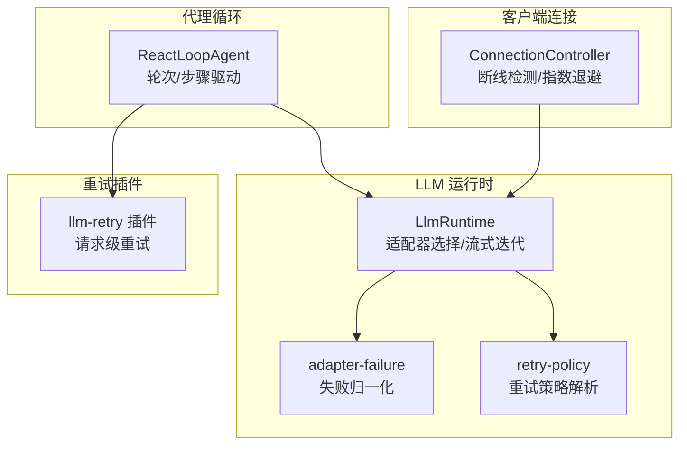
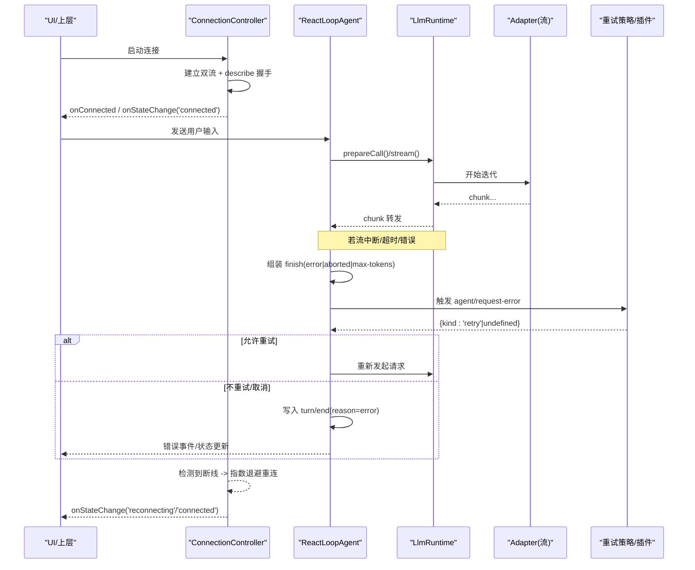
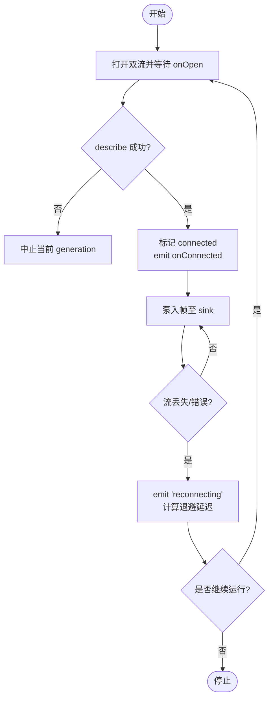
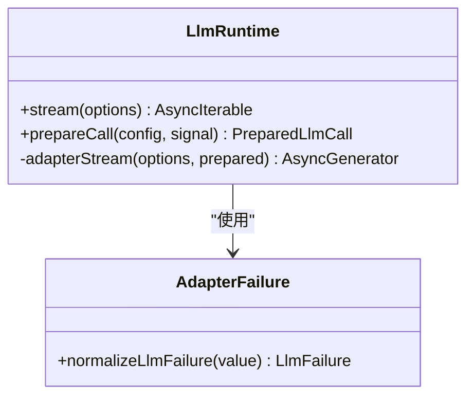
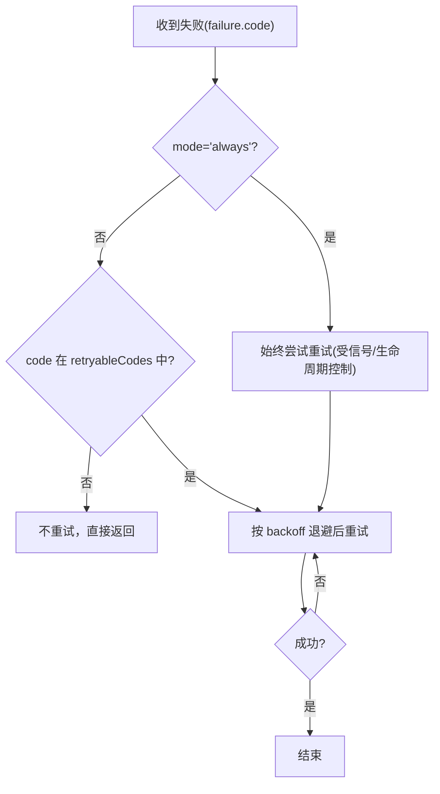
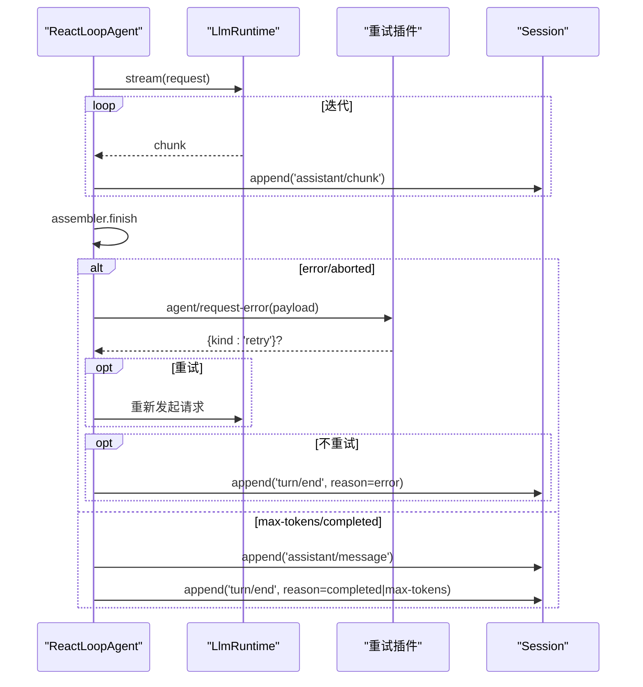
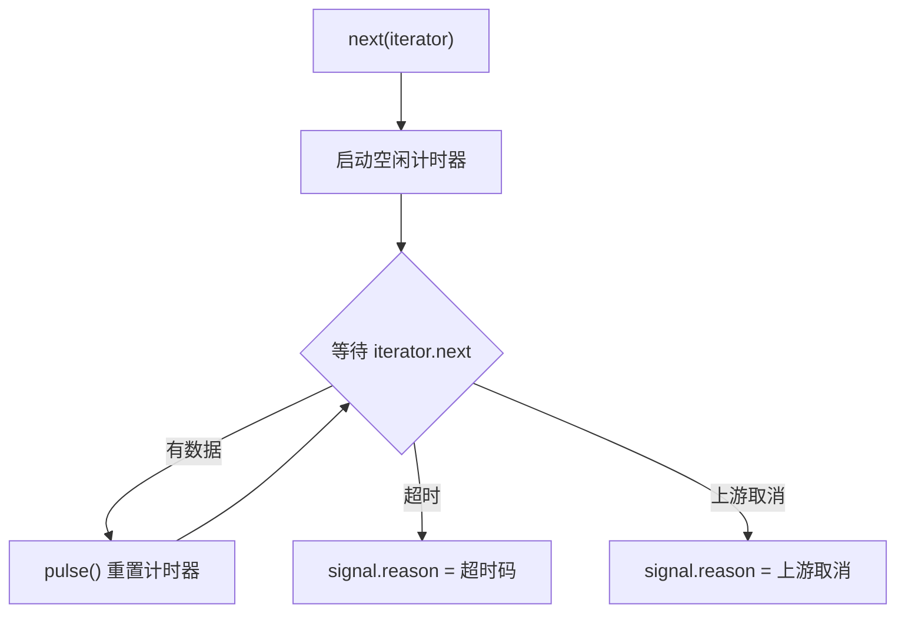
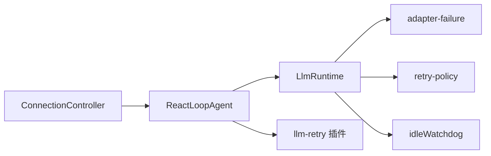

# 故障恢复机制

<cite>
**本文引用的文件**
- [packages/llm/llm/src/index.ts](file://packages/llm/llm/src/index.ts)
- [packages/llm/llm/src/error.ts](file://packages/llm/llm/src/error.ts)
- [packages/llm/llm/src/adapter-failure.ts](file://packages/llm/llm/src/adapter-failure.ts)
- [packages/llm/llm/src/retry-policy.ts](file://packages/llm/llm/src/retry-policy.ts)
- [packages/llm/llm-retry/src/index.ts](file://packages/llm/llm-retry/src/index.ts)
- [packages/core/agent-loop/src/agent.ts](file://packages/core/agent-loop/src/agent.ts)
- [packages/client/connection/src/client/connection.ts](file://packages/client/connection/src/client/connection.ts)
- [packages/util/timeout/src/index.ts](file://packages/util/timeout/src/index.ts)
- [packages/mcp/mcp-client/src/connection.ts](file://packages/mcp/mcp-client/src/connection.ts)
</cite>

## 目录
1. [简介](#简介)
2. [项目结构](#项目结构)
3. [核心组件](#核心组件)
4. [架构总览](#架构总览)
5. [详细组件分析](#详细组件分析)
6. [依赖关系分析](#依赖关系分析)
7. [性能考量](#性能考量)
8. [故障排查指南](#故障排查指南)
9. [结论](#结论)
10. [附录](#附录)

## 简介
本文件系统性梳理 DeepSeek Harness 在流式响应中的故障恢复机制，覆盖断线检测、自动重连与超时处理；解释 LlmRuntime 如何将各类异常规范化为统一错误格式；文档化代理循环的错误处理流程（错误传播、用户反馈与会话状态管理）；并总结可复用的容错设计模式与最佳实践。

## 项目结构
围绕“连接层—LLM 运行时—代理循环—重试插件”的层次组织：
- 连接层：负责建立/维护双向流，检测断线并以指数退避重连。
- LLM 运行时：封装适配器选择、流式迭代、失败归一化与重试策略解析。
- 代理循环：驱动轮次/步骤，捕获错误并通过事件下发给上层或重试插件。
- 重试插件：基于 agent/request-error 事件执行退避与重试决策。

图表来源
- [packages/client/connection/src/client/connection.ts:61-202](file://packages/client/connection/src/client/connection.ts#L61-L202)
- [packages/llm/llm/src/index.ts:284-928](file://packages/llm/llm/src/index.ts#L284-L928)
- [packages/llm/llm/src/adapter-failure.ts:16-28](file://packages/llm/llm/src/adapter-failure.ts#L16-L28)
- [packages/llm/llm/src/retry-policy.ts:145-192](file://packages/llm/llm/src/retry-policy.ts#L145-L192)
- [packages/core/agent-loop/src/agent.ts:332-401](file://packages/core/agent-loop/src/agent.ts#L332-L401)
- [packages/llm/llm-retry/src/index.ts:156-226](file://packages/llm/llm-retry/src/index.ts#L156-L226)

章节来源
- [packages/client/connection/src/client/connection.ts:61-202](file://packages/client/connection/src/client/connection.ts#L61-L202)
- [packages/llm/llm/src/index.ts:284-928](file://packages/llm/llm/src/index.ts#L284-L928)
- [packages/core/agent-loop/src/agent.ts:332-401](file://packages/core/agent-loop/src/agent.ts#L332-L401)
- [packages/llm/llm-retry/src/index.ts:156-226](file://packages/llm/llm-retry/src/index.ts#L156-L226)

## 核心组件
- 连接控制器 ConnectionController：维护连接生命周期，实现断线检测、指数退避重连、握手超时保护与状态去抖上报。
- LlmRuntime：提供流式调用入口，封装适配器选择、流迭代与最终失败归一化；暴露 prepareCall/stream 以支持幂等准备与一次分发。
- 失败归一化 adapter-failure.normalizeLlmFailure：将任意抛出值转换为统一的 LlmFailure（message/code），屏蔽宿主对象恶意行为。
- 重试策略 retry-policy.resolveRetryPolicy：校验/默认化 provider 的重试策略（normal/always），含退避参数与抖动。
- 代理循环 ReactLoopAgent：驱动 turn/step，收集 chunk 并组装消息；在 step 中通过 agent/request-error 事件桥接重试插件；统一记录 turn/end 原因。
- 空闲看门狗 idleWatchdog：对单次迭代需求施加空闲超时，配合 pulse 重置计时器，避免长连接假死。

章节来源
- [packages/client/connection/src/client/connection.ts:61-202](file://packages/client/connection/src/client/connection.ts#L61-L202)
- [packages/llm/llm/src/index.ts:284-928](file://packages/llm/llm/src/index.ts#L284-L928)
- [packages/llm/llm/src/adapter-failure.ts:16-28](file://packages/llm/llm/src/adapter-failure.ts#L16-L28)
- [packages/llm/llm/src/retry-policy.ts:145-192](file://packages/llm/llm/src/retry-policy.ts#L145-L192)
- [packages/core/agent-loop/src/agent.ts:332-401](file://packages/core/agent-loop/src/agent.ts#L332-L401)
- [packages/util/timeout/src/index.ts:65-79](file://packages/util/timeout/src/index.ts#L65-L79)

## 架构总览
下图展示从连接层到 LLM 流式处理的端到端故障恢复路径，包括断线检测、重试策略与代理循环的错误传播。

图表来源
- [packages/client/connection/src/client/connection.ts:107-169](file://packages/client/connection/src/client/connection.ts#L107-L169)
- [packages/core/agent-loop/src/agent.ts:332-401](file://packages/core/agent-loop/src/agent.ts#L332-L401)
- [packages/llm/llm/src/index.ts:843-928](file://packages/llm/llm/src/index.ts#L843-L928)
- [packages/llm/llm-retry/src/index.ts:156-226](file://packages/llm/llm-retry/src/index.ts#L156-L226)

## 详细组件分析

### 连接层：断线检测、自动重连与握手超时
- 双流泵入与失败收敛：pumpStream 遇到 stream/error 或抛错即结束当前 generation，进入共享重连逻辑。
- 严格握手：describe 成功且两路流的 onOpen 均就绪后才认为 connected；提供 streamOpenTimeoutMs 防止载体不触发 onOpen 导致永久阻塞。
- 指数退避：backoffDelay(attempt) 计算退避上限并加随机抖动；每次失败 attempt+1 并重试。
- 状态去抖：onStateChange 仅在状态变化时触发，避免 UI 频繁闪烁。

图表来源
- [packages/client/connection/src/client/connection.ts:107-169](file://packages/client/connection/src/client/connection.ts#L107-L169)
- [packages/client/connection/src/client/connection.ts:178-202](file://packages/client/connection/src/client/connection.ts#L178-L202)

章节来源
- [packages/client/connection/src/client/connection.ts:61-202](file://packages/client/connection/src/client/connection.ts#L61-L202)

### LLM 运行时：流式迭代与失败归一化
- 适配器边界：adapterStream 捕获适配器选择、构造与迭代过程中的所有异常，统一产出终端失败块，避免污染下游中间件/消费者异常语义。
- 失败归一化：normalizeLlmFailure 将任意抛出值转为稳定结构的 LlmFailure（message/code），并对恶意属性访问进行防护。
- 会话上下文：prepareCall 冻结配置并绑定注册表，确保一次分发；streamWithRegistration 通过 waterfall 包裹适配器流。

图表来源
- [packages/llm/llm/src/index.ts:843-928](file://packages/llm/llm/src/index.ts#L843-L928)
- [packages/llm/llm/src/adapter-failure.ts:16-28](file://packages/llm/llm/src/adapter-failure.ts#L16-L28)

章节来源
- [packages/llm/llm/src/index.ts:284-928](file://packages/llm/llm/src/index.ts#L284-L928)
- [packages/llm/llm/src/adapter-failure.ts:16-28](file://packages/llm/llm/src/adapter-failure.ts#L16-L28)

### 重试策略：可配置的退避与可重试代码集
- 策略模式：normal 模式仅对指定 failure.code 列表重试；always 模式对所有失败持续重试直至成功/取消/销毁。
- 退避参数：initialDelayMs、maxDelayMs、jitterRatio，经 schema 校验并冻结为不可变对象。
- 默认可重试码：包含 EMPTY_RESPONSE、RATE_LIMIT、SERVER、TIMEOUT、TRANSPORT 等。

图表来源
- [packages/llm/llm/src/retry-policy.ts:145-192](file://packages/llm/llm/src/retry-policy.ts#L145-L192)
- [packages/llm/llm-retry/src/index.ts:156-226](file://packages/llm/llm-retry/src/index.ts#L156-L226)

章节来源
- [packages/llm/llm/src/retry-policy.ts:145-192](file://packages/llm/llm/src/retry-policy.ts#L145-L192)
- [packages/llm/llm-retry/src/index.ts:156-226](file://packages/llm/llm-retry/src/index.ts#L156-L226)

### 代理循环：错误传播、用户反馈与会话状态
- 步骤执行：step 中累积 chunk，完成时根据 finish 类型决定后续动作。
- 错误处理：finish.error/aborted 触发 agent/request-error 事件，携带 provider、failure、retryPolicy 与信号；若未选择重试则抛出结构化错误并记录 turn/end(reason=error)。
- 会话一致性：无论成功/失败/取消，finally 分支都会写入 turn/end，保证会话可回放与审计。
- 工具调用：当存在 tool-call 时，执行工具并可能注入新上下文继续循环。

图表来源
- [packages/core/agent-loop/src/agent.ts:332-401](file://packages/core/agent-loop/src/agent.ts#L332-L401)
- [packages/core/agent-loop/src/agent.ts:245-330](file://packages/core/agent-loop/src/agent.ts#L245-L330)

章节来源
- [packages/core/agent-loop/src/agent.ts:245-401](file://packages/core/agent-loop/src/agent.ts#L245-L401)

### 超时与空闲保护：流式空闲看门狗
- 空闲超时：idleWatchdog.next(iterator) 包装单次 next 调用，超时时通过 AbortSignal.reason 标识具体超时码。
- 活动脉冲：provider 侧任何有效活动调用 pulse 重置计时器，避免误报空闲。
- 上游取消优先：watchdog.signal 与上游 signal 合并，确保用户取消优先于空闲超时。

图表来源
- [packages/util/timeout/src/index.ts:65-79](file://packages/util/timeout/src/index.ts#L65-L79)

章节来源
- [packages/util/timeout/src/index.ts:65-79](file://packages/util/timeout/src/index.ts#L65-L79)

### MCP 客户端重连策略（参考）
- 最大尝试次数与稳定窗口：超过最大尝试次数后注销工具并提示需要重载/重启；若连接保持超过最长退避间隔，视为上次故障已恢复，重置失败计数。
- 日志与可观测性：记录每次重连动作与剩余次数，便于定位问题。

章节来源
- [packages/mcp/mcp-client/src/connection.ts:192-225](file://packages/mcp/mcp-client/src/connection.ts#L192-L225)

## 依赖关系分析
- 连接层依赖抽象 IApiClient，解耦底层传输；业务层（SessionManager）通过 sinks 消费帧，连接层异常隔离，不会拖垮业务。
- LlmRuntime 依赖适配器接口与重试策略解析；adapterStream 作为最终边界，将一切异常归一化为终端失败块。
- 代理循环依赖 LLM 运行时与事件总线；通过 agent/request-error 与 llm-retry 插件松耦合协作。
- 空闲看门狗被适配器/流式调用链使用，保障长连接健康。

图表来源
- [packages/client/connection/src/client/connection.ts:61-202](file://packages/client/connection/src/client/connection.ts#L61-L202)
- [packages/core/agent-loop/src/agent.ts:332-401](file://packages/core/agent-loop/src/agent.ts#L332-L401)
- [packages/llm/llm/src/index.ts:843-928](file://packages/llm/llm/src/index.ts#L843-L928)
- [packages/llm/llm/src/adapter-failure.ts:16-28](file://packages/llm/llm/src/adapter-failure.ts#L16-L28)
- [packages/llm/llm/src/retry-policy.ts:145-192](file://packages/llm/llm/src/retry-policy.ts#L145-L192)
- [packages/util/timeout/src/index.ts:65-79](file://packages/util/timeout/src/index.ts#L65-L79)

## 性能考量
- 指数退避+抖动：降低雪崩风险，避免同时重试造成二次拥塞。
- 握手超时：防止坏载体导致的永久阻塞，提升首连鲁棒性。
- 失败归一化：减少下游判断成本，统一错误路由。
- 事件驱动重试：通过 waterfall 与信号控制，避免不必要的重试开销。
- 会话追加最小化：chunk 序列号与 sourceEventSeqs 关联，减少重复写入。

## 故障排查指南
- 连接层
  - 现象：频繁 reconnecting
  - 检查点：streamOpenTimeoutMs 是否过小；网络抖动；后端 describe 失败；sink 抛错隔离是否生效。
  - 参考位置：[packages/client/connection/src/client/connection.ts:107-169](file://packages/client/connection/src/client/connection.ts#L107-L169)
- LLM 流式
  - 现象：长时间无输出
  - 检查点：idleWatchdog 是否被 pulse；上游取消是否优先；适配器是否抛出非 Error。
  - 参考位置：[packages/util/timeout/src/index.ts:65-79](file://packages/util/timeout/src/index.ts#L65-L79), [packages/llm/llm/src/index.ts:843-928](file://packages/llm/llm/src/index.ts#L843-L928)
- 重试策略
  - 现象：不应重试的请求仍在重试
  - 检查点：retryableCodes 是否包含该 code；mode 是否为 always；信号是否仍活跃。
  - 参考位置：[packages/llm/llm/src/retry-policy.ts:145-192](file://packages/llm/llm/src/retry-policy.ts#L145-L192), [packages/llm/llm-retry/src/index.ts:156-226](file://packages/llm/llm-retry/src/index.ts#L156-L226)
- 代理循环
  - 现象：turn 未结束或状态不一致
  - 检查点：turn/start/step/start/step/end/turn/end 是否成对出现；错误是否写入 turn/end(reason=error)。
  - 参考位置：[packages/core/agent-loop/src/agent.ts:245-330](file://packages/core/agent-loop/src/agent.ts#L245-L330)

章节来源
- [packages/client/connection/src/client/connection.ts:107-169](file://packages/client/connection/src/client/connection.ts#L107-L169)
- [packages/util/timeout/src/index.ts:65-79](file://packages/util/timeout/src/index.ts#L65-L79)
- [packages/llm/llm/src/retry-policy.ts:145-192](file://packages/llm/llm/src/retry-policy.ts#L145-L192)
- [packages/llm/llm-retry/src/index.ts:156-226](file://packages/llm/llm-retry/src/index.ts#L156-L226)
- [packages/core/agent-loop/src/agent.ts:245-330](file://packages/core/agent-loop/src/agent.ts#L245-L330)

## 结论
本系统通过分层协作实现了健壮的故障恢复：连接层负责链路稳定性，LLM 运行时负责错误归一与流式健壮性，代理循环负责会话一致性与错误传播，重试插件提供可配置的重试策略。结合空闲看门狗与握手超时，整体具备高可用与可观测性。建议在生产环境合理配置重试策略与超时参数，并结合日志与事件进行监控与排障。

## 附录
- 关键错误码与分类
  - 上下文溢出：CONTEXT_WINDOW_EXCEEDED
  - 配额耗尽：QUOTA
  - 空响应：EMPTY_RESPONSE
  - 凭据无效：INVALID_CREDENTIAL
  - 其他：由 normalizeLlmFailure 映射为 UNKNOWN 或适配器的稳定 code
- 推荐实践
  - 使用 normal 模式限定可重试码，避免对确定性错误重试。
  - 设置合理的 initialDelayMs/maxDelayMs/jitterRatio，兼顾快速恢复与防抖。
  - 开启 streamOpenTimeoutMs 防止坏载体卡住握手。
  - 在 UI 层订阅 onStateChange，展示“连接已断开，正在重连…”等友好提示。
  - 在代理循环中始终写入 turn/end，保证回放与审计完整性。