# 监控与调试

<cite>
**本文引用的文件**
- [packages/session/session-telemetry/src/index.ts](file://packages/session/session-telemetry/src/index.ts)
- [packages/session/session-telemetry/src/coordinator.ts](file://packages/session/session-telemetry/src/coordinator.ts)
- [packages/session/session-telemetry-otel/src/index.ts](file://packages/session/session-telemetry-otel/src/index.ts)
- [packages/llm/llm/src/error.ts](file://packages/llm/llm/src/error.ts)
- [packages/extensions/cordis-client-runner/src/client/runtime.ts](file://packages/extensions/cordis-client-runner/src/client/runtime.ts)
- [packages/runtime-diagnostics/invariants/src/index.ts](file://packages/runtime-diagnostics/invariants/src/index.ts)
- [apps/web/tests/complex-history.perf.ts](file://apps/web/tests/complex-history.perf.ts)
- [packages/code-runtime/code-runtime-worker-thread/tests/bootstrap.spec.ts](file://packages/code-runtime/code-runtime-worker-thread/tests/bootstrap.spec.ts)
- [packages/subagent/subagent-codex/tests/responses-fixture.ts](file://packages/subagent/subagent-codex/tests/responses-fixture.ts)
</cite>

## 目录
1. [简介](#简介)
2. [项目结构](#项目结构)
3. [核心组件](#核心组件)
4. [架构总览](#架构总览)
5. [详细组件分析](#详细组件分析)
6. [依赖关系分析](#依赖关系分析)
7. [性能考量](#性能考量)
8. [故障排查指南](#故障排查指南)
9. [结论](#结论)
10. [附录](#附录)

## 简介
本章节面向生产与开发环境，系统化说明 DeepSeek Harness 的监控与调试能力：错误监控指标、日志记录策略、异常事件追踪、调试工具与方法（流式响应调试、错误堆栈分析、性能分析），以及生产环境的告警配置与故障排查流程。文档基于代码库中的遥测采集、OpenTelemetry 上报、运行时不变量检查、错误链渲染、客户端崩溃报告、前端性能度量与流式响应测试等实现进行归纳与可视化。

## 项目结构
与监控与调试直接相关的代码主要分布在以下模块：
- 会话遥测采集层：定义统一记录模型、严重级别、后端抽象与协调器，负责从会话事件捕获并标准化输出。
- OpenTelemetry 后端：将标准记录映射为 OTel 日志，通过批处理器和 OTLP/HTTP 导出器上报；支持多种共享模式与严格的配置校验。
- 运行时不变量：提供可配置的包级运行时契约检查，失败时抛出结构化异常。
- 错误处理与堆栈：提供错误链渲染、错误详情提取，便于诊断与上报。
- 前端性能度量：在浏览器端收集任务耗时、布局耗时、节点数、内存等指标，用于性能回归检测。
- 流式响应调试：通过 SSE 固定脚本模拟流式响应，辅助端到端验证与调试。
- 控制台日志缓冲：在子进程中限制日志体积，避免 OOM 或 I/O 瓶颈。

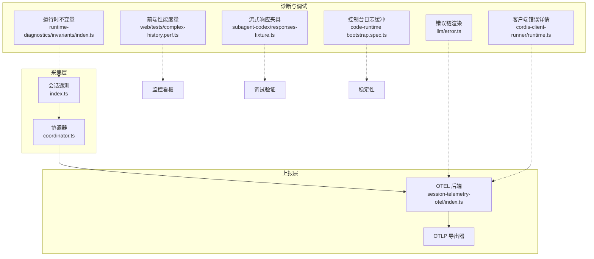

图表来源
- [packages/session/session-telemetry/src/index.ts:1-179](file://packages/session/session-telemetry/src/index.ts#L1-L179)
- [packages/session/session-telemetry/src/coordinator.ts:228-268](file://packages/session/session-telemetry/src/coordinator.ts#L228-L268)
- [packages/session/session-telemetry-otel/src/index.ts:141-302](file://packages/session/session-telemetry-otel/src/index.ts#L141-L302)
- [packages/llm/llm/src/error.ts:102-130](file://packages/llm/llm/src/error.ts#L102-L130)
- [packages/extensions/cordis-client-runner/src/client/runtime.ts:469-494](file://packages/extensions/cordis-client-runner/src/client/runtime.ts#L469-L494)
- [packages/runtime-diagnostics/invariants/src/index.ts:1-201](file://packages/runtime-diagnostics/invariants/src/index.ts#L1-L201)
- [apps/web/tests/complex-history.perf.ts:544-568](file://apps/web/tests/complex-history.perf.ts#L544-L568)
- [packages/subagent/subagent-codex/tests/responses-fixture.ts:240-305](file://packages/subagent/subagent-codex/tests/responses-fixture.ts#L240-L305)
- [packages/code-runtime/code-runtime-worker-thread/tests/bootstrap.spec.ts:70-101](file://packages/code-runtime/code-runtime-worker-thread/tests/bootstrap.spec.ts#L70-L101)

章节来源
- [packages/session/session-telemetry/src/index.ts:1-179](file://packages/session/session-telemetry/src/index.ts#L1-L179)
- [packages/session/session-telemetry-otel/src/index.ts:141-302](file://packages/session/session-telemetry-otel/src/index.ts#L141-L302)

## 核心组件
- 会话遥测后端抽象与记录模型：定义统一的记录结构、严重级别、共享策略与后端接口，确保采集侧与上报侧解耦。
- 协调器：订阅会话事件，生成“账本”与“操作”两类记录，并将 agent 错误转为操作记录；对采集路径做异常隔离，保证主循环不受影响。
- OpenTelemetry 后端：根据共享模式选择实时采集或按需采集；构建 LoggerProvider、批处理器与 OTLP 导出器；严格校验配置并在关闭时设置超时保护。
- 错误链与错误详情：将任意抛出的值渲染为可读的错误链，保留 cause 链与聚合错误成员；提取客户端加载失败的 message 与 stack。
- 运行时不变量：按包名白/黑名单启用运行时契约检查，失败时抛出带包名的 InvariantError。
- 前端性能度量：计算任务、脚本、布局、样式重算、DevTools 命令耗时及节点、监听器、堆内存增量，用于性能回归定位。
- 流式响应调试：使用 SSE 固定脚本回放事件序列，便于端到端验证流式链路。
- 控制台日志缓冲：限制子进程日志输出字节预算，避免阻塞与溢出。

章节来源
- [packages/session/session-telemetry/src/index.ts:47-179](file://packages/session/session-telemetry/src/index.ts#L47-L179)
- [packages/session/session-telemetry/src/coordinator.ts:228-268](file://packages/session/session-telemetry/src/coordinator.ts#L228-L268)
- [packages/session/session-telemetry-otel/src/index.ts:43-128](file://packages/session/session-telemetry-otel/src/index.ts#L43-L128)
- [packages/llm/llm/src/error.ts:102-130](file://packages/llm/llm/src/error.ts#L102-L130)
- [packages/extensions/cordis-client-runner/src/client/runtime.ts:469-494](file://packages/extensions/cordis-client-runner/src/client/runtime.ts#L469-L494)
- [packages/runtime-diagnostics/invariants/src/index.ts:14-66](file://packages/runtime-diagnostics/invariants/src/index.ts#L14-L66)
- [apps/web/tests/complex-history.perf.ts:544-568](file://apps/web/tests/complex-history.perf.ts#L544-L568)
- [packages/subagent/subagent-codex/tests/responses-fixture.ts:240-305](file://packages/subagent/subagent-codex/tests/responses-fixture.ts#L240-L305)
- [packages/code-runtime/code-runtime-worker-thread/tests/bootstrap.spec.ts:70-101](file://packages/code-runtime/code-runtime-worker-thread/tests/bootstrap.spec.ts#L70-L101)

## 架构总览
遥测数据从会话事件出发，经协调器标准化后进入后端管道，最终由 OpenTelemetry 批处理器与 OTLP 导出器上报。采集路径被严格隔离，任何异常都不会污染主循环。

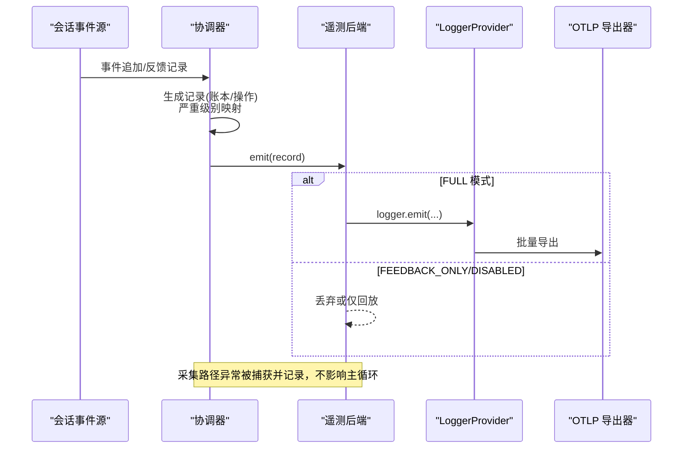

图表来源
- [packages/session/session-telemetry/src/coordinator.ts:228-268](file://packages/session/session-telemetry/src/coordinator.ts#L228-L268)
- [packages/session/session-telemetry-otel/src/index.ts:141-302](file://packages/session/session-telemetry-otel/src/index.ts#L141-L302)

## 详细组件分析

### 会话遥测后端与记录模型
- 记录模型：包含通道（账本/操作）、时间戳、严重级别、属性与主体；属性最小化，主体承载完整负载。
- 严重级别：info/warn/error，error 由事件自身结果标志或 agent-error 操作记录决定。
- 后端接口：emit 必须非阻塞；flush 可选；shutdown 需等待 SDK 管线静默。
- 共享策略：full / feedback-only / disabled，对外暴露以便用户界面提示数据是否离开进程。

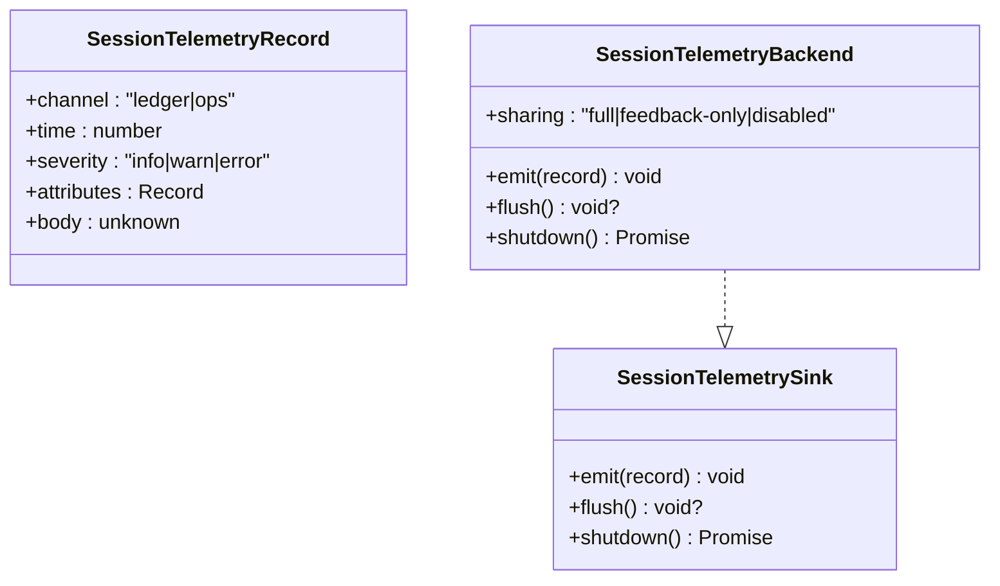

图表来源
- [packages/session/session-telemetry/src/index.ts:47-179](file://packages/session/session-telemetry/src/index.ts#L47-L179)

章节来源
- [packages/session/session-telemetry/src/index.ts:47-179](file://packages/session/session-telemetry/src/index.ts#L47-L179)

### 协调器：事件到记录的转换与隔离
- 将 agent/error 总线事件转换为操作记录，携带 session/agent/turn/step 等关键属性。
- 对采集步骤进行 try/catch 包裹，异常仅记录警告，不中断主循环。
- 维护每会话的首块去重集合，避免重复统计。

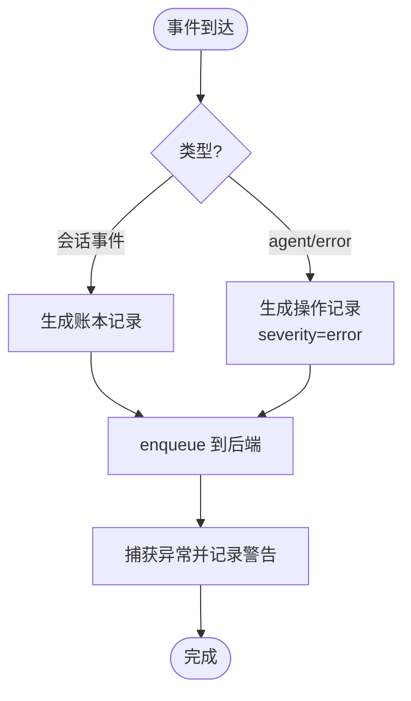

图表来源
- [packages/session/session-telemetry/src/coordinator.ts:228-268](file://packages/session/session-telemetry/src/coordinator.ts#L228-L268)

章节来源
- [packages/session/session-telemetry/src/coordinator.ts:228-268](file://packages/session/session-telemetry/src/coordinator.ts#L228-L268)

### OpenTelemetry 后端：上报与配置
- 共享模式：FULL 实时采集；FEEDBACK_ONLY 仅在反馈记录存在时回放；DISABLED 本地仅记录并告警。
- 配置校验：要求 exporter.url 为有效 http(s) URL；校验 maxExportBatchSize 为正整数；shutdownTimeoutMillis 有限且合理。
- 资源属性：注入服务名称、版本与匿名用户 ID；分离 ledger 与 ops 两个 logger。
- 关闭保护：provider.shutdown 以超时保护，避免网络不可达导致 hang。

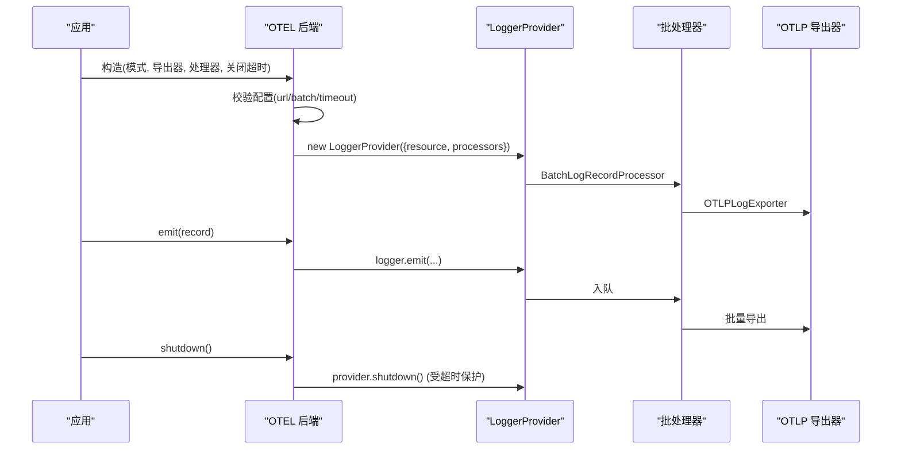

图表来源
- [packages/session/session-telemetry-otel/src/index.ts:141-302](file://packages/session/session-telemetry-otel/src/index.ts#L141-L302)

章节来源
- [packages/session/session-telemetry-otel/src/index.ts:43-128](file://packages/session/session-telemetry-otel/src/index.ts#L43-L128)
- [packages/session/session-telemetry-otel/src/index.ts:141-302](file://packages/session/session-telemetry-otel/src/index.ts#L141-L302)

### 错误链渲染与客户端错误详情
- 错误链：递归遍历 cause 链与 AggregateError 成员，跳过循环引用，渲染最外层消息优先，便于快速定位根因。
- 客户端错误详情：提取 message 与 stack，避免伪造堆栈，便于崩溃报告与模型阅读。

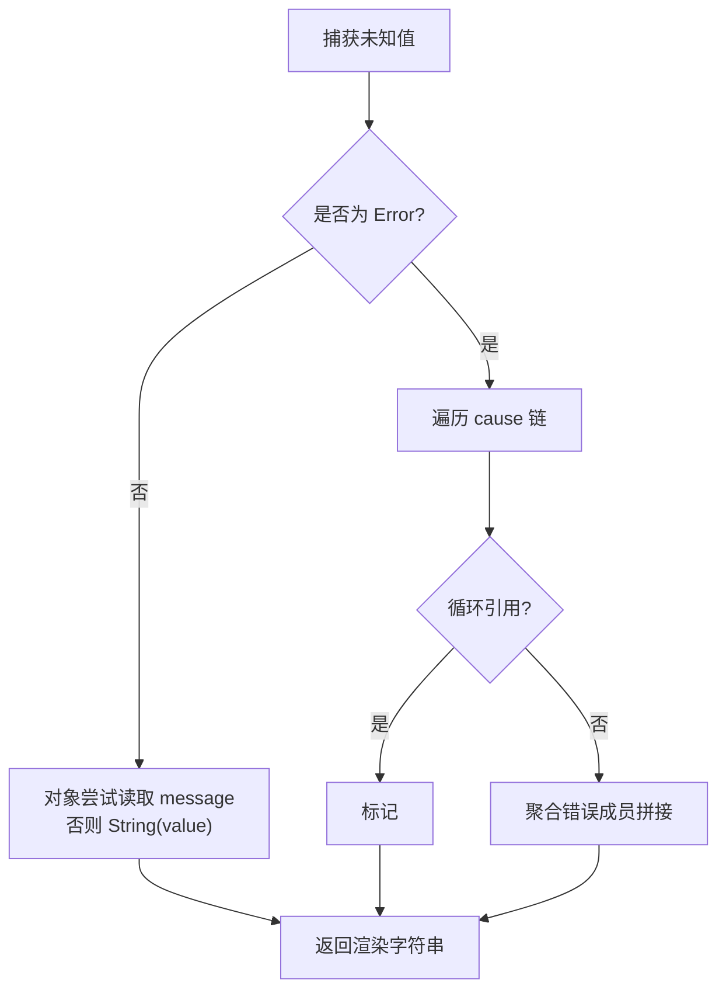

图表来源
- [packages/llm/llm/src/error.ts:102-130](file://packages/llm/llm/src/error.ts#L102-L130)
- [packages/extensions/cordis-client-runner/src/client/runtime.ts:469-494](file://packages/extensions/cordis-client-runner/src/client/runtime.ts#L469-L494)

章节来源
- [packages/llm/llm/src/error.ts:102-130](file://packages/llm/llm/src/error.ts#L102-L130)
- [packages/extensions/cordis-client-runner/src/client/runtime.ts:469-494](file://packages/extensions/cordis-client-runner/src/client/runtime.ts#L469-L494)

### 运行时不变量：包级契约检查
- 支持全局开关与包名白/黑名单过滤。
- 注册安装器在子 fiber 中运行，失败会释放占用并抛出 InvariantError，附带包名与消息。
- 适合在启动期或关键路径执行强一致性检查，尽早发现问题。

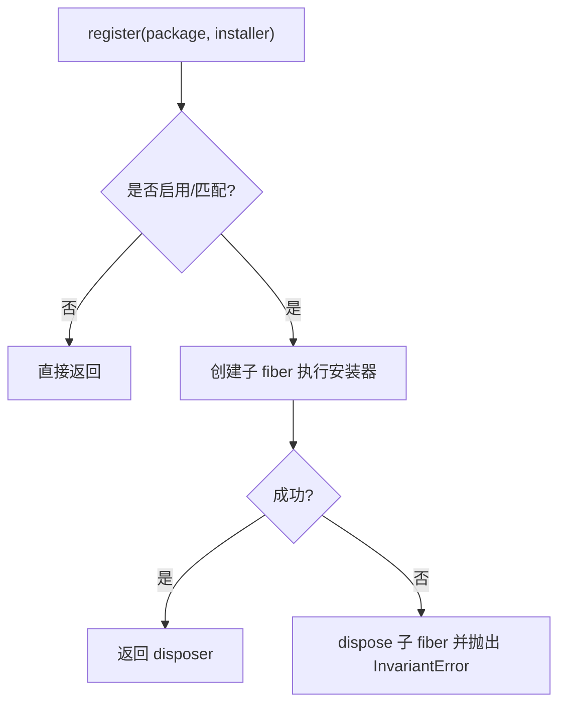

图表来源
- [packages/runtime-diagnostics/invariants/src/index.ts:94-197](file://packages/runtime-diagnostics/invariants/src/index.ts#L94-L197)

章节来源
- [packages/runtime-diagnostics/invariants/src/index.ts:14-66](file://packages/runtime-diagnostics/invariants/src/index.ts#L14-L66)
- [packages/runtime-diagnostics/invariants/src/index.ts:94-197](file://packages/runtime-diagnostics/invariants/src/index.ts#L94-L197)

### 前端性能度量
- 指标：wall/task/script/layout/recalcStyle/devtools 耗时、节点数、监听器数、堆内存增量。
- 用途：对比前后两次快照，识别性能退化点（如长会话渲染、大量 DOM 更新）。

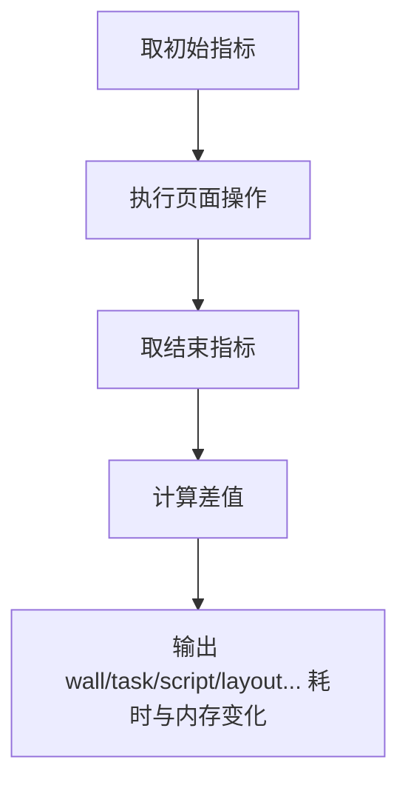

图表来源
- [apps/web/tests/complex-history.perf.ts:544-568](file://apps/web/tests/complex-history.perf.ts#L544-L568)

章节来源
- [apps/web/tests/complex-history.perf.ts:544-568](file://apps/web/tests/complex-history.perf.ts#L544-L568)

### 流式响应调试
- 使用 SSE 固定脚本逐条写入事件，最后发送 DONE，便于端到端验证流式解析、重试与 UI 渲染。
- 适用于断点调试、回放复杂场景与回归测试。

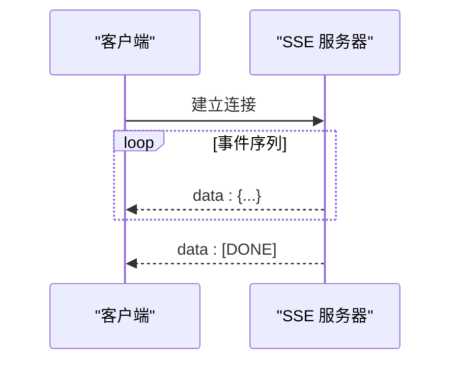

图表来源
- [packages/subagent/subagent-codex/tests/responses-fixture.ts:240-305](file://packages/subagent/subagent-codex/tests/responses-fixture.ts#L240-L305)

章节来源
- [packages/subagent/subagent-codex/tests/responses-fixture.ts:240-305](file://packages/subagent/subagent-codex/tests/responses-fixture.ts#L240-L305)

### 控制台日志缓冲
- 在子进程中限制日志输出字节预算，达到阈值后截断并通知限制次数，避免阻塞与 OOM。
- 适合终端/PTY 等高频日志场景。

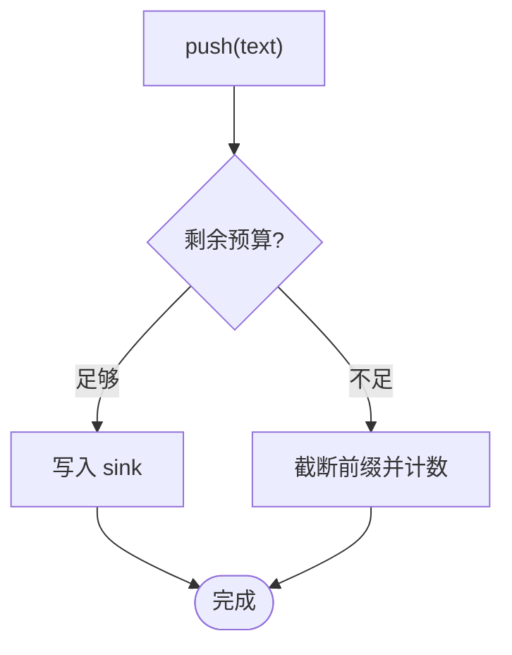

图表来源
- [packages/code-runtime/code-runtime-worker-thread/tests/bootstrap.spec.ts:70-101](file://packages/code-runtime/code-runtime-worker-thread/tests/bootstrap.spec.ts#L70-L101)

章节来源
- [packages/code-runtime/code-runtime-worker-thread/tests/bootstrap.spec.ts:70-101](file://packages/code-runtime/code-runtime-worker-thread/tests/bootstrap.spec.ts#L70-L101)

## 依赖关系分析
- 采集层依赖 Cordis 上下文与服务机制，协调器订阅会话事件并产出标准记录。
- 上报层依赖 OpenTelemetry JS SDK 与 OTLP 导出器，批处理器负责缓冲与重试。
- 错误处理与客户端崩溃报告作为横切关注点，贯穿各层。
- 前端性能度量与流式响应夹具属于开发与测试支撑，帮助定位问题。

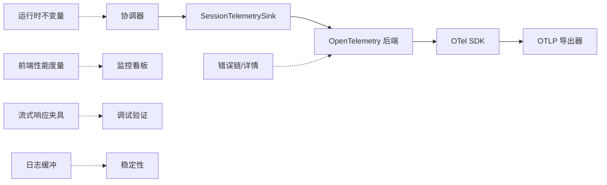

图表来源
- [packages/session/session-telemetry/src/coordinator.ts:228-268](file://packages/session/session-telemetry/src/coordinator.ts#L228-L268)
- [packages/session/session-telemetry-otel/src/index.ts:141-302](file://packages/session/session-telemetry-otel/src/index.ts#L141-L302)
- [packages/llm/llm/src/error.ts:102-130](file://packages/llm/llm/src/error.ts#L102-L130)
- [packages/extensions/cordis-client-runner/src/client/runtime.ts:469-494](file://packages/extensions/cordis-client-runner/src/client/runtime.ts#L469-L494)
- [packages/runtime-diagnostics/invariants/src/index.ts:94-197](file://packages/runtime-diagnostics/invariants/src/index.ts#L94-L197)
- [apps/web/tests/complex-history.perf.ts:544-568](file://apps/web/tests/complex-history.perf.ts#L544-L568)
- [packages/subagent/subagent-codex/tests/responses-fixture.ts:240-305](file://packages/subagent/subagent-codex/tests/responses-fixture.ts#L240-L305)
- [packages/code-runtime/code-runtime-worker-thread/tests/bootstrap.spec.ts:70-101](file://packages/code-runtime/code-runtime-worker-thread/tests/bootstrap.spec.ts#L70-L101)

## 性能考量
- 采集路径非阻塞：emit 必须为队列入队，避免阻塞会话热路径。
- 批处理与导出：利用 SDK 批处理器控制导出频率与大小，减少网络开销。
- 关闭超时：provider.shutdown 设置超时，防止网络不可达导致进程挂起。
- 日志缓冲：限制子进程日志输出，避免 I/O 阻塞与内存膨胀。
- 前端性能度量：通过任务/布局/脚本耗时与内存增量识别性能退化。

[本节为通用指导，无需特定文件来源]

## 故障排查指南
- 遥测未上报
  - 检查共享模式是否为 DISABLED；若为 FEEDBACK_ONLY，确认反馈记录存在于规范会话日志。
  - 校验 exporter.url 是否为有效 http(s) URL；maxExportBatchSize 是否为正整数；shutdownTimeoutMillis 是否合理。
  - 查看协调器日志中是否有“capture step failed”警告。
- 错误堆栈不完整
  - 使用错误链渲染函数获取完整 cause 链与聚合错误成员。
  - 客户端崩溃报告应保留原始 message 与 stack，避免二次包装丢失信息。
- 性能回退
  - 使用前端性能度量对比前后快照，关注 task/script/layout/recalcStyle/devtools 耗时与节点/监听器/堆内存变化。
- 流式响应异常
  - 使用 SSE 固定脚本回放事件序列，逐步定位解析或 UI 渲染问题。
- 子进程日志过多
  - 调整日志缓冲预算，观察限制触发次数，必要时降低日志级别或采样率。

章节来源
- [packages/session/session-telemetry-otel/src/index.ts:170-195](file://packages/session/session-telemetry-otel/src/index.ts#L170-L195)
- [packages/session/session-telemetry/src/coordinator.ts:256-268](file://packages/session/session-telemetry/src/coordinator.ts#L256-L268)
- [packages/llm/llm/src/error.ts:102-130](file://packages/llm/llm/src/error.ts#L102-L130)
- [packages/extensions/cordis-client-runner/src/client/runtime.ts:469-494](file://packages/extensions/cordis-client-runner/src/client/runtime.ts#L469-L494)
- [apps/web/tests/complex-history.perf.ts:544-568](file://apps/web/tests/complex-history.perf.ts#L544-L568)
- [packages/subagent/subagent-codex/tests/responses-fixture.ts:240-305](file://packages/subagent/subagent-codex/tests/responses-fixture.ts#L240-L305)
- [packages/code-runtime/code-runtime-worker-thread/tests/bootstrap.spec.ts:70-101](file://packages/code-runtime/code-runtime-worker-thread/tests/bootstrap.spec.ts#L70-L101)

## 结论
该仓库提供了完整的监控与调试基础设施：标准化的遥测采集与上报、严格的配置与关闭保护、完善的错误链与崩溃报告、运行时不变量检查、前端性能度量与流式响应调试工具。生产环境中建议启用 FULL 模式并配置合理的批处理与导出参数，结合不变量检查与性能度量，形成闭环的观测与排障体系。

[本节为总结性内容，无需特定文件来源]

## 附录
- 关键配置项速查
  - 共享模式：FULL / FEEDBACK_ONLY / DISABLED
  - 导出器：exporter.url（http(s)）、timeoutMillis、compression、keepAlive
  - 批处理器：maxExportBatchSize（正整数）、scheduledDelayMillis
  - 关闭超时：shutdownTimeoutMillis（正有限数）
- 常用指标
  - 错误频率：agent-error 操作记录数量与分布
  - 性能指标：task/script/layout/recalcStyle/devtools 耗时、节点/监听器/堆内存变化
  - 流式指标：事件序列长度、延迟、完成信号
- 调试技巧
  - 使用错误链渲染与客户端错误详情定位根因
  - 使用 SSE 固定脚本回放流式响应
  - 使用前端性能度量对比快照定位退化
  - 使用日志缓冲观察子进程 I/O 压力

[本节为补充信息，无需特定文件来源]