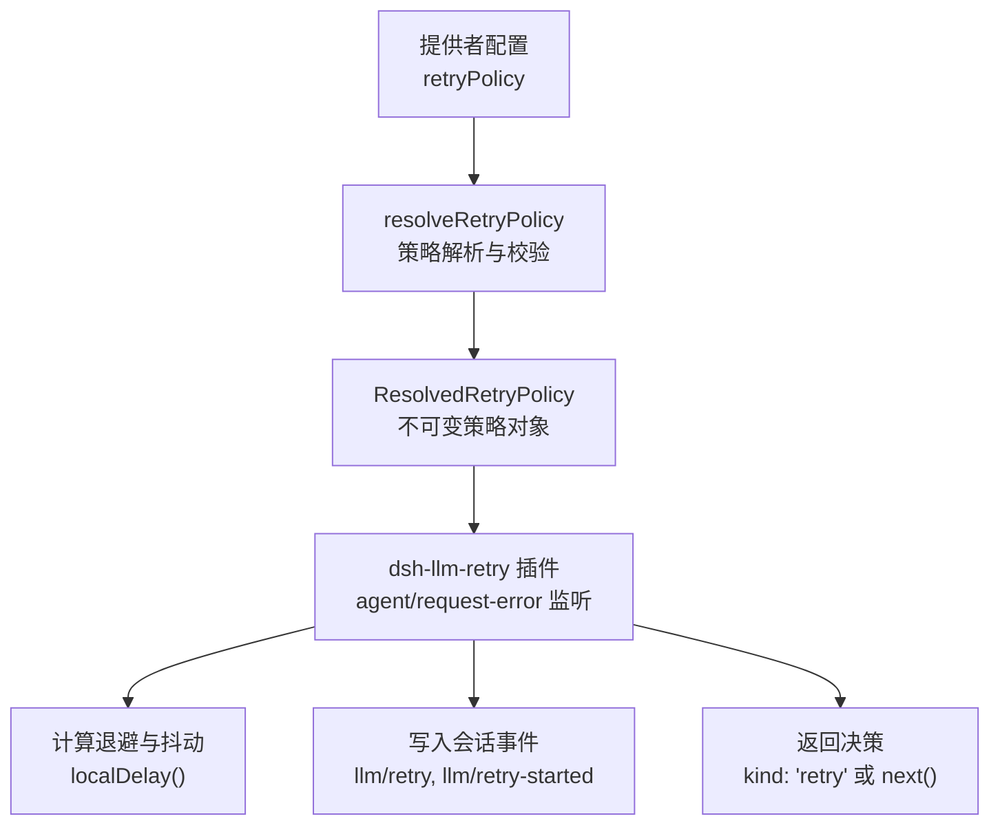
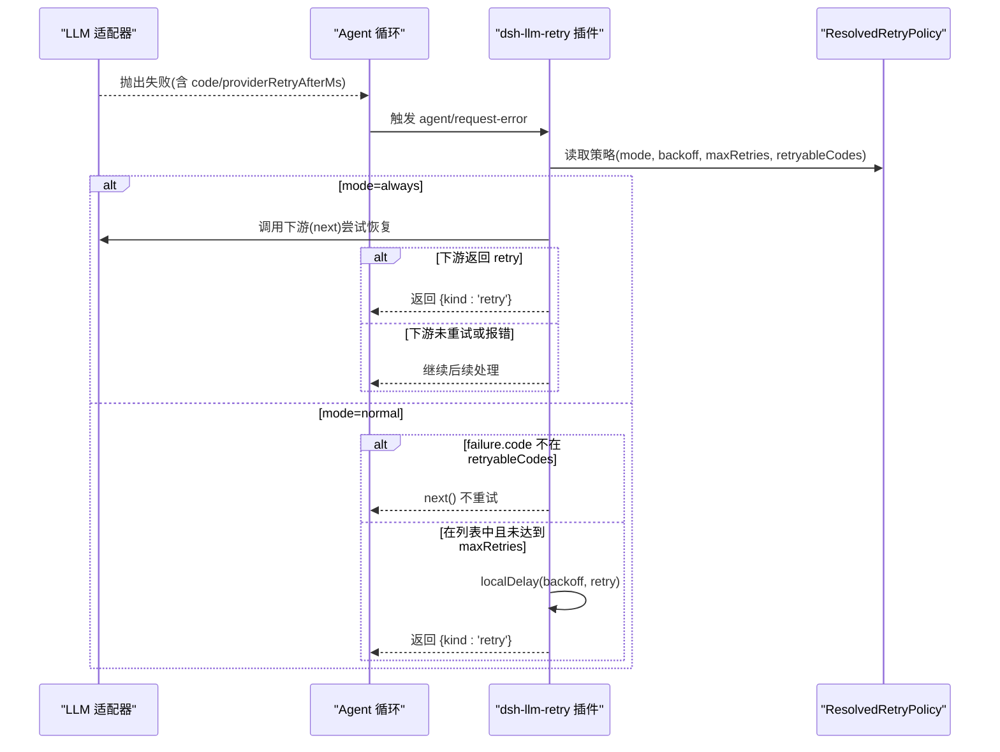
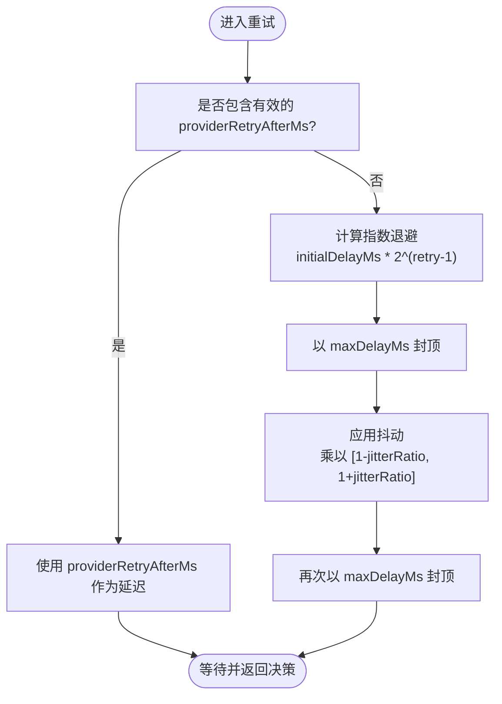
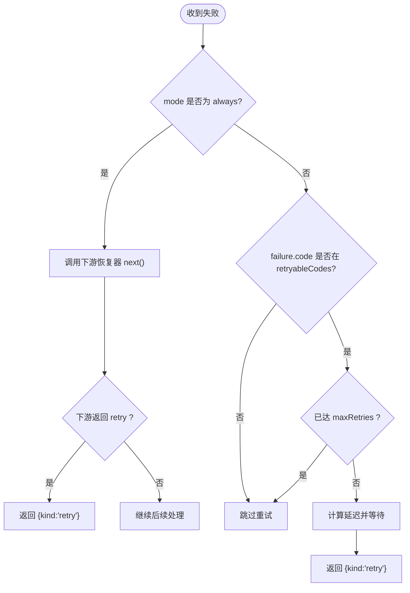
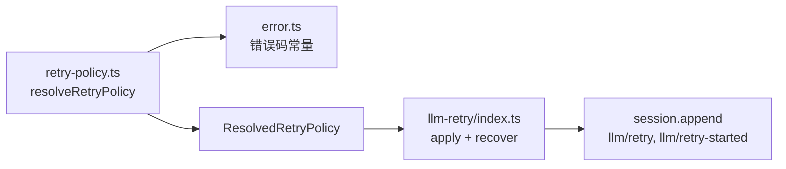

# 重试策略配置

<cite>
**本文引用的文件**
- [packages/llm/llm/src/retry-policy.ts](file://packages/llm/llm/src/retry-policy.ts)
- [packages/llm/llm-retry/src/index.ts](file://packages/llm/llm-retry/src/index.ts)
- [packages/llm/llm/src/error.ts](file://packages/llm/llm/src/error.ts)
- [packages/llm/llm/tests/retry-policy.spec.ts](file://packages/llm/llm/tests/retry-policy.spec.ts)
- [examples/acp-agent/retry.cordis.yml](file://examples/acp-agent/retry.cordis.yml)
</cite>

## 目录
1. [简介](#简介)
2. [项目结构](#项目结构)
3. [核心组件](#核心组件)
4. [架构总览](#架构总览)
5. [详细组件分析](#详细组件分析)
6. [依赖关系分析](#依赖关系分析)
7. [性能与调优建议](#性能与调优建议)
8. [故障排查指南](#故障排查指南)
9. [结论](#结论)

## 简介
本文件系统化说明 ResolvedRetryPolicy 的配置项、两种重试模式（normal/always）、退避与抖动参数、可重试错误代码判定以及重试时机选择逻辑，并提供面向生产环境的调优建议与注意事项。该机制由“提供者侧”的 retry policy 定义与“执行侧”的 dsh-llm-retry 插件共同实现：前者负责解析并固化策略，后者在 agent 循环的错误恢复扩展点上按策略进行有界或无界的重试。

## 项目结构
围绕重试策略的核心代码分布在两个包中：
- @deepseek-ai/dsh-llm：提供策略定义、校验、默认值与解析函数 resolveRetryPolicy，以及稳定的错误码常量。
- @deepseek-ai/dsh-llm-retry：作为插件在 agent/request-error 事件上消费已解析的策略，计算退避延迟、写入会话事件并返回重试决策。

图表来源
- [packages/llm/llm/src/retry-policy.ts:145-191](file://packages/llm/llm/src/retry-policy.ts#L145-L191)
- [packages/llm/llm-retry/src/index.ts:156-208](file://packages/llm/llm-retry/src/index.ts#L156-L208)

章节来源
- [packages/llm/llm/src/retry-policy.ts:1-191](file://packages/llm/llm/src/retry-policy.ts#L1-L191)
- [packages/llm/llm-retry/src/index.ts:1-227](file://packages/llm/llm-retry/src/index.ts#L1-L227)

## 核心组件
- 策略配置类型
  - NormalRetryPolicyConfig：mode=normal，支持 maxRetries、retryableCodes、backoff。
  - AlwaysRetryPolicyConfig：mode=always，仅支持 backoff。
- 已解析策略
  - ResolvedNormalRetryPolicy：包含 mode=maxRetries/retryableCodes/backoff。
  - ResolvedAlwaysRetryPolicy：包含 mode/backoff。
  - ResolvedRetryBackoff：initialDelayMs、maxDelayMs、jitterRatio。
- 默认值
  - 最大重试次数：2
  - 初始退避：500ms
  - 最大退避：10000ms
  - 抖动比例：0.1
  - 默认可重试错误码：EMPTY_RESPONSE、RATE_LIMIT、SERVER、TIMEOUT、TRANSPORT
- 解析函数
  - resolveRetryPolicy(config, path)：对配置做键白名单校验、范围校验、去重校验，并冻结为不可变对象。

章节来源
- [packages/llm/llm/src/retry-policy.ts:14-24](file://packages/llm/llm/src/retry-policy.ts#L14-L24)
- [packages/llm/llm/src/retry-policy.ts:27-79](file://packages/llm/llm/src/retry-policy.ts#L27-L79)
- [packages/llm/llm/src/retry-policy.ts:117-191](file://packages/llm/llm/src/retry-policy.ts#L117-L191)

## 架构总览
重试策略由“提供者注册时”捕获并固化，随后在“请求失败”时由 dsh-llm-retry 插件根据策略决定是否重试、如何等待、何时停止。

图表来源
- [packages/llm/llm-retry/src/index.ts:156-208](file://packages/llm/llm-retry/src/index.ts#L156-L208)
- [packages/llm/llm/src/retry-policy.ts:145-191](file://packages/llm/llm/src/retry-policy.ts#L145-L191)

## 详细组件分析

### 配置选项详解
- 模式 mode
  - normal：仅对指定错误码重试，最多重试 maxRetries 次。
  - always：对所有模型请求失败都尝试重试，直到成功、取消或被处置；若下游恢复器决定重试则沿用其决策。
- 最大重试次数 maxRetries（仅 normal）
  - 非负安全整数，默认 2。
  - 超过限制后不再重试。
- 可重试错误码 retryableCodes（仅 normal）
  - 字符串数组，默认包含 EMPTY_RESPONSE、RATE_LIMIT、SERVER、TIMEOUT、TRANSPORT。
  - 必须非空、元素为非空字符串、不允许重复。
- 退避 backoff
  - initialDelayMs：首次重试的基础指数退避时间（毫秒），默认 500。
  - maxDelayMs：本地调度或接受提供方指示的最大延迟上限（毫秒），默认 10000。
  - jitterRatio：对称抖动的比例系数（0~1），默认 0.1。
- 提供方指示的等待 providerRetryAfterMs
  - 当失败中包含有限正数且不超过 maxDelayMs 时，优先使用该值作为本次延迟；否则使用本地指数退避+抖动。

章节来源
- [packages/llm/llm/src/retry-policy.ts:27-79](file://packages/llm/llm/src/retry-policy.ts#L27-L79)
- [packages/llm/llm/src/retry-policy.ts:117-191](file://packages/llm/llm/src/retry-policy.ts#L117-L191)
- [packages/llm/llm-retry/src/index.ts:193-205](file://packages/llm/llm-retry/src/index.ts#L193-L205)

### 重试模式与适用场景
- normal 模式
  - 适合大多数网络/服务端瞬时错误，如限流、超时、传输中断等。
  - 通过 retryableCodes 精确控制哪些错误可重试，避免对不可重试错误（如配额耗尽、上下文溢出）造成无效重试。
- always 模式
  - 适合需要强一致或幂等性保障的场景，例如某些上游服务可能吞掉响应但实际已落盘的情况。
  - 注意：always 模式下会先调用下游恢复器，若下游决定重试则直接复用其决策；若下游未重试或抛错，插件会记录告警但不强制重试。

章节来源
- [packages/llm/llm/src/retry-policy.ts:36-57](file://packages/llm/llm/src/retry-policy.ts#L36-L57)
- [packages/llm/llm-retry/src/index.ts:161-179](file://packages/llm/llm-retry/src/index.ts#L161-L179)

### 退避与抖动算法
- 指数退避：第 n 次重试的基础延迟为 initialDelayMs * 2^(n-1)，并以 maxDelayMs 封顶。
- 抖动：以 jitterRatio 控制的对称随机乘数，范围为 [1-jitterRatio, 1+jitterRatio]，最终结果再次以 maxDelayMs 封顶。
- 提供方指示优先：若失败携带 providerRetryAfterMs 且在范围内，则直接使用；否则走本地退避。

图表来源
- [packages/llm/llm-retry/src/index.ts:58-63](file://packages/llm/llm-retry/src/index.ts#L58-L63)
- [packages/llm/llm-retry/src/index.ts:193-205](file://packages/llm/llm-retry/src/index.ts#L193-L205)

### 可重试错误代码判断
- 默认可重试集合包含：
  - EMPTY_RESPONSE：完成但无内容块，视为安全重试。
  - RATE_LIMIT：速率限制。
  - SERVER：服务端错误。
  - TIMEOUT：超时。
  - TRANSPORT：传输层错误。
- 非默认但重要的稳定错误码：
  - CONTEXT_WINDOW_EXCEEDED：上下文窗口超限，通常不应重试。
  - QUOTA：配额耗尽，通常不应重试。
  - INVALID_CREDENTIAL：凭证无效，不应重试。
- 适配器会将不同提供方的错误映射到这些稳定代码，从而统一重试策略。

章节来源
- [packages/llm/llm/src/retry-policy.ts:18-24](file://packages/llm/llm/src/retry-policy.ts#L18-L24)
- [packages/llm/llm/src/error.ts:24-48](file://packages/llm/llm/src/error.ts#L24-L48)

### 重试时机与决策流程
- always 模式
  - 先调用下游恢复器（next），若下游返回 retry 则直接采用；若下游抛错则记录告警并继续后续流程。
- normal 模式
  - 若 failure.code 不在 retryableCodes，直接跳过重试。
  - 若已达到 maxRetries，跳过重试。
  - 否则计算延迟并返回 retry。
- 会话事件
  - 每次计划重试写入 llm/retry，开始重试前写入 llm/retry-started，便于追踪与回放。

图表来源
- [packages/llm/llm-retry/src/index.ts:156-208](file://packages/llm/llm-retry/src/index.ts#L156-L208)

章节来源
- [packages/llm/llm-retry/src/index.ts:156-208](file://packages/llm/llm-retry/src/index.ts#L156-L208)

### 配置示例
- 示例：将 normal 模式的退避固定为 1ms、零抖动，用于快照与回放的可复现场景。
- 位置：示例覆盖配置中将 retryPolicy 的 backoff.initialDelayMs、maxDelayMs 设为 1，jitterRatio 设为 0。

章节来源
- [examples/acp-agent/retry.cordis.yml:18-24](file://examples/acp-agent/retry.cordis.yml#L18-L24)

## 依赖关系分析
- 策略解析依赖
  - 校验与默认值：基于 schemastery 的 schema 与 MAX_TIMER_DELAY_MS 边界。
  - 错误码：EMPTY_RESPONSE_CODE 来自 error.ts。
- 执行依赖
  - 插件订阅 agent/request-error 事件。
  - 使用 AbortSignal 管理生命周期与可取消等待。
  - 通过 session.append 写入 llm/retry 与 llm/retry-started 事件。

图表来源
- [packages/llm/llm/src/retry-policy.ts:10-12](file://packages/llm/llm/src/retry-policy.ts#L10-L12)
- [packages/llm/llm-retry/src/index.ts:150-153](file://packages/llm/llm-retry/src/index.ts#L150-L153)

章节来源
- [packages/llm/llm/src/retry-policy.ts:10-12](file://packages/llm/llm/src/retry-policy.ts#L10-L12)
- [packages/llm/llm-retry/src/index.ts:150-153](file://packages/llm/llm-retry/src/index.ts#L150-L153)

## 性能与调优建议
- 合理设置 maxRetries
  - 默认 2 适用于多数瞬时错误；对于高抖动或慢速网络可适当提高，但需结合业务容忍度。
- 调整 backoff
  - initialDelayMs：较小值提升恢复速度，较大值降低突发流量冲击。
  - maxDelayMs：限制最长等待，避免长时间阻塞；结合 providerRetryAfterMs 可尊重提供方限速提示。
  - jitterRatio：0 表示确定性延迟（适合测试/回放），>0 有助于分散拥塞。
- 谨慎扩大 retryableCodes
  - 仅在确认错误可安全重试时加入；QUOTA、CONTEXT_WINDOW_EXCEEDED、INVALID_CREDENTIAL 等通常不应重试。
- always 模式的使用
  - 适合幂等或可恢复性要求高的场景；注意下游恢复器的行为与日志告警。
- 监控与观测
  - 关注 llm/retry 与 llm/retry-started 事件频率与延迟分布，评估策略是否过激或保守。
- 资源与并发
  - 插件会跟踪活跃的重试操作并在生命周期结束时清理；确保不会因过多并发重试导致资源压力。

[本节为通用指导，不直接分析具体文件]

## 故障排查指南
- 配置校验失败
  - 常见错误：未知键、数值越界、initialDelayMs > maxDelayMs、jitterRatio 不在 0~1、retryableCodes 为空或包含重复/非法元素。
  - 定位：查看 resolveRetryPolicy 抛出的错误信息中的路径与约束。
- 未触发重试
  - 检查 failure.code 是否在 retryableCodes；或在 always 模式下下游恢复器未返回 retry。
  - 检查是否已达到 maxRetries。
- 重试间隔异常
  - 若 providerRetryAfterMs 超出 maxDelayMs，normal 模式会跳过重试；always 模式会使用本地退避。
- 观察事件
  - 通过 llm/retry 与 llm/retry-started 事件核对重试次数、延迟与失败原因。

章节来源
- [packages/llm/llm/src/retry-policy.ts:111-137](file://packages/llm/llm/src/retry-policy.ts#L111-L137)
- [packages/llm/llm-retry/src/index.ts:193-205](file://packages/llm/llm-retry/src/index.ts#L193-L205)
- [packages/llm/llm/tests/retry-policy.spec.ts:62-85](file://packages/llm/llm/tests/retry-policy.spec.ts#L62-L85)

## 结论
ResolvedRetryPolicy 提供了清晰、可验证且可组合的重试策略能力：通过 normal/always 两种模式适配不同可靠性需求，配合指数退避与抖动控制重试节奏，并通过稳定错误码与 providerRetryAfterMs 精准控制重试时机。生产环境中建议结合业务容忍度与观测指标持续调优，避免过度重试带来的放大效应，同时确保关键瞬时错误得到及时恢复。