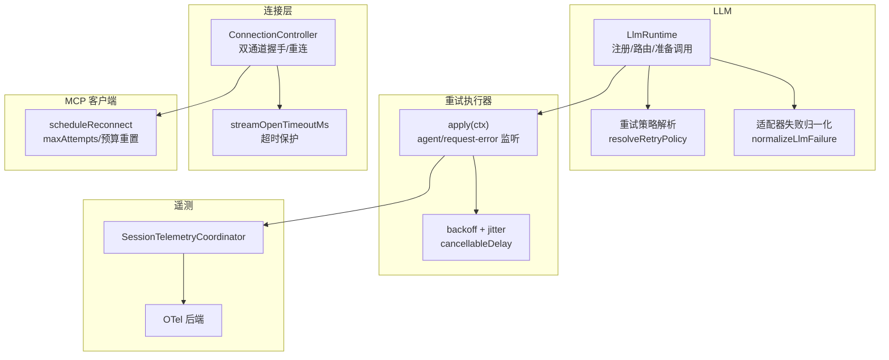
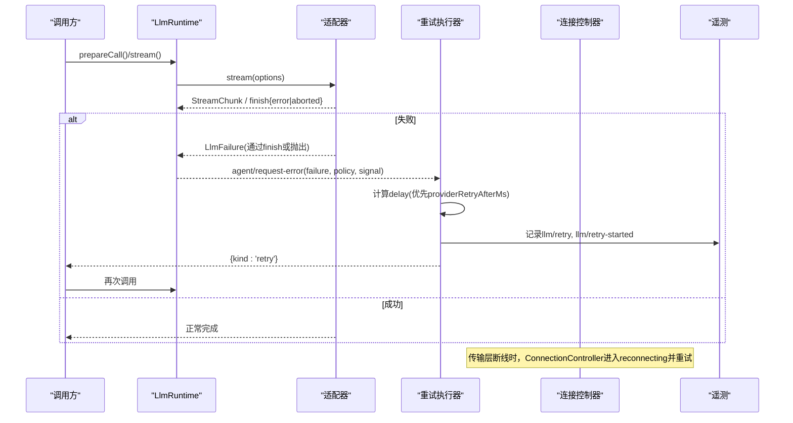
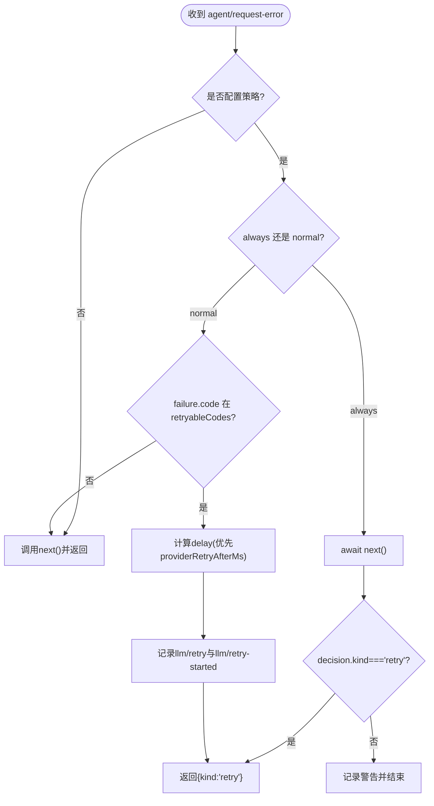
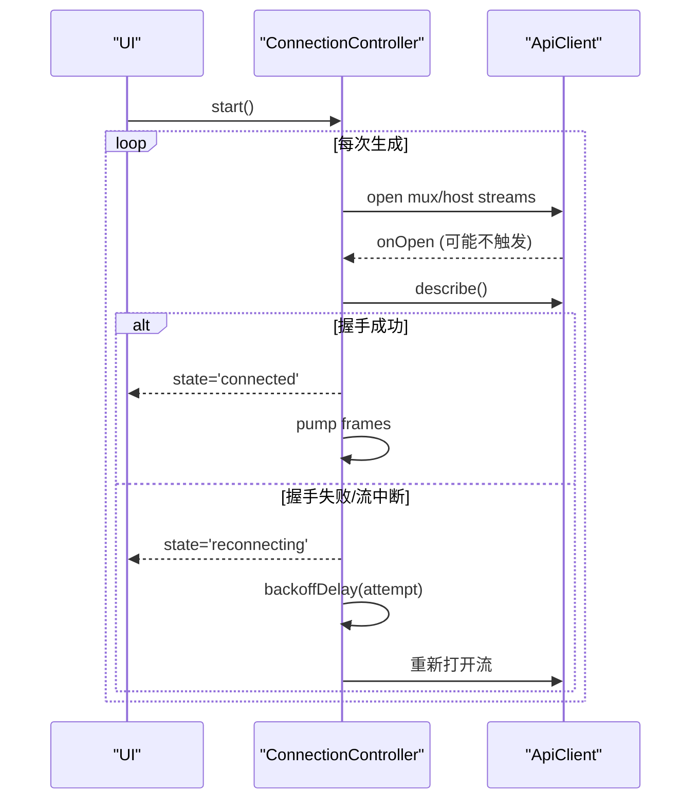
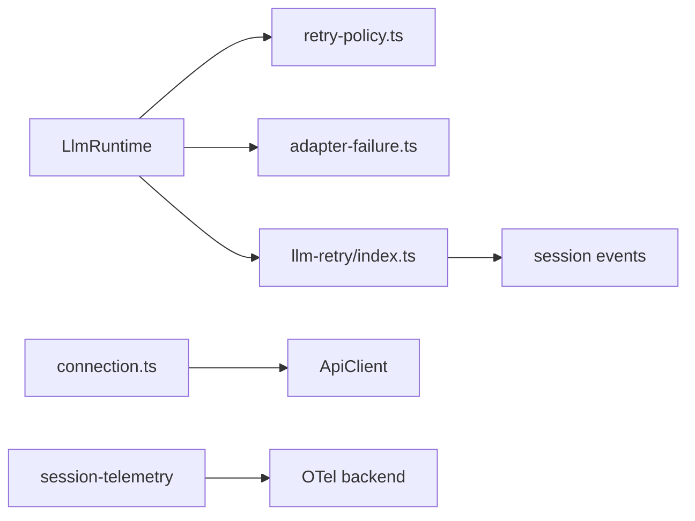

# 错误处理与重试

<cite>
**本文引用的文件**
- [packages/llm/llm/src/index.ts](file://packages/llm/llm/src/index.ts)
- [packages/llm/llm/src/retry-policy.ts](file://packages/llm/llm/src/retry-policy.ts)
- [packages/llm/llm/src/adapter-failure.ts](file://packages/llm/llm/src/adapter-failure.ts)
- [packages/llm/llm-retry/src/index.ts](file://packages/llm/llm-retry/src/index.ts)
- [packages/llm/llm-retry/src/types.ts](file://packages/llm/llm-retry/src/types.ts)
- [packages/llm/llm-retry/src/invariant.ts](file://packages/llm/llm-retry/src/invariant.ts)
- [packages/client/connection/src/client/connection.ts](file://packages/client/connection/src/client/connection.ts)
- [packages/mcp/mcp-client/src/connection.ts](file://packages/mcp/mcp-client/src/connection.ts)
- [packages/session/session-telemetry/src/index.ts](file://packages/session/session-telemetry/src/index.ts)
- [packages/session/session-telemetry-otel/src/index.ts](file://packages/session/session-telemetry-otel/src/index.ts)
- [docs/subsystems/llm-streaming.md](file://docs/subsystems/llm-streaming.md)
</cite>

## 目录
1. [简介](#简介)
2. [项目结构](#项目结构)
3. [核心组件](#核心组件)
4. [架构总览](#架构总览)
5. [详细组件分析](#详细组件分析)
6. [依赖关系分析](#依赖关系分析)
7. [性能考量](#性能考量)
8. [故障排查指南](#故障排查指南)
9. [结论](#结论)
10. [附录](#附录)

## 简介
本文件系统化说明流式响应中的错误类型、错误传播机制与异常处理策略，重点解释 LlmFailure 接口的设计与使用、错误分类、重试策略配置与故障恢复机制。同时文档化断线检测、自动重连与超时处理，并提供错误诊断工具、调试方法以及生产环境的监控与告警策略建议。

## 项目结构
围绕错误与重试的关键代码分布在以下模块：
- LLM 层：定义 LlmError/LlmFailure、适配器失败归一化、重试策略解析与默认值。
- 重试执行器：在 agent/request-error 扩展点实现按 provider 的重试调度、退避与可取消等待。
- 连接层：客户端连接控制器负责双通道握手、断线检测、指数退避重连与状态去抖。
- MCP 客户端：独立的连接管理与重连策略（含最大尝试次数与预算重置）。
- 会话遥测：提供统一的遥测记录与上报能力，用于生产监控与告警。

图表来源
- [packages/llm/llm/src/index.ts:284-800](file://packages/llm/llm/src/index.ts#L284-L800)
- [packages/llm/llm/src/retry-policy.ts:144-192](file://packages/llm/llm/src/retry-policy.ts#L144-L192)
- [packages/llm/llm/src/adapter-failure.ts:62-88](file://packages/llm/llm/src/adapter-failure.ts#L62-L88)
- [packages/llm/llm-retry/src/index.ts:99-227](file://packages/llm/llm-retry/src/index.ts#L99-L227)
- [packages/client/connection/src/client/connection.ts:107-169](file://packages/client/connection/src/client/connection.ts#L107-L169)
- [packages/mcp/mcp-client/src/connection.ts:192-323](file://packages/mcp/mcp-client/src/connection.ts#L192-L323)
- [packages/session/session-telemetry/src/index.ts:162-178](file://packages/session/session-telemetry/src/index.ts#L162-L178)
- [packages/session/session-telemetry-otel/src/index.ts:147-168](file://packages/session/session-telemetry-otel/src/index.ts#L147-L168)

章节来源
- [packages/llm/llm/src/index.ts:284-800](file://packages/llm/llm/src/index.ts#L284-L800)
- [packages/llm/llm/src/retry-policy.ts:144-192](file://packages/llm/llm/src/retry-policy.ts#L144-L192)
- [packages/llm/llm/src/adapter-failure.ts:62-88](file://packages/llm/llm/src/adapter-failure.ts#L62-L88)
- [packages/llm/llm-retry/src/index.ts:99-227](file://packages/llm/llm-retry/src/index.ts#L99-L227)
- [packages/client/connection/src/client/connection.ts:107-169](file://packages/client/connection/src/client/connection.ts#L107-L169)
- [packages/mcp/mcp-client/src/connection.ts:192-323](file://packages/mcp/mcp-client/src/connection.ts#L192-L323)
- [packages/session/session-telemetry/src/index.ts:162-178](file://packages/session/session-telemetry/src/index.ts#L162-L178)
- [packages/session/session-telemetry-otel/src/index.ts:147-168](file://packages/session/session-telemetry-otel/src/index.ts#L147-L168)

## 核心组件
- LlmError 与 LlmFailure
  - LlmError 是结构化错误对象，附带不可变的 LlmFailure 快照，包含 message、code、status、providerRetryAfterMs、requestId。
  - LlmFailure 是跨 provider 的标准化失败载荷，用于下游重试策略决策与诊断。
- 适配器失败归一化
  - 将任意可序列化失败载荷校验并冻结为 LlmFailure，确保下游一致性。
- 重试策略解析
  - resolveRetryPolicy 支持 normal（有限次重试+可重试码）和 always（无限重试）两种模式，内置指数退避与抖动参数校验与默认值。
- 重试执行器
  - 订阅 agent/request-error，根据 provider 的 ResolvedRetryPolicy 计算延迟（优先采用 providerRetryAfterMs），写入持久事件 llm/retry 与 llm/retry-started，返回 { kind: 'retry' } 触发重试。
- 连接控制器
  - 维护双通道流，严格握手（describe + onOpen），失败进入 backoff 重连；暴露 connected/reconnecting 状态供 UI 展示。
- MCP 客户端重连
  - 独立的重连策略：统计失败次数、超过 maxAttempts 放弃并注销工具；稳定窗口后重置预算。

章节来源
- [packages/llm/llm/src/index.ts:69-117](file://packages/llm/llm/src/index.ts#L69-L117)
- [packages/llm/llm/src/adapter-failure.ts:62-88](file://packages/llm/llm/src/adapter-failure.ts#L62-L88)
- [packages/llm/llm/src/retry-policy.ts:144-192](file://packages/llm/llm/src/retry-policy.ts#L144-L192)
- [packages/llm/llm-retry/src/index.ts:99-227](file://packages/llm/llm-retry/src/index.ts#L99-L227)
- [packages/client/connection/src/client/connection.ts:107-169](file://packages/client/connection/src/client/connection.ts#L107-L169)
- [packages/mcp/mcp-client/src/connection.ts:192-323](file://packages/mcp/mcp-client/src/connection.ts#L192-L323)

## 架构总览
下图展示了从模型调用到错误传播、重试与重连的整体流程。

图表来源
- [packages/llm/llm/src/index.ts:284-800](file://packages/llm/llm/src/index.ts#L284-L800)
- [packages/llm/llm-retry/src/index.ts:156-208](file://packages/llm/llm-retry/src/index.ts#L156-L208)
- [packages/client/connection/src/client/connection.ts:107-169](file://packages/client/connection/src/client/connection.ts#L107-L169)

## 详细组件分析

### LlmFailure 与错误分类
- LlmFailure 字段
  - message：人类可读的错误摘要。
  - code：稳定的 provider-neutral 机器码，用于路由与策略判断（如 RATE_LIMIT、SERVER、TIMEOUT、TRANSPORT、EMPTY_RESPONSE 等）。
  - status：可选的 HTTP 状态码（100-599）。
  - providerRetryAfterMs：可选的正数毫秒，表示 provider 建议的等待时间，不是重试决策本身。
  - requestId：可选的 provider 请求标识，用于诊断追踪。
- 错误分类与默认可重试码
  - 默认可重试码包括 EMPTY_RESPONSE、RATE_LIMIT、SERVER、TIMEOUT、TRANSPORT。
  - 可通过 retryableCodes 自定义。
- 适配器失败归一化
  - 对任意失败载荷进行严格校验并冻结为 LlmFailure，保证下游一致性与可序列化性。

章节来源
- [docs/subsystems/llm-streaming.md:184-202](file://docs/subsystems/llm-streaming.md#L184-L202)
- [packages/llm/llm/src/retry-policy.ts:14-24](file://packages/llm/llm/src/retry-policy.ts#L14-L24)
- [packages/llm/llm/src/adapter-failure.ts:62-88](file://packages/llm/llm/src/adapter-failure.ts#L62-L88)

### 重试策略配置与执行
- 策略模式
  - normal：有限次重试，仅对 retryableCodes 匹配的错误重试。
  - always：无限重试直到成功、取消或插件销毁。
- 退避与抖动
  - initialDelayMs、maxDelayMs、jitterRatio 控制指数退避与对称抖动，避免雪崩。
- 执行流程
  - 监听 agent/request-error，若策略未配置则直接透传。
  - always 模式会先尝试下游 next()，再决定是否重试。
  - normal 模式检查 failure.code 是否在 retryableCodes。
  - 计算 delay：优先使用 providerRetryAfterMs（需小于等于 maxDelayMs），否则本地指数退避+抖动。
  - 写入持久事件 llm/retry 与 llm/retry-started，返回 { kind: 'retry' }。
- 不变量校验
  - 校验重试事件与当前 turn/step/provider/policyKey 的一致性，防止乱序与串扰。

图表来源
- [packages/llm/llm-retry/src/index.ts:156-208](file://packages/llm/llm-retry/src/index.ts#L156-L208)
- [packages/llm/llm-retry/src/invariant.ts:44-124](file://packages/llm/llm-retry/src/invariant.ts#L44-L124)

章节来源
- [packages/llm/llm-retry/src/index.ts:99-227](file://packages/llm/llm-retry/src/index.ts#L99-L227)
- [packages/llm/llm-retry/src/types.ts:1-49](file://packages/llm/llm-retry/src/types.ts#L1-L49)
- [packages/llm/llm-retry/src/invariant.ts:18-124](file://packages/llm/llm-retry/src/invariant.ts#L18-L124)

### 断线检测、自动重连与超时处理
- 客户端连接控制器
  - 双通道握手：describe 证明可达，onOpen 证明物理流建立；超时保护 streamOpenTimeoutMs 防止卡死。
  - 失败路径：任何流丢失或握手失败都会进入 reconnecting 状态，按指数退避重连。
  - 状态去抖：connected/reconnecting 仅在变化时通知 UI。
- MCP 客户端重连
  - 统计失败次数，超过 maxAttempts 放弃并注销工具；当连接保持超过最长退避间隔（稳定性窗口）后重置失败计数。
  - 首次尝试失败也会报告 outcome，便于上层感知。

图表来源
- [packages/client/connection/src/client/connection.ts:107-169](file://packages/client/connection/src/client/connection.ts#L107-L169)
- [packages/mcp/mcp-client/src/connection.ts:192-323](file://packages/mcp/mcp-client/src/connection.ts#L192-L323)

章节来源
- [packages/client/connection/src/client/connection.ts:107-169](file://packages/client/connection/src/client/connection.ts#L107-L169)
- [packages/mcp/mcp-client/src/connection.ts:192-323](file://packages/mcp/mcp-client/src/connection.ts#L192-L323)

### 异常处理策略与边界
- 适配器契约
  - usage 必须在 finish 之前；finish 之后不得再有数据。
  - 错误路径二选一：throw（传输/协议错误）或 finish{kind:'error'|'aborted', failure}（provider 内部错误）。
  - 空完成视为可重试错误（EMPTY_RESPONSE）。
  - 上下文溢出统一映射为 CONTEXT_WINDOW_EXCEEDED。
- 调用层隔离
  - ConnectionController 的 sink 抛错仅记录日志，不影响泵与重连语义。
  - LlmRuntime 在最终适配器边界将失败归一化为 LlmFailure，并通过 agent/request-error 传递。

章节来源
- [docs/subsystems/llm-streaming.md:204-217](file://docs/subsystems/llm-streaming.md#L204-L217)
- [packages/client/connection/src/client/connection.ts:178-201](file://packages/client/connection/src/client/connection.ts#L178-L201)

## 依赖关系分析
- LlmRuntime 依赖重试策略解析与适配器失败归一化，向 agent 层暴露标准化的失败信息。
- 重试执行器依赖 session 事件写入与 abort 信号管理，确保可取消与幂等。
- 连接控制器依赖 ApiClient 的双通道抽象，封装重连逻辑与状态机。
- 遥测协调器与 OTel 后端提供统一上报能力，支撑生产监控。

图表来源
- [packages/llm/llm/src/index.ts:284-800](file://packages/llm/llm/src/index.ts#L284-L800)
- [packages/llm/llm/src/retry-policy.ts:144-192](file://packages/llm/llm/src/retry-policy.ts#L144-L192)
- [packages/llm/llm/src/adapter-failure.ts:62-88](file://packages/llm/llm/src/adapter-failure.ts#L62-L88)
- [packages/llm/llm-retry/src/index.ts:99-227](file://packages/llm/llm-retry/src/index.ts#L99-L227)
- [packages/client/connection/src/client/connection.ts:107-169](file://packages/client/connection/src/client/connection.ts#L107-L169)
- [packages/session/session-telemetry/src/index.ts:162-178](file://packages/session/session-telemetry/src/index.ts#L162-L178)
- [packages/session/session-telemetry-otel/src/index.ts:147-168](file://packages/session/session-telemetry-otel/src/index.ts#L147-L168)

## 性能考量
- 指数退避与抖动
  - 合理设置 initialDelayMs、maxDelayMs、jitterRatio，避免风暴与过度占用。
- 可取消等待
  - 所有等待均支持 AbortSignal，确保快速退出与资源释放。
- 状态去抖
  - 连接状态变更去抖，减少 UI 频繁刷新。
- 适配器侧限制
  - 适配器禁用库级重试，由 agent 层统一重试，避免重复重试叠加。

[本节为通用指导，不直接分析具体文件]

## 故障排查指南
- 定位错误来源
  - 查看 LlmFailure.code 与 status，结合 requestId 在 provider 侧检索日志。
  - 关注 EMPTY_RESPONSE、RATE_LIMIT、TIMEOUT、TRANSPORT 等常见码。
- 验证重试行为
  - 检查 session 中 llm/retry 与 llm/retry-started 事件，确认 retry 次数、policyKey 与 delay。
  - 使用 invariant 插件捕获不一致的 turn/step/provider 组合。
- 连接问题
  - 观察 ConnectionController 的 connected/reconnecting 切换频率与 backoff 曲线。
  - 调整 streamOpenTimeoutMs 以适配慢启动场景。
- 遥测与告警
  - 启用 SessionTelemetryCoordinator 与 OTel 后端，收集错误率、重试次数、延迟分布。
  - 基于错误码与重试次数阈值配置告警规则（如 RATE_LIMIT 突增、连续 TIMEOUT）。

章节来源
- [packages/llm/llm-retry/src/invariant.ts:18-124](file://packages/llm/llm-retry/src/invariant.ts#L18-L124)
- [packages/session/session-telemetry/src/index.ts:162-178](file://packages/session/session-telemetry/src/index.ts#L162-L178)
- [packages/session/session-telemetry-otel/src/index.ts:147-168](file://packages/session/session-telemetry-otel/src/index.ts#L147-L168)

## 结论
本项目通过 LlmFailure 标准化失败载荷、可配置的 retry 策略与严格的不变量校验，实现了健壮的错误传播与恢复。连接层的断线检测与自动重连保障了可用性，配合遥测系统可实现生产环境的全链路监控与告警。建议在部署中合理配置重试与退避参数，并结合业务特征定制 retryableCodes 与告警阈值。

## 附录
- 关键配置项参考
  - 重试策略：mode、maxRetries、retryableCodes、initialDelayMs、maxDelayMs、jitterRatio。
  - 连接超时：streamOpenTimeoutMs。
  - 遥测模式：FULL、FEEDBACK_ONLY、DISABLED。

[本节为概念性补充，不直接分析具体文件]