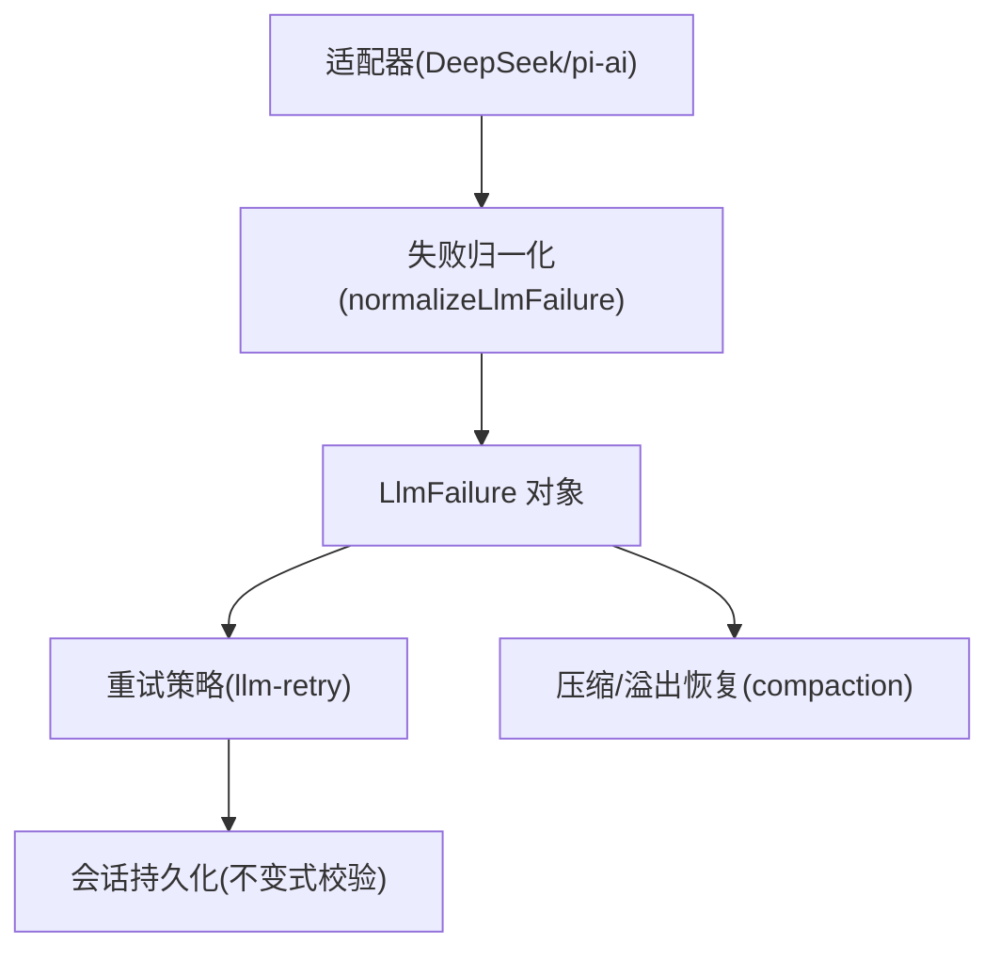
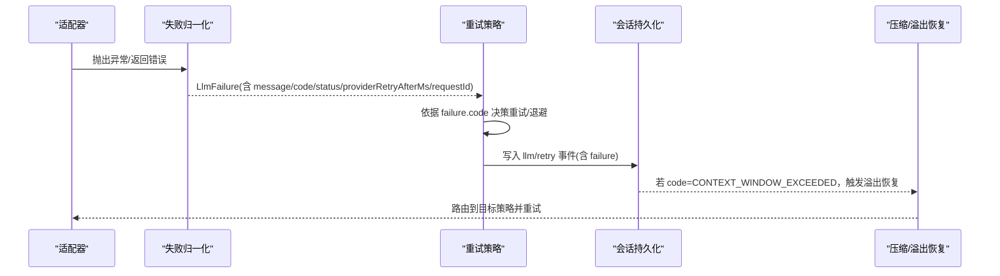
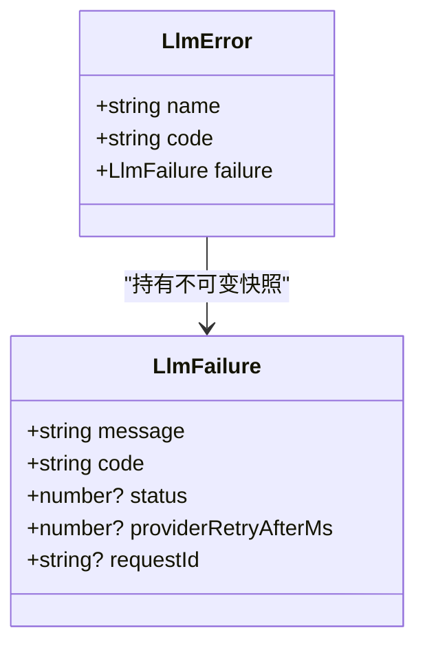
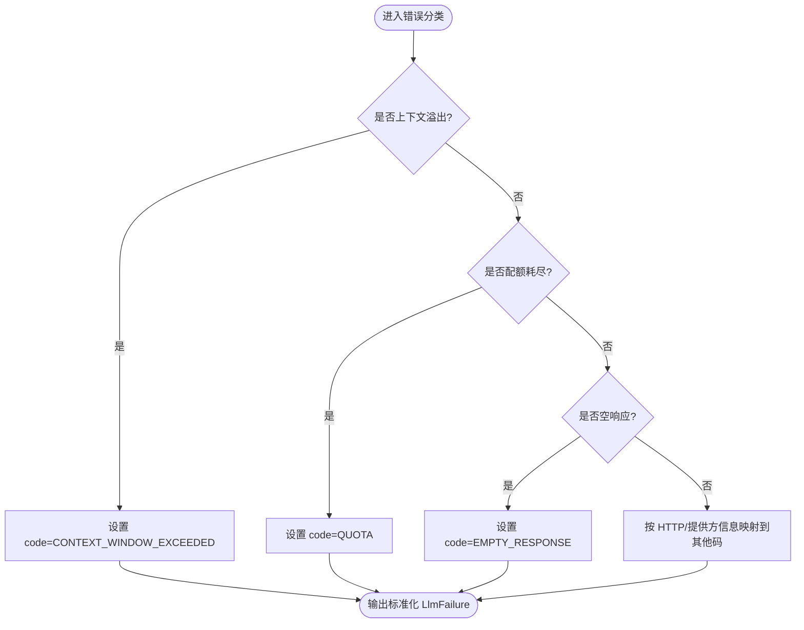
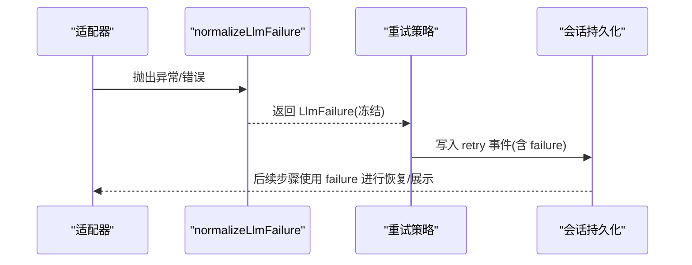
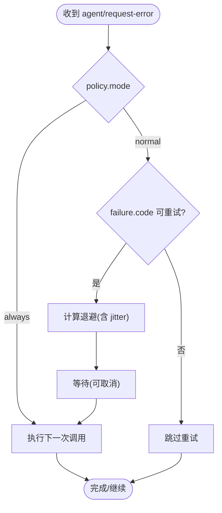
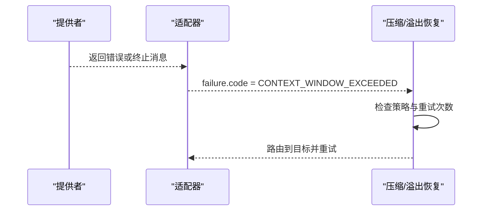
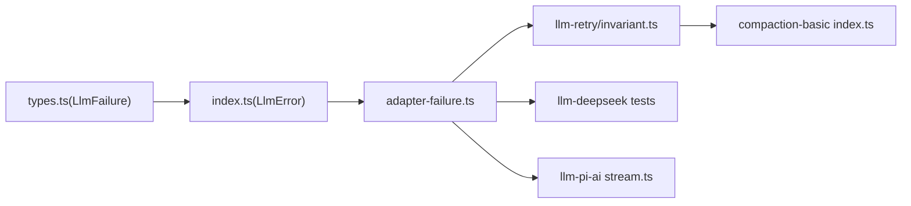

# 错误类型与分类

<cite>
**本文引用的文件**
- [packages/llm/llm/src/types.ts](file://packages/llm/llm/src/types.ts)
- [packages/llm/llm/src/index.ts](file://packages/llm/llm/src/index.ts)
- [packages/llm/llm/src/error.ts](file://packages/llm/llm/src/error.ts)
- [packages/llm/llm/src/adapter-failure.ts](file://packages/llm/llm/src/adapter-failure.ts)
- [packages/llm/llm-retry/src/invariant.ts](file://packages/llm/llm-retry/src/invariant.ts)
- [packages/llm/llm-deepseek/tests/adapter.spec.ts](file://packages/llm/llm-deepseek/tests/adapter.spec.ts)
- [packages/llm/llm-pi-ai/src/stream.ts](file://packages/llm/llm-pi-ai/src/stream.ts)
- [packages/compaction/compaction-basic/src/index.ts](file://packages/compaction/compaction-basic/src/index.ts)
</cite>

## 目录
1. [简介](#简介)
2. [项目结构](#项目结构)
3. [核心组件](#核心组件)
4. [架构总览](#架构总览)
5. [详细组件分析](#详细组件分析)
6. [依赖关系分析](#依赖关系分析)
7. [性能考虑](#性能考虑)
8. [故障排查指南](#故障排查指南)
9. [结论](#结论)
10. [附录](#附录)

## 简介
本文件系统化梳理 LLM 子系统的错误类型与分类，重点说明 LlmFailure 接口的设计、LlmError 的使用方式、错误码的标准化处理以及错误信息的结构化表示。文档覆盖网络错误、超时错误、上下文窗口溢出、空响应等典型错误场景，并提供错误诊断与调试的最佳实践，以及生产环境中的错误监控策略。

## 项目结构
围绕错误体系的核心代码分布在以下模块：
- 类型与错误基类：定义 LlmFailure、LlmError、错误常量与识别函数
- 适配器失败归一化：将任意抛出的异常统一为稳定的 LlmFailure
- 重试与不变式校验：在持久边界对 failure 进行强约束，确保可重放与可观测
- 适配器实现：DeepSeek/pi-ai 等适配器将提供方错误映射到标准错误码
- 压缩与恢复：针对上下文溢出错误的自动重试与降级策略

**图表来源**
- [packages/llm/llm/src/adapter-failure.ts:16-28](file://packages/llm/llm/src/adapter-failure.ts#L16-L28)
- [packages/llm/llm-retry/src/invariant.ts:18-42](file://packages/llm/llm-retry/src/invariant.ts#L18-L42)
- [packages/compaction/compaction-basic/src/index.ts:179-189](file://packages/compaction/compaction-basic/src/index.ts#L179-L189)

**章节来源**
- [packages/llm/llm/src/types.ts:40-51](file://packages/llm/llm/src/types.ts#L40-L51)
- [packages/llm/llm/src/index.ts:69-117](file://packages/llm/llm/src/index.ts#L69-L117)
- [packages/llm/llm/src/error.ts:24-49](file://packages/llm/llm/src/error.ts#L24-L49)

## 核心组件
- LlmFailure：序列化、稳定、跨边界的错误事实载体，包含消息、机器码、HTTP 状态码、提供商建议的重试延迟和请求标识符。
- LlmError：基于 HarnessError 的 LLM 专用错误，构造时严格校验字段并冻结 failure 快照。
- 错误常量与识别器：CONTEXT_WINDOW_EXCEEDED_CODE、QUOTA、EMPTY_RESPONSE、INVALID_CREDENTIAL 等；isContextWindowExceededError、isQuotaExceededError 用于文本模式匹配。
- 失败归一化：normalizeLlmFailure 从任意抛出值中提取或构造稳定的 LlmFailure。
- 重试与不变式：llm-retry 根据 failure.code 决定是否重试；invariant 在持久边界校验 failure 的结构与语义一致性。

**章节来源**
- [packages/llm/llm/src/types.ts:40-51](file://packages/llm/llm/src/types.ts#L40-L51)
- [packages/llm/llm/src/index.ts:69-117](file://packages/llm/llm/src/index.ts#L69-L117)
- [packages/llm/llm/src/error.ts:24-49](file://packages/llm/llm/src/error.ts#L24-L49)
- [packages/llm/llm/src/adapter-failure.ts:16-28](file://packages/llm/llm/src/adapter-failure.ts#L16-L28)
- [packages/llm/llm-retry/src/invariant.ts:18-42](file://packages/llm/llm-retry/src/invariant.ts#L18-L42)

## 架构总览
下图展示了从适配器抛出错误到最终被重试、记录与恢复的完整链路。

**图表来源**
- [packages/llm/llm/src/adapter-failure.ts:16-28](file://packages/llm/llm/src/adapter-failure.ts#L16-L28)
- [packages/llm/llm-retry/src/invariant.ts:18-42](file://packages/llm/llm-retry/src/invariant.ts#L18-L42)
- [packages/compaction/compaction-basic/src/index.ts:179-189](file://packages/compaction/compaction-basic/src/index.ts#L179-L189)

## 详细组件分析

### LlmFailure 接口设计
- 字段说明
  - message：人类可读的错误摘要
  - code：稳定的、提供方可插拔的机器码（如 RATE_LIMIT、AUTH、CONTEXT_WINDOW_EXCEEDED 等）
  - status：可选的 HTTP 状态码（100-599 整数）
  - providerRetryAfterMs：可选的正有限毫秒数，来自提供商的建议重试延迟
  - requestId：可选的非空字符串，用于跨系统追踪
- 不可变性：failure 通过冻结对象暴露，避免下游篡改
- 校验：在 LlmError 构造与 invariant 中双重校验，保证跨进程/跨包一致

**图表来源**
- [packages/llm/llm/src/types.ts:40-51](file://packages/llm/llm/src/types.ts#L40-L51)
- [packages/llm/llm/src/index.ts:69-117](file://packages/llm/llm/src/index.ts#L69-L117)

**章节来源**
- [packages/llm/llm/src/types.ts:40-51](file://packages/llm/llm/src/types.ts#L40-L51)
- [packages/llm/llm/src/index.ts:69-117](file://packages/llm/llm/src/index.ts#L69-L117)
- [packages/llm/llm-retry/src/invariant.ts:18-42](file://packages/llm/llm-retry/src/invariant.ts#L18-L42)

### 错误分类与标准化
- 上下文窗口溢出：CONTEXT_WINDOW_EXCEEDED_CODE，通过 isContextWindowExceededError 识别多种提供方措辞
- 配额耗尽：QUOTA，通过 isQuotaExceededError 识别余额/额度耗尽
- 空响应：EMPTY_RESPONSE，当提供方返回无内容块的终止响应时归类为此错误，便于安全重试
- 凭证无效：INVALID_CREDENTIAL，区分缺失凭证与格式错误
- 其他常见码：AUTH、RATE_LIMIT、SERVER、TIMEOUT、TRANSPORT 等由适配器映射

**图表来源**
- [packages/llm/llm/src/error.ts:24-49](file://packages/llm/llm/src/error.ts#L24-L49)
- [packages/llm/llm/src/error.ts:50-100](file://packages/llm/llm/src/error.ts#L50-L100)
- [packages/llm/llm-deepseek/tests/adapter.spec.ts:384-396](file://packages/llm/llm-deepseek/tests/adapter.spec.ts#L384-L396)
- [packages/llm/llm-pi-ai/src/stream.ts:64-86](file://packages/llm/llm-pi-ai/src/stream.ts#L64-L86)

**章节来源**
- [packages/llm/llm/src/error.ts:24-49](file://packages/llm/llm/src/error.ts#L24-L49)
- [packages/llm/llm/src/error.ts:50-100](file://packages/llm/llm/src/error.ts#L50-L100)
- [packages/llm/llm-deepseek/tests/adapter.spec.ts:384-396](file://packages/llm/llm-deepseek/tests/adapter.spec.ts#L384-L396)
- [packages/llm/llm-pi-ai/src/stream.ts:64-86](file://packages/llm/llm-pi-ai/src/stream.ts#L64-L86)

### 失败归一化与错误传播
- normalizeLlmFailure：从任意抛出值提取或构造 LlmFailure，优先信任 HarnessError 携带的稳定 code 与 failure 快照
- 健壮性：对 hostile 对象、越界访问、非 Error 值均做保护，确保日志与 UI 渲染不崩溃
- 传播路径：适配器 -> 归一化 -> 重试策略 -> 会话持久化 -> 上层消费方

**图表来源**
- [packages/llm/llm/src/adapter-failure.ts:16-28](file://packages/llm/llm/src/adapter-failure.ts#L16-L28)
- [packages/llm/llm/src/adapter-failure.ts:62-88](file://packages/llm/llm/src/adapter-failure.ts#L62-L88)

**章节来源**
- [packages/llm/llm/src/adapter-failure.ts:16-28](file://packages/llm/llm/src/adapter-failure.ts#L16-L28)
- [packages/llm/llm/src/adapter-failure.ts:62-88](file://packages/llm/llm/src/adapter-failure.ts#L62-L88)

### 重试策略与不变式校验
- 重试决策：基于 failure.code 是否在 retryableCodes 中；always 模式无条件重试（受信号控制）
- 延迟计算：指数退避+抖动，支持 providerRetryAfterMs 提示
- 不变式：在持久边界校验 failure 的完整性与一致性，确保回放与审计可靠

**图表来源**
- [packages/llm/llm-retry/src/invariant.ts:18-42](file://packages/llm/llm-retry/src/invariant.ts#L18-L42)

**章节来源**
- [packages/llm/llm-retry/src/invariant.ts:18-42](file://packages/llm/llm-retry/src/invariant.ts#L18-L42)

### 上下文溢出与空响应的特殊处理
- 上下文溢出：适配器将提供方“超出上下文窗口”的提示映射为 CONTEXT_WINDOW_EXCEEDED；压缩层检测到该码后，按策略路由到目标并尝试恢复
- 空响应：EMPTY_RESPONSE 被视为可安全重试的终结错误，避免静默结束轮次

**图表来源**
- [packages/compaction/compaction-basic/src/index.ts:179-189](file://packages/compaction/compaction-basic/src/index.ts#L179-L189)
- [packages/llm/llm-pi-ai/src/stream.ts:64-86](file://packages/llm/llm-pi-ai/src/stream.ts#L64-L86)

**章节来源**
- [packages/compaction/compaction-basic/src/index.ts:179-189](file://packages/compaction/compaction-basic/src/index.ts#L179-L189)
- [packages/llm/llm-pi-ai/src/stream.ts:64-86](file://packages/llm/llm-pi-ai/src/stream.ts#L64-L86)

## 依赖关系分析
- LlmFailure 作为跨模块契约，被 llm、llm-retry、compaction、适配器实现共同消费
- LlmError 继承 HarnessError，复用统一的 code 分类体系
- 适配器实现（deepseek/pi-ai）负责将提供方错误映射为标准码
- compaction 监听 request-error 事件，针对特定码实施恢复

**图表来源**
- [packages/llm/llm/src/types.ts:40-51](file://packages/llm/llm/src/types.ts#L40-L51)
- [packages/llm/llm/src/index.ts:69-117](file://packages/llm/llm/src/index.ts#L69-L117)
- [packages/llm/llm/src/adapter-failure.ts:16-28](file://packages/llm/llm/src/adapter-failure.ts#L16-L28)
- [packages/llm/llm-retry/src/invariant.ts:18-42](file://packages/llm/llm-retry/src/invariant.ts#L18-L42)
- [packages/compaction/compaction-basic/src/index.ts:179-189](file://packages/compaction/compaction-basic/src/index.ts#L179-L189)

**章节来源**
- [packages/llm/llm/src/types.ts:40-51](file://packages/llm/llm/src/types.ts#L40-L51)
- [packages/llm/llm/src/index.ts:69-117](file://packages/llm/llm/src/index.ts#L69-L117)
- [packages/llm/llm/src/adapter-failure.ts:16-28](file://packages/llm/llm/src/adapter-failure.ts#L16-L28)
- [packages/llm/llm-retry/src/invariant.ts:18-42](file://packages/llm/llm-retry/src/invariant.ts#L18-L42)
- [packages/compaction/compaction-basic/src/index.ts:179-189](file://packages/compaction/compaction-basic/src/index.ts#L179-L189)

## 性能考虑
- 冻结 LlmFailure 减少拷贝与意外修改开销
- 重试退避结合抖动降低雪崩风险；providerRetryAfterMs 可显著减少无效重试
- 不变式校验仅在持久边界执行，避免热路径负担
- 错误识别使用正则匹配，注意在高频路径下控制复杂度

[本节为通用指导，无需具体文件引用]

## 故障排查指南
- 定位错误来源
  - 查看 LlmFailure.code 与 message，快速判断错误类别
  - 使用 requestId 关联上游日志与提供商侧追踪
- 诊断上下文溢出
  - 关注 CONTEXT_WINDOW_EXCEEDED 及适配器映射逻辑
  - 检查模型 contextWindow 配置与实际输入长度
- 诊断配额耗尽
  - 关注 QUOTA 码与 isQuotaExceededError 匹配规则
  - 核对账户余额/计划限制
- 诊断空响应
  - EMPTY_RESPONSE 通常可重试；检查适配器终止条件
- 重试行为验证
  - 确认 failure.code 是否在 retryableCodes
  - 检查 providerRetryAfterMs 是否被正确应用
- 日志与监控
  - 记录 LlmFailure 的完整字段（message、code、status、providerRetryAfterMs、requestId）
  - 按 code 维度聚合告警与仪表盘

**章节来源**
- [packages/llm/llm/src/error.ts:24-49](file://packages/llm/llm/src/error.ts#L24-L49)
- [packages/llm/llm/src/error.ts:50-100](file://packages/llm/llm/src/error.ts#L50-L100)
- [packages/llm/llm/src/adapter-failure.ts:62-88](file://packages/llm/llm/src/adapter-failure.ts#L62-L88)
- [packages/llm/llm-retry/src/invariant.ts:18-42](file://packages/llm/llm-retry/src/invariant.ts#L18-L42)

## 结论
通过将 LlmFailure 作为跨边界的稳定错误事实载体，配合 LlmError 的严格校验、适配器的标准化映射、重试策略的弹性恢复以及不变式的持久保障，系统在错误分类、诊断与恢复方面具备高一致性与可观测性。生产环境中应基于 code 与 requestId 建立完善的监控与告警体系，并结合 providerRetryAfterMs 优化重试体验。

[本节为总结性内容，无需具体文件引用]

## 附录
- 关键错误码参考
  - CONTEXT_WINDOW_EXCEEDED：上下文窗口溢出
  - QUOTA：配额/余额耗尽
  - EMPTY_RESPONSE：空响应（可安全重试）
  - INVALID_CREDENTIAL：凭证格式错误
  - AUTH/RATE_LIMIT/SERVER/TIMEOUT/TRANSPORT：认证/限流/服务端/超时/传输错误
- 最佳实践
  - 始终使用 code 进行路由与告警，避免解析 message
  - 保留 requestId 以串联端到端追踪
  - 合理配置重试策略与退避上限，避免放大负载
  - 对上下文溢出启用自动恢复策略

[本节为补充信息，无需具体文件引用]