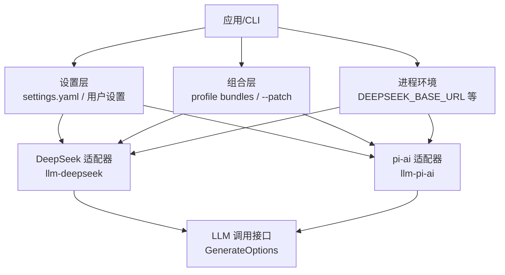
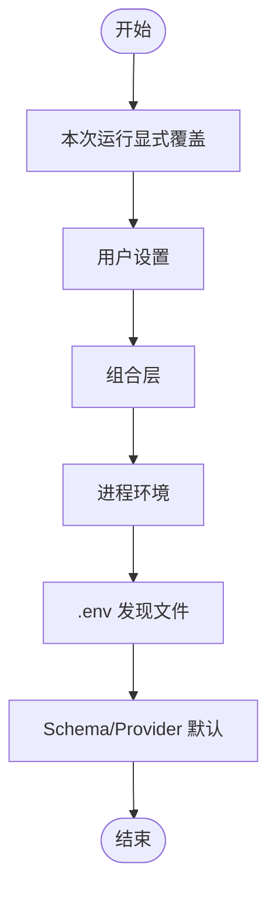
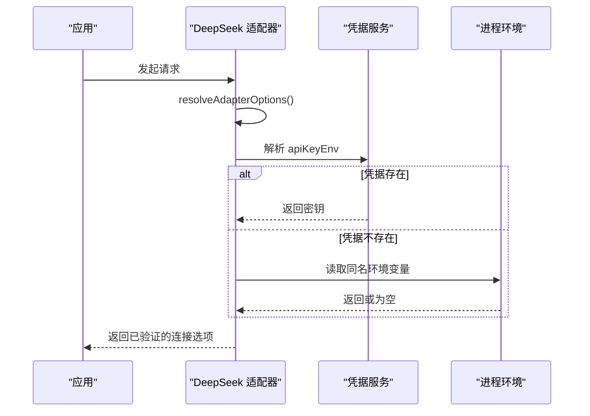
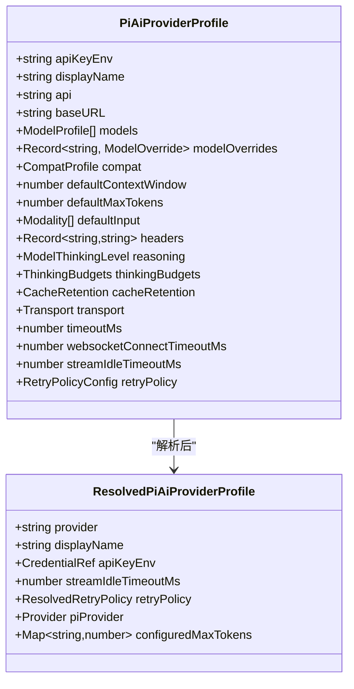
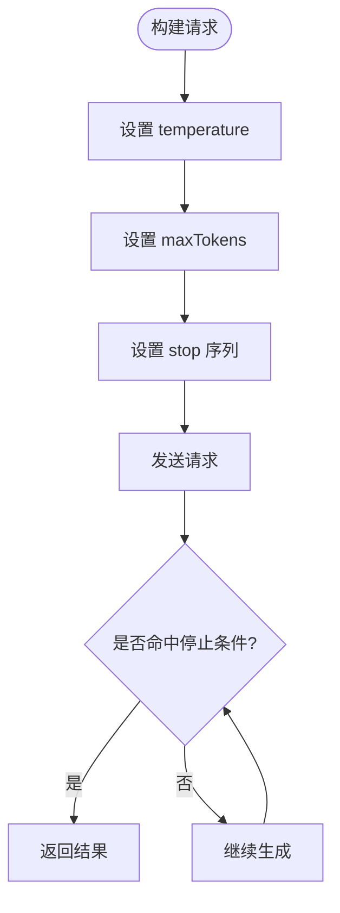
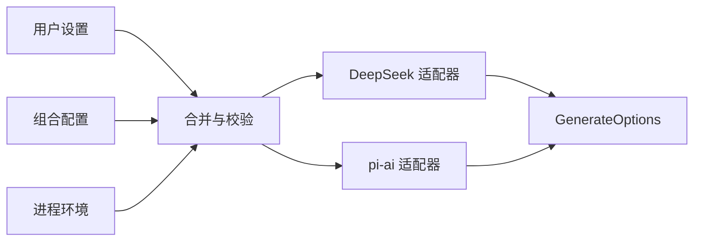

# 配置和参数调优

<cite>
**本文引用的文件**
- [packages/llm/llm-deepseek/src/index.ts](file://packages/llm/llm-deepseek/src/index.ts)
- [packages/llm/llm-pi-ai/src/config.ts](file://packages/llm/llm-pi-ai/src/config.ts)
- [packages/llm/llm/src/types.ts](file://packages/llm/llm/src/types.ts)
- [docs/config-catalog.md](file://docs/config-catalog.md)
- [.agents/notes/implemented/architecture/2026-08-04-configuration-source-ownership.md](file://.agents/notes/implemented/architecture/2026-08-04-configuration来源优先级.md)
- [.agents/notes/implemented/architecture/2026-07-30-adapter-owned-max-token-defaults.md](file://.agents/notes/implemented/architecture/2026-07-30-适配器默认最大令牌数.md)
- [.agents/notes/implemented/architecture/2026-07-30-adapter-owned-max-token-defaults.zh.md](file://.agents/notes/implemented/architecture/2026-07-30-适配器默认最大令牌数.zh.md)
- [.agents/notes/implemented/feature/2026-07-28-sdk-max-output-tokens.md](file://.agents/notes/implemented/feature/2026-07-28-sdk最大输出令牌数.md)
- [apps/cli/config/agent-presets/code/preset.yml](file://apps/cli/config/agent-presets/code/preset.yml)
- [apps/cli/config/agent-presets/cordis/preset.yml](file://apps/cli/config/agent-presets/cordis/preset.yml)
</cite>

## 目录
1. [简介](#简介)
2. [项目结构](#项目结构)
3. [核心组件](#核心组件)
4. [架构总览](#架构总览)
5. [详细组件分析](#详细组件分析)
6. [依赖关系分析](#依赖关系分析)
7. [性能考虑](#性能考虑)
8. [故障排查指南](#故障排查指南)
9. [结论](#结论)
10. [附录：模板与迁移](#附录模板与迁移)

## 简介
本文件聚焦于 LLM（大语言模型）在 Harness 中的配置与参数调优，覆盖以下主题：
- 所有关键配置项的含义、默认值与影响范围
- 温度、最大令牌数、停止条件等参数的调优方法
- 环境变量与配置文件的管理方式及优先级
- 不同使用场景的推荐配置与最佳实践
- 配置验证与安全考虑
- 配置模板与迁移指南

## 项目结构
LLM 相关配置主要分布在两个适配器插件中：
- DeepSeek 官方适配器：提供单一 provider 路由的配置与运行时解析
- pi-ai 适配器：支持多 provider 路由的集中式配置与模型目录管理

此外，统一的生成请求类型定义了通用参数（如 temperature、maxTokens、stop），以及各子系统文档对配置项的汇总。

图表来源
- [packages/llm/llm-deepseek/src/index.ts:161-197](file://packages/llm/llm-deepseek/src/index.ts#L161-L197)
- [packages/llm/llm-pi-ai/src/config.ts:301-371](file://packages/llm/llm-pi-ai/src/config.ts#L301-L371)
- [packages/llm/llm/src/types.ts:319-356](file://packages/llm/llm/src/types.ts#L319-L356)

章节来源
- [packages/llm/llm-deepseek/src/index.ts:1-277](file://packages/llm/llm-deepseek/src/index.ts#L1-L277)
- [packages/llm/llm-pi-ai/src/config.ts:1-373](file://packages/llm/llm-pi-ai/src/config.ts#L1-L373)
- [packages/llm/llm/src/types.ts:319-356](file://packages/llm/llm/src/types.ts#L319-L356)
- [docs/config-catalog.md:1-800](file://docs/config-catalog.md#L1-L800)

## 核心组件
- DeepSeek 适配器配置（llm-deepseek）
  - apiKeyEnv：凭据引用（环境变量名），默认 DEEPSEEK_API_KEY
  - baseURL：端点基地址；可从受信任环境层读取 DEEPSEEK_BASE_URL，否则回退到公共 API
  - thinking：部署级思考策略（enabled/disabled）
  - reasoningEffort：默认推理努力级别（off/high/max）
  - maxTokens：默认单次请求输出上限（默认 256,000）
  - defaultContextWindow：当模型未声明上下文容量时的默认值（默认 1,000,000）
  - models：建议模型目录（id/name/description/contextWindow/maxTokens）
  - streamIdleTimeoutMs：流空闲超时（毫秒）
  - retryPolicy：重试策略
- pi-ai 适配器配置（llm-pi-ai）
  - providers：以路由为键的多 provider 配置集合
    - apiKeyEnv、displayName、api、baseURL、models、modelOverrides、compat
    - defaultContextWindow、defaultMaxTokens、defaultInput、headers
    - reasoning、thinkingBudgets、cacheRetention、transport
    - timeoutMs、websocketConnectTimeoutMs、streamIdleTimeoutMs、retryPolicy
- 统一生成选项（GenerateOptions）
  - temperature、maxTokens、stop（停止序列）、reasoningEffort、sessionId、purpose 等

章节来源
- [packages/llm/llm-deepseek/src/index.ts:62-101](file://packages/llm/llm-deepseek/src/index.ts#L62-L101)
- [packages/llm/llm-pi-ai/src/config.ts:64-179](file://packages/llm/llm-pi-ai/src/config.ts#L64-L179)
- [packages/llm/llm/src/types.ts:319-356](file://packages/llm/llm/src/types.ts#L319-L356)

## 架构总览
配置来源与优先级（非凭据类值）：
- 本次运行显式覆盖 > 用户设置 > 组合（profile bundles、--patch） > 进程环境 > 发现的文件（.env） > 默认值（schema/provider 默认）

凭据类值的优先级（独立且更窄）：
- 继承进程环境（只读，最高优先） > $DSH_HOME/.credentials.yaml（可写） > 项目 .env > $DSH_HOME/.env

图表来源
- [.agents/notes/implemented/architecture/2026-08-04-configuration来源优先级.md:17-39](file://.agents/notes/implemented/architecture/2026-08-04-configuration来源优先级.md#L17-L39)

章节来源
- [.agents/notes/implemented/architecture/2026-08-04-configuration来源优先级.md:17-39](file://.agents/notes/implemented/architecture/2026-08-04-configuration来源优先级.md#L17-L39)

## 详细组件分析

### DeepSeek 适配器配置详解
- apiKeyEnv：通过凭据服务或环境变量解析密钥；缺失时抛出 MISSING_CREDENTIAL 错误
- baseURL：优先使用受信任环境层的 DEEPSEEK_BASE_URL，其次为公共 API
- thinking/reasoningEffort：若 thinking=disabled，则仅允许 reasoningEffort=off
- maxTokens：默认 256,000；需确保不超过模型/网关能力
- defaultContextWindow：默认 1,000,000；用于未声明容量的模型
- models：目录校验（id 非空、name/contextWindow/maxTokens 合法、无重复 id）
- streamIdleTimeoutMs：正有限数，不超过系统定时器上限
- retryPolicy：由共享重试策略 schema 校验

图表来源
- [packages/llm/llm-deepseek/src/index.ts:161-197](file://packages/llm/llm-deepseek/src/index.ts#L161-L197)
- [packages/llm/llm-deepseek/src/index.ts:225-246](file://packages/llm/llm-deepseek/src/index.ts#L225-L246)

章节来源
- [packages/llm/llm-deepseek/src/index.ts:62-101](file://packages/llm/llm-deepseek/src/index.ts#L62-L101)
- [packages/llm/llm-deepseek/src/index.ts:161-197](file://packages/llm/llm-deepseek/src/index.ts#L161-L197)
- [packages/llm/llm-deepseek/src/index.ts:225-246](file://packages/llm/llm-deepseek/src/index.ts#L225-L246)

### pi-ai 适配器配置详解
- providers：以路由为键的字典，每个路由可独立配置 api/baseURL/models/headers 等
- modelOverrides：按模型 id 覆盖能力（contextWindow、maxTokens、input、reasoningEfforts、compat）
- defaultContextWindow/defaultMaxTokens/defaultInput：未声明时的默认能力
- reasoning/thinkingBudgets/cacheRetention/transport：推理与传输偏好
- timeoutMs/websocketConnectTimeoutMs/streamIdleTimeoutMs：网络与流超时
- retryPolicy：每路由独立的重试策略

图表来源
- [packages/llm/llm-pi-ai/src/config.ts:64-179](file://packages/llm/llm-pi-ai/src/config.ts#L64-L179)
- [packages/llm/llm-pi-ai/src/config.ts:301-371](file://packages/llm/llm-pi-ai/src/config.ts#L301-L371)

章节来源
- [packages/llm/llm-pi-ai/src/config.ts:64-179](file://packages/llm/llm-pi-ai/src/config.ts#L64-L179)
- [packages/llm/llm-pi-ai/src/config.ts:301-371](file://packages/llm/llm-pi-ai/src/config.ts#L301-L371)

### 统一生成参数（temperature、maxTokens、stop）
- temperature：控制随机性；较低值更稳定，较高值更具创造性
- maxTokens：单次请求输出上限；可由适配器默认、模型能力或请求覆盖共同决定
- stop：停止序列；一旦模型生成任一停止字符串即终止

图表来源
- [packages/llm/llm/src/types.ts:319-356](file://packages/llm/llm/src/types.ts#L319-L356)

章节来源
- [packages/llm/llm/src/types.ts:319-356](file://packages/llm/llm/src/types.ts#L319-L356)

## 依赖关系分析
- 配置来源依赖：
  - settings 层与 composition 层合并后作为插件 base 层
  - 进程环境与 .env 文件作为补充
  - 最终由适配器进行校验并生成连接选项
- 适配器间解耦：
  - DeepSeek 与 pi-ai 各自维护自身配置与模型目录
  - 统一通过 GenerateOptions 暴露给上层调用

图表来源
- [packages/llm/llm-deepseek/src/index.ts:161-197](file://packages/llm/llm-deepseek/src/index.ts#L161-L197)
- [packages/llm/llm-pi-ai/src/config.ts:301-371](file://packages/llm/llm-pi-ai/src/config.ts#L301-L371)
- [packages/llm/llm/src/types.ts:319-356](file://packages/llm/llm/src/types.ts#L319-L356)

章节来源
- [packages/llm/llm-deepseek/src/index.ts:161-197](file://packages/llm/llm-deepseek/src/index.ts#L161-L197)
- [packages/llm/llm-pi-ai/src/config.ts:301-371](file://packages/llm/llm-pi-ai/src/config.ts#L301-L371)
- [packages/llm/llm/src/types.ts:319-356](file://packages/llm/llm/src/types.ts#L319-L356)

## 性能考虑
- 默认输出预算（maxTokens）：
  - DeepSeek 默认 256,000；若网关/模型支持较小预算，应显式降低以避免占用过多上下文
- 流空闲超时（streamIdleTimeoutMs）：
  - 过短可能导致流中断；过长可能占用资源；应根据网络与模型响应时间调整
- 重试策略（retryPolicy）：
  - 合理设置尝试次数与延迟，避免雪崩与过度重试
- 压缩与摘要（compaction-basic）：
  - 阈值比例与保留比例影响上下文压缩时机与内容保留量

章节来源
- [.agents/notes/implemented/architecture/2026-07-30-适配器默认最大令牌数.md:33-34](file://.agents/notes/implemented/architecture/2026-07-30-适配器默认最大令牌数.md#L33-L34)
- [.agents/notes/implemented/architecture/2026-07-30-适配器默认最大令牌数.zh.md:33-34](file://.agents/notes/implemented/architecture/2026-07-30-适配器默认最大令牌数.zh.md#L33-L34)
- [packages/compaction/compaction-basic/src/config.ts:19-35](file://packages/compaction/compaction-basic/src/config.ts#L19-L35)

## 故障排查指南
- 缺少 API Key：
  - 现象：抛出 MISSING_CREDENTIAL
  - 处理：通过凭据服务或导出对应环境变量
- 配置校验失败：
  - 现象：启动或写入设置时报错（如 contextWindow/maxTokens 非正整数）
  - 处理：检查字段类型与取值范围，参考 schema 默认值
- 流空闲超时异常：
  - 现象：长时间无响应导致断开
  - 处理：增大 streamIdleTimeoutMs 或优化模型/网络
- 停止条件不生效：
  - 现象：生成未按预期停止
  - 处理：确认 stop 序列与模型行为一致

章节来源
- [packages/llm/llm-deepseek/src/index.ts:225-246](file://packages/llm/llm-deepseek/src/index.ts#L225-L246)
- [packages/llm/llm-deepseek/src/index.ts:161-197](file://packages/llm/llm-deepseek/src/index.ts#L161-L197)
- [packages/llm/llm/src/types.ts:319-356](file://packages/llm/llm/src/types.ts#L319-L356)

## 结论
- 配置体系分层清晰：用户设置、组合、环境、默认值各司其职
- 适配器提供强校验与默认值，保障稳定性
- 参数调优需结合模型能力、网关限制与业务目标
- 安全方面强调凭据管理与最小权限原则

## 附录：模板与迁移

### 配置模板
- DeepSeek 基础模板（示例字段）
  - apiKeyEnv、baseURL、thinking、reasoningEffort、maxTokens、defaultContextWindow、models、streamIdleTimeoutMs、retryPolicy
- pi-ai 多路由模板（示例字段）
  - providers.*.apiKeyEnv、displayName、api、baseURL、models、modelOverrides、compat、defaultContextWindow、defaultMaxTokens、defaultInput、headers、reasoning、thinkingBudgets、cacheRetention、transport、timeoutMs、websocketConnectTimeoutMs、streamIdleTimeoutMs、retryPolicy

提示：以上字段均来源于适配器 schema 与类型定义，具体默认值与约束请参考对应源码路径。

章节来源
- [packages/llm/llm-deepseek/src/index.ts:62-101](file://packages/llm/llm-deepseek/src/index.ts#L62-L101)
- [packages/llm/llm-pi-ai/src/config.ts:64-179](file://packages/llm/llm-pi-ai/src/config.ts#L64-L179)

### 迁移指南
- 从旧版 providers 数组迁移到字典键：
  - 将 providers 改为以路由为键的字典，并将原数组项转为对应路由配置
- 移除已废弃字段：
  - 移除 maxRetries、maxRetryDelayMs 等，改用 dsh-llm-retry 组合恢复策略
- 凭据迁移：
  - 将 API Key 引用写入凭据服务或环境变量；注意继承环境优先于 .env

章节来源
- [packages/llm/llm-pi-ai/src/config.ts:275-291](file://packages/llm/llm-pi-ai/src/config.ts#L275-L291)
- [packages/llm/llm-pi-ai/src/config.ts:301-371](file://packages/llm/llm-pi-ai/src/config.ts#L301-L371)
- [.agents/notes/implemented/architecture/2026-08-04-configuration来源优先级.md:17-39](file://.agents/notes/implemented/architecture/2026-08-04-configuration来源优先级.md#L17-L39)

### 参数调优方法与推荐配置
- temperature
  - 低值（如 0.1–0.3）：适合代码生成、结构化输出
  - 高值（如 0.7–1.0）：适合创意写作、头脑风暴
- maxTokens
  - 根据模型上下文与网关限制设定；默认 256,000（DeepSeek）
  - 若网关/模型支持较小预算，显式降低以避免浪费
- stop
  - 明确业务边界（如分隔符、结束标记），确保模型及时停止
- 场景推荐
  - 代码模式（PTC）：较低 temperature、严格 stop、合理 maxTokens
  - 创造模式：中等 temperature、宽松 stop、较大 maxTokens
  - 标准模式：平衡 temperature、保守 maxTokens、明确 stop

章节来源
- [packages/llm/llm/src/types.ts:319-356](file://packages/llm/llm/src/types.ts#L319-L356)
- [.agents/notes/implemented/feature/2026-07-28-sdk最大输出令牌数.md:33-34](file://.agents/notes/implemented/feature/2026-07-28-sdk最大输出令牌数.md#L33-L34)
- [apps/cli/config/agent-presets/code/preset.yml:1-4](file://apps/cli/config/agent-presets/code/preset.yml#L1-L4)
- [apps/cli/config/agent-presets/cordis/preset.yml:1-4](file://apps/cli/config/agent-presets/cordis/preset.yml#L1-L4)

### 配置验证与安全考虑
- 验证
  - 所有配置经 schema 校验；非法值在写入或加载时立即报错
  - 适配器在解析阶段再次校验默认值与边界
- 安全
  - 凭据优先从继承环境读取（只读）；避免将敏感信息写入 .env
  - baseURL 仅从受信任环境层注入，防止被恶意 .env 覆盖

章节来源
- [packages/llm/llm-deepseek/src/index.ts:161-197](file://packages/llm/llm-deepseek/src/index.ts#L161-L197)
- [packages/llm/llm-pi-ai/src/config.ts:301-371](file://packages/llm/llm-pi-ai/src/config.ts#L301-L371)
- [.agents/notes/implemented/architecture/2026-08-04-configuration来源优先级.md:17-39](file://.agents/notes/implemented/architecture/2026-08-04-configuration来源优先级.md#L17-L39)