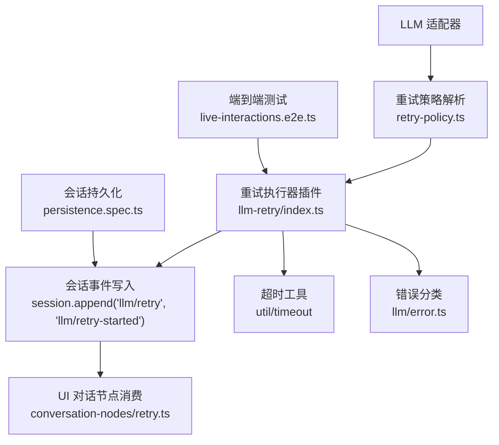
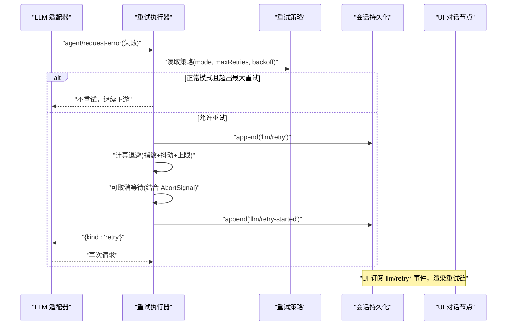
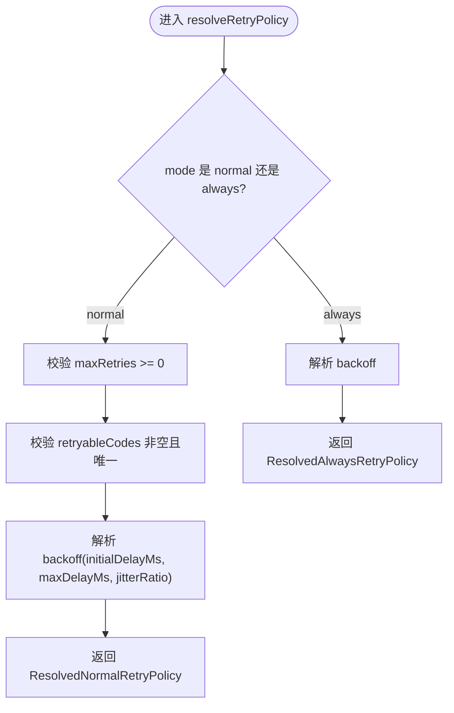
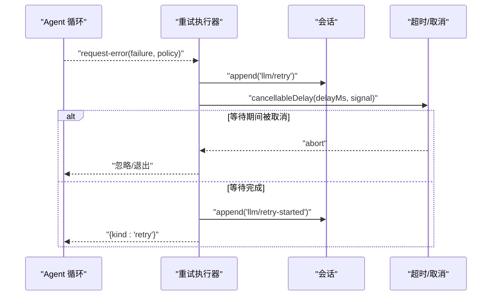
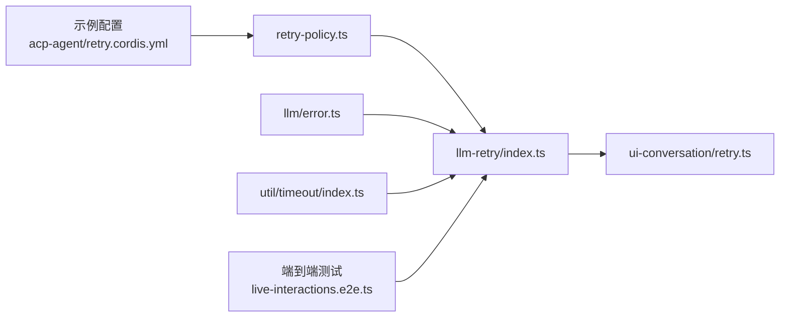

# 重试和故障处理

<cite>
**本文引用的文件**
- [packages/llm/llm/src/retry-policy.ts](file://packages/llm/llm/src/retry-policy.ts)
- [packages/llm/llm-retry/src/index.ts](file://packages/llm/llm-retry/src/index.ts)
- [packages/llm/llm/src/error.ts](file://packages/llm/llm/src/error.ts)
- [packages/client/ui-conversation/src/client/conversation-nodes/retry.ts](file://packages/client/ui-conversation/src/client/conversation-nodes/retry.ts)
- [examples/acp-agent/retry.cordis.yml](file://examples/acp-agent/retry.cordis.yml)
- [examples/headless-agent/retry.cordis.snapshot.yml](file://examples/headless-agent/retry.cordis.snapshot.yml)
- [packages/util/timeout/src/index.ts](file://packages/util/timeout/src/index.ts)
- [apps/web/tests/live-interactions.e2e.ts](file://apps/web/tests/live-interactions.e2e.ts)
- [packages/session/session-persistence/tests/persistence.spec.ts](file://packages/session/session-persistence/tests/persistence.spec.ts)
</cite>

## 目录
1. [简介](#简介)
2. [项目结构](#项目结构)
3. [核心组件](#核心组件)
4. [架构总览](#架构总览)
5. [详细组件分析](#详细组件分析)
6. [依赖关系分析](#依赖关系分析)
7. [性能考虑](#性能考虑)
8. [故障排除指南](#故障排除指南)
9. [结论](#结论)
10. [附录](#附录)

## 简介
本文件系统性说明 DeepSeek Harness 中的智能重试与故障处理机制，覆盖指数退避、抖动、并发控制、熔断式保护、错误分类（网络错误、API 限制、业务错误）、重试历史与状态持久化、故障转移与负载均衡策略、配置最佳实践与性能调优，并提供实际场景示例与排障指引。

## 项目结构
围绕重试与故障处理的关键代码分布在以下模块：
- LLM 重试策略定义与解析：packages/llm/llm/src/retry-policy.ts
- 重试执行器（插件）：packages/llm/llm-retry/src/index.ts
- 错误分类与常量：packages/llm/llm/src/error.ts
- UI 侧重试节点展示：packages/client/ui-conversation/src/client/conversation-nodes/retry.ts
- 超时工具库：packages/util/timeout/src/index.ts
- 端到端测试用例：apps/web/tests/live-interactions.e2e.ts
- 会话持久化与协调：packages/session/session-persistence/tests/persistence.spec.ts
- 示例配置：examples/acp-agent/retry.cordis.yml、examples/headless-agent/retry.cordis.snapshot.yml

图表来源
- [packages/llm/llm/src/retry-policy.ts:1-192](file://packages/llm/llm/src/retry-policy.ts#L1-L192)
- [packages/llm/llm-retry/src/index.ts:1-227](file://packages/llm/llm-retry/src/index.ts#L1-L227)
- [packages/llm/llm/src/error.ts:1-164](file://packages/llm/llm/src/error.ts#L1-L164)
- [packages/client/ui-conversation/src/client/conversation-nodes/retry.ts:1-98](file://packages/client/ui-conversation/src/client/conversation-nodes/retry.ts#L1-L98)
- [packages/util/timeout/src/index.ts:1-31](file://packages/util/timeout/src/index.ts#L1-L31)
- [apps/web/tests/live-interactions.e2e.ts:159-237](file://apps/web/tests/live-interactions.e2e.ts#L159-L237)
- [packages/session/session-persistence/tests/persistence.spec.ts:178-206](file://packages/session/session-persistence/tests/persistence.spec.ts#L178-L206)

章节来源
- [packages/llm/llm/src/retry-policy.ts:1-192](file://packages/llm/llm/src/retry-policy.ts#L1-L192)
- [packages/llm/llm-retry/src/index.ts:1-227](file://packages/llm/llm-retry/src/index.ts#L1-L227)
- [packages/llm/llm/src/error.ts:1-164](file://packages/llm/llm/src/error.ts#L1-L164)
- [packages/client/ui-conversation/src/client/conversation-nodes/retry.ts:1-98](file://packages/client/ui-conversation/src/client/conversation-nodes/retry.ts#L1-L98)
- [packages/util/timeout/src/index.ts:1-31](file://packages/util/timeout/src/index.ts#L1-L31)
- [apps/web/tests/live-interactions.e2e.ts:159-237](file://apps/web/tests/live-interactions.e2e.ts#L159-L237)
- [packages/session/session-persistence/tests/persistence.spec.ts:178-206](file://packages/session/session-persistence/tests/persistence.spec.ts#L178-L206)

## 核心组件
- 重试策略解析器：负责校验、默认值填充与冻结不可变策略对象，支持“normal”（有界）与“always”（无界）两种模式，并统一解析退避参数。
- 重试执行器插件：挂载到 agent 的 request-error 扩展点，按策略进行可取消的指数退避等待，记录重试事件，决定是否重试或继续下游。
- 错误分类：提供稳定的错误码与识别函数，区分上下文溢出、配额耗尽、空响应等，为是否可重试提供依据。
- UI 重试节点：消费 llm/retry 与 llm/retry-started 事件，构建可追踪的重试链视图。
- 超时工具：提供统一的超时与信号融合能力，确保重试等待可被取消且不会超过系统定时器上限。

章节来源
- [packages/llm/llm/src/retry-policy.ts:14-192](file://packages/llm/llm/src/retry-policy.ts#L14-L192)
- [packages/llm/llm-retry/src/index.ts:58-227](file://packages/llm/llm-retry/src/index.ts#L58-L227)
- [packages/llm/llm/src/error.ts:24-100](file://packages/llm/llm/src/error.ts#L24-L100)
- [packages/client/ui-conversation/src/client/conversation-nodes/retry.ts:16-98](file://packages/client/ui-conversation/src/client/conversation-nodes/retry.ts#L16-L98)
- [packages/util/timeout/src/index.ts:12-31](file://packages/util/timeout/src/index.ts#L12-L31)

## 架构总览
重试流程从 LLM 适配器抛出失败开始，经重试执行器根据策略计算退避时间，写入会话事件后进入可取消等待；等待结束后触发下一次尝试，直至成功、达到最大重试次数或被取消。

图表来源
- [packages/llm/llm-retry/src/index.ts:156-208](file://packages/llm/llm-retry/src/index.ts#L156-L208)
- [packages/llm/llm/src/retry-policy.ts:145-192](file://packages/llm/llm/src/retry-policy.ts#L145-L192)
- [packages/client/ui-conversation/src/client/conversation-nodes/retry.ts:41-88](file://packages/client/ui-conversation/src/client/conversation-nodes/retry.ts#L41-L88)

## 详细组件分析

### 重试策略解析（指数退避与抖动）
- 支持两种模式：
  - normal：仅对配置的“可重试错误码”进行有界重试，最多 maxRetries 次。
  - always：对所有模型请求失败进行无界重试，直到成功、取消或插件销毁。
- 退避参数：
  - initialDelayMs：初始延迟（毫秒）。
  - maxDelayMs：最大延迟（毫秒），用于限制本地指数增长与接受的 provider 建议延迟。
  - jitterRatio：对称抖动比例，范围 [0,1]，避免雪崩。
- 默认可重试错误码包含：空响应、速率限制、服务端错误、超时、传输错误。
- 策略对象在注册时冻结，保证线程安全与不可变性。

图表来源
- [packages/llm/llm/src/retry-policy.ts:145-192](file://packages/llm/llm/src/retry-policy.ts#L145-L192)

章节来源
- [packages/llm/llm/src/retry-policy.ts:14-192](file://packages/llm/llm/src/retry-policy.ts#L14-L192)

### 重试执行器（并发控制、可取消等待、历史记录）
- 监听 agent/request-error 事件，按策略决定是否重试。
- 并发控制：维护 active Set 跟踪当前活跃的重试操作，插件销毁时中止所有并等待完成。
- 可取消等待：使用 AbortSignal.any 融合外部取消与插件生命周期，确保等待可中断。
- 历史记录：每次退避前写入 llm/retry，开始重试前写入 llm/retry-started，供 UI 与审计使用。
- Provider 建议延迟：若失败携带 providerRetryAfterMs 且在策略上限内，优先使用该值；否则采用本地指数退避。

图表来源
- [packages/llm/llm-retry/src/index.ts:78-154](file://packages/llm/llm-retry/src/index.ts#L78-L154)
- [packages/llm/llm-retry/src/index.ts:156-208](file://packages/llm/llm-retry/src/index.ts#L156-L208)

章节来源
- [packages/llm/llm-retry/src/index.ts:99-227](file://packages/llm/llm-retry/src/index.ts#L99-L227)

### 错误分类与熔断式保护
- 稳定错误码：如 CONTEXT_WINDOW_EXCEEDED、QUOTA、EMPTY_RESPONSE、RATE_LIMIT、SERVER、TIMEOUT、TRANSPORT 等。
- 语义识别：
  - isContextWindowExceededError：识别上下文窗口超限。
  - isQuotaExceededError：识别账户配额/余额/额度耗尽（终端错误，不应重试）。
- 熔断式保护：
  - normal 模式下，若 provider 建议的 Retry-After 超过策略 maxDelayMs，则直接放弃重试，避免长时间阻塞。
  - always 模式下，即使超过上限也回退到本地退避，但仍受 maxDelayMs 约束。

章节来源
- [packages/llm/llm/src/error.ts:24-100](file://packages/llm/llm/src/error.ts#L24-L100)
- [packages/llm/llm-retry/src/index.ts:194-205](file://packages/llm/llm-retry/src/index.ts#L194-L205)

### UI 重试链可视化
- 消费 llm/retry 与 llm/retry-started 事件，聚合同一 RetryId 的重试尝试，形成“已计划/已开始/已取消”的状态机。
- 当所属 step/turn 关闭时，仍在等待的尝试会被标记为“已取消”，提升可观测性。

章节来源
- [packages/client/ui-conversation/src/client/conversation-nodes/retry.ts:16-98](file://packages/client/ui-conversation/src/client/conversation-nodes/retry.ts#L16-L98)

### 超时与取消
- 通过 util/timeout 提供的 MAX_TIMER_DELAY_MS 与 deadline/idleWatchdog 等原语，确保所有等待与超时行为一致且可分类。
- 重试等待使用可取消延迟，避免悬挂任务。

章节来源
- [packages/util/timeout/src/index.ts:12-31](file://packages/util/timeout/src/index.ts#L12-L31)
- [packages/llm/llm-retry/src/index.ts:78-91](file://packages/llm/llm-retry/src/index.ts#L78-L91)

## 依赖关系分析
- retry-policy.ts 被 llm-retry 插件消费以获取策略。
- error.ts 的错误码与识别函数被适配器与重试逻辑共同依赖。
- UI 层依赖 llm-retry 产生的事件来渲染重试链。
- 测试与示例通过 Cordis 配置注入 retryPolicy，验证端到端行为。

图表来源
- [packages/llm/llm/src/retry-policy.ts:145-192](file://packages/llm/llm/src/retry-policy.ts#L145-L192)
- [packages/llm/llm-retry/src/index.ts:99-227](file://packages/llm/llm-retry/src/index.ts#L99-L227)
- [packages/llm/llm/src/error.ts:24-100](file://packages/llm/llm/src/error.ts#L24-L100)
- [packages/client/ui-conversation/src/client/conversation-nodes/retry.ts:41-88](file://packages/client/ui-conversation/src/client/conversation-nodes/retry.ts#L41-L88)
- [packages/util/timeout/src/index.ts:12-31](file://packages/util/timeout/src/index.ts#L12-L31)
- [examples/acp-agent/retry.cordis.yml:1-41](file://examples/acp-agent/retry.cordis.yml#L1-L41)
- [apps/web/tests/live-interactions.e2e.ts:159-237](file://apps/web/tests/live-interactions.e2e.ts#L159-L237)

## 性能考虑
- 指数退避 + 抖动：降低突发重试导致的雪崩风险，提高整体稳定性。
- 最大延迟上限：防止单次等待过长影响用户体验与资源占用。
- 并发控制：active Set 限制同时进行的恢复操作数量，避免资源竞争。
- 可取消等待：及时释放资源，减少无效等待。
- Provider 建议延迟优先：尊重上游限流提示，减少无效重试。
- 配置建议：
  - 将 initialDelayMs 设置为较小值以快速探测恢复，maxDelayMs 设置合理上限。
  - jitterRatio 建议 0.1~0.3，平衡抖动与确定性。
  - normal 模式下 maxRetries 通常 2~3 即可；always 模式需谨慎使用并结合监控。
  - 对配额耗尽类错误不要加入 retryableCodes，避免无限重试。

[本节为通用指导，无需特定文件引用]

## 故障排除指南
- 现象：AUTH 失败未重试
  - 原因：AUTH 不在默认可重试集合中，属于终端认证错误。
  - 排查：检查错误码与 retryableCodes 配置。
  - 参考：端到端测试断言 AUTH 不产生重试事件。
- 现象：429 速率限制被正确识别并重试
  - 原因：RATE_LIMIT 在默认可重试集合中，且会尊重 providerRetryAfterMs。
  - 参考：适配器测试中对 429 的分类与处理。
- 现象：上下文超限不重试
  - 原因：CONTEXT_WINDOW_EXCEEDED 属于终端错误，不应重试。
  - 参考：错误分类函数与默认策略。
- 现象：provider 建议的 Retry-After 过大导致不重试
  - 原因：超过策略 maxDelayMs，normal 模式直接放弃重试。
  - 参考：执行器中对 providerRetryAfterMs 的处理逻辑。
- 现象：UI 显示“已取消”的重试
  - 原因：所属 step/turn 已关闭，等待中的重试被取消。
  - 参考：UI 重试节点的状态转换。

章节来源
- [apps/web/tests/live-interactions.e2e.ts:159-237](file://apps/web/tests/live-interactions.e2e.ts#L159-L237)
- [packages/llm/llm/src/error.ts:24-100](file://packages/llm/llm/src/error.ts#L24-L100)
- [packages/llm/llm-retry/src/index.ts:194-205](file://packages/llm/llm-retry/src/index.ts#L194-L205)
- [packages/client/ui-conversation/src/client/conversation-nodes/retry.ts:61-88](file://packages/client/ui-conversation/src/client/conversation-nodes/retry.ts#L61-L88)

## 结论
DeepSeek Harness 的重试与故障处理以“策略解析 + 执行器插件 + 错误分类 + 可取消等待 + 会话事件持久化”为核心，提供了可控、可观测、可扩展的重试能力。通过 normal/always 双模式、指数退避与抖动、并发控制与熔断式保护，兼顾了可靠性与性能。配合 UI 重试链与端到端测试，便于定位问题与验证行为。

[本节为总结，无需特定文件引用]

## 附录

### 配置示例与最佳实践
- 示例配置：
  - acp-agent 示例通过 overlay 将 retryPolicy 设置为 normal，maxRetries=2，并固定退避为 1ms、零抖动，便于快照复现。
  - headless-agent 示例通过替换后端实现进行快照测试。
- 最佳实践：
  - 仅在 transient 错误上启用重试；配额耗尽、上下文超限、认证错误等终端错误不应重试。
  - 合理设置 initialDelayMs 与 maxDelayMs，避免过短导致压力过大或过长影响体验。
  - 使用 jitterRatio 引入抖动，避免多实例同步重试。
  - 在生产环境谨慎使用 always 模式，需配合监控与告警。

章节来源
- [examples/acp-agent/retry.cordis.yml:1-41](file://examples/acp-agent/retry.cordis.yml#L1-L41)
- [examples/headless-agent/retry.cordis.snapshot.yml:1-13](file://examples/headless-agent/retry.cordis.snapshot.yml#L1-L13)

### 重试历史与状态持久化
- 事件写入：
  - llm/retry：记录一次退避计划，包含 turn、step、provider、policyKey、retry、delayMs、failure 等。
  - llm/retry-started：记录一次实际重试的开始。
- 持久化保障：
  - 会话持久化层在冷加载与修复过程中保持事件顺序与一致性，确保重试历史可回放与审计。
- 可观测性：
  - UI 消费事件渲染重试链，辅助用户理解重试过程与结果。

章节来源
- [packages/llm/llm-retry/src/index.ts:126-153](file://packages/llm/llm-retry/src/index.ts#L126-L153)
- [packages/session/session-persistence/tests/persistence.spec.ts:178-206](file://packages/session/session-persistence/tests/persistence.spec.ts#L178-L206)
- [packages/client/ui-conversation/src/client/conversation-nodes/retry.ts:41-88](file://packages/client/ui-conversation/src/client/conversation-nodes/retry.ts#L41-L88)

### 故障转移与负载均衡策略
- 故障转移：
  - 当前重试机制在同一 provider 路由内进行恢复；跨 provider 的故障转移由上层编排决定，不在重试插件范围内。
- 负载均衡：
  - 重试不改变请求路由；如需基于健康状态的负载分发，应在适配器或网关层实现。
- 建议：
  - 在多 provider 场景中，结合健康检查与权重分配，将失败请求路由至备用 provider。
  - 对关键路径启用更严格的熔断与降级策略，避免级联失败。

[本节为概念性说明，无需特定文件引用]