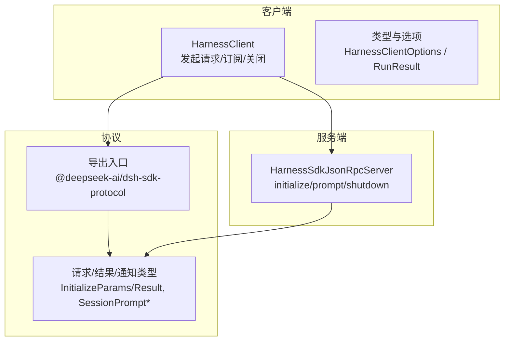
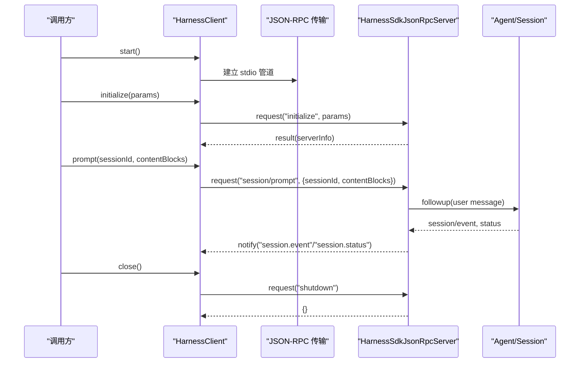
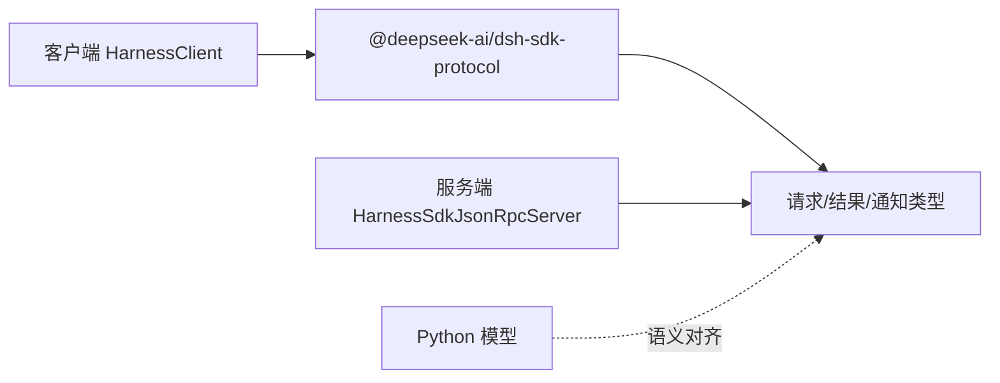

# API 参考

<cite>
**本文引用的文件**
- [packages/sdk/protocol/src/types.ts](file://packages/sdk/protocol/src/types.ts)
- [packages/sdk/protocol/src/index.ts](file://packages/sdk/protocol/src/index.ts)
- [packages/sdk/server/src/server.ts](file://packages/sdk/server/src/server.ts)
- [packages/sdk/client/src/client.ts](file://packages/sdk/client/src/client.ts)
- [packages/sdk/client/src/types.ts](file://packages/sdk/client/src/types.ts)
- [python/sdk/src/deepseek_harness/models.py](file://python/sdk/src/deepseek_harness/models.py)
- [packages/api/gateway/src/types.ts](file://packages/api/gateway/src/types.ts)
- [packages/code-runtime/code-runtime/src/index.ts](file://packages/code-runtime/code-runtime/src/index.ts)
- [packages/code-runtime/code-runtime-worker-thread/src/bootstrap.ts](file://packages/code-runtime/code-runtime-worker-thread/src/bootstrap.ts)
- [packages/code-runtime/code-runtime/src/types.ts](file://packages/code-runtime/code-runtime/src/types.ts)
</cite>

## 目录
1. [简介](#简介)
2. [项目结构](#项目结构)
3. [核心组件](#核心组件)
4. [架构总览](#架构总览)
5. [详细组件分析](#详细组件分析)
6. [依赖关系分析](#依赖关系分析)
7. [性能注意事项](#性能注意事项)
8. [故障排查指南](#故障排查指南)
9. [结论](#结论)
10. [附录](#附录)

## 简介
本 API 参考文档面向 DeepSeek Harness SDK 的运行时协议、客户端与服务端接口，以及跨语言数据模型与错误处理机制。内容覆盖：
- 公共类、方法、属性与事件
- 参数说明、返回值类型与使用示例（以路径引用形式提供）
- 核心数据结构定义（IncomingRequest、InitializeResponse、Notification 等）
- 异常类型与错误处理契约
- 类型注解与接口契约
- 函数签名与参数校验规则
- 向后兼容性与废弃警告

## 项目结构
DeepSeek Harness SDK 由三部分组成：
- 协议层：定义跨进程 JSON-RPC 请求/响应/通知的数据形状与方法名映射
- 服务端：在宿主上下文中实现协议，管理会话、代理与子代理生命周期
- 客户端：启动并驱动外部进程，维护订阅流、超时与关闭流程

**图表来源**
- [packages/sdk/protocol/src/index.ts:1-26](file://packages/sdk/protocol/src/index.ts#L1-L26)
- [packages/sdk/protocol/src/types.ts:15-105](file://packages/sdk/protocol/src/types.ts#L15-L105)
- [packages/sdk/client/src/client.ts:184-474](file://packages/sdk/client/src/client.ts#L184-L474)
- [packages/sdk/server/src/server.ts:53-241](file://packages/sdk/server/src/server.ts#L53-L241)

**章节来源**
- [packages/sdk/protocol/src/index.ts:1-26](file://packages/sdk/protocol/src/index.ts#L1-L26)
- [packages/sdk/protocol/src/types.ts:15-105](file://packages/sdk/protocol/src/types.ts#L15-L105)
- [packages/sdk/client/src/client.ts:184-474](file://packages/sdk/client/src/client.ts#L184-L474)
- [packages/sdk/server/src/server.ts:53-241](file://packages/sdk/server/src/server.ts#L53-L241)

## 核心组件
- 协议类型与映射
  - 请求/结果：initialize、session/prompt、shutdown
  - 通知：session.event、session.status、subagent.started、subagent.finished
- 客户端 HarnessClient
  - 启动子进程、发送请求、订阅通知、超时控制、优雅关闭
- 服务端 HarnessSdkJsonRpcServer
  - 握手 initialize、排队 prompt、关闭 shutdown、事件转发
- Python 侧数据模型
  - Notification、IncomingRequest、ServerInfo、InitializeResponse

**章节来源**
- [packages/sdk/protocol/src/types.ts:15-105](file://packages/sdk/protocol/src/types.ts#L15-L105)
- [packages/sdk/client/src/client.ts:184-474](file://packages/sdk/client/src/client.ts#L184-L474)
- [packages/sdk/server/src/server.ts:53-241](file://packages/sdk/server/src/server.ts#L53-L241)
- [python/sdk/src/deepseek_harness/models.py:1-33](file://python/sdk/src/deepseek_harness/models.py#L1-L33)

## 架构总览
SDK 通过 JSON-RPC over stdio 进行通信。客户端负责进程生命周期与消息路由；服务端负责会话创建、代理调用与事件广播。

**图表来源**
- [packages/sdk/client/src/client.ts:203-275](file://packages/sdk/client/src/client.ts#L203-L275)
- [packages/sdk/server/src/server.ts:111-143](file://packages/sdk/server/src/server.ts#L111-L143)
- [packages/sdk/protocol/src/types.ts:15-105](file://packages/sdk/protocol/src/types.ts#L15-L105)

## 详细组件分析

### 协议类型与接口契约
- 请求/结果
  - initialize: InitializeParams -> InitializeResult
  - session/prompt: SessionPromptParams -> SessionPromptResult
  - shutdown: undefined -> Record<string, never>
- 通知
  - session.event: SessionEventNotification
  - session.status: SessionStatusNotification
  - subagent.started: SubagentStartedNotification
  - subagent.finished: SubagentFinishedNotification

关键字段说明（节选）：
- InitializeParams.cwd/provider/model/maxTokens
- InitializeResult.serverInfo.name/version
- SessionPromptParams.sessionId/contentBlocks
- SessionPromptResult.messageId
- SubagentFinishedNotification.status(stopReason 映射为 ok/error)

**章节来源**
- [packages/sdk/protocol/src/types.ts:15-105](file://packages/sdk/protocol/src/types.ts#L15-L105)
- [packages/sdk/protocol/src/index.ts:11-25](file://packages/sdk/protocol/src/index.ts#L11-L25)

### 客户端 HarnessClient
- 主要能力
  - start(): 启动子进程与传输
  - initialize(params): 握手，返回 serverInfo
  - prompt(sessionId, contentBlocks): 入队用户消息，返回 messageId
  - subscribe(filter?): 订阅通知流
  - subscribeSessionTree(sessionId): 按父子关系过滤子代理树通知
  - request(method, params?, timeoutMs?): 通用请求封装
  - close(): 优雅关闭（shutdown + EOF/SIGTERM/SIGKILL）
- 自定义异常
  - TransportClosedError: 传输关闭或进程不可用
  - RequestTimeoutError: 请求超时
  - SdkProtocolError: 协议违规（如缺少必需字段）
- 超时与取消
  - requestTimeoutMs: 每请求超时；内部使用 AbortController 放弃等待
- 关闭流程
  - 先尝试 protocol shutdown，再执行 EOF → SIGTERM → SIGKILL 阶梯式终止

使用示例（以路径引用代替代码片段）：
- 初始化与握手：[packages/sdk/client/src/client.ts:268-275](file://packages/sdk/client/src/client.ts#L268-L275)
- 提交提示并获取 messageId：[packages/sdk/client/src/client.ts:283-290](file://packages/sdk/client/src/client.ts#L283-L290)
- 订阅通知流：[packages/sdk/client/src/client.ts:342-352](file://packages/sdk/client/src/client.ts#L342-L352)
- 按会话树过滤通知：[packages/sdk/client/src/client.ts:361-372](file://packages/sdk/client/src/client.ts#L361-L372)
- 优雅关闭：[packages/sdk/client/src/client.ts:380-401](file://packages/sdk/client/src/client.ts#L380-L401)

**章节来源**
- [packages/sdk/client/src/client.ts:184-474](file://packages/sdk/client/src/client.ts#L184-L474)
- [packages/sdk/client/src/types.ts:22-71](file://packages/sdk/client/src/types.ts#L22-L71)

### 服务端 HarnessSdkJsonRpcServer
- 主要能力
  - initialize(params): 校验 maxTokens，设置 cwd/provider/model，按需挂载 LLM 适配器，返回 serverInfo
  - prompt(params): 查找或创建会话，验证代理存活，构造用户消息并 followup
  - shutdown(): 幂等关闭，清理会话、监听器与可选适配器
  - handleRequest(method, params): 分派到具体处理器，未知方法抛出错误
- 事件转发
  - 将宿主 session/event、agent/status、session/created、subagent/end 转换为协议通知
- 状态映射
  - successStatus(reason, options): 将 stopReason 映射为 'ok'/'error'，支持将 max-tokens 视为成功

使用示例（以路径引用代替代码片段）：
- 握手与配置：[packages/sdk/server/src/server.ts:111-125](file://packages/sdk/server/src/server.ts#L111-L125)
- 提示入队：[packages/sdk/server/src/server.ts:132-143](file://packages/sdk/server/src/server.ts#L132-L143)
- 关闭流程：[packages/sdk/server/src/server.ts:150-181](file://packages/sdk/server/src/server.ts#L150-L181)
- 请求分派：[packages/sdk/server/src/server.ts:190-201](file://packages/sdk/server/src/server.ts#L190-L201)

**章节来源**
- [packages/sdk/server/src/server.ts:53-241](file://packages/sdk/server/src/server.ts#L53-L241)

### Python 数据模型
- Notification: method, payload
- IncomingRequest: id, method, payload
- ServerInfo: name, version
- InitializeResponse: serverInfo

这些模型用于 Python SDK 侧对 JSON-RPC 载荷的结构化描述。

**章节来源**
- [python/sdk/src/deepseek_harness/models.py:1-33](file://python/sdk/src/deepseek_harness/models.py#L1-L33)

### 网关与远程调用（Typert Gateway）
- InvokeRemoteRequest: namespace, method, args, signal?
- TypertGatewayErrorCode: 基础设施与边界失败码集合
- TypertGateway.invoke(request): 调用远端服务方法，失败时抛出结构化错误

适用场景：Host 侧通过网关统一调度远程服务，错误码稳定且可路由。

**章节来源**
- [packages/api/gateway/src/types.ts:6-47](file://packages/api/gateway/src/types.ts#L6-L47)

### 代码运行时的错误成员约束
- RESERVED_ERROR_MEMBERS: 所有后端拒绝的错误成员名集合（JS Error 与 Python 异常协议成员）
- DUNDER_MEMBER: 拒绝 dunder 形式的成员名
- CodeBindingErrorClass: 绑定命名空间的可抛错类型声明（name, memberNameProperty）
- 注入错误构造函数：makeBindingErrorClasses 为每个命名空间构建唯一构造函数，保证 instanceof 一致

用途：确保跨后端一致的异常契约，避免危险成员名污染。

**章节来源**
- [packages/code-runtime/code-runtime/src/index.ts:45-64](file://packages/code-runtime/code-runtime/src/index.ts#L45-L64)
- [packages/code-runtime/code-runtime/src/types.ts:23-40](file://packages/code-runtime/code-runtime/src/types.ts#L23-L40)
- [packages/code-runtime/code-runtime-worker-thread/src/bootstrap.ts:240-275](file://packages/code-runtime/code-runtime-worker-thread/src/bootstrap.ts#L240-L275)

## 依赖关系分析
- 客户端依赖协议导出，调用服务端暴露的方法
- 服务端依赖宿主上下文与 LLM 插件，将内部事件桥接到协议通知
- Python 模型与 TS 协议保持语义对齐（名称与字段约定）

**图表来源**
- [packages/sdk/protocol/src/index.ts:11-25](file://packages/sdk/protocol/src/index.ts#L11-L25)
- [packages/sdk/protocol/src/types.ts:15-105](file://packages/sdk/protocol/src/types.ts#L15-L105)
- [packages/sdk/client/src/client.ts:184-474](file://packages/sdk/client/src/client.ts#L184-L474)
- [packages/sdk/server/src/server.ts:53-241](file://packages/sdk/server/src/server.ts#L53-L241)
- [python/sdk/src/deepseek_harness/models.py:1-33](file://python/sdk/src/deepseek_harness/models.py#L1-L33)

**章节来源**
- [packages/sdk/protocol/src/index.ts:11-25](file://packages/sdk/protocol/src/index.ts#L11-L25)
- [packages/sdk/protocol/src/types.ts:15-105](file://packages/sdk/protocol/src/types.ts#L15-L105)
- [packages/sdk/client/src/client.ts:184-474](file://packages/sdk/client/src/client.ts#L184-L474)
- [packages/sdk/server/src/server.ts:53-241](file://packages/sdk/server/src/server.ts#L53-L241)
- [python/sdk/src/deepseek_harness/models.py:1-33](file://python/sdk/src/deepseek_harness/models.py#L1-L33)

## 性能注意事项
- 请求超时：合理设置 requestTimeoutMs，避免长时间阻塞；超时会放弃等待但服务端仍可能继续运行直至结束
- 关闭策略：close() 采用 EOF → SIGTERM → SIGKILL 阶梯，建议根据业务调整 disposeEofGraceMs 与 disposeGraceMs
- 会话复用：prompt 会复用已有会话记录，减少重复创建开销
- 事件风暴：大量 session.event 时建议使用 subscribeSessionTree 缩小范围，降低处理压力

[本节为通用指导，不直接分析具体文件]

## 故障排查指南
常见错误与定位要点：
- TransportClosedError
  - 触发条件：进程退出、stdio 关闭、spawn 失败、已关闭后重试
  - 诊断信息：包含 spawn error、exit code、stderr tail
  - 参考位置：[packages/sdk/client/src/client.ts:38-44](file://packages/sdk/client/src/client.ts#L38-L44), [packages/sdk/client/src/client.ts:451-457](file://packages/sdk/client/src/client.ts#L451-L457)
- RequestTimeoutError
  - 触发条件：超过 requestTimeoutMs
  - 行为：放弃等待，服务端任务可能仍在运行
  - 参考位置：[packages/sdk/client/src/client.ts:46-53](file://packages/sdk/client/src/client.ts#L46-L53), [packages/sdk/client/src/client.ts:318-326](file://packages/sdk/client/src/client.ts#L318-L326)
- SdkProtocolError
  - 触发条件：服务端响应不符合协议（如缺少 serverInfo/messageId）
  - 参考位置：[packages/sdk/client/src/client.ts:55-65](file://packages/sdk/client/src/client.ts#L55-L65), [packages/sdk/client/src/client.ts:268-290](file://packages/sdk/client/src/client.ts#L268-L290)
- 服务端未知方法
  - 触发条件：调用未注册方法
  - 参考位置：[packages/sdk/server/src/server.ts:190-201](file://packages/sdk/server/src/server.ts#L190-L201)
- 绑定错误成员非法
  - 触发条件：memberNameProperty 为保留名或 dunder 形式
  - 参考位置：[packages/code-runtime/code-runtime/src/index.ts:45-64](file://packages/code-runtime/code-runtime/src/index.ts#L45-L64), [packages/code-runtime/code-runtime-worker-thread/src/bootstrap.ts:240-275](file://packages/code-runtime/code-runtime-worker-thread/src/bootstrap.ts#L240-L275)

**章节来源**
- [packages/sdk/client/src/client.ts:38-65](file://packages/sdk/client/src/client.ts#L38-L65)
- [packages/sdk/client/src/client.ts:268-290](file://packages/sdk/client/src/client.ts#L268-L290)
- [packages/sdk/server/src/server.ts:190-201](file://packages/sdk/server/src/server.ts#L190-L201)
- [packages/code-runtime/code-runtime/src/index.ts:45-64](file://packages/code-runtime/code-runtime/src/index.ts#L45-L64)
- [packages/code-runtime/code-runtime-worker-thread/src/bootstrap.ts:240-275](file://packages/code-runtime/code-runtime-worker-thread/src/bootstrap.ts#L240-L275)

## 结论
本参考文档梳理了 DeepSeek Harness SDK 的核心 API 与数据契约，涵盖协议类型、客户端/服务端实现、Python 模型与错误处理机制。遵循本文档的类型与错误约定，可实现稳定、可观测、可回放的跨进程交互。

[本节为总结性内容，不直接分析具体文件]

## 附录

### 函数签名与参数校验规则（摘要）
- initialize(params)
  - 参数：cwd(string)、provider(string)、model(string)、maxTokens?(positive safe integer)
  - 校验：maxTokens 必须为正安全整数；否则抛出 TypeError
  - 返回：serverInfo{name, version}
  - 参考：[packages/sdk/server/src/server.ts:111-125](file://packages/sdk/server/src/server.ts#L111-L125)
- prompt(sessionId, contentBlocks)
  - 参数：sessionId(string)、contentBlocks(ContentBlock[])
  - 行为：创建或复用会话，构造用户消息并 followup
  - 返回：messageId(string)
  - 参考：[packages/sdk/server/src/server.ts:132-143](file://packages/sdk/server/src/server.ts#L132-L143)
- request(method, params?, timeoutMs?)
  - 行为：封装 JSON-RPC 请求，支持超时与取消
  - 异常：TransportClosedError、RequestTimeoutError、SdkProtocolError、JsonRpcResponseError
  - 参考：[packages/sdk/client/src/client.ts:301-333](file://packages/sdk/client/src/client.ts#L301-L333)
- close()
  - 行为：protocol shutdown + EOF/SIGTERM/SIGKILL 阶梯关闭
  - 参考：[packages/sdk/client/src/client.ts:380-401](file://packages/sdk/client/src/client.ts#L380-L401)

### 向后兼容性与废弃警告
- 协议稳定性
  - serverInfo.name 保持 wire-stable 标识符
  - 新增字段需保持可选，避免破坏旧客户端解析
- 废弃策略
  - 移除公开事件或方法前需提供迁移路径与替代方案
  - 错误码扩展应向后兼容，禁止重定义既有码含义

[本节为通用规范说明，不直接分析具体文件]