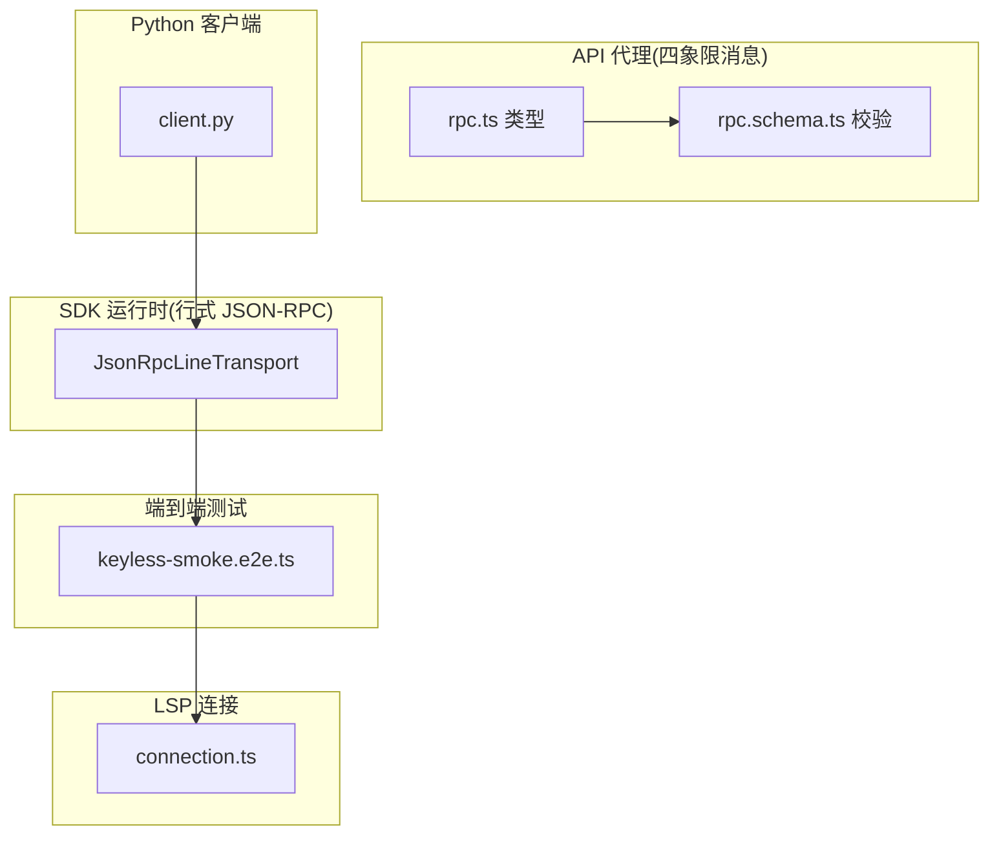
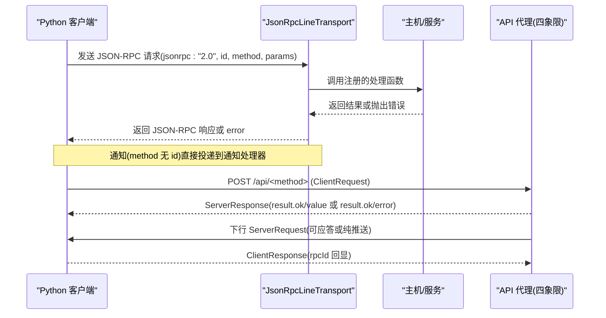
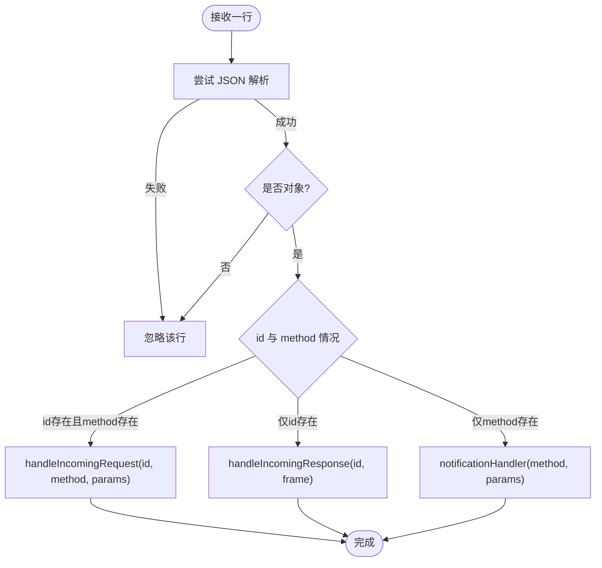
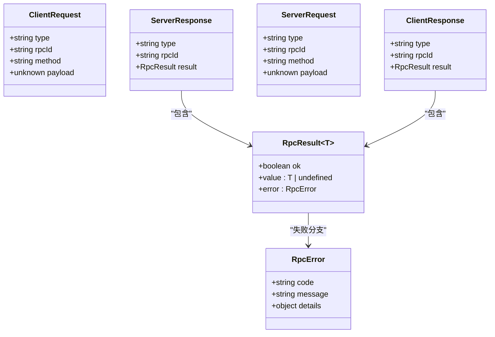
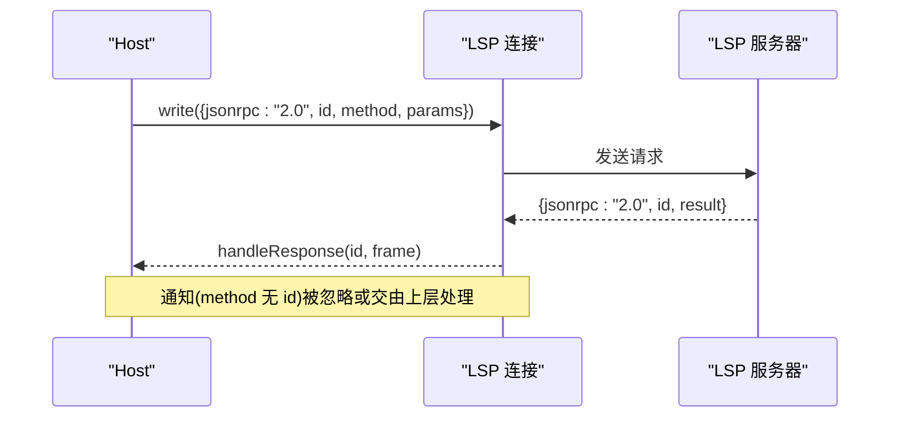
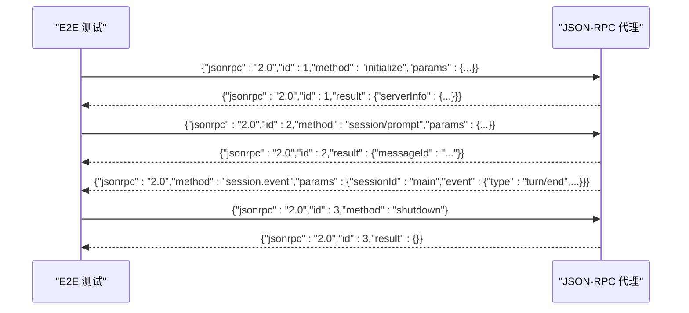
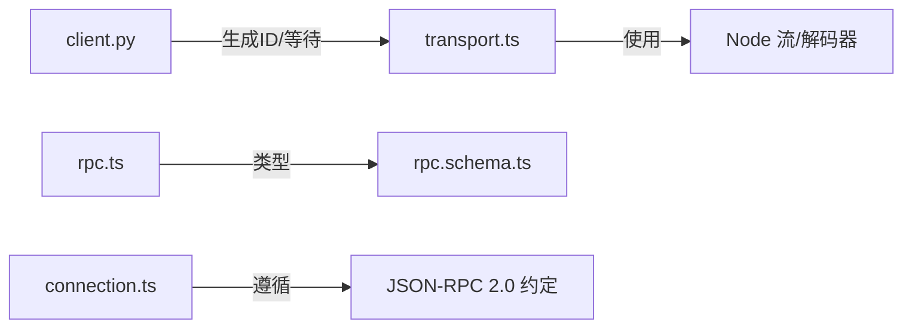

# 协议规范

<cite>
**本文引用的文件**
- [packages/host/apiproxy/src/api/rpc.ts](file://packages/host/apiproxy/src/api/rpc.ts)
- [packages/host/apiproxy/src/api/rpc.schema.ts](file://packages/host/apiproxy/src/api/rpc.schema.ts)
- [packages/sdk/protocol/src/transport.ts](file://packages/sdk/protocol/src/transport.ts)
- [python/sdk/src/deepseek_harness/client.py](file://python/sdk/src/deepseek_harness/client.py)
- [examples/jsonrpc-agent/tests/keyless-smoke.e2e.ts](file://examples/jsonrpc-agent/tests/keyless-smoke.e2e.ts)
- [packages/lsp/lsp-stdio/src/connection.ts](file://packages/lsp/lsp-stdio/src/connection.ts)
</cite>

## 目录
1. [简介](#简介)
2. [项目结构](#项目结构)
3. [核心组件](#核心组件)
4. [架构总览](#架构总览)
5. [详细组件分析](#详细组件分析)
6. [依赖关系分析](#依赖关系分析)
7. [性能与可靠性](#性能与可靠性)
8. [故障排查指南](#故障排查指南)
9. [结论](#结论)
10. [附录：交互示例与版本兼容](#附录：交互示例与版本兼容)

## 简介
本规范定义了两套 JSON-RPC 通信模型，均基于 JSON-RPC 2.0 思想，但承载层与消息形态不同：
- 进程内/跨进程流式 JSON-RPC（行分隔 JSON）：用于 SDK 运行时、子进程等场景。请求-响应通过 id 关联；通知无 id；错误使用标准 error 对象。
- API 代理四象限消息模型（HTTP/SSE/WS 载体）：将“客户端→服务端”和“服务端→客户端”的请求/响应统一为四种消息类型，业务结果以 ok/value 或 ok/error 表达，并附带强校验的 schema。

本规范覆盖：
- 消息格式、字段定义与校验
- 请求-响应匹配、超时与取消
- 初始化握手、通知机制与错误传播
- 完整的成功/失败/异常交互流程
- 版本兼容性与扩展点

## 项目结构
围绕 JSON-RPC 的关键实现分布在以下模块：
- 四象限 RPC 类型与 schema：定义 ClientRequest/ServerResponse/ServerRequest/ClientResponse、RpcResult、RpcError 及 Zod 校验规则。
- 行式 JSON-RPC 传输：提供 JsonRpcLineTransport，负责帧解析、请求分发、响应匹配、通知处理与错误封装。
- Python SDK 客户端：构造 jsonrpc: "2.0" 请求，维护响应等待队列，支持通知订阅与超时。
- LSP 连接：展示另一种 JSON-RPC 2.0 用法（请求/响应/通知），便于理解通用模式。
- E2E 测试：演示 initialize/session/prompt/事件通知/shutdown 的端到端流程。



图表来源
- [packages/sdk/protocol/src/transport.ts:1-280](file://packages/sdk/protocol/src/transport.ts#L1-L280)
- [packages/host/apiproxy/src/api/rpc.ts:1-194](file://packages/host/apiproxy/src/api/rpc.ts#L1-L194)
- [packages/host/apiproxy/src/api/rpc.schema.ts:1-141](file://packages/host/apiproxy/src/api/rpc.schema.ts#L1-L141)
- [python/sdk/src/deepseek_harness/client.py:228-258](file://python/sdk/src/deepseek_harness/client.py#L228-L258)
- [packages/lsp/lsp-stdio/src/connection.ts:241-267](file://packages/lsp/lsp-stdio/src/connection.ts#L241-L267)
- [examples/jsonrpc-agent/tests/keyless-smoke.e2e.ts:103-169](file://examples/jsonrpc-agent/tests/keyless-smoke.e2e.ts#L103-L169)

章节来源
- [packages/host/apiproxy/src/api/rpc.ts:1-194](file://packages/host/apiproxy/src/api/rpc.ts#L1-L194)
- [packages/host/apiproxy/src/api/rpc.schema.ts:1-141](file://packages/host/apiproxy/src/api/rpc.schema.ts#L1-L141)
- [packages/sdk/protocol/src/transport.ts:1-280](file://packages/sdk/protocol/src/transport.ts#L1-L280)
- [python/sdk/src/deepseek_harness/client.py:228-258](file://python/sdk/src/deepseek_harness/client.py#L228-L258)
- [packages/lsp/lsp-stdio/src/connection.ts:241-267](file://packages/lsp/lsp-stdio/src/connection.ts#L241-L267)
- [examples/jsonrpc-agent/tests/keyless-smoke.e2e.ts:103-169](file://examples/jsonrpc-agent/tests/keyless-smoke.e2e.ts#L103-L169)

## 核心组件
- 四象限消息模型（API 代理）
  - 客户端发起：ClientRequest（type=client-request, rpcId, method, payload）
  - 服务端响应：ServerResponse（type=server-response, rpcId, result）
  - 服务端发起：ServerRequest（type=server-request, rpcId, method, payload）
  - 客户端响应：ClientResponse（type=client-response, rpcId, result）
  - 业务结果：RpcResult<T> = {ok:true,value:T} | {ok:false,error:RpcError}
  - 错误体：RpcError 由 code + message + details 组成，code 为闭合集，details 按 code 严格约束
  - 载体回执：RpcReceipt（accepted 或 accepted+reason）

- 行式 JSON-RPC 传输（SDK 运行时）
  - 帧格式：每行一个 JSON 对象，jsonrpc="2.0"
  - 请求：包含 id 与 method；响应：仅含 id；通知：仅含 method
  - 请求处理器缺失返回 -32601；处理器抛错返回 -32603
  - 参数规范化：params 非对象或非数组时归一化为 {}
  - 取消：request 支持 AbortSignal，取消即清理 pending 并拒绝

- Python SDK 客户端
  - 构造 jsonrpc:"2.0" 请求，id 使用 UUID
  - 维护 _responses 映射 request_id → waiter
  - 支持 on_notification 与 notification_subscription
  - 默认使用配置中的 request_timeout_seconds

章节来源
- [packages/host/apiproxy/src/api/rpc.ts:14-194](file://packages/host/apiproxy/src/api/rpc.ts#L14-L194)
- [packages/host/apiproxy/src/api/rpc.schema.ts:31-141](file://packages/host/apiproxy/src/api/rpc.schema.ts#L31-L141)
- [packages/sdk/protocol/src/transport.ts:13-280](file://packages/sdk/protocol/src/transport.ts#L13-L280)
- [python/sdk/src/deepseek_harness/client.py:228-258](file://python/sdk/src/deepseek_harness/client.py#L228-L258)

## 架构总览
下图展示了两种 JSON-RPC 路径的交互：
- 左侧：Python 客户端通过行式 JSON-RPC 与 SDK 运行时通信
- 右侧：API 代理在 HTTP/SSE/WS 之上承载四象限消息



图表来源
- [packages/sdk/protocol/src/transport.ts:121-254](file://packages/sdk/protocol/src/transport.ts#L121-L254)
- [packages/host/apiproxy/src/api/rpc.ts:150-194](file://packages/host/apiproxy/src/api/rpc.ts#L150-L194)
- [python/sdk/src/deepseek_harness/client.py:228-258](file://python/sdk/src/deepseek_harness/client.py#L228-L258)

## 详细组件分析

### 行式 JSON-RPC 传输（JsonRpcLineTransport）
- 帧解析：逐行读取，JSON 语法错误忽略；空行跳过
- 路由：
  - 有 id 且有 method → 作为请求，调用 onRequest 注册的处理器
  - 仅有 id → 作为响应，匹配 pending 请求
  - 仅有 method → 作为通知，调用 onNotification
- 错误：
  - 未注册处理器：返回 -32601
  - 处理器抛错：返回 -32603，携带错误信息
- 取消与关闭：
  - request 支持 AbortSignal，取消即移除 pending 并拒绝
  - close/onInputEnd 会拒绝所有 pending 请求



图表来源
- [packages/sdk/protocol/src/transport.ts:201-254](file://packages/sdk/protocol/src/transport.ts#L201-L254)

章节来源
- [packages/sdk/protocol/src/transport.ts:62-280](file://packages/sdk/protocol/src/transport.ts#L62-L280)

### API 代理四象限消息与校验
- 消息类型：
  - ClientRequest：客户端发起调用，携带 method 与 payload
  - ServerResponse：对 ClientRequest 的响应，result 为 RpcResult
  - ServerRequest：服务端发起，可能要求客户端应答（稳定 rpcId）或纯推送
  - ClientResponse：对 ServerRequest 的应答，rpcId 必须回显
- 业务结果：
  - RpcResult<T> 明确区分成功(value)与失败(error)
  - RpcError 采用闭集合 code，每个 code 对应固定结构的 details
- 校验：
  - 全量 wire schema 使用 zod 严格校验，payload/result.value 保持宽类型，由业务层二次解析
  - 回执 RpcReceipt 用于承载层确认（如 not-pending/bad-response）



图表来源
- [packages/host/apiproxy/src/api/rpc.ts:150-194](file://packages/host/apiproxy/src/api/rpc.ts#L150-L194)
- [packages/host/apiproxy/src/api/rpc.schema.ts:31-141](file://packages/host/apiproxy/src/api/rpc.schema.ts#L31-L141)

章节来源
- [packages/host/apiproxy/src/api/rpc.ts:14-194](file://packages/host/apiproxy/src/api/rpc.ts#L14-L194)
- [packages/host/apiproxy/src/api/rpc.schema.ts:1-141](file://packages/host/apiproxy/src/api/rpc.schema.ts#L1-L141)

### Python SDK 客户端请求与通知
- 请求构造：生成 uuid 作为 id，写入 jsonrpc:"2.0"、method、可选 params
- 响应等待：将 request_id 映射到队列等待器，收到响应后取出
- 通知：支持 on_notification 回调与 subscription 过滤
- 超时：使用配置中的 request_timeout_seconds 控制等待

```mermaid
sequenceDiagram
participant Py as "Python 客户端"
participant Tr as "JSON-RPC 传输"
participant Srv as "服务端"
Py->>Tr : request(method, params, timeout)
Tr->>Srv : 写入 {"jsonrpc" : "2.0","id" : uuid,"method" : ...}
Srv-->>Tr : 返回 {"jsonrpc" : "2.0","id" : uuid,"result" : ...}
Tr-->>Py : resolve(result)
Note over Py,Srv : 若超时则拒绝; 若连接关闭则拒绝所有pending
```

图表来源
- [python/sdk/src/deepseek_harness/client.py:228-258](file://python/sdk/src/deepseek_harness/client.py#L228-L258)
- [packages/sdk/protocol/src/transport.ts:121-156](file://packages/sdk/protocol/src/transport.ts#L121-L156)

章节来源
- [python/sdk/src/deepseek_harness/client.py:228-258](file://python/sdk/src/deepseek_harness/client.py#L228-L258)
- [packages/sdk/protocol/src/transport.ts:121-156](file://packages/sdk/protocol/src/transport.ts#L121-L156)

### LSP 连接中的 JSON-RPC 2.0 模式
- 请求：包含 id 与 method，服务端处理后写回 result 或 error
- 通知：仅 method，不期待响应
- 取消：通过 $/cancelRequest 方法取消指定 id 的请求



图表来源
- [packages/lsp/lsp-stdio/src/connection.ts:241-267](file://packages/lsp/lsp-stdio/src/connection.ts#L241-L267)

章节来源
- [packages/lsp/lsp-stdio/src/connection.ts:241-267](file://packages/lsp/lsp-stdio/src/connection.ts#L241-L267)

### 端到端交互示例（initialize → session/prompt → 通知 → shutdown）
- 初始化：发送 initialize 请求，期望返回 serverInfo
- 会话提示：发送 session/prompt，期望返回 messageId
- 事件通知：服务端推送 session.event（如 turn/end），无需客户端应答
- 关闭：发送 shutdown，期望返回空结果并退出



图表来源
- [examples/jsonrpc-agent/tests/keyless-smoke.e2e.ts:103-169](file://examples/jsonrpc-agent/tests/keyless-smoke.e2e.ts#L103-L169)

章节来源
- [examples/jsonrpc-agent/tests/keyless-smoke.e2e.ts:103-169](file://examples/jsonrpc-agent/tests/keyless-smoke.e2e.ts#L103-L169)

## 依赖关系分析
- JsonRpcLineTransport 依赖 Node 流与字符串解码器，内部维护 pending Map 进行请求-响应匹配
- Python 客户端依赖随机 ID 生成与队列等待，管理通知订阅
- API 代理类型与 schema 解耦：类型定义在 rpc.ts，校验在 rpc.schema.ts，便于浏览器与 Node 共享类型
- LSP 连接复用 JSON-RPC 2.0 基本语义（请求/响应/通知/取消）



图表来源
- [packages/sdk/protocol/src/transport.ts:1-280](file://packages/sdk/protocol/src/transport.ts#L1-L280)
- [python/sdk/src/deepseek_harness/client.py:228-258](file://python/sdk/src/deepseek_harness/client.py#L228-L258)
- [packages/host/apiproxy/src/api/rpc.ts:1-194](file://packages/host/apiproxy/src/api/rpc.ts#L1-L194)
- [packages/host/apiproxy/src/api/rpc.schema.ts:1-141](file://packages/host/apiproxy/src/api/rpc.schema.ts#L1-L141)
- [packages/lsp/lsp-stdio/src/connection.ts:241-267](file://packages/lsp/lsp-stdio/src/connection.ts#L241-L267)

章节来源
- [packages/sdk/protocol/src/transport.ts:1-280](file://packages/sdk/protocol/src/transport.ts#L1-L280)
- [python/sdk/src/deepseek_harness/client.py:228-258](file://python/sdk/src/deepseek_harness/client.py#L228-L258)
- [packages/host/apiproxy/src/api/rpc.ts:1-194](file://packages/host/apiproxy/src/api/rpc.ts#L1-L194)
- [packages/host/apiproxy/src/api/rpc.schema.ts:1-141](file://packages/host/apiproxy/src/api/rpc.schema.ts#L1-L141)
- [packages/lsp/lsp-stdio/src/connection.ts:241-267](file://packages/lsp/lsp-stdio/src/connection.ts#L241-L267)

## 性能与可靠性
- 帧解析开销：行式 JSON-RPC 使用简单换行分隔，解析成本低；建议避免超大单行负载
- 请求匹配：pending Map 按 id 索引，查找复杂度 O(1)；需确保 id 唯一性
- 取消与关闭：AbortSignal 及时释放资源；输入关闭会批量拒绝 pending，避免内存泄漏
- 错误收敛：API 代理使用 RpcResult 统一成功/失败，减少异常分支；错误码闭合集便于前端/后端协同演进
- 超时策略：Python 客户端通过配置控制超时；上层应结合重试与退避

[本节为通用指导，不直接分析具体文件]

## 故障排查指南
- 常见错误码（行式 JSON-RPC）
  - -32601：方法未找到（未注册处理器）
  - -32603：处理器执行异常（携带错误消息）
- API 代理错误
  - RpcError.code 为闭合集，新增错误需同时更新 RpcErrorDetailsMap 与 schema
  - RpcResult 的 ok=false 分支必须包含 error 字段，禁止混合 ok=true 与 error
- 常见问题定位
  - 响应丢失：检查 id 是否一致；确认 pending 未被提前清理
  - 通知未触发：确认 onNotification 已注册；params 规范化为非对象时会被转为 {}
  - 超时：检查 request_timeout_seconds 配置与服务端处理耗时

章节来源
- [packages/sdk/protocol/src/transport.ts:226-258](file://packages/sdk/protocol/src/transport.ts#L226-L258)
- [packages/host/apiproxy/src/api/rpc.schema.ts:34-79](file://packages/host/apiproxy/src/api/rpc.schema.ts#L34-L79)
- [packages/host/apiproxy/tests/rpc-schemas.spec.ts:85-101](file://packages/host/apiproxy/tests/rpc-schemas.spec.ts#L85-L101)

## 结论
本项目实现了两套 JSON-RPC 通信模型：
- 行式 JSON-RPC 适合进程间/流式场景，具备简洁的帧格式与完善的错误/取消处理
- API 代理四象限消息模型适合多载体（HTTP/SSE/WS），通过强类型与 schema 保障契约一致性
两者共同构成可扩展、可验证、可观测的协议基础，满足复杂系统内的可靠通信需求。

[本节为总结，不直接分析具体文件]

## 附录：交互示例与版本兼容

### 消息字段定义速查
- 行式 JSON-RPC
  - 请求：jsonrpc="2.0", id, method, params
  - 响应：jsonrpc="2.0", id, result 或 error
  - 通知：jsonrpc="2.0", method, params(可选)
- API 代理
  - ClientRequest：type="client-request", rpcId, method, payload
  - ServerResponse：type="server-response", rpcId, result(RpcResult)
  - ServerRequest：type="server-request", rpcId, method, payload
  - ClientResponse：type="client-response", rpcId, result(RpcResult)
  - RpcResult：ok/value 或 ok/error
  - RpcError：code/message/details（code 为闭合集）

章节来源
- [packages/sdk/protocol/src/transport.ts:121-258](file://packages/sdk/protocol/src/transport.ts#L121-L258)
- [packages/host/apiproxy/src/api/rpc.ts:150-194](file://packages/host/apiproxy/src/api/rpc.ts#L150-L194)
- [packages/host/apiproxy/src/api/rpc.schema.ts:31-141](file://packages/host/apiproxy/src/api/rpc.schema.ts#L31-L141)

### 初始化握手与通知
- 初始化：发送 initialize 请求，服务端返回 serverInfo
- 通知：服务端可推送 session.event 等通知，无需客户端应答
- 关闭：发送 shutdown 请求，服务端返回空结果并退出

章节来源
- [examples/jsonrpc-agent/tests/keyless-smoke.e2e.ts:103-169](file://examples/jsonrpc-agent/tests/keyless-smoke.e2e.ts#L103-L169)

### 版本兼容性与扩展点
- 版本标识：行式 JSON-RPC 使用 jsonrpc="2.0"；API 代理未内置版本字段，依赖契约演进
- 扩展方式：
  - 新增方法：在处理器注册处增加路由；行式 JSON-RPC 中未注册将返回 -32601
  - 新增错误：在 RpcErrorDetailsMap 与 schema 中同步新增 code 与 details
  - 新消息类型：在四象限消息中新增 type 分支，并配套 schema 校验
- 向后兼容：
  - 新增可选字段需保持旧客户端可解析
  - 废弃字段需保留并标记弃用，逐步迁移

章节来源
- [packages/host/apiproxy/src/api/rpc.ts:31-105](file://packages/host/apiproxy/src/api/rpc.ts#L31-L105)
- [packages/host/apiproxy/src/api/rpc.schema.ts:34-79](file://packages/host/apiproxy/src/api/rpc.schema.ts#L34-L79)