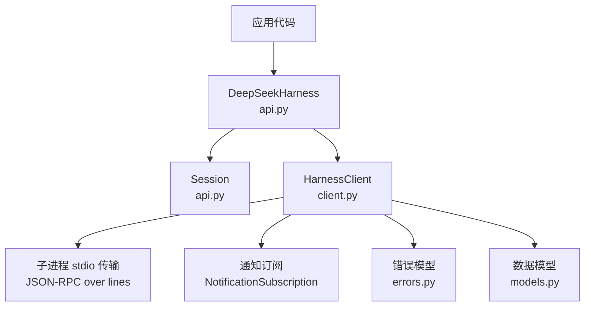
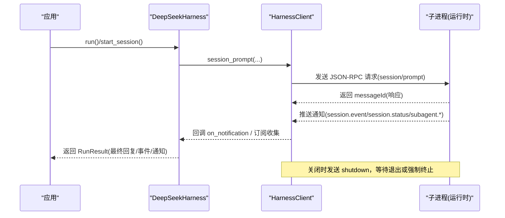
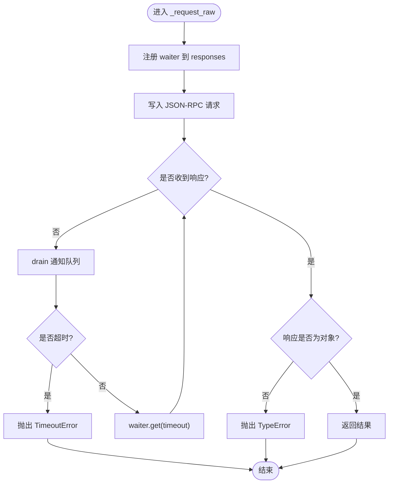
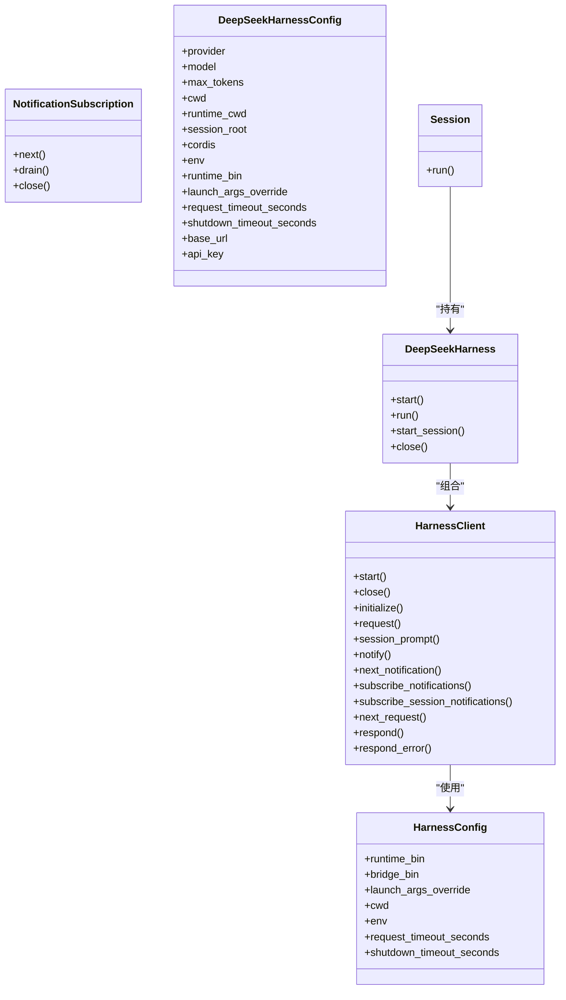

# 客户端 API

<cite>
**本文引用的文件**
- [client.py](file://python/sdk/src/deepseek_harness/client.py)
- [api.py](file://python/sdk/src/deepseek_harness/api.py)
- [models.py](file://python/sdk/src/deepseek_harness/models.py)
- [errors.py](file://python/sdk/src/deepseek_harness/errors.py)
- [test_client.py](file://python/sdk/tests/test_client.py)
</cite>

## 目录
1. [简介](#简介)
2. [项目结构](#项目结构)
3. [核心组件](#核心组件)
4. [架构总览](#架构总览)
5. [详细组件分析](#详细组件分析)
6. [依赖关系分析](#依赖关系分析)
7. [性能与超时、重试、连接池](#性能与超时重试连接池)
8. [故障排查指南](#故障排查指南)
9. [结论](#结论)
10. [附录：调用示例与最佳实践](#附录调用示例与最佳实践)

## 简介
本参考文档面向 DeepSeek Harness Python SDK 的客户端 API，重点围绕底层同步 JSON-RPC 客户端 HarnessClient（常被误称为 DeepSeekHarnessClient）以及高层封装 DeepSeekHarness/Session。文档将系统化说明公共方法、参数类型、返回值、异常处理、异步模式（基于线程与队列）、连接管理、会话状态、错误处理机制，并给出超时配置、重试策略建议与连接池使用方式。

## 项目结构
Python SDK 的关键源文件位于 python/sdk/src/deepseek_harness 下：
- client.py：实现同步 JSON-RPC 客户端 HarnessClient、通知订阅 NotificationSubscription、进程生命周期管理、消息读写与分发。
- api.py：提供高层 API DeepSeekHarnessConfig、DeepSeekHarness、Session，封装启动、初始化、会话运行与结果聚合。
- models.py：定义通用 JSON 类型别名、Notification、IncomingRequest、InitializeResponse 等数据模型。
- errors.py：定义 SDK 与传输层异常类型。

图表来源
- [api.py:48-125](file://python/sdk/src/deepseek_harness/api.py#L48-L125)
- [client.py:37-505](file://python/sdk/src/deepseek_harness/client.py#L37-L505)
- [models.py:13-33](file://python/sdk/src/deepseek_harness/models.py#L13-L33)
- [errors.py:4-24](file://python/sdk/src/deepseek_harness/errors.py#L4-L24)

章节来源
- [client.py:24-58](file://python/sdk/src/deepseek_harness/client.py#L24-L58)
- [api.py:13-125](file://python/sdk/src/deepseek_harness/api.py#L13-L125)
- [models.py:1-33](file://python/sdk/src/deepseek_harness/models.py#L1-L33)
- [errors.py:1-24](file://python/sdk/src/deepseek_harness/errors.py#L1-L24)

## 核心组件
- HarnessConfig：控制本地运行时进程的启动参数、工作目录、环境变量、请求与关闭超时。
- HarnessClient：同步 JSON-RPC 客户端，负责启动/关闭子进程、发送请求、接收响应与通知、维护订阅、错误传播。
- NotificationSubscription：通知订阅句柄，支持阻塞 next() 与非阻塞 drain(on_notification)。
- DeepSeekHarnessConfig / DeepSeekHarness / Session：高层封装，自动完成启动、初始化、会话创建与运行，聚合事件与最终回复。

章节来源
- [client.py:24-58](file://python/sdk/src/deepseek_harness/client.py#L24-L58)
- [client.py:37-505](file://python/sdk/src/deepseek_harness/client.py#L37-L505)
- [api.py:13-125](file://python/sdk/src/deepseek_harness/api.py#L13-L125)

## 架构总览
下图展示了从应用到子进程的消息流，包括请求-响应与通知通道，以及错误与关闭路径。

图表来源
- [api.py:117-183](file://python/sdk/src/deepseek_harness/api.py#L117-L183)
- [client.py:138-178](file://python/sdk/src/deepseek_harness/client.py#L138-L178)
- [client.py:228-296](file://python/sdk/src/deepseek_harness/client.py#L228-L296)
- [client.py:87-116](file://python/sdk/src/deepseek_harness/client.py#L87-L116)

## 详细组件分析

### HarnessClient 公共方法详解
以下方法均位于 client.py，采用同步阻塞式 API，内部通过线程与队列实现非阻塞 I/O。

- initialize(cwd, provider, model, max_tokens=None) -> InitializeResponse
  - 作用：向运行时发送 initialize 请求，建立会话上下文（工作目录、提供者、模型、可选最大输出 token）。
  - 参数：
    - cwd: str，必须为绝对路径（内部会 resolve）。
    - provider: str，如 deepseek-official。
    - model: str，模型标识。
    - max_tokens: int|None，可选。
  - 返回：InitializeResponse，包含 serverInfo。
  - 异常：若失败，会关闭子进程并抛出异常（例如 JsonRpcError 或 TransportClosedError）。
  - 超时：由 HarnessConfig.request_timeout_seconds 或调用层传入的 timeout_seconds 决定；未设置则无超时。
  - 参考路径：[initialize:117-136](file://python/sdk/src/deepseek_harness/client.py#L117-L136)

- request(method, params, response_model, timeout_seconds=None, on_notification=None, notification_filter=None, notification_subscription=None) -> ModelT
  - 作用：通用 JSON-RPC 请求封装，发送请求并等待响应，期间可消费通知。
  - 参数：
    - method: str，如 session/prompt。
    - params: JsonObject|None。
    - response_model: Pydantic 模型类，用于校验响应体。
    - timeout_seconds: float|None，本次请求超时。
    - on_notification: Callable[[Notification], None]，回调处理通知。
    - notification_filter: Callable[[Notification], bool]|None，过滤通知。
    - notification_subscription: NotificationSubscription|None，复用已有订阅。
  - 返回：经 response_model 校验后的对象。
  - 异常：TransportClosedError、JsonRpcError、TimeoutError、TypeError（响应非对象）。
  - 参考路径：[request:157-178](file://python/sdk/src/deepseek_harness/client.py#L157-L178), [_request_raw:228-296](file://python/sdk/src/deepseek_harness/client.py#L228-L296)

- session_prompt(session_id, content_blocks, on_notification=None, notification_subscription=None) -> str
  - 作用：向指定会话发送提示内容，返回 messageId。
  - 参数：
    - session_id: str。
    - content_blocks: list[JsonObject]。
    - on_notification: 可选回调。
    - notification_subscription: 可选订阅，用于限定通知范围（默认按会话树过滤）。
  - 返回：messageId 字符串。
  - 异常：同 request。
  - 参考路径：[session_prompt:138-155](file://python/sdk/src/deepseek_harness/client.py#L138-L155)

- notify(method, params=None) -> None
  - 作用：发送通知（无需响应），用于服务端主动消息。
  - 参考路径：[notify:180-184](file://python/sdk/src/deepseek_harness/client.py#L180-L184)

- next_notification() -> Notification
  - 作用：从全局通知队列中阻塞获取下一个通知。
  - 异常：若队列中是异常对象，则抛出该异常。
  - 参考路径：[next_notification:186-190](file://python/sdk/src/deepseek_harness/client.py#L186-L190)

- subscribe_notifications(notification_filter=None) -> NotificationSubscription
  - 作用：创建通知订阅，支持过滤。
  - 参考路径：[subscribe_notifications:192-200](file://python/sdk/src/deepseek_harness/client.py#L192-L200)

- subscribe_session_notifications(session_id) -> NotificationSubscription
  - 作用：订阅某会话及其子代理会话的通知。
  - 参考路径：[subscribe_session_notifications:202-204](file://python/sdk/src/deepseek_harness/client.py#L202-L204)

- next_request() -> IncomingRequest
  - 作用：阻塞获取来自运行时的入站请求（当客户端充当服务方时）。
  - 参考路径：[next_request:206-210](file://python/sdk/src/deepseek_harness/client.py#L206-L210)

- respond(request_id, result) -> None / respond_error(request_id, code, message, data=None) -> None
  - 作用：对入站请求进行响应或错误响应。
  - 参考路径：[respond:212-214](file://python/sdk/src/deepseek_harness/client.py#L212-L214), [respond_error:215-226](file://python/sdk/src/deepseek_harness/client.py#L215-L226)

- start() -> None / close() -> None
  - 作用：启动子进程（懒启动）、优雅关闭（发送 shutdown、等待/终止进程、清理资源）。
  - 参考路径：[start:63-85](file://python/sdk/src/deepseek_harness/client.py#L63-L85), [close:87-116](file://python/sdk/src/deepseek_harness/client.py#L87-L116)

- __enter__/__exit__
  - 作用：支持 with 语句管理生命周期。
  - 参考路径：[__enter__:56-58](file://python/sdk/src/deepseek_harness/client.py#L56-L58), [__exit__:60-61](file://python/sdk/src/deepseek_harness/client.py#L60-L61)

#### 关键内部流程
- 请求-响应循环：_request_raw 生成唯一 request_id，注册 waiter，写入消息，循环等待响应或超时；期间定期 drain 通知。
- 通知分发：_handle_message 解析消息，区分请求、响应、通知；通知根据订阅者过滤器投递至对应队列，未匹配则进入全局队列。
- 错误传播：子进程 stdout 关闭或写失败时，统一转换为 TransportClosedError；JSON-RPC error 转为 JsonRpcError；所有等待者与订阅者被注入异常以快速失败。
- 会话树追踪：记录 subagent.started/finished 的父子关系，以便按会话树过滤通知。

图表来源
- [client.py:228-296](file://python/sdk/src/deepseek_harness/client.py#L228-L296)

章节来源
- [client.py:117-226](file://python/sdk/src/deepseek_harness/client.py#L117-L226)
- [client.py:228-505](file://python/sdk/src/deepseek_harness/client.py#L228-L505)

### NotificationSubscription
- next()：阻塞获取下一条通知，遇到异常则抛出。
- drain(on_notification)：非阻塞批量取出通知并调用回调。
- close()：取消订阅，释放资源。
- 支持 with 语句自动关闭。

章节来源
- [client.py:507-546](file://python/sdk/src/deepseek_harness/client.py#L507-L546)

### 高层 API：DeepSeekHarness 与 Session
- DeepSeekHarnessConfig：声明 provider、model、max_tokens、cwd、runtime_cwd、session_root、cordis、env、runtime_bin、launch_args_override、request_timeout_seconds、shutdown_timeout_seconds、base_url、api_key。
- DeepSeekHarness：
  - start()：启动子进程并调用 initialize。
  - run(input, session_id=None, on_notification=None)：便捷入口，内部创建 Session 并执行。
  - start_session(session_id)：创建 Session。
  - close()：关闭底层客户端。
- Session：
  - run(input, on_notification=None)：发送提示，订阅会话通知，等待 idle 后返回 RunResult（final_response、finish_reason、events、notifications）。

章节来源
- [api.py:13-125](file://python/sdk/src/deepseek_harness/api.py#L13-L125)
- [api.py:127-183](file://python/sdk/src/deepseek_harness/api.py#L127-L183)
- [api.py:199-243](file://python/sdk/src/deepseek_harness/api.py#L199-L243)

## 依赖关系分析
- HarnessClient 依赖：
  - subprocess 启动运行时进程。
  - threading + queue 实现并发读取与通知分发。
  - pydantic BaseModel 校验响应模型。
  - 自定义 errors 与 models。
- DeepSeekHarness 依赖 HarnessClient，并通过环境变量注入配置（如 DSH_CWD、DEEPSEEK_BASE_URL、DEEPSEEK_API_KEY、DSH_SESSION_ROOT、DSH_CORDIS_CONFIG）。

图表来源
- [client.py:24-58](file://python/sdk/src/deepseek_harness/client.py#L24-L58)
- [client.py:37-505](file://python/sdk/src/deepseek_harness/client.py#L37-L505)
- [api.py:13-125](file://python/sdk/src/deepseek_harness/api.py#L13-L125)

章节来源
- [client.py:24-58](file://python/sdk/src/deepseek_harness/client.py#L24-L58)
- [api.py:13-125](file://python/sdk/src/deepseek_harness/api.py#L13-L125)

## 性能与超时、重试、连接池
- 超时配置
  - 全局：HarnessConfig.request_timeout_seconds 或 DeepSeekHarnessConfig.request_timeout_seconds。
  - 单次：request(..., timeout_seconds=...)。
  - 关闭超时：shutdown_timeout_seconds 控制 shutdown 等待与进程终止。
  - 注意：当前实现无网络级取消，仅客户端侧超时；服务器端任务可能继续运行直到会话空闲或进程关闭。
- 重试策略
  - 库未内置重试。建议在应用层捕获 JsonRpcError/TransportClosedError/TimeoutError 并实现指数退避重试。
  - 对于 TransportClosedError，应先检查子进程状态（可通过诊断信息）再决定是否重启。
- 连接池
  - 当前为单进程单连接模型。若需“连接池”，可在应用层维护多个 HarnessClient 实例，每个绑定不同 runtime_bin/launch_args_override 或不同环境，按需分配。
  - 注意进程资源限制与启动开销，合理控制并发度。
- 通知与背压
  - 通知通过队列传递，on_notification 应尽快处理以避免堆积。
  - 使用 NotificationSubscription.drain 批量处理，减少阻塞次数。

章节来源
- [client.py:63-116](file://python/sdk/src/deepseek_harness/client.py#L63-L116)
- [client.py:157-178](file://python/sdk/src/deepseek_harness/client.py#L157-L178)
- [client.py:228-296](file://python/sdk/src/deepseek_harness/client.py#L228-L296)
- [api.py:56-111](file://python/sdk/src/deepseek_harness/api.py#L56-L111)

## 故障排查指南
- 常见异常
  - TransportClosedError：子进程退出或 stdout 关闭，通常伴随诊断信息（退出码、stderr 尾部）。
  - JsonRpcError：运行时返回 JSON-RPC error，包含 code/message/data。
  - SdkProtocolError：协议不合规（如 turn/end 缺少 reason.kind）。
  - TimeoutError：请求在指定时间内未收到响应。
- 诊断信息
  - 关闭或错误时会附加 stderr 尾部与退出码，便于定位运行时崩溃或配置问题。
- 典型场景
  - initialize 失败：确保 provider/model/cwd 有效，检查运行时二进制是否存在或 launch_args_override 是否正确。
  - 长时间无响应：检查 session.status 与 session.event 是否到达，确认 on_notification 或订阅是否生效。
  - 子进程残留：确保使用 with 或显式 close；必要时调整 shutdown_timeout_seconds。

章节来源
- [errors.py:4-24](file://python/sdk/src/deepseek_harness/errors.py#L4-L24)
- [client.py:87-116](file://python/sdk/src/deepseek_harness/client.py#L87-L116)
- [client.py:386-422](file://python/sdk/src/deepseek_harness/client.py#L386-L422)
- [api.py:225-243](file://python/sdk/src/deepseek_harness/api.py#L225-L243)

## 结论
HarnessClient 提供了稳定、线程安全的同步 JSON-RPC 客户端能力，配合 NotificationSubscription 可实现细粒度的通知处理。DeepSeekHarness/Session 进一步简化了启动、初始化与会话运行的流程。通过合理的超时、重试与多实例管理，可以在生产环境中获得高可用性与可控的资源占用。

## 附录：调用示例与最佳实践
- 基本用法（高层 API）
  - 使用 with 管理生命周期，避免资源泄漏。
  - 通过 DeepSeekHarness.run 直接运行一轮对话，或使用 Session 精细控制。
  - 参考测试用例中的完整流程与断言。
  - 参考路径：[测试用例:15-124](file://python/sdk/tests/test_client.py#L15-L124)

- 低层 API（HarnessClient）
  - 手动 start/close，适合需要更细粒度控制的场景。
  - 使用 request/session_prompt 并传入 on_notification 或订阅，实时处理事件。
  - 参考路径：[测试用例:475-501](file://python/sdk/tests/test_client.py#L475-L501)

- 最佳实践
  - 始终设置 request_timeout_seconds，防止请求长期挂起。
  - 使用 NotificationSubscription 而非轮询全局队列，提高可扩展性。
  - 在 on_notification 中尽量轻量处理，耗时逻辑放入后台任务。
  - 对 TransportClosedError 实施重启与降级策略。
  - 使用 with 或 try/finally 确保 close 被调用。

章节来源
- [test_client.py:15-124](file://python/sdk/tests/test_client.py#L15-L124)
- [test_client.py:475-501](file://python/sdk/tests/test_client.py#L475-L501)
- [api.py:86-111](file://python/sdk/src/deepseek_harness/api.py#L86-L111)
- [client.py:56-61](file://python/sdk/src/deepseek_harness/client.py#L56-L61)