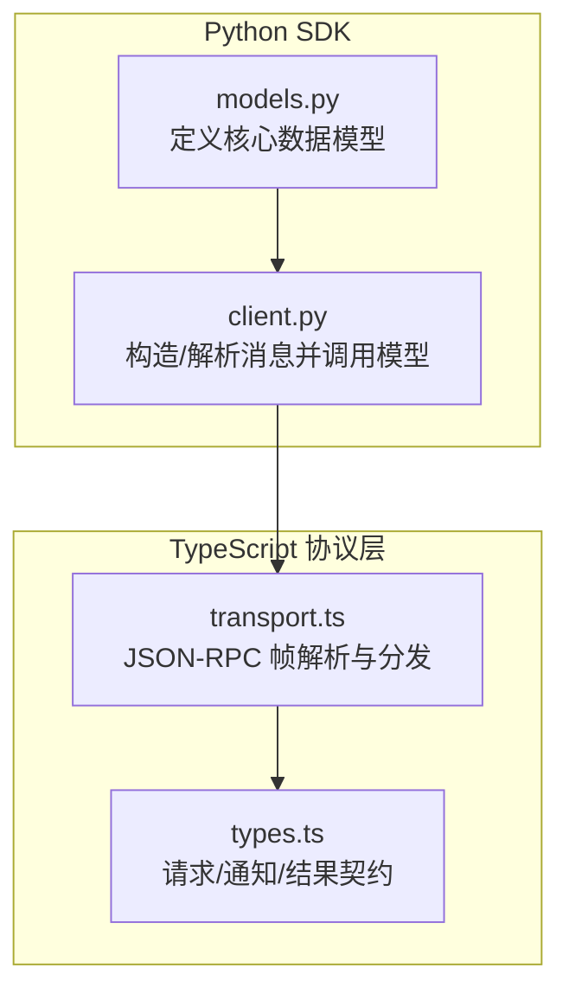
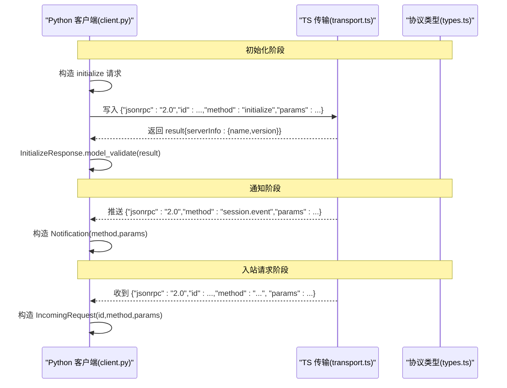
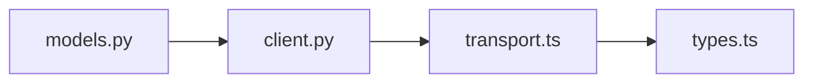
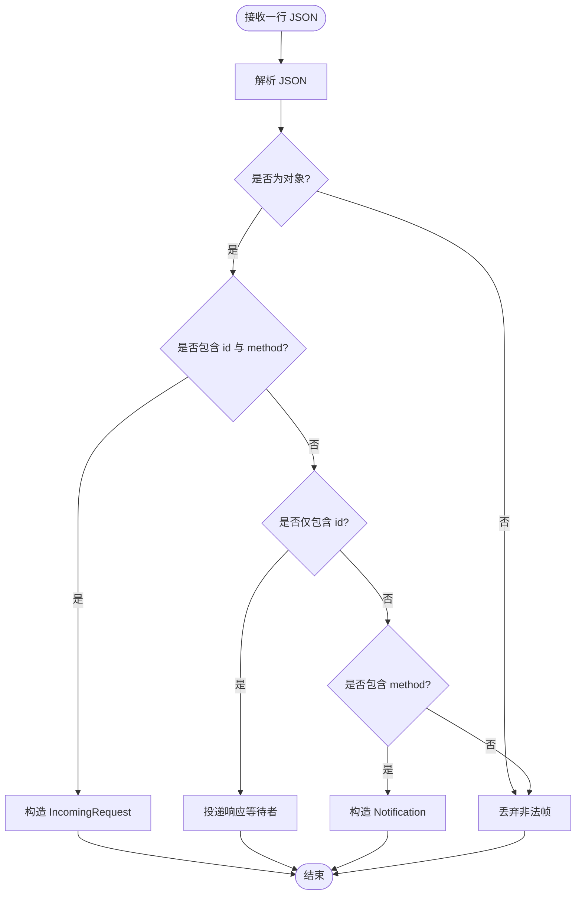

# 核心数据模型

<cite>
**本文引用的文件**
- [models.py](file://python/sdk/src/deepseek_harness/models.py)
- [client.py](file://python/sdk/src/deepseek_harness/client.py)
- [transport.ts](file://packages/sdk/protocol/src/transport.ts)
- [types.ts](file://packages/sdk/protocol/src/types.ts)
</cite>

## 目录
1. [简介](#简介)
2. [项目结构](#项目结构)
3. [核心组件](#核心组件)
4. [架构总览](#架构总览)
5. [详细组件分析](#详细组件分析)
6. [依赖关系分析](#依赖关系分析)
7. [性能考量](#性能考量)
8. [故障排查指南](#故障排查指南)
9. [结论](#结论)
10. [附录](#附录)

## 简介
本文件聚焦于 DeepSeek Harness Python SDK 中的核心数据模型，包括 Notification、IncomingRequest、ServerInfo、InitializeResponse，以及类型别名 JsonScalar、JsonValue、JsonObject。文档将说明每个类的字段类型、必填性、默认值、序列化与反序列化行为，并提供使用场景与示例路径，帮助读者理解这些模型在 JSON-RPC 通信中的作用。

## 项目结构
围绕核心数据模型的代码主要位于 Python SDK 的 models.py 中，并在 client.py 中被消费；同时 TypeScript 侧的 protocol 层提供了与之对应的协议定义和传输处理逻辑，便于跨语言对齐。

图表来源
- [models.py:1-33](file://python/sdk/src/deepseek_harness/models.py#L1-L33)
- [client.py:157-258](file://python/sdk/src/deepseek_harness/client.py#L157-L258)
- [transport.ts:201-238](file://packages/sdk/protocol/src/transport.ts#L201-L238)
- [types.ts:15-31](file://packages/sdk/protocol/src/types.ts#L15-L31)

章节来源
- [models.py:1-33](file://python/sdk/src/deepseek_harness/models.py#L1-L33)
- [client.py:157-258](file://python/sdk/src/deepseek_harness/client.py#L157-L258)
- [transport.ts:201-238](file://packages/sdk/protocol/src/transport.ts#L201-L238)
- [types.ts:15-31](file://packages/sdk/protocol/src/types.ts#L15-L31)

## 核心组件
本节概述核心数据类及其职责：
- Notification：表示服务端推送的通知消息，包含方法名与参数对象。
- IncomingRequest：表示客户端收到的请求，包含 id、方法名与参数对象。
- ServerInfo：服务器信息（名称、版本），用于初始化握手返回。
- InitializeResponse：初始化响应，包含可选的服务器信息。

此外，类型别名定义了可序列化的 JSON 值域：
- JsonScalar：标量类型（字符串、整数、浮点数、布尔、空）。
- JsonValue：递归定义的 JSON 值（标量、对象或数组）。
- JsonObject：键为字符串、值为 JsonValue 的对象。

章节来源
- [models.py:8-32](file://python/sdk/src/deepseek_harness/models.py#L8-L32)

## 架构总览
下图展示了 Python SDK 与 TypeScript 协议层在 JSON-RPC 通信中的数据流与模型映射关系。

图表来源
- [client.py:117-136](file://python/sdk/src/deepseek_harness/client.py#L117-L136)
- [client.py:157-178](file://python/sdk/src/deepseek_harness/client.py#L157-L178)
- [client.py:343-384](file://python/sdk/src/deepseek_harness/client.py#L343-L384)
- [transport.ts:201-238](file://packages/sdk/protocol/src/transport.ts#L201-L238)
- [types.ts:15-31](file://packages/sdk/protocol/src/types.ts#L15-L31)

## 详细组件分析

### 类型别名：JsonScalar、JsonValue、JsonObject
- JsonScalar：基础标量类型集合，允许 None。
- JsonValue：递归类型，支持嵌套对象与数组，构成通用 JSON 值域。
- JsonObject：以字符串为键的字典，值为 JsonValue，常用于 params/result 等结构化载荷。

用途与约束
- 作为 Notification.payload、IncomingRequest.payload 的类型约束，确保参数为合法 JSON 对象。
- 在客户端发送消息时，所有 payload 必须满足 JsonValue 约束；否则序列化或校验可能失败。

章节来源
- [models.py:8-10](file://python/sdk/src/deepseek_harness/models.py#L8-L10)

### Notification
- 字段
  - method: 字符串，通知的方法名（如 session.event、subagent.started）。
  - payload: JsonObject，通知的参数对象。
- 必填性
  - method、payload 均为必填。
- 默认值
  - 无默认值。
- 序列化/反序列化
  - 由客户端在读取到 JSON 行后构造，payload 若非对象则归一化为空对象。
- 使用场景
  - 订阅会话事件、子代理生命周期等通知。

章节来源
- [models.py:13-16](file://python/sdk/src/deepseek_harness/models.py#L13-L16)
- [client.py:343-384](file://python/sdk/src/deepseek_harness/client.py#L343-L384)

### IncomingRequest
- 字段
  - id: 字符串或整数，请求标识符。
  - method: 字符串，请求方法名。
  - payload: JsonObject，请求参数对象。
- 必填性
  - id、method、payload 均为必填。
- 默认值
  - 无默认值。
- 序列化/反序列化
  - 当收到带 id 且含 method 的消息时，客户端将其包装为 IncomingRequest 供上层处理。
- 使用场景
  - 实现双向 RPC 时，服务端需要接收并响应来自客户端的请求。

章节来源
- [models.py:19-23](file://python/sdk/src/deepseek_harness/models.py#L19-L23)
- [client.py:343-351](file://python/sdk/src/deepseek_harness/client.py#L343-L351)

### ServerInfo
- 字段
  - name: 可选字符串，服务器名称。
  - version: 可选字符串，服务器版本。
- 必填性
  - 全部可选。
- 默认值
  - 两个字段均默认为 None。
- 序列化/反序列化
  - 基于 Pydantic BaseModel，支持 model_validate 进行严格校验与转换。
- 使用场景
  - 初始化握手返回，告知客户端运行时身份与版本。

章节来源
- [models.py:26-28](file://python/sdk/src/deepseek_harness/models.py#L26-L28)
- [types.ts:27-31](file://packages/sdk/protocol/src/types.ts#L27-L31)

### InitializeResponse
- 字段
  - serverInfo: 可选的 ServerInfo。
- 必填性
  - 可选。
- 默认值
  - 默认为 None。
- 序列化/反序列化
  - 基于 Pydantic BaseModel，客户端通过 response_model=InitializeResponse 对服务端返回进行校验。
- 使用场景
  - 客户端调用 initialize 后，获取服务器信息。

章节来源
- [models.py:31-32](file://python/sdk/src/deepseek_harness/models.py#L31-L32)
- [client.py:117-136](file://python/sdk/src/deepseek_harness/client.py#L117-L136)

### 数据验证规则与序列化/反序列化行为
- 验证
  - Pydantic 模型（ServerInfo、InitializeResponse）在 model_validate 时执行类型检查与必要字段校验。
  - Notification、IncomingRequest 为 dataclass，字段类型由类型注解约束；payload 在构造前会做“非对象归一为空对象”的处理。
- 序列化
  - 客户端发送消息时统一序列化为紧凑 JSON（去除多余空白），并以换行分隔的 JSON 行协议传输。
- 反序列化
  - 读取端按行解析 JSON，识别请求、响应与通知三类帧，分别构造对应模型或触发回调。

章节来源
- [client.py:157-178](file://python/sdk/src/deepseek_harness/client.py#L157-L178)
- [client.py:298-308](file://python/sdk/src/deepseek_harness/client.py#L298-L308)
- [client.py:318-334](file://python/sdk/src/deepseek_harness/client.py#L318-L334)
- [client.py:343-384](file://python/sdk/src/deepseek_harness/client.py#L343-L384)
- [transport.ts:201-238](file://packages/sdk/protocol/src/transport.ts#L201-L238)

### 数据结构示例与使用场景
- 初始化请求与响应
  - 客户端构造 initialize 请求，携带 cwd、provider、model、可选 maxTokens。
  - 服务端返回 InitializeResult（TS 侧）或 InitializeResponse（Python 侧），其中包含 serverInfo。
- 通知
  - 服务端推送 session.event、session.status、subagent.started/finished 等通知。
  - Python 客户端将通知封装为 Notification 并投递给订阅者或队列。
- 入站请求
  - 当存在双向交互时，客户端可收到 IncomingRequest，需根据 method 与 payload 进行处理并回写响应。

章节来源
- [client.py:117-136](file://python/sdk/src/deepseek_harness/client.py#L117-L136)
- [client.py:157-178](file://python/sdk/src/deepseek_harness/client.py#L157-L178)
- [client.py:343-384](file://python/sdk/src/deepseek_harness/client.py#L343-L384)
- [types.ts:15-31](file://packages/sdk/protocol/src/types.ts#L15-L31)

## 依赖关系分析
- Python 侧
  - models.py 提供核心数据模型与类型别名。
  - client.py 消费这些模型，负责 JSON-RPC 帧的读写、消息路由与模型校验。
- TypeScript 侧
  - transport.ts 负责解析 JSON 行、区分请求/响应/通知，并调用相应处理器。
  - types.ts 定义了 initialize、session/prompt、shutdown 等方法及通知的契约。

图表来源
- [models.py:1-33](file://python/sdk/src/deepseek_harness/models.py#L1-L33)
- [client.py:157-258](file://python/sdk/src/deepseek_harness/client.py#L157-L258)
- [transport.ts:201-238](file://packages/sdk/protocol/src/transport.ts#L201-L238)
- [types.ts:15-31](file://packages/sdk/protocol/src/types.ts#L15-L31)

章节来源
- [models.py:1-33](file://python/sdk/src/deepseek_harness/models.py#L1-L33)
- [client.py:157-258](file://python/sdk/src/deepseek_harness/client.py#L157-L258)
- [transport.ts:201-238](file://packages/sdk/protocol/src/transport.ts#L201-L238)
- [types.ts:15-31](file://packages/sdk/protocol/src/types.ts#L15-L31)

## 性能考量
- 使用 slots 的 dataclass（Notification、IncomingRequest）可降低内存占用与实例创建开销。
- 紧凑 JSON 序列化减少网络带宽消耗。
- 逐行解析与队列化投递避免阻塞主线程，提升吞吐。

[本节为通用指导，不直接分析具体文件]

## 故障排查指南
- 常见错误
  - 方法未找到：当没有安装请求处理器时，服务端会返回 -32601 错误。
  - 处理器异常：抛出非 Error 对象会被转换为字符串错误，返回 -32603。
  - 传输关闭：客户端写入失败或进程退出会抛出 TransportClosedError，并附带 stderr 尾部诊断。
- 定位建议
  - 检查是否安装了正确的请求处理器。
  - 捕获并记录异常堆栈，确认参数是否符合 JsonValue 约束。
  - 查看 stderr 输出与进程退出码，辅助定位运行时问题。

章节来源
- [transport.ts:226-238](file://packages/sdk/protocol/src/transport.ts#L226-L238)
- [client.py:399-422](file://python/sdk/src/deepseek_harness/client.py#L399-L422)

## 结论
本仓库的核心数据模型以简洁、强类型的方式描述了 JSON-RPC 通信中的通知、请求与初始化响应。通过 Python 的 Pydantic 与 TypeScript 的协议类型，两端保持一致的数据契约，配合严格的序列化/反序列化流程，确保了跨语言通信的可靠性与可维护性。

[本节为总结性内容，不直接分析具体文件]

## 附录
- 关键流程图：入站消息处理

图表来源
- [client.py:318-384](file://python/sdk/src/deepseek_harness/client.py#L318-L384)
- [transport.ts:201-238](file://packages/sdk/protocol/src/transport.ts#L201-L238)