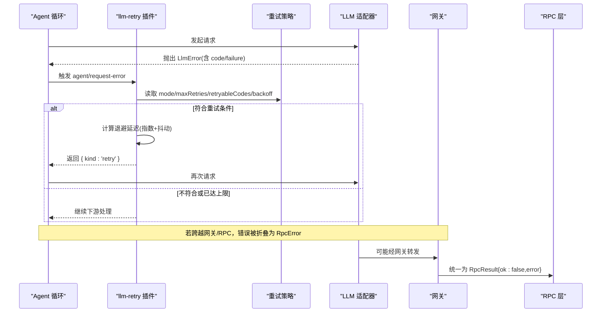
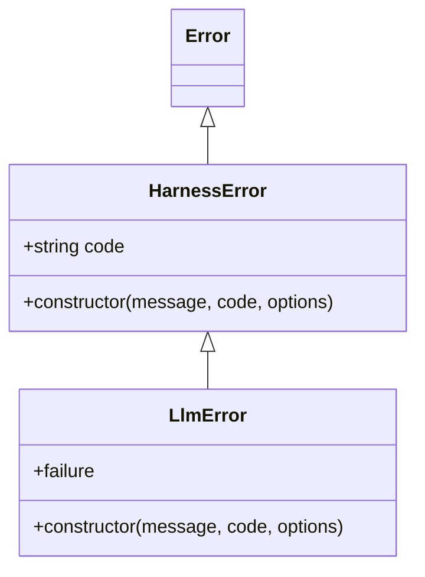
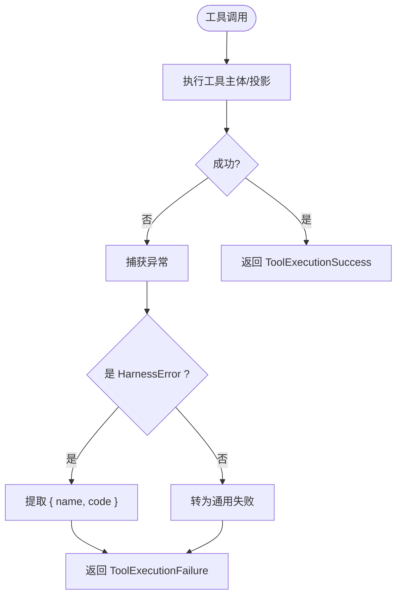
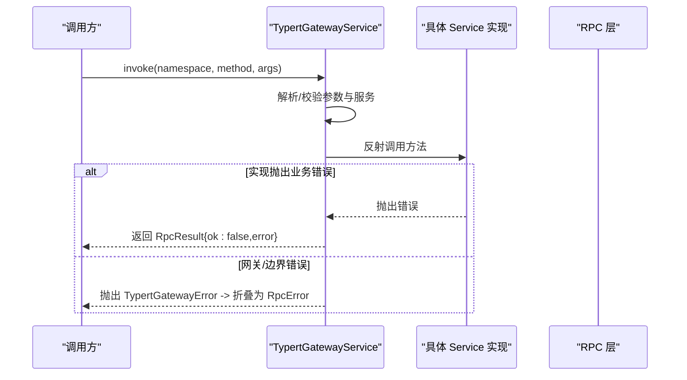
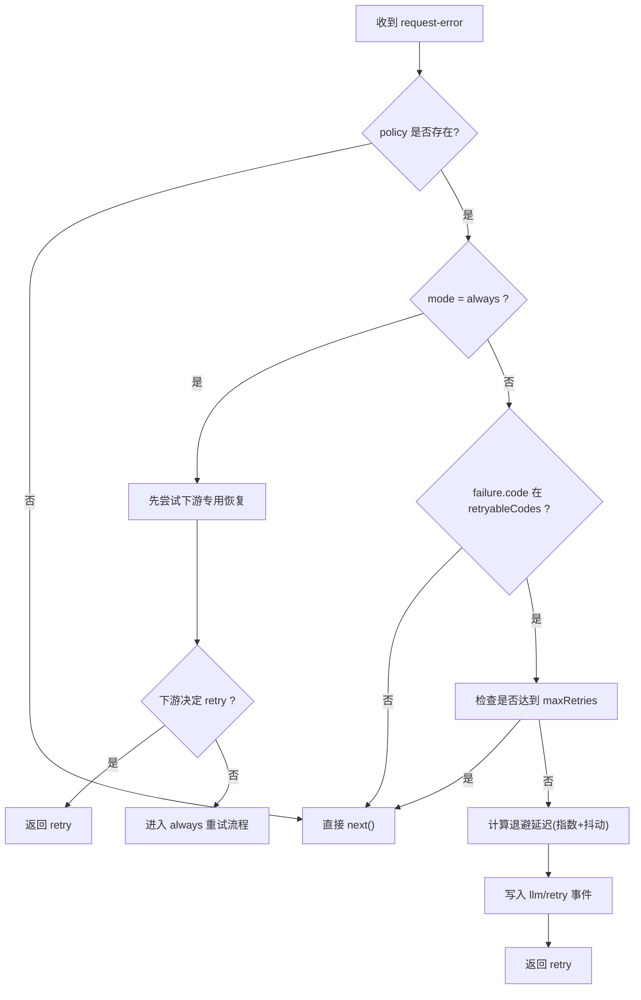
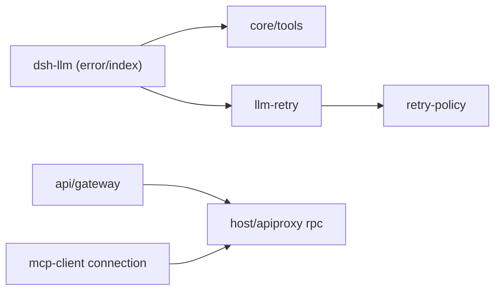

# 错误处理

<cite>
**本文引用的文件**
- [packages/llm/llm/src/error.ts](file://packages/llm/llm/src/error.ts)
- [packages/llm/llm/src/index.ts](file://packages/llm/llm/src/index.ts)
- [packages/core/tools/src/index.ts](file://packages/core/tools/src/index.ts)
- [packages/api/gateway/src/index.ts](file://packages/api/gateway/src/index.ts)
- [packages/host/apiproxy/src/api/rpc.ts](file://packages/host/apiproxy/src/api/rpc.ts)
- [packages/llm/llm-retry/src/index.ts](file://packages/llm/llm-retry/src/index.ts)
- [packages/llm/llm/src/retry-policy.ts](file://packages/llm/llm/src/retry-policy.ts)
- [packages/mcp/mcp-client/src/connection.ts](file://packages/mcp/mcp-client/src/connection.ts)
</cite>

## 目录
1. [简介](#简介)
2. [项目结构](#项目结构)
3. [核心组件](#核心组件)
4. [架构总览](#架构总览)
5. [详细组件分析](#详细组件分析)
6. [依赖关系分析](#依赖关系分析)
7. [性能考量](#性能考量)
8. [故障排查指南](#故障排查指南)
9. [结论](#结论)
10. [附录](#附录)

## 简介
本文件系统化梳理 deepseek-harness 的错误处理机制，覆盖自定义异常层次、错误码体系、重试与降级策略、日志与诊断信息，以及跨进程/网络边界的错误传播与恢复。目标是帮助开发者在工具调用、LLM 请求、网关转发、RPC 通信等关键路径上正确捕获、分类、重试与记录错误，确保系统具备可观测性与可恢复性。

## 项目结构
错误处理贯穿多个子系统：
- LLM 层：统一的 HarnessError 基类与领域错误（如 LlmError），提供稳定 code、cause 链与结构化失败信息；配套重试策略与执行器。
- 工具层：工具注册与执行结果携带结构化 error（name/code），便于下游重试/沙箱/回放使用。
- 网关层：TypertGatewayError 用于网关侧的调度/边界错误，统一转换为 RPC 错误分支。
- RPC 层：RpcError 定义闭集错误码与详情，transportError 将传输异常折叠为业务错误分支。
- 连接层：重连策略（reconnect）与超时上限约束，保证连接恢复的可控性。

```mermaid
graph TB
subgraph "LLM"
E["HarnessError<br/>LlmError"]
RP["retry-policy.ts"]
REX["llm-retry 插件"]
end
subgraph "工具"
T["tools/index.ts<br/>ToolNotFoundError / ToolOutputError"]
end
subgraph "网关"
G["TypertGatewayError"]
end
subgraph "RPC"
RPC["rpc.ts<br/>RpcError / transportError"]
end
subgraph "连接"
MC["mcp-client/connection.ts<br/>重连策略"]
end
E --> REX
RP --> REX
T --> E
G --> RPC
REX --> RPC
MC --> RPC
```

图表来源
- [packages/llm/llm/src/error.ts:13-22](file://packages/llm/llm/src/error.ts#L13-L22)
- [packages/llm/llm/src/index.ts:83-117](file://packages/llm/llm/src/index.ts#L83-L117)
- [packages/core/tools/src/index.ts:494-522](file://packages/core/tools/src/index.ts#L494-L522)
- [packages/api/gateway/src/index.ts:44-71](file://packages/api/gateway/src/index.ts#L44-L71)
- [packages/host/apiproxy/src/api/rpc.ts:104-130](file://packages/host/apiproxy/src/api/rpc.ts#L104-L130)
- [packages/llm/llm-retry/src/index.ts:99-227](file://packages/llm/llm-retry/src/index.ts#L99-L227)
- [packages/llm/llm/src/retry-policy.ts:145-192](file://packages/llm/llm/src/retry-policy.ts#L145-L192)
- [packages/mcp/mcp-client/src/connection.ts:65-78](file://packages/mcp/mcp-client/src/connection.ts#L65-L78)

章节来源
- [packages/llm/llm/src/error.ts:1-164](file://packages/llm/llm/src/error.ts#L1-L164)
- [packages/llm/llm/src/index.ts:66-117](file://packages/llm/llm/src/index.ts#L66-L117)
- [packages/core/tools/src/index.ts:480-522](file://packages/core/tools/src/index.ts#L480-L522)
- [packages/api/gateway/src/index.ts:44-239](file://packages/api/gateway/src/index.ts#L44-L239)
- [packages/host/apiproxy/src/api/rpc.ts:104-194](file://packages/host/apiproxy/src/api/rpc.ts#L104-L194)
- [packages/llm/llm-retry/src/index.ts:1-227](file://packages/llm/llm-retry/src/index.ts#L1-L227)
- [packages/llm/llm/src/retry-policy.ts:1-192](file://packages/llm/llm/src/retry-policy.ts#L1-L192)
- [packages/mcp/mcp-client/src/connection.ts:55-78](file://packages/mcp/mcp-client/src/connection.ts#L55-L78)

## 核心组件
- 基础错误基类与工具函数
  - HarnessError：所有 harness 错误的共享基类，包含稳定的 machine-routable code、人类可读 message、标准 cause 链，name 默认子类名。
  - isHarnessError：在 seam 处做类型收窄，避免跨 realm 或 duck-typed 误判。
  - errorChain：安全渲染错误链（含 AggregateError 成员与 cause 链），用于日志/提示。
  - 常量代码：CONTEXT_WINDOW_EXCEEDED_CODE、QUOTA_EXCEEDED_CODE、EMPTY_RESPONSE_CODE 等，用于跨提供商识别特定失败。
  - 辅助判定：isContextWindowExceededError、isQuotaExceededError，基于 provider 返回文本识别上下文溢出与配额耗尽。

- LLM 领域错误
  - LlmError：继承 HarnessError，携带冻结的结构化 failure（message、code、可选 status/providerRetryAfterMs/requestId），构造时严格校验参数。

- 工具执行错误
  - ToolNotFoundError：模型请求了未注册的工具，code 为 UNKNOWN_TOOL。
  - ToolOutputError：工具输出不满足声明的 schema 或投影失败，code 为 INVALID_TOOL_OUTPUT，并保留 violations 列表。
  - 工具执行结果：ToolExecutionResult 在失败分支携带 { name, code } 的结构化 error，供重试/沙箱/回放消费。

- 网关错误
  - TypertGatewayError：网关侧调度/边界错误，包含 code、endpoint、field，消息不含敏感值，支持 cause 链。

- RPC 错误模型
  - RpcError：闭集错误码 + details，switch(code) 可精确窄化。
  - transportError：将传输异常折叠为 RpcResult 的 error 分支（code=internal）。

- 重试与重连
  - retry-policy.ts：normal/always 两种模式，指数退避+抖动，最大延迟限制，白名单 retryableCodes。
  - llm-retry 插件：监听 agent/request-error，按策略进行可取消延迟与重试，写入会话事件，支持 always 模式下的下游专用恢复优先。
  - mcp-client 重连策略：对 reconnect 配置进行强校验与默认化，限制最大延迟。

章节来源
- [packages/llm/llm/src/error.ts:13-164](file://packages/llm/llm/src/error.ts#L13-L164)
- [packages/llm/llm/src/index.ts:83-117](file://packages/llm/llm/src/index.ts#L83-L117)
- [packages/core/tools/src/index.ts:494-522](file://packages/core/tools/src/index.ts#L494-L522)
- [packages/api/gateway/src/index.ts:44-71](file://packages/api/gateway/src/index.ts#L44-L71)
- [packages/host/apiproxy/src/api/rpc.ts:104-130](file://packages/host/apiproxy/src/api/rpc.ts#L104-L130)
- [packages/llm/llm/src/retry-policy.ts:14-24](file://packages/llm/llm/src/retry-policy.ts#L14-L24)
- [packages/llm/llm-retry/src/index.ts:99-227](file://packages/llm/llm-retry/src/index.ts#L99-L227)
- [packages/mcp/mcp-client/src/connection.ts:65-78](file://packages/mcp/mcp-client/src/connection.ts#L65-L78)

## 架构总览
下图展示一次 LLM 请求失败时的错误传播与重试流程：



图表来源
- [packages/llm/llm-retry/src/index.ts:156-208](file://packages/llm/llm-retry/src/index.ts#L156-L208)
- [packages/llm/llm/src/retry-policy.ts:145-192](file://packages/llm/llm/src/retry-policy.ts#L145-L192)
- [packages/host/apiproxy/src/api/rpc.ts:115-130](file://packages/host/apiproxy/src/api/rpc.ts#L115-L130)
- [packages/api/gateway/src/index.ts:145-184](file://packages/api/gateway/src/index.ts#L145-L184)

## 详细组件分析

### 基础错误与 LLM 错误
- 设计要点
  - 通过 code 路由而非解析 message；message 面向人类，code 面向机器。
  - 使用 ErrorOptions.cause 链接原始异常，保持完整诊断信息。
  - LlmError.failure 冻结为不可变对象，便于序列化与持久化。
- 构造函数与字段
  - HarnessError(message, code, options?)：设置 code、name 与 cause。
  - LlmError(message, code, options?)：校验 message/code/status/providerRetryAfterMs/requestId 后调用 super，并生成冻结的 failure。
- 调试信息
  - errorChain(value) 安全渲染错误链与 AggregateError 成员，避免抛错副作用。
  - isContextWindowExceededError/isQuotaExceededError 基于 provider 文本识别特定失败。



图表来源
- [packages/llm/llm/src/error.ts:13-22](file://packages/llm/llm/src/error.ts#L13-L22)
- [packages/llm/llm/src/index.ts:83-117](file://packages/llm/llm/src/index.ts#L83-L117)

章节来源
- [packages/llm/llm/src/error.ts:13-164](file://packages/llm/llm/src/error.ts#L13-L164)
- [packages/llm/llm/src/index.ts:83-117](file://packages/llm/llm/src/index.ts#L83-L117)

### 工具执行错误
- 设计要点
  - 工具注册阶段遇到未知工具或输出不合法时抛出 HarnessError 子类，code 稳定，便于下游区分“工具自身错误”和“框架级错误”。
  - 工具执行结果在失败分支携带 { name, code }，使重试/沙箱/回放能精准决策。
- 常见错误
  - ToolNotFoundError：UNKNOWN_TOOL，描述未注册工具名称及可达路径。
  - ToolOutputError：INVALID_TOOL_OUTPUT，附带 violations 列表。



图表来源
- [packages/core/tools/src/index.ts:494-522](file://packages/core/tools/src/index.ts#L494-L522)
- [packages/core/tools/src/index.ts:641-648](file://packages/core/tools/src/index.ts#L641-L648)

章节来源
- [packages/core/tools/src/index.ts:480-522](file://packages/core/tools/src/index.ts#L480-L522)
- [packages/core/tools/src/index.ts:641-648](file://packages/core/tools/src/index.ts#L641-L648)

### 网关错误与 RPC 错误
- 网关错误
  - TypertGatewayError：用于网关调度/边界错误，包含 endpoint、field，消息不含敏感值，支持 cause。
  - invoke 过程中对服务可用性、方法存在性、参数解码等进行校验，失败抛出 TypertGatewayError。
- RPC 错误
  - RpcError：闭集错误码与 details，便于客户端精确处理。
  - transportError：将传输异常折叠为 { ok:false, error:{code:'internal',...} }，统一错误出口。



图表来源
- [packages/api/gateway/src/index.ts:145-184](file://packages/api/gateway/src/index.ts#L145-L184)
- [packages/host/apiproxy/src/api/rpc.ts:115-130](file://packages/host/apiproxy/src/api/rpc.ts#L115-L130)

章节来源
- [packages/api/gateway/src/index.ts:44-239](file://packages/api/gateway/src/index.ts#L44-L239)
- [packages/host/apiproxy/src/api/rpc.ts:104-194](file://packages/host/apiproxy/src/api/rpc.ts#L104-L194)

### 重试策略与降级处理
- 策略模式
  - normal：仅对 retryableCodes 中的 code 重试，最多 maxRetries 次，带指数退避与抖动。
  - always：对所有失败尝试重试，直到成功、取消或插件销毁；允许下游专用恢复先于 always 兜底。
- 退避与抖动
  - initialDelayMs、maxDelayMs、jitterRatio 均受上限与范围校验，防止过大定时器或无效抖动。
- 可取消等待
  - cancellableDelay 结合 AbortSignal 支持任务取消，避免悬挂等待。
- 会话事件
  - 每次重试前写入 llm/retry 事件，包含 policyKey、provider、failure、delayMs 等，便于追踪与回放。



图表来源
- [packages/llm/llm-retry/src/index.ts:156-208](file://packages/llm/llm-retry/src/index.ts#L156-L208)
- [packages/llm/llm/src/retry-policy.ts:145-192](file://packages/llm/llm/src/retry-policy.ts#L145-L192)

章节来源
- [packages/llm/llm-retry/src/index.ts:78-227](file://packages/llm/llm-retry/src/index.ts#L78-L227)
- [packages/llm/llm/src/retry-policy.ts:14-24](file://packages/llm/llm/src/retry-policy.ts#L14-L24)
- [packages/llm/llm/src/retry-policy.ts:117-192](file://packages/llm/llm/src/retry-policy.ts#L117-L192)

### 连接重连策略
- 重连配置强校验：initialDelayMs、maxDelayMs、maxAttempts 等必须为正数且在定时器上限内。
- 默认值与白名单：未知键立即报错，避免静默忽略。
- 与超时上限联动：避免超过平台定时器限制导致行为异常。

章节来源
- [packages/mcp/mcp-client/src/connection.ts:65-78](file://packages/mcp/mcp-client/src/connection.ts#L65-L78)

## 依赖关系分析
- 低耦合高内聚
  - LLM 错误基类位于叶子包 dsh-llm，其他包可无新增依赖边复用。
  - 工具层通过 HarnessError 子类与结构化 error 字段，与重试/回放解耦。
  - 网关与 RPC 层各自维护错误模型，但通过统一折叠策略（transportError）收敛到 RpcResult。
- 外部依赖
  - 重试策略依赖 @deepseek-ai/dsh-timeout 的最大定时器延迟常量，确保跨平台一致性。
  - 配置校验使用 schemastery 进行 schema 驱动的参数验证。



图表来源
- [packages/llm/llm/src/error.ts:13-22](file://packages/llm/llm/src/error.ts#L13-L22)
- [packages/core/tools/src/index.ts:494-522](file://packages/core/tools/src/index.ts#L494-L522)
- [packages/llm/llm-retry/src/index.ts:99-227](file://packages/llm/llm-retry/src/index.ts#L99-L227)
- [packages/llm/llm/src/retry-policy.ts:145-192](file://packages/llm/llm/src/retry-policy.ts#L145-L192)
- [packages/api/gateway/src/index.ts:44-71](file://packages/api/gateway/src/index.ts#L44-L71)
- [packages/host/apiproxy/src/api/rpc.ts:115-130](file://packages/host/apiproxy/src/api/rpc.ts#L115-L130)
- [packages/mcp/mcp-client/src/connection.ts:65-78](file://packages/mcp/mcp-client/src/connection.ts#L65-L78)

章节来源
- [packages/llm/llm/src/error.ts:13-22](file://packages/llm/llm/src/error.ts#L13-L22)
- [packages/core/tools/src/index.ts:494-522](file://packages/core/tools/src/index.ts#L494-L522)
- [packages/llm/llm-retry/src/index.ts:99-227](file://packages/llm/llm-retry/src/index.ts#L99-L227)
- [packages/llm/llm/src/retry-policy.ts:145-192](file://packages/llm/llm/src/retry-policy.ts#L145-L192)
- [packages/api/gateway/src/index.ts:44-71](file://packages/api/gateway/src/index.ts#L44-L71)
- [packages/host/apiproxy/src/api/rpc.ts:115-130](file://packages/host/apiproxy/src/api/rpc.ts#L115-L130)
- [packages/mcp/mcp-client/src/connection.ts:65-78](file://packages/mcp/mcp-client/src/connection.ts#L65-L78)

## 性能考量
- 重试退避上限：maxDelayMs 限制单次最大延迟，避免长时间阻塞。
- 抖动比例：jitterRatio 控制抖动范围，降低雪崩风险。
- 可取消等待：cancellableDelay 与 AbortSignal 配合，及时释放资源。
- 冻结对象：LlmError.failure 冻结，减少后续修改开销与意外变更。
- 最大定时器限制：遵循 MAX_TIMER_DELAY_MS，避免平台限制导致的异常。

[本节为通用指导，不直接分析具体文件]

## 故障排查指南
- 快速定位错误类别
  - 使用 isHarnessError 判断是否为 harness 错误，再根据 code 分流。
  - 对 LLM 错误，优先检查 code：RATE_LIMIT、SERVER、TIMEOUT、TRANSPORT、CONTEXT_WINDOW_EXCEEDED、QUOTA、EMPTY_RESPONSE 等。
- 常见错误与修复
  - 上下文窗口溢出：isContextWindowExceededError 识别，需压缩输入或切换模型。
  - 配额耗尽：isQuotaExceededError 识别，需充值或调整用量。
  - 空响应：EMPTY_RESPONSE 视为可重试，检查适配器与网络。
  - 工具未注册：UNKNOWN_TOOL，检查工具注册表与可见性。
  - 工具输出非法：INVALID_TOOL_OUTPUT，查看 violations 修正输出。
  - 网关错误：TypertGatewayError 的 endpoint/field 定位问题域。
  - RPC 内部错误：transportError 折叠为 internal，检查底层异常链。
- 日志与诊断
  - 使用 errorChain 渲染完整错误链，避免丢失 cause。
  - 关注 llm/retry 事件，确认重试次数、延迟与失败原因。
- 重试与降级
  - normal 模式下确保 retryableCodes 合理，避免无限重试。
  - always 模式下务必有下游专用恢复（如认证失败、权限不足）以尽早终止。
  - 连接重连策略需设置合理的 initialDelayMs/maxDelayMs/maxAttempts。

章节来源
- [packages/llm/llm/src/error.ts:80-100](file://packages/llm/llm/src/error.ts#L80-L100)
- [packages/llm/llm/src/error.ts:114-164](file://packages/llm/llm/src/error.ts#L114-L164)
- [packages/core/tools/src/index.ts:494-522](file://packages/core/tools/src/index.ts#L494-L522)
- [packages/api/gateway/src/index.ts:44-71](file://packages/api/gateway/src/index.ts#L44-L71)
- [packages/host/apiproxy/src/api/rpc.ts:115-130](file://packages/host/apiproxy/src/api/rpc.ts#L115-L130)
- [packages/llm/llm-retry/src/index.ts:156-208](file://packages/llm/llm-retry/src/index.ts#L156-L208)
- [packages/mcp/mcp-client/src/connection.ts:65-78](file://packages/mcp/mcp-client/src/connection.ts#L65-L78)

## 结论
该错误处理体系以 HarnessError 为核心，结合稳定的 code、cause 链与结构化失败信息，实现了跨子系统的统一错误语义。LLM 层提供领域错误与重试策略，工具层通过结构化 error 支撑下游决策，网关与 RPC 层收敛传输与业务错误，连接层保障重连可控。整体设计强调可观测性、可恢复性与可测试性，建议在开发中始终遵循“用 code 路由、用 cause 诊断、用策略重试、用事件追踪”的最佳实践。

[本节为总结性内容，不直接分析具体文件]

## 附录
- 错误码速查
  - LLM：CONTEXT_WINDOW_EXCEEDED、QUOTA、EMPTY_RESPONSE、RATE_LIMIT、SERVER、TIMEOUT、TRANSPORT
  - 工具：UNKNOWN_TOOL、INVALID_TOOL_OUTPUT
  - 网关：service-unavailable、method-unavailable、definition-unavailable
  - RPC：bad-request、cancelled、session-not-found、model-unavailable、settings-rejected、credential-rejected、internal 等
- 最佳实践清单
  - 抛出 HarnessError 或其子类，避免裸字符串或普通 Error。
  - 在 seam 处使用 isHarnessError 做类型收窄。
  - 使用 errorChain 渲染日志，避免丢失 cause。
  - 配置 retryableCodes 与 backoff，避免过度重试。
  - 在 always 模式下提供下游专用恢复，尽快终止不可恢复错误。
  - 连接重连策略遵循最大定时器限制，避免平台异常。

[本节为补充信息，不直接分析具体文件]