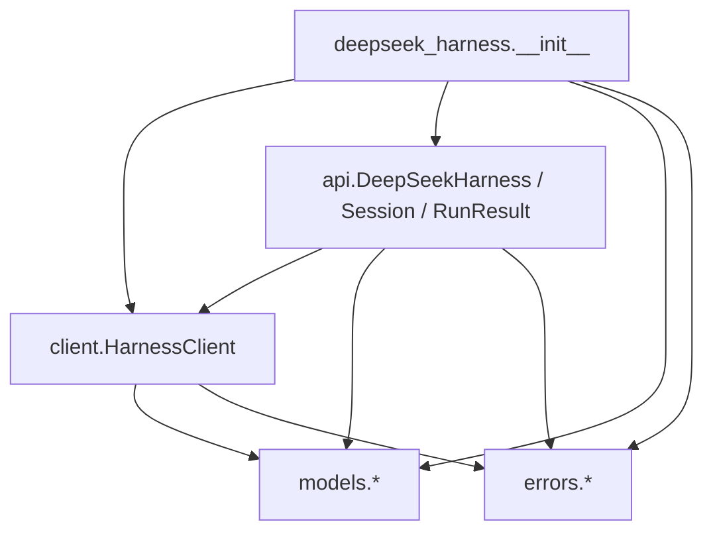
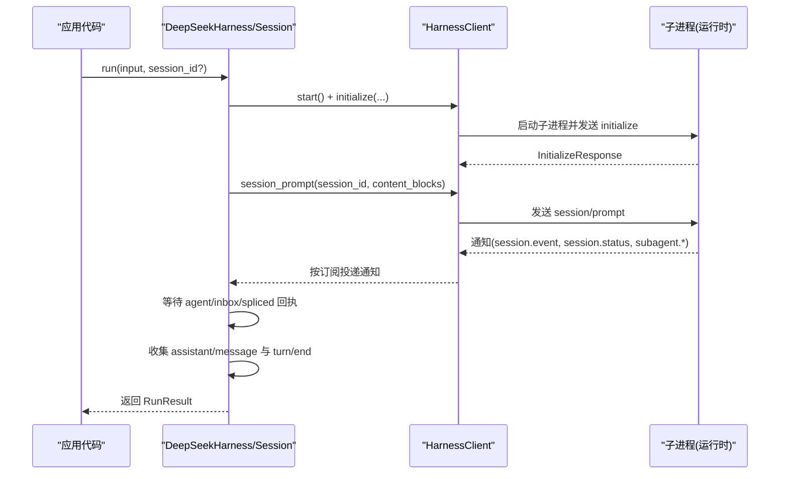
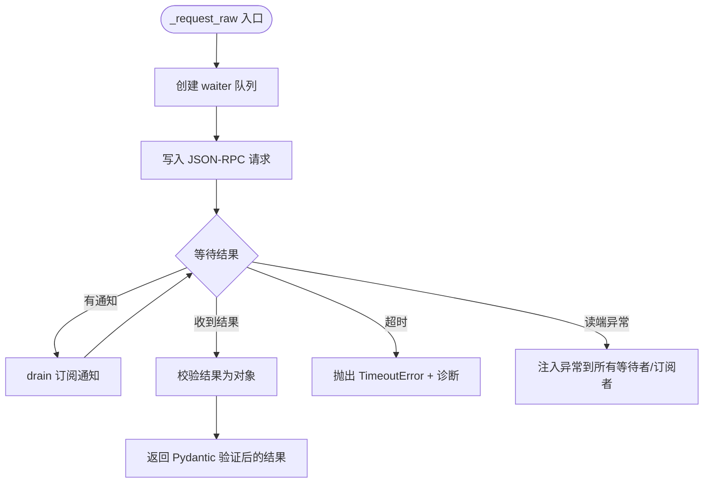
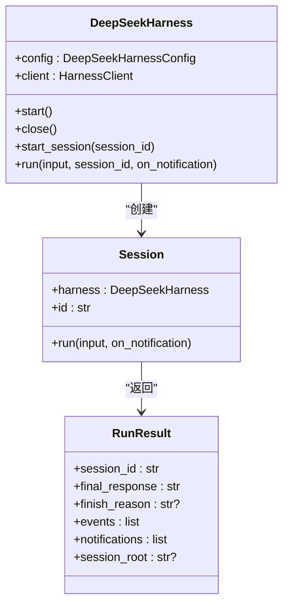
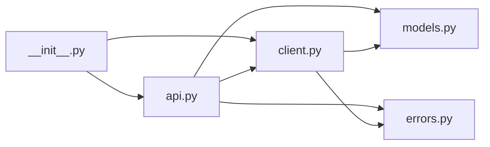

# Python SDK

<cite>
**本文引用的文件**
- [__init__.py](file://python/sdk/src/deepseek_harness/__init__.py)
- [client.py](file://python/sdk/src/deepseek_harness/client.py)
- [api.py](file://python/sdk/src/deepseek_harness/api.py)
- [models.py](file://python/sdk/src/deepseek_harness/models.py)
- [errors.py](file://python/sdk/src/deepseek_harness/errors.py)
- [README.md](file://python/sdk/README.md)
- [test_client.py](file://python/sdk/tests/test_client.py)
- [minimal.py](file://examples/jsonrpc-agent/minimal.py)
- [python-sdk.md](file://docs/user/guide/python-sdk.md)
</cite>

## 目录
1. [简介](#简介)
2. [项目结构](#项目结构)
3. [核心组件](#核心组件)
4. [架构总览](#架构总览)
5. [详细组件分析](#详细组件分析)
6. [依赖关系分析](#依赖关系分析)
7. [性能与并发特性](#性能与并发特性)
8. [错误处理与异常机制](#错误处理与异常机制)
9. [API 参考](#api-参考)
10. [使用示例与集成模式](#使用示例与集成模式)
11. [部署与运行时配置](#部署与运行时配置)
12. [故障排查指南](#故障排查指南)
13. [结论](#结论)

## 简介
本 SDK 提供通过 JSON-RPC over stdio 驱动 DeepSeek Harness 的 Python 客户端。它封装了子进程生命周期、请求/通知路由、会话管理与事件收集，暴露高层 API（DeepSeekHarness、Session）和底层客户端（HarnessClient），便于在脚本或应用中以同步方式调用 Agent 能力，并支持自定义 Cordis 配置、模型提供商与运行环境注入。

## 项目结构
SDK 位于 python/sdk 目录，核心模块如下：
- deepseek_harness/__init__.py：统一导出公共类型与类
- deepseek_harness/client.py：JSON-RPC 客户端、子进程管理、通知订阅与路由
- deepseek_harness/api.py：高层 API（DeepSeekHarness、Session、RunResult）
- deepseek_harness/models.py：数据类型定义（Notification、IncomingRequest、InitializeResponse 等）
- deepseek_harness/errors.py：异常体系（TransportClosedError、SdkProtocolError、JsonRpcError）

**图表来源**
- [__init__.py:1-19](file://python/sdk/src/deepseek_harness/__init__.py#L1-L19)
- [client.py:37-558](file://python/sdk/src/deepseek_harness/client.py#L37-L558)
- [api.py:13-243](file://python/sdk/src/deepseek_harness/api.py#L13-L243)
- [models.py:1-33](file://python/sdk/src/deepseek_harness/models.py#L1-L33)
- [errors.py:1-24](file://python/sdk/src/deepseek_harness/errors.py#L1-L24)

**章节来源**
- [__init__.py:1-19](file://python/sdk/src/deepseek_harness/__init__.py#L1-L19)
- [client.py:1-558](file://python/sdk/src/deepseek_harness/client.py#L1-L558)
- [api.py:1-243](file://python/sdk/src/deepseek_harness/api.py#L1-L243)
- [models.py:1-33](file://python/sdk/src/deepseek_harness/models.py#L1-L33)
- [errors.py:1-24](file://python/sdk/src/deepseek_harness/errors.py#L1-L24)

## 核心组件
- HarnessConfig：控制本地运行时启动参数、工作目录、环境变量、超时等
- HarnessClient：基于 stdio 的 JSON-RPC 同步客户端，负责子进程启动、消息读写、请求-响应匹配、通知分发与订阅
- DeepSeekHarnessConfig：面向用户的高层配置（provider、model、max_tokens、cwd、session_root、cordis、base_url、api_key 等）
- DeepSeekHarness：高层入口，自动启动并初始化运行时，提供 run() 与 start_session()
- Session：封装一次“提示输入到空闲结束”的活动区间，收集事件与通知，返回 RunResult
- RunResult：包含 session_id、final_response、finish_reason、events、notifications、session_root
- NotificationSubscription：通知订阅句柄，支持 next()/drain() 与上下文管理器关闭
- 数据模型：Notification、IncomingRequest、ServerInfo、InitializeResponse、JsonObject/JsonValue

**章节来源**
- [client.py:24-558](file://python/sdk/src/deepseek_harness/client.py#L24-L558)
- [api.py:13-243](file://python/sdk/src/deepseek_harness/api.py#L13-L243)
- [models.py:1-33](file://python/sdk/src/deepseek_harness/models.py#L1-L33)

## 架构总览
SDK 采用“高层 API + 低层客户端”的分层设计：
- 高层 API（DeepSeekHarness/Session）负责业务语义：会话生命周期、事件聚合、最终响应提取
- 低层客户端（HarnessClient）负责传输与协议：子进程管理、JSON-RPC 请求/通知路由、超时与诊断信息
- 数据模型与异常体系贯穿两层，保证类型安全与可观测性

**图表来源**
- [api.py:117-183](file://python/sdk/src/deepseek_harness/api.py#L117-L183)
- [client.py:117-178](file://python/sdk/src/deepseek_harness/client.py#L117-L178)
- [client.py:228-296](file://python/sdk/src/deepseek_harness/client.py#L228-L296)

## 详细组件分析

### HarnessClient（JSON-RPC 客户端）
职责：
- 子进程生命周期：start/close，带优雅 shutdown 与超时保护
- JSON-RPC 请求：request/_request_raw，支持超时、通知回调、通知过滤与订阅
- 通知系统：next_notification、subscribe_notifications、subscribe_session_notifications、NotificationSubscription
- 桥接请求转发：next_request/respond/respond_error
- 诊断信息：失败时附带 stderr 尾部与退出码

关键流程：
- _request_raw：为每次请求创建 waiter 队列，写入消息后循环等待结果；期间可 drain 订阅的通知；超时则抛出 TimeoutError 并附加诊断
- _handle_message：区分请求、响应、通知三类消息；通知根据订阅过滤投递，未匹配则进入全局队列
- _fail_waiters：运行时关闭时将异常注入所有等待者与订阅者，确保资源释放

并发与线程：
- 读取 stdout 与 stderr 分别由独立守护线程处理
- 写操作使用写锁串行化，避免交错
- 请求-响应通过队列与字典映射实现线程安全

**图表来源**
- [client.py:228-296](file://python/sdk/src/deepseek_harness/client.py#L228-L296)
- [client.py:318-397](file://python/sdk/src/deepseek_harness/client.py#L318-L397)

**章节来源**
- [client.py:37-558](file://python/sdk/src/deepseek_harness/client.py#L37-L558)

### DeepSeekHarness 与 Session（高层 API）
职责：
- DeepSeekHarness：懒启动运行时，注入环境变量（如 DEEPSEEK_BASE_URL、DEEPSEEK_API_KEY、DSH_CWD、DSH_SESSION_ROOT、DSH_CORDIS_CONFIG），维护初始化状态
- Session：封装一次 run 活动区间，订阅会话及其后代通知，等待 agent/inbox/spliced 回执，收集 assistant/message 与 turn/end，最后返回 RunResult

数据处理：
- normalize_input：将字符串输入转换为内容块列表
- final_response：从 events 中提取最后一个 assistant/message 文本拼接
- finish_reason：从最后一个 turn/end 中解析 data.reason.kind，缺失则抛 SdkProtocolError

**图表来源**
- [api.py:13-183](file://python/sdk/src/deepseek_harness/api.py#L13-L183)

**章节来源**
- [api.py:13-243](file://python/sdk/src/deepseek_harness/api.py#L13-L243)

### 数据类型与序列化
- JsonValue/JsonObject：通用 JSON 值与对象类型别名
- Notification：method + payload
- IncomingRequest：id + method + payload
- ServerInfo/InitializeResponse：Pydantic 模型，用于 initialize 响应校验
- 所有 JSON 消息通过 json.dumps/separators=(",", ":") 压缩输出，行分隔传输

**章节来源**
- [models.py:1-33](file://python/sdk/src/deepseek_harness/models.py#L1-L33)
- [client.py:298-308](file://python/sdk/src/deepseek_harness/client.py#L298-L308)

## 依赖关系分析
- __init__.py 仅做重导出，降低使用者导入成本
- api.py 依赖 client.py 与 models.py/errors.py
- client.py 依赖 models.py/errors.py
- 测试覆盖高，验证了通知路由、超时、关闭、子代理树追踪等行为

**图表来源**
- [__init__.py:1-19](file://python/sdk/src/deepseek_harness/__init__.py#L1-L19)
- [api.py:1-243](file://python/sdk/src/deepseek_harness/api.py#L1-L243)
- [client.py:1-558](file://python/sdk/src/deepseek_harness/client.py#L1-L558)
- [models.py:1-33](file://python/sdk/src/deepseek_harness/models.py#L1-L33)
- [errors.py:1-24](file://python/sdk/src/deepseek_harness/errors.py#L1-L24)

**章节来源**
- [__init__.py:1-19](file://python/sdk/src/deepseek_harness/__init__.py#L1-L19)
- [api.py:1-243](file://python/sdk/src/deepseek_harness/api.py#L1-L243)
- [client.py:1-558](file://python/sdk/src/deepseek_harness/client.py#L1-L558)

## 性能与并发特性
- 子进程 I/O 分离：stdout/stderr 各自独立线程读取，避免阻塞
- 写路径加锁：防止多写竞争导致消息交错
- 请求-响应匹配：基于队列与字典，O(1) 查找
- 通知订阅：支持过滤与批量 drain，减少主循环开销
- 超时控制：请求级与关闭级超时，避免长时间挂起
- 诊断信息：失败时附带 stderr 尾部与退出码，便于定位

最佳实践：
- 复用 DeepSeekHarness 实例以减少子进程启动开销
- 合理设置 request_timeout_seconds 与 shutdown_timeout_seconds
- 使用 subscribe_session_notifications 精准接收相关通知，避免全局队列堆积
- 对 on_notification 回调进行轻量处理，必要时使用 drain 批量消费

[本节为通用指导，不直接分析具体文件]

## 错误处理与异常机制
异常层次：
- HarnessError：基类
- TransportClosedError：运行时子进程退出或 stdout 关闭
- SdkProtocolError：运行时数据不符合 SDK 协议约定（例如 turn/end 缺少 reason.kind）
- JsonRpcError：运行时返回 JSON-RPC error 响应

常见触发点：
- 运行时关闭：_fail_waiters 向所有等待者与订阅者注入异常
- 请求超时：_request_raw 超时抛出 TimeoutError，并附加诊断信息
- 协议违规：finish_reason 解析失败抛出 SdkProtocolError
- JSON-RPC 错误：_handle_message 将 error 包装为 JsonRpcError 抛出

建议：
- 捕获 TransportClosedError 进行重试或降级
- 捕获 JsonRpcError 检查 code/message/data
- 捕获 SdkProtocolError 检查运行时版本或配置是否兼容

**章节来源**
- [errors.py:1-24](file://python/sdk/src/deepseek_harness/errors.py#L1-L24)
- [client.py:386-422](file://python/sdk/src/deepseek_harness/client.py#L386-L422)
- [api.py:225-243](file://python/sdk/src/deepseek_harness/api.py#L225-L243)

## API 参考

### 高层 API
- DeepSeekHarness(config=None, **kwargs)
  - 属性：config (DeepSeekHarnessConfig)、client (HarnessClient)
  - 方法：start()、close()、start_session(session_id=None) -> Session、run(input, session_id=None, on_notification=None) -> RunResult
- Session(harness, session_id)
  - 属性：harness、id
  - 方法：run(input, on_notification=None) -> RunResult
- RunResult
  - 字段：session_id、final_response、finish_reason、events、notifications、session_root

### 低层客户端
- HarnessConfig(runtime_bin=None, bridge_bin=None, launch_args_override=None, cwd=None, env=None, request_timeout_seconds=None, shutdown_timeout_seconds=1.0)
- HarnessClient(config=None)
  - 方法：start()、close()、initialize(cwd, provider, model, max_tokens=None) -> InitializeResponse
  - 方法：session_prompt(session_id, content_blocks, on_notification=None, notification_subscription=None) -> str(messageId)
  - 方法：request(method, params, response_model, timeout_seconds=None, on_notification=None, notification_filter=None, notification_subscription=None) -> ModelT
  - 方法：notify(method, params=None)
  - 方法：next_notification() -> Notification
  - 方法：subscribe_notifications(notification_filter=None) -> NotificationSubscription
  - 方法：subscribe_session_notifications(session_id) -> NotificationSubscription
  - 方法：next_request() -> IncomingRequest
  - 方法：respond(request_id, result)
  - 方法：respond_error(request_id, code, message, data=None)

### 数据模型
- Notification(method: str, payload: JsonObject)
- IncomingRequest(id: str|int, method: str, payload: JsonObject)
- ServerInfo(name: str?, version: str?)
- InitializeResponse(serverInfo: ServerInfo?)
- JsonValue/JsonObject：通用 JSON 类型别名

**章节来源**
- [api.py:13-243](file://python/sdk/src/deepseek_harness/api.py#L13-L243)
- [client.py:24-558](file://python/sdk/src/deepseek_harness/client.py#L24-L558)
- [models.py:1-33](file://python/sdk/src/deepseek_harness/models.py#L1-L33)

## 使用示例与集成模式

### 快速开始
- 安装 SDK：pip install deepseek-harness-sdk
- 最小用法：使用上下文管理器启动 harness 并执行一次 run

示例路径：
- [python/sdk/README.md](file://python/sdk/README.md)
- [docs/user/guide/python-sdk.md](file://docs/user/guide/python-sdk.md)
- [examples/jsonrpc-agent/minimal.py](file://examples/jsonrpc-agent/minimal.py)

典型步骤：
1. 设置环境变量（如 DEEPSEEK_API_KEY、DEEPSEEK_BASE_URL）
2. 指定 workspace（cwd）与 session_root
3. 可选：指定 cordis.yml 自定义插件组合
4. 调用 harness.run(prompt, session_id=...) 获取 RunResult

### 高级用法
- 自定义运行时：通过 runtime_bin/bridge_bin/launch_args_override 指定
- 环境变量注入：env 参数覆盖子进程环境
- 通知回调：on_notification 实时处理事件
- 订阅会话通知：subscribe_session_notifications 精确接收根会话及后代通知
- 桥接请求：next_request/respond/respond_error 实现外部桥接逻辑

**章节来源**
- [python/sdk/README.md:1-52](file://python/sdk/README.md#L1-L52)
- [docs/user/guide/python-sdk.md:1-105](file://docs/user/guide/python-sdk.md#L1-L105)
- [examples/jsonrpc-agent/minimal.py:1-44](file://examples/jsonrpc-agent/minimal.py#L1-L44)
- [test_client.py:15-125](file://python/sdk/tests/test_client.py#L15-L125)

## 部署与运行时配置

### 环境变量
- DEEPSEEK_API_KEY：模型提供方密钥
- DEEPSEEK_BASE_URL：OpenAI 兼容接口地址（可选）
- DSH_CWD：工作目录（由 SDK 注入）
- DSH_SESSION_ROOT：会话持久化根目录（可通过 DeepSeekHarnessConfig.session_root 设置）
- DSH_CORDIS_CONFIG：Cordis 配置文件路径（可通过 DeepSeekHarnessConfig.cordis 设置；默认情况下 SDK 会注入内置默认配置）

### 配置项
- DeepSeekHarnessConfig：
  - provider/model/max_tokens：选择模型与限制
  - cwd/runtime_cwd：工作目录与运行时工作目录
  - session_root/cordis/env/base_url/api_key：会话存储、插件组合、环境变量、API 地址与密钥
- HarnessConfig：
  - runtime_bin/bridge_bin/launch_args_override：运行时二进制或启动参数
  - cwd/env/request_timeout_seconds/shutdown_timeout_seconds：运行时环境与超时

### 子进程启动与默认配置注入
- 当未显式指定运行时且未设置非空 DSH_CORDIS_CONFIG 时，SDK 会自动注入内置默认配置路径
- 若显式指定 runtime_bin/bridge_bin/launch_args_override，则跳过注入

**章节来源**
- [api.py:13-83](file://python/sdk/src/deepseek_harness/api.py#L13-L83)
- [client.py:424-454](file://python/sdk/src/deepseek_harness/client.py#L424-L454)
- [python/sdk/README.md:27-49](file://python/sdk/README.md#L27-L49)

## 故障排查指南

常见问题与定位：
- 运行时未启动或已退出：捕获 TransportClosedError，查看诊断信息中的退出码与 stderr 尾部
- 请求超时：检查 request_timeout_seconds 设置与后端响应；诊断信息包含 stderr 尾部
- 关闭超时：检查 shutdown_timeout_seconds；若子进程忽略 SIGTERM，可能被强制 kill
- 协议违规：finish_reason 解析失败抛出 SdkProtocolError，检查 turn/end 事件结构
- 通知未到达：确认订阅是否正确（subscribe_session_notifications），或 on_notification 是否被正确注册

调试技巧：
- 使用 test_client.py 中的 fake_runtime/fake_bridge 模拟行为，验证路由与超时
- 通过 next_request/respond 实现桥接，观察中间消息
- 利用 stderr 日志与退出码定位子进程问题

**章节来源**
- [client.py:386-422](file://python/sdk/src/deepseek_harness/client.py#L386-L422)
- [test_client.py:720-800](file://python/sdk/tests/test_client.py#L720-L800)
- [api.py:225-243](file://python/sdk/src/deepseek_harness/api.py#L225-L243)

## 结论
该 Python SDK 提供了稳定、可观测、易用的 Agent 调用能力。通过分层设计与完善的异常与诊断机制，开发者可以专注于业务逻辑，而无需关心子进程与 JSON-RPC 细节。结合 Cordis 配置与环境变量，可灵活适配不同模型与插件组合，满足多种集成场景。