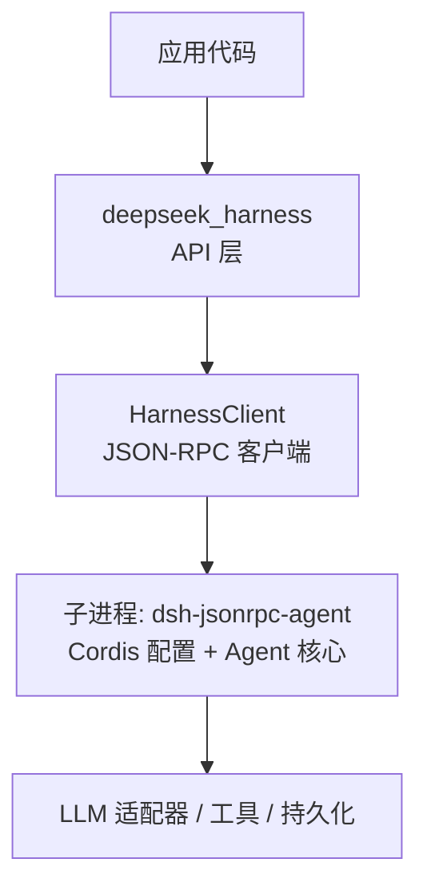
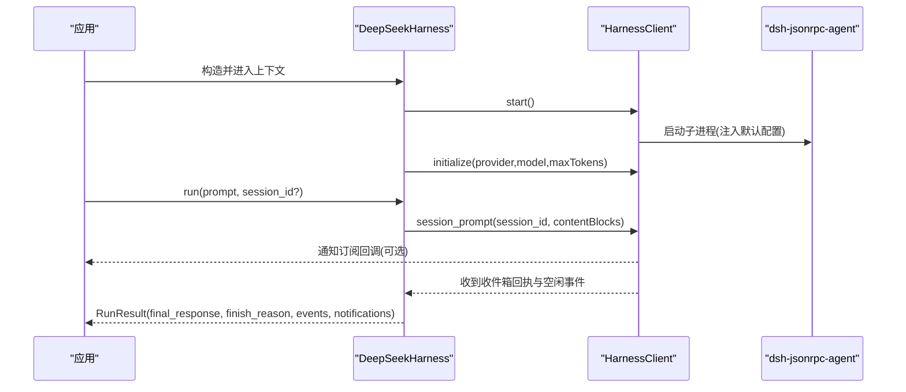
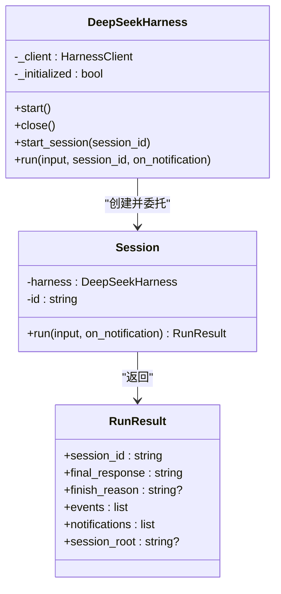
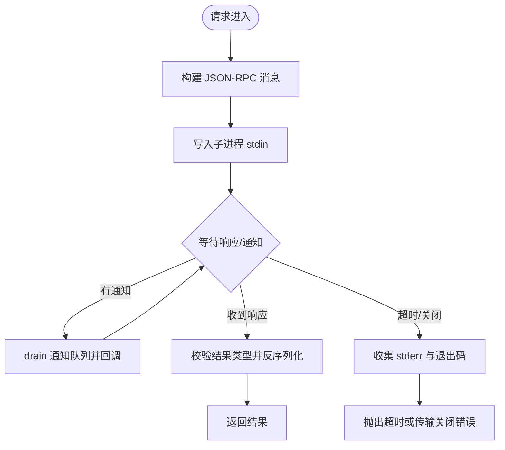
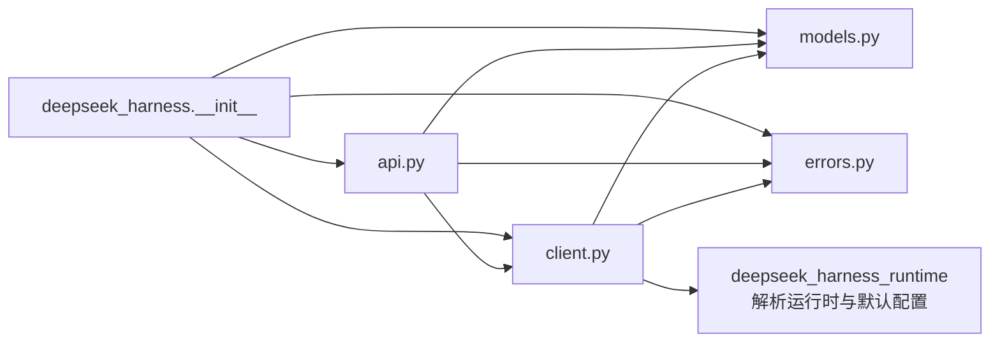

# SDK 概览

<cite>
**本文引用的文件**
- [python/sdk/README.md](file://python/sdk/README.md)
- [python/sdk/pyproject.toml](file://python/sdk/pyproject.toml)
- [python/sdk/src/deepseek_harness/__init__.py](file://python/sdk/src/deepseek_harness/__init__.py)
- [python/sdk/src/deepseek_harness/api.py](file://python/sdk/src/deepseek_harness/api.py)
- [python/sdk/src/deepseek_harness/client.py](file://python/sdk/src/deepseek_harness/client.py)
- [python/sdk/src/deepseek_harness/models.py](file://python/sdk/src/deepseek_harness/models.py)
- [python/sdk/src/deepseek_harness/errors.py](file://python/sdk/src/deepseek_harness/errors.py)
- [python/sdk-runtime/README.md](file://python/sdk-runtime/README.md)
- [docs/user/guide/python-sdk.md](file://docs/user/guide/python-sdk.md)
- [examples/jsonrpc-agent/README.md](file://examples/jsonrpc-agent/README.md)
- [examples/jsonrpc-agent/minimal.py](file://examples/jsonrpc-agent/minimal.py)
</cite>

## 目录
1. [简介](#简介)
2. [项目结构](#项目结构)
3. [核心组件](#核心组件)
4. [架构总览](#架构总览)
5. [详细组件分析](#详细组件分析)
6. [依赖关系分析](#依赖关系分析)
7. [性能与可靠性](#性能与可靠性)
8. [故障排查指南](#故障排查指南)
9. [结论](#结论)
10. [附录：快速开始与环境要求](#附录快速开始与环境要求)

## 简介
本 SDK 是 DeepSeek Harness 生态中的 Python 客户端，通过 JSON-RPC over stdio 驱动一个独立的运行时子进程。它提供高层的会话式 API（DeepSeekHarness、Session）和底层的 JSON-RPC 客户端（HarnessClient），支持通知订阅、超时控制、错误诊断以及可插拔的 Cordis 配置。SDK 默认会注入内置的运行时二进制与默认配置，使“零配置”运行成为可能；同时允许用户通过环境变量或参数完全自定义运行时行为。

## 项目结构
Python SDK 位于仓库的 python/sdk 目录，核心由以下模块组成：
- 对外暴露的高层 API：DeepSeekHarness、Session、RunResult、配置对象
- 底层 JSON-RPC 客户端：HarnessClient，负责启动/关闭子进程、读写消息、处理通知与请求
- 数据模型与错误类型：models.py、errors.py
- 包元数据与依赖：pyproject.toml
- 运行时载体说明：python/sdk-runtime 提供打包好的运行时二进制与默认配置解析能力

图表来源
- [python/sdk/src/deepseek_harness/api.py:48-124](file://python/sdk/src/deepseek_harness/api.py#L48-L124)
- [python/sdk/src/deepseek_harness/client.py:37-116](file://python/sdk/src/deepseek_harness/client.py#L37-L116)
- [python/sdk-runtime/README.md:1-30](file://python/sdk-runtime/README.md#L1-L30)

章节来源
- [python/sdk/README.md:1-52](file://python/sdk/README.md#L1-L52)
- [python/sdk/pyproject.toml:1-38](file://python/sdk/pyproject.toml#L1-L38)

## 核心组件
- DeepSeekHarness：高层入口，封装启动、初始化、会话创建与 run 流程，管理子进程生命周期
- Session：封装单次任务执行，等待收件箱回执与空闲状态，聚合事件并返回 RunResult
- HarnessClient：同步 JSON-RPC 客户端，维护子进程、线程、队列、通知订阅、超时与诊断
- models：定义 Notification、IncomingRequest、InitializeResponse、ServerInfo 等基础类型
- errors：定义 HarnessError、TransportClosedError、SdkProtocolError、JsonRpcError 等异常体系

章节来源
- [python/sdk/src/deepseek_harness/api.py:13-124](file://python/sdk/src/deepseek_harness/api.py#L13-L124)
- [python/sdk/src/deepseek_harness/client.py:24-116](file://python/sdk/src/deepseek_harness/client.py#L24-L116)
- [python/sdk/src/deepseek_harness/models.py:8-33](file://python/sdk/src/deepseek_harness/models.py#L8-L33)
- [python/sdk/src/deepseek_harness/errors.py:4-24](file://python/sdk/src/deepseek_harness/errors.py#L4-L24)

## 架构总览
SDK 采用“进程外运行时 + 标准输入输出上的 JSON-RPC 协议”的架构。应用通过 Python 进程调用 SDK，SDK 启动一个独立的可执行子进程作为运行时，并通过 stdio 进行双向通信。默认情况下，SDK 会注入内置的 Cordis 配置文件路径到子进程的环境变量中，从而无需额外配置即可运行。

图表来源
- [python/sdk/src/deepseek_harness/api.py:97-124](file://python/sdk/src/deepseek_harness/api.py#L97-L124)
- [python/sdk/src/deepseek_harness/client.py:63-155](file://python/sdk/src/deepseek_harness/client.py#L63-L155)
- [python/sdk-runtime/README.md:20-30](file://python/sdk-runtime/README.md#L20-L30)

## 详细组件分析

### 高层 API：DeepSeekHarness 与 Session
- DeepSeekHarnessConfig：集中配置 provider、model、max_tokens、工作目录、会话根目录、Cordis 配置路径、环境变量覆盖、运行时二进制选择、超时等
- DeepSeekHarness：懒启动子进程，initialize 后复用；run 内部创建 Session 并委托其执行
- Session.run：将输入标准化为内容块，发送 session/prompt，订阅会话及后代通知，等待收件箱回执与 idle 状态，提取 final_response 与 finish_reason 并返回 RunResult

图表来源
- [python/sdk/src/deepseek_harness/api.py:13-183](file://python/sdk/src/deepseek_harness/api.py#L13-L183)

章节来源
- [python/sdk/src/deepseek_harness/api.py:13-183](file://python/sdk/src/deepseek_harness/api.py#L13-L183)

### 底层客户端：HarnessClient 与 JSON-RPC 通信
- 子进程管理：start/close 使用 subprocess.Popen，stdin/stdout/stderr 以 UTF-8 文本模式读写
- 消息收发：request/notify/next_request/respond/respond_error；请求带唯一 id，响应通过队列等待
- 通知系统：subscribe_notifications/subscribe_session_notifications，支持过滤与订阅生命周期
- 超时与诊断：请求级超时、关闭时优雅 shutdown，失败时附加 stderr 尾行与退出码
- 默认配置注入：当未显式指定运行时/桥接器/启动参数且未设置 DSH_CORDIS_CONFIG 时，自动注入内置默认配置路径

图表来源
- [python/sdk/src/deepseek_harness/client.py:157-296](file://python/sdk/src/deepseek_harness/client.py#L157-L296)
- [python/sdk/src/deepseek_harness/client.py:298-422](file://python/sdk/src/deepseek_harness/client.py#L298-L422)

章节来源
- [python/sdk/src/deepseek_harness/client.py:37-558](file://python/sdk/src/deepseek_harness/client.py#L37-L558)

### 数据模型与错误
- models：Notification、IncomingRequest、InitializeResponse、ServerInfo、JsonObject/JsonValue 等
- errors：分层异常体系，便于区分传输层、协议层与业务层错误

章节来源
- [python/sdk/src/deepseek_harness/models.py:8-33](file://python/sdk/src/deepseek_harness/models.py#L8-L33)
- [python/sdk/src/deepseek_harness/errors.py:4-24](file://python/sdk/src/deepseek_harness/errors.py#L4-L24)

### 运行时载体与默认配置
- 运行时载体：生产环境为单文件可执行（exe），开发环境为 Node 闭包；两者共享同一插件集
- 默认配置：包含 JSON-RPC 服务、Agent 核心、预加载的 DeepSeek 适配器、JSONL 持久化、语义检查点策略、本地 Bash、本地文件系统提供者
- 零配置设计：SDK 在特定条件下自动注入默认配置路径，避免用户手动配置

章节来源
- [python/sdk-runtime/README.md:1-30](file://python/sdk-runtime/README.md#L1-L30)
- [python/sdk/README.md:27-49](file://python/sdk/README.md#L27-L49)

## 依赖关系分析
- 包依赖：requires-python >= 3.10；依赖 pydantic 用于数据模型校验；依赖 deepseek-harness-runtime-bin 提供运行时二进制与默认配置解析
- 模块耦合：api.py 依赖 client.py、models.py、errors.py；client.py 依赖 models.py、errors.py；__init__.py 统一导出公共接口
- 外部集成：通过环境变量 DEEPSEEK_API_KEY、DEEPSEEK_BASE_URL 与 LLM 适配器交互；通过 DSH_SESSION_ROOT、DSH_CWD 与持久化/文件系统交互

图表来源
- [python/sdk/src/deepseek_harness/__init__.py:1-20](file://python/sdk/src/deepseek_harness/__init__.py#L1-L20)
- [python/sdk/pyproject.toml:1-38](file://python/sdk/pyproject.toml#L1-L38)
- [python/sdk-runtime/README.md:20-30](file://python/sdk-runtime/README.md#L20-L30)

章节来源
- [python/sdk/pyproject.toml:1-38](file://python/sdk/pyproject.toml#L1-L38)
- [python/sdk/src/deepseek_harness/__init__.py:1-20](file://python/sdk/src/deepseek_harness/__init__.py#L1-L20)

## 性能与可靠性
- 子进程复用：DeepSeekHarness 保持运行时子进程存活，多次 run 复用会话与资源，减少启动开销
- 并发安全：使用锁保护响应表与订阅者集合；读写分离确保消息顺序与一致性
- 超时与优雅关闭：请求级超时、shutdown 超时；关闭时先发送 shutdown 请求，再终止/杀死进程，保证资源释放
- 诊断信息：传输错误或超时时附带子进程退出码与 stderr 尾部日志，便于定位问题
- 通知流控：支持按会话树过滤通知，避免无关事件干扰主流程

章节来源
- [python/sdk/src/deepseek_harness/client.py:63-116](file://python/sdk/src/deepseek_harness/client.py#L63-L116)
- [python/sdk/src/deepseek_harness/client.py:228-296](file://python/sdk/src/deepseek_harness/client.py#L228-L296)
- [python/sdk/src/deepseek_harness/client.py:386-422](file://python/sdk/src/deepseek_harness/client.py#L386-L422)

## 故障排查指南
- 传输关闭错误：当子进程退出或 stdout 关闭时抛出 TransportClosedError，通常伴随 stderr 尾行与退出码
- JSON-RPC 错误：当运行时返回 error 字段时抛出 JsonRpcError，包含 code、message、data
- 协议违规：当 turn/end 缺少 data.reason.kind 时抛出 SdkProtocolError
- 超时：请求超过 request_timeout_seconds 会抛出 TimeoutError，并附带运行时诊断信息
- 常见原因：
  - 未安装运行时二进制或平台不匹配
  - 环境变量缺失（如 DEEPSEEK_API_KEY、DEEPSEEK_BASE_URL）
  - 工作目录或会话根目录不可写
  - Cordis 配置路径错误或插件缺失

章节来源
- [python/sdk/src/deepseek_harness/errors.py:4-24](file://python/sdk/src/deepseek_harness/errors.py#L4-L24)
- [python/sdk/src/deepseek_harness/client.py:87-116](file://python/sdk/src/deepseek_harness/client.py#L87-L116)
- [python/sdk/src/deepseek_harness/client.py:228-296](file://python/sdk/src/deepseek_harness/client.py#L228-L296)
- [python/sdk/src/deepseek_harness/api.py:225-243](file://python/sdk/src/deepseek_harness/api.py#L225-L243)

## 结论
该 Python SDK 通过清晰的层次划分（高层 API 与底层 JSON-RPC 客户端）、稳健的子进程管理与通知机制，提供了易用且可扩展的 DeepSeek Harness 编程接口。配合内置运行时与默认配置，开发者可以快速上手；同时保留充分的自定义能力，满足复杂场景需求。建议在工程中合理使用会话复用、通知订阅与超时控制，以获得更好的性能与可观测性。

## 附录：快速开始与环境要求

### 环境要求
- Python 版本：>= 3.10
- 操作系统：Linux x64/arm64、macOS arm64（14+）
- 需要 DeepSeek 兼容的 API 端点与凭据
- 隔离的工作区（agent 可能修改文件）

章节来源
- [docs/user/guide/python-sdk.md:7-14](file://docs/user/guide/python-sdk.md#L7-L14)

### 安装步骤
- 从 PyPI 安装 SDK：pip install deepseek-harness-sdk
- 安装后会携带同版本的运行时二进制与默认配置，无需额外参数即可运行

章节来源
- [python/sdk/README.md:10-23](file://python/sdk/README.md#L10-L23)
- [python/sdk/pyproject.toml:5-16](file://python/sdk/pyproject.toml#L5-L16)

### 基本使用示例
- 最小用法：使用上下文管理器启动 harness 并运行一条提示
- 自定义配置：指定 provider、model、max_tokens 与 cordis 配置文件路径
- 示例脚本：examples/jsonrpc-agent/minimal.py 展示了完整的最小化用法

章节来源
- [python/sdk/README.md:18-41](file://python/sdk/README.md#L18-L41)
- [examples/jsonrpc-agent/minimal.py:16-39](file://examples/jsonrpc-agent/minimal.py#L16-L39)
- [docs/user/guide/python-sdk.md:52-81](file://docs/user/guide/python-sdk.md#L52-L81)

### JSON-RPC 通信协议工作原理
- 通信通道：stdio，每行一条 JSON 消息
- 消息类型：请求（含 id、method、params）、响应（含 id、result/error）、通知（仅 method、params）
- 客户端职责：发送请求、等待响应、处理通知、管理超时与错误
- 运行时职责：根据 Cordis 配置启动插件与服务，处理 session/prompt、turn/end、session.event 等事件
- 默认配置注入：在未显式配置时，SDK 自动注入内置默认配置路径，使运行时具备 JSON-RPC 服务、Agent 核心、LLM 适配器与持久化能力

章节来源
- [python/sdk/src/deepseek_harness/client.py:157-296](file://python/sdk/src/deepseek_harness/client.py#L157-L296)
- [python/sdk-runtime/README.md:20-30](file://python/sdk-runtime/README.md#L20-L30)
- [examples/jsonrpc-agent/README.md:1-30](file://examples/jsonrpc-agent/README.md#L1-L30)

### 与其他组件的集成方式与最佳实践
- 环境变量集成：通过 DEEPSEEK_API_KEY、DEEPSEEK_BASE_URL 对接 LLM；通过 DSH_SESSION_ROOT、DSH_CWD 控制持久化与工作目录
- Cordis 配置：通过 cordis 参数或 DSH_CORDIS_CONFIG 指定插件组合，灵活挂载工具、持久化与策略
- 会话复用：重用 harness 与 session_id 可复用 Bash 进程与状态；不同任务建议使用新的 session_id
- 通知订阅：使用 subscribe_session_notifications 获取会话及其后代的通知，结合 on_notification 实现实时反馈
- 超时与健壮性：合理设置 request_timeout_seconds 与 shutdown_timeout_seconds，捕获并记录诊断信息

章节来源
- [python/sdk/src/deepseek_harness/api.py:56-124](file://python/sdk/src/deepseek_harness/api.py#L56-L124)
- [python/sdk/src/deepseek_harness/client.py:192-210](file://python/sdk/src/deepseek_harness/client.py#L192-L210)
- [examples/jsonrpc-agent/README.md:16-30](file://examples/jsonrpc-agent/README.md#L16-L30)
- [docs/user/guide/python-sdk.md:83-104](file://docs/user/guide/python-sdk.md#L83-L104)